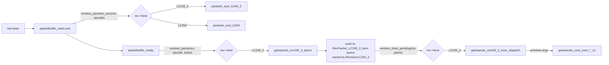

## Goals

1. Every public symbol that touches revision-specific data is named `<subsystem>_<rev>_<verb>` (e.g. `gameproto_rev245_2_exec_rebuild_normal`).
2. Each revision-specific function is a thin shim that, where logic is rev-agnostic, delegates to a versioned core function `<subsystem>_core_<verb>_v<n>` (e.g. `gameproto_core_exec_rebuild_normal_v1`). Where logic depends on the cache shape, the rev module keeps the full implementation and calls the typed cache API directly — there is no shared "cache" abstraction.
3. **No function pointers.** Polymorphism is expressed as a tagged handle: `struct Foo { enum FooKind kind; void* impl; }`, and every cross-cutting call goes through a `foo_<verb>(struct Foo*, ...)` function whose body is a `switch(foo->kind)` that casts `impl` to the concrete type.
4. The pillars the user called out get different treatments because their semantics diverge by different amounts:
   - **Cache impl** (`BuildCache` vs `BuildCacheDat`) — too different to share an interface. Wrapped in `struct Cache { kind, impl }` for ownership and identification only; **no shared accessors**. Each rev's exec calls the typed API (`buildcachedat_get_config_loc`, etc.) directly.
   - **Cache tables** (`rscache/tables/` vs `rscache/tables_dat/`) — left as-is; only the rev that uses them touches them.
   - **Network protocol** — five rev-specific sub-pieces (framing/ISAAC, inbound opcodes, inbound parsers, outbound opcodes, outbound writers) plus the login handshake. All funneled through `struct Revision`.
   - **UI defs** (INI configs + INI parser + uitree builder) — wrapped in `struct UILoader { kind, impl }` with a small dispatch surface.

## Target layout

```
src/osrs/
  core/                          (revision-agnostic; no rev-specific symbols)
    gameproto_core_exec.c/.h     // gameproto_core_exec_*_v1 (was bulk of gameproto_exec.c)
    gameproto_core_parse.c/.h    // shared rsbuf/wordpack helpers + maprebuild8_z16_x16
    gameproto_core_write.c/.h    // shared packet writers (from gameproto_packets_write.u.c)
    cache.{h,c}                  // struct Cache { kind, impl }; cache_*(c, ...) switch on kind
    ui_loader.{h,c}              // struct UILoader { kind, impl }; ui_loader_*(u, ...) switch on kind
    revision.{h,c}               // struct Revision { kind, impl }; revision_*(r, ...) switch on kind
                                 // also: revision_active() / revision_set_active(kind)

  revs/
    lc245_2/
      // -------- Network: inbound --------
      gameproto_rev245_2_packetin.h     // PKTIN_LC245_2_* enum + g_packet_in_definitions_lc245_2
                                        // moved from packetin.h
      gameproto_rev245_2_packets.h      // struct RevPacket_LC245_2 + Pkt* sub-structs
                                        // moved from packets/revpacket_lc245_2.h
      gameproto_rev245_2_framing.{c,h}  // packet_framing_rev245_2_* (size-by-opcode + ISAAC),
                                        // wraps current packetin_size_lc245_2 + ISAAC step
      gameproto_rev245_2_parse.{c,h}    // gameproto_rev245_2_parse_*  (moved from gameproto_parse.c)
      gameproto_rev245_2_exec.{c,h}     // gameproto_rev245_2_exec_*   -> core *_v1
                                        //   + gameproto_rev245_2_exec_dispatch
      gameproto_rev245_2_pktqueue.{c,h} // struct RevPacket_LC245_2_Item linked list
                                        //   (moved off GGame; reached via revision_drain_pending)
      // -------- Network: outbound --------
      gameproto_rev245_2_packetout.h    // PKTOUT_LC245_2_* enum (moved from packetout.h)
      gameproto_rev245_2_write.{c,h}    // packetout_rev245_2_* writers
                                        //   (moved from gameproto_packets_write.u.c, gameproto_out.u.c,
                                        //    plus the inline writers in interface.c / minimenu.c)
      // -------- Login --------
      loginproto_rev245_2.{c,h}         // wraps current loginproto.c (currently rev-agnostic in name only)
      // -------- Other pillars --------
      revision_lc245_2.{c,h}            // struct RevisionLC245_2 (impl payload) + factory
                                        // revision_lc245_2_new() returns struct Revision
    lc254/
      gameproto_rev254_packetin.h       // PKTIN_LC254_* (moved from packetin.h)
      gameproto_rev254_packets.h        // struct RevPacket_LC254 (new; mirror lc245_2 layout)
      gameproto_rev254_framing.{c,h}
      gameproto_rev254_parse.{c,h}      // skeleton, returns 0 for unknown opcodes
      gameproto_rev254_exec.{c,h}       // skeleton, calls gameproto_core_exec_*_v1 where applicable
      gameproto_rev254_pktqueue.{c,h}
      gameproto_rev254_packetout.h
      gameproto_rev254_write.{c,h}
      loginproto_rev254.{c,h}
      revision_lc254.{c,h}              // struct RevisionLC254 + factory
    os217/                              // already has revconfig/configs/rev_os217/

  // Cache impls already exist; we just add the tagged-handle wrapper:
  buildcachedat.{c,h}            // unchanged; cache_new_buildcachedat() returns struct Cache
  buildcache.{c,h}               // unchanged; cache_new_buildcache()    returns struct Cache

scripts/
  core/                          (rev-agnostic helpers; cachedat.lua, packet_types.lua)
  rev245_2/  pkt_dispatch.lua, init_ui.lua  (already exists)
  os217/     pkt_dispatch.lua, init_ui.lua  (new placeholder)

revconfig/configs/
  rev_245_2/  (already exists)
  rev_os217/  (already exists)
```

## Tagged-handle pattern (used everywhere)

The whole design follows one rule: **no function pointers**. A polymorphic handle is always a 2-field struct:

```c
struct Foo {
    enum FooKind kind;
    void*        impl;   // points at the concrete struct for that kind
};
```

Every cross-cutting operation is a free function whose body is a `switch (handle->kind)` that casts `handle->impl` to the concrete struct. Adding a new revision = adding new enum values + new `case` arms; the compiler's `-Wswitch-enum` flag will name every site that needs updating.

## Revision handle — `core/revision.h`

```c
enum RevisionKind {
    REVISION_KIND_INVALID = 0,
    REVISION_KIND_LC245_2 = 1,
    REVISION_KIND_LC254   = 2,
    REVISION_KIND_OS217   = 3,
};

struct Revision {
    enum RevisionKind kind;
    void*             impl;   // -> struct RevisionLC245_2 / struct RevisionLC254 / ...
};

// Free-function "methods". Each is a switch(rev->kind).
const char* revision_name(const struct Revision* rev);
const char* revision_lua_pkt_dispatch_path(const struct Revision* rev);
const char* revision_lua_init_ui_path(const struct Revision* rev);

int  revision_parse(const struct Revision* rev,
                    int pkt_type, uint8_t* data, int n,
                    void* out_packet_storage);   // caller knows the type by rev->kind

void revision_exec(const struct Revision* rev,
                   struct GGame* game, void* packet);

int  revision_packetin_size(const struct Revision* rev, int pkt_type);

// One per concrete rev, lives in revs/<rev>/revision_<rev>.c
struct Revision revision_lc245_2_new(void);
struct Revision revision_lc254_new(void);

// Process-wide active rev (one per binary for now).
const struct Revision* revision_active(void);
void                   revision_set_active(struct Revision rev);
```

Implementation in `core/revision.c` (illustrative):

```c
void revision_exec(const struct Revision* rev, struct GGame* g, void* packet) {
    switch (rev->kind) {
    case REVISION_KIND_LC245_2:
        gameproto_rev245_2_exec_dispatch(
            (struct RevisionLC245_2*)rev->impl, g, (struct RevPacket_LC245_2*)packet);
        break;
    case REVISION_KIND_LC254:
        gameproto_rev254_exec_dispatch(
            (struct RevisionLC254*)rev->impl, g, (struct RevPacket_LC254*)packet);
        break;
    case REVISION_KIND_OS217: /* TODO */ break;
    case REVISION_KIND_INVALID: assert(false); break;
    }
}
```

Each rev's `revision_<rev>.c` only exposes a factory that returns a `struct Revision`; it never installs callbacks anywhere.

## Cache handle — `core/cache.h` (tag + opaque impl, no accessors)

`BuildCache` and `BuildCacheDat` are too different to share an interface (different table sets, different lifecycles, different jagfile-vs-rsbuf input model). The cache is wrapped purely so generic infrastructure (factory, ownership, the Lua sidecar) can hold and free a cache without naming the concrete type. **No `cache_get_*` accessors exist.**

```c
enum CacheKind {
    CACHE_KIND_INVALID       = 0,
    CACHE_KIND_BUILDCACHE    = 1,   // src/osrs/buildcache.{c,h}     (rscache/tables flow)
    CACHE_KIND_BUILDCACHEDAT = 2,   // src/osrs/buildcachedat.{c,h}  (rscache/tables_dat flow)
};

struct Cache {
    enum CacheKind kind;
    void*          impl;   // -> struct BuildCache / struct BuildCacheDat
};

// The ONLY operations on struct Cache:
struct Cache cache_new_buildcache(void);            // wraps buildcache_new()
struct Cache cache_new_buildcachedat(void);         // wraps buildcachedat_new()
void         cache_free(struct Cache* c);           // switches kind -> buildcache_free / buildcachedat_free
enum CacheKind cache_kind(const struct Cache* c);

// Typed unwrap helpers (assert-checked) for rev modules that already know what they hold:
struct BuildCacheDat* cache_as_buildcachedat(const struct Cache* c);  // asserts kind == BUILDCACHEDAT
struct BuildCache*    cache_as_buildcache   (const struct Cache* c);  // asserts kind == BUILDCACHE
```

`core/cache.c` only contains: the two factories, `cache_free` (one switch), and the two assert-checked unwrap helpers. That's it. Adding a future cache type adds two enum values + two factory + one `cache_free` arm — and **zero** changes to any exec/parse/UI code that wasn't already going to be rewritten for the new cache.

### How exec uses the cache

`struct GGame` already has typed `buildcache` and `buildcachedat` fields. We add one new field, `struct Cache cache;`, that names which one is "the active cache for this revision" — used by:

- `cache_free(&game->cache)` at shutdown.
- The Lua sidecar API surface (`Game.Cache.kind()`) so scripts can branch when needed.
- New code that wants to assert "this rev's cache is what I expect" before calling typed APIs.

But `gameproto_rev245_2_exec_*` does **not** route through `struct Cache`. It calls `buildcachedat_get_config_loc(game->buildcachedat, id)` directly, exactly as today. The rev module's contract is "I am the LC245_2 module; my cache is `BuildCacheDat`; I know it; I use the typed API." Symmetrically, a future LC254 rev would call `buildcache_get_config_location(game->buildcache, id)` directly.

### What this implies for `gameproto_core_exec_*_v1`

Versioned core functions exist **only** for logic that does not touch the cache (or that takes already-resolved POD data as args). Examples from today's `gameproto_exec_rebuild_normal_world` ([src/osrs/gameproto_exec.c](src/osrs/gameproto_exec.c) lines 419–507): the entity carryover and base-tile shift logic operates on `World` and primitive offsets — that becomes `gameproto_core_exec_rebuild_normal_world_v1(struct World*, int zonex, int zonez)`. The shim `gameproto_rev245_2_exec_rebuild_normal` reads the LC245*2 packet, may pre-resolve any cache-keyed data via `buildcachedat*\*`, then calls the core helper.

If a function fundamentally needs cache lookups interleaved with logic, **it stays in the rev module** rather than being forced into a fake-shared core. We accept duplication across revs over a leaky abstraction.

## Network protocol — fully per-rev

The network stack is the most rev-sensitive piece. It splits cleanly into five sub-pieces, each with the same shim+core split. All inbound API is funneled through `struct Revision`; the core never sees an LC245_2 opcode constant or a `RevPacket_LC245_2*`.

### Sub-pieces and where each lives

| Piece                          | Today                                                                                                                                                                                                                                                                                                                                            | After                                                                                                                                                                                                                                                                                     |
| ------------------------------ | ------------------------------------------------------------------------------------------------------------------------------------------------------------------------------------------------------------------------------------------------------------------------------------------------------------------------------------------------ | ----------------------------------------------------------------------------------------------------------------------------------------------------------------------------------------------------------------------------------------------------------------------------------------- |
| Frame ISAAC + length           | [src/osrs/packetbuffer.c](src/osrs/packetbuffer.c) `packetsize()` switches on `enum GameProtoRevision` and calls `packetin_size_lc254` / `packetin_size_lc245_2`.                                                                                                                                                                                | `core/packetbuffer.{c,h}` keeps the state machine but calls `revision_packetin_size(rev, opcode)` → switch on `rev->kind` → `packetin_size_lc245_2`.                                                                                                                                      |
| Inbound opcode tables          | [src/osrs/packetin.h](src/osrs/packetin.h) holds **all** revs' enums in one file.                                                                                                                                                                                                                                                                | One header per rev: `revs/<rev>/gameproto_<rev>_packetin.h`. Core has no inbound-opcode header.                                                                                                                                                                                           |
| Inbound parsers                | `gameproto_parse_lc245_2()` in [src/osrs/gameproto_parse.c](src/osrs/gameproto_parse.c) (~470 lines).                                                                                                                                                                                                                                            | Move verbatim to `revs/lc245_2/gameproto_rev245_2_parse.c`. Sub-parsers that are bit-identical across revs (e.g. `gameproto_packet_maprebuild8_z16_x16` from [src/osrs/gameproto_packets.u.c](src/osrs/gameproto_packets.u.c)) move to `core/gameproto_core_parse.c` with a `_v1` suffix. |
| Inbound exec (already in plan) | `gameproto_exec.c`                                                                                                                                                                                                                                                                                                                               | `revs/lc245_2/gameproto_rev245_2_exec.c` shims → `core/gameproto_core_exec_*_v1`.                                                                                                                                                                                                         |
| Outbound opcodes + writers     | [src/osrs/packetout.h](src/osrs/packetout.h) is LC245_2-only today. Writers live half in [src/osrs/gameproto_packets_write.u.c](src/osrs/gameproto_packets_write.u.c) / [src/osrs/gameproto_out.u.c](src/osrs/gameproto_out.u.c) and half inline in [src/osrs/interface.c](src/osrs/interface.c) and [src/osrs/minimenu.c](src/osrs/minimenu.c). | Move opcodes to `revs/<rev>/gameproto_<rev>_packetout.h`. Move writers to `revs/<rev>/gameproto_<rev>_write.c` named `packetout_rev245_2_<verb>`. Pure byte-layout helpers (e.g. `p1`/`p2`/`pjstr`) stay in core.                                                                         |

### Inbound dispatch flow after refactor



### Network API on `struct Revision`

Added to `core/revision.h` (all switch-on-kind in `core/revision.c`):

```c
// Inbound framing (called by packetbuffer state machine)
int  revision_packetin_size(const struct Revision* rev, int opcode);

// Inbound parse: writes parsed packet into rev-owned storage, returns 1 on success.
// Caller does NOT need to know the packet struct type; it never escapes the rev module.
int  revision_parse_and_enqueue(const struct Revision* rev,
                                struct GGame* game,
                                int opcode, uint8_t* data, int n);

// Inbound exec: drains the rev's pending-packet queue.
void revision_drain_pending(const struct Revision* rev, struct GGame* game);

// Outbound: stable opcode-agnostic API the core / UI / input layers call.
// Each is implemented per rev in gameproto_<rev>_write.c.
int  revision_write_move_gameclick (const struct Revision* rev, uint8_t* out, int cap, int x, int z, int run);
int  revision_write_if_button      (const struct Revision* rev, uint8_t* out, int cap, int component_id);
int  revision_write_chat_setmode   (const struct Revision* rev, uint8_t* out, int cap, int pub, int prv, int trd);
int  revision_write_message_public (const struct Revision* rev, uint8_t* out, int cap, const char* text);
int  revision_write_logout         (const struct Revision* rev, uint8_t* out, int cap);
// ... one per logical user action; opcode numbers never appear in callers.
```

The body of every `revision_write_*` is one switch:

```c
int revision_write_move_gameclick(const struct Revision* rev, uint8_t* out, int cap,
                                  int x, int z, int run) {
    switch (rev->kind) {
    case REVISION_KIND_LC245_2:
        return packetout_rev245_2_move_gameclick(out, cap, x, z, run);
    case REVISION_KIND_LC254:
        return packetout_rev254_move_gameclick(out, cap, x, z, run);
    case REVISION_KIND_OS217: /* TODO */ return 0;
    case REVISION_KIND_INVALID: assert(false); return 0;
    }
    return 0;
}
```

This means call sites in `interface.c` / `minimenu.c` / `tori_rs_input.u.c` change from raw `p1(..., PKTOUT_LC245_2_MOVE_GAMECLICK)` to `revision_write_move_gameclick(revision_active(), ...)` and become rev-agnostic.

### Outbound shim → versioned core (mirrors inbound exec)

Every `packetout_rev245_2_<verb>` follows the same shim+core split as `gameproto_rev245_2_exec_*`. The shim's only rev-specific responsibility is **the opcode byte**; the payload byte layout is in a versioned core function.

```c
// revs/lc245_2/gameproto_rev245_2_write.c
int packetout_rev245_2_move_gameclick(uint8_t* out, int cap, int x, int z, int run) {
    assert(cap >= 1);
    out[0] = PKTOUT_LC245_2_MOVE_GAMECLICK;     // rev-specific opcode
    int n = gameproto_core_write_move_gameclick_v1(out + 1, cap - 1, x, z, run);  // shared payload
    return 1 + n;
}

// core/gameproto_core_write.c — no opcode constants, just byte layout
int gameproto_core_write_move_gameclick_v1(uint8_t* payload, int cap, int x, int z, int run) {
    struct RSBuffer b = { .data = payload, .size = cap, .position = 0 };
    p1(&b, run);
    p2(&b, x);
    p2(&b, z);
    return b.position;
}
```

For writers whose payload format diverges between revs, no `_v1` core helper is created — the shim contains the full body. For writers that use ISAAC opcode masking before emit, the shim handles ISAAC after writing the opcode byte (still in the rev module since ISAAC seed handling is itself a per-rev concern).

The pattern is structurally identical to inbound exec:

| Inbound                                                                                                | Outbound                                                                                                       |
| ------------------------------------------------------------------------------------------------------ | -------------------------------------------------------------------------------------------------------------- |
| `gameproto_rev245_2_exec_dispatch` switches on opcode → calls `gameproto_rev245_2_exec_<verb>`         | callers invoke `revision_write_<verb>` → switches on rev->kind → calls `packetout_rev245_2_<verb>`             |
| `gameproto_rev245_2_exec_<verb>` reads packet fields, calls `gameproto_core_exec_<verb>_v1(prim args)` | `packetout_rev245_2_<verb>` writes opcode byte, calls `gameproto_core_write_<verb>_v1(payload buf, prim args)` |
| `gameproto_core_exec_<verb>_v1` knows zero rev-specifics                                               | `gameproto_core_write_<verb>_v1` writes only the payload, no opcode                                            |

So `core/gameproto_core_write.c` mirrors `core/gameproto_core_exec.c`: a flat list of `_v1` functions taking primitives and a buffer, with zero knowledge of any rev's opcode numbering.

### Pending-packet queue moves off `GGame`

[src/osrs/game.h](src/osrs/game.h) currently embeds:

```c
struct RevPacket_LC245_2_Item* packets_lc245_2;   // hardcoded LC245_2 type on GGame
```

After refactor: that field is removed. The linked list lives inside `struct RevisionLC245_2` (the `impl` payload of the active `struct Revision`). Core code that asks "are there packets to process?" calls `revision_has_pending(rev)`; core code that runs them calls `revision_drain_pending(rev, game)`.

### Login handshake

[src/osrs/loginproto.c](src/osrs/loginproto.c) is named generically but is in fact LC245_2-shaped (RSA block layout, jag_checksum slots, expected response codes). It moves to `revs/lc245_2/loginproto_rev245_2.{c,h}` and the core gets:

```c
struct LoginProto;   // opaque
struct LoginProto* revision_loginproto_new(const struct Revision* rev,
                                           struct Isaac* in, struct Isaac* out,
                                           struct rsa* rsa,
                                           const char* user, const char* pass,
                                           int32_t* jag_checksum);
int  revision_loginproto_recv(const struct Revision* rev, struct LoginProto* lp, uint8_t* d, int n);
int  revision_loginproto_send(const struct Revision* rev, struct LoginProto* lp, uint8_t* d, int cap);
int  revision_loginproto_poll(const struct Revision* rev, struct LoginProto* lp);
```

The struct `LoginProto` is opaque to the core; each rev has its own concrete struct. Same switch-on-kind pattern.

### What stays in core (`core/gameproto_core_*`)

- Byte-stream helpers (`p1` / `p2` / `pjstr` / `g1` / `g2` / `gjstr` / `wordpack_*`) — already in [src/osrs/rscache/rsbuf.c](src/osrs/rscache/rsbuf.c) and [src/osrs/wordpack.c](src/osrs/wordpack.c); kept as-is.
- `core/packetbuffer.{c,h}` — the framing state machine itself; the only rev-aware call it makes is `revision_packetin_size(rev, op)`.
- `core/gameproto_core_exec.{c,h}` — `gameproto_core_exec_*_v1` taking primitive / POD args, no opcode constants.
- `core/gameproto_core_parse.{c,h}` — `gameproto_core_parse_*_v1` byte-stable sub-parsers reused by multiple revs.
- `core/gameproto_core_write.{c,h}` — `gameproto_core_write_*_v1` payload writers that emit only the body, never an opcode byte.

## UI loader handle — `core/ui_loader.h`

```c
enum UILoaderKind {
    UI_LOADER_KIND_INVALID  = 0,
    UI_LOADER_KIND_REV245_2 = 1,   // INI-driven, wraps BuildCacheDat + revconfig/uitree_load
    UI_LOADER_KIND_OS217    = 2,
};

struct UILoader {
    enum UILoaderKind kind;
    void*             impl;   // -> struct UILoaderRev245_2 / struct UILoaderOS217
};

struct UILoader ui_loader_rev245_2_new(struct GGame* game);   // factory
void            ui_loader_load(const struct UILoader* u, struct GGame* game);
const char*     ui_loader_ini_path(const struct UILoader* u); // "rev_245_2/rev_245_2_ui.ini"
```

Same single-switch dispatch pattern in `core/ui_loader.c`.

## Naming convention — exec example

Migrate [src/osrs/gameproto_exec.c](src/osrs/gameproto_exec.c) into two layers:

- `revs/lc245_2/gameproto_rev245_2_exec.c` — one shim per packet type:

```c
void gameproto_rev245_2_exec_rebuild_normal(struct GGame* g, struct RevPacket_LC245_2* p) {
    gameproto_core_exec_rebuild_normal_v1(g, p->_map_rebuild.zonex, p->_map_rebuild.zonez);
}

void gameproto_rev245_2_exec_dispatch(
    struct RevisionLC245_2* self,
    struct GGame* g,
    struct RevPacket_LC245_2* p)
{
    switch (p->packet_type) {
    case PKTIN_LC245_2_REBUILD_NORMAL: gameproto_rev245_2_exec_rebuild_normal(g, p); break;
    /* ... other LC245_2 cases ... */
    }
}
```

- `core/gameproto_core_exec.c` — version-tagged core impls that take primitive args (or a stable `GameRebuildArgsV1` POD), never `RevPacket_LC245_2`:

```c
void gameproto_core_exec_rebuild_normal_v1(struct GGame* g, int zonex, int zonez) { ... }
```

`revision_exec(rev, game, packet)` in `core/revision.c` switches on `rev->kind` and calls `gameproto_rev245_2_exec_dispatch(...)`. The core has zero knowledge of LC245_2 opcode numbers and contains zero function pointers.

## Migration order (safe, incremental)

```mermaid
flowchart TD
    scaffoldHandles[1. Add Revision/Cache/UILoader tagged-handle headers + dispatch switches]
    moveFiles[2. Move existing files into core/ and revs/lc245_2/ verbatim]
    splitInbound[3. Split inbound network: framing + packetin tables + parse + exec; queue moves off GGame]
    splitOutbound[4. Split outbound network: packetout enum + writers; replace raw p1/PKTOUT_LC245_2_* sites with revision_write_*]
    splitLogin[5. Move loginproto under revs/lc245_2/ behind revision_loginproto_*]
    cacheWrap[6. Add struct Cache (tag + opaque impl + free + factories only). NO accessors. Each rev keeps calling buildcachedat_* / buildcache_* directly]
    uiWrap[7. Wire struct UILoader; ui_loader_load picks INI via switch on kind]
    luaDispatch[8. Drive script_convert_to_lua names from revision_lua_*_path]
    addLc254[9. Stand up lc254/ skeleton; add REVISION_KIND_LC254 arms to every switch]

    scaffoldHandles --> moveFiles --> splitInbound --> splitOutbound --> splitLogin --> cacheWrap --> uiWrap --> luaDispatch --> addLc254
```

Each step compiles and runs; LC245_2 keeps working throughout. After step 9, `-Wswitch-enum` will flag any future site that forgets to handle a new revision.

## Concrete first edits

- New: `core/revision.{h,c}`, `core/cache.{h,c}`, `core/ui_loader.{h,c}` — all using the tagged-handle pattern, no function pointers.
- New: `revs/lc245_2/revision_lc245_2.{c,h}` defining `struct RevisionLC245_2` (which owns the pending-packet queue + the LoginProto + a `struct Cache`) and `revision_lc245_2_new()`.
- Replace [src/osrs/gameproto_revisions.h](src/osrs/gameproto_revisions.h) `enum GameProtoRevision` with `enum RevisionKind` in `core/revision.h` (keep an alias typedef for the transition).
- Move [src/osrs/packetbuffer.c](src/osrs/packetbuffer.c) into `core/packetbuffer.c`; replace its `packetsize()` switch with one call to `revision_packetin_size(rev, op)`.
- Move LC245_2 inbound opcode enum + table + `packetin_size_lc245_2` / `packetin_code_lc245_2` out of [src/osrs/packetin.h](src/osrs/packetin.h) into `revs/lc245_2/gameproto_rev245_2_packetin.h`. Same for LC254 → `revs/lc254/gameproto_rev254_packetin.h`. After this, `packetin.h` only holds the `PKTIN_LENGTH_VARU8/16` constants and `struct PacketInDefinition`.
- Move LC245_2 outbound opcode enum out of [src/osrs/packetout.h](src/osrs/packetout.h) into `revs/lc245_2/gameproto_rev245_2_packetout.h`.
- Migrate every outbound writer in two layers:
  - **Rev shim** in `revs/lc245_2/gameproto_rev245_2_write.c` named `packetout_rev245_2_<verb>` — writes the rev's opcode byte (and ISAAC if applicable) then delegates the payload to the core helper.
  - **Versioned core** in `core/gameproto_core_write.c` named `gameproto_core_write_<verb>_v1` — pure payload byte layout via `p1`/`p2`/`pjstr`, no opcode knowledge.
  - Sources to migrate: [src/osrs/gameproto_out.u.c](src/osrs/gameproto_out.u.c) (`packetin_write_rebuild_region`), [src/osrs/gameproto_packets_write.u.c](src/osrs/gameproto_packets_write.u.c) (`gameproto_packet_write_maprebuild8_z16_x16`), and the inline writers in [src/osrs/interface.c](src/osrs/interface.c), [src/osrs/minimenu.c](src/osrs/minimenu.c), [src/osrs/tori_rs_input.u.c](src/osrs/tori_rs_input.u.c), [src/osrs/tori_rs_cycle.u.c](src/osrs/tori_rs_cycle.u.c).
- Replace each raw `p1(..., PKTOUT_LC245_2_*)` call site with `revision_write_<verb>(revision_active(), ...)`.
- Remove `struct RevPacket_LC245_2_Item* packets_lc245_2;` from [src/osrs/game.h](src/osrs/game.h); the queue lives inside `struct RevisionLC245_2` and is reached via `revision_drain_pending`.
- Move [src/osrs/loginproto.{c,h}](src/osrs/loginproto.h) into `revs/lc245_2/loginproto_rev245_2.{c,h}`; expose only `revision_loginproto_*` from core.
- Update [src/tori_rs_scripts.u.c](src/tori_rs_scripts.u.c) so `SCRIPT_PKT_DISPATCH` / `SCRIPT_INIT_UI` call `revision_lua_pkt_dispatch_path(revision_active())` instead of the hardcoded `"rev245_2/pkt_dispatch.lua"`.
- Update [src/tori_rs_net.u.c](src/tori_rs_net.u.c) `net_process_packets` to call `revision_parse_and_enqueue(revision_active(), game, opcode, data, n)` instead of `gameproto_parse_lc245_2` + `push_packet_lc245_2`.
- Update [src/osrs/gameproto_process.c](src/osrs/gameproto_process.c) to check `revision_has_pending(revision_active())`; the Lua `pkt_dispatch.lua` then calls a new `Game.Revision.exec_pending()` Lua API which calls `revision_drain_pending`.
- [CMakeLists.txt](CMakeLists.txt): list `src/osrs/core/*.c` + every enabled `src/osrs/revs/<rev>/*.c`. All revs compile in; `revision_set_active()` picks one at startup.

## Out of scope for this pass

- Rewriting `BuildCache` / `BuildCacheDat` internals or unifying their APIs; we only put a thin tagged ownership wrapper on top of each.
- Routing world.c / interface.c cache reads through `struct Cache`. They keep their current typed `BuildCacheDat*` field — that's the whole point: the rev module knows its cache type.
- Touching the painter / scene2 / soft3d layers — those are already revision-agnostic.
- Implementing real LC254 logic; we only stand up the skeleton to validate the seam.

## Risks / things to confirm before coding

- `RevPacket_LC245_2` is currently embedded in `struct GGame` (`packets_lc245_2` linked list). We'll keep the typed list owned by the lc245_2 module, with a core entrypoint `revision_drain_pending_packets(rev, game)` whose body switches on `rev->kind` and calls `gameproto_rev245_2_drain_pending(...)` for the LC245_2 case.
- The `void*` payload for parsed packets is fully type-erased at the core boundary. Callers learn the concrete type from `rev->kind` (e.g. "kind == REVISION_KIND_LC245_2 implies the packet pointer is `struct RevPacket_LC245_2*`"). This is the explicit cost of forbidding function pointers; documented at every dispatch site.
- All revs compile into one binary. If you later want a single-rev build, `revision_active()` can become a compile-time constant returning a static `struct Revision`; nothing else changes.

---

## Detailed task breakdown

Each subsection below corresponds to one todo. They are ordered to match the migration flowchart and **must be done in order** (each step assumes the previous step compiled and ran). For every step:

- **Read-first** lists the files an executor should view before touching anything, in order. Prefer reading whole files unless they are listed as "(skim)".
- **Add / Modify / Delete** lists exact paths.
- **Steps** are imperative and concrete.
- **Acceptance** is the verifiable signal that the step is complete.

A note on naming, repeated here so the executor doesn't have to scroll: **rev shim** functions are named `<subsystem>_rev245_2_<verb>` or `packetout_rev245_2_<verb>`; **versioned core** functions are named `<subsystem>_core_<verb>_v<n>`; **dispatch** functions on `struct Revision` are named `revision_<verb>`.

### Todo 1 — `scaffold`

**Goal**: Add the three tagged-handle headers + `core/revision.c` body. After this step, `struct Revision` exists, can be set/get globally, and exposes empty switch-on-kind dispatchers (one `case REVISION_KIND_LC245_2` arm each, returning `0` / no-op for now). Nothing else is rewired yet.

**Read-first**:

- [src/osrs/gameproto_revisions.h](src/osrs/gameproto_revisions.h) (full)
- [src/osrs/game.h](src/osrs/game.h) (full — to know what fields exist on `GGame`)
- [src/osrs/buildcache.h](src/osrs/buildcache.h) and [src/osrs/buildcachedat.h](src/osrs/buildcachedat.h) (skim — only need top-level `struct` names)
- [CMakeLists.txt](CMakeLists.txt) lines 100–215 (the `osrs/*.c` source list)

**Add**:

- `src/osrs/core/revision.h`: define `enum RevisionKind { REVISION_KIND_INVALID, REVISION_KIND_LC245_2, REVISION_KIND_LC254, REVISION_KIND_OS217 }`, `struct Revision { enum RevisionKind kind; void* impl; }`, declare `revision_active()`, `revision_set_active(struct Revision)`, plus stub declarations for every dispatcher named in the "Network API on `struct Revision`" section above (`revision_packetin_size`, `revision_parse_and_enqueue`, `revision_drain_pending`, `revision_has_pending`, all `revision_write_*` listed there, `revision_loginproto_*`, `revision_lua_pkt_dispatch_path`, `revision_lua_init_ui_path`, `revision_name`).
- `src/osrs/core/revision.c`: file-scope `static struct Revision g_active = {0}`. Implement `revision_active()`, `revision_set_active()`. Implement every dispatcher with a single `switch (rev->kind)` and one `case REVISION_KIND_LC245_2:` arm that for now `assert(false && "lc245_2 not implemented yet")` and returns 0 / void. The other arms `assert(false)`. Use `-Wswitch-enum` discipline: every enum value listed.
- `src/osrs/core/cache.h`: `enum CacheKind { CACHE_KIND_INVALID, CACHE_KIND_BUILDCACHE, CACHE_KIND_BUILDCACHEDAT }`, `struct Cache { enum CacheKind kind; void* impl; }`, declare `cache_new_buildcache`, `cache_new_buildcachedat`, `cache_free`, `cache_kind`, `cache_as_buildcache`, `cache_as_buildcachedat`. **No accessors.**
- `src/osrs/core/cache.c`: implement the six functions above. Factories call existing `buildcache_new()` / `buildcachedat_new()`. `cache_free` switches on kind and calls the existing typed free. The `cache_as_*` helpers `assert(c->kind == ...)` then return `(struct BuildCache*)c->impl`.
- `src/osrs/core/ui_loader.h`: `enum UILoaderKind { UI_LOADER_KIND_INVALID, UI_LOADER_KIND_REV245_2, UI_LOADER_KIND_OS217 }`, `struct UILoader { kind, impl; }`, declare `ui_loader_load(const struct UILoader*, struct GGame*)` and `ui_loader_ini_path(const struct UILoader*)`.
- `src/osrs/core/ui_loader.c`: stub bodies that `assert(false)` for now.

**Modify**:

- [CMakeLists.txt](CMakeLists.txt): add the four new `.c` files to the `osrs/*.c` source list (around lines 100–215).
- [src/osrs/game.h](src/osrs/game.h): add `#include "osrs/core/revision.h"` and `#include "osrs/core/cache.h"`. Add new fields to `struct GGame`: `struct Cache cache;` (zero-initialised; not yet populated). Do **not** remove `packets_lc245_2` yet (that happens in todo 5).

**Acceptance**: Project builds (`cmake --build build`). No symbol is yet calling any of the new dispatchers, so nothing asserts at runtime. `nm build/.../torirs.o | grep revision_` shows the new symbols.

### Todo 2 — `move`

**Goal**: Move existing files to their new homes verbatim (no logic changes), update `#include` paths, keep the build green. This is a pure file-shuffle so subsequent splits have a clean per-rev directory to edit in place.

**Read-first**:

- [src/osrs/packetin.h](src/osrs/packetin.h) (full — 572 lines, contains all rev opcode tables)
- [src/osrs/packetout.h](src/osrs/packetout.h) (full — 106 lines)
- [src/osrs/gameproto_parse.c](src/osrs/gameproto_parse.c) (full — 553 lines)
- [src/osrs/gameproto_exec.c](src/osrs/gameproto_exec.c) (full — 1580 lines)
- [src/osrs/gameproto_exec.h](src/osrs/gameproto_exec.h) (full)
- [src/osrs/gameproto_revisions.h](src/osrs/gameproto_revisions.h)
- [src/osrs/gameproto_lc254.u.c](src/osrs/gameproto_lc254.u.c)
- [src/osrs/gameproto_packets.u.c](src/osrs/gameproto_packets.u.c)
- [src/osrs/gameproto_packets_write.u.c](src/osrs/gameproto_packets_write.u.c)
- [src/osrs/gameproto_out.u.c](src/osrs/gameproto_out.u.c)
- [src/osrs/packetbuffer.c](src/osrs/packetbuffer.c) and [src/osrs/packetbuffer.h](src/osrs/packetbuffer.h)
- [src/osrs/loginproto.h](src/osrs/loginproto.h) and [src/osrs/loginproto.c](src/osrs/loginproto.c)
- [src/osrs/packets/revpacket_lc245_2.h](src/osrs/packets/revpacket_lc245_2.h) and the rest of `src/osrs/packets/`
- [src/osrs/revs/revpacket_lc245_2_query.c](src/osrs/revs/revpacket_lc245_2_query.c) and `.h`

**Add (new files = git-mv of existing content, then update header guards)**:

Per-rev directory:

- `src/osrs/revs/lc245_2/gameproto_rev245_2_packetin.h` ← copy of [src/osrs/packetin.h](src/osrs/packetin.h) trimmed to only `enum PacketInType_LC245_2`, the `g_packet_in_definitions_lc245_2` table, `packetin_size_lc245_2`, `packetin_code_lc245_2`. Also keep the shared bits at top: `PKTIN_LENGTH_VARU8/U16`, `struct PacketInDefinition`, `PACKET_DEFINITION` macro — but those go in core (see below); include the core header from this file.
- `src/osrs/revs/lc245_2/gameproto_rev245_2_packetout.h` ← `enum PacketOutType_LC245_2` from [src/osrs/packetout.h](src/osrs/packetout.h).
- `src/osrs/revs/lc245_2/gameproto_rev245_2_packets.h` ← whole content of [src/osrs/packets/revpacket_lc245_2.h](src/osrs/packets/revpacket_lc245_2.h).
- `src/osrs/revs/lc245_2/gameproto_rev245_2_parse.h` and `.c` ← whole content of [src/osrs/gameproto_parse.h](src/osrs/gameproto_parse.h) and [src/osrs/gameproto_parse.c](src/osrs/gameproto_parse.c). Rename the function `gameproto_parse_lc245_2` to `gameproto_rev245_2_parse` (and all call sites elsewhere in the repo). Keep the include of `gameproto_lc254.u.c` for now; move that next.
- `src/osrs/revs/lc245_2/gameproto_rev245_2_exec.h` and `.c` ← whole content of [src/osrs/gameproto_exec.h](src/osrs/gameproto_exec.h) and [src/osrs/gameproto_exec.c](src/osrs/gameproto_exec.c). Functions keep their current names for this step; renaming happens in todo 6.
- `src/osrs/revs/lc245_2/gameproto_rev245_2_pktnpcinfo.{c,h}` ← move [src/osrs/packets/pkt_npc_info.{c,h}](src/osrs/packets/pkt_npc_info.h).
- `src/osrs/revs/lc245_2/gameproto_rev245_2_pktplayerinfo.{c,h}` ← move [src/osrs/packets/pkt_player_info.{c,h}](src/osrs/packets/pkt_player_info.h).
- `src/osrs/revs/lc245_2/gameproto_rev245_2_pktmaprebuild.h` ← move [src/osrs/packets/pkt_map_rebuild.h](src/osrs/packets/pkt_map_rebuild.h).
- `src/osrs/revs/lc245_2/loginproto_rev245_2.{c,h}` ← move [src/osrs/loginproto.{c,h}](src/osrs/loginproto.h). No symbol renames yet (todo 8 does that).
- `src/osrs/revs/lc245_2/gameproto_rev245_2_query.{c,h}` ← move [src/osrs/revs/revpacket_lc245_2_query.{c,h}](src/osrs/revs/revpacket_lc245_2_query.h).

LC254 directory (for the .u.c file that's already there):

- `src/osrs/revs/lc254/gameproto_rev254_packetin.h` ← copy of `enum PacketInType_LC254` + `packetin_size_lc254` from [src/osrs/packetin.h](src/osrs/packetin.h).
- `src/osrs/revs/lc254/gameproto_rev254_lc254.u.c` ← move [src/osrs/gameproto_lc254.u.c](src/osrs/gameproto_lc254.u.c) (rename later).

Core directory (just the platform-neutral file moves; new core content is in later todos):

- `src/osrs/core/packetbuffer.{c,h}` ← move [src/osrs/packetbuffer.{c,h}](src/osrs/packetbuffer.h). Contents unchanged.
- `src/osrs/core/packetin_shared.h` ← extract from [src/osrs/packetin.h](src/osrs/packetin.h) the bits that are not rev-specific: `PKTIN_LENGTH_VARU8`, `PKTIN_LENGTH_VARU16`, `struct PacketInDefinition`, `PACKET_DEFINITION` macro, `enum PacketInType_Dane317` (or move that to lc245_2 if not used; check first via Grep).
- `src/osrs/core/gameproto_packets_shared.{c,h}` ← move [src/osrs/gameproto_packets.u.c](src/osrs/gameproto_packets.u.c) (the `gameproto_packet_maprebuild8_z16_x16` helper). It's already shared between revs.

**Modify**:

- Every `#include "osrs/packetin.h"` site in the codebase: split into `#include "osrs/core/packetin_shared.h"` (for the shared constants/struct) and `#include "osrs/revs/lc245_2/gameproto_rev245_2_packetin.h"` (for callers that need the LC245_2 enum). Use Grep + judgment.
- Every `#include "osrs/packetout.h"` site: replace with `#include "osrs/revs/lc245_2/gameproto_rev245_2_packetout.h"`.
- Every `#include "osrs/gameproto_parse.h"` and `osrs/gameproto_exec.h`: replace with the new `revs/lc245_2/...` path.
- Every `#include "osrs/packets/revpacket_lc245_2.h"` etc.: replace with the new `revs/lc245_2/...` path.
- Every `#include "osrs/loginproto.h"`: replace with `osrs/revs/lc245_2/loginproto_rev245_2.h`.
- Every `#include "osrs/packetbuffer.h"`: replace with `osrs/core/packetbuffer.h`.
- All `gameproto_parse_lc245_2(...)` call sites: rename to `gameproto_rev245_2_parse(...)`.
- [src/tori_rs.c](src/tori_rs.c) line 12 includes `gameproto_packets_write.u.c` directly — keep this for now, but it will move in todo 7.
- [CMakeLists.txt](CMakeLists.txt) lines 100–215: replace each old path with its new path. Add an `include_directories` (or `target_include_directories`) entry for `src/osrs/core` and `src/osrs/revs/lc245_2` if the existing setup doesn't already pick them up via the existing `src/` root include.

**Delete** (after successful build):

- The old [src/osrs/packetin.h](src/osrs/packetin.h), [src/osrs/packetout.h](src/osrs/packetout.h), [src/osrs/gameproto_parse.{c,h}](src/osrs/gameproto_parse.h), [src/osrs/gameproto_exec.{c,h}](src/osrs/gameproto_exec.h), [src/osrs/gameproto_lc254.u.c](src/osrs/gameproto_lc254.u.c), [src/osrs/gameproto_packets.u.c](src/osrs/gameproto_packets.u.c), [src/osrs/packetbuffer.{c,h}](src/osrs/packetbuffer.h), [src/osrs/loginproto.{c,h}](src/osrs/loginproto.h), the entire [src/osrs/packets/](src/osrs/packets/) directory, and [src/osrs/revs/revpacket_lc245_2_query.{c,h}](src/osrs/revs/revpacket_lc245_2_query.h).

**Acceptance**: `cmake --build build` succeeds with no source code logic changes; the binary still launches and processes packets exactly as before. `git status` shows large file moves only; `git diff` on the moved file content (with `--find-renames=80%`) is near-empty modulo `#include` paths and header guards.

### Todo 3 — `split-inbound-framing`

**Goal**: Replace the `enum GameProtoRevision` switch inside `core/packetbuffer.c::packetsize()` with a single `revision_packetin_size(rev, op)` call. The opcode-table machinery moves out of any "shared" location and lives only in `revs/lc245_2/gameproto_rev245_2_packetin.h`.

**Read-first**:

- `src/osrs/core/packetbuffer.c` (post-move; what was `packetbuffer.c`)
- `src/osrs/revs/lc245_2/gameproto_rev245_2_packetin.h` (post-move; verify `packetin_size_lc245_2` is there)
- `src/osrs/core/revision.{h,c}` (the stub `revision_packetin_size` from todo 1)

**Add**: nothing new; just edit existing files.

**Modify**:

- `src/osrs/core/revision.c`: implement `revision_packetin_size`. Body:
  ```c
  int revision_packetin_size(const struct Revision* rev, int opcode) {
      switch (rev->kind) {
      case REVISION_KIND_LC245_2: return packetin_size_lc245_2(opcode);
      case REVISION_KIND_LC254:   return packetin_size_lc254(opcode);
      case REVISION_KIND_OS217:   assert(false); return 0;
      case REVISION_KIND_INVALID: assert(false); return 0;
      }
      return 0;
  }
  ```
  Add `#include "osrs/revs/lc245_2/gameproto_rev245_2_packetin.h"` and `#include "osrs/revs/lc254/gameproto_rev254_packetin.h"` to `core/revision.c`. (Yes, core includes per-rev headers; only this single dispatch file is allowed to do so. This is the explicit cost of avoiding function pointers.)
- `src/osrs/core/packetbuffer.c`: delete the `packetsize(...)` static function and the `enum GameProtoRevision revision` field on `struct PacketBuffer`. Replace each call site of `packetsize(packetbuffer->revision, packet_type)` with `revision_packetin_size(revision_active(), packet_type)`. Add `#include "osrs/core/revision.h"`.
- `src/osrs/core/packetbuffer.h`: remove `enum GameProtoRevision revision;` from `struct PacketBuffer`. Update `packetbuffer_init` signature: drop the `enum GameProtoRevision` parameter.
- Every caller of `packetbuffer_init(...)` (Grep `packetbuffer_init`): drop the rev arg.

**Delete**:

- `enum GameProtoRevision` from `src/osrs/gameproto_revisions.h` if `enum RevisionKind` (added in todo 1) is the replacement; otherwise add a `typedef enum RevisionKind GameProtoRevision;` alias and a `static inline` mapping for the legacy enum values, and delete `gameproto_revisions.h` only after Grep confirms no other usage.

**Acceptance**: Build succeeds. Connect to a server (or run any unit test under `test/`); inbound framing still produces the same `packetbuffer_packet_type` for every observed opcode. The grep `revision` field no longer exists on PacketBuffer.

### Todo 4 — `split-inbound-parse`

**Goal**: Funnel inbound parsing through `revision_parse_and_enqueue` and put bit-stable sub-parsers (`maprebuild8_z16_x16`) into `core/gameproto_core_parse.c` with `_v1` names.

**Read-first**:

- `src/osrs/revs/lc245_2/gameproto_rev245_2_parse.c` (the renamed parser)
- `src/osrs/core/gameproto_packets_shared.h` (post-move; the `maprebuild8_z16_x16` helper)
- [src/tori_rs_net.u.c](src/tori_rs_net.u.c) lines 100–155 (current `gameproto_parse_lc245_2` call site + `push_packet_lc245_2` helper)

**Add**:

- `src/osrs/core/gameproto_core_parse.h` and `.c`: declare and implement `gameproto_core_parse_maprebuild8_z16_x16_v1(uint8_t* data, int n, int* out_zonex, int* out_zonez)`. Body is the `g2/g2/assert` from `gameproto_packet_maprebuild8_z16_x16` (which currently does nothing useful but reads the two ints; replicate exactly). Mark the file as the place where future `_v1` shared sub-parsers go.

**Modify**:

- `src/osrs/revs/lc245_2/gameproto_rev245_2_parse.c`: in the `case PKTIN_LC245_2_REBUILD_NORMAL` block, replace the inline `g2/g2` with a call to `gameproto_core_parse_maprebuild8_z16_x16_v1(...)`. Confirm byte-for-byte equivalence.
- `src/osrs/revs/lc245_2/gameproto_rev245_2_parse.h`: declare `int gameproto_rev245_2_parse_and_enqueue(struct GGame* game, int opcode, uint8_t* data, int n)`. Implement it in `.c`: it calls the existing parser, then on success appends a new `RevPacket_LC245_2_Item` to the queue. The queue currently lives on `GGame` (`packets_lc245_2`); leave it there for now — todo 5 moves it.
- `src/osrs/core/revision.c`: implement `revision_parse_and_enqueue` as a switch that calls `gameproto_rev245_2_parse_and_enqueue` for `REVISION_KIND_LC245_2`. `assert(false)` for other kinds.
- [src/tori_rs_net.u.c](src/tori_rs_net.u.c) `net_process_packets` (lines ~127–152): replace the `struct RevPacket_LC245_2 packet; ...; gameproto_parse_lc245_2(...); ...; push_packet_lc245_2(...)` block with a single `revision_parse_and_enqueue(revision_active(), game, opcode, data, n)`. Move `push_packet_lc245_2` from `tori_rs_net.u.c` into `gameproto_rev245_2_parse.c` (it becomes a static helper inside the parse-and-enqueue function).
- Delete `gameproto_packets_shared.{c,h}` if `core/gameproto_core_parse.{c,h}` fully supersedes it.

**Acceptance**: Build succeeds. Connect; parsing still produces identical packet structs; `pkt_dispatch.lua` still drains them via the existing exec path.

### Todo 5 — `pktqueue-off-ggame`

**Goal**: Remove the LC245_2-specific queue field from `struct GGame`. The pending-packet linked list lives inside `struct RevisionLC245_2`.

**Read-first**:

- `src/osrs/revs/lc245_2/gameproto_rev245_2_parse.c` (especially `push_packet_lc245_2` and `gameproto_rev245_2_parse_and_enqueue`)
- [src/osrs/game.h](src/osrs/game.h) (find `packets_lc245_2`, `RevPacket_LC245_2_Item`)
- [src/osrs/gameproto_process.c](src/osrs/gameproto_process.c) (full)
- All Grep hits for `packets_lc245_2` (should now be just GGame field + push helper + Lua sidecar)

**Add**:

- `src/osrs/revs/lc245_2/revision_lc245_2.{c,h}`:
  ```c
  // .h
  struct RevisionLC245_2 {
      struct RevPacket_LC245_2_Item* pending_head;
      // future fields: own LoginProto, own struct Cache reference, own UI loader, etc.
  };
  struct Revision revision_lc245_2_new(void);
  void revision_lc245_2_free(struct Revision* rev);
  // Internal API used only by core/revision.c dispatchers:
  bool gameproto_rev245_2_has_pending(struct RevisionLC245_2* self);
  void gameproto_rev245_2_drain_pending(struct RevisionLC245_2* self, struct GGame* game);
  void gameproto_rev245_2_enqueue(struct RevisionLC245_2* self, struct RevPacket_LC245_2* pkt);
  ```
  `revision_lc245_2_new()` allocates a `struct RevisionLC245_2` and returns `(struct Revision){ .kind = REVISION_KIND_LC245_2, .impl = self }`. `gameproto_rev245_2_drain_pending` walks the list, calls `gameproto_exec_lc245_2(game, &item->packet)` for each (this exec function will be renamed in todo 6), then frees the items.
- Add `revision_has_pending` and `revision_drain_pending` to `src/osrs/core/revision.{h,c}`. Implementations switch on kind and call the LC245_2 helpers above.

**Modify**:

- [src/osrs/game.h](src/osrs/game.h): delete `struct RevPacket_LC245_2_Item* packets_lc245_2;`. Add `struct Revision revision;` (initialized in `game_new` to `revision_lc245_2_new()`).
- [src/osrs/game.c](src/osrs/game.c) (or wherever GGame is constructed; check via Grep `game_new` / `GGame *new`): construct `game->revision = revision_lc245_2_new()`. Free with `revision_lc245_2_free(&game->revision)` in the dual destruction site.
- `src/osrs/revs/lc245_2/gameproto_rev245_2_parse.c::gameproto_rev245_2_parse_and_enqueue`: change from "append to `game->packets_lc245_2`" to "append via `gameproto_rev245_2_enqueue((struct RevisionLC245_2*)game->revision.impl, &packet)`". Add an `assert(game->revision.kind == REVISION_KIND_LC245_2)`.
- [src/osrs/gameproto_process.c](src/osrs/gameproto_process.c): change `if (!game->packets_lc245_2) return;` to `if (!revision_has_pending(&game->revision)) return;`.
- The existing exec path lives in `pkt_dispatch.lua` which calls a Lua-bound C function that drains the queue. Find that binding (`Grep -n "packets_lc245_2"` in `src/osrs/lua_sidecar/`), and rewire it to call `revision_drain_pending(&game->revision, game)`.

**Delete**:

- `struct RevPacket_LC245_2_Item` definition from [src/osrs/game.h](src/osrs/game.h); move it to `src/osrs/revs/lc245_2/revision_lc245_2.h` (or `gameproto_rev245_2_packets.h`) since only the rev module needs it.

**Acceptance**: Build succeeds; `pkt_dispatch.lua` still drains packets each tick. Grep `packets_lc245_2` returns zero hits outside `revs/lc245_2/`.

### Todo 6 — `split-exec`

**Goal**: Apply the shim+core split to the 50+ exec functions in `gameproto_rev245_2_exec.c`. After this step, the file contains only thin wrappers; the actual logic lives in `core/gameproto_core_exec.c` with `_v1` names. The big switch becomes `gameproto_rev245_2_exec_dispatch`.

**Read-first**:

- `src/osrs/revs/lc245_2/gameproto_rev245_2_exec.c` (full — the renamed file; ~1580 lines)
- `src/osrs/revs/lc245_2/gameproto_rev245_2_exec.h` (full)
- [src/osrs/world.c](src/osrs/world.c) lines 318–510 (`world_buildcachedat_rebuild_centerzone` and friends — the rev-named cache function it currently uses)
- Grep `gameproto_exec_` in the codebase (call sites of all exec entrypoints)

**Process for each exec function** (apply mechanically to all ~50):

1. Look at the function body. Classify it:
   - **(a) cache-coupled or world-shape-coupled** (touches `game->buildcachedat`, `world_*_buildcachedat_*`, or any LC245_2-specific table type): keep the body fully in the rev shim. Do not extract.
   - **(b) primitive / POD-only logic**: extract to a `_v1` core helper.
2. For (a), simply rename the function from `gameproto_exec_<verb>` → `gameproto_rev245_2_exec_<verb>` and change the parameter from `struct RevPacket_LC245_2*` to a typed `struct Pkt<...> *` if the shim chooses to, or keep `struct RevPacket_LC245_2*` and read the union member inside.
3. For (b), create `gameproto_core_exec_<verb>_v1(struct GGame*, prim args...)` in `src/osrs/core/gameproto_core_exec.{c,h}` and make the shim a one-liner.
4. Worked example — `rebuild_normal` (already partially done at [src/osrs/gameproto_exec.c](src/osrs/gameproto_exec.c) lines 377–507):
   - Shim `gameproto_rev245_2_exec_rebuild_normal(g, p)` reads `p->_map_rebuild.zonex/zonez`, computes `dx/dz`, calls `world_buildcachedat_rebuild_centerzone(...)` itself (because that touches BuildCacheDat), then calls `gameproto_core_exec_rebuild_normal_world_v1(g->world, zonex, zonez, dx, dz)` for the entity carryover loops (the cache-free part of the current `gameproto_exec_rebuild_normal_world`).
   - Core `gameproto_core_exec_rebuild_normal_world_v1` contains the loops that shift NPC/player/loc/projectile positions by `(dx, dz)` — the section from `gameproto_exec.c:439–501`.

**Add**:

- `src/osrs/core/gameproto_core_exec.{c,h}`: list `_v1` extracted bodies. Group with brief section comments matching the source order (`/* --- player_info --- */`, `/* --- inventory --- */`, etc.).

**Modify**:

- `src/osrs/revs/lc245_2/gameproto_rev245_2_exec.{c,h}`: rename every `gameproto_exec_<verb>` → `gameproto_rev245_2_exec_<verb>`. Replace bodies with shims as described.
- Rename the big switch `gameproto_exec_lc245_2(game, packet)` → `gameproto_rev245_2_exec_dispatch(game, packet)`. (It does not need a `struct RevisionLC245_2*` arg since it doesn't touch instance state; keep the same signature.)
- `src/osrs/revs/lc245_2/revision_lc245_2.c::gameproto_rev245_2_drain_pending`: call `gameproto_rev245_2_exec_dispatch` for each item (instead of the old `gameproto_exec_lc245_2`).
- Update Grep `gameproto_exec_` call sites elsewhere (mostly the Lua sidecar — `lua_game.c`) to the new `gameproto_rev245_2_exec_*` names.

**Acceptance**: Build succeeds; in-game behaviour is identical to before. `nm` on the binary shows the new `gameproto_core_exec_*_v1` symbols and the `gameproto_rev245_2_exec_*` shims; the old `gameproto_exec_*` names are gone.

### Todo 7 — `split-outbound`

**Goal**: Same shim+core split for outbound packet writers. After this step, no file outside `revs/lc245_2/` references `PKTOUT_LC245_2_*`. Call sites use `revision_write_<verb>(revision_active(), ...)`.

**Read-first**:

- `src/osrs/revs/lc245_2/gameproto_rev245_2_packetout.h` (post-move; the LC245_2 enum)
- [src/osrs/gameproto_out.u.c](src/osrs/gameproto_out.u.c) (full; defines `packetin_write_rebuild_region`)
- [src/osrs/gameproto_packets_write.u.c](src/osrs/gameproto_packets_write.u.c) (full; defines `gameproto_packet_write_maprebuild8_z16_x16`)
- [src/osrs/interface.c](src/osrs/interface.c) lines 1560–1640 and any other `PKTOUT_LC245_2_*` hit (`Grep PKTOUT_LC245_2_ src/osrs/interface.c -n` shows 10 sites in one function: `interface_send_inv_action`)
- [src/osrs/minimenu.c](src/osrs/minimenu.c) (1 site; Grep)
- [src/osrs/rscache/rsbuf.h](src/osrs/rscache/rsbuf.h) and `.c` (the `p1`/`p2`/`pjstr` helpers used by writers)
- [src/tori_rs.c](src/tori_rs.c) line 12 — `#include "osrs/gameproto_packets_write.u.c"` (ugly but must be retargeted)

**Add**:

- `src/osrs/core/gameproto_core_write.{c,h}`: list `gameproto_core_write_<verb>_v1(uint8_t* payload, int cap, prim args...)` payload writers. Include `osrs/rscache/rsbuf.h`. For now seed it with `gameproto_core_write_rebuild_region_v1` and `gameproto_core_write_maprebuild8_z16_x16_v1` (extracted bodies from the two `.u.c` files, payload-only — opcode bytes removed).
- `src/osrs/revs/lc245_2/gameproto_rev245_2_write.{c,h}`: list `packetout_rev245_2_<verb>(uint8_t* out, int cap, prim args...)` shims for every outbound action used in the codebase. Each:
  ```c
  int packetout_rev245_2_<verb>(uint8_t* out, int cap, ...) {
      assert(cap >= 1);
      out[0] = PKTOUT_LC245_2_<VERB>;
      int n = gameproto_core_write_<verb>_v1(out + 1, cap - 1, ...);
      return 1 + n;
  }
  ```
  For inv action / op buttons (the 10 sites in `interface.c` that all use the same payload pattern: `p2(component_id), p2(slot), p2(obj_id)`), create one core helper `gameproto_core_write_inv_action_v1` and ten shims (`packetout_rev245_2_inv_button1` ... `packetout_rev245_2_opheld5`).

**Modify**:

- `src/osrs/core/revision.{h,c}`: add a `revision_write_<verb>` declaration and dispatch arm for every shim added in `gameproto_rev245_2_write.h`. The shim and the dispatcher have the same parameter list except for the leading `const struct Revision*`.
- [src/osrs/interface.c](src/osrs/interface.c) `interface_send_inv_action` (around line 1568+): replace the `opcode = PKTOUT_LC245_2_*; ... p1(buf, opcode); p2(...); ...` pattern with a single `int n = revision_write_inv_action(revision_active(), buf, sizeof buf, action, component_id, slot, obj_id);`. (Or: ten distinct `revision_write_<button>` calls, depending on how `action` selects the opcode — pick whichever shape touches fewer outer-loop conditionals.)
- [src/osrs/minimenu.c](src/osrs/minimenu.c) PKTOUT site: same treatment.
- [src/tori_rs.c](src/tori_rs.c) line 12: replace `#include "osrs/gameproto_packets_write.u.c"` with `#include "osrs/core/gameproto_core_write.h"` and add `core/gameproto_core_write.c` to the source list (the `.u.c` was being compiled by being included; the new file is a normal compilation unit).

**Delete**:

- [src/osrs/gameproto_out.u.c](src/osrs/gameproto_out.u.c) (its single function moved to core).
- [src/osrs/gameproto_packets_write.u.c](src/osrs/gameproto_packets_write.u.c) (same).

**Acceptance**: Build succeeds; outbound bytes on the wire are identical (compare via tcpdump or the existing net debug logs). `Grep PKTOUT_LC245_2_` finds zero hits outside `src/osrs/revs/lc245_2/`.

### Todo 8 — `split-login`

**Goal**: Move `loginproto.{c,h}` (already shifted in todo 2) behind `revision_loginproto_*` dispatchers. The struct `LoginProto` becomes opaque to core code.

**Read-first**:

- `src/osrs/revs/lc245_2/loginproto_rev245_2.{c,h}` (post-move)
- All `Grep loginproto_` hits across the codebase ([src/tori_rs_net.u.c](src/tori_rs_net.u.c), [src/osrs/game.h](src/osrs/game.h), tests under `test/`)

**Add**:

- New declarations in `src/osrs/core/revision.h`:
  ```c
  // LoginProto remains opaque at this layer.
  struct LoginProto;
  struct LoginProto* revision_loginproto_new(const struct Revision* rev,
                                             struct Isaac* in, struct Isaac* out,
                                             struct rsa* rsa, char* user, char* pass,
                                             int32_t* jag_checksum);
  void revision_loginproto_free(const struct Revision* rev, struct LoginProto* lp);
  int  revision_loginproto_recv(const struct Revision* rev, struct LoginProto* lp, uint8_t* d, int n);
  int  revision_loginproto_send(const struct Revision* rev, struct LoginProto* lp, uint8_t* d, int cap);
  int  revision_loginproto_poll(const struct Revision* rev, struct LoginProto* lp);
  ```
  Implementations in `src/osrs/core/revision.c` are 5 single-arm switches that call the LC245*2-named functions (which are still named `loginproto*_`from the pre-move world; rename them to`loginproto*rev245_2*_` here).

**Modify**:

- `src/osrs/revs/lc245_2/loginproto_rev245_2.{c,h}`: rename every `loginproto_<verb>` → `loginproto_rev245_2_<verb>`. The struct `LoginProto` keeps its name (stays opaque to core).
- Every caller of `loginproto_*` outside `revs/lc245_2/`: replace with `revision_loginproto_*`.
- [src/osrs/game.h](src/osrs/game.h): the `struct LoginProto* loginproto;` field stays as-is (opaque).

**Acceptance**: Build succeeds; login handshake works against a server. Grep `loginproto_` outside `revs/lc245_2/` and `core/revision.c` returns zero hits.

### Todo 9 — `cache-tagged`

**Goal**: Wire the `struct Cache` field on `GGame` (declared in todo 1) so it actually owns the cache lifecycle. This step does **not** route any reads through it; it's purely about ownership/identification.

**Read-first**:

- `src/osrs/core/cache.{h,c}` (from todo 1)
- [src/osrs/game.c](src/osrs/game.c) or wherever `GGame` is constructed (Grep `game_new`, `buildcachedat_new`)
- All Grep hits for `buildcachedat_new(` (current ownership site)

**Modify**:

- Find the single site that calls `buildcachedat_new()` to populate `game->buildcachedat`. Replace with:
  ```c
  game->cache = cache_new_buildcachedat();   // returns struct Cache { CACHE_KIND_BUILDCACHEDAT, impl }
  game->buildcachedat = cache_as_buildcachedat(&game->cache);  // typed alias for in-rev code
  ```
- Find the matching free site (`buildcachedat_free`). Replace with `cache_free(&game->cache); game->buildcachedat = NULL;`.
- `revision_lc245_2_new()` (from todo 5): does **not** allocate the cache; the cache is owned by `GGame`, not by the rev (because the cache outlives a hypothetical mid-session rev switch in the LoginProto-but-no-game-yet phase).

**Acceptance**: Build succeeds; `cache_kind(&game->cache) == CACHE_KIND_BUILDCACHEDAT` at runtime. No code reads through `cache_get_*` (because none exist). `valgrind`-style runs show no leak around shutdown.

### Todo 10 — `ui-iface`

**Goal**: Implement `ui_loader_load` so the active UI INI file is selected by `rev->kind`, not hardcoded.

**Read-first**:

- [src/osrs/revconfig/uitree_load.h](src/osrs/revconfig/uitree_load.h) (full)
- [src/osrs/revconfig/uitree_load.c](src/osrs/revconfig/uitree_load.c) (skim — find `uitree_from_revconfig_buildcachedat` and the entry point used by `init_ui.lua`)
- [src/osrs/scripts/rev245_2/init_ui.lua](src/osrs/scripts/rev245_2/init_ui.lua) (already read above; lines 55–61 show the INI path strings)
- `src/osrs/core/ui_loader.{h,c}` (from todo 1)

**Add**:

- `src/osrs/revs/lc245_2/ui_rev245_2.{c,h}`: define `struct UILoaderRev245_2 { /* nothing yet */ }`. Implement `struct UILoader ui_loader_rev245_2_new(void)` returning `(struct UILoader){ UI_LOADER_KIND_REV245_2, NULL }` (impl can be NULL since the struct is empty for now). Implement `ui_loader_rev245_2_ini_path()` returning `"rev_245_2/rev_245_2_ui.ini"` and `ui_loader_rev245_2_cache_ini_path()` returning `"rev_245_2/rev_245_2_cache.ini"`.

**Modify**:

- `src/osrs/core/ui_loader.c`: implement `ui_loader_ini_path(u)` as a switch returning the per-rev path. `ui_loader_load(u, game)` likewise dispatches to a `ui_loader_rev245_2_load(game)` helper which today does nothing (the actual loading is currently driven from Lua). The point is the seam exists.
- `src/osrs/core/revision.h`: add `const struct UILoader* revision_ui_loader(const struct Revision* rev);`. Implementation in `revision.c` switches on kind and returns a `static const struct UILoader` for the LC245_2 case.
- [src/osrs/scripts/rev245_2/init_ui.lua](src/osrs/scripts/rev245_2/init_ui.lua) lines 55–58: leave for now. (The script is itself rev-specific and lives under `scripts/rev245_2/`; the next todo handles which Lua script the C code asks for.)

**Acceptance**: Build succeeds; in-game UI loads exactly as before (the script path is unchanged at this point — todo 11 changes that). Grep `"rev_245_2/rev_245_2_ui.ini"` finds the string only inside `src/osrs/revs/lc245_2/ui_rev245_2.c`.

### Todo 11 — `lua-dispatch`

**Goal**: Replace the hardcoded `"rev245_2/pkt_dispatch.lua"` and `"rev245_2/init_ui.lua"` strings in [src/tori_rs_scripts.u.c](src/tori_rs_scripts.u.c) with `revision_lua_pkt_dispatch_path(rev)` / `revision_lua_init_ui_path(rev)`. Reorganise `src/osrs/scripts/` so per-rev scripts live in `<rev>/` and shared helpers in `core/`.

**Read-first**:

- [src/tori_rs_scripts.u.c](src/tori_rs_scripts.u.c) (full — already shown above)
- `src/osrs/scripts/` directory contents (`Glob src/osrs/scripts/**/*.lua`)
- [src/osrs/scripts/rev245_2/pkt_dispatch.lua](src/osrs/scripts/rev245_2/pkt_dispatch.lua) (skim — already mostly rev-specific)
- [src/osrs/scripts/rev245_2/init_ui.lua](src/osrs/scripts/rev245_2/init_ui.lua) (already read)
- [src/osrs/scripts/cachedat.lua](src/osrs/scripts/cachedat.lua), `cache.lua`, `init_cache_dat.lua`, `packet_types.lua`, `empty.lua`

**Add**:

- `src/osrs/scripts/core/`: move `cachedat.lua`, `cache.lua`, `init_cache_dat.lua`, `packet_types.lua`, `empty.lua`, `lua_cache_fnnos.h` here (these are rev-agnostic helpers).
- `src/osrs/scripts/core/game/`: move `load_camera.lua`, `load_cullmap.lua`, `save_camera.lua`, `spawn_element.lua` from `src/osrs/scripts/game/` here.

**Modify**:

- `src/osrs/core/revision.c`: implement `revision_lua_pkt_dispatch_path` and `revision_lua_init_ui_path` as `switch (rev->kind) { case REVISION_KIND_LC245_2: return "rev245_2/pkt_dispatch.lua"; ... }`.
- [src/tori_rs_scripts.u.c](src/tori_rs_scripts.u.c) line 29: replace `set_name(out, "rev245_2/init_ui.lua")` with `set_name(out, revision_lua_init_ui_path(revision_active()))`.
- [src/tori_rs_scripts.u.c](src/tori_rs_scripts.u.c) line 45: same for `pkt_dispatch.lua`.
- For the shared scripts (`init_cache_dat.lua`, `game/load_cullmap.lua`, etc.) — those live in `core/` after the move, so prefix the path: `set_name(out, "core/init_cache_dat.lua")`. Verify the Lua loader `package.path` (Grep `package.path` in [src/osrs/lua_scripts.c](src/osrs/lua_scripts.c)) includes both `src/osrs/scripts/?.lua` and `src/osrs/scripts/core/?.lua`.
- [CMakeLists.txt](CMakeLists.txt) lines 320–355 + 580–586: the `${CMAKE_SOURCE_DIR}/src/osrs/scripts` path is added to a copy/embed step. Adjust if the embed step needs to know about the new `core/` subdir (often it's fine because it's recursive).

**Acceptance**: Build succeeds; game starts and runs identically. Grep `"rev245_2/"` finds zero hits in `src/` outside `src/osrs/core/revision.c`.

### Todo 12 — `lc254-skeleton`

**Goal**: Stand up `revs/lc254/` with empty stubs and add `case REVISION_KIND_LC254:` to every dispatch switch in `core/revision.c`. This validates the seam — adding a future revision is now a strictly local change to a new directory + adding `case` arms.

**Read-first**:

- `src/osrs/revs/lc254/gameproto_rev254_packetin.h` (post-todo-2 move)
- `src/osrs/revs/lc254/gameproto_rev254_lc254.u.c` (post-todo-2 move; almost-empty file)
- The full set of `revision_*` dispatchers in `src/osrs/core/revision.c` (compile-time list via `Grep "^[a-z_]+" src/osrs/core/revision.c`)

**Add**:

- `src/osrs/revs/lc254/gameproto_rev254_packets.h`: `struct RevPacket_LC254 { enum PacketInType_LC254 packet_type; union { ... } _; };` — leave the union with one stub member for now.
- `src/osrs/revs/lc254/gameproto_rev254_packetout.h`: `enum PacketOutType_LC254 { ... };` empty for now.
- `src/osrs/revs/lc254/gameproto_rev254_parse.{c,h}`: `int gameproto_rev254_parse_and_enqueue(struct GGame*, int, uint8_t*, int) { return 0; }`.
- `src/osrs/revs/lc254/gameproto_rev254_exec.{c,h}`: `void gameproto_rev254_exec_dispatch(struct GGame*, struct RevPacket_LC254*) {}`.
- `src/osrs/revs/lc254/gameproto_rev254_write.{c,h}`: empty file with header guards; will be populated as outbound packets are needed.
- `src/osrs/revs/lc254/loginproto_rev254.{c,h}`: stub functions returning `LOGINPROTO_ERROR`.
- `src/osrs/revs/lc254/revision_lc254.{c,h}`: `struct RevisionLC254 { struct RevPacket_LC254_Item* pending_head; }; struct Revision revision_lc254_new(void) { ... }`.
- `src/osrs/revs/lc254/ui_rev254.{c,h}`: `struct UILoader ui_loader_rev254_new(void)` returning `UI_LOADER_KIND_REV254, NULL`. (Add the enum value to `core/ui_loader.h`.)

**Modify**:

- `src/osrs/core/revision.c`: every switch now has a real `case REVISION_KIND_LC254:` arm calling the LC254 stubs (no `assert(false)` for that case any more).
- `src/osrs/core/cache.h`: `CACHE_KIND_BUILDCACHE` arm for `cache_free` already added in todo 9; ensure it actually exists.
- [CMakeLists.txt](CMakeLists.txt): add `src/osrs/revs/lc254/*.c` to the source list. All revs compile in.
- `revision_lua_pkt_dispatch_path` etc.: add a `REVISION_KIND_LC254 → "rev_lc254/pkt_dispatch.lua"` arm; create `src/osrs/scripts/rev_lc254/pkt_dispatch.lua` and `init_ui.lua` as no-op scripts (`-- TODO`).

**Acceptance**: Build succeeds with `-Wswitch-enum -Werror=switch-enum` (add to [CMakeLists.txt](CMakeLists.txt) for the `osrs` target only) — every switch on `enum RevisionKind` and `enum CacheKind` and `enum UILoaderKind` has all enum values handled. Setting `revision_set_active(revision_lc254_new())` at startup brings up an empty client that doesn't process any packets but doesn't crash either. The "real" LC245_2 path is unchanged.
