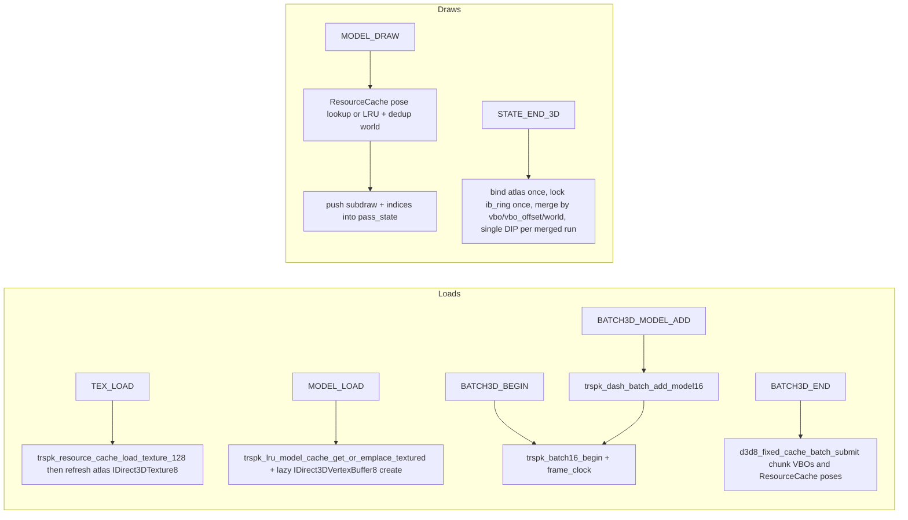

# d3d8_fixed → TRSPK refactor (atlas primary, per-id seam preserved)

## Scope decisions (per follow-up)

- **Atlas is the primary path**. We use `TRSPK_ResourceCache` with a real atlas, `trspk_dash_batch_add_model16` (textured variant) for batch staging, baked atlas UVs, single MODULATE state, animation baked into UVs via `frame_clock`. This matches the d3d8 backend (`[d3d8/d3d8_3d_cache.cpp](src/platforms/ToriRSPlatformKit/src/backends/d3d8/d3d8_3d_cache.cpp)`).
- **Per-id binding path stays reachable** via a runtime mode flag on `D3D8FixedInternal` (`enum D3D8FixedTextureMode { ATLAS = 0, PER_ID = 1 }`). The pass state always carries per-subdraw `tex_id`/`opaque`/`anim_signed` so flipping back is just a different submit branch + a different load-time bake helper. Default at init is `ATLAS`.
- **Submit at `STATE_END_3D`** (mirrors d3d8 backend `trspk_d3d8_event_state_end_3d`).
- **Texture / sprite / font hashmaps**: sprites + fonts keep their per-id `IDirect3DTexture8` maps (the atlas is for world textures only — sprites and fonts were never atlas-eligible in either backend). World texture map (`texture_by_id`, `texture_anim_speed_by_id`, `texture_opaque_by_id`) is dropped in atlas mode and only allocated when mode == `PER_ID`.

## Why this satisfies the request

1. *Batch loads using the trspk*: `BATCH3D_*` and per-model `MODEL_LOAD` route through `trspk_batch16_*` + `trspk_dash_batch_add_model16` + `trspk_resource_cache_*` + `trspk_lru_model_cache_*`. Texture loads route through `trspk_resource_cache_load_texture_128` and a refresh into the atlas `IDirect3DTexture8`.
2. *Batch 3D draws / minimize state changes / lookup tables instead of hashmaps / submit at end*: `MODEL_DRAW` events stage face runs into a `D3D8FixedPassState`; one `submit_pass` walks the buffer, merges consecutive subdraws sharing `(vbo, vbo_offset, world_idx)` into one `DrawIndexedPrimitive`, and sets state only when it actually changes. In atlas mode, `tex_id` is irrelevant for binding (atlas is bound once per pass), so merging is purely VBO/world-bounded — strictly more aggressive than the d3d8_old churn pattern.

## Files

- New: [src/platforms/ToriRSPlatformKit/src/backends/d3d8_fixed/d3d8_fixed_pass.cpp](src/platforms/ToriRSPlatformKit/src/backends/d3d8_fixed/d3d8_fixed_pass.cpp) — pass state, append subdraw, submit (mode-aware), reset.
- New: [src/platforms/ToriRSPlatformKit/src/backends/d3d8_fixed/d3d8_fixed_pass.h](src/platforms/ToriRSPlatformKit/src/backends/d3d8_fixed/d3d8_fixed_pass.h) — declarations.
- New: [src/platforms/ToriRSPlatformKit/src/backends/d3d8_fixed/d3d8_fixed_cache.cpp](src/platforms/ToriRSPlatformKit/src/backends/d3d8_fixed/d3d8_fixed_cache.cpp) — atlas tex load/refresh into a single managed `IDirect3DTexture8`; `cache_batch_submit` / `cache_batch_clear`; per-id-fallback create/release helpers gated on mode.
- Edited: [d3d8_fixed_internal.h](src/platforms/ToriRSPlatformKit/src/backends/d3d8_fixed/d3d8_fixed_internal.h):
  - Drop `D3D8ModelGpu`, `D3D8ModelBatch`, `D3D8BatchModelEntry`, `model_gpu_by_key`, `batches_by_id`, `batched_model_batch_by_key`, `current_batch`.
  - Add `TRSPK_ResourceCache* cache`, `TRSPK_Batch16* batch_staging`, `IDirect3DTexture8* atlas_texture`, `D3D8FixedPassState pass_state`, batch chunk `IDirect3DVertexBuffer8* batch_chunk_vbos[TRSPK_MAX_WEBGL1_CHUNKS]` + matching `batch_chunk_ebos`, `current_batch_id`, `bool batch_active`, `double frame_clock`, `D3D8FixedTextureMode tex_mode`.
  - Keep `texture_by_id` etc. but only allocate / use in `PER_ID` mode (zero-cost guarded).
- Edited: [d3d8_fixed_state.cpp](src/platforms/ToriRSPlatformKit/src/backends/d3d8_fixed/d3d8_fixed_state.cpp): delete `d3d8_build_model_gpu`, `d3d8_lookup_or_build_model_gpu`, `d3d8_release_model_gpu`, `d3d8_release_model_batch`, `fill_model_face_vertices_model_local` (replaced by trspk paths); update `d3d8_fixed_destroy_internal`, `TRSPK_D3D8Fixed_FrameBegin`, `TRSPK_D3D8Fixed_FrameEnd` to clear / submit pass state and to publish `frame_clock = (double)game->cycle` for animated UVs.
- Edited: [d3d8_fixed_events.cpp](src/platforms/ToriRSPlatformKit/src/backends/d3d8_fixed/d3d8_fixed_events.cpp): rewrite the load + draw + state events as below.
- Edited: [trspk_d3d8_fixed.h](src/platforms/ToriRSPlatformKit/src/backends/d3d8_fixed/trspk_d3d8_fixed.h): add `enum TRSPK_D3D8FixedTextureMode` and `void TRSPK_D3D8Fixed_SetTextureMode(TRSPK_D3D8FixedRenderer*, TRSPK_D3D8FixedTextureMode);` for the seam.
- Edited: [CMakeLists.txt](CMakeLists.txt) (or whichever sub-list compiles `d3d8_fixed_state.cpp`): add the two new TUs.

## Pass state shape

```cpp
struct D3D8FixedSubDraw
{
    IDirect3DVertexBuffer8* vbo;     /* per-model LRU VBO or batch chunk VBO */
    UINT vbo_offset_vertices;        /* SetIndices BaseVertexIndex */
    uint16_t world_idx;              /* index into pass_state.worlds[] */
    int tex_id;                      /* atlas mode: ignored at submit; per-id mode: bound */
    bool opaque;                     /* atlas mode: ignored at submit */
    float anim_signed;               /* per-id mode only */
    UINT pool_start_indices;         /* offset into ib_scratch */
    UINT index_count;
};

struct D3D8FixedPassState
{
    std::vector<uint16_t> ib_scratch;
    std::vector<D3D8FixedSubDraw> subdraws;
    std::vector<D3DMATRIX> worlds;       /* dedup by exact bytes */
};
```

## `event_tex_load` (atlas primary)

```text
trspk_dash_fill_rgba128(...)  →  trspk_resource_cache_load_texture_128(cache, id, rgba, anim_u, anim_v, opaque)  →  d3d8_fixed_cache_refresh_atlas(p, dev)
```

`d3d8_fixed_cache_refresh_atlas` mirrors [trspk_d3d8_cache_refresh_atlas](src/platforms/ToriRSPlatformKit/src/backends/d3d8/d3d8_3d_cache.cpp#L42-L106): one `D3DPOOL_MANAGED` `D3DFMT_A8R8G8B8` texture sized `TRSPK_ATLAS_DIMENSION`, per-pixel BGRA swizzle, sentinel white texel at `(0,0)`. The `PER_ID` branch (gated on `tex_mode`) keeps the existing `dev->CreateTexture` per-id path verbatim.

## `event_res_model_load`

Atlas mode: `trspk_resource_cache_allocate_pose_slot` + `trspk_lru_model_cache_get_or_emplace_textured` (or `_untextured`) into `cache`'s LRU using `TRSPK_VERTEX_FORMAT_D3D8` + `trspk_dash_uv_calculation_mode(model)` + `bake = identity` (world transform applied at draw via `D3DTS_WORLD`). The LRU vertices already carry baked atlas UVs.

## `event_batch3d_*`

Mirror [d3d8/d3d8_events.c](src/platforms/ToriRSPlatformKit/src/backends/d3d8/d3d8_events.c#L256-L330):

- `BEGIN`: `trspk_batch16_begin(p->batch_staging)` + `p->batch_staging->d3d8_vertex_frame_clock = p->frame_clock` + `trspk_resource_cache_batch_begin(p->cache, batch_id)`.
- `MODEL_ADD`: `trspk_resource_cache_set_model_bake(...)` + `trspk_dash_batch_add_model16(p->batch_staging, model, visual_id, NONE_IDX, 0, &bake, p->cache)`.
- `END`: `trspk_batch16_end(...)` + `d3d8_fixed_cache_batch_submit(p, batch_id)` (creates chunk VBOs/EBOs from the staging chunks, sets `ResourceCache` poses, releases prior chunk buffers).
- `CLEAR`: `d3d8_fixed_cache_batch_clear(p, batch_id)`.

## `event_res_anim_load` (per-instance, non-scenery)

Mirrors [trspk_d3d8_event_res_anim_load](src/platforms/ToriRSPlatformKit/src/backends/d3d8/d3d8_events.c#L146-L208):

```text
dashmodel_animate(model, frame, framemap)
seg = animation_index == 1 ? TRSPK_GPU_ANIM_SECONDARY_IDX : TRSPK_GPU_ANIM_PRIMARY_IDX
trspk_resource_cache_allocate_pose_slot(cache, visual_id, seg, frame_index)
TRSPK_LruModelCache* lru = trspk_resource_cache_lru_model_cache(cache)
ModelArrays arrays = trspk_dash_fill_model_arrays(model)
trspk_lru_model_cache_get_or_emplace_textured/_untextured(lru, visual_id, seg, frame_index, &arrays, [uv_calc_mode], cache, &identity_bake)
→ d3d8_fixed_lazy_ensure_lru_vbo(p, dev, visual_id, seg, frame_index)
```

`d3d8_fixed_lazy_ensure_lru_vbo` is the one new helper introduced for the per-model + animated path: on first lookup of an LRU entry it grabs the `TRSPK_VertexBuffer` from the LRU cache, calls `dev->CreateVertexBuffer` + `Lock` + `memcpy` of its bytes, and stores the resulting `IDirect3DVertexBuffer8*` in a `std::unordered_map<uint64_t, IDirect3DVertexBuffer8*>` keyed by `(visual_id << 24 | seg << 16 | frame_index)`. Eviction follows the same key when the LRU evicts the entry (the LRU exposes eviction via `trspk_lru_model_cache_evict_model_id`, which we call from `event_res_model_unload`). This map is the only "hashmap" left on the model side — and it's a thin GPU-handle cache for the LRU CPU mesh, not a duplicate of the LRU.

Atlas mode does no extra work — the LRU bake already produced atlas-baked UVs. Per-id mode reuses the same LRU + GPU-handle cache but the LRU vertices were baked with local UVs (different bake helper at load time).

## `event_batch3d_anim_add` (batched scenery animations)

Mirrors [trspk_d3d8_event_batch3d_anim_add](src/platforms/ToriRSPlatformKit/src/backends/d3d8/d3d8_events.c#L296-L317):

```text
dashmodel_animate(model, frame, framemap)
seg = animation_index == 1 ? TRSPK_GPU_ANIM_SECONDARY_IDX : TRSPK_GPU_ANIM_PRIMARY_IDX
bake = trspk_resource_cache_get_model_bake(cache, visual_id)  // set during BATCH3D_MODEL_ADD
trspk_dash_batch_add_model16(p->batch_staging, model, visual_id, seg, frame_index, bake, p->cache)
```

The trspk batch staging takes care of allocating the segment/frame pose slot via the same chunk VBO/EBO that `BATCH3D_END` will create. `event_draw_model` uses `trspk_resource_cache_get_pose_for_instance_draw(cache, layout_id=visual_id, pose_storage_id=visual_id, use_animation, animation_index, frame_index)` to resolve the right pose at draw time.

Note on routing: today `[platform_impl2_win32_renderer_d3d8.cpp](src/platforms/platform_impl2_win32_renderer_d3d8.cpp#L588-L596)` already routes scenery-usage `RES_ANIM_LOAD` to `event_batch3d_anim_add` and non-scenery to `event_res_anim_load`. That router stays as-is.

## `event_draw_model` rewrite

1. Resolve mesh (animation-aware):
   - `seg = use_animation ? (animation_index == 1 ? SECONDARY : PRIMARY) : NONE_IDX`; `frame_i = use_animation ? frame_index : 0`.
   - First try `trspk_resource_cache_get_pose_for_instance_draw(cache, layout_id=visual_id, pose_storage_id=visual_id, use_animation, animation_index, frame_index)` → batched scenery (including animated scenery added via `event_batch3d_anim_add`) returns `(vbo, vbo_offset, element_count, chunk_index)`.
   - Else use the per-instance LRU mesh keyed by `(visual_id, seg, frame_i)`; the GPU `IDirect3DVertexBuffer8*` was lazily created from the LRU `TRSPK_VertexBuffer` and stashed in the small `std::unordered_map<uint64_t, IDirect3DVertexBuffer8*>` from `d3d8_fixed_lazy_ensure_lru_vbo` (same key shape as the LRU).
2. Compute `world` from `cmd->_model_draw.position` (existing math from current `event_draw_model`). Dedup-append into `pass_state.worlds`; remember `world_idx`.
3. Call `dash3d_prepare_projected_face_order` to get the sorted face order. Walk it once. **Atlas mode: emit one subdraw covering all the indices** (no per-tex run splitting needed — one tex state for the whole pass), pushing per-face indices `f*3, f*3+1, f*3+2` into `pass_state.ib_scratch`. **Per-id mode: split into runs by `eff_tex` like today**, push one subdraw per run with that run's `tex_id`/`opaque`/`anim_signed`.

`event_draw_model` no longer touches the device.

## `event_state_end_3d` (new event)

Submits the pass:

1. Apply the 3D viewport / FVF / default render state (one-time setup, mirroring current `d3d8_fixed_ensure_pass(PASS_3D)`).
2. Atlas mode: bind `p->atlas_texture` once + MODULATE + `D3DRS_ALPHATESTENABLE = FALSE`. Per-id mode: defer to per-subdraw state-tracking.
3. Lock `ib_ring` once with `D3DLOCK_DISCARD` and copy `ib_scratch.data()`.
4. Walk `pass_state.subdraws`. Track `last_world_idx`, `last_vbo`, `last_vbo_offset`, `last_tex_id`, `last_opaque`, `last_anim`. `SetTransform(WORLD, …)` only on world change; `SetStreamSource(…)` on VBO change; `SetIndices(ib_ring, vbo_offset)` on offset change. **Per-id only**: `SetTexture` / `D3DTSS_COLOROP` / `apply_texture_matrix_translate` / `D3DRS_ALPHATESTENABLE` on tex/opaque/anim change. Merge consecutive subdraws sharing all of (vbo, vbo_offset, world_idx) and (per-id mode: also tex_id/opaque/anim) into one `DrawIndexedPrimitive`.
5. Reset `pass_state` (clear vectors, keep capacity).

`event_state_begin_3d` becomes the explicit "reset pass" point.

## 2D-mid-frame correctness

`event_state_clear_rect`, `event_draw_sprite`, `event_draw_font`, and `flush_font` start with `if (!pass_state.subdraws.empty()) submit_pass(p, dev);` so 2D ops never land behind buffered 3D draws (matches today's immediate-submit ordering).

## Mermaid: load + draw flow (atlas mode)



## Per-id mode (kept reachable, not exercised by default)

- `TRSPK_D3D8Fixed_SetTextureMode(renderer, TRSPK_D3D8_FIXED_TEX_PER_ID)` flips `p->tex_mode` (must be called before any loads — switching mid-frame is undefined).
- Texture load path: existing `dev->CreateTexture` per-id branch + `texture_by_id` etc. allocations (gated on `tex_mode == PER_ID`).
- Batch staging path: a separate "no-atlas" Batch16 add helper (or pass `cache=NULL` to `trspk_dash_batch_add_model16` if it tolerates that — check before relying on it; if not, write a thin local clone in `d3d8_fixed_pass.cpp` that bakes local UVs without the atlas remap and stores per-face raw `tex_id` in a side `std::unordered_map<uint64_t, std::vector<int>>`).
- Submit branch: per-tex `SetTexture` / `D3DTSS_COLOROP` / texture-matrix translate / `ALPHATEST` toggles, exactly like today.

The point is *the type definitions and call sites carry the data per-subdraw already*, so the per-id branch is one switch and a load-time bake helper away — no second pass-state design needed.

## Out of scope

- Sprite / font draw paths (still per-id `IDirect3DTexture8` + `DrawPrimitiveUP`; only difference is they flush the buffered 3D pass first).
- Sprite / font load events (per-id maps stay).
- Device create / reset / present / framebuffer setup (unchanged in `d3d8_fixed_core.cpp`).
- The `_fixed_events.cpp` debug logging hooks (`d3d8_fixed_should_log_cmd`) stay verbatim where the events still exist.
