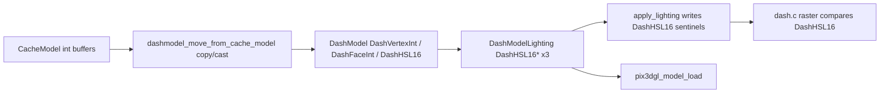

# Dash model uint16 buffers and HSL sentinels

## Context

- [`src/graphics/dash.h`](src/graphics/dash.h) already defines `typedef uint16_t DashVertexInt`, `DashFaceInt`, `DashHSL16`, but [`struct DashModel`](src/graphics/dash.h) still uses `int*` for `vertices_*`, `face_indices_*`, `face_colors`, and **`struct DashModelLighting` (lines 46–57)** still uses `int*` for `face_colors_hsl_a`, `face_colors_hsl_b`, and `face_colors_hsl_c`.
- Signed sentinels for **lit** face color channel C are documented in [`src/osrs/rscache/tables/model.h`](src/osrs/rscache/tables/model.h) and implemented today as **`-1`** (flat / textured-flat) and **`-2`** (hidden / skip draw). Same pattern appears in [`src/graphics/lighting.c`](src/graphics/lighting.c) (`apply_lighting`) and [`src/graphics/dash.c`](src/graphics/dash.c) (raster path), and terrain in [`src/osrs/terrain_decode_tile.u.c`](src/osrs/terrain_decode_tile.u.c) sets `-2` to hide faces.
- **Unsigned equivalents** (bit pattern when stored in `uint16_t`): `-1` → `65535` (`0xFFFF`), `-2` → `65534` (`0xFFFE`). Prefer named macros in `dash.h` (e.g. `DASH_HSL16_FACE_FLAT` / `DASH_HSL16_FACE_HIDDEN` or similar) so comparisons read in terms of `DashHSL16`, not raw decimals.

## `struct DashModelLighting` (dash.h 46–57) — required change

Retype all three pointers to **`DashHSL16*`** (not only channel C):

```c
struct DashModelLighting
{
    DashHSL16* face_colors_hsl_a;
    DashHSL16* face_colors_hsl_b;
    DashHSL16* face_colors_hsl_c;
};
```

Comments (“null if mode is LIGHTING_FLAT”) stay; allocation size becomes `face_count * sizeof(DashHSL16)` everywhere these arrays are `malloc`/`memset`.

### Receivers of `lighting->face_colors_hsl_{a,b,c}` (must compile and use sentinels)

| Location | Role |
| -------- | ---- |
| [`src/graphics/dash.c`](src/graphics/dash.c) | `dashmodel_lighting_new` alloc; `dashmodel_free`; raster passes pointers into draw path |
| [`src/osrs/dash_utils.c`](src/osrs/dash_utils.c) | `model_lighting_new` alloc; `apply_lighting(..., lighting->face_colors_hsl_*)` |
| [`src/osrs/_light_model_default.u.c`](src/osrs/_light_model_default.u.c) | Passes `dash_model->lighting->face_colors_hsl_*` into normals/lighting |
| [`src/osrs/scenebuilder_scenery.u.c`](src/osrs/scenebuilder_scenery.u.c) | Passes lit colors into scene/lighting APIs |
| [`src/osrs/scenebuilder_sharelight.u.c`](src/osrs/scenebuilder_sharelight.u.c) | Same |
| [`src/osrs/world_sharelight.u.c`](src/osrs/world_sharelight.u.c) | Same |
| [`src/osrs/terrain_decode_tile.u.c`](src/osrs/terrain_decode_tile.u.c) | `memcpy` into `dash_model->lighting->face_colors_hsl_*` |
| [`src/osrs/pix3dgl.h`](src/osrs/pix3dgl.h) | `pix3dgl_model_load` parameters |
| [`src/osrs/pix3dgl.cpp`](src/osrs/pix3dgl.cpp) | Upload; **`face_colors_hsl_c[face] == -2`** → use `dash.h` hidden sentinel |
| [`src/osrs/pix3dgl_opengles2.cpp`](src/osrs/pix3dgl_opengles2.cpp) | Same as pix3dgl.cpp |
| [`src/platforms/platform_impl2_osx_sdl2_renderer_opengl3.cpp`](src/platforms/platform_impl2_osx_sdl2_renderer_opengl3.cpp) | `pix3dgl_model_load` with `model->lighting->face_colors_hsl_*` |
| [`src/platforms/platform_impl2_emscripten_sdl2_renderer_webgl1.cpp`](src/platforms/platform_impl2_emscripten_sdl2_renderer_webgl1.cpp) | Same |
| [`src/platforms/platform_impl2_osx_sdl2_renderer_metal.mm`](src/platforms/platform_impl2_osx_sdl2_renderer_metal.mm) | **`face_colors_hsl_c[f] == -2`** and reads of `hsl_a/b/c` |
| [`src/platforms/platform_impl2_osx_sdl2_renderer_d3d11.cpp`](src/platforms/platform_impl2_osx_sdl2_renderer_d3d11.cpp) | **`face_colors_hsl_c[f] == -2`** and reads of `hsl_a/b/c` |
| [`src/metal_main.mm`](src/metal_main.mm) | **`face_colors_hsl_c[i] != -2` / `== -2`**; reads `face_colors_hsl_a` |
| [`src/main.cpp`](src/main.cpp) | Manual `DashModelLighting` malloc (`sizeof(int)` today); `apply_lighting` call |
| [`android/src/main/cpp/android_platform.cpp`](android/src/main/cpp/android_platform.cpp) | Passes `lighting->face_colors_hsl_*` to GL |
| [`test/scene_tile_test.cpp`](test/scene_tile_test.cpp) | Passes lit colors to renderer |
| [`test/scene_tile_test_imgui_browser.cpp`](test/scene_tile_test_imgui_browser.cpp) | Manual lighting alloc + `apply_lighting` |
| [`test/model_viewer.cpp`](test/model_viewer.cpp) | Reads `lighting->face_colors_hsl_*` per face; passes to APIs |
| [`docs/painter_algorithm_example.c`](docs/painter_algorithm_example.c) | Example struct field names only—update if it must compile with new types |

No separate `struct` definition elsewhere should duplicate `int*` for these fields; fix any test harness that manually builds `DashModelLighting`.

## Risk note (coordinates vs indices)

`DashVertexInt` is `uint16_t`. RS model **vertex coordinates** in [`src/osrs/rscache/tables/model.c`](src/osrs/rscache/tables/model.c) are stored as `int` and can be **negative** or large. Before (or while) landing this change, confirm all `vertices_x/y/z` values used in `DashModel` fit the intended representation; if not, the typedef for **positions** may need to differ from **indices** (only `DashFaceInt` is clearly safe as `uint16_t`). The existing TODO at [`src/osrs/buildcachedat_loader.c`](src/osrs/buildcachedat_loader.c) (lines 856–857) points at this migration—treat coordinate range as a required validation step.

## 1. Header: types + sentinels + API

In [`src/graphics/dash.h`](src/graphics/dash.h):

- Add two `DashHSL16` constants for the former `-1` and `-2` face-color semantics (document which is flat vs hidden).
- Change `struct DashModel` fields: `vertices_{x,y,z}`, `original_vertices_{x,y,z}`, `face_indices_{a,b,c}`, `face_colors` → pointer types using `DashVertexInt` / `DashFaceInt` / `DashHSL16` as appropriate.
- Change **`struct DashModelLighting` (lines 46–57)** so `face_colors_hsl_a`, `face_colors_hsl_b`, `face_colors_hsl_c` are **`DashHSL16*`** (see table above for all receivers).
- Update public prototypes that currently take `int*` for model geometry/colors, including:
  - `dash3d_calculate_bounds_cylinder`, `dash3d_calculate_vertex_normals` (same file).

## 2. Lighting and normals

- [`src/graphics/lighting.h`](src/graphics/lighting.h) / [`src/graphics/lighting.c`](src/graphics/lighting.c): `calculate_vertex_normals` and `apply_lighting` should take `DashVertexInt*` / `DashFaceInt*` for positions and indices, and `DashHSL16*` for all HSL16 color arrays. Replace assignments `... = -1` / `... = -2` on the C channel with the new `dash.h` macros.
- Every call site must be updated (notably [`src/osrs/dash_utils.c`](src/osrs/dash_utils.c) `dashmodel_lighting_new_default`, [`src/osrs/_light_model_default.u.c`](src/osrs/_light_model_default.u.c), and any direct `apply_lighting` in [`src/graphics/dash.c`](src/graphics/dash.c) if present).

## 3. Core raster and helpers

- [`src/graphics/dash.c`](src/graphics/dash.c): `dashmodel_free`, lighting allocation in `dashmodel_lighting_new`, animation paths that `memcpy`/`malloc` vertex buffers (search for `original_vertices_*`, `sizeof(int) * model->vertex_count`), and the face raster path that compares `color_c` to `-1`/`-2` (around lines 415–506). Use `DashHSL16` loads and compare against the new macros; promote to `int` only where math requires it.
- [`src/graphics/render_gouraud.u.c`](src/graphics/render_gouraud.u.c), [`src/graphics/render_texture.u.c`](src/graphics/render_texture.u.c): update inner helpers that take `int* colors_{a,b,c}` and `int* face_indices_*` to use the dash typedefs (or `const DashHSL16*` / `const DashFaceInt*`). Existing `assert(color_c >= 0 && color_c < 65536)`-style checks remain valid for non-sentinel draws; early-outs for hidden faces should use the hidden sentinel.

## 4. OSRS integration

### 4a. [`src/osrs/dash_utils.c`](src/osrs/dash_utils.c) — CacheModel → DashModel (mandatory)

[`CacheModel`](src/osrs/rscache/tables/model.h) keeps geometry and face data as `int*`. [`dashmodel_move_from_cache_model`](src/osrs/dash_utils.c) must **stop pointer-aliasing** those `int*` into `DashModel` once `DashModel` uses `DashVertexInt*` / `DashFaceInt*` / `DashHSL16*`. Implement a **correct conversion path**:

1. **`dashmodel_move_from_cache_model`**
   - For each of `vertices_x`, `vertices_y`, `vertices_z`, `face_indices_a`, `face_indices_b`, `face_indices_c`, `face_colors`: `malloc` the corresponding dash array (`vertex_count` or `face_count`), **loop** `int` → `DashVertexInt` / `DashFaceInt` / `DashHSL16` with explicit casts (and document or assert range expectations per the risk note for coordinates vs indices).
   - **`free`** the cache `int*` buffers after copying (today ownership moves to `DashModel` as `int*`; after conversion, free those `int*` buffers once values are copied into the new dash arrays).
   - Assign the new pointers to `dash_model`; leave cache model fields `NULL` as today.
   - Downstream calls that still need cache data in the same function (`dash3d_calculate_bounds_cylinder`, etc.) must use the **new** dash buffers.

2. **Static `model_lighting_new`** (allocates [`struct DashModelLighting`](src/graphics/dash.h))
   - Allocate `face_colors_hsl_{a,b,c}` as `DashHSL16*` with `sizeof(DashHSL16) * face_count`, not `int*`.

3. **`dashmodel_lighting_new_default`**
   - [`apply_lighting`](src/graphics/lighting.c) takes flat source colors from the model. After header changes, its **inputs** are `DashHSL16*` (or compatible); convert each `CacheModel` `face_colors[i]` to `DashHSL16` when filling or when passing the flat-color array (cache file colors are effectively unsigned 16-bit HSL; map any legacy negative sentinel on the **source** channel if present before lighting).
   - Pass `DashFaceInt*` / `DashVertexInt*` for indices and vertices consistent with the converted `DashModel` **or** read from `CacheModel` until conversion is done—pick one coherent approach so `apply_lighting` and normals see matching index/vertex/color types.

4. **[`dash_utils.h`](src/osrs/dash_utils.h)** — update any inline helpers or declarations affected by `struct DashModelLighting` / move signatures.

This file is the **single authoritative handoff** from cache to dash; getting conversion wrong breaks everything downstream (bounds, normals, lighting, GL upload).

- [`src/osrs/scenebuilder_scenery.u.c`](src/osrs/scenebuilder_scenery.u.c), [`src/osrs/scenebuilder_sharelight.u.c`](src/osrs/scenebuilder_sharelight.u.c), [`src/osrs/world_sharelight.u.c`](src/osrs/world_sharelight.u.c): arithmetic like `model->vertices_x[vertex] - offset` and indexing via `face_indices_*` continues to work with integer promotion; only types/signatures change.
- [`src/osrs/terrain_decode_tile.u.c`](src/osrs/terrain_decode_tile.u.c): allocate `DashHSL16` buffers for model data; replace `face_colors_hsl_c[i] = -2` with the hidden sentinel; ensure `memcpy` sizes use `sizeof(DashHSL16)`. Keep **terrain-local** `int` helpers (`multiply_lightness`, `adjust_lightness`, `INVALID_HSL_COLOR`) as-is unless you fold them into unsigned—only the final values written into `DashModel` need the dash sentinels.

**Note:** [`src/osrs/model_transforms.c`](src/osrs/model_transforms.c) operates on **`CacheModel`**, not `DashModel`; leave it on `int*` unless you separately migrate the cache table.

## 5. GPU / platform

- [`src/osrs/pix3dgl.h`](src/osrs/pix3dgl.h) and implementations [`src/osrs/pix3dgl.cpp`](src/osrs/pix3dgl.cpp) / [`src/osrs/pix3dgl_opengles2.cpp`](src/osrs/pix3dgl_opengles2.cpp): update `pix3dgl_model_load` (and any upload path) to accept `DashVertexInt*` / `DashFaceInt*` / `DashHSL16*` (or `const` qualified). Replace **`== -2`** on `face_colors_hsl_c` with the hidden sentinel from `dash.h`.
- **Metal / D3D11** ([`platform_impl2_osx_sdl2_renderer_metal.mm`](src/platforms/platform_impl2_osx_sdl2_renderer_metal.mm), [`platform_impl2_osx_sdl2_renderer_d3d11.cpp`](src/platforms/platform_impl2_osx_sdl2_renderer_d3d11.cpp), [`metal_main.mm`](src/metal_main.mm)): same sentinel swap for channel C; `hsl_a/b/c` locals can remain `int` via promotion from `DashHSL16` where needed.
- Call sites in [`platform_impl2_osx_sdl2_renderer_opengl3.cpp`](src/platforms/platform_impl2_osx_sdl2_renderer_opengl3.cpp) and [`platform_impl2_emscripten_sdl2_renderer_webgl1.cpp`](src/platforms/platform_impl2_emscripten_sdl2_renderer_webgl1.cpp) pass `dash_model` fields—adjust casts if needed.
- [`main.cpp`](src/main.cpp), [`android/src/main/cpp/android_platform.cpp`](android/src/main/cpp/android_platform.cpp), and tests under [`test/`](test/): update manual `DashModelLighting` allocation and any comparisons.

## 6. Sentinel / negative comparison audit (face color path)

Replace signed checks with `DashHSL16` comparisons using `dash.h` macros at least in:

| Area | File(s) |
| ---- | ------- |
| Raster early-out + textured flat | [`src/graphics/dash.c`](src/graphics/dash.c) |
| Lit output channel C | [`src/graphics/lighting.c`](src/graphics/lighting.c) |
| Terrain hidden faces | [`src/osrs/terrain_decode_tile.u.c`](src/osrs/terrain_decode_tile.u.c) (line ~582) |
| GL upload skip face | [`pix3dgl.cpp`](src/osrs/pix3dgl.cpp), [`pix3dgl_opengles2.cpp`](src/osrs/pix3dgl_opengles2.cpp) |
| Metal / D3D11 / Metal main | [`platform_impl2_osx_sdl2_renderer_metal.mm`](src/platforms/platform_impl2_osx_sdl2_renderer_metal.mm), [`platform_impl2_osx_sdl2_renderer_d3d11.cpp`](src/platforms/platform_impl2_osx_sdl2_renderer_d3d11.cpp), [`metal_main.mm`](src/metal_main.mm) |

Do **not** confuse with unrelated `-1` (e.g. font charset in `dash.c`, entity IDs, `face_textures == -1` in lighting)—those stay signed `int`.

## 7. Verification

- Full rebuild of native and any Emscripten/WebGL targets (signature changes span C and C++), plus **Metal / D3D11** paths if enabled.
- Smoke: load a scene, NPC/player models, terrain tile mesh; confirm no visual regressions on textured vs flat vs hidden faces.


