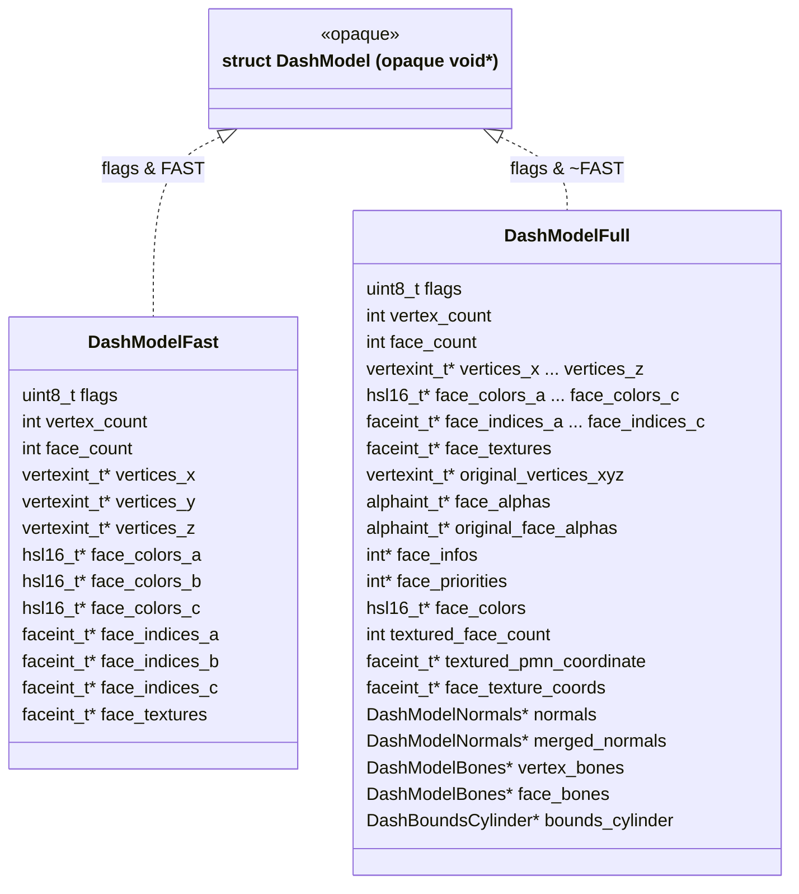

# DashModel Memory-Efficient Refactor

## Architecture

`DashModelFast` and `DashModelFull` are **completely separate struct types** -- no embedding. Both have `uint8_t flags` as their first byte, which enables runtime type dispatch.

The public API in [`dash.h`](src/graphics/dash.h) exposes only an **opaque** `struct DashModel` (forward-declared, never defined). All public functions accept `struct DashModel*`. Internally this is a `void*` that points to either a `DashModelFast` or `DashModelFull`. The concrete struct definitions live in a **private header** (`dash_model_internal.h`) included only by implementation files.



## Flags field

Both `DashModelFast` and `DashModelFull` have `uint8_t flags` as their **first byte** (same offset = 0). The bit layout:

```c
#define DASHMODEL_FLAG_LOADED       0x01
#define DASHMODEL_FLAG_HAS_TEXTURES 0x02
#define DASHMODEL_FLAG_FAST         0x40  // set for DashModelFast
#define DASHMODEL_FLAG_VALID        0x80  // always set; debug-asserted in ALL functions
```

- **Bit 7 (0x80) -- VALID**: Always set on both types. Every accessor/helper function debug-asserts this bit before doing anything. Catches use-after-free or uninitialized memory.
- **Bit 6 (0x40) -- FAST**: Set on `DashModelFast`, clear on `DashModelFull`. Used to dispatch in accessor functions.
- **Bit 0 (0x01) -- LOADED**: Replaces `bool loaded`.
- **Bit 1 (0x02) -- HAS_TEXTURES**: Replaces `bool has_textures`.

Convenience functions (non-inline, in `dash.c` -- type is opaque):

```c
bool dashmodel_is_loaded(const struct DashModel* m);
void dashmodel_set_loaded(struct DashModel* m, bool v);
bool dashmodel_has_textures(const struct DashModel* m);
void dashmodel_set_has_textures(struct DashModel* m, bool v);
```

Internal-only (in `dash_model_internal.h`):

```c
static inline uint8_t dashmodel__flags(const void* m) {
    uint8_t f = *(const uint8_t*)m;
    assert((f & DASHMODEL_FLAG_VALID) && "DashModel: invalid flags -- uninitialized or use-after-free");
    return f;
}
static inline bool dashmodel__is_fast(const void* m) {
    return (dashmodel__flags(m) & DASHMODEL_FLAG_FAST) != 0;
}
```

## DashModelLighting removal

The current `struct DashModelLighting` holds `face_colors_hsl_a/b/c`. Both `DashModelFast` and `DashModelFull` now have their own `face_colors_a/b/c` fields directly. `DashModelLighting` and `dashmodel_lighting_new` are dropped. Everywhere that reads `model->lighting->face_colors_hsl_a` changes to accessor calls.

`dashmodel_valid()` currently checks `model->lighting != NULL`; this check changes to `dashmodel_face_colors_a(m) != NULL`.

## Accessor functions

All accessors are **non-inline regular functions** in `dash.c` (the type is opaque, so inline in the header is not possible). Each accessor debug-asserts `DASHMODEL_FLAG_VALID`, then dispatches based on `DASHMODEL_FLAG_FAST`.

**Shared fields** (present on both types, accessor branches to read from the correct struct):

- `dashmodel_vertex_count(m)` -> `int`
- `dashmodel_face_count(m)` -> `int`
- `dashmodel_vertices_x/y/z(m)` -> `vertexint_t*`
- `dashmodel_face_colors_a/b/c(m)` -> `hsl16_t*`
- `dashmodel_face_indices_a/b/c(m)` -> `faceint_t*`
- `dashmodel_face_textures(m)` -> `faceint_t*`

**Full-only fields** (return NULL / 0 when called on a Fast model, except where noted):

- `dashmodel_face_alphas(m)` -> `alphaint_t*`
- `dashmodel_original_face_alphas(m)` -> `alphaint_t*`
- `dashmodel_face_infos(m)` -> `int*`
- `dashmodel_face_priorities(m)` -> `int*`
- `dashmodel_face_colors_flat(m)` -> `hsl16_t*` (the flat unlit colors)
- `dashmodel_original_vertices_x/y/z(m)` -> `vertexint_t*`
- `dashmodel_face_texture_coords(m)` -> `faceint_t*` (Fast: NULL, all faces implicitly use index 0)
- `dashmodel_normals(m)` / `dashmodel_merged_normals(m)` -> `DashModelNormals*`
- `dashmodel_vertex_bones(m)` / `dashmodel_face_bones(m)` -> `DashModelBones*`
- `dashmodel_bounds_cylinder(m)` -> `DashBoundsCylinder*`

**Implicit texture coordinate fields** (for Fast, terrain tiles always use p=0, m=1, n=3):

- `dashmodel_textured_face_count(m)` -> `int` -- Fast returns 1 (single implicit texture mapping); Full returns the stored count.
- `dashmodel_textured_p_coordinate(m)` -> `faceint_t*` -- Fast returns a pointer to `static const faceint_t g_fast_textured_p[1] = {0}`.
- `dashmodel_textured_m_coordinate(m)` -> `faceint_t*` -- Fast returns a pointer to `static const faceint_t g_fast_textured_m[1] = {1}`.
- `dashmodel_textured_n_coordinate(m)` -> `faceint_t*` -- Fast returns a pointer to `static const faceint_t g_fast_textured_n[1] = {3}`.

This eliminates the 3 single-element arrays per terrain tile that `decode_tile` currently allocates (`textured_p/m/n_coordinate`), as well as the per-face `face_texture_coords` array (all zeros). The renderer gets valid pointers without any per-model allocation.

## Array copy helper functions

Each copy helper has two variants: an **i16** version (source matches destination width, uses `memcpy`) and an **i32** version (source is `int32_t`, narrows each element to int16 with a cast loop). This covers both call sites:

- `terrain_decode_tile.u.c` already works with `vertexint_t` / `faceint_t` (int16) arrays -- uses the i16 variants.
- `dash_utils.c` copies from `CacheModel` which stores `int` (int32) arrays -- uses the i32 variants.

```c
// --- i16 variants (memcpy, source already matches dest width) ---
// Parameters use raw int16_t/uint16_t, not the typedefs, so the
// interface is explicit about the expected input width.
void dashmodel_set_vertices_i16(struct DashModel* m, int count,
    const int16_t* src_x, const int16_t* src_y, const int16_t* src_z);

void dashmodel_set_face_indices_i16(struct DashModel* m, int count,
    const int16_t* src_a, const int16_t* src_b, const int16_t* src_c);

void dashmodel_set_face_colors_i16(struct DashModel* m,
    const uint16_t* src_a, const uint16_t* src_b, const uint16_t* src_c);

void dashmodel_set_face_textures_i16(struct DashModel* m,
    const int16_t* src_textures, int count);

// --- i32 variants (narrowing copy loop from int32_t sources) ---
void dashmodel_set_vertices_i32(struct DashModel* m, int count,
    const int32_t* src_x, const int32_t* src_y, const int32_t* src_z);

void dashmodel_set_face_indices_i32(struct DashModel* m, int count,
    const int32_t* src_a, const int32_t* src_b, const int32_t* src_c);

void dashmodel_set_face_colors_i32(struct DashModel* m,
    const int32_t* src_a, const int32_t* src_b, const int32_t* src_c);

void dashmodel_set_face_textures_i32(struct DashModel* m,
    const int32_t* src_textures, int count);
```

The i16 functions allocate destination arrays (if not already allocated), set counts, and `memcpy` from source. The i32 functions do the same but cast each element: e.g. `m->vertices_x[i] = (vertexint_t)src_x[i]`. Both replace the manual malloc+memcpy/loop patterns in `decode_tile` and `dashmodel_move_from_cache_model`.

## Field setter functions

For every place that manually sets a field, add a supporting function. These accept the opaque `struct DashModel*` but debug-assert that the model is Full (not Fast), since these fields only exist on `DashModelFull`:

```c
void dashmodel_set_face_alphas(struct DashModel* m, const alphaint_t* src, int count);
void dashmodel_set_face_infos(struct DashModel* m, const int* infos, int count);  // copies
void dashmodel_set_face_priorities(struct DashModel* m, const int* priorities, int count);  // copies
void dashmodel_set_face_colors_flat(struct DashModel* m, const hsl16_t* src, int count);
void dashmodel_set_texture_coords(struct DashModel* m,
    int textured_face_count,
    const faceint_t* p, const faceint_t* m_coord, const faceint_t* n,
    const faceint_t* face_texture_coords, int face_count);
void dashmodel_set_bounds_cylinder(struct DashModel* m);  // computes from vertices
void dashmodel_alloc_normals(struct DashModel* m);
```

## Lifecycle functions

All return/accept the opaque `struct DashModel*`. Internally the allocator sets the appropriate flags.

- `dashmodel_fast_new(void)` -> `struct DashModel*` (malloc DashModelFast, zero, set VALID | FAST)
- `dashmodelfull_new(void)` -> `struct DashModel*` (malloc DashModelFull, zero, set VALID, no FAST)
- `dashmodel_free(struct DashModel* m)` -> asserts VALID, dispatches to fast or full free path based on FAST bit
- `dashmodel_heap_bytes(const struct DashModel* m)` -> dispatches based on FAST bit
- `dashmodel_valid(const struct DashModel* m)` -> checks `face_colors_a != NULL` + for Full: `bounds_cylinder != NULL`

## Files to change

### New private header (`dash_model_internal.h`)

- Define `struct DashModelFast` and `struct DashModelFull` with full field layouts
- Define flag constants (`DASHMODEL_FLAG_VALID`, `DASHMODEL_FLAG_FAST`, `DASHMODEL_FLAG_LOADED`, `DASHMODEL_FLAG_HAS_TEXTURES`)
- Internal-only `static inline` helpers: `dashmodel__flags()`, `dashmodel__is_fast()`, `dashmodel__as_fast()`, `dashmodel__as_full()`

### Public API ([`dash.h`](src/graphics/dash.h))

- Remove `struct DashModel` definition (becomes opaque forward-declaration only: `struct DashModel;`)
- Remove `struct DashModelLighting` and `dashmodel_lighting_new` declaration
- All public function signatures use opaque `struct DashModel*`
- Declare all accessor functions (non-inline), lifecycle functions, copy helpers, setter functions

### Core implementation ([`dash.c`](src/graphics/dash.c))

- Include `dash_model_internal.h`
- Implement `dashmodel_fast_new` (sets VALID | FAST) and `dashmodelfull_new` (sets VALID, no FAST)
- Implement `dashmodel_free` dispatching on FAST bit
- Implement all accessor functions: assert VALID, branch on FAST to cast to correct struct
- Implement all copy helpers (\_i16 / \_i32): assert VALID, branch on FAST to write to correct struct
- Implement all setter functions: assert VALID, assert NOT FAST (Full-only)
- Update `dashmodel_heap_bytes`, `dashmodel_valid`
- Remove `dashmodel_lighting_new`, `dashmodel_lighting_free` logic
- Rendering/projection/culling code uses accessor functions instead of direct field access

### Terrain tile ([`terrain_decode_tile.u.c`](src/osrs/terrain_decode_tile.u.c))

- Return opaque `struct DashModel*` from `decode_tile`
- Use `dashmodel_fast_new()` + helper functions instead of manual malloc/memset/memcpy
- Use `dashmodel_set_loaded` / `dashmodel_set_has_textures`

### Cache-to-dash conversion ([`dash_utils.c`](src/osrs/dash_utils.c))

- Include `dash_model_internal.h`
- Use `dashmodelfull_new()` + helper functions
- Replace manual vertex/face/color copying loops with `dashmodel_set_vertices`, etc.
- `face_infos` and `face_priorities` were previously moved (pointer transfer) from `CacheModel`; change to copy via `dashmodel_set_face_infos/priorities` and free the `CacheModel` source arrays after
- Drop `dashmodel_lighting_new()` call; set `face_colors_a/b/c` via copy helpers

### Scene elements ([`scene2.h`](src/osrs/scene2.h), [`scene2.c`](src/osrs/scene2.c))

- `struct DashModel* dash_model` stays as-is (type is now opaque, same name)

### Render commands ([`tori_rs_render.h`](src/tori_rs_render.h))

- `struct DashModel* model` stays as-is (same opaque type)

### Lighting / sharelight files

- [`_light_model_default.u.c`](src/osrs/_light_model_default.u.c): include internal header, use accessors
- [`world_sharelight.u.c`](src/osrs/world_sharelight.u.c): same
- [`scenebuilder_sharelight.u.c`](src/osrs/scenebuilder_sharelight.u.c): same
- [`scenebuilder_scenery.u.c`](src/osrs/scenebuilder_scenery.u.c): same

### All callers that create/use DashModel

- [`world_scenebuild.c`](src/osrs/world_scenebuild.c), [`entity_scenebuild.c`](src/osrs/entity_scenebuild.c), [`world_scenery.u.c`](src/osrs/world_scenery.u.c), [`world_terrain.u.c`](src/osrs/world_terrain.u.c), [`scenebuilder_terrain.u.c`](src/osrs/scenebuilder_terrain.u.c), [`obj_icon.c`](src/osrs/obj_icon.c), [`interface.c`](src/osrs/interface.c), [`uitree_load.c`](src/osrs/revconfig/uitree_load.c): Replace direct field access (`model->vertices_x`) with accessor calls (`dashmodel_vertices_x(model)`)

### GPU renderers

- [`platform_impl2_osx_sdl2_renderer_opengl3.cpp`](src/platforms/platform_impl2_osx_sdl2_renderer_opengl3.cpp)
- [`platform_impl2_osx_sdl2_renderer_metal.mm`](src/platforms/platform_impl2_osx_sdl2_renderer_metal.mm)
- [`platform_impl2_osx_sdl2_renderer_d3d11.cpp`](src/platforms/platform_impl2_osx_sdl2_renderer_d3d11.cpp)
- [`platform_impl2_emscripten_sdl2_renderer_webgl1.cpp`](src/platforms/platform_impl2_emscripten_sdl2_renderer_webgl1.cpp)
- Include `dash_model_internal.h` (or use public accessors), replace all `model->field` with accessor calls
