# Fix Memory Leaks and Implement Game Cleanup

## Analysis of the Valgrind report

The leak report shows several categories:

1. **No top-level game cleanup** -- `LibToriRS_GameFree` is declared in `[tori_rs.h:141](src/tori_rs.h)` but never implemented. The main loop in `[test/osx.cpp](test/osx.cpp)` exits without freeing `game`, `platform`, or `render_command_buffer`.
2. `**world_free` is incomplete\*\* -- `[world.c:110-121](src/osrs/world.c)` frees only `painter`, `collision_map`, `heightmap`, `minimap`, `scene2`, `decor_buildmap` but skips `lightmap`, `shademap`, `overlaymap`, `sharelight_map`, `blendmap`, `terrain_shapemap` (all allocated in `world_new` at lines 76-83).
3. `**minimap_free` leaks `tiles` and `locs`\*\* -- `[minimap.c:65-68](src/osrs/minimap.c)` only `free(minimap)`, missing `free(minimap->tiles)` and `free(minimap->locs)`.
4. `**painter_free` leaks `tile_paints`, `elements`, `element_paints`, queues\*\* -- `[painters.c:228-232](src/osrs/painters.c)` only frees `tiles` and the struct itself.
5. `**dash_free` leaks texture hashmap and its backing buffer\*\* -- `[dash.c:119-123](src/graphics/dash.c)` only `free(dash)`.
6. `**dashmodel_free` doesn't free `merged_normals`\*\* -- `[dash.c:2066-2110](src/graphics/dash.c)` frees `normals` but not `merged_normals` (allocated by `alloc_merged_normals` in `world_sharelight.u.c:198`).
7. `**decode_tile` leaks `valid_faces`\*\* -- `[terrain_decode_tile.u.c:617](src/osrs/terrain_decode_tile.u.c)` returns before `free(valid_faces)` on line 619 (unreachable code).
8. `**buildcachedat_free` is incomplete\*\* -- `[buildcachedat.c:352-367](src/osrs/buildcachedat.c)` has a TODO and doesn't free many hashmaps or their payloads.
9. `**buildcachedat_loader_finalize_scene` can orphan old world\*\* -- `[buildcachedat_loader.c:856](src/osrs/buildcachedat_loader.c)` doesn't free a previous `game->world` before replacing it (unlike the `centerzone` variant at line 908 which does).

## Changes

### 1. Fix `valid_faces` leak in `terrain_decode_tile.u.c`

Move `free(valid_faces)` before `return dash_model` at line 617:

```c
free(valid_faces);
return dash_model;
```

### 2. Fix `dashmodel_free` to free `merged_normals` in `[dash.c](src/graphics/dash.c)`

After the `normals` block (line 2094), add:

```c
if (model->merged_normals) {
    free(model->merged_normals->lighting_vertex_normals);
    free(model->merged_normals->lighting_face_normals);
    free(model->merged_normals);
    model->merged_normals = NULL;
}
```

### 3. Fix `minimap_free` in `[minimap.c](src/osrs/minimap.c)`

```c
void minimap_free(struct Minimap* minimap) {
    free(minimap->tiles);
    free(minimap->locs);
    free(minimap);
}
```

### 4. Fix `painter_free` in `[painters.c](src/osrs/painters.c)`

```c
void painter_free(struct Painter* painter) {
    free(painter->tiles);
    free(painter->tile_paints);
    free(painter->elements);
    free(painter->element_paints);
    int_queue_free(&painter->queue);
    int_queue_free(&painter->catchup_queue);
    free(painter);
}
```

### 5. Fix `dash_free` in `[dash.c](src/graphics/dash.c)`

```c
void dash_free(struct DashGraphics* dash) {
    if (dash->textures_hmap) {
        void* buffer = dashmap_buffer(dash->textures_hmap);
        dashmap_free(dash->textures_hmap);
        free(buffer);
    }
    free(dash);
}
```

(Need to verify `dashmap` exposes the backing buffer or store it separately on DashGraphics.)

### 6. Fix `world_free` in `[world.c](src/osrs/world.c)`

Add the missing frees to match everything allocated in `world_new`:

```c
void world_free(struct World* world) {
    painter_free(world->painter);
    collision_map_free(world->collision_map);
    heightmap_free(world->heightmap);
    minimap_free(world->minimap);
    scene2_free(world->scene2);
    decor_buildmap_free(world->decor_buildmap);
    lightmap_free(world->lightmap);
    shademap2_free(world->shademap);
    overlaymap_free(world->overlaymap);
    sharelight_map_free(world->sharelight_map);
    blendmap_free(world->blendmap);
    terrain_shape_map_free(world->terrain_shapemap);
    free(world);
}
```

### 7. Fix `buildcachedat_loader_finalize_scene` in `[buildcachedat_loader.c](src/osrs/buildcachedat_loader.c)`

Free old world before replacing, matching the `centerzone` variant:

```c
if (game->world)
    world_free(game->world);
game->world = world_new(buildcachedat);
```

### 8. Implement missing payload free functions

Since `buildcachedat` owns all data stored in its hashmaps, we need free functions for every payload type. Some already exist (with bugs to fix), and several need to be created.

**Already exist -- verify and fix bugs:**

- `map_terrain_free` (`[maps.c](src/osrs/rscache/tables/maps.c)`) -- just `free(map_terrain)` (tiles embedded). OK.
- `map_locs_free` (`[maps.c](src/osrs/rscache/tables/maps.c)`) -- frees `locs` array + struct. OK.
- `model_free` (`[model.c](src/osrs/rscache/tables/model.c)`) -- frees all vertex/face arrays + struct. OK.
- `config_locs_free` (`[config_locs.c](src/osrs/rscache/tables/config_locs.c)`) -- **bugs**: only frees `actions[0..4]` not `[5..9]`; `param_values` teardown is commented out. Fix both.
- `config_floortype_overlay_free` (`[config_floortype.c](src/osrs/rscache/tables/config_floortype.c)`) -- **bug**: `_free_inplace` is empty, so `flotype_name` is never freed. Add `free(overlay->flotype_name)`.
- `dashsprite_free` (`[dash.c](src/graphics/dash.c)`) -- frees `pixels_argb` + struct. OK.
- `filelist_dat_free` (`[filelist.c](src/osrs/rscache/filelist.c)`) -- **bug**: frees each `files[i]` and metadata arrays but never `free(filelist->files)` (the `char`\*\* pointer array). Fix.

**Need implementation:**

- `**texture_free`\*\* in `[texture.c](src/osrs/texture.c)` -- declared in `texture.h` but body missing. Implement: `free(texture->texels); free(texture);`
- `**dashpixfont_free`\*\* in `[dash.c](src/graphics/dash.c)` -- new. Loop `char_mask[0..93]` freeing each non-NULL, call `dashfont_free_atlas(font->atlas)`, `free(font->charcode_set)` if non-NULL, `free(font)`.
- `**cache_dat_animframe_free`\*\* in `[animframe.c](src/osrs/rscache/tables_dat/animframe.c)` -- declared in `animframe.h` but body missing. Free `frame->groups`, `frame->x`, `frame->y`, `frame->z` (NOT `frame->base` which is shared).
- `**cache_dat_animbaseframes_free`\*\* in `[animframe.c](src/osrs/rscache/tables_dat/animframe.c)` -- new. For each frame: call `cache_dat_animframe_free`. Then `free(animbaseframes->frames)`. Then free the base: `free(base->types)`, each `free(base->labels[i])`, `free(base->labels)`, `free(base->label_counts)`, `free(base)`. Then `free(animbaseframes)`.
- `**config_dat_sequence_free**` in `[config_sequence.c](src/osrs/rscache/tables/config_sequence.c)` -- new for `CacheDatSequence`. Free `frames`, `iframes`, `delay`, `walkmerge`, then the struct.
- `**cache_dat_config_idk_free**` in `[config_idk.c](src/osrs/rscache/tables_dat/config_idk.c)` -- new. Free `idk->models`, then `free(idk)`.
- `**cache_dat_config_obj_free**` in `[config_obj.c](src/osrs/rscache/tables_dat/config_obj.c)` -- new. Free `name`, `desc`, each non-NULL `op[i]` and `iop[i]`, `recol_s`, `recol_d`, `countobj`, `countco`, then `free(obj)`.
- `**cache_dat_config_npc_free**` in `[config_npc.c](src/osrs/rscache/tables_dat/config_npc.c)` -- new. Free `name`, `desc`, each non-NULL `op[i]`, `models`, `heads`, `recol_s`, `recol_d`, then `free(npc)`.
- `**cache_dat_config_component_free**` in `[config_component.c](src/osrs/rscache/tables_dat/config_component.c)` -- new. Free `scriptComparator`, `scriptOperand`; each `scripts[i]` row + `scripts` + `scripts_lengths`; `children`, `childX`, `childY`; `invSlotObjId`, `invSlotObjCount`; each string in `invSlotOffsetX/Y`, `invSlotGraphic`; each non-NULL `iop[i]`; heap-allocated strings (`targetVerb`, `targetText`, `text`, `activeText`, `graphic`, `activeGraphic`, etc.); **handle `option` carefully** -- string literals like `"Ok"` must not be freed; best fix is to change decode to `strdup` all option strings so they're always freeable. Then `free(component)`.

### 9. Complete `buildcachedat_free` in `[buildcachedat.c](src/osrs/buildcachedat.c)`

`buildcachedat` owns all data in its hashmaps. The `DashMap` API provides `dashmap_buffer_ptr(map)` which returns the backing buffer originally passed via `config.buffer = malloc(...)`. `dashmap_free` only frees the `DashMap`\* struct, not the backing buffer.

Introduce a static helper:

```c
static void
dashmap_free_entries(struct DashMap* map, void (*entry_free_fn)(void*))
{
    if (!map) return;
    if (entry_free_fn) {
        struct DashMapIter* iter = dashmap_iter_new(map);
        void* entry;
        while ((entry = dashmap_iter_next(iter)))
            entry_free_fn(entry);
        dashmap_iter_free(iter);
    }
    free(dashmap_buffer_ptr(map));
    dashmap_free(map);
}
```

Then write per-entry-type static free callbacks and tear down all **20 hashmaps** (matching `buildcachedat_new`):

- `textures_hmap` -> `texture_free(((struct TextureEntry*)e)->texture)`
- `fonts_hmap` -> `dashpixfont_free(((struct FontEntry*)e)->font)`
- `flotype_hmap` -> `config_floortype_overlay_free(((struct FlotypeEntry*)e)->flotype)`
- `scenery_hmap` -> `map_locs_free(((struct SceneryEntry*)e)->locs)`
- `models_hmap` -> `model_free(((struct ModelEntry*)e)->model)`
- `config_loc_hmap` -> `config_locs_free(((struct ConfigLocEntry*)e)->config_loc)`
- `animframes_hmap` -> `cache_dat_animframe_free(((struct AnimframeEntry*)e)->animframe)`
- `animbaseframes_hmap` -> `cache_dat_animbaseframes_free(((struct AnimbaseframesEntry*)e)->animbaseframes)`
- `sequences_hmap` -> `config_dat_sequence_free(((struct SequenceEntry*)e)->sequence)`
- `idk_hmap` -> `cache_dat_config_idk_free(((struct IdkEntry*)e)->idk)`
- `obj_hmap` -> `cache_dat_config_obj_free(((struct ObjEntry*)e)->obj)`
- `idk_models_hmap` -> `model_free(((struct IdkModelEntry*)e)->model)`
- `obj_models_hmap` -> `model_free(((struct ObjModelEntry*)e)->model)`
- `map_terrains_hmap` -> `map_terrain_free(((struct MapTerrainEntry*)e)->map_terrain)`
- `npc_hmap` -> `cache_dat_config_npc_free(((struct NpcEntry*)e)->npc)`
- `npc_models_hmap` -> `model_free(((struct NpcModelEntry*)e)->model)`
- `component_hmap` -> `cache_dat_config_component_free(((struct ComponentEntry*)e)->component)`
- `component_sprites_hmap` -> `dashsprite_free(((struct ComponentSpriteEntry*)e)->sprite)`
- `sprites` -> `dashsprite_free(((struct SpriteEntry*)e)->sprite)`
- `containers_hmap` -> dispatch on `kind`:
  - `BuildCacheContainerKind_Jagfile`: `filelist_dat_free(entry->_filelist)`
  - `BuildCacheContainerKind_JagfilePack`: `free(entry->_jagfilepack.data)`
  - `BuildCacheContainerKind_JagfilePackIndexed`: `free(entry->_jagfilepack_indexed.data); free(entry->_jagfilepack_indexed.index_data)`

**Also free top-level fields:**

- `filelist_dat_free(buildcachedat->cfg_config_jagfile)` if non-NULL
- `filelist_dat_free(buildcachedat->cfg_versionlist_jagfile)` if non-NULL
- `filelist_dat_free(buildcachedat->cfg_media_jagfile)` if non-NULL
- `free(buildcachedat->eventbuffer)`
- `free(buildcachedat)`

### 10. Implement `LibToriRS_GameFree` in `[tori_rs_init.u.c](src/tori_rs_init.u.c)`

This is the central cleanup function. It must free everything allocated in `LibToriRS_GameNew` plus runtime-allocated state. Key ownership notes:

- `**buildcachedat` owns\*_: all textures, fonts (DashPixFont), models, config locs, anim data, scenery locs, etc. stored in its hashmaps. The `game->pixfont_`_ pointers are borrowed references into `buildcachedat->fonts_hmap` -- do NOT free them separately.
- `**game` owns\*_: all `DashSprite`_ fields (loaded in `buildcachedat_loader_cache_media`), world, sys_dash, sys_painter, sys_painter_buffer, sys_minimap, position/view_port/camera, Isaac RNGs, packet_buffer, loginproto, ui_scene, static_ui, ui_render_command_buffer, zone state linked lists (obj_stacks, loc_changes).

```c
void LibToriRS_GameFree(struct GGame* game) {
    if (!game) return;

    // World (owns scene2, painter, collision_map, heightmap, minimap, all maps)
    if (game->world)
        world_free(game->world);

    // Cache data (owns all textures, fonts, models, configs, anim data)
    if (game->buildcachedat)
        buildcachedat_free(game->buildcachedat);
    if (game->buildcache)
        buildcache_free(game->buildcache);

    // Graphics subsystems
    if (game->sys_dash)
        dash_free(game->sys_dash);
    if (game->sys_painter)
        painter_free(game->sys_painter);
    free(game->sys_painter_buffer);
    if (game->sys_minimap)
        minimap_free(game->sys_minimap);

    // Geometry/camera
    free(game->position);
    free(game->view_port);
    free(game->iface_view_port);
    free(game->camera);

    // Net/crypto
    if (game->random_in)  isaac_free(game->random_in);
    if (game->random_out) isaac_free(game->random_out);
    free(game->packet_buffer);
    if (game->loginproto) loginproto_free(game->loginproto);

    // UI
    uiscene_free(game->ui_scene);
    static_ui_buffer_free(game->static_ui);
    LibToriRS_RenderCommandBufferFree(game->ui_render_command_buffer);

    // Sprites (game-owned, NOT in buildcachedat)
    // dashsprite_free for each non-NULL: sprite_invback, sprite_chatback, sprite_mapback,
    // sprite_backbase1/2, sprite_backhmid1, sprite_sideicons[13], sprite_compass,
    // sprite_mapedge, sprite_mapscene[50], sprite_mapfunction[50], sprite_hitmarks[20],
    // sprite_headicons[20], sprite_mapmarker0/1, sprite_cross[8], sprite_mapdot0-3,
    // sprite_scrollbar0/1, sprite_redstone*, sprite_modicons[2], sprite_backleft1/2,
    // sprite_backright1/2, sprite_backtop1, sprite_backvmid1/2/3, sprite_backhmid2

    // Zone state linked lists
    // Walk obj_stacks[level][x][z] and free each ObjStackEntry chain
    // Walk loc_changes_head and free each LocChangeEntry node

    // pixfont_* are borrowed from buildcachedat -- do NOT free here
    // media_filelist is borrowed -- do NOT free here

    free(game);
}
```

### 11. Fix LuaGameType lifecycle leaks

The Lua-C bridge has two data flow paths -- **synchronous** (Game.xxx() calls) and **asynchronous** (coroutine yield/resume). Both have issues.

#### Data flow diagram

```mermaid
flowchart TD
  subgraph syncPath [Synchronous: Game.xxx from Lua]
    LuaCall["Lua calls Game.foo(a, b)"]
    Dispatch["c_wasm_dispatcher"]
    BuildArgs["Build VarTypeArray args\nstrdup func_name +\nLuacGameType_FromLua per arg"]
    Callback["game_callback(ctx, args)"]
    MakeView["args_view = NewVarTypeArrayView(args, 1)"]
    DispatchCmd["LuaBuildCacheDat/Game/Dash/UI_Dispatch"]
    RetResult["returns LuaGameType* result"]
    FreeView["LuaGameType_Free(args_view) -- view only"]
    PushResult["LuacGameType_PushToLua(L, result)"]
    FreeArgs["LuacGameType_Free(args) -- CORRECT"]
    FreeResult["LuacGameType_Free(result) -- CORRECT"]

    LuaCall --> Dispatch --> BuildArgs --> Callback
    Callback --> MakeView --> DispatchCmd --> RetResult
    RetResult --> FreeView
    FreeView --> PushResult --> FreeResult
    Callback --> FreeArgs
  end

  subgraph asyncPath [Async: Coroutine yield/resume loop]
    YieldCmd["step_coroutine yields\nbuilds yield.args via\nLuacGameType_FromLua"]
    AsyncCall["on_lua_async_call(cmd, yield.args)\nreturns result"]
    Resume["LuaCSidecar_ResumeScript(result, and_yield)\nPushToLua(result)\nMay overwrite yield.args"]
    FreeResultAsync["LuaGameType_Free(result)\n**BUG: should be LuacGameType_Free**"]
    YieldArgsLeak["**BUG: yield.args never freed\nbetween iterations**"]

    YieldCmd --> AsyncCall --> Resume
    Resume --> FreeResultAsync
    Resume --> YieldArgsLeak
    YieldArgsLeak --> YieldCmd
  end
```



#### Issues found

**A. `yield.args` leaked between coroutine iterations** (`[platform_impl2_osx_sdl2.cpp:367-373](src/platforms/platform_impl2_osx_sdl2.cpp)`)

In `Platform2_OSX_SDL2_RunLuaScripts`, the yield/resume loop is:

```cpp
while (script_status == LUACSIDECAR_YIELDED) {
    struct LuaGameType* result = on_lua_async_call(platform, yield.command, yield.args);
    script_status = LuaCSidecar_ResumeScript(platform->lua_sidecar, result, &yield);
    LuaGameType_Free(result);
}
```

`yield.args` is built by `step_coroutine` via `LuacGameType_FromLua` (allocates strings, int arrays, etc.), but **never freed**. Each iteration overwrites `yield.args` with a new tree, leaking the old one.

**Fix**: After `on_lua_async_call` consumes `yield.args`, free it before resume overwrites it:

```cpp
while (script_status == LUACSIDECAR_YIELDED) {
    struct LuaGameType* result = on_lua_async_call(platform, yield.command, yield.args);
    LuacGameType_Free(yield.args);
    yield.args = NULL;
    script_status = LuaCSidecar_ResumeScript(platform->lua_sidecar, result, &yield);
    LuacGameType_Free(result);
}
```

**B. `result` freed with wrong function** (`[platform_impl2_osx_sdl2.cpp:372](src/platforms/platform_impl2_osx_sdl2.cpp)`)

`result` from `on_lua_async_call` may contain `USERDATA_ARRAY_SPREAD` or other complex types. It's freed with `LuaGameType_Free` which doesn't free `int*`/`void`\*_/`char_`buffers inside those types. Must use`LuacGameType_Free(result)` instead.

**C. `LuacGameType_FromLua` lightuserdata table path leaks `ptrs`** (`[luac_gametypes.c:95-109](src/osrs/lua_sidecar/luac_gametypes.c)`)

When a table is all-lightuserdata, `ptrs` is `malloc`'d and values are pushed into a `NewUserDataArray`, but on the **success** path `ptrs` is never freed (unlike the all-int path which does `free(vals)`). The `if (!gt) free(ptrs)` guard only catches OOM on `NewUserDataArray`, not the normal path.

**Fix**: Add `free(ptrs)` after the push loop, before `return gt`:

```c
struct LuaGameType* gt = LuaGameType_NewUserDataArray((int)n);
for (int i = 0; i < n; i++)
    LuaGameType_UserDataArrayPush(gt, ptrs[i]);
free(ptrs);
if (!gt) return NULL;
return gt;
```

(Reorder: `NewUserDataArray` allocates its own internal buffer; `ptrs` is just a temp staging area.)

**D. `LuaGameType_Free` doesn't free `INT_ARRAY` values or `USERDATA_ARRAY` buffers**

`LuaGameType_Free` only handles `VARTYPE_ARRAY` and `VARTYPE_ARRAY_SPREAD` children recursively, then `free(gt)`. For `INT_ARRAY`, it doesn't `free(values)`. For `USERDATA_ARRAY`, it doesn't `free` the `void`\*\* buffer. This means:

- Any call site using `LuaGameType_Free` on a tree containing `INT_ARRAY` or `USERDATA_ARRAY` children leaks their inner buffers.
- The `VARTYPE_ARRAY` recursive path in `LuaGameType_Free` calls `LuaGameType_Free` on children (not `LuacGameType_Free`), so nested `INT_ARRAY`/`STRING` children leak.

**Fix**: Unify the two free functions. Make `LuaGameType_Free` the single canonical free that handles all types:

```c
void LuaGameType_Free(struct LuaGameType* gt) {
    if (!gt) return;
    switch (gt->kind) {
    case LUAGAMETYPE_STRING:
        free(gt->_string.value);
        break;
    case LUAGAMETYPE_INT_ARRAY:
        free(gt->_int_array.values);
        break;
    case LUAGAMETYPE_USERDATA_ARRAY:
        free(gt->_userdata_array.user_datas);
        break;
    case LUAGAMETYPE_VARTYPE_ARRAY:
        for (int i = 0; i < gt->_var_type_array.count; i++)
            LuaGameType_Free(gt->_var_type_array.var_types[i]);
        free(gt->_var_type_array.var_types);
        break;
    case LUAGAMETYPE_VARTYPE_ARRAY_SPREAD:
        for (int i = 0; i < gt->_var_type_array_spread.count; i++)
            LuaGameType_Free(gt->_var_type_array_spread.var_types[i]);
        free(gt->_var_type_array_spread.var_types);
        break;
    case LUAGAMETYPE_USERDATA_ARRAY_SPREAD:
        free(gt->_userdata_array_spread.user_datas);
        break;
    default:
        break;
    }
    free(gt);
}
```

Then `LuacGameType_Free` becomes unnecessary -- all call sites should use `LuaGameType_Free`. This eliminates the split-ownership confusion and makes the recursive teardown correct for all tree shapes.

**Userdata ownership rule**: `USERDATA` / `USERDATA_ARRAY` / `USERDATA_ARRAY_SPREAD` carry **borrowed** `void`_ pointers to domain objects (e.g., `CacheDatArchive`_). `LuaGameType_Free` frees the `void`** backing array (the container) but **never\*_ the individual `void`_ values. The receiver that unpacks userdata via `GetUserData`/`GetUserDataArrayAt` is responsible for freeing the pointed-to objects through their domain-specific free functions when done with them.

**E. `lua_buildcachedat.c` error paths use `LuaGameType_Free` on partial `VARTYPE_ARRAY` of `INT_ARRAY` children**

After unifying the free function (fix D), these paths become correct automatically.

### 12. Wire cleanup into shutdown in `[test/osx.cpp](test/osx.cpp)`

After the main loop exits (line 231), before renderer cleanup:

```cpp
LibToriRS_GameFree(game);
Platform2_OSX_SDL2_Free(platform);
LibToriRS_RenderCommandBufferFree(render_command_buffer);
LibToriRS_NetFreeBuffer(net_shared);
```
