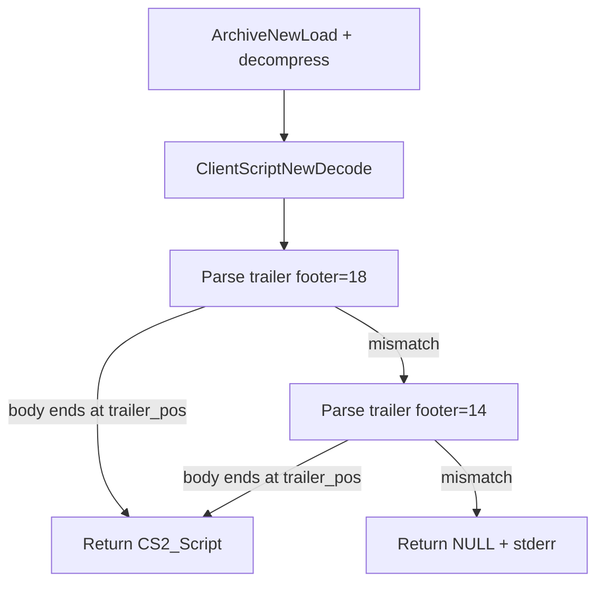

# Fix script 92 clientscript decode (dual trailer format)

## Root cause (confirmed with hex + probe)

Script **92** is a small 4-op stub (`PUSH_INT_LOCAL`, `GOSUB 486`, `POP_INT_DISCARD`, `RETURN`) — not the full 44-step trace (that includes gosub into script 486).

| Cache                    | Decompressed size | Decode result                             |
| ------------------------ | ----------------- | ----------------------------------------- |
| xrsps rev-237            | 38 bytes          | **OK** — `op_count=4`                     |
| `3draster/cache` (older) | 34 bytes          | **FAIL** — `op count mismatch: 3 != 5376` |

**Why 5376?** The C decoder uses the **modern** trailer offset:

```c
trailer_pos = data_size - 18 - trailer_len;  // 16-byte header + 2-byte length suffix
```

On the 34-byte legacy blob this lands at byte **15** (inside the `RETURN` operand), so `op_count` reads `0x00001500` = **5376**.

**Legacy layout** (matches [`validate_cache.py`](tools/cs2_gen_opcodes/validate_cache.py) `data_size - 14 - trailer_len`):

```
[body][op_count i32][localInt u16][localObj u16][intArg u16][objArg u16][switchCount u8][switch tables…][trailer_len u16]
         |<—— 12-byte fixed header ——>|
```

**Modern layout** (matches [xrsps-typescript `Script.ts`](file:///Users/matthewevers/Documents/git_repos/xrsps-typescript/src/rs/cs2/Script.ts) and current C decoder):

```
[body][op_count i32][localInt u16][localObj u16][localLong u16][intArg u16][objArg u16][longArg u16][switchCount u8][switch tables…][trailer_len u16]
         |<—————— 16-byte fixed header ——————>|
trailer_pos = length - 2 - switchLength - 16   // equivalent to length - 18 - trailer_len
```

Hex diff (tail of decompressed script 92):

- **xrsps (38 B):** `…0004 0001 0000 0000 0001 0000 0000 0001` — includes `localLong=0`, `longArg=0`
- **old (34 B):** `…0004 0001 0000 0001 0000 0001` — no long fields

## Reference: rs-cache-library

[`rs-cache-library`](file:///Users/matthewevers/Documents/git_repos/rs-cache-library) (Displee) covers **archive container I/O only** — sector chaining, GZIP/BZIP2/LZMA decompression ([`ArchiveSector.decompress`](file:///Users/matthewevers/Documents/git_repos/rs-cache-library/src/main/kotlin/com/displee/compress/CompressionExt.kt)). It does **not** parse CS2 bytecode.

Our pre-decode path already matches this envelope in [`shared_archive_decompress.c`](src/osrs/rscache/shared/shared_archive_decompress.c) (compression byte + compressed/uncompressed sizes). The failure happens **after** decompression, in trailer parsing — not in cache loading.

Use rs-cache-library as validation that compressed script blobs are being expanded correctly; the fix belongs in [`dat2a_clientscript.c`](src/osrs/rscache/dat2a/dat2a_clientscript.c).

## Fix: dual-format decode in `dat2a_clientscript.c`

Refactor `RSCacheDat2A_ClientScriptNewDecode` into:

1. **Shared body parser** — given `trailer_pos`, `op_count`, and trailer fields already read, parse signature + opcode stream from offset 0.
2. **Operand sizing via meta table** — replace `cs2_operand_is_int8()` heuristic with [`cs2_opcode_operand_kind()`](src2/vm/cs2_opcode_meta.c):
   - `CS2_OPERAND_INT8` → `G1b`
   - `CS2_OPERAND_INT32` → `G4`
   - `CS2_OPERAND_STRING` → null-terminated string
   - Handle `CS2_OP_PUSH_CONSTANT_LONG` (61) as 8-byte operand (already special-cased)
3. **Two trailer parsers**:
   - **Modern** (`footer=18`): current fields including `local_long_count`, `long_argument_count`
   - **Legacy** (`footer=14`): omit long counts (zeros on `CS2_Script`)
4. **Auto-select format** — try modern first; accept if body parse reaches `trailer_pos` with `op == op_count`. If not, retry legacy. If both fail, log which format was attempted and return NULL.



## Secondary: align `validate_cache.py`

Update [`tools/cs2_gen_opcodes/validate_cache.py`](tools/cs2_gen_opcodes/validate_cache.py) `decode_script()` to use the same dual-footer logic (or call out that it only scans opcodes on legacy caches). Optional but keeps tooling consistent.

## Verification

1. **Probe** (manual): decode script 92 from both caches → xrsps: 4 ops; old cache: 4 ops (not NULL, not 5376).
2. **Parity**: `node tools/cs2_parity/run_parity.mjs --cache <xrsps>` → all 15 PASS (no regression on rev-237 goldens).
3. **interface161_test** with `3draster/cache`:
   ```bash
   ./interface161_test cache --iface 387 --sprites --panel out.bmp
   ```
   stderr should no longer show `failed to decode script 92`; `onload_hooks` should run and dynamic children should appear.
4. **interface161_test** with xrsps cache — unchanged behavior.

## Files to change

| File                                                                                         | Change                                                        |
| -------------------------------------------------------------------------------------------- | ------------------------------------------------------------- |
| [`src/osrs/rscache/dat2a/dat2a_clientscript.c`](src/osrs/rscache/dat2a/dat2a_clientscript.c) | Dual trailer format + `cs2_opcode_operand_kind` operand reads |
| [`src/osrs/rscache/dat2a/dat2a_clientscript.h`](src/osrs/rscache/dat2a/dat2a_clientscript.h) | (only if new helpers need exporting)                          |
| [`tools/cs2_gen_opcodes/validate_cache.py`](tools/cs2_gen_opcodes/validate_cache.py)         | Optional: dual-footer opcode scan                             |

No changes needed in [`cs2_runner.c`](tools/interface161_test/cs2_runner.c) once decode is fixed — it already loads via `ClientScriptNewFromDat2Archive` correctly.
