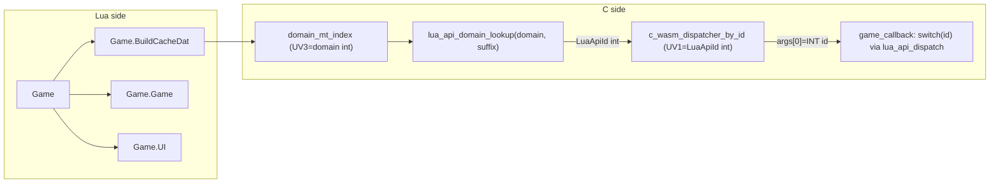

# Idiomatic Lua `Game` API + integer dispatch + generated hash lookup

## Current behavior (baseline)

- [`luac_sidecar.c`](src/osrs/lua_sidecar/luac_sidecar.c) registers one global `Game` with `__index` caching C closures per flat method name (e.g. `buildcachedat_has_model`). UV1 is that **string**, which `c_wasm_dispatcher` `strdup`s into the first VarTypeArray element.
- The same flat-string approach mirrors in [`luajs_sidecar.js`](src/platforms/browser2/luajs_sidecar.js): `wasmDispatcher` reads `func_name` from UV1, calls `gt.stringToWasm()` + `gt.newString()` to put the string into the VarTypeArray, then calls `wasm._dispatch_lua_command(args)`.
- [`platform_impl2_osx_sdl2.cpp`](src/platforms/platform_impl2_osx_sdl2.cpp) (and [`test/browser.cpp`](test/browser.cpp), [`test/browser_native.cpp`](test/browser_native.cpp)) extract the string from `args[0]`, run a prefix-chain `if/else`, then `strcmp`-dispatch inside each module.
- [`lua_buildcachedat.c`](src/osrs/lua_sidecar/lua_buildcachedat.c) uses a `DISPATCH_COMMAND` macro (lines 728-795); the other modules use plain `strcmp` ladders.

Wire format today: `args[0]` is `LUAGAMETYPE_STRING` (e.g. `"buildcachedat_has_model"`).

## Target Lua surface (PascalCase)

Five subtables under `Game`, named by PascalCase of the existing prefix:

- `Game.BuildCacheDat` — was `Game.buildcachedat_*`
- `Game.Game` — was `Game.game_*`
- `Game.Dash` — was `Game.dash_*`
- `Game.UI` — was `Game.ui_*`
- `Game.Misc` — was `Game.misc_*`

Examples:

- `Game.buildcachedat_has_model(x)` -> `Game.BuildCacheDat.has_model(x)`
- `Game.game_exec_pkt_player_info(d,l)` -> `Game.Game.exec_pkt_player_info(d,l)`
- `Game.ui_load_fonts(c)` -> `Game.UI.load_fonts(c)`
- `Game.dash_load_textures()` -> `Game.Dash.load_textures()`
- `Game.misc_load_camera()` -> `Game.Misc.load_camera()`

All call sites are in [`src/osrs/scripts/`](src/osrs/scripts/) (confirmed by grep; no other consumers in-repo).

> Note: `Game.Game` is admittedly redundant but keeps the naming rule consistent. If you prefer a different name (e.g. `Game.World`) that is easy to rename before implementation.

## New wire format: integer `LuaApiId`

**Key change**: `args[0]` becomes `LUAGAMETYPE_INT` holding a `LuaApiId` enum value. **No string is ever constructed or copied at call time.**

The lookup from method name -> id happens exactly **once per unique method, at `__index` time**, and the result is cached in the weak table. All subsequent calls go straight to the integer-upvalue closure.

## Central registry: [`lua_api.h`](src/osrs/lua_sidecar/lua_api.h) (new)

One X-macro list covering all ~70 dispatchable commands across all domains.

Each row is: `X(EnumId, FullString, Domain, Suffix)`, e.g.:

```c
X(LUA_API_BUILDCACHEDAT_HAS_MODEL,    "buildcachedat_has_model",    DOMAIN_BUILDCACHEDAT, "has_model")
X(LUA_API_GAME_EXEC_PKT_PLAYER_INFO,  "game_exec_pkt_player_info",  DOMAIN_GAME,          "exec_pkt_player_info")
X(LUA_API_UI_LOAD_FONTS,              "ui_load_fonts",              DOMAIN_UI,            "load_fonts")
```

Rows are split across **per-domain fragment files** co-located with each module:

- [`lua_buildcachedat_api.inc`](src/osrs/lua_sidecar/lua_buildcachedat_api.inc)
- [`lua_game_api.inc`](src/osrs/lua_sidecar/lua_game_api.inc)
- [`lua_ui_api.inc`](src/osrs/lua_sidecar/lua_ui_api.inc)
- [`lua_dash_api.inc`](src/osrs/lua_sidecar/lua_dash_api.inc)
- [`lua_sidecar_misc_api.inc`](src/osrs/lua_sidecar/lua_sidecar_misc_api.inc)

[`lua_api.h`](src/osrs/lua_sidecar/lua_api.h) includes them all inside a single `#define X(...) ... / #undef X` block to derive:

- `enum LuaApiId { LUA_API_INVALID = 0, ... }`
- `static const char* k_lua_api_strings[]` (full strings, indexed by id, for init/verification)
- `static const char* k_lua_api_suffixes[]` (suffix strings, for per-domain lookup at `__index` time)
- `static const int k_lua_api_domains[]` (domain enum per id)

Public C API (implemented in [`lua_api.c`](src/osrs/lua_sidecar/lua_api.c)):

```c
void     lua_api_init(void);
LuaApiId lua_api_lookup_full(const char* s, size_t n);   // full string -> id (verification / old callers)
LuaApiId lua_api_domain_lookup(int domain, const char* suffix, size_t n); // suffix -> id within domain
```

`lua_api_init()` is called once from [`LuaCSidecar_New`](src/osrs/lua_sidecar/luac_sidecar.c) before `create_wasm_object`.

## Generated [`lua_api_ht.c`](src/osrs/lua_sidecar/lua_api_ht.c) + Python tool

[`tools/ci/gen_lua_api_ht.py`](tools/ci/gen_lua_api_ht.py) does:

1. **Parse** the `.inc` fragment files to get `(id, full_string, domain, suffix)` rows.
2. **Search** for optimal hash: try FNV-1a, djb2, Murmur3-mix, polynomial rolling (tunable seed/multiplier) x table sizes from `ceil(1.25xN)` up to `2xN` (next power of two preferred). Metric: min max-probe-depth, then min average probes, then `timeit` microbenchmark on actual strings.
3. **Emit `lua_api_ht.c`** (regen command in top comment):
   - **Global open-addressing table** (precomputed `slot_id[]`, `slot_hash_sig[]`): for `lua_api_lookup_full`.
   - **Per-domain sorted arrays** of `(suffix, LuaApiId)` pairs: for `lua_api_domain_lookup` via bsearch. These are small (<=40 entries per domain), so bsearch is cache-friendly and sufficient.
4. **`lua_api_init()`** in `lua_api.c` **verifies** every slot by checking `lua_api_hash_bytes(k_lua_api_strings[id])` lands correctly and the full string matches. In debug builds this catches drift if the registry is edited but the generated file is stale. In release (`NDEBUG`) the function is a no-op.

The generated file is committed to the repo. Re-run `python3 tools/ci/gen_lua_api_ht.py` when the registry changes. An optional CMake `add_custom_command` can wire this up automatically when Python is available.

## Refactored `__index` and dispatcher in C

In [`luac_sidecar.c`](src/osrs/lua_sidecar/luac_sidecar.c), replace `mt_index` + `c_wasm_dispatcher` with:

**`domain_mt_index`** (shared by all five subtables, domain passed as upvalue):

```
UV1: ctx (lightuserdata)
UV2: callback (lightuserdata)
UV3: domain (integer)
```

On first access for key `k`:

1. `id = lua_api_domain_lookup(domain, k, klen)` — bsearch, no string concat.
2. If `id == LUA_API_INVALID`: push nil, return.
3. Create closure `c_wasm_dispatcher_by_id` with UV1=`id` (integer), UV2=ctx, UV3=callback.
4. Store in weak cache as before.

**`c_wasm_dispatcher_by_id`**:

```
UV1: LuaApiId (integer)
UV2: ctx (lightuserdata)
UV3: callback (lightuserdata)
```

- Reads `id = lua_tointeger(L, upvalue(1))`.
- Builds VarTypeArray from Lua stack args (indices 1..nargs).
- **First element: `LuaGameType_NewInt((int)id)`** — no string allocation.
- Calls `callback(ctx, args)`.

**`push_domain_proxy(L, ctx, callback, domain_int)`**: shared helper that sets up one subtable + metatable + `domain_mt_index` closure, used five times in `create_wasm_object`.

## Refactored `game_callback` in platform/test files

[`platform_impl2_osx_sdl2.cpp`](src/platforms/platform_impl2_osx_sdl2.cpp), [`test/browser.cpp`](test/browser.cpp), [`test/browser_native.cpp`](test/browser_native.cpp) all become:

```c
static struct LuaGameType*
game_callback(void* ctx, struct LuaGameType* args)
{
    LuaApiId id = (LuaApiId)LuaGameType_GetInt(LuaGameType_GetVarTypeArrayAt(args, 0));
    struct LuaGameType* av = LuaGameType_NewVarTypeArrayView(args, 1);
    struct LuaGameType* result = lua_api_dispatch(ctx, id, av);
    LuaGameType_Free(av);
    return result ? result : LuaGameType_NewVoid();
}
```

`lua_api_dispatch` lives in [`lua_api.c`](src/osrs/lua_sidecar/lua_api.c): a `switch(id)` calling the existing `LuaBuildCacheDat_*`, `LuaGame_*`, `LuaUI_*`, `LuaDash_*`, `LuaSidecarMisc_*` functions directly (same signatures as today).

This eliminates:

- All `Lua*_*_DispatchCommand` wrapper functions (they become dead code).
- All `Lua*_*_CommandHasPrefix` helpers.
- The `DISPATCH_COMMAND` macro.
- The prefix-stripping `memcpy`/`strlen` boilerplate inside each per-module dispatcher.

## JS sidecar: [`luajs_sidecar.js`](src/platforms/browser2/luajs_sidecar.js)

Mirrors the C changes:

- `createWasmLuaBridge` creates `Game` as a plain table and stores five named subtables (`BuildCacheDat`, `Game`, `Dash`, `UI`, `Misc`), each with its own `domainMtIndex` closure.
- Each subtable's `mtIndex` upvalue stores a per-domain JS `Map<string, number>` (populated from a static JS literal generated by the Python script, or a hand-written equivalent since the set is small). On first access for key `k`, looks up `k` in the domain map, gets integer `id`.
- Creates `wasmDispatcherById` closure with UV1 = integer `id` (via `lua.lua_pushinteger`).
- `wasmDispatcherById`: reads `id = lua.lua_tointeger(L, upvalue(1))`, builds VarTypeArray, first element is `gt.newInt(id)` — **no `stringToWasm`/`newString` call**.
- `wasm._dispatch_lua_command(args)` on the C side sees `LUAGAMETYPE_INT` at `args[0]`.

The Python script can emit a companion `.js` snippet with the per-domain lookup maps so they stay in sync with the C registry automatically.

## Build system

Add to [`CMakeLists.txt`](CMakeLists.txt) alongside existing lua_sidecar sources:

- `src/osrs/lua_sidecar/lua_api.c`
- `src/osrs/lua_sidecar/lua_api_ht.c` (generated)

## Risks / notes

- **`Game.Game` naming**: confirm before implementation — easy to rename to e.g. `Game.World` or `Game.Core` if preferred.
- **`lua_buildcachedat.c` dead code**: unreachable `return LuaGameType_NewVoid()` after the dispatch else — remove during cleanup.
- **`lua.lua_pushinteger` / `lua.lua_tointeger` in Fengari**: verify these are exposed and round-trip correctly in the version used by the browser build.
- **`gt.newInt`**: check [`luajs_gametypes.js`] already implements `newInt`; if not, add a one-liner.
- **Per-domain lookup mismatch**: if a `.inc` is edited but the generated `.c` is not re-run, `lua_api_init()` asserts fire in debug; `lua_api_domain_lookup` returns `LUA_API_INVALID` in release (nil from `__index`), giving an obvious error rather than silent misbehavior.


