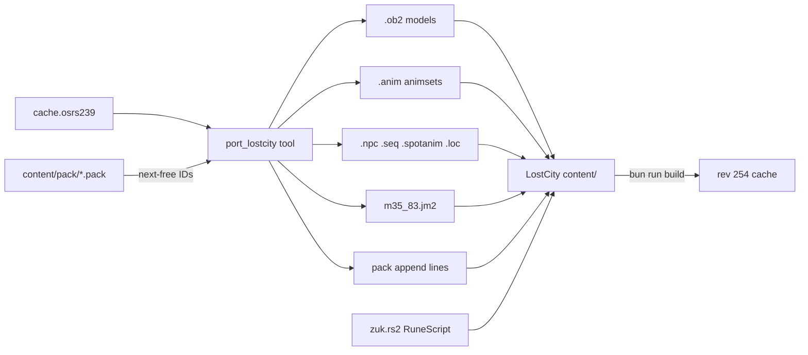

# Port TzKal-Zuk Encounter to Lost City

## Context

- Lost City (`/Users/matthewevers/Documents/git_repos/LostCity_Server`) packs its cache from **source files**: `.ob2` models and `.anim` animset archives in `content/models/`, text configs (`.npc`, `.seq`, `.spotanim`, `.loc`) beside scripts, text `.jm2` maps in `content/maps/`, with manual ID registration in `content/pack/*.pack`. The client prefetches all animsets and registers frames by IDs embedded in each `.anim` archive (verified in `webclient/src/dash3d/AnimFrame.ts`), so new animations only need new global frame IDs + pack entries.
- rscache already decodes osrs239 (dat2) and has the needed dat1 encoders: `tool_transcode_model_to_ob2`, `tool_transcode_framemap_to_animbase`, `tool_transcode_dat2_frame_to_dat1` in [3rd/rscache/tools/common/transcode.c](3rd/rscache/tools/common/transcode.c), and `RSCache_Dat1AnimBaseFramesEncode` — this produces exactly the head/tran1/tran2/del/base archive format `AnimFrame.unpack` consumes. What is missing is a tool that emits **Lost City source files** (text configs, `.jm2`, pack lines) instead of a binary dat1 cache.
- Full asset/mechanic inventory extracted from Kronos ([research](5206b492-c15f-4b7b-9069-2d289a049d6e)). Encounter scope: full fight (shield safespot, add waves, Jad phase, healers); arena map with all scenery locs; setup cutscene skipped (Zuk spawns directly).

## Asset inventory (OSRS IDs → new Lost City IDs)

- NPCs (new IDs 1162+): 7706 TzKal-Zuk, 7707 Ancestral Glyph, 7708 Jal-MejJak, 7700 JalTok-Jad, 7701 Yt-HurKot, 7702 Jal-Xil, 7703 Jal-Zek
- Seqs (new IDs 1191+): Zuk 7562/7563/7565/7566; glyph 7568/7569; MejJak 2863/2864/2865/2868; Jad 7590–7594; Yt-HurKot 2639; Jal-Xil 7604–7607; Jal-Zek 7610/7612/7613; plus each NPC's stand/walk seqs from its config
- Spotanims (new IDs 282+): 1375 (Zuk proj), 1376 (Zek proj), 1377 (Xil proj), 660 (heal/lava proj), 659 (lava splash), 447–450 (Jad magic), 451 (Jad range impact), 157 (Jad hit), 444 (Jad heal)
- Models 3856+, frames (anim.pack) 8929+, animsets 286+, bases 286+, locs 3855+
- Map: OSRS square 35_83 (region 9043) → same square in Lost City, `map.pack` entries 924+ (`m35_83`, `l35_83`). Arena coords carry over unchanged (Zuk spawn 2268,5364 = `0_35_83_28_52`).

## Phase 1: `port_lostcity` exporter tool

New CLI at `3rd/rscache/tools/port_lostcity/`, reusing closure/ID-remap logic from [3rd/rscache/tools/port_npc/main.c](3rd/rscache/tools/port_npc/main.c) and [3rd/rscache/tools/common/port_plan.c](3rd/rscache/tools/common/port_plan.c). Inputs: osrs239 cache dir, Lost City content dir (to parse existing `.pack` files for next-free IDs), lists of npc/spotanim/mapsquare IDs. Output: an overlay directory mirroring `content/` plus `pack_append/*.txt` fragments.

Per asset type:

- **NPC**: decode `RSCache_Dat2ConfigNpc` → emit text `.npc` (name, models, size, ready/walk anims, hitpoints, combat stats, vislevel). The port_npc README says osrs239 NPC records are refused (decoder gap); extend `dat2_config_npc.c` with the missing ≥237 opcodes for these 8 NPCs (fallback cross-check: `cache.osrs184`/kronos uses identical IDs).
- **Models**: `tool_transcode_model_to_ob2` → `model_N.ob2` files. Textured OSRS faces lose textures in OB2; map dropped textures to a nearest flat colour so Zuk doesn't render black/white.
- **Seqs**: decode `RSCache_Dat2ConfigSequence`; group frames by framemap; per framemap emit one `.anim` animset via transcode + `RSCache_Dat1AnimBaseFramesEncode`, embedding newly-allocated global frame IDs; emit `.seq` text (`frame1=anim_NNNN`, `delay1=`, `replayoff`, walkmerge, etc.) and `anim.pack`/`base.pack`/`animset.pack` lines.
- **Spotanims**: decode dat2 spotanim → `.spotanim` text (model, anim, resizeh/v, angle, ambient/contrast, recols) + its model and seq via the pipelines above.
- **Map 35_83**: decode `RSCache_MapTerrain` (u16 attrs → u8 semantics) + `RSCache_MapLocs`; enumerate unique loc IDs; port each loc config (`.loc` text) + models; remap loc IDs; emit `m35_83.jm2` in the text format consumed by `engine/tools/pack/map/Pack.js` (`==== MAP ====`, `==== LOC ====` sections). OSRS overlay/underlay floor IDs need a mapping table to rev-254 `.flo` IDs (nearest colour match); locs that fail transcode are logged and skipped.

## Phase 2: Lost City content

All new content under `content/scripts/areas/area_inferno/` (configs + scripts), models into `content/models/`, map into `content/maps/`, append pack entries.

- Configs: `inferno.npc`, `inferno.seq`, `inferno.spotanim`, ported `.loc`s, `inferno.hunt` (player hunt modes for adds), `inferno.constant` (IDs, coords, timings, HP thresholds).
- `zuk.rs2` and sibling scripts, modelled on `areas/area_kalphite/scripts/kalphite_queen.rs2` and `skill_combat/scripts/projectile.rs2` helpers:
  - `[debugproc,zuk]`: teleport player to the arena, spawn glyph at `0_35_83_30_51` and Zuk at `0_35_83_28_52` facing south, init `%zuk_*` vars.
  - **Zuk AI** (`ai_timer`, 10-tick cycle): stationary; no attacks until glyph first reaches an end; each cycle pick ranged/magic style, fire spotanim-1375 projectile, then queued hit `rand(0..251)` ignoring prayer/defence — nullified (redirected to glyph defend anim 7568) if the player's X is inside the glyph safe band (glyph X ± the Kronos offsets by movement direction).
  - **Glyph AI** (`ai_timer`): walk 1 tile/tick between x 2257 and 2283 at z 5361, pause 4 ticks at each end, reverse; death (anim 7569) permanently removes the safespot.
  - **Phases** (checked in Zuk's `ai_queue2` damage trigger): HP ≤ 480 → spawn Jad once at (2270,5347); HP ≤ 240 → spawn 4 Jal-MejJak healers once at the Kronos coords. Add-wave timer: Jal-Xil + Jal-Zek pair 60 ticks after glyph ready, then every ≥350 ticks, +175 after Jad spawns; paused while Zuk HP is 479–599.
  - **Jad AI**: 9-tick cycle; magic (self-gfx 447 + 448/449/450 projectile chain) or ranged (impact gfx 451) at distance, melee (7590) in range; max 113; at <50% HP spawn 3 Yt-HurKot healers (heal anim 2639, gfx 444).
  - **Healer AI**: heal Zuk 10–25 every ~5 ticks with projectile 660 until damaged by the player, then lava attack (anim 2868, proj 660, splash 659, 3-tick, max 10).
  - Projectile timing: convert Kronos client-cycle params (delay/duration in 30ms cycles) to ticks using the `~npc_projectile`/`~coord_projectile` helpers and `docs/projectiles.md`.
  - Cleanup: on Zuk death (anim 7562) or player death/logout, despawn all encounter NPCs.
- Zuk keeps native 1200 HP (`hitpoints` packs as u16, cap 5000).

## Phase 3: Build and verify

- Build the exporter (rscache tools makefile), run it, copy output into content, then `bun run build` in the engine and fix pack verify errors (every new name must exist in its `.pack`).
- Run server + webclient, `::~zuk`, verify: map renders, Zuk/glyph animate, safespot works, projectiles/hits land, Jad and healer phases trigger, fight is completable.

## Risks

- osrs239 NPC config decode gap — will extend the decoder; scoped to only the 8 NPCs needed.
- OSRS floor (.flo) and texture IDs have no rev-254 equivalents — nearest-colour mapping tables; visual fidelity best-effort.
- Some Inferno scenery locs may use model features OB2 can't express — skipped with a log, arena stays functional.
- Sound 163 (Jad hit) skipped unless a close existing `.synth` is found.
