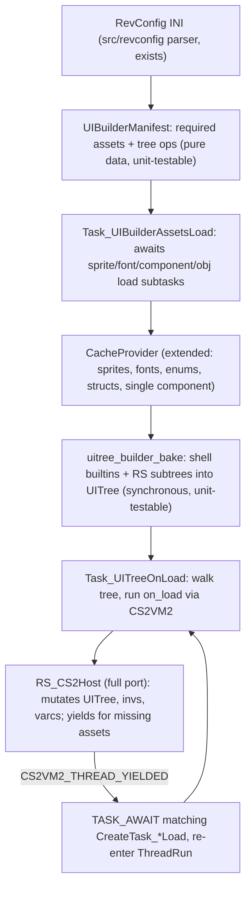

# Port UITree Builder to src/engine/uitree_builder

## Context

The v0/v1 builder is spread across RevConfig INI loading, cache interface decode, and tree bake (`v1/toriauxlib/core/tasks/instance_revconfig_context.c`, `task_instance_revconfig_load.c`, `task_dat2_component_load.c`, `v0/osrs/revconfig/uitree_load.c`). The new `src/ui` is a complete tree/layout/emit library with a cache-agnostic builder (`UITree_BuildFromSource`, `src/engine/uitree_from_component.c`), but nothing loads it from the cache yet. All cache access in src must go through the task pattern in [src/main.c](src/main.c): `CreateTask_*Load(provider, id)` → `TASK_AWAITSELF` → `CacheProvider_*Get`, with `PlatformX_IO_Process` fulfilling IO on yield.

Decisions already made: dat1 + dat2 both supported, era-agnostic via `CacheProvider`; single-Component loading in addition to ComponentPack; full port of `v1/games/runescape_cs2_host.c`.

## Architecture



## Phase 1: CacheProvider + leaf-task infrastructure

New asset types the builder and full host require (none exist in src today):

- `ToriRS_Sprite` exists in [src/engine/torirs_types.h](src/engine/torirs_types.h) but has no converter or load task. Add `torirs_sprite_from_rscache.{c,h}`, and `ToriRS_Font`, `ToriRS_Enum`, `ToriRS_Struct` converters (`ToriRS_Enum`/`ToriRS_Struct` are new types; port decode from v1 toriauxlib).
- Extend `struct CacheProvider` ([src/engine/cache_provider.h](src/engine/cache_provider.h)) with `font_cache`, `enum_cache`, `struct_cache` hmaps + Add/Get/Has/Cleanup helpers (sprite_cache already declared, unused).
- Extend `CacheProviderVTable` with `Task_SpriteLoad`, `Task_FontLoad`, `Task_EnumLoad`, `Task_StructLoad`, and `Task_ComponentLoad(provider, packed_component_id)`.
- Single component: `packed_id = (iface_id << 16) | child`. `CacheProvider_ComponentGet(provider, packed_id)` resolves into the pack cache; `Task_ComponentLoad` ensures the containing pack/group is loaded (dat2: interface archive; dat1: configs "data" jagfile) without requiring callers to think in packs.
- Leaf tasks under `src/engine/dat2/` (sprites table 8, fonts 13, enums/structs via configs table) and `src/engine/dat1/` (media jagfile pix8/pix32, title jagfile fonts p11/p12/b12/q8 — port decode from `v0/osrs/rscache/dat1a`). Same shape as [src/engine/dat2/task_dat2_component_pack_load.c](src/engine/dat2/task_dat2_component_pack_load.c): queue IO, `PT_YIELD`, decode, convert, `CacheProvider_*Add`.
- Extend `PlatformX_IO` supported tables ([src/platform/platform_x_io.c](src/platform/platform_x_io.c)) for the new dat2 tables and dat1 jagfiles, and `rscache_io.h` queue/decode helpers.

Convention to enforce throughout: `CreateTask_*Load` factories return NULL when cached, and `TASK_AWAITEX` does not guard NULL — add a `TASK_AWAITSELF_IF(expr)` macro to `asyncio.h` (skip when factory returns NULL) so builder loops stay readable.

## Phase 2: Inv store

RevConfig mutates inventories and CS2 reads them (`INVS_GET_*`), so port v1's `rs_inv_container.{c,h}` (container store) to `src/game/` largely as-is. Skip `ui_inv_data_service` indirection: a flat `RS_InvStore` with `find/set_slot/count/total` is all the host and builder need. RevConfig `[inv:name]` items seed named containers; component `inv=` binds a grid's container id at bake time.

## Phase 3: Full CS2 host port

Port `v1/games/runescape_cs2_host.c` (~1700 lines) to `src/game/rs_cs2_host.{c,h}`, decoupled from `GameRunescape`. The v1 host reaches into `game->ui_tree/core/scene/inv_data/view_port`; replace with an explicit context:

```c
struct RS_CS2Host {
    struct UITree* tree;                 /* src/ui */
    struct CacheProvider* provider;      /* replaces ToriAuxLibCore lookups */
    struct RS_InvStore* invs;
    int varc_int[...]; char varc_string[...][...];
    int client_clock, viewport_w, viewport_h, client_type;
    bool has_pending; struct CS2VM_HostRequest pending;
    /* inv/var transmit hook tables, as in v1 */
};
```

- All asset lookups become `CacheProvider_*Has/Get`; on miss, stage `pending` and return `CS2VM_EXECNO_YIELD` (never touch disk). Note CS2VM2's one-yield-per-opcode-site guard: after resume the request must succeed.
- UI mutation requests map to the existing `UITree_Apply*` / `UITree_CcCreate` / `UITree_FindByComponentId` API in [src/ui/uitree.h](src/ui/uitree.h) — these already cover the v1 mutation surface.
- Replace `src/game/task_cs2_script_exec.c`'s DummyHost usage with a generalized `src/game/task_cs2_run.{c,h}`: port the yield matrix from `v1/toriauxlib/core/tasks/dat2/task_dat2_cs2_run.c` (PUSHSCRIPT, ENUM*\*, STRUCT_PARAM, OC\*\*, CC/IF find → component load, WIDGET*SET_MODEL → model load, SETOBJECT → obj load), each dispatching the matching era-agnostic `CreateTask**Load`then re-entering`CS2VM2_ThreadRun`.

## Phase 4: src/engine/uitree_builder

```
src/engine/uitree_builder/
  uitree_builder.h        public API: UITreeBuilder ctx, CreateTask_UITreeBuild
  uitree_builder.c        ctx init/free; name→asset lookups (sprite/font registries)
  uitree_builder_manifest.{c,h}   RevConfig items → UIBuilderManifest (pure)
  uitree_builder_bake.{c,h}       manifest + provider → UITree (pure given loaded provider)
  uitree_builder_inv.{c,h}        inv seeding/binding + inv-transmit dispatch
  task_uitree_build.c     parent task (the readable loop)
  task_uibuilder_assets_load.c    subtask: await all manifest asset loads
  test/
```

### Taming RevConfig complexity: manifest as the seam

The key design move, addressing the "mutates invs, cache lookups, etc." complexity: split RevConfig application into three strictly ordered stages so no stage mixes IO with logic.

1. **Manifest (pure, no IO).** `uibuilder_manifest_from_revconfig(items) → UIBuilderManifest`. Walks `RevConfigItem`s (parser already in [src/revconfig/revconfig.c](src/revconfig/revconfig.c)) and produces flat lists: `SpriteReq {name, era_ref, atlas/crop/flip}`, `FontReq {name, archive_id, cache_font_id}`, `ComponentReq {packed_id or iface_id}` (from `componentno` on sidebar/chat/rs\_\* components — the `needs_rs_load` rule from v1 `task_instance_on_rc.c:210`), `InvSeed {name, item list}`, plus ordered `TreeOp`s for layout placements (builtin type, position, parent name, dirty flag, inv binding, sprite refs by name incl. `name[index]` syntax). Unit-tested against in-memory field streams like `src/revconfig/test/revconfig_test_items.c`.
2. **Asset load (task, no logic).** `Task_UIBuilderAssetsLoad` iterates the manifest requests and `TASK_AWAITSELF_IF`s the corresponding `CreateTask_*Load`. Inv seeds trigger `CreateTask_ObjLoad` per unique obj id (v0's `collect_inv_obj_ids` behavior). After this task, every name in the builder's sprite/font registries resolves to a provider-cached asset.
3. **Bake (pure given loaded provider).** `uitree_builder_bake(tree, manifest, provider, invs)`: push shell builtins (compass, minimap, sidebar, chat, world, sprite, redstone_tab, tab_icons, cross, minimenu, chat_button) via `UITree_Push`; for `ComponentReq`s, bake RS subtrees via the existing `UITree_BuildFromComponentPack` / `UITree_BuildFromSource` with sprite/font resolvers backed by the registries; seed `RS_InvStore` and bind inv grids. Asserts (not silent returns) if an asset the load stage should have produced is missing.

Because stages 1 and 3 are synchronous and IO-free, they are testable without a cache: tests hand-populate a `CacheProvider` (plain `CacheProvider_*Add` calls with fixture data) and assert on the resulting tree — same style as `src/ui/test`.

### The parent task (the readable loop)

```c
static int Task_UITreeBuild_Run(struct ToriRS_Task* base, struct ToriRS_IO* io) {
    struct Task_UITreeBuild* self = (struct Task_UITreeBuild*)base;
    PT_BEGIN(&self->pt);

    /* 1. Parse RevConfig INI into a manifest (local file, no cache IO). */
    uibuilder_manifest_from_revconfig_ini(&self->manifest, self->ini_path);

    /* 2. Load every cache asset the manifest needs. */
    TASK_AWAITSELF(CreateTask_UIBuilderAssetsLoad(self->builder, &self->manifest));

    /* 3. Bake the tree (synchronous; provider is fully populated). */
    uitree_builder_bake(self->tree, &self->manifest, self->provider, self->invs);
    UITree_LayoutResolve(self->tree, 0, 0, UITREE_ROOT_W, UITREE_ROOT_H);

    /* 4. Run IF3 on_load hooks; each may yield to load scripts/enums/objs. */
    for (self->i = 0; self->i < self->tree->component_count; self->i++) {
        if (!uitree_builder_node_onload_script(self->tree, self->i, &self->script_id, ...))
            continue;
        TASK_AWAITSELF(CreateTask_CS2Run(self->host, self->script_id, /*active com*/ ...));
    }

    /* 5. Dispatch initial inv-transmit hooks registered by on_load. */
    TASK_AWAITSELF(CreateTask_CS2InvTransmitDispatch(self->host));

    PT_END(&self->pt);
}
```

`on_load` reaches the tree via the pack conversion: verify `torirs_component_from_rscache.c` carries the IF3 `onLoad` hook (+ varp/inv triggers) into `ToriRS_Component` and `uitree_from_component.c` into node behavior/hooks; extend if missing (v1 reference: `toriauxlibcache_component_dat2_convert.c:207-246`).

## Phase 5: Wiring + tests

- Replace/extend `Task_Dummy` in [src/main.c](src/main.c) with `CreateTask_UITreeBuild(provider, tree, host, ini_path)` behind the existing driver loop, using a rev INI from `v0/osrs/revconfig/configs/rev_245_2/` (dat1) and the dat2 equivalent.
- Makefile: add `src/engine/uitree_builder/*.c`, `src/game/rs_cs2_host.c`, `task_cs2_run.c`, new leaf tasks to `SRCS`; add `test-uitree-builder` target alongside `test-uitree` / `test-revconfig`.
- Tests:
  - Manifest: field-stream fixtures → assert requests and tree ops (pure).
  - Bake: fixture `ToriRS_ComponentPack` + hand-added sprites/fonts → assert tree topology, IF3 positions, inv binding (pure).
  - Host: scripted `CS2VM_HostRequest` sequences against a small tree → assert mutations and yield staging (pure).
  - End-to-end task: pump `ToriRS_TaskQueue` + `PlatformX_IO_Process` against the real test cache dir (as main.c does), assert built tree renders through `UITree_EmitFill`.

## Known v0/v1 quirks to fix in the port (not replicate)

- v0 dropped RECT/LINE/INV_TEXT and never baked CS1 scripts on expand — port the complete v1 bake behavior.
- v1 LINE-horizontal-via-`filled` aliasing and aspect fields from baseWidth/baseHeight — carry the working behavior but through properly named fields in the manifest/bridge.
- v0 relative-edge flags overwrite instead of OR — use OR.
- Convert silent-return guards encountered in touched functions to asserts per workspace rule.

## Suggested implementation order

Phases 1→5 as listed; within phase 1, do dat2 first (interfaces/sprites/fonts wiring exists partially), then dat1. Phase 2 is independent and small. Phase 3 (host) and phase 4 stages 1–3 (manifest/bake) can proceed in parallel since the manifest/bake don't need the host.
