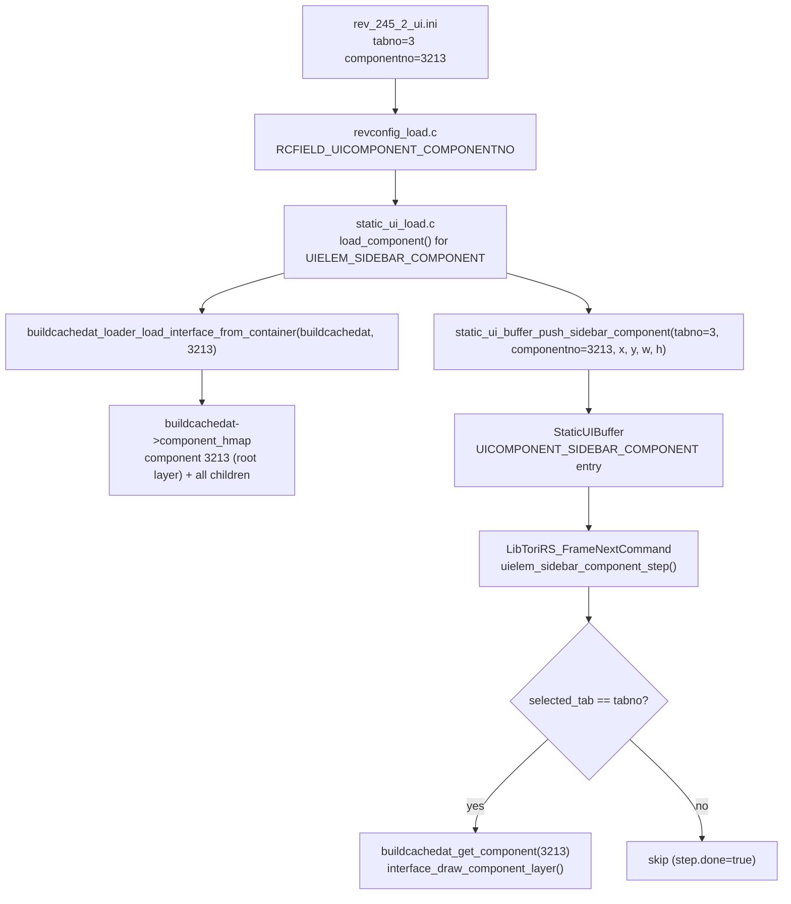

# Add `sidebar_component` Static UI Element

## Overview

The `sidebar_component` type renders a fixed interface component from the cachedat (identified by `componentno`) when the selected sidebar tab equals `tabno`. Unlike `UIELEM_BUILTIN_SIDEBAR` (which uses the server-assigned `tab_interface_id[tab]`), this renders a compile-time-fixed component ID.

The INI entry already exists in `[rev_245_2_ui.ini](src/osrs/revconfig/configs/rev_245_2/rev_245_2_ui.ini)`:

```ini
[component:sidebar_tab]
type=sidebar_component
tabno=3
componentno=3213
```

## Data Flow



## Files to Change

### 1. `[src/osrs/revconfig/revconfig.h](src/osrs/revconfig/revconfig.h)`

Add after `RCFIELD_UICOMPONENT_SPRITE_ACTIVE`:

```c
RCFIELD_UICOMPONENT_COMPONENTNO,
```

### 2. `[src/osrs/revconfig/revconfig_load.c](src/osrs/revconfig/revconfig_load.c)`

In `push_field_from_ini_kv`, after the `tabno` branch:

```c
else if( strcmp(key, "componentno") == 0 && strcmp(s_ini_item_type, "component") == 0 )
    kind = RCFIELD_UICOMPONENT_COMPONENTNO;
```

### 3. `[src/osrs/revconfig/static_ui.h](src/osrs/revconfig/static_ui.h)`

- Add `UIELEM_SIDEBAR_COMPONENT = 13` to the `StaticUIComponentType` enum.
- Add union member to `StaticUIComponent`:

```c
  struct {
      int tabno;
      int componentno;
  } sidebar_component; /* UIELEM_SIDEBAR_COMPONENT */


```

- Declare `static_ui_buffer_push_sidebar_component(buffer, tabno, componentno, x, y, w, h)`.

### 4. `[src/osrs/revconfig/static_ui.c](src/osrs/revconfig/static_ui.c)`

- Add `"sidebar_component"` case to `static_ui_component_type_str`.
- Implement `static_ui_buffer_push_sidebar_component` (mirrors `push_builtin_sidebar`, also sets `u.sidebar_component.tabno` and `u.sidebar_component.componentno`).

### 5. `[src/osrs/revconfig/static_ui_load.c](src/osrs/revconfig/static_ui_load.c)`

- Add `int componentno` to both `ComponentLoad` and `ComponentEntry` structs.
- Add `"sidebar_component"` → `UIELEM_SIDEBAR_COMPONENT` to `component_type_from_string`.
- Handle `RCFIELD_UICOMPONENT_COMPONENTNO` in the field parser: `load._component.componentno = atoi(field->value)`.
- Add `UIELEM_SIDEBAR_COMPONENT` case in `load_component`:
  - Store `tabno` and `componentno` on `component_entry`.
  - Call `buildcachedat_loader_load_interface_from_container(buildcachedat, "interfaces", load->componentno)` to pre-load the interface archive.
- Add `UIELEM_SIDEBAR_COMPONENT` case in `load_layout`:
  - Call `static_ui_buffer_push_sidebar_component(...)`.

### 6. `[src/osrs/buildcachedat_loader.h](src/osrs/buildcachedat_loader.h)` + `[src/osrs/buildcachedat_loader.c](src/osrs/buildcachedat_loader.c)`

Add a new helper used at load time:

```c
void buildcachedat_loader_load_interface_from_container(
    struct BuildCacheDat* buildcachedat,
    const char* container_name,
    int interface_id);
```

Implementation:

- `buildcachedat_named_container(buildcachedat, container_name)` → return if NULL.
- Assert/check it is `BuildCacheContainerKind_JagfilePackIndexed`.
- Call `filelist_dat_indexed_new_from_decode(index_data, …, data, …)`.
- Extract the sub-archive slice at `offsets[interface_id]`.
- Call `buildcachedat_loader_load_interfaces(buildcachedat, slice_ptr, slice_size)`.
- Free the `FileListDatIndexed`.

### 7. `[src/tori_rs_frame.u.c](src/tori_rs_frame.u.c)`

- Add `uielem_sidebar_component_step`, modelled after `uielem_builtin_sidebar_step`:
  - Guard: requires `game->iface`, `game->buildcachedat`, `game->sys_dash`, `game->iface_view_port`.
  - Check `game->iface->selected_tab == component->u.sidebar_component.tabno`; return early if not matching.
  - Use `buildcachedat_get_component(game->buildcachedat, component->u.sidebar_component.componentno)` as the root.
  - Allocate pixel buffer, call `interface_draw_component_layer`, restore viewport.
- Add `case UIELEM_SIDEBAR_COMPONENT: uielem_sidebar_component_step(game, component, &step); break;` to `LibToriRS_FrameNextCommand`.

## Notes

- The `buildcachedat_loader_load_interface_from_container` call in `load_component` is a no-op if the named container does not exist (graceful degradation — interfaces loaded dynamically via the network still work).
- The rendering path is almost identical to `uielem_builtin_sidebar_step`; the key difference is the root component ID comes from `componentno` rather than `game->iface->tab_interface_id[tab]`.
- The commented-out sprite upload path from `uielem_builtin_sidebar_step` is left as-is (same pattern for the new function).
