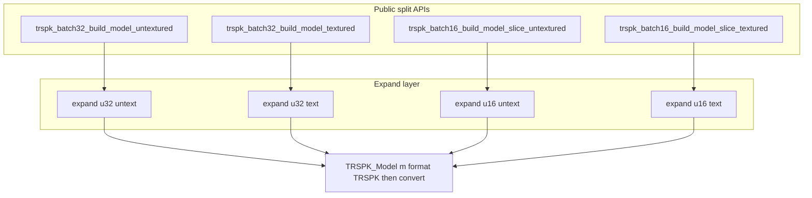

# Refactor: split modes, `NONE` format, `TRSPK_Model` as the only output

**Naming:** The expanded mesh struct is **`TRSPK_Model`** (files [`trspk_model.h`](src/platforms/ToriRSPlatformKit/src/tools/trspk_model.h) / [`trspk_model.c`](src/platforms/ToriRSPlatformKit/src/tools/trspk_model.c)). This is distinct from **`TRSPK_ModelId`** in [`trspk_types.h`](src/platforms/ToriRSPlatformKit/include/ToriRSPlatformKit/trspk_types.h) (the 16-bit id). Rename all existing `TRSPK_CookedModel` / `trspk_cooked_model_*` symbols to **`TRSPK_Model` / `trspk_model_*`**.

## 1. `TRSPK_VERTEX_FORMAT_NONE` in [`trspk_types.h`](src/platforms/ToriRSPlatformKit/include/ToriRSPlatformKit/trspk_types.h)

- Append `TRSPK_VERTEX_FORMAT_NONE` to `TRSPK_VertexFormat` (after `METAL`) so existing `TRSPK/WEBGL1/METAL` **numeric values stay 0/1/2** (no silent ABI change for existing stored values).
- Semantics: a `TRSPK_Model` with `format == NONE` is **uninitialized** or **cleared** (no valid vertex buffer; `indices` should be `NULL`).

## 2. [`trspk_vertex_format.c`](src/platforms/ToriRSPlatformKit/src/tools/trspk_vertex_format.c) / [`.h`](src/platforms/ToriRSPlatformKit/src/tools/trspk_vertex_format.h)

- `trspk_vertex_format_stride(NONE)` → `0` (or document that `NONE` is not a layout format).
- `trspk_vertex_format_convert`: `NONE` is invalid for conversion (early return; consistent with codebase).

## 3. [`trspk_model.h`](src/platforms/ToriRSPlatformKit/src/tools/trspk_model.h) / [`trspk_model.c`](src/platforms/ToriRSPlatformKit/src/tools/trspk_model.c)

- **`typedef struct TRSPK_Model`** with `vertex_count`, `index_count`, `uint32_t* indices`, `TRSPK_VertexFormat format`, and the union of `as_trspk` / `as_metal` / `as_webgl1` (same layout as today’s cooked struct).
- **`void trspk_model_free(TRSPK_Model* m)`** — if `format == NONE`, do not dereference union; free `indices` if non-NULL.
- Replace `trspk_cooked_model_init_from_trspk` with:
  - **`bool trspk_model_set_trspk_expanded(TRSPK_Model* m, TRSPK_Vertex* src_ownership, uint32_t n, uint32_t* indices_ownership, uint32_t icount)`**
  - **`bool trspk_model_convert_from_trspk(TRSPK_Model* m, TRSPK_VertexFormat dst_format)`** — requires `m->format == TRSPK_VERTEX_FORMAT_TRSPK`; `dst_format` must not be `NONE` (or handle no-op for `TRSPK`).

## 4. [`trspk_model_expand.c`](src/platforms/ToriRSPlatformKit/src/tools/trspk_model_expand.c) / [`.h`](src/platforms/ToriRSPlatformKit/src/tools/trspk_model_expand.h)

Remove the merged `trspk_model_expand_face_slice` with `bool textured` and dual index pointers.

**Add four public entry points** (implementation may share static helpers only):

- `trspk_model_expand_face_slice_u32_untextured` / `..._u32_textured`
- `trspk_model_expand_face_slice_u16_untextured` / `..._u16_textured`

Each can either return raw buffers **or** fill a `TRSPK_Model*` with `format = TRSPK` — align with §5 so the loader layer is `TRSPK_Model*`-first.

## 5. [`trspk_cache_model_loader32`](src/platforms/ToriRSPlatformKit/src/tools/trspk_cache_model_loader32.c) / [`.h`](src/platforms/ToriRSPlatformKit/src/tools/trspk_cache_model_loader32.h)

- Remove merged `trspk_batch32_build_vertices` + `trspk_batch32_build_vertices_free(vertices, indices)`.
- Add, for example:
  - `trspk_batch32_build_model_untextured(TRSPK_Model* m, const TRSPK_BakeTransform* bake, <untextured arrays>)`
  - `trspk_batch32_build_model_textured(TRSPK_Model* m, const TRSPK_BakeTransform* bake, TRSPK_UVMode uv_mode, <textured arrays>)`
- `trspk_batch32_add_model` / `add_model_textured`: temp `TRSPK_Model`, call matching `build_model_*`, `trspk_batch32_add_mesh`, `trspk_model_free`.

## 6. [`trspk_cache_model_loader16`](src/platforms/ToriRSPlatformKit/src/tools/trspk_cache_model_loader16.c) / [`.h`](src/platforms/ToriRSPlatformKit/src/tools/trspk_cache_model_loader16.h)

- `trspk_batch16_build_model_slice_untextured(TRSPK_Model* m, uint32_t start_face, uint32_t slice_face_count, ...)`
- `trspk_batch16_build_model_slice_textured(...)`

## 7. [`trspk_lru_model_cache`](src/platforms/ToriRSPlatformKit/src/tools/trspk_lru_model_cache.c) / [`.h`](src/platforms/ToriRSPlatformKit/src/tools/trspk_lru_model_cache.h)

- Remove merged `get_or_emplace` with `bool textured`.
- Add `trspk_lru_model_cache_get_or_emplace_untextured` and `trspk_lru_model_cache_get_or_emplace_textured` (or equivalent names).
- Cache entry storage type becomes **`TRSPK_Model`** (rename fields from `TRSPK_CookedModel` / `model` as needed for clarity, e.g. `TRSPK_Model mesh`).

## 8. LRU key

- Stored `TRSPK_VertexFormat` in keys must never be `NONE`.

## 9. Call graph (high level)

## 10. Files to touch (summary)

- [`trspk_types.h`](src/platforms/ToriRSPlatformKit/include/ToriRSPlatformKit/trspk_types.h)
- [`trspk_model.h`](src/platforms/ToriRSPlatformKit/src/tools/trspk_model.h) / [`trspk_model.c`](src/platforms/ToriRSPlatformKit/src/tools/trspk_model.c) — `TRSPK_Model` typedef, `trspk_model_*` API
- [`trspk_lru_model_cache.h`](src/platforms/ToriRSPlatformKit/src/tools/trspk_lru_model_cache.h) — includes `trspk_model.h` and uses `TRSPK_Model` / const pointers
- [`trspk_model_expand.h`](src/platforms/ToriRSPlatformKit/src/tools/trspk_model_expand.h) / [`trspk_model_expand.c`](src/platforms/ToriRSPlatformKit/src/tools/trspk_model_expand.c)
- Loaders, LRU, [`trspk_vertex_format.c`](src/platforms/ToriRSPlatformKit/src/tools/trspk_vertex_format.c)
- Grep the tree for `CookedModel` / `cooked_model` after the rename to catch stragglers and [`README.md`](src/platforms/ToriRSPlatformKit/README.md) if it references the old name.

**Note:** [`TRSPK_ModelArrays`](src/platforms/ToriRSPlatformKit/include/ToriRSPlatformKit/trspk_types.h) is unchanged; only the **expanded** mesh type is `TRSPK_Model`.
