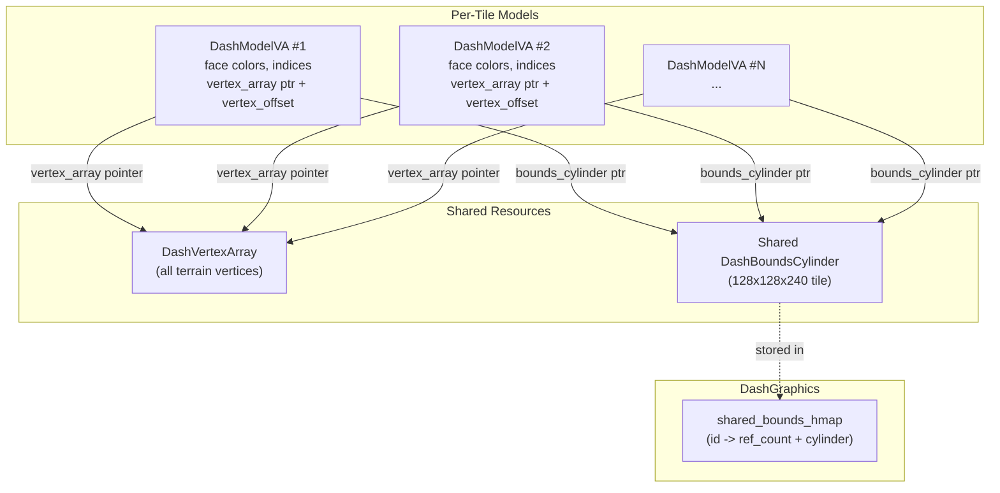

# Terrain VA Model Optimization

## Architecture Overview



## 1. Add `flags` field to `DashBoundsCylinder`

In [dash.h](src/graphics/dash.h), add a `uint32_t flags` field as the **first** field of `DashBoundsCylinder`:

```c
#define DASH_BOUNDS_FLAG_SHARED     0x80000000u
#define DASH_BOUNDS_ID_MASK         0x0FFFFFFFu

struct DashBoundsCylinder
{
    uint32_t flags;
    int ref_count;
    int center_to_top_edge;
    int center_to_bottom_edge;
    int min_y;
    int max_y;
    int radius;
    int min_z_depth_any_rotation;
};
```

- Bit 31: shared flag
- Bits 0-27: cylinder ID (28 bits, up to ~268M IDs)
- `ref_count`: only meaningful when shared; `dashmodel_free` decrements it without needing `DashGraphics*`
- Non-shared cylinders have `flags = 0` and `ref_count = 0` (existing behavior preserved since `memset` zeroes it)

`dash3d_calculate_bounds_cylinder` already zeroes the struct via `memset`, so `flags` and `ref_count` will be 0 (not shared) by default. No change needed there.

## 2. Shared Bounds Cylinder Registry in DashGraphics

### Hash map entry

In [dash.c](src/graphics/dash.c), add a new map entry struct and map field:

```c
struct DashSharedBoundsEntry
{
    uint32_t id;        // key
    int ref_count;
    struct DashBoundsCylinder cylinder;
};
```

Add `struct DashMap* shared_bounds_hmap;` to `struct DashGraphics`.

### Public API in [dash.h](src/graphics/dash.h)

```c
struct DashBoundsCylinder*
dash_shared_bounds_acquire(struct DashGraphics* dash, uint32_t id);

void
dash_shared_bounds_release(struct DashGraphics* dash, struct DashBoundsCylinder* bc);

struct DashBoundsCylinder*
dash_shared_bounds_alloc_empty(struct DashGraphics* dash, uint32_t id);
```

- `acquire`: lookup by ID, increment `cylinder.ref_count`, return pointer to the cylinder in the entry. Sets `DASH_BOUNDS_FLAG_SHARED | id` in the cylinder's flags.
- `release`: read ID from `bc->flags & DASH_BOUNDS_ID_MASK`, lookup in map, decrement `bc->ref_count`; if zero, remove from map.
- `alloc_empty`: insert a new entry with `ref_count=0` and zeroed cylinder, set `DASH_BOUNDS_FLAG_SHARED | id` on the cylinder's flags, return pointer to cylinder. Caller fills in the geometry fields.

Note: `dashmodel_free` also decrements `ref_count` directly on the cylinder (without the hashmap). The `release` function additionally handles removing dead entries from the map. In practice, for terrain, the shared bounds outlive all models and are cleaned up when `DashGraphics` is freed.

Initialize the map in `dash_new()`, free in `dash_free()`.

## 3. Add `DashVertexArray` struct

In [dash.h](src/graphics/dash.h):

```c
struct DashVertexArray
{
    int vertex_count;
    int vertex_capacity;
    vertexint_t* vertices_x;
    vertexint_t* vertices_y;
    vertexint_t* vertices_z;
};
```

Add alloc/free/append functions in [dash_model.c](src/graphics/dash_model.c):

```c
struct DashVertexArray* dashvertexarray_new(int capacity);
void dashvertexarray_free(struct DashVertexArray* va);
int dashvertexarray_append(struct DashVertexArray* va, int count,
    const vertexint_t* x, const vertexint_t* y, const vertexint_t* z);
```

`append` returns the starting vertex offset, writes `count` vertices at the end, increments `vertex_count`.

## 4. Add `DashModelVA` struct

In [dash_model_internal.h](src/graphics/dash_model_internal.h):

```c
#define DASHMODEL_FLAG_VA 0x20u

struct DashModelVA
{
    uint8_t flags;
    int face_count;
    int vertex_offset;                       // offset into vertex_array
    int vertex_count;                        // number of vertices this model uses
    struct DashVertexArray* vertex_array;     // NOT owned - shared vertex buffer
    hsl16_t* face_colors_a;
    hsl16_t* face_colors_b;
    hsl16_t* face_colors_c;
    faceint_t* face_indices_a;
    faceint_t* face_indices_b;
    faceint_t* face_indices_c;
    faceint_t* face_textures;
    struct DashBoundsCylinder* bounds_cylinder; // Shared, NOT owned
};
```

The `DashModelVA` holds a pointer to the shared `DashVertexArray` plus a `vertex_offset` into it, rather than owning or duplicating vertex pointers. This means the struct layout is **different** from `DashModelFast`, so we cannot reuse the fast-path casts in accessors.

Add helpers:

```c
static inline bool dashmodel__is_va(const void* m) {
    return (dashmodel__flags(m) & DASHMODEL_FLAG_VA) != 0;
}

static inline struct DashModelVA* dashmodel__as_va(void* m) {
    assert(dashmodel__is_va(m));
    return (struct DashModelVA*)m;
}

static inline const struct DashModelVA* dashmodel__as_va_const(const void* m) {
    assert(dashmodel__is_va(m));
    return (const struct DashModelVA*)m;
}
```

## 5. Update Free Logic

In `dashmodel_free` ([dash_model.c](src/graphics/dash_model.c)):

```c
void dashmodel_free(struct DashModel* model) {
    if (!model) return;
    uint8_t f = dashmodel__peek_flags(model);
    assert((f & DASHMODEL_FLAG_VALID) != 0);

    if ((f & DASHMODEL_FLAG_VA) != 0) {
        dashmodel__free_va_arrays((struct DashModelVA*)(void*)model);
        free(model);
        return;
    }
    // ... existing fast/full paths
}
```

The new `dashmodel__free_va_arrays`:

- Frees face_colors_a/b/c, face_indices_a/b/c, face_textures (owned arrays)
- Does **NOT** free `vertex_array` (borrowed, not owned)
- Checks `bounds_cylinder->flags & DASH_BOUNDS_FLAG_SHARED`: if shared, decrements `bounds_cylinder->ref_count`; does NOT free the cylinder (the shared bounds registry owns it). If not shared, `free(bounds_cylinder)` as normal.

Since `ref_count` lives directly on `DashBoundsCylinder`, `dashmodel_free` can decrement it without needing `DashGraphics*`. This is important because `dashmodel_free` is called from `scene2_element_release` which has no access to `DashGraphics*`.

Also update `dashmodel__free_fast_arrays` and `dashmodel__free_full_arrays` with the same shared-bounds check (for consistency -- any model type could theoretically hold a shared bounds cylinder):

```c
static void
dashmodel__bounds_cylinder_release(struct DashBoundsCylinder* bc) {
    if (!bc) return;
    if (bc->flags & DASH_BOUNDS_FLAG_SHARED) {
        bc->ref_count--;
        return;  // don't free -- registry owns it
    }
    free(bc);
}
```

Call `dashmodel__bounds_cylinder_release(m->bounds_cylinder)` in all three free-arrays functions instead of `free(m->bounds_cylinder)`.

## 6. Update Accessor Functions

Since `DashModelVA` has a different layout from `DashModelFast` (it holds a `DashVertexArray*` + `vertex_offset` instead of raw vertex pointers), the accessor functions in [dash_model.c](src/graphics/dash_model.c) need VA branches. The VA check is done **first** (before the fast check) since VA is a distinct model kind:

```c
vertexint_t* dashmodel_vertices_x(struct DashModel* m) {
    assert(m);
    if (dashmodel__is_va(m)) {
        struct DashModelVA* va = dashmodel__as_va(m);
        return va->vertex_array->vertices_x + va->vertex_offset;
    }
    if (dashmodel__is_fast(m))
        return dashmodel__as_fast(m)->vertices_x;
    return dashmodel__as_full(m)->vertices_x;
}
```

The same pattern applies to `vertices_y`, `vertices_z`, and their `_const` variants. Other accessors (`face_count`, `face_colors_a`, `face_indices_a`, `bounds_cylinder`, `face_textures`, etc.) read fields that exist at different offsets in `DashModelVA`, so they also need VA branches:

```c
int dashmodel_face_count(const struct DashModel* m) {
    assert(m);
    if (dashmodel__is_va(m))
        return dashmodel__as_va_const(m)->face_count;
    if (dashmodel__is_fast(m))
        return dashmodel__as_fast_const(m)->face_count;
    return dashmodel__as_full_const(m)->face_count;
}
```

Full-only accessors (`face_alphas`, `normals`, `face_priorities`, `original_vertices_*`, `bones`, etc.) return `NULL` for VA models, same as they do for fast models.

## 7. New Terrain Decoder Function

In [terrain_decode_tile.u.c](src/osrs/terrain_decode_tile.u.c), add `decode_tile_va`:

```c
static struct DashModel*
decode_tile_va(
    struct DashVertexArray* vertex_array,
    struct DashBoundsCylinder* shared_bounds,
    int shape, int rotation, int texture_id,
    int height_sw, int height_se, int height_ne, int height_nw,
    int light_sw, int light_se, int light_ne, int light_nw,
    int underlay_hsl16, int overlay_hsl16)
```

This function:

1. Computes vertex positions and colors the same as `decode_tile`
2. Appends vertices to `vertex_array` via `dashvertexarray_append`, getting back a `vertex_offset`
3. Stores the `vertex_array` pointer and `vertex_offset` on the `DashModelVA` (vertices are accessed via `vertex_array->vertices_x + vertex_offset` at read time through the accessor functions)
4. Allocates face arrays (colors, indices, textures) the same way as `decode_tile`
5. Uses the passed-in `shared_bounds` pointer instead of computing a new one
6. Returns the model as `(struct DashModel*)va_model`

## 8. Terrain Shared Bounds Cylinder

Define a static ID:

```c
#define DASH_SHARED_BOUNDS_TERRAIN_TILE_ID 1
```

Before decoding terrain, allocate and fill the shared bounds cylinder once:

```c
struct DashBoundsCylinder* bc =
    dash_shared_bounds_alloc_empty(dash, DASH_SHARED_BOUNDS_TERRAIN_TILE_ID);
// Pre-computed for 128x128 tile, y range [0, 240]:
// radius_sq = 128^2 + 128^2 = 32768, radius = 181
// center_to_bottom = sqrt(32768) + 1 = 182
// center_to_top = sqrt(32768 + 240*240) + 1 = sqrt(90368) + 1 = 301
bc->radius = 181;
bc->min_y = 0;
bc->max_y = 240;
bc->center_to_bottom_edge = 182;
bc->center_to_top_edge = 301;
bc->min_z_depth_any_rotation = 301;
```

Each `decode_tile_va` call receives the acquired shared bounds pointer.

## 9. Migrate `world_terrain.u.c`

### Add `DashGraphics*` and `DashVertexArray*` to World

In [world.h](src/osrs/world.h), add two new fields to `struct World`:

```c
struct DashGraphics* dash;                        // NOT owned, set at build time
struct DashVertexArray* terrain_vertex_array;      // Owned, created per terrain build
```

### Update `build_scene_terrain`

In [world_terrain.u.c](src/osrs/world_terrain.u.c), change `build_scene_terrain` to accept `struct DashGraphics* dash` as a parameter (or read from `world->dash`). At the top of the function:

1. Estimate max vertex count: `scene_size * scene_size * MAP_TERRAIN_LEVELS * 6` (max 6 vertices per tile shape)
2. Create `world->terrain_vertex_array = dashvertexarray_new(estimated_capacity)`
3. Allocate the shared bounds cylinder once via `dash_shared_bounds_alloc_empty(dash, DASH_SHARED_BOUNDS_TERRAIN_TILE_ID)` and fill in the pre-computed 128x128x240 values

In the inner loop, replace:

```c
model = decode_tile(shape, rotation, texture_id, ...);
```

with:

```c
model = decode_tile_va(
    world->terrain_vertex_array,
    shared_bounds,
    shape, rotation, texture_id,
    height_sw, height_se, height_ne, height_nw,
    light_sw, light_se, light_ne, light_nw,
    underlay_hsl, overlay_hsl);
```

The rest of the loop (setting position, minimap colors) stays the same since `model` is still a `struct DashModel*`.

### Cleanup on rebuild

In `world_buildcachedat_rebuild_centerzone` ([world.c](src/osrs/world.c)), after cleaning up all tile entities (which frees all VA models, decrementing shared bounds ref_counts), free the old vertex array:

```c
if (world->terrain_vertex_array) {
    dashvertexarray_free(world->terrain_vertex_array);
    world->terrain_vertex_array = NULL;
}
```

Pass `DashGraphics*` to `build_scene_terrain`. The caller of `world_buildcachedat_rebuild_centerzone` in `gameproto_exec.c` would need to set `world->dash` before calling, or we add a `DashGraphics*` parameter to the rebuild function.

### Threading `DashGraphics*`

The simplest approach: store `world->dash = game->sys_dash` when the World is associated with a game context (before `world_buildcachedat_rebuild_centerzone` is called). This avoids changing the rebuild function's public signature.

In [gameproto_exec.c](src/osrs/gameproto_exec.c), before the rebuild call:

```c
world->dash = game->sys_dash;
world_buildcachedat_rebuild_centerzone(world, ...);
```

## Files Changed

- [dash.h](src/graphics/dash.h) -- Add `flags`/`ref_count` to `DashBoundsCylinder`, add `DashVertexArray` struct, add shared bounds API, add `dashvertexarray_*` API, add `dashmodel_va_new`
- [dash_model_internal.h](src/graphics/dash_model_internal.h) -- Add `DASHMODEL_FLAG_VA`, add `DashModelVA` struct, add `dashmodel__is_va`/`as_va` helpers
- [dash_model.c](src/graphics/dash_model.c) -- Add `dashmodel_va_new`, `dashmodel__free_va_arrays`, `dashmodel__bounds_cylinder_release`, update `dashmodel_free` and all three free-arrays functions, add VA branches to accessors, add `dashvertexarray_new/free/append`
- [dash.c](src/graphics/dash.c) -- Add `shared_bounds_hmap` to `DashGraphics`, init/free in `dash_new`/`dash_free`, implement `dash_shared_bounds_acquire/release/alloc_empty`
- [terrain_decode_tile.u.c](src/osrs/terrain_decode_tile.u.c) -- Add `decode_tile_va` function
- [world.h](src/osrs/world.h) -- Add `struct DashGraphics* dash` and `struct DashVertexArray* terrain_vertex_array` fields to `World`
- [world_terrain.u.c](src/osrs/world_terrain.u.c) -- Migrate `build_scene_terrain` to use `decode_tile_va`, create `DashVertexArray`, acquire shared bounds
- [world.c](src/osrs/world.c) -- Free `terrain_vertex_array` on rebuild/cleanup
- [gameproto_exec.c](src/osrs/gameproto_exec.c) -- Set `world->dash = game->sys_dash` before rebuild call
