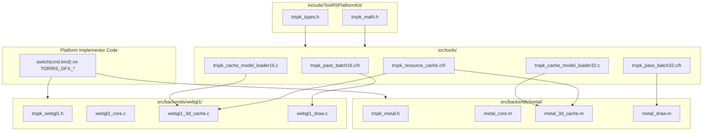

# ToriRSPlatformKit (TRSPK) Implementation Plan

This plan creates a new standalone graphics toolkit at `platforms/ToriRSPlatformKit/` that takes inspiration from the existing Metal, OpenGL3, and WebGL1 implementations while adhering to the compile-time modular philosophy (no central dispatcher, no tagged unions, no virtual functions).

**Important:** TRSPK does NOT define its own command types or event handlers. The implementor is responsible for writing their own `switch` statement over existing `TORIRS_GFX_*` events and calling TRSPK tools from within those handlers.

---

## Architecture Overview



---

## 1. Public Types (`include/ToriRSPlatformKit/trspk_types.h`)

Defines shared data structures used by all tools and backends. Does **NOT** define any command enum—implementors use existing `TORIRS_GFX_*` events directly.

**Key Types:**

```c
// Opaque handle for GPU resources (VBO, EBO, texture)
typedef uintptr_t TRSPK_GPUHandle;

// IDs matching existing ToriRS types
typedef uint16_t TRSPK_ModelId;
typedef uint16_t TRSPK_TextureId;
typedef uint8_t  TRSPK_BatchId;

// 48-byte interleaved vertex (matches GPU3DMeshVertexWebGL1/Metal)
typedef struct TRSPK_Vertex {
    float pos[3];
    float normal[3];
    float uv[2];
    uint8_t color[4];
    uint16_t tex_id;
    uint16_t _pad;
} TRSPK_Vertex;

// Pose data stored in resource cache
typedef struct TRSPK_ModelPose {
    TRSPK_GPUHandle vbo;
    TRSPK_GPUHandle ebo;
    uint32_t vbo_offset;      // Vertex offset within merged VBO (for index biasing)
    uint32_t ebo_offset;      // Index offset within merged EBO
    uint32_t element_count;   // Number of indices for this pose
    TRSPK_BatchId batch_id;   // Which scene batch this belongs to
    uint8_t chunk_index;      // Which 65k chunk (WebGL1 only, 0 for 32-bit backends)
    bool valid;
} TRSPK_ModelPose;

// Atlas UV rect for texture lookups
typedef struct TRSPK_AtlasUVRect {
    float u0, v0, u1, v1;
} TRSPK_AtlasUVRect;

// Viewport/scissor rectangle
typedef struct TRSPK_Rect {
    int32_t x, y, width, height;
} TRSPK_Rect;

// Basic math types
typedef struct TRSPK_Vec3 { float x, y, z; } TRSPK_Vec3;
typedef struct TRSPK_Mat4 { float m[16]; } TRSPK_Mat4;

// Bake transform for pre-transforming positions on model load
// Applies: local -> yaw rotate in XZ -> translate
typedef struct TRSPK_BakeTransform {
    float cos_yaw;   // Cosine of yaw angle (1.0 = no rotation)
    float sin_yaw;   // Sine of yaw angle (0.0 = no rotation)
    float tx, ty, tz; // World translation
    bool identity;   // True if no transform needed (skip math)
} TRSPK_BakeTransform;

// UV calculation modes (matching GPU3DCache2UVCalculationMode)
typedef enum TRSPK_UVMode {
    TRSPK_UV_MODE_TEXTURED_FACE_ARRAY,  // Use textured_faces array
    TRSPK_UV_MODE_FIRST_FACE            // Use first face for all UVs
} TRSPK_UVMode;
```

---

## 2. Math Utilities (`include/ToriRSPlatformKit/trspk_math.h`)

Stateless inline free-functions for matrix/vertex math, inspired by existing helpers in `metal_helpers.mm`, `opengl3_helpers.cpp`, `gpu_3d.h`, and `uv_pnm.h`.

All are `static inline` in the header for zero-cost inclusion.

### Matrix/Vector Math

- `trspk_mat4_identity`, `trspk_mat4_multiply`
- `trspk_mat4_ortho`, `trspk_mat4_perspective`
- `trspk_mat4_look_at`, `trspk_mat4_translate`, `trspk_mat4_rotate`, `trspk_mat4_scale`
- `trspk_vec3_transform`, `trspk_vec3_normalize`, `trspk_vec3_dot`, `trspk_vec3_cross`
- `trspk_viewport_ndc_to_screen`, `trspk_compute_scissor_rect`

### Camera/View Math (from existing helpers)

```c
// Convert dash yaw (2048 units = 2π) to radians
static inline float trspk_dash_yaw_to_radians(int32_t yaw_2048);

// Compute view matrix from camera position and angles
static inline void trspk_compute_view_matrix(float out[16],
    float cam_x, float cam_y, float cam_z, float pitch_rad, float yaw_rad);

// Compute perspective projection matrix
static inline void trspk_compute_projection_matrix(float out[16],
    float fov_rad, float width, float height);
```

### Color Conversion (from `gpu_3d_cache2.h`)

```c
// HSL16 format to float RGBA (requires dash_hsl16_to_rgb or equivalent)
static inline void trspk_hsl16_to_rgba(uint16_t hsl16, float rgba_out[4], float alpha);
```

**Inspired by:** `gpu3d_hsl16_to_float_rgba` which extracts RGB from packed HSL16 format.

### Bake Transform (from `gpu_3d.h`)

Yaw rotation in XZ plane + world translation, applied during model load.

```c
// Create bake transform from world position and yaw (yaw in 2048 units = 2π)
static inline TRSPK_BakeTransform trspk_bake_transform_from_yaw_translate(
    int32_t world_x, int32_t world_y, int32_t world_z, int32_t yaw_r2pi2048);

// Apply bake transform to vertex position: local -> yaw rotate in XZ -> translate
static inline void trspk_bake_transform_apply(
    const TRSPK_BakeTransform* bake, float* vx, float* vy, float* vz);
```

**Inspired by:** `GPU3DBakeTransform::FromYawTranslate` and `GPU3DBakeTransformApplyToPosition`.

### UV PNM Computation (from `uv_pnm.h`)

Computes texture UV coordinates for a face using PNM (P, M, N) texture-space vertices.

```c
typedef struct TRSPK_UVFaceCoords {
    float u1, v1;  // Vertex A UVs
    float u2, v2;  // Vertex B UVs
    float u3, v3;  // Vertex C UVs
} TRSPK_UVFaceCoords;

// Compute UVs for face ABC using texture-space triangle PMN
// P = texture origin, M = U direction, N = V direction
static inline void trspk_uv_pnm_compute(
    TRSPK_UVFaceCoords* out,
    // Texture-space triangle (P, M, N)
    float p_x, float p_y, float p_z,
    float m_x, float m_y, float m_z,
    float n_x, float n_y, float n_z,
    // Face triangle (A, B, C)
    float a_x, float a_y, float a_z,
    float b_x, float b_y, float b_z,
    float c_x, float c_y, float c_z);
```

**Inspired by:** `uv_pnm_compute` which uses Cramer's rule to project face vertices onto texture plane defined by PMN.

---

## 3. Tools

### 3.1 Resource Cache (`src/tools/trspk_resource_cache.c/.h`)

A pure CPU ID-to-GPUData lookup using **fixed-size arrays indexed by ID**. Does **not** manage GPU resources—only tracks metadata. No hash tables.

**Inspired by:** `GPU3DCache2` which uses `std::array<GPUModelData, MAX_3D_ASSETS>` indexed directly by `model_id`.

```c
// Fixed capacity constants (matching GPU3DCache2)
#define TRSPK_MAX_MODELS      32768   // MAX_3D_ASSETS
#define TRSPK_MAX_TEXTURES    256
#define TRSPK_MAX_BATCHES     10      // kGPU3DCache2MaxSceneBatches
#define TRSPK_MAX_POSES_PER_MODEL 8   // bind + primary + secondary animation slots

typedef struct TRSPK_ResourceCache TRSPK_ResourceCache;

TRSPK_ResourceCache* trspk_resource_cache_create(void);  // No capacity param - uses fixed arrays
void trspk_resource_cache_destroy(TRSPK_ResourceCache* cache);

// Model pose storage - O(1) array lookup by model_id
bool trspk_resource_cache_set_model_pose(TRSPK_ResourceCache* cache,
    TRSPK_ModelId model_id, uint32_t pose_index, const TRSPK_ModelPose* pose);
const TRSPK_ModelPose* trspk_resource_cache_get_model_pose(
    const TRSPK_ResourceCache* cache, TRSPK_ModelId model_id, uint32_t pose_index);

// Animation offset management (matches GPU3DCache2 pattern)
// animation_offsets[0] = 0 (bind pose), [1] = primary anim base, [2] = secondary anim base
uint32_t trspk_resource_cache_allocate_pose_slot(TRSPK_ResourceCache* cache,
    TRSPK_ModelId model_id, int gpu_segment_slot, int frame_index);
void trspk_resource_cache_clear_model(TRSPK_ResourceCache* cache, TRSPK_ModelId model_id);

// Draw lookup: (model_id, use_animation, anim_index, frame_index) -> pose
// This is what TORIRS_GFX_DRAW_MODEL handlers call
// - If !use_animation: returns bind pose (poses[0])
// - Else: returns poses[animation_offsets[anim_index + 1] + frame_index]
const TRSPK_ModelPose* trspk_resource_cache_get_pose_for_draw(
    const TRSPK_ResourceCache* cache,
    TRSPK_ModelId model_id,
    bool use_animation,
    int scene_animation_index,  // 0 = primary, 1 = secondary
    int frame_index);

// Batch tracking - O(1) array lookup by batch_id (max 10 batches)
void trspk_resource_cache_batch_begin(TRSPK_ResourceCache* cache, TRSPK_BatchId batch_id);
void trspk_resource_cache_batch_set_resource(TRSPK_ResourceCache* cache,
    TRSPK_BatchId batch_id, TRSPK_GPUHandle vbo, TRSPK_GPUHandle ebo);
const TRSPK_BatchResource* trspk_resource_cache_batch_get(
    const TRSPK_ResourceCache* cache, TRSPK_BatchId batch_id);
void trspk_resource_cache_batch_clear(TRSPK_ResourceCache* cache, TRSPK_BatchId batch_id);

// Atlas UV tracking - O(1) array lookup by tex_id (max 256 textures)
void trspk_resource_cache_set_atlas_uv(TRSPK_ResourceCache* cache,
    TRSPK_TextureId tex_id, const TRSPK_AtlasUVRect* uv);
const TRSPK_AtlasUVRect* trspk_resource_cache_get_atlas_uv(
    const TRSPK_ResourceCache* cache, TRSPK_TextureId tex_id);
```

**Internal structure** (array-based, no hashing):

```c
#define TRSPK_GPU_ANIM_NONE_IDX      0  // Bind pose
#define TRSPK_GPU_ANIM_PRIMARY_IDX   1  // Primary animation
#define TRSPK_GPU_ANIM_SECONDARY_IDX 2  // Secondary animation

struct TRSPK_ResourceCache {
    // models[model_id] - direct array indexing
    struct {
        TRSPK_ModelPose poses[TRSPK_MAX_POSES_PER_MODEL];
        uint32_t pose_count;
        // [0] = 0 (bind), [1] = primary anim base, [2] = secondary anim base
        uint32_t animation_offsets[3];
        TRSPK_BakeTransform model_bake;
        bool has_model_bake;
    } models[TRSPK_MAX_MODELS];

    // batches[batch_id] - direct array indexing
    TRSPK_BatchResource batches[TRSPK_MAX_BATCHES];

    // atlas_uvs[tex_id] - direct array indexing
    TRSPK_AtlasUVRect atlas_uvs[TRSPK_MAX_TEXTURES];
    bool atlas_uv_valid[TRSPK_MAX_TEXTURES];
};
```

### 3.2 Pass Batch16 (`src/tools/trspk_pass_batch16.c/.h`)

16-bit auto-chunking batcher for WebGL1. Manages a single contiguous array with chunk metadata. When accumulated vertices would exceed 65535, automatically starts a new chunk.

**Key insight from existing code:** WebGL1's `Pass3DBuilder2WebGL1` skips draws that overflow. TRSPK_Batch16 will instead **auto-chunk** to avoid data loss.

```c
typedef struct TRSPK_Batch16 TRSPK_Batch16;

TRSPK_Batch16* trspk_batch16_create(uint32_t max_vertices, uint32_t max_indices);
void trspk_batch16_destroy(TRSPK_Batch16* batch);

void trspk_batch16_begin(TRSPK_Batch16* batch);
// Returns chunk_index; -1 if failed
int32_t trspk_batch16_add_mesh(TRSPK_Batch16* batch,
    const TRSPK_Vertex* vertices, uint32_t vertex_count,
    const uint16_t* indices, uint32_t index_count,
    TRSPK_ModelId model_id, uint32_t pose_index);
void trspk_batch16_end(TRSPK_Batch16* batch);

// Iteration for upload
uint32_t trspk_batch16_chunk_count(const TRSPK_Batch16* batch);
void trspk_batch16_get_chunk(const TRSPK_Batch16* batch, uint32_t chunk_index,
    const void** out_vertices, uint32_t* out_vertex_bytes,
    const void** out_indices, uint32_t* out_index_bytes);

// Per-model tracking within chunks (used to populate TRSPK_ModelPose in cache)
typedef struct TRSPK_Batch16Entry {
    TRSPK_ModelId model_id;
    uint8_t gpu_segment_slot;  // TRSPK_GPU_ANIM_*_IDX
    uint16_t frame_index;      // Frame within animation segment
    uint8_t chunk_index;       // Which 65k chunk this model ended up in
    uint32_t vbo_offset;       // Vertex offset within chunk's VBO
    uint32_t ebo_offset;       // Index offset within chunk's EBO
    uint32_t element_count;    // face_count * 3
} TRSPK_Batch16Entry;

uint32_t trspk_batch16_entry_count(const TRSPK_Batch16* batch);
const TRSPK_Batch16Entry* trspk_batch16_get_entry(const TRSPK_Batch16* batch, uint32_t i);
```

### 3.3 Pass Batch32 (`src/tools/trspk_pass_batch32.c/.h`)

32-bit continuous batcher for Metal. Simply appends memory with no chunking required.

```c
typedef struct TRSPK_Batch32 TRSPK_Batch32;

TRSPK_Batch32* trspk_batch32_create(uint32_t initial_vertex_capacity, uint32_t initial_index_capacity);
void trspk_batch32_destroy(TRSPK_Batch32* batch);

void trspk_batch32_begin(TRSPK_Batch32* batch);
void trspk_batch32_add_mesh(TRSPK_Batch32* batch,
    const TRSPK_Vertex* vertices, uint32_t vertex_count,
    const uint32_t* indices, uint32_t index_count,
    TRSPK_ModelId model_id, uint32_t pose_index);
void trspk_batch32_end(TRSPK_Batch32* batch);

// Single merged buffer access
void trspk_batch32_get_data(const TRSPK_Batch32* batch,
    const void** out_vertices, uint32_t* out_vertex_bytes,
    const void** out_indices, uint32_t* out_index_bytes);

// Per-model tracking (used to populate TRSPK_ModelPose in cache)
typedef struct TRSPK_Batch32Entry {
    TRSPK_ModelId model_id;
    uint8_t gpu_segment_slot;  // TRSPK_GPU_ANIM_*_IDX
    uint16_t frame_index;      // Frame within animation segment
    uint32_t vbo_offset;       // Vertex offset within merged VBO
    uint32_t ebo_offset;       // Index offset within merged EBO
    uint32_t element_count;    // face_count * 3
} TRSPK_Batch32Entry;

uint32_t trspk_batch32_entry_count(const TRSPK_Batch32* batch);
const TRSPK_Batch32Entry* trspk_batch32_get_entry(const TRSPK_Batch32* batch, uint32_t i);
```

### 3.4 Model Loader16 (`src/tools/trspk_cache_model_loader16.c/.h`)

Loads models for 16-bit backends. Follows the API pattern of `BatchAddModeli16` / `BatchAddModelTexturedi16` but rewritten as pure C with auto-chunking when expanded vertex count would exceed 65535.

**Inspired by:** `BatchAddModeli16`, `BatchAddModelTexturedi16` in `batch_add_model.h`

```c
// Optional bake transform (pre-transform positions on load)
typedef struct TRSPK_BakeTransform {
    float translate[3];
    float scale;
    bool enabled;
} TRSPK_BakeTransform;

// UV calculation modes (matching GPU3DCache2UVCalculationMode)
typedef enum TRSPK_UVMode {
    TRSPK_UV_MODE_TEXTURED_FACE_ARRAY,  // Use textured_faces array
    TRSPK_UV_MODE_FIRST_FACE            // Use first face for all UVs
} TRSPK_UVMode;

// Add non-textured model to batch (expands faces into vertices)
// Returns number of poses created (may be >1 if auto-chunked)
// gpu_segment_slot: TRSPK_GPU_ANIM_NONE_IDX (bind), PRIMARY_IDX, or SECONDARY_IDX
int trspk_batch16_add_model(
    TRSPK_Batch16* batch,
    uint16_t model_id,
    uint8_t gpu_segment_slot,        // Animation segment (bind/primary/secondary)
    uint16_t frame_index,            // Frame within animation segment
    // Vertex data (indexed by face corners)
    uint32_t vertex_count,
    const int16_t* vertices_x,
    const int16_t* vertices_y,
    const int16_t* vertices_z,
    // Face data
    uint32_t face_count,
    const uint16_t* faces_a,
    const uint16_t* faces_b,
    const uint16_t* faces_c,
    // Per-face colors (HSL16 format)
    const uint16_t* faces_a_color_hsl16,
    const uint16_t* faces_b_color_hsl16,
    const uint16_t* faces_c_color_hsl16,
    // Optional
    const uint8_t* face_alphas,           // NULL = fully opaque
    const int32_t* face_infos,            // NULL = no face info filtering
    const TRSPK_BakeTransform* bake);     // NULL = no transform

// Add textured model to batch (includes UV calculation)
int trspk_batch16_add_model_textured(
    TRSPK_Batch16* batch,
    uint16_t model_id,
    uint8_t gpu_segment_slot,
    uint16_t frame_index,
    // Vertex data
    uint32_t vertex_count,
    const int16_t* vertices_x,
    const int16_t* vertices_y,
    const int16_t* vertices_z,
    // Face data
    uint32_t face_count,
    const uint16_t* faces_a,
    const uint16_t* faces_b,
    const uint16_t* faces_c,
    // Per-face colors
    const uint16_t* faces_a_color_hsl16,
    const uint16_t* faces_b_color_hsl16,
    const uint16_t* faces_c_color_hsl16,
    // Texture data
    const int16_t* faces_textures,        // Texture ID per face (-1 = none)
    const uint16_t* textured_faces,       // Index into textured_faces_* arrays (0xFFFF = use face verts)
    const uint16_t* textured_faces_a,
    const uint16_t* textured_faces_b,
    const uint16_t* textured_faces_c,
    // Optional
    const uint8_t* face_alphas,
    const int32_t* face_infos,
    TRSPK_UVMode uv_mode,
    const TRSPK_BakeTransform* bake);
```

**Auto-chunking behavior:** When adding a model would cause the current chunk's vertex count to exceed 65535, the batch automatically:

1. Finalizes the current chunk
2. Starts a new chunk
3. Continues adding the model to the new chunk
4. Records multiple `TRSPK_Batch16Entry` entries with different `chunk_index` values

### 3.5 Model Loader32 (`src/tools/trspk_cache_model_loader32.c/.h`)

Loads models for 32-bit backends. Same API as Loader16 but no chunking needed.

```c
// Add non-textured model to batch
void trspk_batch32_add_model(
    TRSPK_Batch32* batch,
    uint16_t model_id,
    uint8_t gpu_segment_slot,        // Animation segment
    uint16_t frame_index,
    uint32_t vertex_count,
    const int16_t* vertices_x,
    const int16_t* vertices_y,
    const int16_t* vertices_z,
    uint32_t face_count,
    const uint16_t* faces_a,
    const uint16_t* faces_b,
    const uint16_t* faces_c,
    const uint16_t* faces_a_color_hsl16,
    const uint16_t* faces_b_color_hsl16,
    const uint16_t* faces_c_color_hsl16,
    const uint8_t* face_alphas,
    const int32_t* face_infos,
    const TRSPK_BakeTransform* bake);

// Add textured model to batch
void trspk_batch32_add_model_textured(
    TRSPK_Batch32* batch,
    uint16_t model_id,
    uint8_t gpu_segment_slot,
    uint16_t frame_index,
    uint32_t vertex_count,
    const int16_t* vertices_x,
    const int16_t* vertices_y,
    const int16_t* vertices_z,
    uint32_t face_count,
    const uint16_t* faces_a,
    const uint16_t* faces_b,
    const uint16_t* faces_c,
    const uint16_t* faces_a_color_hsl16,
    const uint16_t* faces_b_color_hsl16,
    const uint16_t* faces_c_color_hsl16,
    const int16_t* faces_textures,
    const uint16_t* textured_faces,
    const uint16_t* textured_faces_a,
    const uint16_t* textured_faces_b,
    const uint16_t* textured_faces_c,
    const uint8_t* face_alphas,
    const int32_t* face_infos,
    TRSPK_UVMode uv_mode,
    const TRSPK_BakeTransform* bake);
```

---

## 4. Metal Backend (`src/backends/metal/`)

The Metal backend provides utilities that implementors call from their `TORIRS_GFX_*` event handlers. It does **not** process commands itself.

### 4.1 Public API (`trspk_metal.h`)

```c
typedef struct TRSPK_MetalRenderer TRSPK_MetalRenderer;

// Lifecycle (called once by implementor)
TRSPK_MetalRenderer* TRSPK_Metal_Init(void* ca_metal_layer, uint32_t width, uint32_t height);
void TRSPK_Metal_Shutdown(TRSPK_MetalRenderer* renderer);
void TRSPK_Metal_Resize(TRSPK_MetalRenderer* renderer, uint32_t width, uint32_t height);

// Frame boundaries (called by implementor's frame loop)
void TRSPK_Metal_FrameBegin(TRSPK_MetalRenderer* r);  // Acquires drawable, waits on semaphore
void TRSPK_Metal_FrameEnd(TRSPK_MetalRenderer* r);    // Presents, signals semaphore

// Access to internal state for event handlers
TRSPK_ResourceCache* TRSPK_Metal_GetCache(TRSPK_MetalRenderer* r);
TRSPK_Batch32* TRSPK_Metal_GetBatchStaging(TRSPK_MetalRenderer* r);
```

### 4.2 Core (`metal_core.m`)

**Inspired by:** `metal_init.mm`, `metal_render.mm`

- Device, command queue, layer setup
- Pipeline creation (3D world shader, clear-rect depth shader)
- Uniform buffer ring (kMetalInflightFrames = 3)
- Frame semaphore for in-flight limiting
- Swapchain/drawable management
- Exposes encoder for implementor's draw calls

### 4.3 3D Cache (`metal_3d_cache.m`)

**Inspired by:** `gpu_3d_cache2_metal.mm` but using TRSPK tools

Utility functions implementors call from their event handlers:

```c
// Atlas management (called during init and TORIRS_GFX_RES_TEX_LOAD)
void trspk_metal_cache_init_atlas(TRSPK_MetalRenderer* r, uint32_t width, uint32_t height);
void trspk_metal_cache_load_texture_128(TRSPK_MetalRenderer* r, TRSPK_TextureId id,
    const uint8_t* rgba_128x128, float anim_u, float anim_v, bool opaque);
void trspk_metal_cache_refresh_atlas(TRSPK_MetalRenderer* r);  // Upload CPU atlas to GPU

// Called from TORIRS_GFX_RES_MODEL_LOAD handler (standalone model, not in batch)
void trspk_metal_cache_load_standalone_model(TRSPK_MetalRenderer* r, TRSPK_ModelId id,
    const void* model_data, int usage_hint);

// Called from TORIRS_GFX_RES_MODEL_UNLOAD handler
void trspk_metal_cache_unload_model(TRSPK_MetalRenderer* r, TRSPK_ModelId id);

// Called from TORIRS_GFX_BATCH3D_END handler
void trspk_metal_cache_batch_submit(TRSPK_MetalRenderer* r, TRSPK_BatchId batch_id, int usage_hint);

// Called from TORIRS_GFX_BATCH3D_CLEAR handler
void trspk_metal_cache_batch_clear(TRSPK_MetalRenderer* r, TRSPK_BatchId batch_id);
```

### 4.4 Draw Utilities (`metal_draw.m`)

**Inspired by:** `pass_3d_builder2_metal.mm`

**Batching strategy:** Metal accumulates all scenery draw indices into a single dynamic index buffer. On `submit_3d`, issues **one `drawIndexedPrimitives`** call for all scenery. All draws must share the same merged VBO (from the scene batch).

Utility functions implementors call from their `TORIRS_GFX_*` handlers:

```c
// Called from TORIRS_GFX_STATE_BEGIN_3D handler
void trspk_metal_draw_begin_3d(TRSPK_MetalRenderer* r, const TRSPK_Rect* viewport);

// Called from TORIRS_GFX_DRAW_MODEL handler
// Implementor looks up pose via trspk_resource_cache_get_pose_for_draw(model_id, use_anim, anim_idx, frame_idx)
// Then computes sorted face order and calls this with the biased indices
void trspk_metal_draw_add_model(TRSPK_MetalRenderer* r,
    const TRSPK_ModelPose* pose,           // From cache lookup
    const uint32_t* sorted_indices,        // Face indices (biased by pose->vbo_offset internally)
    uint32_t index_count);

// Called from TORIRS_GFX_STATE_END_3D handler
// Uploads all accumulated indices and issues SINGLE drawIndexedPrimitives
void trspk_metal_draw_submit_3d(TRSPK_MetalRenderer* r, const TRSPK_Mat4* view, const TRSPK_Mat4* proj);

// Called from TORIRS_GFX_STATE_CLEAR_RECT handler
void trspk_metal_draw_clear_rect(TRSPK_MetalRenderer* r, const TRSPK_Rect* rect);
```

#### Example Implementation: `trspk_metal_draw_submit_3d`

```objc
void trspk_metal_draw_submit_3d(TRSPK_MetalRenderer* r, const TRSPK_Mat4* view, const TRSPK_Mat4* proj) {
    // Get internal state
    TRSPK_MetalPassState* pass = &r->pass_state;
    id<MTLRenderCommandEncoder> encoder = (__bridge id<MTLRenderCommandEncoder>)pass->encoder;

    // Early out if no draws accumulated
    if (pass->index_count == 0) return;

    // Get the scene batch VBO (all draws must share this)
    id<MTLBuffer> mesh_vbo = (__bridge id<MTLBuffer>)(void*)pass->scene_vbo;
    if (!mesh_vbo) return;

    // --- Step 1: Write uniforms to ring buffer ---
    TRSPK_MetalUniforms uniforms;
    memcpy(uniforms.modelViewMatrix, view->m, sizeof(float) * 16);
    memcpy(uniforms.projectionMatrix, proj->m, sizeof(float) * 16);
    uniforms.uClock = (float)(r->frame_clock);

    id<MTLBuffer> uniform_buf = (__bridge id<MTLBuffer>)r->uniform_buffer;
    size_t uniform_offset = r->uniform_frame_slot * TRSPK_METAL_UNIFORM_STRIDE
                          + pass->uniform_pass_subslot * TRSPK_METAL_UNIFORM_PADDED_SIZE;

    memcpy((uint8_t*)[uniform_buf contents] + uniform_offset, &uniforms, sizeof(uniforms));

    // --- Step 2: Upload accumulated indices to dynamic index buffer ---
    id<MTLBuffer> index_buf = (__bridge id<MTLBuffer>)r->dynamic_index_buffer;
    size_t index_offset = pass->index_upload_offset;
    size_t index_bytes = pass->index_count * sizeof(uint32_t);

    memcpy((uint8_t*)[index_buf contents] + index_offset, pass->index_pool, index_bytes);

    // --- Step 3: Set render state ---
    [encoder setDepthStencilState:(__bridge id<MTLDepthStencilState>)r->depth_stencil_state];

    // Bind uniforms (vertex + fragment)
    [encoder setVertexBuffer:uniform_buf offset:uniform_offset atIndex:1];
    [encoder setFragmentBuffer:uniform_buf offset:uniform_offset atIndex:1];

    // Bind atlas texture and tile metadata buffer
    [encoder setFragmentTexture:(__bridge id<MTLTexture>)r->atlas_texture atIndex:0];
    [encoder setFragmentBuffer:(__bridge id<MTLBuffer>)r->atlas_tiles_buffer offset:0 atIndex:4];
    [encoder setFragmentSamplerState:(__bridge id<MTLSamplerState>)r->sampler_state atIndex:0];

    // Bind mesh VBO (shared by all scenery in this batch)
    [encoder setVertexBuffer:mesh_vbo offset:0 atIndex:0];

    // --- Step 4: Issue SINGLE draw call for all accumulated indices ---
    [encoder drawIndexedPrimitives:MTLPrimitiveTypeTriangle
                        indexCount:(NSUInteger)pass->index_count
                         indexType:MTLIndexTypeUInt32
                       indexBuffer:index_buf
                 indexBufferOffset:index_offset
                     instanceCount:1
                        baseVertex:0
                      baseInstance:0];

    // --- Step 5: Advance ring buffer offsets for next pass ---
    pass->uniform_pass_subslot++;
    pass->index_upload_offset += index_bytes;

    // Clear for next BEGIN_3D/END_3D pair
    pass->index_count = 0;
    pass->scene_vbo = 0;
}
```

---

## 5. WebGL1 Backend (`src/backends/webgl1/`)

The WebGL1 backend provides utilities that implementors call from their `TORIRS_GFX_*` event handlers. It does **not** process commands itself.

### 5.1 Public API (`trspk_webgl1.h`)

```c
typedef struct TRSPK_WebGL1Renderer TRSPK_WebGL1Renderer;

// Lifecycle
TRSPK_WebGL1Renderer* TRSPK_WebGL1_Init(const char* canvas_id, uint32_t width, uint32_t height);
void TRSPK_WebGL1_Shutdown(TRSPK_WebGL1Renderer* renderer);
void TRSPK_WebGL1_Resize(TRSPK_WebGL1Renderer* renderer, uint32_t width, uint32_t height);

// Frame boundaries
void TRSPK_WebGL1_FrameBegin(TRSPK_WebGL1Renderer* r);  // Clears, sets viewport
void TRSPK_WebGL1_FrameEnd(TRSPK_WebGL1Renderer* r);    // Swaps buffers

// Access to internal state
TRSPK_ResourceCache* TRSPK_WebGL1_GetCache(TRSPK_WebGL1Renderer* r);
TRSPK_Batch16* TRSPK_WebGL1_GetBatchStaging(TRSPK_WebGL1Renderer* r);
```

### 5.2 Core (`webgl1_core.c`)

**Inspired by:** `webgl1_render_loop.cpp`, SDL/Emscripten GL setup

- Emscripten GL context creation
- GLSL ES 1.0 shader compilation (world 3D shader with uniform-based atlas)
- Dynamic IBO for pass draws
- Canvas resize handling

### 5.3 3D Cache (`webgl1_3d_cache.c`)

**Inspired by:** `gpu_3d_cache2_webgl1.cpp` but using TRSPK tools

Utility functions implementors call from their event handlers:

```c
// Atlas management (called during init and TORIRS_GFX_RES_TEX_LOAD)
void trspk_webgl1_cache_init_atlas(TRSPK_WebGL1Renderer* r, uint32_t width, uint32_t height);
void trspk_webgl1_cache_load_texture_128(TRSPK_WebGL1Renderer* r, TRSPK_TextureId id,
    const uint8_t* rgba_128x128, float anim_u, float anim_v, bool opaque);
void trspk_webgl1_cache_refresh_atlas(TRSPK_WebGL1Renderer* r);  // Upload CPU atlas to GPU texture
bool trspk_webgl1_cache_tiles_dirty(TRSPK_WebGL1Renderer* r);    // Check if tile uniforms need upload
void trspk_webgl1_cache_clear_tiles_dirty(TRSPK_WebGL1Renderer* r);

// Called from TORIRS_GFX_RES_MODEL_LOAD handler (standalone model)
void trspk_webgl1_cache_load_standalone_model(TRSPK_WebGL1Renderer* r, TRSPK_ModelId id,
    const void* model_data, int usage_hint);

// Called from TORIRS_GFX_RES_MODEL_UNLOAD handler
void trspk_webgl1_cache_unload_model(TRSPK_WebGL1Renderer* r, TRSPK_ModelId id);

// Called from TORIRS_GFX_BATCH3D_END handler (handles auto-chunking for 65k limits)
void trspk_webgl1_cache_batch_submit(TRSPK_WebGL1Renderer* r, TRSPK_BatchId batch_id, int usage_hint);

// Called from TORIRS_GFX_BATCH3D_CLEAR handler
void trspk_webgl1_cache_batch_clear(TRSPK_WebGL1Renderer* r, TRSPK_BatchId batch_id);
```

### 5.4 Draw Utilities (`webgl1_draw.c`)

**Inspired by:** `pass_3d_builder2_webgl1.cpp`

**Batching strategy:** WebGL1 tracks which chunks have draws in this frame. Each chunk (created during batch submit due to 65k vertex limit) has its own VBO/EBO. On `submit_3d`, issues **one `glDrawElements` per chunk that had draws**. Indices are accumulated per-chunk, biased by pose's `vbo_offset` within that chunk.

Utility functions with 16-bit index awareness and chunk handling:

```c
// Called from TORIRS_GFX_STATE_BEGIN_3D handler
void trspk_webgl1_draw_begin_3d(TRSPK_WebGL1Renderer* r, const TRSPK_Rect* viewport);

// Called from TORIRS_GFX_DRAW_MODEL handler
// Implementor looks up pose via trspk_resource_cache_get_pose_for_draw(model_id, use_anim, anim_idx, frame_idx)
// pose->chunk_index tells which chunk this model is in
// Indices are biased by pose->vbo_offset and accumulated per-chunk
void trspk_webgl1_draw_add_model(TRSPK_WebGL1Renderer* r,
    const TRSPK_ModelPose* pose,           // From cache lookup
    const uint16_t* sorted_indices,        // Face indices
    uint32_t index_count);

// Called from TORIRS_GFX_STATE_END_3D handler
// For each chunk that had draws: upload chunk indices, issue glDrawElements(GL_UNSIGNED_SHORT)
void trspk_webgl1_draw_submit_3d(TRSPK_WebGL1Renderer* r, const TRSPK_Mat4* view, const TRSPK_Mat4* proj);

// Called from TORIRS_GFX_STATE_CLEAR_RECT handler
void trspk_webgl1_draw_clear_rect(TRSPK_WebGL1Renderer* r, const TRSPK_Rect* rect);
```

**Per-chunk tracking:** The draw utilities maintain:

- `chunk_index_pools[TRSPK_MAX_CHUNKS]` - dynamic index buffer per chunk
- `chunk_has_draws[TRSPK_MAX_CHUNKS]` - flags for chunks with draws this frame
- On submit: iterate chunks, skip empty ones, bind chunk VBO, upload indices, `glDrawElements`

#### Example Implementation: `trspk_webgl1_draw_submit_3d`

```c
void trspk_webgl1_draw_submit_3d(TRSPK_WebGL1Renderer* r, const TRSPK_Mat4* view, const TRSPK_Mat4* proj) {
    TRSPK_WebGL1PassState* pass = &r->pass_state;

    // Early out if no chunks have draws
    bool any_draws = false;
    for (int c = 0; c < r->chunk_count; c++) {
        if (pass->chunk_has_draws[c] && pass->chunk_index_counts[c] > 0) {
            any_draws = true;
            break;
        }
    }
    if (!any_draws) return;

    // --- Step 1: Bind shader program and set uniforms ---
    glUseProgram(r->prog_world3d);

    if (r->world_locs.u_modelViewMatrix >= 0)
        glUniformMatrix4fv(r->world_locs.u_modelViewMatrix, 1, GL_FALSE, view->m);
    if (r->world_locs.u_projectionMatrix >= 0)
        glUniformMatrix4fv(r->world_locs.u_projectionMatrix, 1, GL_FALSE, proj->m);
    if (r->world_locs.u_clock >= 0)
        glUniform1f(r->world_locs.u_clock, (float)(r->frame_clock));

    // --- Step 2: Upload tile uniforms if dirty ---
    if (r->tiles_dirty) {
        TRSPK_ResourceCache* cache = TRSPK_WebGL1_GetCache(r);

        // Pack all 256 tiles into two vec4 arrays
        float tileA[256 * 4];
        float tileB[256 * 4];
        for (int i = 0; i < 256; i++) {
            const TRSPK_AtlasTile* t = trspk_resource_cache_get_atlas_tile(cache, i);
            tileA[i*4+0] = t->u0;
            tileA[i*4+1] = t->v0;
            tileA[i*4+2] = t->du;
            tileA[i*4+3] = t->dv;
            tileB[i*4+0] = t->anim_u;
            tileB[i*4+1] = t->anim_v;
            tileB[i*4+2] = t->opaque;
            tileB[i*4+3] = 0.0f;
        }
        glUniform4fv(r->world_locs.u_tileA, 256, tileA);
        glUniform4fv(r->world_locs.u_tileB, 256, tileB);
        r->tiles_dirty = false;
    }

    // --- Step 3: Bind atlas texture ---
    glActiveTexture(GL_TEXTURE0);
    glBindTexture(GL_TEXTURE_2D, r->cache2_atlas_tex);
    if (r->world_locs.s_atlas >= 0)
        glUniform1i(r->world_locs.s_atlas, 0);

    // --- Step 4: Set depth state (scenery uses depth test always, no write) ---
    glDepthFunc(GL_ALWAYS);
    glDepthMask(GL_FALSE);

    // --- Step 5: For each chunk that has draws, upload indices and draw ---
    GLuint last_bound_vbo = 0;

    for (int chunk = 0; chunk < r->chunk_count; chunk++) {
        // Skip chunks with no draws this frame
        if (!pass->chunk_has_draws[chunk] || pass->chunk_index_counts[chunk] == 0)
            continue;

        // Get this chunk's VBO (from scene batch)
        GLuint chunk_vbo = r->batch_chunk_vbos[chunk];
        if (chunk_vbo == 0) continue;

        // Upload this chunk's accumulated indices to dynamic IBO
        uint16_t* chunk_indices = pass->chunk_index_pools[chunk];
        uint32_t chunk_index_count = pass->chunk_index_counts[chunk];
        GLsizeiptr idx_bytes = chunk_index_count * sizeof(uint16_t);

        glBindBuffer(GL_ELEMENT_ARRAY_BUFFER, r->pass3d_dynamic_ibo);
        glBufferData(GL_ELEMENT_ARRAY_BUFFER, idx_bytes, chunk_indices, GL_STREAM_DRAW);

        // Bind chunk VBO and set vertex attribs (only if changed)
        if (chunk_vbo != last_bound_vbo) {
            glBindBuffer(GL_ARRAY_BUFFER, chunk_vbo);

            // Stride 48 bytes (TRSPK_Vertex)
            // position: offset 0, 4 floats
            glVertexAttribPointer(r->world_locs.a_position, 4, GL_FLOAT, GL_FALSE, 48, (void*)0);
            glEnableVertexAttribArray(r->world_locs.a_position);

            // color: offset 16, 4 floats
            glVertexAttribPointer(r->world_locs.a_color, 4, GL_FLOAT, GL_FALSE, 48, (void*)16);
            glEnableVertexAttribArray(r->world_locs.a_color);

            // texcoord: offset 32, 2 floats
            glVertexAttribPointer(r->world_locs.a_texcoord, 2, GL_FLOAT, GL_FALSE, 48, (void*)32);
            glEnableVertexAttribArray(r->world_locs.a_texcoord);

            // tex_id: offset 40, 1 float (converted from uint16)
            glVertexAttribPointer(r->world_locs.a_tex_id, 1, GL_FLOAT, GL_FALSE, 48, (void*)40);
            glEnableVertexAttribArray(r->world_locs.a_tex_id);

            last_bound_vbo = chunk_vbo;
        }

        // Issue draw call for this chunk
        glDrawElements(GL_TRIANGLES, (GLsizei)chunk_index_count, GL_UNSIGNED_SHORT, (void*)0);

        r->diag_frame_submitted_draws++;
    }

    // --- Step 6: Cleanup ---
    glDisableVertexAttribArray(r->world_locs.a_position);
    glDisableVertexAttribArray(r->world_locs.a_color);
    glDisableVertexAttribArray(r->world_locs.a_texcoord);
    glDisableVertexAttribArray(r->world_locs.a_tex_id);
    glBindBuffer(GL_ARRAY_BUFFER, 0);
    glBindBuffer(GL_ELEMENT_ARRAY_BUFFER, 0);
    glUseProgram(0);

    // --- Step 7: Clear per-chunk state for next BEGIN_3D/END_3D ---
    for (int c = 0; c < r->chunk_count; c++) {
        pass->chunk_has_draws[c] = false;
        pass->chunk_index_counts[c] = 0;
    }

    pass->uniform_pass_subslot++;
}
```

#### Key Differences: Metal vs WebGL1 Submit

| Aspect             | Metal                               | WebGL1                                    |
| ------------------ | ----------------------------------- | ----------------------------------------- |
| **Index type**     | `uint32_t` / `MTLIndexTypeUInt32`   | `uint16_t` / `GL_UNSIGNED_SHORT`          |
| **Index buffer**   | Single ring buffer, offset per pass | Single dynamic IBO, re-uploaded per chunk |
| **VBO binding**    | One VBO for all draws               | One VBO per chunk, bind on chunk change   |
| **Draw calls**     | ONE `drawIndexedPrimitives`         | One `glDrawElements` per chunk with draws |
| **Tile data**      | `MTLBuffer` bound once              | Uniform arrays uploaded if dirty          |
| **Uniform upload** | `memcpy` to ring buffer             | `glUniformMatrix4fv` calls                |

---

## 6. README for ToriRSPlatformKit

The following README should be placed at `platforms/ToriRSPlatformKit/README.md`:

---

```markdown
# ToriRSPlatformKit (TRSPK)

A modular, high-performance C graphics toolkit for rendering 3D scenes with texture atlases,
batched geometry, and per-frame draw sorting.

## Philosophy

TRSPK is a **toolkit, not a framework**. It provides standalone tools that you compose in your
own render loop. There is:

- **No central dispatcher** - You write your own `switch` statement over `TORIRS_GFX_*` commands
- **No tagged unions** - Each backend has its own concrete types
- **No virtual functions** - Direct function calls, no indirection
- **No hash tables** - All lookups are O(1) array access by ID

## Directory Structure
```

platforms/ToriRSPlatformKit/
├── README.md # This file
├── include/ToriRSPlatformKit/
│ ├── trspk_types.h # Shared data types (Vertex, Pose, Tile, etc.)
│ └── trspk_math.h # Inline math functions (matrices, UV, HSL)
└── src/
├── tools/ # Platform-agnostic CPU tools
│ ├── trspk_resource_cache.h # ID→Pose lookup, batch tracking, atlas tiles
│ ├── trspk_resource_cache.c
│ ├── trspk_pass_batch16.h # 16-bit auto-chunking batcher (WebGL1)
│ ├── trspk_pass_batch16.c
│ ├── trspk_pass_batch32.h # 32-bit continuous batcher (Metal)
│ ├── trspk_pass_batch32.c
│ ├── trspk_cache_model_loader16.h # Model face expansion for 16-bit
│ ├── trspk_cache_model_loader16.c
│ ├── trspk_cache_model_loader32.h # Model face expansion for 32-bit
│ └── trspk_cache_model_loader32.c
└── backends/
├── metal/ # Metal backend (macOS/iOS)
│ ├── trspk_metal.h # Public API
│ ├── metal_core.m # Device, queue, pipelines, swapchain
│ ├── metal_3d_cache.m # VBO/EBO creation, atlas texture
│ └── metal_draw.m # Draw submission, index management
└── webgl1/ # WebGL1 backend (Emscripten)
├── trspk_webgl1.h # Public API
├── webgl1_core.c # GL context, shaders, IBO
├── webgl1_3d_cache.c # GL buffer creation, atlas, tiles
└── webgl1_draw.c # Per-chunk draw submission

## File Purposes

### Public Headers (`include/ToriRSPlatformKit/`)

| File            | Purpose                                                                                                                                  |
| --------------- | ---------------------------------------------------------------------------------------------------------------------------------------- |
| `trspk_types.h` | All shared types: `TRSPK_Vertex`, `TRSPK_ModelPose`, `TRSPK_AtlasTile`, `TRSPK_BakeTransform`, `TRSPK_GPUHandle`, ID typedefs, constants |
| `trspk_math.h`  | Inline math: matrix ops, HSL→RGBA, bake transform, UV PNM computation, view/projection matrices                                          |

### Tools (`src/tools/`)

| File                           | Purpose                                                                                                                        |
| ------------------------------ | ------------------------------------------------------------------------------------------------------------------------------ |
| `trspk_resource_cache.*`       | CPU-side storage for model poses, batch resources, and atlas tiles. Array-based O(1) lookup by ID. Does NOT manage GPU memory. |
| `trspk_pass_batch16.*`         | Accumulates model geometry into 65k-vertex chunks. Use for WebGL1/GLES2. Auto-creates new chunk when limit approached.         |
| `trspk_pass_batch32.*`         | Accumulates model geometry into single continuous buffer. Use for Metal/Desktop GL. No chunking needed.                        |
| `trspk_cache_model_loader16.*` | Expands model faces into vertices for 16-bit backends. Same API as `BatchAddModeli16`/`BatchAddModelTexturedi16`.              |
| `trspk_cache_model_loader32.*` | Expands model faces into vertices for 32-bit backends.                                                                         |

### Metal Backend (`src/backends/metal/`)

| File               | Purpose                                                                                            |
| ------------------ | -------------------------------------------------------------------------------------------------- |
| `trspk_metal.h`    | Public API: `TRSPK_Metal_Init`, `FrameBegin/End`, `GetCache`, `GetBatchStaging`                    |
| `metal_core.m`     | Device/queue creation, pipeline compilation, uniform ring buffer, frame semaphore, swapchain       |
| `metal_3d_cache.m` | `load_texture_128`, `batch_submit`, `batch_clear`, `load_standalone_model` - GPU buffer management |
| `metal_draw.m`     | `begin_3d`, `add_model`, `submit_3d`, `clear_rect` - per-frame draw accumulation and submission    |

### WebGL1 Backend (`src/backends/webgl1/`)

| File                | Purpose                                                                          |
| ------------------- | -------------------------------------------------------------------------------- |
| `trspk_webgl1.h`    | Public API: `TRSPK_WebGL1_Init`, `FrameBegin/End`, `GetCache`, `GetBatchStaging` |
| `webgl1_core.c`     | GL context, shader compilation, dynamic IBO creation                             |
| `webgl1_3d_cache.c` | `load_texture_128`, `batch_submit` (creates multiple chunk VBOs), `batch_clear`  |
| `webgl1_draw.c`     | Per-chunk index accumulation, tile uniform upload, `glDrawElements` per chunk    |

## Usage

### 1. Include Headers

```c
#include <ToriRSPlatformKit/trspk_types.h>
#include <ToriRSPlatformKit/trspk_math.h>

// Choose ONE backend:
#include "backends/metal/trspk_metal.h"
// OR
#include "backends/webgl1/trspk_webgl1.h"
```

### 2. Initialize

```c
// Metal
TRSPK_MetalRenderer* r = TRSPK_Metal_Init(ca_metal_layer, width, height);

// WebGL1
TRSPK_WebGL1Renderer* r = TRSPK_WebGL1_Init("canvas", width, height);
```

### 3. Write Your Command Loop

```c
void MyRender(TRSPK_MetalRenderer* r, ToriRSRenderCommandBuffer* cmds, GGame* game) {
    TRSPK_Metal_FrameBegin(r);
    TRSPK_ResourceCache* cache = TRSPK_Metal_GetCache(r);

    ToriRSRenderCommand cmd;
    while (LibToriRS_FrameNextCommand(game, cmds, &cmd, true)) {
        switch (cmd.kind) {

        // --- Texture Loading ---
        case TORIRS_GFX_RES_TEX_LOAD:
            trspk_metal_cache_load_texture_128(r, cmd._texture_load.texture_id,
                rgba_data, anim_u, anim_v, opaque);
            trspk_metal_cache_refresh_atlas(r);
            break;

        // --- Model Batch Loading ---
        case TORIRS_GFX_BATCH3D_BEGIN:
            trspk_batch32_begin(TRSPK_Metal_GetBatchStaging(r));
            trspk_resource_cache_batch_begin(cache, cmd._batch3d_begin.batch_id);
            break;

        case TORIRS_GFX_BATCH3D_MODEL_ADD:
            trspk_batch32_add_model_textured(TRSPK_Metal_GetBatchStaging(r),
                cmd._model_add.model_id, TRSPK_GPU_ANIM_NONE_IDX, 0,
                /* vertex/face data */, bake);
            break;

        case TORIRS_GFX_BATCH3D_END:
            trspk_metal_cache_batch_submit(r, cmd._batch3d_end.batch_id, usage_hint);
            break;

        // --- Per-Frame Drawing ---
        case TORIRS_GFX_STATE_BEGIN_3D:
            trspk_metal_draw_begin_3d(r, &viewport);
            break;

        case TORIRS_GFX_DRAW_MODEL: {
            const TRSPK_ModelPose* pose = trspk_resource_cache_get_pose_for_draw(
                cache, cmd._model_draw.model_id, cmd._model_draw.use_animation,
                cmd._model_draw.anim_index, cmd._model_draw.frame_index);
            if (pose && pose->valid) {
                // Compute face order, then:
                trspk_metal_draw_add_model(r, pose, sorted_indices, index_count);
            }
            break;
        }

        case TORIRS_GFX_STATE_END_3D:
            trspk_metal_draw_submit_3d(r, &view_matrix, &proj_matrix);
            break;
        }
    }

    TRSPK_Metal_FrameEnd(r);
}
```

### 4. Shutdown

```c
TRSPK_Metal_Shutdown(r);
// OR
TRSPK_WebGL1_Shutdown(r);
```

## Two Phases

### Loading Phase (BATCH3D_BEGIN → BATCH3D_MODEL_ADD → BATCH3D_END)

Geometry is "baked" into GPU buffers:

- **Metal**: Single merged VBO/EBO for all models in batch
- **WebGL1**: Multiple 65k-vertex chunk VBOs/EBOs (auto-chunked)

Each model's pose is registered in the cache with its buffer offsets.

### Rendering Phase (BEGIN_3D → DRAW_MODEL → END_3D)

Visible models are drawn:

1. Look up pose via `trspk_resource_cache_get_pose_for_draw(model_id, use_anim, anim_idx, frame_idx)`
2. Compute sorted face order (back-to-front for transparency)
3. Accumulate indices via `trspk_*_draw_add_model`
4. Submit all draws via `trspk_*_draw_submit_3d`:
   - **Metal**: ONE `drawIndexedPrimitives` for all scenery
   - **WebGL1**: One `glDrawElements` per chunk that had draws

## Key Constraints

- **Max models**: 32768 (`TRSPK_MAX_MODELS`)
- **Max textures**: 256 (`TRSPK_MAX_TEXTURES`)
- **Max batches**: 10 (`TRSPK_MAX_BATCHES`)
- **Max poses per model**: 8 (bind + primary anim + secondary anim frames)
- **WebGL1 chunk size**: 65535 vertices max per chunk
- **Texture size**: 128x128 (64x64 upscaled automatically)
- **Atlas size**: 2048x2048 (16x16 grid of 128x128 tiles)

## Platform-Specific Details

### WebGL1: Why Tile Uniforms?

WebGL1 (GLES 2.0) lacks several features that Metal and desktop GL have:

1. **No buffer textures / SSBOs**: Metal can bind an `MTLBuffer` containing tile metadata
   and index it in the shader with `tiles[tex_id]`. WebGL1 cannot do arbitrary buffer reads.

2. **No texture arrays**: We can't use a texture array and index by `tex_id`.

3. **Solution - Uniform arrays**: The only way to pass per-texture metadata to the shader
   is via uniform arrays. We pack 256 tiles into two `vec4[256]` uniforms:

   ```glsl
   uniform vec4 u_tileA[256];  // [u0, v0, du, dv] - UV bounds in atlas
   uniform vec4 u_tileB[256];  // [anim_u, anim_v, opaque, _pad] - animation/alpha
   ```

   The fragment shader looks up tile data with:

   ```glsl
   int tid = int(v_tex_id);
   vec4 uvBounds = u_tileA[tid];
   vec4 animData = u_tileB[tid];
   ```

4. **Dirty flag optimization**: Uploading 2KB of uniform data (256 × 2 × vec4) every frame
   is expensive. We track `tiles_dirty` and only call `glUniform4fv` when a texture is
   loaded or modified.

**Metal difference**: Metal binds the tile data as an `MTLBuffer` once during init. The
shader reads `atlas_tiles_buffer[tex_id]` directly - no per-frame uniform upload needed.

### Metal: Ring Buffer and Pass Slots

Metal uses a **ring buffer** for uniforms to avoid CPU-GPU synchronization stalls:

1. **The problem**: If we write uniforms to the same buffer location every frame, we must
   wait for the GPU to finish reading before the CPU can write new values. This serializes
   CPU and GPU work.

2. **Ring buffer solution**: We allocate a buffer large enough for N frames worth of uniforms
   (typically N=3 for triple buffering). Each frame writes to a different "slot":

   ```
   Frame 0: writes to slot 0
   Frame 1: writes to slot 1
   Frame 2: writes to slot 2
   Frame 3: writes to slot 0 (GPU finished with frame 0 by now)
   ```

   The frame semaphore ensures we don't overwrite a slot still being read.

3. **Pass slots**: Within a single frame, there can be multiple 3D passes (multiple
   BEGIN_3D/END_3D pairs). Each pass needs its own uniforms (different view matrix for
   minimaps, reflections, etc.). The `uniform_pass_subslot` tracks which sub-slot within
   the current frame's allocation to use:

   ```
   Buffer layout (kMetalMax3dPassesPerFrame = 32):

   Frame 0: [pass0][pass1][pass2]...[pass31]
   Frame 1: [pass0][pass1][pass2]...[pass31]
   Frame 2: [pass0][pass1][pass2]...[pass31]

   Offset = frame_slot * (32 * uniform_stride) + pass_subslot * uniform_stride
   ```

4. **Dynamic index buffer**: Similarly, the index buffer for draw calls uses a ring/offset
   system. `index_upload_offset` tracks where to write the next pass's indices.

**WebGL1 difference**: WebGL1 doesn't have persistent buffer mapping, so it just re-uploads
uniforms with `glUniformMatrix4fv` each pass. No ring buffer needed - simpler but slower.

## Animation Support

Models support bind pose + two animation sequences:

- `TRSPK_GPU_ANIM_NONE_IDX (0)`: Bind pose
- `TRSPK_GPU_ANIM_PRIMARY_IDX (1)`: Primary animation frames
- `TRSPK_GPU_ANIM_SECONDARY_IDX (2)`: Secondary animation frames

Use `trspk_resource_cache_allocate_pose_slot(cache, model_id, segment, frame)` during loading.
Use `trspk_resource_cache_get_pose_for_draw(cache, model_id, use_anim, anim_idx, frame_idx)` during rendering.

```

---

## 7. Directory Structure Summary

```

platforms/ToriRSPlatformKit/
├── include/ToriRSPlatformKit/
│ ├── trspk_types.h # Shared data types (Vertex, ModelPose, etc.)
│ └── trspk_math.h # Stateless inline matrix/vector math
└── src/
├── tools/
│ ├── trspk_pass_batch16.c
│ ├── trspk_pass_batch16.h
│ ├── trspk_pass_batch32.c
│ ├── trspk_pass_batch32.h
│ ├── trspk_cache_model_loader16.c
│ ├── trspk_cache_model_loader32.c
│ ├── trspk_resource_cache.c
│ └── trspk_resource_cache.h
└── backends/
├── metal/
│ ├── trspk_metal.h # Public Metal API
│ ├── metal_core.m # Init, swapchain, frame boundaries
│ ├── metal_3d_cache.m # GPU resource management utilities
│ └── metal_draw.m # Draw submission utilities
└── webgl1/
├── trspk_webgl1.h # Public WebGL1 API
├── webgl1_core.c # Init, canvas setup, frame boundaries
├── webgl1_3d_cache.c # GPU resource management utilities
└── webgl1_draw.c # Draw submission with chunk offsets

````

---

## 7. Example Implementor Usage

The implementor writes their own `TORIRS_GFX_*` switch statement and calls TRSPK utilities:

```c
// Example Metal implementor frame loop
void MyMetal_Render(TRSPK_MetalRenderer* r, ToriRSRenderCommandBuffer* cmds) {
    TRSPK_Metal_FrameBegin(r);
    TRSPK_ResourceCache* cache = TRSPK_Metal_GetCache(r);

    ToriRSRenderCommand cmd;
    while (LibToriRS_FrameNextCommand(cmds, &cmd)) {
        switch (cmd.kind) {
        case TORIRS_GFX_STATE_BEGIN_3D:
            trspk_metal_draw_begin_3d(r, &cmd.data.begin_3d.viewport);
            break;

        case TORIRS_GFX_DRAW_MODEL: {
            // 1. Look up pose using (model_id, use_animation, anim_index, frame_index)
            const TRSPK_ModelPose* pose = trspk_resource_cache_get_pose_for_draw(
                cache,
                cmd._model_draw.model_id,
                cmd._model_draw.use_animation,
                cmd._model_draw.anim_index,
                cmd._model_draw.frame_index);
            if (!pose || !pose->valid) break;

            // 2. Compute sorted face order (back-to-front for transparency)
            // ... implementor's face sorting logic ...

            // 3. Add to draw batch (indices biased internally by pose->vbo_offset)
            trspk_metal_draw_add_model(r, pose, sorted_indices, index_count);
            break;
        }

        case TORIRS_GFX_STATE_END_3D:
            // Issues SINGLE drawIndexedPrimitives for all scenery
            trspk_metal_draw_submit_3d(r, &view_mat, &proj_mat);
            break;

        case TORIRS_GFX_BATCH3D_BEGIN:
            trspk_batch32_begin(TRSPK_Metal_GetBatchStaging(r));
            trspk_resource_cache_batch_begin(cache, cmd.data.batch3d_begin.batch_id);
            break;

        case TORIRS_GFX_BATCH3D_MODEL_ADD:
            // Expand model faces into batch staging using trspk_batch32_add_model[_textured]
            break;

        case TORIRS_GFX_BATCH3D_END:
            // Upload merged VBO/EBO, register poses in cache
            trspk_metal_cache_batch_submit(r, cmd.data.batch3d_end.batch_id);
            break;

        // ... other cases
        }
    }

    TRSPK_Metal_FrameEnd(r);
}
````

For WebGL1, the pattern is identical except:

- Uses `trspk_webgl1_draw_add_model` which tracks draws per-chunk
- `trspk_webgl1_draw_submit_3d` issues **one `glDrawElements` per chunk** that had draws

---

## 8. Two Phases: Loading and Rendering

TRSPK separates concerns into two distinct phases with different data flows.

---

### Phase 1: Loading (BATCH3D_BEGIN → BATCH3D_MODEL_ADD → BATCH3D_END)

During loading, models and animations are **baked** into GPU buffers. The CPU-side raw model data (vertices, faces, colors) is expanded into interleaved vertex arrays and uploaded to VBOs/EBOs.

#### Metal: Single Merged VBO

Metal uses 32-bit indices, so all models in a batch are merged into **one VBO and one EBO**:

```c
// Metal Loading Example
void my_metal_handle_batch3d_begin(TRSPK_MetalRenderer* r, uint8_t batch_id) {
    TRSPK_Batch32* staging = TRSPK_Metal_GetBatchStaging(r);
    TRSPK_ResourceCache* cache = TRSPK_Metal_GetCache(r);

    trspk_batch32_begin(staging);
    trspk_resource_cache_batch_begin(cache, batch_id);
}

void my_metal_handle_batch3d_model_add(TRSPK_MetalRenderer* r,
    const ToriRSRenderCommand* cmd)
{
    TRSPK_Batch32* staging = TRSPK_Metal_GetBatchStaging(r);
    TRSPK_ResourceCache* cache = TRSPK_Metal_GetCache(r);

    DashModel* model = cmd->_model_add.model;
    uint16_t model_id = cmd->_model_add.model_id;

    // Get bake transform if this model was placed in world
    const TRSPK_BakeTransform* bake = trspk_resource_cache_get_model_bake(cache, model_id);

    // Expand faces into vertices and append to staging buffer
    // This is a BIND pose (gpu_segment_slot = 0, frame_index = 0)
    if (dashmodel_has_textures(model)) {
        trspk_batch32_add_model_textured(staging,
            model_id,
            TRSPK_GPU_ANIM_NONE_IDX,  // Bind pose
            0,                         // Frame 0
            dashmodel_vertex_count(model),
            dashmodel_vertices_x_const(model),
            dashmodel_vertices_y_const(model),
            dashmodel_vertices_z_const(model),
            dashmodel_face_count(model),
            dashmodel_face_indices_a_const(model),
            dashmodel_face_indices_b_const(model),
            dashmodel_face_indices_c_const(model),
            dashmodel_face_colors_a_const(model),
            dashmodel_face_colors_b_const(model),
            dashmodel_face_colors_c_const(model),
            dashmodel_face_textures_const(model),
            dashmodel_textured_faces_const(model),
            dashmodel_textured_faces_a_const(model),
            dashmodel_textured_faces_b_const(model),
            dashmodel_textured_faces_c_const(model),
            dashmodel_face_alphas_const(model),
            dashmodel_face_infos_const(model),
            TRSPK_UV_MODE_TEXTURED_FACE_ARRAY,
            bake);
    } else {
        trspk_batch32_add_model(staging, model_id, TRSPK_GPU_ANIM_NONE_IDX, 0,
            /* ... vertex/face data ... */ bake);
    }
}

void my_metal_handle_batch3d_end(TRSPK_MetalRenderer* r, uint8_t batch_id, int usage_hint) {
    TRSPK_Batch32* staging = TRSPK_Metal_GetBatchStaging(r);
    TRSPK_ResourceCache* cache = TRSPK_Metal_GetCache(r);

    trspk_batch32_end(staging);

    // Get merged data (single VBO, single EBO)
    const void* vbo_data; uint32_t vbo_bytes;
    const void* ebo_data; uint32_t ebo_bytes;
    trspk_batch32_get_data(staging, &vbo_data, &vbo_bytes, &ebo_data, &ebo_bytes);

    // Upload to Metal buffers
    id<MTLBuffer> vbo = [device newBufferWithBytes:vbo_data length:vbo_bytes
                                           options:MTLResourceStorageModeShared];
    id<MTLBuffer> ebo = [device newBufferWithBytes:ebo_data length:ebo_bytes
                                           options:MTLResourceStorageModeShared];

    // Register in cache - ALL entries share the same VBO/EBO handles
    trspk_resource_cache_batch_set_resource(cache, batch_id,
        (TRSPK_GPUHandle)vbo, (TRSPK_GPUHandle)ebo);

    // Register each model's pose with offsets into the merged buffer
    uint32_t entry_count = trspk_batch32_entry_count(staging);
    for (uint32_t i = 0; i < entry_count; i++) {
        const TRSPK_Batch32Entry* entry = trspk_batch32_get_entry(staging, i);

        // Compute pose_index from segment + frame
        uint32_t pose_idx = trspk_resource_cache_allocate_pose_slot(cache,
            entry->model_id, entry->gpu_segment_slot, entry->frame_index);

        TRSPK_ModelPose pose = {
            .vbo = (TRSPK_GPUHandle)vbo,
            .ebo = (TRSPK_GPUHandle)ebo,
            .vbo_offset = entry->vbo_offset,
            .ebo_offset = entry->ebo_offset,
            .element_count = entry->element_count,
            .batch_id = batch_id,
            .chunk_index = 0,  // Metal has no chunks
            .valid = true
        };
        trspk_resource_cache_set_model_pose(cache, entry->model_id, pose_idx, &pose);
    }
}
```

**Result:** One VBO containing all vertices, one EBO containing all indices. Each model's pose stores its offset within these shared buffers.

---

#### WebGL1: Multiple Chunked VBOs

WebGL1 uses 16-bit indices (max 65535 vertices per draw). TRSPK_Batch16 **auto-chunks** when the vertex count would exceed this limit:

```c
// WebGL1 Loading Example
void my_webgl1_handle_batch3d_begin(TRSPK_WebGL1Renderer* r, uint8_t batch_id) {
    TRSPK_Batch16* staging = TRSPK_WebGL1_GetBatchStaging(r);
    TRSPK_ResourceCache* cache = TRSPK_WebGL1_GetCache(r);

    trspk_batch16_begin(staging);
    trspk_resource_cache_batch_begin(cache, batch_id);
}

void my_webgl1_handle_batch3d_model_add(TRSPK_WebGL1Renderer* r,
    const ToriRSRenderCommand* cmd)
{
    TRSPK_Batch16* staging = TRSPK_WebGL1_GetBatchStaging(r);
    TRSPK_ResourceCache* cache = TRSPK_WebGL1_GetCache(r);

    DashModel* model = cmd->_model_add.model;
    uint16_t model_id = cmd->_model_add.model_id;
    const TRSPK_BakeTransform* bake = trspk_resource_cache_get_model_bake(cache, model_id);

    // trspk_batch16_add_model internally checks if adding this model would
    // exceed 65535 vertices in the current chunk. If so, it:
    // 1. Finalizes the current chunk
    // 2. Starts a new chunk
    // 3. Adds the model to the new chunk
    // The returned chunk_count may increase

    if (dashmodel_has_textures(model)) {
        trspk_batch16_add_model_textured(staging,
            model_id,
            TRSPK_GPU_ANIM_NONE_IDX,
            0,
            /* ... same params as Metal ... */
            bake);
    } else {
        trspk_batch16_add_model(staging, model_id, TRSPK_GPU_ANIM_NONE_IDX, 0,
            /* ... */ bake);
    }
}

void my_webgl1_handle_batch3d_end(TRSPK_WebGL1Renderer* r, uint8_t batch_id, int usage_hint) {
    TRSPK_Batch16* staging = TRSPK_WebGL1_GetBatchStaging(r);
    TRSPK_ResourceCache* cache = TRSPK_WebGL1_GetCache(r);

    trspk_batch16_end(staging);

    // WebGL1 has MULTIPLE chunks - create VBO/EBO for EACH chunk
    uint32_t chunk_count = trspk_batch16_chunk_count(staging);
    GLuint* chunk_vbos = malloc(chunk_count * sizeof(GLuint));
    GLuint* chunk_ebos = malloc(chunk_count * sizeof(GLuint));

    glGenBuffers(chunk_count, chunk_vbos);
    glGenBuffers(chunk_count, chunk_ebos);

    for (uint32_t c = 0; c < chunk_count; c++) {
        const void* vbo_data; uint32_t vbo_bytes;
        const void* ebo_data; uint32_t ebo_bytes;
        trspk_batch16_get_chunk(staging, c, &vbo_data, &vbo_bytes, &ebo_data, &ebo_bytes);

        glBindBuffer(GL_ARRAY_BUFFER, chunk_vbos[c]);
        glBufferData(GL_ARRAY_BUFFER, vbo_bytes, vbo_data, GL_STATIC_DRAW);

        glBindBuffer(GL_ELEMENT_ARRAY_BUFFER, chunk_ebos[c]);
        glBufferData(GL_ELEMENT_ARRAY_BUFFER, ebo_bytes, ebo_data, GL_STATIC_DRAW);
    }

    // Store chunk handles in batch resource (renderer tracks array of chunks)
    trspk_webgl1_cache_set_batch_chunks(r, batch_id, chunk_vbos, chunk_ebos, chunk_count);

    // Register each model's pose - note chunk_index varies per model
    uint32_t entry_count = trspk_batch16_entry_count(staging);
    for (uint32_t i = 0; i < entry_count; i++) {
        const TRSPK_Batch16Entry* entry = trspk_batch16_get_entry(staging, i);

        uint32_t pose_idx = trspk_resource_cache_allocate_pose_slot(cache,
            entry->model_id, entry->gpu_segment_slot, entry->frame_index);

        TRSPK_ModelPose pose = {
            .vbo = (TRSPK_GPUHandle)chunk_vbos[entry->chunk_index],
            .ebo = (TRSPK_GPUHandle)chunk_ebos[entry->chunk_index],
            .vbo_offset = entry->vbo_offset,
            .ebo_offset = entry->ebo_offset,
            .element_count = entry->element_count,
            .batch_id = batch_id,
            .chunk_index = entry->chunk_index,  // Which 65k chunk
            .valid = true
        };
        trspk_resource_cache_set_model_pose(cache, entry->model_id, pose_idx, &pose);
    }

    free(chunk_vbos);
    free(chunk_ebos);
}
```

**Result:** Multiple VBOs/EBOs (one per 65k chunk). Each model's pose stores which chunk it belongs to and its offset within that chunk.

---

### Phase 2: Rendering (DRAW_MODEL commands)

During rendering, DRAW_MODEL commands specify which model to draw using `(model_id, use_animation, anim_index, frame_index)`. The backend:

1. Looks up the pose from the resource cache
2. Computes sorted face order (back-to-front for transparency)
3. Accumulates indices into a dynamic buffer
4. Batches all draws and issues minimal draw calls

#### Metal: Single drawIndexedPrimitives

Metal accumulates ALL scenery indices into one dynamic index buffer, then issues ONE draw call:

```c
// Metal Rendering Example
void my_metal_handle_begin_3d(TRSPK_MetalRenderer* r, const TRSPK_Rect* viewport) {
    trspk_metal_draw_begin_3d(r, viewport);
    // Internally: clears dynamic index pool, sets viewport/scissor
}

void my_metal_handle_draw_model(TRSPK_MetalRenderer* r, GGame* game,
    const ToriRSRenderCommand* cmd)
{
    TRSPK_ResourceCache* cache = TRSPK_Metal_GetCache(r);

    // Step 1: Look up pose from cache using draw command parameters
    const TRSPK_ModelPose* pose = trspk_resource_cache_get_pose_for_draw(
        cache,
        cmd->_model_draw.model_id,
        cmd->_model_draw.use_animation,
        cmd->_model_draw.anim_index,
        cmd->_model_draw.frame_index);

    if (!pose || !pose->valid) return;

    // Step 2: Compute back-to-front face order for this model
    // (uses camera position, model transform, face centroids)
    static uint32_t sorted_indices[MAX_FACES * 3];
    uint32_t index_count = 0;

    int face_count = pose->element_count / 3;
    int* face_order = dash3d_prepare_projected_face_order(game, model, face_count);

    // Convert face order to triangle indices
    for (int i = 0; i < face_count; i++) {
        int face_idx = face_order ? face_order[i] : i;
        sorted_indices[index_count++] = face_idx * 3 + 0;
        sorted_indices[index_count++] = face_idx * 3 + 1;
        sorted_indices[index_count++] = face_idx * 3 + 2;
    }

    // Step 3: Add to pass (indices are biased by pose->vbo_offset internally)
    // All draws share the same VBO, so they accumulate into one index pool
    trspk_metal_draw_add_model(r, pose, sorted_indices, index_count);
}

void my_metal_handle_end_3d(TRSPK_MetalRenderer* r, GGame* game) {
    // Compute view/projection matrices
    TRSPK_Mat4 view, proj;
    trspk_compute_view_matrix(view.m, game->camera_world_x, game->camera_world_y,
        game->camera_world_z, pitch_rad, yaw_rad);
    trspk_compute_projection_matrix(proj.m, fov_rad, width, height);

    // Submit all accumulated draws with ONE drawIndexedPrimitives
    trspk_metal_draw_submit_3d(r, &view, &proj);

    // Internally:
    // 1. Uploads dynamic index buffer to GPU
    // 2. Binds the shared scene batch VBO
    // 3. Issues: [encoder drawIndexedPrimitives:MTLPrimitiveTypeTriangle
    //                               indexCount:total_accumulated_indices
    //                                indexType:MTLIndexTypeUInt32
    //                              indexBuffer:dynamic_ibo
    //                        indexBufferOffset:0];
}
```

**Result:** All scenery draws batched into ONE Metal draw call.

---

#### WebGL1: glDrawElements per Chunk

WebGL1 must track which chunks have draws and issue separate `glDrawElements` for each:

```c
// WebGL1 Rendering Example
void my_webgl1_handle_begin_3d(TRSPK_WebGL1Renderer* r, const TRSPK_Rect* viewport) {
    trspk_webgl1_draw_begin_3d(r, viewport);
    // Internally: clears per-chunk index pools, clears chunk_has_draws[] flags
}

void my_webgl1_handle_draw_model(TRSPK_WebGL1Renderer* r, GGame* game,
    const ToriRSRenderCommand* cmd)
{
    TRSPK_ResourceCache* cache = TRSPK_WebGL1_GetCache(r);

    // Step 1: Look up pose (same as Metal)
    const TRSPK_ModelPose* pose = trspk_resource_cache_get_pose_for_draw(
        cache,
        cmd->_model_draw.model_id,
        cmd->_model_draw.use_animation,
        cmd->_model_draw.anim_index,
        cmd->_model_draw.frame_index);

    if (!pose || !pose->valid) return;

    // Step 2: Compute sorted face order (same as Metal)
    static uint16_t sorted_indices[MAX_FACES * 3];  // uint16_t for WebGL1!
    uint32_t index_count = 0;

    int face_count = pose->element_count / 3;
    int* face_order = dash3d_prepare_projected_face_order(game, model, face_count);

    for (int i = 0; i < face_count; i++) {
        int face_idx = face_order ? face_order[i] : i;
        sorted_indices[index_count++] = (uint16_t)(face_idx * 3 + 0);
        sorted_indices[index_count++] = (uint16_t)(face_idx * 3 + 1);
        sorted_indices[index_count++] = (uint16_t)(face_idx * 3 + 2);
    }

    // Step 3: Add to pass - routes to correct chunk based on pose->chunk_index
    // Internally: accumulates into chunk_index_pools[pose->chunk_index]
    //             sets chunk_has_draws[pose->chunk_index] = true
    trspk_webgl1_draw_add_model(r, pose, sorted_indices, index_count);
}

void my_webgl1_handle_end_3d(TRSPK_WebGL1Renderer* r, GGame* game) {
    TRSPK_Mat4 view, proj;
    trspk_compute_view_matrix(view.m, /* ... */);
    trspk_compute_projection_matrix(proj.m, /* ... */);

    // Submit - internally loops over chunks
    trspk_webgl1_draw_submit_3d(r, &view, &proj);

    // Internally:
    // glUseProgram(world_shader);
    // set uniforms (view, proj, clock, tile arrays)
    //
    // for (int c = 0; c < chunk_count; c++) {
    //     if (!chunk_has_draws[c]) continue;  // Skip chunks with no draws
    //
    //     // Upload this chunk's accumulated indices
    //     glBindBuffer(GL_ELEMENT_ARRAY_BUFFER, dynamic_ibo);
    //     glBufferData(GL_ELEMENT_ARRAY_BUFFER,
    //         chunk_index_pools[c].size * sizeof(uint16_t),
    //         chunk_index_pools[c].data, GL_STREAM_DRAW);
    //
    //     // Bind this chunk's VBO
    //     glBindBuffer(GL_ARRAY_BUFFER, batch_chunk_vbos[c]);
    //     // ... set vertex attrib pointers ...
    //
    //     // Draw this chunk
    //     glDrawElements(GL_TRIANGLES, chunk_index_pools[c].count,
    //         GL_UNSIGNED_SHORT, 0);
    // }
}
```

**Result:** One `glDrawElements` per 65k chunk that had draws this frame. Chunks with no visible models are skipped entirely.

---

---

### Texture Loading (TORIRS_GFX_RES_TEX_LOAD)

Textures are loaded into a **texture atlas** - a single large GPU texture (2048x2048) divided into a grid of 128x128 tiles. Each texture ID (0-255) maps to a specific tile slot. This allows the shader to sample any texture using just a `tex_id` attribute per vertex.

#### Atlas Structure

```
2048x2048 Atlas (16x16 grid of 128x128 tiles)
┌─────┬─────┬─────┬─────┬─────┬─────┐
│  0  │  1  │  2  │  3  │ ... │ 15  │
├─────┼─────┼─────┼─────┼─────┼─────┤
│ 16  │ 17  │ 18  │ 19  │ ... │ 31  │
├─────┼─────┼─────┼─────┼─────┼─────┤
│ ... │     │     │     │     │     │
├─────┼─────┼─────┼─────┼─────┼─────┤
│240  │241  │242  │243  │ ... │255  │
└─────┴─────┴─────┴─────┴─────┴─────┘

UV for tex_id N:
  col = N % 16
  row = N / 16
  u_offset = col * (128/2048) = col * 0.0625
  v_offset = row * (128/2048) = row * 0.0625
  u_scale = v_scale = 0.0625
```

#### Per-Tile Metadata

Each texture slot also has metadata used by the shader:

- **UV bounds**: (u0, v0, du, dv) - pre-computed from grid position
- **Animation**: (anim_u, anim_v) - scroll speed for animated textures (water, lava)
- **Opaque flag**: 1.0 if fully opaque, 0.0 if has transparency

#### Metal: Texture Atlas + Tile Buffer

Metal stores tile metadata in an `MTLBuffer` that the fragment shader reads:

```c
// Metal Texture Loading Example
void my_metal_handle_texture_load(TRSPK_MetalRenderer* r, const ToriRSRenderCommand* cmd) {
    uint16_t tex_id = cmd->_texture_load.texture_id;
    DashTexture* tex = cmd->_texture_load.texture_nullable;
    if (!tex || !tex->texels || tex_id >= 256) return;

    // Step 1: Convert game pixels (ARGB) to RGBA
    uint8_t rgba[128 * 128 * 4];
    for (int p = 0; p < 128 * 128; p++) {
        int pix = tex->texels[p];
        rgba[p * 4 + 0] = (pix >> 16) & 0xFF;  // R
        rgba[p * 4 + 1] = (pix >> 8) & 0xFF;   // G
        rgba[p * 4 + 2] = pix & 0xFF;          // B
        rgba[p * 4 + 3] = (pix >> 24) & 0xFF;  // A
    }

    // If texture is 64x64, upscale to 128x128 (nearest neighbor)
    if (tex->width == 64) {
        uint8_t upscaled[128 * 128 * 4];
        trspk_upscale_64_to_128(rgba, upscaled);
        memcpy(rgba, upscaled, sizeof(rgba));
    }

    // Step 2: Copy into CPU atlas buffer at correct grid position
    // Internally: copies row-by-row into atlas.pixel_buffer
    trspk_metal_cache_load_texture_128(r, tex_id, rgba,
        tex->animation_direction, tex->animation_speed, tex->opaque);

    // Step 3: Upload entire CPU atlas to GPU texture
    // Creates new MTLTexture from atlas.pixel_buffer via replaceRegion
    trspk_metal_cache_refresh_atlas(r);

    // Internally, the cache also updates the tile metadata:
    // - Computes UV bounds from grid position
    // - Stores animation direction/speed
    // - Stores opaque flag
    // - Writes to mtl_cache2_atlas_tiles_buf (MTLBuffer)
}

// Tile buffer structure (matches shader AtlasTile)
typedef struct {
    float u0, v0, du, dv;      // UV bounds in atlas
    float anim_u, anim_v;      // Scroll animation speed
    float opaque;              // 1.0 = opaque, 0.0 = has alpha
    float _pad;
} TRSPK_AtlasTile;  // 32 bytes, 256 entries = 8KB buffer
```

**Shader access:** Fragment shader reads `atlas_tiles_buffer[tex_id]` to get UV transform and animation.

---

#### WebGL1: Texture Atlas + Uniform Arrays

WebGL1 doesn't have buffer objects for arbitrary data, so tile metadata is uploaded as **uniform arrays**:

```c
// WebGL1 Texture Loading Example
void my_webgl1_handle_texture_load(TRSPK_WebGL1Renderer* r, const ToriRSRenderCommand* cmd) {
    uint16_t tex_id = cmd->_texture_load.texture_id;
    DashTexture* tex = cmd->_texture_load.texture_nullable;
    if (!tex || !tex->texels || tex_id >= 256) return;

    // Step 1: Convert ARGB to RGBA (same as Metal)
    uint8_t rgba[128 * 128 * 4];
    // ... conversion code ...

    // Step 2: Copy into CPU atlas at grid position
    trspk_webgl1_cache_load_texture_128(r, tex_id, rgba,
        tex->animation_direction, tex->animation_speed, tex->opaque);

    // Step 3: Re-upload entire atlas to GL texture
    trspk_webgl1_cache_refresh_atlas(r);

    // Internally:
    // glBindTexture(GL_TEXTURE_2D, cache2_atlas_tex);
    // glTexImage2D(GL_TEXTURE_2D, 0, GL_RGBA, 2048, 2048, 0,
    //              GL_RGBA, GL_UNSIGNED_BYTE, atlas.pixel_buffer);

    // Step 4: Mark tile uniforms dirty (uploaded at next draw)
    // tiles_dirty = true;
}

// At draw time (in trspk_webgl1_draw_submit_3d):
void upload_tile_uniforms_if_dirty(TRSPK_WebGL1Renderer* r, GLuint program) {
    if (!trspk_webgl1_cache_tiles_dirty(r)) return;

    // Pack 256 tiles into two vec4 arrays
    float tileA[256 * 4];  // u0, v0, du, dv
    float tileB[256 * 4];  // anim_u, anim_v, opaque, _pad

    for (int i = 0; i < 256; i++) {
        const TRSPK_AtlasTile* t = trspk_resource_cache_get_atlas_tile(cache, i);
        tileA[i*4+0] = t->u0;
        tileA[i*4+1] = t->v0;
        tileA[i*4+2] = t->du;
        tileA[i*4+3] = t->dv;
        tileB[i*4+0] = t->anim_u;
        tileB[i*4+1] = t->anim_v;
        tileB[i*4+2] = t->opaque;
        tileB[i*4+3] = 0.0f;
    }

    // Upload as uniform arrays (GLSL: uniform vec4 u_tileA[256], u_tileB[256])
    glUniform4fv(loc_u_tileA, 256, tileA);
    glUniform4fv(loc_u_tileB, 256, tileB);

    trspk_webgl1_cache_clear_tiles_dirty(r);
}
```

**Shader access:** Fragment shader uses `u_tileA[int(tex_id)]` and `u_tileB[int(tex_id)]` to get UV and animation data.

---

#### Texture Loading Flow Summary

| Step                   | CPU                                 | Metal GPU                       | WebGL1 GPU                  |
| ---------------------- | ----------------------------------- | ------------------------------- | --------------------------- |
| 1. Convert             | ARGB → RGBA                         | -                               | -                           |
| 2. Store in atlas      | Copy to grid slot in `pixel_buffer` | -                               | -                           |
| 3. Store tile metadata | Update `tiles[tex_id]`              | Write to `MTLBuffer`            | Mark `tiles_dirty`          |
| 4. Upload atlas        | -                                   | `replaceRegion` to `MTLTexture` | `glTexImage2D`              |
| 5. Upload tiles        | -                                   | (already in buffer)             | `glUniform4fv` at draw time |

---

### Summary: All Resource Operations

| Operation        | Purpose                  | Metal                         | WebGL1                          |
| ---------------- | ------------------------ | ----------------------------- | ------------------------------- |
| **Texture Load** | Load 128x128 into atlas  | `replaceRegion` + tile buffer | `glTexImage2D` + uniform arrays |
| **Model Batch**  | Bake geometry to VBO/EBO | Single merged buffer          | Multiple 65k chunks             |
| **Draw Model**   | Render visible models    | One `drawIndexedPrimitives`   | One `glDrawElements` per chunk  |

| Phase             | Commands                     | Cache Role                           |
| ----------------- | ---------------------------- | ------------------------------------ |
| **Texture Setup** | `RES_TEX_LOAD`               | Store UV bounds + tile metadata      |
| **Geometry Load** | `BATCH3D_BEGIN/ADD/END`      | Store pose offsets per model         |
| **Rendering**     | `BEGIN_3D/DRAW_MODEL/END_3D` | Look up pose by (model, anim, frame) |

---

## 9. Transition from Old API to TRSPK

### Current Implementation Structure

Both Metal and WebGL1 SDL2 renderers follow this pattern:

```c
// Current: MetalRendererCore / WebGL1RendererCore
struct RendererCore {
    // Context
    SDL_MetalView / SDL_GLContext
    Platform2_SDL2* platform;
    int width, height;
    bool ready;

    // 3D Pass
    Pass3DBuilder2Metal / Pass3DBuilder2WebGL1
    GPU3DCache2<VertexType> model_cache2;

    // Atlas
    void* / GLuint cache2_atlas_tex;
    std::vector<AtlasTile> tiles_cpu;
    bool tiles_dirty;

    // Shaders
    void* / GLuint prog_world3d;
    ShaderLocs world_locs;

    // Batch staging
    BatchBuffer batch3d_staging;

    // Pass state
    PassState pass;
};
```

### TRSPK Equivalent

The implementor creates their own renderer struct that uses TRSPK tools:

```c
// New: Implementor's renderer using TRSPK
struct MyMetalRenderer {
    // SDL/platform (unchanged)
    SDL_MetalView metal_view;
    Platform2_SDL2* platform;
    int width, height;

    // TRSPK core (replaces Pass3DBuilder2 + GPU3DCache2)
    TRSPK_MetalRenderer* trspk;

    // Access via TRSPK_Metal_GetCache(trspk) and TRSPK_Metal_GetBatchStaging(trspk)
};
```

### Lifecycle Mapping

| Old API                                      | TRSPK API                                      |
| -------------------------------------------- | ---------------------------------------------- |
| `PlatformImpl2_SDL2_Renderer_Metal_New()`    | `TRSPK_Metal_Init(layer, w, h)`                |
| `PlatformImpl2_SDL2_Renderer_Metal_Init()`   | (part of TRSPK_Metal_Init)                     |
| `PlatformImpl2_SDL2_Renderer_Metal_Render()` | Implementor's frame loop using TRSPK utilities |
| `PlatformImpl2_SDL2_Renderer_Metal_Free()`   | `TRSPK_Metal_Shutdown()`                       |

### Command Handler Mapping

| Command                        | Old Handler                        | TRSPK Utility                                                           |
| ------------------------------ | ---------------------------------- | ----------------------------------------------------------------------- |
| `TORIRS_GFX_STATE_BEGIN_3D`    | `metal_event_begin_3d`             | `trspk_metal_draw_begin_3d`                                             |
| `TORIRS_GFX_STATE_END_3D`      | `metal_event_end_3d`               | `trspk_metal_draw_submit_3d`                                            |
| `TORIRS_GFX_STATE_CLEAR_RECT`  | `metal_event_clear_rect`           | `trspk_metal_draw_clear_rect`                                           |
| `TORIRS_GFX_RES_TEX_LOAD`      | `metal_event_res_tex_load`         | `trspk_metal_cache_load_texture`                                        |
| `TORIRS_GFX_RES_MODEL_LOAD`    | `metal_event_model_load`           | `trspk_metal_cache_load_model`                                          |
| `TORIRS_GFX_BATCH3D_BEGIN`     | `metal_event_batch3d_begin`        | `trspk_batch32_begin` + `trspk_resource_cache_batch_begin`              |
| `TORIRS_GFX_BATCH3D_MODEL_ADD` | `metal_event_batch3d_model_add`    | `trspk_batch32_add_model[_textured]`                                    |
| `TORIRS_GFX_BATCH3D_END`       | `metal_event_batch3d_end`          | `trspk_metal_cache_batch_submit`                                        |
| `TORIRS_GFX_BATCH3D_CLEAR`     | `metal_event_batch3d_clear`        | `trspk_metal_cache_batch_clear`                                         |
| `TORIRS_GFX_DRAW_MODEL`        | `metal_event_draw_model`           | `trspk_resource_cache_get_pose_for_draw` + `trspk_metal_draw_add_model` |
| `TORIRS_GFX_RES_ANIM_LOAD`     | `metal_event_model_animation_load` | `trspk_batch32_add_model` with animation segment                        |
| `TORIRS_GFX_BATCH3D_ANIM_ADD`  | `metal_event_model_animation_load` | Same as above                                                           |

---

## 10. Identified Gaps in TRSPK

The following features exist in the current implementation but are not yet covered in TRSPK:

### Must Address

1. **Atlas management** - Need full atlas utilities:
   - `trspk_atlas_init(width, height)` - Initialize CPU atlas grid
   - `trspk_atlas_load_texture_128(tex_id, rgba_pixels)` - Load texture tile
   - `trspk_atlas_get_uv_rect(tex_id)` - Get UV bounds for texture
   - Per-tile metadata: animation direction/speed, opaque flag

2. **Tile uniform data** - WebGL1 uses `tiles_cpu` array with:
   - UV bounds (u0, v0, du, dv)
   - Animation (anim_u, anim_v)
   - Opaque flag
   - Needs `trspk_atlas_get_tile_data()` for shader uniform upload

3. **Standalone model load** - Models loaded outside batches:
   - Current: Uses same batch path but with `kSceneBatchSlotNone`
   - Need: `trspk_*_cache_load_standalone_model()` or flag in existing API

4. **Animation segment management** - Need explicit API for:
   - `TRSPK_GPU_ANIM_NONE_IDX`, `TRSPK_GPU_ANIM_PRIMARY_IDX`, `TRSPK_GPU_ANIM_SECONDARY_IDX`
   - Passing segment slot to batch add functions

5. **Model bake transform storage** - Per-model bake transform in cache:
   - `trspk_resource_cache_set_model_bake(model_id, bake)`
   - `trspk_resource_cache_get_model_bake(model_id)`

### Nice to Have

6. **2D batching (BATCH2D_TEX_BEGIN/END)** - Not in original requirements but exists in WebGL1

7. **Diagnostic counters** - Frame stats:
   - `diag_frame_model_draw_cmds`
   - `diag_frame_pose_invalid_skips`
   - `diag_frame_submitted_model_draws`

8. **Ground VA model detection** - Skip standalone load for ground VA:
   - Either implementor checks `dashmodel__is_ground_va()` before calling
   - Or TRSPK has usage hint to skip

9. **Nuklear UI integration points** - WebGL1 integrates Nuklear:
   - TRSPK should leave GL state clean after `FrameEnd`
   - Implementor handles UI rendering after TRSPK frame

10. **View/projection matrix computation** - Currently in helpers:
    - Add to `trspk_math.h`: `trspk_compute_view_matrix`, `trspk_compute_projection_matrix`

---

## 11. Updated Types for Gaps

Add to `trspk_types.h`:

```c
// Atlas tile metadata (for shader uniforms)
typedef struct TRSPK_AtlasTile {
    float u0, v0, du, dv;      // UV bounds
    float anim_u, anim_v;      // Scroll animation
    float opaque;              // 1.0 if opaque, 0.0 if has alpha
    float _pad;
} TRSPK_AtlasTile;

// Animation segment indices
#define TRSPK_GPU_ANIM_NONE_IDX      0
#define TRSPK_GPU_ANIM_PRIMARY_IDX   1
#define TRSPK_GPU_ANIM_SECONDARY_IDX 2

// Scene batch special value (standalone model, not in scene batch)
#define TRSPK_SCENE_BATCH_NONE 0xFF
```

Add to resource cache:

```c
// Atlas tile management
void trspk_resource_cache_set_atlas_tile(TRSPK_ResourceCache* cache,
    TRSPK_TextureId tex_id, const TRSPK_AtlasTile* tile);
const TRSPK_AtlasTile* trspk_resource_cache_get_atlas_tile(
    const TRSPK_ResourceCache* cache, TRSPK_TextureId tex_id);
const TRSPK_AtlasTile* trspk_resource_cache_get_all_tiles(
    const TRSPK_ResourceCache* cache);  // Returns array[256] for uniform upload

// Model bake transform
void trspk_resource_cache_set_model_bake(TRSPK_ResourceCache* cache,
    TRSPK_ModelId model_id, const TRSPK_BakeTransform* bake);
const TRSPK_BakeTransform* trspk_resource_cache_get_model_bake(
    const TRSPK_ResourceCache* cache, TRSPK_ModelId model_id);
```

---

## Key Design Decisions

1. **No command types or event handlers**: TRSPK provides utilities only; implementors write their own `TORIRS_GFX_*` switch statements

2. **Array-based lookups, no hash tables**: All ID-to-data lookups use fixed-size arrays indexed directly by ID (O(1) access), matching `GPU3DCache2`'s approach with `std::array<GPUModelData, MAX_3D_ASSETS>`

3. **Pose lookup matches draw commands**: `trspk_resource_cache_get_pose_for_draw(model_id, use_animation, anim_index, frame_index)` mirrors how `TORIRS_GFX_DRAW_MODEL` specifies models

4. **No shared GPU3DCache2**: Each backend manages its own cache using the agnostic `trspk_resource_cache` tool for CPU-side tracking

5. **Auto-chunking in Batch16**: Unlike existing WebGL1 which skips overflowing draws, TRSPK_Batch16 automatically creates new chunks when approaching 65k vertices

6. **Optimal draw call batching**:
   - **Metal**: Single `drawIndexedPrimitives` for all scenery (all indices in one dynamic buffer)
   - **WebGL1**: One `glDrawElements` per 65k chunk that had draws in the frame

7. **Pure C with minimal dependencies**: Tools are standalone C modules; backends use platform-specific APIs (Metal ObjC, Emscripten GL)

8. **Explicit resource handles**: No implicit global state; all operations take the renderer as first parameter

9. **Toolkit, not framework**: Implementors have full control over command dispatch and can optimize for their specific use case
