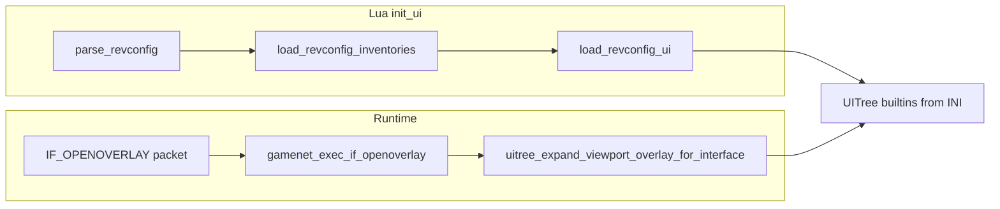

# Viewport overlay: INI, Lua init, and IF_OPENOVERLAY

## Server packet (Client.ts reference)

- **[`ServerProt.IF_OPENOVERLAY`](Client-TS/src/io/ServerProt.ts)** = opcode **85**; payload **signed 16-bit** root component id (`g2b()`), stored as `mainOverlayId` and drawn in `otherOverlays()` after the 3D world.

## 1. INI: `viewport_overlay` component

**File:** [`src/osrs/revconfig/configs/rev_245_2/rev_245_2_ui.ini`](src/osrs/revconfig/configs/rev_245_2/rev_245_2_ui.ini)

Add a block analogous to [`[component:sidebar_overlay]`](src/osrs/revconfig/configs/rev_245_2/rev_245_2_ui.ini) (lines 197–201):

- **Name:** `[component:viewport_overlay]`
- **type:** `viewport_overlay` (new; must be implemented in [`uitree_load.c`](src/osrs/revconfig/uitree_load.c) `type_from_string` and `load_layout` like `sidebar_overlay` → `UIELEM_BUILTIN_SIDEBAR_OVERLAY`)
- **Size:** match the world viewport **inner** area used for IF*OPENOVERLAY hit-testing in [`interface.c`](src/osrs/interface.c) / [`tori_rs_frame.u.c`](src/tori_rs_frame.u.c) (roughly **512×334**; world component uses **w=513, h=335** — pick one convention consistent with `expand*\*\_rs_tree`positioning, same as`world` at **x=4, y=4** in layout)

**Layout:** In `[layout:fixed]`, add `c=viewport_overlay` with **x=4, y=4** (same origin as `c=world`) and place this entry **after** `c=world` in the file so the overlay builtin is stepped/drawn **on top** of the world (mirrors Client.ts drawing order: world, then `mainOverlayId`).

## 2. Lua: loading components and “updating” the UITree

**File:** [`src/osrs/scripts/rev245_2/init_ui.lua`](src/osrs/scripts/rev245_2/init_ui.lua)

No new Lua API is strictly required. The existing sequence already builds the static UITree from the parsed INI:

1. `Game.UI.parse_revconfig(ui_config, ui_cache_config)` — stores revconfig on the game
2. `Game.UI.load_revconfig_inventories()` — inventory pass
3. `Game.UI.load_revconfig_ui()` — calls [`uitree_load_ui_from_revconfig`](src/osrs/lua_sidecar/lua_ui.c) (see ~355), which materializes all `[layout:fixed]` entries, including new builtins, **if** the C loader knows `type=viewport_overlay`

**Clarification for “update the ui tree”:**

- **At init:** `load_revconfig_ui` _is_ the UITree build; ensure the new component exists in INI before this call (done).
- **At runtime (IF_OPENOVERLAY):** Like chat/sidebar, expansion should live in **C** — new `uitree_expand_viewport_overlay_for_interface(game, component_id)` called from [`gamenet_rev245_2_exec_if_openoverlay_v1`](src/osrs/revs/lc245_2/gamenet_rev245_2_exec.c) (currently a stub). Lua does not need to call expand unless you add an optional debug binding.

**Suggested Lua change:** Add a one-line comment above `Game.UI.load_revconfig_ui()` noting that fixed-layout builtins (including `viewport_overlay`) are instantiated there.

## 3. C implementation outline (required for end-to-end behavior)

Mirror [**`UIELEM_BUILTIN_SIDEBAR_OVERLAY`**](src/osrs/revconfig/uitree.h) / [`uitree_expand_sidebar_overlay_for_interface`](src/osrs/revconfig/uitree_load.c):

| Area                      | Action                                                                                                                                                   |
| ------------------------- | -------------------------------------------------------------------------------------------------------------------------------------------------------- |
| `uitree.h`                | Add `UIELEM_BUILTIN_VIEWPORT_OVERLAY`, union field if needed                                                                                             |
| `uitree.c`                | `uitree_push_builtin_viewport_overlay`, clear children, dirty/step (copy sidebar_overlay patterns); hover/minimenu hooks if needed                       |
| `uitree_load.c`           | `expand_viewport_overlay_rs_tree`, `uitree_find_viewport_overlay_builtin`, `uitree_expand_viewport_overlay_for_interface`                                |
| `gamenet_rev245_2_exec.c` | Full `if_openoverlay` handler: set `viewport_interface_id`, call expand; align with `IF_OPENMAIN`/close paths that already touch `viewport_interface_id` |
| `tori_rs_frame.u.c`       | `uielem_builtin_viewport_overlay_step` in the big switch                                                                                                 |

## 4. Verification

- After init, `frame_find_builtin(game, UIELEM_BUILTIN_VIEWPORT_OVERLAY)` (or equivalent) resolves once layout loads.
- When server sends IF_OPENOVERLAY with root id > 0, RS subtree appears over the world region; `-1`/`65535` clears per protocol conventions.
