# Large locs and the painter: the QBD arena floor strip

A debugging log for a single defect, written out in full because the shape of it
recurs: **a very large loc changes when the painter is allowed to draw the tiles
around it**, and where two large locs meet, the tile column between them can be
held back so long that its floor lands on top of everything it should be under.

The symptom was a one-tile-wide strip of arena floor running up over the Queen
Black Dragon's platform whenever the camera came to rest on one particular
column.

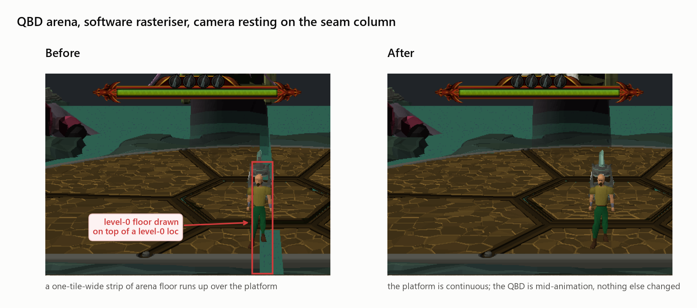

| | Before | After |
|---|---|---|
| Floor tiles emitted out of order | **32** of 768 | **0** |
| Worst tile | painted over **225** nearer floor tiles | — |
| Monotone runs in the plane-0 sweep | 5 | **1** |
| Teal floor pixels inside the strip rect | 77 | **0** |
| Longest stall on the seam column | **282 paints** | stays in step with its rings |

- **Fix**: [`src/painters/painters_bucket.u.c`](src/painters/painters_bucket.u.c) —
  `bucket_gate_blocks` / `bucket_neighbour_holds_only_nearer_scenery`, plus
  `scenery_near_corner_dist` in [`src/painters/painters_i.h`](src/painters/painters_i.h).
- **Pinned by**: `test_seam_between_two_large_locs_keeps_the_sweep` in
  [`src/painters/test/painters_test_terrain_levels.c`](src/painters/test/painters_test_terrain_levels.c).
- **Related**: [docs/painter_bucket_vs_world3d.md](docs/painter_bucket_vs_world3d.md)
  (the two painters and the gate), [docs/qbd_toridraw_streaks_debug.md](docs/qbd_toridraw_streaks_debug.md)
  (the raster-side investigation this closes out).

> **A second strip, same arena** — the sweep this fixed is clean, and a strip
> still appeared from some camera angles. That one is not an ordering fault at
> all: the slabs' *models* reach about six tiles past the footprints they are
> registered on, and the painter can only place a loc at the ring of the
> footprint it knows about. See [§16](#16-the-other-strip-when-the-model-is-bigger-than-the-footprint).

---

## Contents

1. [What you are looking at](#1-what-you-are-looking-at)
2. [Step 1 — which draw command owns those pixels?](#2-step-1--which-draw-command-owns-those-pixels)
3. [Step 2 — when in the frame was it drawn?](#3-step-2--when-in-the-frame-was-it-drawn)
4. [Step 3 — is it one tile or the whole sweep?](#4-step-3--is-it-one-tile-or-the-whole-sweep)
5. [Step 4 — ruling out the rasteriser](#5-step-4--ruling-out-the-rasteriser)
6. [How the painter orders the world](#6-how-the-painter-orders-the-world)
7. [The seam](#7-the-seam)
8. [Why a big loc lands at its nearest tile](#8-why-a-big-loc-lands-at-its-nearest-tile)
9. [The whole causal chain](#9-the-whole-causal-chain)
10. [The fix](#10-the-fix)
11. [The regression test](#11-the-regression-test)
12. [Results](#12-results)
13. [Reproducing it yourself](#13-reproducing-it-yourself)
14. [The toolbox](#14-the-toolbox)
15. [Where this can bite again](#15-where-this-can-bite-again)
16. [The other strip: when the model is bigger than the footprint](#16-the-other-strip-when-the-model-is-bigger-than-the-footprint)

---

## 1. What you are looking at

The QBD arena is a 104×104 tile scene with four planes. The frame everything
below is measured from:

```
#path bucket:painter_paint_bucket dims=104x104 planes=4 camTile=49,43
      cam=6336,-816,5584 drawCenter=49,43 window=x[17,81)z[11,75)
      drawDist=32 levelMask=0xf minLevel=0 vp=723x503 pitch=128 yaw=0
      cullspan=1 occluders=0
```

Two things about this scene matter, and both are unusual:

- **The teal "floor" and the brown "platform" are both plane 0.** The platform
  is not level-1 terrain; it is a *loc* — a model standing on plane 0. Plane 1
  is a separate deck above it.
- **The floor is not one loc, it is two.** `TORIRS_DRAW_ORDER` resolves each
  element to its loc config: `loc=63040 size=12x18 slot=(38,48)` and
  `loc=63043 size=12x18 slot=(50,48)` — `x[38,49] z[48,65]` and
  `x[50,61] z[48,65]`, 216 tiles each, meeting exactly on column 49/50. (A third,
  `loc=63046 size=20x7 slot=(40,45)`, sits in front of them.)

The camera's eye tile that frame is `(49,43)`. That is the west loc's own last
column, one tile from the seam. This is the "camera resting on the line" case.

---

## 2. Step 1 — which draw command owns those pixels?

Never start from the geometry. Start from the pixel, and make the renderer say
who wrote it. `TORIRS_PIXOWNER` snapshots a rect after every draw command and
attributes the pixels that changed:

```sh
TORIRS_PIXOWNER='355,375,150,250' TORIRS_PIXOWNER_OUT=/tmp/pixowner.txt \
  ./src/torirs_win64.exe --manifest manifest_osrs239_rs2012.ini \
  --user qbdvisual --pass test --soft3d
```

```
# pixel owners, rect x355..375 y150..250, frame 851
# colour cmd kind elem loc terrain tile pixels
2d6050 cmd=800 kind=17 elem=2304 loc=-1 TERRAIN tile=49,58 L0 pixels=48
2d6050 cmd=784 kind=17 elem=2176 loc=-1 TERRAIN tile=49,60 L0 pixels=28
2d4450 cmd=800 kind=17 elem=2304 loc=-1 TERRAIN tile=49,58 L0 pixels=1
```

That is the whole first move, and it rules out three explanations at once:

| Ruled out | Because |
|---|---|
| A texture or material fault | the owner is `TERRAIN`, not a model |
| Plane-1 geometry poking through | the owner is `L0` |
| A stray loc | `loc=-1`, `elem` is a terrain element |

The owner is **level-0 floor on column x=49** — the seam column — and it is on
top of the platform. That is a draw-*order* fact, not a geometry one.

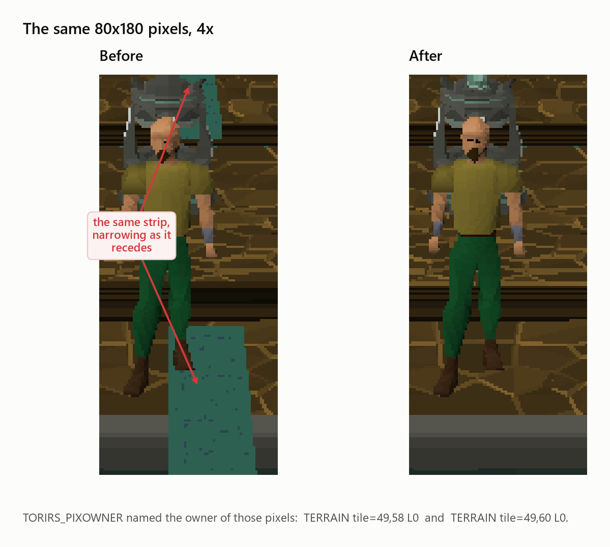

---

## 3. Step 2 — when in the frame was it drawn?

`TORIRS_WEDGELOG` records the painter's traversal: every MARK / PUSH / POP and
every geometry emission, in order, with the tile and plane each belongs to.

```sh
TORIRS_WEDGELOG=/tmp/wedge.log TORIRS_WEDGELOG_AT=800 TORIRS_WEDGELOG_FRAMES=1 \
  ./src/torirs_win64.exe --manifest manifest_osrs239_rs2012.ini \
  --user qbdvisual --pass test --soft3d
```

Filtering it to plane-0 floor emissions on the camera column is where the defect
becomes obvious. `d` is Manhattan distance from the eye tile; a correct
painter's sweep works from large `d` to small `d` and never goes back:

```
  p= 265 (49,74) d=31        <- column starts normally...
  p= 292 (49,73) d=30
  p= 317 (49,72) d=29
   ...
  p= 458 (49,66) d=23        <- ...and then stops dead

        ( 282 paints in which the entire rest of the box is drawn,
          including the east platform loc at p=729, five tiles from the eye )

  p= 740 (49,65) d=22        <- resumes, twenty-two tiles out
  p= 747 (49,64) d=21
  p= 755 (49,63) d=20
   ...
  p= 800 (49,58) d=15        <- the command TORIRS_PIXOWNER named
```

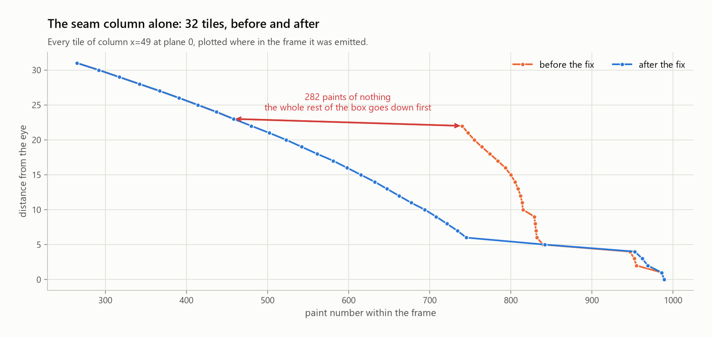

The two runs are identical until paint 458. Then the "before" line goes flat for
282 paints and dives — the column catches up all at once, long after the drain
had already reached distance 6.

---

## 4. Step 3 — is it one tile or the whole sweep?

Two views of the same 768 plane-0 floor commands.

**Distance against emission order.** Every rise in this line is geometry painted
on top of something in front of it:

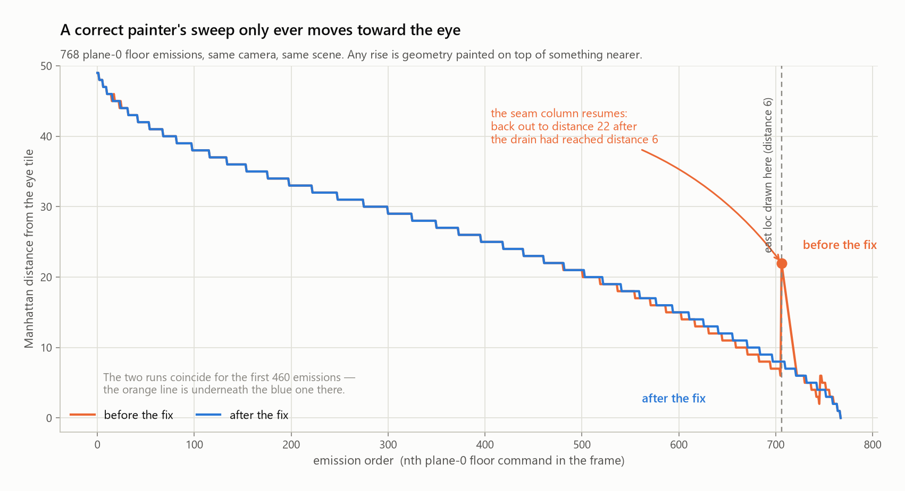

**Violations per tile.** For each floor emission, count how many *nearer* floor
tiles were already on screen when it went down. A correct sweep makes this zero
everywhere:

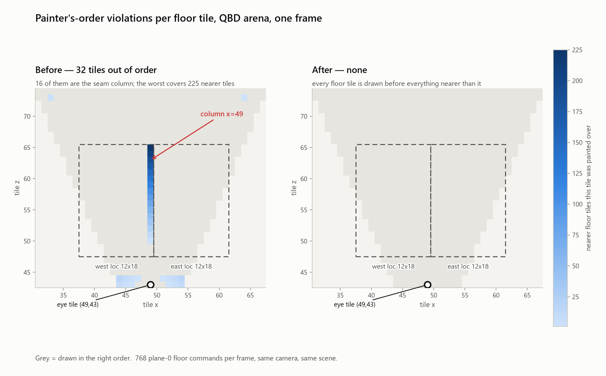

The bright line in the left panel is the artifact, in tile space, one tile wide,
exactly where the two loc footprints meet. The right panel is the same
measurement after the fix.

| | tiles > 0 | total inversions | worst tile |
|---|---|---|---|
| Seam column `x=49` | 16 | 1636 | `(49,65)` covered 225 nearer tiles |
| Everything else | 16 | 91 | `(44,44)` covered 16 — ring ties at the eye, harmless |
| **After the fix** | **0** | **0** | — |

---

## 5. Step 4 — ruling out the rasteriser

The repo has two painters: `painter_paint_bucket` (production, a distance-bucket
drain) and `painter_paint_world3d` (the reference cascade). Until this
investigation there was no way to swap them in the live client, so
`TORIRS_PAINTER_W3D=1` was added to [`src/app.c`](src/app.c):

```sh
TORIRS_PAINTER_W3D=1 ./src/torirs_win64.exe --manifest manifest_osrs239_rs2012.ini ...
```

Same scene, same frame, the other traversal. This is the lever that separates
"the traversal ordered it wrong" from "the geometry is where it says it is" —
and pairs with `TORIRS_PIXOWNER` to name what changed hands. Worth keeping for
the next draw-order bug even though the wedgelog is what settled this one.

### What the reference cascade does with the same frame

`TORIRS_WEDGELOG` only instruments the bucket drain, but `TORIRS_DRAW_ORDER` is
painter-agnostic, so both can be dumped at the identical camera
(`cam=49,43 campos=(6336,-816,5584) pitch=128 yaw=0`, paint index 120) and put
through the same violation metric:

| L0 terrain sweep | `painter_paint_world3d` | `painter_paint_bucket` (fixed) |
|---|---|---|
| Monotone runs | **20** | 1 |
| Tiles out of order | **532** | 0 |
| Total inversions | **87,192** | 0 |
| Worst tile | `(70,74)` d=52, over 410 nearer tiles | — |
| Seam-column tiles after the east 12×18 loc | **23**, farthest at **d=22** | 6, farthest at d=5 |

**The reference cascade has the seam defect too**, with the same signature: the
east platform loc emits at order 846 and 23 of the seam column's 32 tiles follow
it, the farthest twenty-two rings out. That is the pre-fix bucket's number
exactly. In the fixed bucket the six column tiles that follow the loc are all at
d≤5 — genuinely nearer than the loc's own d=6 ring, which is what should happen.

It also has a **second, larger problem the bucket drain does not**: its worst
offenders are not the seam but the far corner, and the sweep breaks into twenty
runs. That is the corner-by-corner quadrant flooding that commit `b9967d49`
removed from the bucket painter by bulk-pushing every visible tile into its
distance bucket up front. `world3d` still seeds one perimeter tile per drain, so
each seed's wave floods its whole quadrant before the next seed is taken.

`world3d` is not the production painter — it is kept as the reference cascade and
as the fuzz harness's comparison target — so it was left alone here. Anyone
making it production has two fixes to port, not one.

---

## 6. How the painter orders the world

Enough of the algorithm to follow the rest.

### Rings

`painter_paint_bucket` pushes every visible tile into a bucket keyed by
Manhattan distance from the eye tile, then drains **farthest bucket first**. The
box paints as concentric rings closing on the eye:

```
        d=4    . . . . . . . . .
        d=3    . . . # # # . . .
        d=2    . . # # # # # . .
        d=1    . # # # E # # # .          E = eye tile
        d=0    . . # # # # # . .
               . . . # # # . . .
               . . . . . . . . .
```

Any farther tile emitted after a nearer one is a painter's-algorithm violation —
that is exactly what the map in §4 counts.

### The adjacency gate

Distance alone is not enough: the reference clients cascade outward-in, and a
tile may not draw its ground until the neighbour *between it and the far edge*
has fully retired. Ported verbatim, that is four checks:

```c
if( x <= cameraX && x > minX )      /* the tile to my west  must be DONE */
if( x >= cameraX && x < maxX - 1 )  /* the tile to my east  must be DONE */
if( z <= cameraZ && z > minZ )      /* the tile to my south must be DONE */
if( z >= cameraZ && z < maxZ - 1 )  /* the tile to my north must be DONE */
```

Note the `<=` and `>=`. **A tile whose `sx` equals `camera_sx` satisfies both the
west and the east test**, so it is gated on both horizontal neighbours. Same for
`sz` and the camera row. That is deliberate — the eye's own row and column have
"far" tiles on both sides — and it is half of this bug.

### Span flags

A multi-tile loc is registered on every tile of its footprint, and each of those
tiles records which of its four neighbours belong to the same loc:

```
   a 3x2 loc, and the span bits each of its tiles carries

   +---------+---------+---------+
   |  E N    |  W E N  |  W N    |     N = SPAN_FLAG_NORTH
   |         |         |         |     S = SPAN_FLAG_SOUTH
   +---------+---------+---------+     E = SPAN_FLAG_EAST
   |  E S    |  W E S  |  W S    |     W = SPAN_FLAG_WEST
   |         |         |         |
   +---------+---------+---------+
```

The gate uses them as its one escape hatch: if the blocking neighbour is only at
`PAINT_STEP_GROUND` **and this tile carries a span bit pointing at it**, that is
good enough. Without the escape the footprint would deadlock — the loc waits for
every footprint tile's ground, and every footprint tile would be waiting for the
loc.

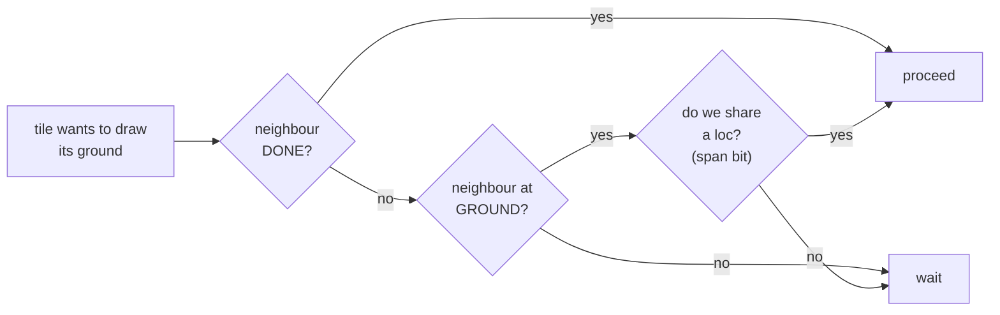

The escape is keyed on **this tile's** spans. That is the other half of the bug:
it cannot fire when the neighbour is held by a loc that does not cover this tile.

---

## 7. The seam

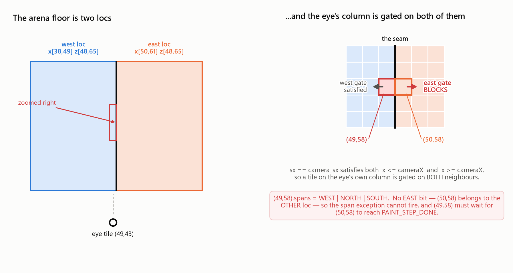

Put the two halves together on tile `(49,58)`, fifteen tiles from the eye:

```
        x=48        x=49        x=50        x=51
      +-----------+-----------+-----------+-----------+
 z=58 | west loc  | west loc  | east loc  | east loc  |
      |           |  (49,58)  |  (50,58)  |           |
      +-----------+-----------+-----------+-----------+
                        |  seam  |
```

- `(49,58)` is on the camera column, so **both** its west and its east gate
  apply.
- The west gate is satisfied: `(48,58)` is in the same loc, `(49,58)` carries
  `SPAN_FLAG_WEST`, the escape fires.
- The east gate is not. `(49,58).spans = WEST | NORTH | SOUTH` — **no EAST
  bit**, because the east loc's footprint stops at `x=50` and never covers
  `x=49`. So `(49,58)` must wait for `(50,58)` to reach `PAINT_STEP_DONE`.
- `(50,58)` reaches `PAINT_STEP_GROUND` promptly and then stops there, because a
  tile is not DONE until every loc standing on it has been drawn — and the loc
  standing on it is 216 tiles across.

That is the 282-paint stall, and it happens to *every* tile of column 49 inside
the loc's z range. Sixteen of them. Sixteen violating tiles.

---

## 8. Why a big loc lands at its nearest tile

The last piece is why waiting for that loc is not merely slow but *wrong*.

A loc is released when every tile of its footprint has its ground down. The
drain works farthest-first, so the last footprint tile to qualify is always the
one **closest to the eye** — and that is where the whole loc gets emitted:

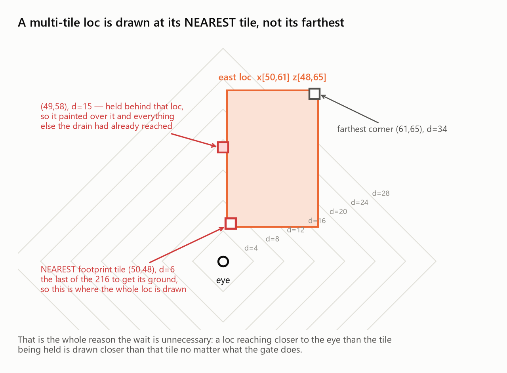

For the east platform: farthest corner `(61,65)` at d=34, nearest footprint tile
`(50,48)` at **d=6**. It is emitted at paint 729, in the middle of the d=6 ring.

So the arrangement the gate produced was:

```
   d=15   floor (49,58)   ---- held, waiting on ---->   the east loc
                                                             |
   d=6    the east loc    ---- released here, and drawn ------+

   result: (49,58) is emitted at paint 800, the loc at paint 729.
           A tile fifteen rings out lands on top of a loc six rings out.
```

A loc that reaches closer to the eye than the tile being held is drawn closer
than that tile whatever the gate does. Waiting for it can only ever put the
farther tile in the wrong place.

---

## 9. The whole causal chain

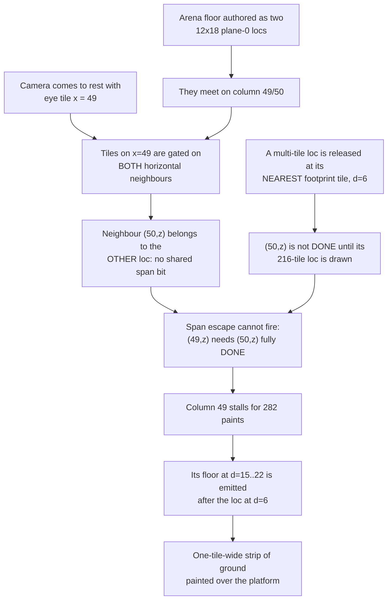

Every box is measurable, and every one of them was measured before the code was
touched.

---

## 10. The fix

The gate's job is to keep a farther tile's geometry ahead of a nearer tile's
ground. When the only thing still holding the neighbour is a loc that will be
drawn *nearer* than the tile being gated, the gate has nothing left to protect.

[`src/painters/painters_bucket.u.c`](src/painters/painters_bucket.u.c):

```c
static int
bucket_neighbour_holds_only_nearer_scenery(
    struct Painter* painter,
    const struct PaintersTile* other_tile,
    const struct TilePaint* other_paint,
    int camera_sx,
    int camera_sz,
    int dist)
{
    int pending = 0;

    if( other_paint->step == PAINT_STEP_READY )
        return 0; /* ground not down yet — nothing to relax */
    if( other_tile->scenery_head == -1 )
        return 0;
    if( other_tile->wall_a != -1 || other_tile->wall_b != -1 ||
        other_tile->wall_decor_a != -1 )
        return 0;

    for( int32_t sn = other_tile->scenery_head; sn != -1;
         sn = painter->scenery_pool[sn].next )
    {
        int si = painter->scenery_pool[sn].element_idx;
        if( painter->element_paints[si].drawn )
            continue;
        if( scenery_near_corner_dist(&painter->elements[si], camera_sx, camera_sz) >= dist )
            return 0;
        pending = 1;
    }
    return pending;
}
```

and the gate becomes:

```c
static inline int
bucket_gate_blocks(..., int neighbour_idx, unsigned span_flag, ..., int dist)
{
    if( other->step == PAINT_STEP_DONE )
        return 0;
    if( other->step != PAINT_STEP_READY && (tile->spans & span_flag) != 0 )
        return 0;                                   /* reference span exception */
    if( bucket_neighbour_holds_only_nearer_scenery(...) )
        return 0;                                   /* the seam exception */
    return 1;
}
```

The new distance is the counterpart to the existing far-corner sort key, in
[`src/painters/painters_i.h`](src/painters/painters_i.h):

```c
static inline int
scenery_near_corner_dist(const struct PaintersElement* el, int camera_sx, int camera_sz)
{
    int min_x = (int)el->sx, max_x = min_x + (int)el->_scenery.size_x - 1;
    int min_z = (int)el->sz, max_z = min_z + (int)el->_scenery.size_z - 1;
    int dx = camera_sx < min_x ? min_x - camera_sx : (camera_sx > max_x ? camera_sx - max_x : 0);
    int dz = camera_sz < min_z ? min_z - camera_sz : (camera_sz > max_z ? camera_sz - max_z : 0);
    return dx + dz;
}
```

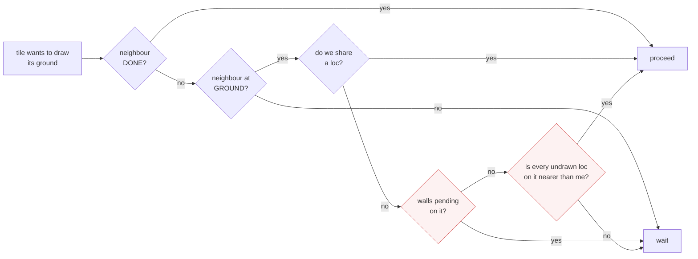

### When it deliberately does *not* fire

The relaxation is narrow on purpose. It stands down for:

| Case | Why |
|---|---|
| Neighbour still at `PAINT_STEP_READY` | its own ground is not down yet; nothing has changed |
| Neighbour carries a wall, wall decor | a far tile's near wall must still precede a nearer tile's ground |
| Any undrawn element whose footprint does **not** reach past this ring | that is the ordinary "wait for the tile behind me" case, unchanged |
| A 1×1 loc on the neighbour | its near-corner distance equals the neighbour's own, which is `>= dist` |
| `painter_paint_world3d` | left on the plain reference gate — it has the defect (§5), it is just not the production painter |

Worked example — the neighbour is one ring farther out, carrying a 2×1 loc that
extends *away* from the eye:

```
   me: d=15        neighbour: d=16      loc covers d=16..17
   near-corner distance of that loc = 16  >=  15   ->  gate still blocks.  Correct.
```

versus the seam:

```
   me: d=15        neighbour: d=16      loc covers d=6..34
   near-corner distance of that loc =  6  <   15   ->  gate releases.
```

### Cost

Every branch short-circuits before the chain walk in the common case: the
neighbour is usually `DONE` (first test) or `READY` (second), and a floor tile
with no scenery leaves on the third. What remains is a walk of a chain the
official client caps at five entries.

---

## 11. The regression test

`test_seam_between_two_large_locs_keeps_the_sweep` reproduces the topology in a
32×32 painter with no cache, no client, and no rendering — two 9×16 locs meeting
on the camera column:

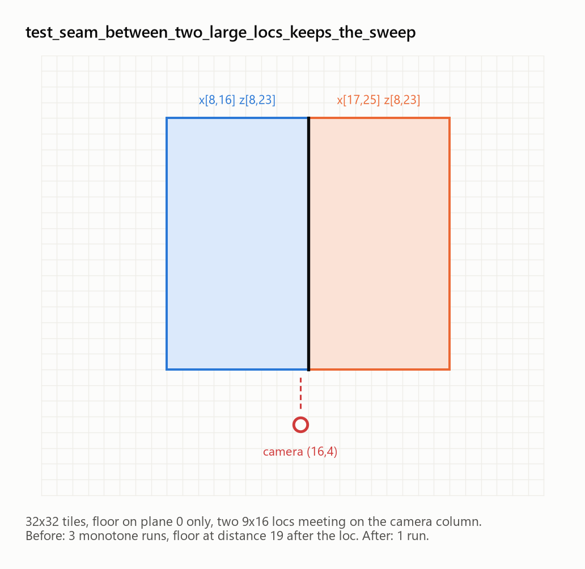

```c
painter_add_normal_scenery_ex(p, 8, 8, 0, west_loc, 9, 16, 0, PNTR_SCENERY_STACK_BASE);
painter_add_normal_scenery_ex(p, 17, 8, 0, east_loc, 9, 16, 0, PNTR_SCENERY_STACK_BASE);
painter_paint_bucket(p, buf, /* camera */ 16, 4, 0);
```

and asserts the two properties the arena lost:

```c
expect(runs == 1, "terrain distance never increases across the seam");
expect(worst_after_east <= 5,
       "no floor farther than the east loc's own ring is emitted after it");
```

```sh
make -C src test-painters-terrain-levels
```

Before the fix:

```
a floor column on the seam of two large locs still sweeps farthest-first
  ok   the box emitted terrain at all
       (3 monotone runs over 1024 tiles: the seam column ran late)
       (floor at distance 19 emitted after the east loc)
painters_test_terrain_levels: 2 FAILED
```

After:

```
a floor column on the seam of two large locs still sweeps farthest-first
  ok   the box emitted terrain at all
  ok   terrain distance never increases across the seam
  ok   no floor farther than the east loc's own ring is emitted after it
OK: painters_test_terrain_levels
```

It sits alongside `test_bucket_emits_one_globally_distance_ordered_sweep`, which
already pinned the sweep for an empty box; this one pins it for a box with large
locs in it.

---

## 12. Results

| Measurement | Before | After |
|---|---|---|
| Plane-0 floor emissions per frame | 768 | 768 |
| Tiles emitted out of order | 32 | **0** |
| Total inversions (tile pairs) | 1727 | **0** |
| Monotone runs in the sweep | 5 | **1** |
| Seam column stall | 282 paints | stays in step with its rings |
| `TERRAIN L0` owners inside the strip rect | 2 commands, 77 px | **0** |
| `make -C src test-painters-terrain-levels` | 2 failures | OK |
| `make -C src test-painters-occluders` | — | OK |

As a control, the ordinary `manifest_osrs239.ini` scene (Lumbridge — walls,
stairs, fences, bushes, a fountain) was rendered with the fix in place and
inspected: every one of those is in the right order. The relaxation must not
fire anywhere it was not already wrong.

---

## 13. Reproducing it yourself

```sh
# build the lane's cache and the client
make -C src mock230-cache-rs2012
./build_windows.ps1 -Opt                     # or: make -C src release

# 1. see it (or not) — 850 frames, exit with a screenshot
SDL_VIDEODRIVER=dummy TORIDRAW_RASTER_SCANLINE=1 \
TORIRS_MAX_FRAMES=850 TORIRS_SIM_WINDOW='500,1200x800' \
TORIRS_EXIT_BMP=/tmp/qbd.bmp \
  ./src/torirs_win64.exe --manifest manifest_osrs239_rs2012.ini \
  --user qbdvisual --pass test --soft3d

# 2. who owns the strip's pixels
TORIRS_PIXOWNER='355,375,150,250' TORIRS_PIXOWNER_OUT=/tmp/pixowner.txt ...

# 3. the whole traversal for one frame
TORIRS_WEDGELOG=/tmp/wedge.log TORIRS_WEDGELOG_AT=800 TORIRS_WEDGELOG_FRAMES=1 ...

# 4. the other painter, same frame
TORIRS_PAINTER_W3D=1 ...

# 5. the unit-level repro, no cache or client needed
make -C src test-painters-terrain-levels
```

The figures in this document are generated from the two wedgelogs and the two
screenshots by
[`docs/large_locs_painter/make_figures.py`](docs/large_locs_painter/make_figures.py).

---

## 14. The toolbox

Everything used here already existed except the last row.

| Lever | Answers |
|---|---|
| `TORIRS_PIXOWNER=x0,x1,y0,y1[,RRGGBB]` | *what painted **this** pixel* — command index, kind, element, terrain tile and level |
| `TORIRS_PIXOWNER_OUT`, `TORIRS_PIXOWNER_AT` | where to write it, and which frame |
| `TORIRS_WEDGELOG=<path>` | the painter's whole traversal: MARK / PUSH / POP / every emission, with tile, plane and draw level |
| `TORIRS_WEDGELOG_AT`, `_FRAMES` | which paint call to capture, how many |
| `TORIRS_DRAW_ORDER=<frame>` | the emitted stream with each element resolved to a loc id, footprint and size |
| `TORIRS_PAINT_LIMIT`, `_STEP`, `_STEP_AT` | cap the command stream and advance it one command per frame — watch the frame build |
| `TORIRS_PAINTER_DUMP`, `_DUMP_TILE` | per-tile emission sequence with element slots |
| `TORIRS_PAINT_DEBUG` | per-frame command counts by kind |
| `TORIRS_PAINTER_W3D=1` | **new** — run the reference cascade in the live client instead of the bucket drain |

Rule of thumb that this bug reinforces: **go pixel → command → tile → traversal,
in that order.** Every step narrows the search by a category, and three
categories were eliminated by the first command that was run.

---

## 15. Where this can bite again

The fix removes the failure for the shape that produced it. The properties that
made the arena vulnerable are worth recognising elsewhere:

- **A loc whose footprint spans a large distance range** is drawn at one instant,
  at its nearest tile, with no depth buffer to sort it against anything. The
  bigger the loc, the more geometry is nominally at the wrong depth relative to
  it. 12×18 is far outside what the reference clients' content ever asked of
  this algorithm.
- **Two large locs sharing an edge** put the seam column in a dependency
  relationship with a loc that does not cover it. Any camera position landing on
  that column re-creates the pattern; the fix is what makes it harmless.
- **Plane 1 above a large plane-0 loc** still replays as a block: a level-1 tile
  is only queued once the level-0 tile below it fully retires, so the deck above
  a 216-tile loc is deferred until that loc is drawn and then swept far-to-near
  on its own. That is correct — level 1 is above level 0 — but it means the
  plane-1 sweep is not globally distance-ordered with plane 0, and a future bug
  in that area will look similar and *not* be this one.
- **`PAINTER_SCENERY_MAX_SIZE` is 255.** Clamping loc footprints was removed
  deliberately (a truncated footprint lets a loc draw before the ground it
  covers), so nothing bounds how large a loc the traversal must cope with except
  the field width.

The invariant to hold onto, and the one both tests assert: **terrain distance
from the eye never increases across a frame's command stream.**

---

## 16. The other strip: when the model is bigger than the footprint

A second strip of arena floor kept appearing over the platform from some camera
angles after everything above shipped. It is worth writing down because the
symptom is identical and the cause is not — the first instinct, "the sweep went
wrong again", is measurably false here.

### The measurement that separates them

Same toolbox, same order: pixel → command → tile → traversal.

```sh
TORIRS_SIM_DRAG='600,700,250,828,378,1,2'   # middle-drag: pitch to 383, yaw to 1536
TORIRS_PIXOWNER='900,1000,535,555' TORIRS_PIXOWNER_OUT=/tmp/pixowner.txt ...
```

```
cmd=1035  px=7023   loc  elem=4562  wpos=7168,-240,7296      <- the east slab
cmd=1108  px=3248   TERRAIN tile=49,51 L0
cmd=1126  px=1940   TERRAIN tile=49,52 L0                    <- painted over it
cmd=1256  px=8477   loc  elem=4575  wpos=5632,-240,7296      <- the west slab
```

The wedgelog for that frame then says the thing that rules §1–§10 out:

```
#path bucket:painter_paint_bucket camTile=42,52 drawCenter=42,52 drawDist=32 ...
plane-0 floors: 1052   monotone runs: 1   inversions: 0
```

**The sweep is perfect.** One monotone run, zero inversions — the fix above is
holding. The floor tile at `(49,52)` is at ring 7 and the east slab was released
at ring 8, so the painter drew the nearer thing later, exactly as designed.

### What is actually wrong

`TORIRS_EMIT_LOC` prints the model extent next to the footprint, and that is the
whole answer:

```
emit_loc 63043 el=4562: world=(7168,-240,7296) tile=(50,48) slot=(50,48)
          extent x[-1497..1293] z[-1293..1199] -> tiles x[44..66] z[46..66]
emit_loc 63040 el=4575: world=(5632,-240,7296) tile=(38,48) slot=(38,48)
          extent x[-1422..1368] z[-1293..1188] -> tiles x[32..54] z[46..66]
```

| | registered footprint | model draws on |
|---|---|---|
| loc 63043 | x[50,61] z[48,65] | **x[44,66] z[46,66]** |
| loc 63040 | x[38,49] z[48,65] | **x[32,54] z[46,66]** |

The two slabs' geometry interlocks across the seam: the column at `x=49` is
inside the *west* slab's footprint but is covered by the *east* slab's polygons.
The painter releases a loc at the ring of the footprint it was registered on, so
the east slab lands at ring 8 and the seam column's ground — one ring nearer,
and correctly ordered — goes down on top of it.

A painter's algorithm gives a loc exactly **one** slot. A loc whose geometry
leaves its footprint can only be right on one side of that: too early, and the
ground it covers paints over it; too late, and it covers the things standing on
it. The reference client picks the footprint, which is "too early" by however
far the model overhangs. Nothing in the traversal can recover it, because the
traversal is never told where the polygons are.

### The fix

Tell it. [`src/engine/world_builder/world_scenery.u.c`](src/engine/world_builder/world_scenery.u.c)
now registers a multi-tile loc on its declared footprint **grown to cover the
tiles its model lands on, by at most one tile per side**:

```c
world_builder_draw_footprint(
    scene_x, scene_z, size_x, size_z,
    (world_min_x + SCENERY_DRAW_OVERHANG_MIN) >> 7, (world_max_x - ...) >> 7,
    (world_min_z + SCENERY_DRAW_OVERHANG_MIN) >> 7, (world_max_z - ...) >> 7,
    margin, scene_size, &draw_sx, &draw_sz, &draw_size_x, &draw_size_z);
```

The extent is exact and free: `ToriDraw_ModelSetBoundsCylinder` already walks
every vertex for `min_y` / `radius`, so `min_x/max_x/min_z/max_z` were added to
the same loop and read back through `ToriDraw_SceneElementDrawExtentXZ`.

Three decisions are load-bearing:

| Decision | Why |
|---|---|
| **Cap of one tile**, not the whole extent | growing the footprint moves the loc's slot *nearer*; past its own overhang it starts covering what stands on it. Released six rings in, the slab would be drawn over the player standing on it. One tile keeps the slot within one ring of the reference's, and inside a single shared tile nothing moves at all — that tile's scenery pass already emits its chain farthest-corner first, which puts the big loc ahead of anything on it. |
| **Multi-tile locs only** | a 1x1 model overhangs far more often (every tree canopy), the error is a tile wide rather than a slab, and there are orders of magnitude more of them. |
| **Ignore overhang under a quarter tile** (`SCENERY_DRAW_OVERHANG_MIN`) | a rounded corner or a resize laps a few units past the edge and cannot draw a visible strip, but claiming the neighbour tile for it costs a scenery-chain node on every pop. Dropping those took Lumbridge's paint cost from +2.6% to +0.7%. |

Only the **draw** footprint moves. Shade, sharelight and route footprints stay
on the loc's declared tiles, which is what they mean.
`TORIRS_LOC_DRAW_MARGIN=0` restores the reference footprint exactly, and is what
the A/B below is measured against.

### Results

Screen-space, same binary, `TORIRS_LOC_DRAW_MARGIN=0` vs `1`, eight camera yaws
at pitch 383 (the runs are bit-deterministic — two runs of one binary differ by
zero pixels, so every number here is signal):

| yaw | changed px | floor-over-platform removed | introduced |
|---|---|---|---|
| 0 / 1024 | 0 | 0 | 0 |
| 256 / 512 / 768 | 929 / 200 / 281 | 0 | 0 |
| 1280 | 4027 | 1282 | 0 |
| 1536 | 39656 | **1938** | 0 |
| 1792 | 27133 | 0 | 0 |
| **total** | 72226 | **3220** | **0** |

Command-stream, counting terrain that a slab's *model* covers and its footprint
does not, emitted after the slab (`docs/` has no home for the script; it is a
dozen lines over a `TORIRS_DRAW_ORDER` dump):

```
before  yaw 0..1792:  41 32 30 27  3 37 42 50   total 262
after   yaw 0..1792:   6 14 20 18  0 26 30 20   total 134
```

The residue is the deeper overhang (x=44..45, 51..53) that the *neighbouring*
slab covers, which is why only the seam column was ever visible.

### Cost

Median of three 900-frame runs each, 1920x1080, `TORIRS_PERF=1`:

| | paint p50 | paint mean | painter_pops/paint |
|---|---|---|---|
| QBD lair, margin 0 | 130 µs | 128.5 µs | 8700 |
| QBD lair, margin 1 | 135 µs (**+3.8%**) | 133.3 µs | 9035 (+3.8%) |
| Lumbridge, margin 0 | 269 µs | 257.0 µs | 6958 |
| Lumbridge, margin 1 | 271 µs (**+0.7%**) | 257.3 µs | 6998 (+0.6%) |

Frame p50 in the QBD lair is unchanged at 5.57 ms — paint is 2.4% of the frame
there, so the delta is under 0.1% of frame time. Build-side, the extra four
min/max double that vertex loop in isolation (95 → 192 ns per 1000-vertex model,
min-of-7) and it runs **once per model at scene build**: about 1050 models for a
Lumbridge scene, so tens of microseconds against a build measured in hundreds of
milliseconds.

### Pinned by

`test_draw_footprint_covers_model_overhang` in
[`src/engine/world_builder/test/world_builder_test_unit.c`](src/engine/world_builder/test/world_builder_test_unit.c)
— the growth is a pure function of tile coordinates, so the cap, the "stops at
the model not at the cap" case, the `margin 0` kill switch and the grid clamp
are all testable without a cache. Negative control: an early `return` in
`world_builder_draw_footprint` fails three of the five assertions.

```sh
make -C src test-world-builder
```

### What this does not fix

**A mover's footprint has the same mismatch, and much worse.** The Queen Black
Dragon is npc size **1**, so `world_dyn_register_mover` gives her a 60-unit
padded span — one or two tiles — while her model fills a ~4791-unit bounding
sphere, roughly 37 tiles across. Every terrain tile nearer than her own tile is
drawn after her. The one-tile margin here is deliberately not applied to movers:
a floor slab drawn a ring later is safe, and a 37-tile dragon drawn at the ring
of her *geometry* would be emitted almost at the eye and cover the whole arena.
That trade-off needs its own decision, not this one's.
