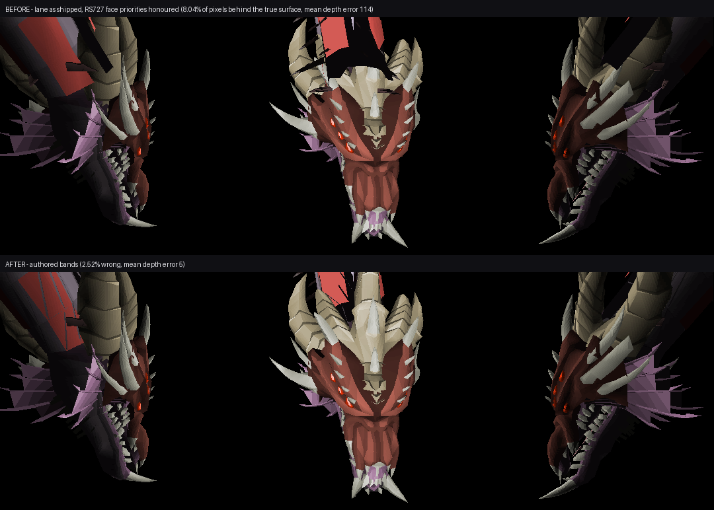

# Backporting RS2012 (RS727) content to the OSRS239 / ToriDraw engine

A guide to the four conversions that a pre-EoC import gets wrong by default,
written from the Queen Black Dragon arena port. Each section states the symptom
you will actually see on screen, the mechanism, the decision taken, and what to
do next time.

The common thread: **RS727 was a z-buffered, HD-capable client. OSRS239 with
ToriDraw is a painter's-algorithm, SD-only software rasterizer.** Every problem
below is a property the source content was allowed to have because the source
renderer could absorb it.

Related: [`docs/qbd_toridraw_streaks_debug.md`](docs/qbd_toridraw_streaks_debug.md)
(the debug log this came out of), [`OSRS-Content/osrs239-content/ported/rs2012_qbd_td/PROVENANCE.md`](OSRS-Content/osrs239-content/ported/rs2012_qbd_td/PROVENANCE.md)
(what the import closure contains).

---

## 1. Face render priorities — strip them, then author them

### Symptom

A model sorts inside-out. On the QBD the neck showed interior surfaces and
spikes drawn over the exterior, near faces behind far ones. It looks like
broken back-face culling, and it is not — culling is fine, the *order* is
wrong.

### Mechanism

Face render priorities are a painter's-algorithm crutch. With no depth buffer,
the artist pins a face into a draw band so it lands in front of or behind its
neighbours regardless of its actual depth. ToriDraw honours them: when a model
carries priorities, they **override** the depth sort.

RS727 resolved visibility with a z-buffer. Its models carry priority bytes that
never had to order anything, so they do not describe a usable painter order.
Feeding them to a painter's-algorithm sorter is worse than having no priorities
at all, because the depth sort — which would have been correct — is discarded.

### Decision

**Strip priorities from the imported lane's OB3 assets**, not from the engine.

The property belongs to the content that has it. Gating it in ToriDraw (an env
var, a global flag) would either mis-sort OSRS models, whose priorities *are*
meaningful, or require a per-model flag threaded through the renderer for no
gain.

```sh
make -C src rs2012-strip-priorities
src/build/rs2012_strip_priorities              # report only
src/build/rs2012_strip_priorities --apply      # rewrite the .ob3 files
make -C src torirsserver-cache-rs2012               # models are assets: re-pack
```

On the QBD lane: 504 of 660 models carried priorities — 161 per-face
(`model_priority == 255`), 343 whole-model. The tool is idempotent; a second
run reports 660 "already none".

### Gotcha for anyone extending this

`RSCache_ModelEncodeFormat` prefers the **provenance's recorded header** over
anything derived from the model, and rejects a header claiming per-face
priorities (255) when the array is gone. Clearing the model is not enough:

```c
free(model->face_priorities);
model->face_priorities = NULL;
model->model_priority = 0;
if( provenance->header_flag_count > 1 )
    provenance->header_flags[1] = 0;   /* the priority byte */
```

Without that last line 504 of 660 models fail to encode. Do not "fix" it by
passing `provenance = NULL` — that discards the OB3 tail, which carries
particle and billboard sections this library preserves verbatim without
interpreting.

### How to tell whether a model has them

`TORIDRAW_DEBUG_NDJSON=1 TORIDRAW_DEBUG_LOG=<path>` emits a `face_order` record
per model with `has_priorities`. Before the strip the QBD was the only large
arena model reporting `1`.

### Better than stripping: author the bands from measurement

Stripping recovers the depth sort, which is most of the win. It is not the
ceiling, and on a lane that has since been re-packed *with* the RS727
priorities (`OSRS-Content` `b9e6bc901 repack with priority`) it is not what is
shipping either. `rs2012_face_priorities` replaces them with bands derived from
the geometry rather than inherited from a renderer that never used them.

```sh
make -C src rs2012-face-priorities rs2012-model-view
tools/rs2012_qbd_prio.sh                 # every QBD form, before/after scores
```

It never writes its input — `--in` and `--out` are separate paths, and the
whole loop lands in `docs/rs2012_qbd_priorities/run/`.

Before and after, with the sort-error masks and the z-buffer target beside
them: [`docs/rs2012_qbd_priorities/`](docs/rs2012_qbd_priorities/README.md).

[](docs/rs2012_qbd_priorities/README.md)

Measured over 24 camera angles inside the client's own pitch clamp, counting
pixels where the painter's sort leaves a surface behind the one a z-buffer
would have shown:

| QBD form | shipped (RS727 priorities) | priorities stripped | authored bands |
|---|---:|---:|---:|
| default | 11.84% | 4.28% | **4.21%** |
| crystal | 10.92% | — | 4.35% |
| hardened | 11.84% | — | 4.51% |
| tortured soul | 5.51% | — | 1.40% |
| giant worm | 0.90% | — | 0.06% |

The mean depth of an error falls with it, 119 units to 12 on the default form:
what goes away is not edge filigree but whole far-side plates painting through
the head.

Three things the tool had to get right, each of which is a way to make the
model *worse* if got wrong:

1. **A feature is one band.** Features come from connected components (with
   coincident vertices welded, because the import duplicates seams). Splitting
   one surface across two bands stops its own halves interleaving, so the far
   half paints over the near half.

2. **A band is not a pairwise promise.** Putting A one band above B puts it
   above everything else in B's band too. Authoring pair by pair reads as a win
   on every pair and lands a small spike in front of the whole dragon —
   measured at 4.5% going to 7.4%, with mean depth error 9 → 80. The assignment
   is therefore solved globally, hill climbing a band per feature from
   "everything in band 0" (which *is* the stripped behaviour, so the result
   cannot score below it).

3. **Only the angles the client can produce.** `app.c` clamps world camera
   pitch to 128..383 of 2048. Sweeping the whole sphere asks every pair to
   agree from underneath the model as well, almost none do, and every real
   ordering gets scored away as a conflict.

The tool also prints the ceiling before it starts: on the QBD, of 5.3% wrong
pixels, 0.4 points are one feature sorting wrongly against *itself*, which no
band can reach at all. That number is worth reading before spending a day on a
model — a lane whose error is mostly intra-feature is not a priority problem.

`rs2012_model_view` is the loop's other half: it renders a model through the
real `RenderModel1Project` / `2SortFaces` / `3Raster` path, so the priorities
under test are honoured exactly as the client honours them, and writes a
multi-angle sheet, a sort-error mask, and — with `--compare` — the same model
through the depth-tested kernels for a side-by-side.

---

## 2. HD-only materials — keep the flat-colour fallback

### Symptom

Imported models render as untextured grey/white geometry. The obvious reading
is "the textures did not make it into the pack".

### That reading is wrong — check before acting

The materials **are** fully authored. Verify before changing anything:

| Check | Where | QBD lane |
|---|---|---|
| Ledger rows | `port/rs2012_qbd_td.materials.tsv` | 256 |
| Sprites | `ported/<lane>/pack/8_sprites.pack` | 256, ids 8535–8790 |
| Texture archive | `ported/<lane>/textures/texture_0.texture` | present |
| Destination ids | ledger `dest_texture` | 211–466 |
| Runtime resolution | NDJSON `skip_tex_miss` | `0` |

If `skip_tex_miss` is 0 and the sampled `tex_ids` fall inside the baked range,
nothing is missing from the pack. The greyness is the fallback below.

### Mechanism

`rs2012_material_bake` classifies each material. On the QBD lane **`valid=0`
for 204 of 256**. Every face naming one of those has its texture reference
erased and falls back to the face's flat HSL colour — 274,715 lane faces:

```c
if( g_ground_mesh_fallback && !materials->materials[source].valid )
{
    if( model->face_infos )        model->face_infos[face] &= 1;
    if( model->face_texture_coords ) model->face_texture_coords[face] = -1;
    model->face_textures[face] = -1;
}
```

Clearing texture, UV and textured face-info state **together** matters. Merely
writing `texture = -1` leaves the face encoded as textured and produced a
mouth-only QBD render.

### Decision

**Keep the fallback on.** This is the correct default and must stay on.

Referencing those 204 materials instead was tried and is worse: the arena
renders as blown-out white shards. They are HD-only programs whose baked
128×128 approximation is not a diffuse map — it is not a texture the SD
rasterizer can shade with. The source client agrees: `TextureLoader.isSd`
selects them out and falls back to the face colour, which is exactly what this
reproduces.

`--no-ground-mesh-fallback` exists only to re-run that experiment. Do not ship
with it.

### If you want the detail back

The fix is upstream of the fallback, in this order of preference:

1. **Reclassify.** Establish which materials are genuinely SD-usable rather
   than inheriting one flag. The 52 currently `valid=1` do render correctly, so
   the classification works — it is the boundary that is conservative.
2. **Bake to an SD-shaped asset.** An HD program is not a diffuse map. Making
   one usable means producing something the SD path can shade, not just
   rendering the program to a bitmap and pointing a face at it.
3. **An HD-capable renderer.** The baked assets are deliberately retained in
   the lane for this.

Do not attempt any of these by flipping the fallback off and hoping.

---

## 3. Transparent materials — an effect map is not a diffuse map

### Symptom

Fine coloured striping across a surface, in hues that have nothing to do with
the model. On the QBD's neck: green streaks and purple/green noise bands over
near-black geometry, with other surfaces visible *through* the bands.

It reads like a shade or overflow bug. It is neither.

### Rule these out first — cheaply, and in this order

Each is one NDJSON field and takes one run. All four were clean on the QBD:

| Hypothesis | Field | Clean means |
|---|---|---|
| Colour interpolation crosses a hue band | `max_color_delta` | ≤126. HSL16 packs hue in bits 10–15, sat 7–9, lightness 0–6, so a delta over 126 is needed to leave the band. QBD measured **66**. |
| Palette index out of range | — | `ToriDraw_Hsl16Ish8ToRgb` already clamps the index. |
| UV / texture-plane precision | `tex_plane_max_shift`, `tex_plane_rejected` | `1` and `0`. |
| Back-face culling, dropped faces | `front`+`back`+`degenerate`, `bucket_overflow` | sums to `faces`; overflow `0`. |

**Beware a saturated instrument.** `max_color_delta` originally included flat
faces, whose `color_c` is the `TORIDRAWHSL16_FLAT` selector (`0xFF7F` = 65407),
not a colour. It therefore read 65407 for every model and looked like a
catastrophic hue sweep. It now skips flat faces. If a counter reads the same
extreme value for every model, distrust the counter before the renderer.

### Mechanism

The QBD's textured faces used exactly three materials — 334, 380, 459 — and all
three bake to **86%, 88% and 56% pure black**.

Pure black is the texel the *transparent* texture path skips. So most of each
face was never written and the geometry behind showed through the holes; the
sparse coloured fragments that did draw are the stripes. Rendering the three
baked bitmaps confirms it: a green streak field, a glow blob, and a dense noise
field, each on black. They are HD effect/mask programs — things that modulated
something else in the source renderer — not diffuse maps.

### Decision

**A baked material that comes out transparent takes the flat-colour fallback,
alongside the `!valid` ones.**

`valid` alone does not catch them. Across the lane's 52 `valid=1` materials:

- **39** are more than 40% transparent
- **4** bake 100% pure black and would draw nothing at all
- every genuine diffuse map bakes **fully opaque** (0%)

The two sets separate cleanly, which is what makes the rule safe here:

```c
if( g_ground_mesh_fallback &&
    (!materials->materials[source].valid || g_textures[source].transparent) )
{
    /* clear texture, UV and textured face-info together */
}
```

Lane faces taking the fallback go 274,715 → 295,482, and the QBD drops to
`TEX=0` — every remaining face renders as flat or gouraud colour.

### Caveat — check this before reusing the rule

Transparent textures are legitimate in OSRS generally (foliage, fences, grates),
and this rule flattens them. It is scoped to this importer, and justified here
because the split is bimodal and a 100%-black texture is not a texture. If a
future lane has materials that genuinely want alpha, the split will not be
clean, and the correct fix is the upstream classification per material rather
than inferring intent from baked transparency.

Check the distribution before trusting the rule: bake, then measure the
pure-black fraction of each `valid=1` material's sprite. If it is bimodal
(0% vs >40%), the rule holds. If it is spread evenly, it does not.

---

## 4. The flag is not `isSd` — read the source rule before widening it

Worth stating separately because the two documents in the tree disagree, and
the disagreement is load-bearing.

`PROVENANCE.md` describes the `valid` flag as the RS727 SD
`TextureLoader.isSd` selection rule. The code comment in
`rs2012_material_bake.c` says the opposite:

> RS727's first material flag is the inverse of the source client's
> `isGroundMesh`; it is **not** an isSd/HD-only flag. `MeshRasterizer_Sub1`
> removes an isGroundMesh selector when its model-render flags include `0x40`.

So by the source rule the selector is dropped **only for models whose render
flags include 0x40**, while the lane applies it to every model — far wider than
the source. That looks like a bug and is worth investigating, but note:

- Empirically the wide rule produces the correct-looking result, and the narrow
  interpretation (reference everything) produces blown-out white. Whatever the
  flag's true name, the *behaviour* the lane needs is the fallback.
- OSRS239 has no matching procedural-material / model-flag contract, so there
  is no `0x40` equivalent to gate on at the destination.

**Rule of thumb:** when a backport flag's meaning is contested, trust the
rendered frame over either document, and record which one you trusted.

---

## 5. Working method

What actually moved this forward, in case the next port stalls the same way.

### Bisect the raster path before blaming data

The QBD looked like a texture bug for a long time. It was not — it draws
~5% textured. Two knobs settle it in one run each:

```
TORIDRAW_SKIP_TEXTURED=1     # drop textured faces: isolates the span path
TORIDRAW_IGNORE_PRIORITIES=1 # drop priorities: isolates the sort
TORIDRAW_FLIP_WINDING=1      # cull the opposite winding: import handedness check
```

`TORIDRAW_IGNORE_PRIORITIES` is how the priority problem was confirmed before
committing to the content-side fix. Once §1 is applied the models carry no
priorities and the knob is redundant for this lane.

### Count faces per raster path

The per-model NDJSON record is the fastest way to know what a model actually
does:

```
faces=9012 drawn=4297 gouraud=3190 flat=898 TEX=209 skip_tex_miss=0
```

That single line said the QBD was 95% untextured, which killed the texture-span
hypothesis outright. `front + back + degenerate` summing to `faces` says
back-face culling is working; `bucket_overflow: 0` says nothing was dropped.

### Headless capture beats interactive guessing

```sh
TORIRS_MAX_FRAMES=1100 TORIRS_EXIT_BMP=shot.bmp \
  ./dist/win64/torirs.exe --manifest manifest_osrs239_rs2012.ini --soft3d
```

Two caveats, both learned the hard way:

- **The wake sequence desyncs between runs.** Two captures at the same frame
  count are not the same pose, so A/B screenshots are indicative, not
  conclusive. Judge renderer toggles interactively.
- **`TORIDRAW_DEBUG_LOG` must be set.** The NDJSON sink's compiled-in default is
  an absolute macOS path; anywhere else `fopen` fails and every record is
  dropped silently — which reads exactly like "the instrumentation says nothing
  is wrong".

### Re-pack after any asset change

Models, sprites and textures are assets, not configs. A change to them reaches
a client only through:

```sh
python tools/stage_rs2012_overlay.py --tree OSRS-Content/osrs239-content --out build/rs2012-overlay
3rd/rscache/tools/cachepack/cachepack.exe pack --src build/rs2012-overlay \
  --base cache.osrs239 --out cache.osrs239.rs2012 --rev osrs239 --assets --binary --gamevals
```

or `make -C src torirsserver-cache-rs2012`, which additionally runs the fidelity
gates. Config-only edits (loc width/length, constants) still need a re-pack;
engine changes do not.

`torirsserver-cache-rs2012` runs `rm -rf` on the output cache **before** packing, so
a failure in a later gate leaves you with no cache at all. Keep that in mind
before running it against a cache you cannot rebuild.

### The bake needs the source cache

`rs2012_material_bake` reads `cache.rs727_preeoc` (461 MB, not in the repo).
Without it the bake cannot run at all, and the per-face material assignment it
produces **cannot be recovered from the composed cache** — `--apply` rewrites
the OB3s destructively. If you need to re-bake, you need the source cache or a
content checkout from someone who had it.

---

## 6. Order of operations

The bake rewrites OB3s from the source cache, so it overwrites any prior
model edit. Priority stripping must come after it.

```sh
# 1. materials (needs cache.rs727_preeoc)
make -C src rs2012-material-bake
src/build/rs2012_material_bake --apply

# 2. priorities (operates on the tree's .ob3 files)
make -C src rs2012-strip-priorities
src/build/rs2012_strip_priorities --apply

# 3. compose the cache
make -C src torirsserver-cache-rs2012 torirsserver-scripts torirsserver-servpack

# 4. run
./dist/win64/torirs.exe --manifest manifest_osrs239_rs2012.ini --soft3d
```

Both tools are idempotent and both report before they write. Run them without
`--apply` first and read the counts.

---

## 7. Checklist for the next lane

- [ ] Does any imported model report `has_priorities: 1`? Strip them (§1).
- [ ] Are materials authored — ledger rows, sprites, texture archive, and
      `skip_tex_miss: 0` at runtime? If yes, greyness is the fallback, not a
      missing asset (§2).
- [ ] Striping or stray hues on a surface? Rule out shade, palette, UV and
      culling with the four NDJSON fields *before* touching the renderer, then
      check whether the material bakes mostly black (§3).
- [ ] Do any `valid=1` materials bake mostly transparent? They are effect maps,
      not diffuse maps — fall them back too, but confirm the split is bimodal
      first (§3).
- [ ] Does the lane's material classification split HD/SD sensibly, and did you
      verify the split by rendering rather than by reading a flag name (§4)?
- [ ] Any loc wider than 15 tiles on an axis? The painter's footprint fields
      were 4-bit and silently clamped; they are `uint8_t` now, but check
      `TORIRS_HOVER_FOOTPRINT=<locid>` draws the full grid.
- [ ] Does any counter read the same extreme value for every model? Distrust the
      counter before the renderer (§3).
- [ ] Re-packed after every asset change (§5)?
