# C codebase architecture

This document describes major architectural boundaries in the C/C++ portion of the 3draster OSRS client: subsystems, ownership, data flow, and how rendering, networking, Lua, and the client script VM fit together. Paths are relative to the repository root.

For UI-focused behavior, see also [UI_SYSTEM.md](UI_SYSTEM.md).

---

## Table of contents

1. [Major boundaries and overview](#1-major-boundaries-and-overview)
2. [Scene2](#2-scene2)
3. [UIScene](#3-uiscene)
4. [UITree, components, and inventory](#4-uitree-components-and-inventory)
5. [World, building, and cycle](#5-world-building-and-cycle)
6. [Game init, cycle, and frame](#6-game-init-cycle-and-frame)
7. [Renderers: Soft3D and WebGL1](#7-renderers-soft3d-and-webgl1)
8. [Packets and Lua](#8-packets-and-lua)
9. [ClientScriptVM, varps, and varbits](#9-clientscriptvm-varps-and-varbits)
10. [Diagram index](#10-diagram-index)

---

## 1. Major boundaries and overview

### 1.1 `struct GGame` as the hub

[`src/osrs/game.h`](src/osrs/game.h) defines `struct GGame`, the central aggregate for client state:

- **Networking**: `RingBuf* netin`, `ToriRSNetSharedBuffer* net_shared`, `PacketBuffer* packet_buffer`, `Isaac* random_in` / `random_out`, `enum GameNetState net_state`, login fields.
- **Revision**: `struct Revision revision` — dispatches packet sizes, `revision_serverprot_parse`, login proto, outbound client protocol, Lua script paths (`revision_lua_cacherev_load_path`, `revision_lua_init_ui_path`).
- **Caches**: `BuildCacheDat*`, `BuildCache*`, `struct GameCacheTag game_cache_tag`.
- **World**: `World* world`, `WorldPickSet pickset`, `WorldOptionSet option_set`, zone and social lists, stats, hint arrow, etc.
- **Graphics / layout**: `DashGraphics* sys_dash`, `PaintersBuffer* sys_painter_buffer`, `DashViewPort* view_port` (3D world sub-rect), `DashViewPort* iface_view_port` (full UI framebuffer semantics), `DashCamera* camera`, camera integers, soft3d present/mouse mapping fields.
- **Scene systems**: `Scene2* scene2` (3D), `UIScene* ui_scene` (2D sprites/fonts).
- **UI tree**: `UITree* ui_root_buffer`, `UITree* ui_stack`, traversal stack `uitree_stack[]`, `uitree_stack_top`, `uitree_current`, `UIInventoryPool* inv_pool`, `RSComponentStatePool* rs_component_state`.
- **Scripts**: `ClientScriptVM* clientscript_vm`, `ScriptQueue script_queue`, `InterfaceState* iface`, `Chat* chat`.
- **Frame / render bookkeeping**: `ToriRSRenderCommandBuffer* uiscene_queued_commands`, indices into painter and command buffers, `enum FramePassKind frame_pass`, layer stack, text pool, etc.

### 1.2 ToriRS public API

[`src/tori_rs.c`](src/tori_rs.c) pulls in implementation units via `#include`:

- [`tori_rs_init.u.c`](src/tori_rs_init.u.c) — `LibToriRS_GameNew`, `LibToriRS_GameFree`, viewport setters.
- [`tori_rs_net.u.c`](src/tori_rs_net.u.c) — `LibToriRS_NetPump`, `LibToriRS_NetSend`, connect helpers.
- [`tori_rs_input.u.c`](src/tori_rs_input.u.c) — `LibToriRS_GameProcessInput`.
- [`tori_rs_cycle.u.c`](src/tori_rs_cycle.u.c) — `LibToriRS_GameNetProcess`, `LibToriRS_GameStep`.
- [`tori_rs_frame.u.c`](src/tori_rs_frame.u.c) — `LibToriRS_FrameBegin`, `LibToriRS_FrameNextCommand`, `LibToriRS_FrameEnd`.
- [`tori_rs_minimap.u.c`](src/tori_rs_minimap.u.c), [`tori_rs_scripts.u.c`](src/tori_rs_scripts.u.c) — script name mapping for the queue.

Platforms and tests link against this façade instead of individual `.u.c` files.

### 1.3 Graphics command abstraction

[`src/tori_rs_render.h`](src/tori_rs_render.h) defines `enum ToriRS_GFXCommandKind` and `struct ToriRSRenderCommand`. The game **records** resource loads, state transitions (2D/3D, clip), and draws (model, sprite, font, rect) into a `ToriRSRenderCommandBuffer`. Each backend (Soft3D, WebGL1, D3D, Metal, …) **interprets** the same commands.

`ToriRS_UsageHint` ordering matches `Scene2ElementCategory` (scenery, NPC, player, projectile) for cache and batch policy.

### 1.4 Revision layer

[`src/osrs/core/revision.h`](src/osrs/core/revision.h) / [`revision.c`](src/osrs/core/revision.c): `struct Revision { enum RevisionKind kind; void* impl; }`. For `REVISION_KIND_LC245_2`, `impl` points to [`struct RevisionLC245_2`](src/osrs/revs/lc245_2/revision_lc245_2.h) (pending packet queue). Other revisions can plug in alternate parse/exec/login paths.

### Diagram: system context

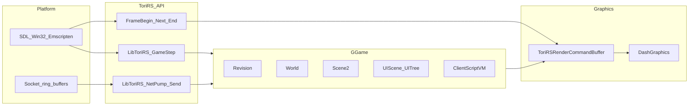

---

## 2. Scene2

### 2.1 Role

[`src/osrs/scene2.h`](src/osrs/scene2.h) / [`scene2.c`](src/osrs/scene2.c): **authoritative runtime state** for 3D scene elements tied to the RS world:

- **Pools**: `Scene2ElementFast*` and `Scene2ElementFull*` arrays; free lists and an intrusive **active list**.
- **Stable IDs**: `scene2_allocate_visual_id`, element acquire/release (`scene2_element_acquire_fast/full`, `scene2_element_release`).
- **Dash resources**: Tables of textures, vertex arrays, face arrays; Scene2 **owns** registered arrays and defers actual `free` until after consumers process **REMOVED** / **UNLOADED** events (`vertex_arrays_deferred_free`, `face_arrays_deferred_free`, `models_deferred_free`).
- **Event ring**: `Scene2Event` types include element acquire/release, model/texture/vertex/face load and unload, **batch** begin/end/clear for world GPU rebuild (`SCENE2_MAX_GPU_BATCHES`), **texture batch** for bulk cache upload, and **animation loaded** for pose upload hints.

### 2.2 Categories

`enum Scene2ElementCategory`: `SCENERY`, `NPC`, `PLAYER`, `PROJECTILE`. These map directly to `ToriRS_UsageHint` in [`tori_rs_render.h`](src/tori_rs_render.h).

### 2.3 Ownership

- **`GGame`**: Allocates `scene2_new(20000, 4000)` in [`LibToriRS_GameNew`](src/tori_rs_init.u.c). Comment in `game.h`: world 3D uses this; textures may register here **before** `World` exists.
- **`World`**: [`world_new`](src/osrs/world.c) takes `struct Scene2* scene2_shared`; stores pointer in `world->scene2` and **never frees** it.

### 2.4 Producer → consumer boundary

[`queue_static_load_scene2_events`](src/tori_rs_frame.u.c) runs inside [`LibToriRS_FrameBegin`](src/tori_rs_frame.u.c):

| Scene2 event | ToriRS command(s) |
|--------------|-------------------|
| `TEXTURE_BATCH_BEGIN/END` | `TORIRS_GFX_BATCH2D_TEX_BEGIN/END` |
| `TEXTURE_LOADED` | `TORIRS_GFX_RES_TEX_LOAD` (texture from `scene2_texture_get`) |
| `BATCH_BEGIN/END/CLEAR` | `TORIRS_GFX_BATCH3D_BEGIN/END/CLEAR` (scenery batch) |
| `ANIMATION_LOADED` | `TORIRS_GFX_RES_ANIM_LOAD` or `TORIRS_GFX_BATCH3D_ANIM_ADD` if `batched` |
| `MODEL_LOADED` | `TORIRS_GFX_RES_MODEL_LOAD` or `TORIRS_GFX_BATCH3D_MODEL_ADD` if `batched` |
| `MODEL_UNLOADED` | `TORIRS_GFX_RES_MODEL_UNLOAD` |

After draining: `scene2_flush_deferred_array_frees(scene2)`.

**Invariant**: Unregister/release paths enqueue deferred frees so GPU backends still see consistent IDs until events are drained.

### 2.5 World and builder integration

- [`src/osrs/world_cycle.u.c`](src/osrs/world_cycle.u.c): Updates entities, then **`scene2_element_at`** to adjust `DashPosition` / yaw for projectiles (and similar paths for players/NPCs).
- [`src/osrs/scenebuilder.u.c`](src/osrs/scenebuilder.u.c): `SceneBuilder` may set `texture_scene2` when loading from buildcachedat so world textures register on the same Scene2 instance.

### Diagram: Scene2 events to GPU commands

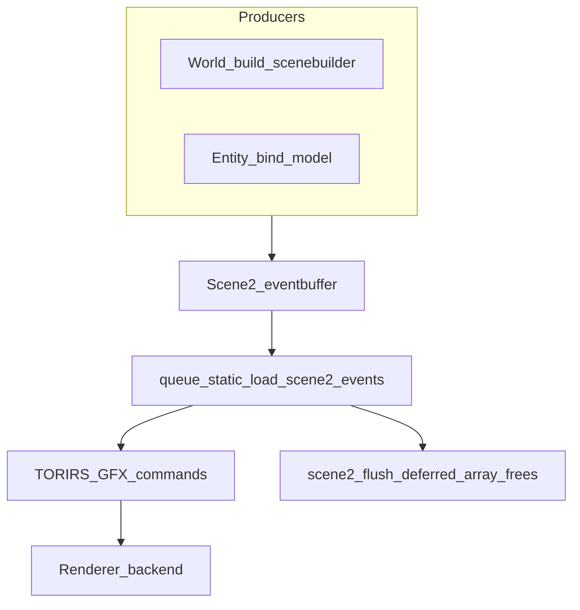

---

## 3. UIScene

### 3.1 Role

[`src/osrs/revconfig/uiscene.h`](src/osrs/revconfig/uiscene.h) / [`uiscene.c`](src/osrs/revconfig/uiscene.c):

- Fixed pool of `UISceneElement` nodes (free list + active list).
- Each element: `dash_sprites` array (owned or borrowed), optional `name[64]` for lookup (`uiscene_sprite_by_name`).
- **Font table**: `fonts[UISCENE_FONT_MAX]`; `uiscene_font_add`.
- **Events**: acquire/release, sprite/font **batch** begin/end (`batch_id` for atlas packing on the consumer side).

### 3.2 Allocation and reset

- Created in [`LibToriRS_GameNew`](src/tori_rs_init.u.c): `uiscene_new(256)`.
- [`lua_ui_reset_uiscene_and_refs`](src/osrs/lua_sidecar/lua_ui.c): Replaces scene with larger capacity (×2, minimum 4096), **transfers fonts out** before `uiscene_free` (ownership), rebuilds font refs on `BuildCacheDat`, reloads component sprites.

### 3.3 Consumption

[`queue_static_load_uiscene_events`](src/tori_rs_frame.u.c):

- `UISCENE_EVENT_ELEMENT_ACQUIRED`: For each sprite in the element, emit `TORIRS_GFX_RES_SPRITE_LOAD`.
- Batch events → `TORIRS_GFX_BATCH2D_SPRITE_BEGIN/END`, `TORIRS_GFX_BATCH2D_FONT_BEGIN/END`.

**Runtime**: Many `uielem_*_step` and [`rs_component_gfx.c`](src/osrs/rs_component_gfx.c) paths append draws to `game->uiscene_queued_commands`. [`LibToriRS_FrameNextCommand`](src/tori_rs_frame.u.c) yields those commands **after** depleting the primary `render_command_buffer` for the current iteration.

### 3.4 Cross-cutting: click cross

[`PlatformImpl2_SDL2_Renderer_Soft3DShared_Render`](src/platforms/platform_impl2_sdl2_renderer_soft3d_shared.cpp): After `LibToriRS_FrameEnd`, if `cross_mode != 0`, blits `uiscene_sprite_by_name(game->ui_scene, "cross", frame_idx)` via `dash2d_blit_sprite` (not necessarily emitted through the main command buffer).

---

## 4. UITree, components, and inventory

### 4.1 `UITree` and `StaticUIComponent`

[`src/osrs/revconfig/uitree.h`](src/osrs/revconfig/uitree.h) / [`uitree.c`](src/osrs/revconfig/uitree.c):

- **Storage**: Growable array `components[]`, `component_count`, `component_capacity`.
- **Tree links**: `parent`, `first_child`, `next_sibling` (`int32_t`, `-1` sentinel), `root_index`, `generation` (bumped on structural changes).
- **Identity**: `component_id` for RS interface id; `type` as `enum StaticUIComponentType`.
- **Layout**: `struct StaticUIElemPosition position` (`UIPOS_XY` or `UIPOS_RELATIVE`).
- **RS-specific unions**: e.g. `rs_inv` with `inv_index`, grid size, margins, `inv_slot_offset_*`, `inv_slot_bg_scene_id` / `atlas_index` for slot chrome in UIScene.

### 4.2 Inventory pool

- `struct UIInventory`: `name[64]`, `items[UI_INVENTORY_MAX_ITEMS]` (`obj_id`, `scene_id` for icon element, `atlas_index`), `item_count`.
- `struct UIInventoryPool`: array of inventories; helpers `uitree_inv_pool_new`, `uitree_inv_pool_find_by_name`, `uitree_inv_pool_append`.
- Owned by `GGame::inv_pool`.

### 4.3 Loading from revconfig

[`src/osrs/revconfig/uitree_load.c`](src/osrs/revconfig/uitree_load.c): Parses INI / revconfig buffers, `uitree_push_*` with **parent index**, links siblings, resolves inventory names to pool indices, loads sidebar children from cache components recursively.

### 4.4 Frame traversal

[`LibToriRS_FrameBegin`](src/tori_rs_frame.u.c):

- `uitree_stack_top = -1`, `uitree_current = ui_root_buffer->root_index` (or `-1`).
- Resets `uiscene_queued_commands`, `uitree_mark_all_dirty(ui_root_buffer)`.
- Syncs world viewport from first `UIELEM_BUILTIN_WORLD` with `UIPOS_XY` via `LibToriRS_GameSetWorldViewportRect` when dimensions differ.

[`LibToriRS_FrameNextCommand`](src/tori_rs_frame.u.c) **interleaving**:

1. If `at_render_command_index < count(render_command_buffer)`: return next **pre-recorded** command (includes Scene2/UIScene static loads from `FrameBegin`, and whatever the platform/game filled into the main buffer).
2. Else if `uiscene_command_idx < uiscene_queued_commands->command_count`: return next **UI-queued** command.
3. Else: reset `uiscene_queued_commands`, advance **one** UITree node step (`uielem_*_step`); RS types call [`rs_gfx_*_step`](src/osrs/rs_component_gfx.c) which only uses UIScene/Scene2 ids and game state — **not** `buildcachedat` in the hot draw path.

**Sidebar**: [`frame_sidebar_tab_active`](src/tori_rs_frame.u.c) — RS subtree under `UIELEM_BUILTIN_SIDEBAR` only when `iface->selected_tab` matches and no modal owns the sidebar (`iface->sidebar_interface_id == -1`).

### 4.5 Interface and ClientScriptVM

[`src/osrs/interface.c`](src/osrs/interface.c), [`interface_state.c`](src/osrs/interface_state.c): Modal/sidebar/tab state, hover ids, open interfaces. Packets and clicks update this state; UITree nodes may set `is_hidden` / dirty flags. Script-driven visibility uses [`clientscript_vm_if_var`](src/osrs/clientscript_vm.c) / [`clientscript_vm_if_active`](src/osrs/clientscript_vm.c) — see §9.

### Diagram: UITree frame interleaving

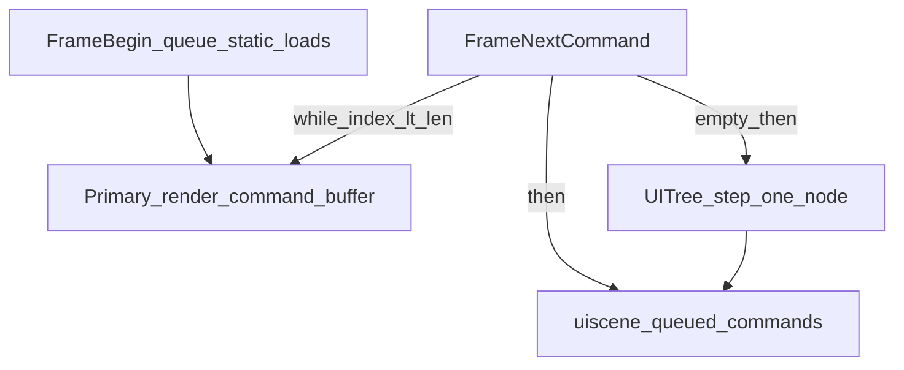

---

## 5. World, building, and cycle

### 5.1 `struct World`

[`src/osrs/world.h`](src/osrs/world.h) / [`world.c`](src/osrs/world.c):

- **Entities**: Vectors for players, NPCs, projectiles, map-build loc/tile entities; parallel `active_*` id lists and counts.
- **Simulation / draw**: `Painter* painter`, `PaintersCullMap* cullmap`, `CollisionMap*`, `Heightmap*`, `Minimap*`.
- **Scene2**: `struct Scene2* scene2` (not freed by `world_free`).
- **Load gate**: `bool load_complete` — `world_cycle` early-outs if false (center-zone rebuild in progress).
- **GPU batch bookkeeping**: `rebuild_current_batch_id`, `rebuild_prev_batch_id` aligned with Scene2 world batch slots.
- **Build-time-only maps**: lightmap, shademap, blendmap, overlaymap, terrain shape, decor, sharelight — used during construction.

### 5.2 `world_cycle`

[`src/osrs/world_cycle.u.c`](src/osrs/world_cycle.u.c) (`world_cycle(world, cycles_elapsed)`):

1. `world_cycle_begin` → `painter_reset_to_static`.
2. Update map-build loc entities, players, NPCs, projectiles.
3. `world_cycle_push_*` — register dynamic draws with the painter and sync Scene2 element transforms.

Called from [`LibToriRS_GameStep`](src/tori_rs_cycle.u.c) when `game->world` is non-NULL.

### 5.3 Building and Lua

- [`buildcachedat_loader.c`](src/osrs/buildcachedat_loader.c): Map terrain/scenery, objects, sequences, interfaces, varp init, etc.
- Lua [`LuaGame_build_scene`](src/osrs/lua_sidecar/lua_game.c) → `buildcachedat_loader_finalize_scene`.
- [`LuaGame_build_scene_centerzone`](src/osrs/lua_sidecar/lua_game.c) → `buildcachedat_loader_finalize_scene_centerzone`.
- [`src/osrs/scripts/rev245_2/lua_cacherev245_2_load.lua`](src/osrs/scripts/rev245_2/lua_cacherev245_2_load.lua): `REBUILD_NORMAL` and related flows request cache data, then call into C to finalize scenes.
- Packet execution: [`gamenet_rev245_2_exec.c`](src/osrs/revs/lc245_2/gamenet_rev245_2_exec.c) (large) — zone updates, entities, interfaces, varps, etc.

### 5.4 Painter → 3D draws

[`LibToriRS_FrameBegin`](src/tori_rs_frame.u.c): If `world->load_complete` and cullmap/painter ready, runs `painter_set_camera_angles`, `painter_set_level_mask` from [`frame_ui_world_level_mask`](src/tori_rs_frame.u.c), then **`painter_paint_bucket`** into `game->sys_painter_buffer`.

[`uielem_world_step`](src/tori_rs_frame.u.c): Iterates `sys_painter_buffer->commands[at_painters_command_index…]`. For `PNTR_CMD_ELEMENT`, resolves `Scene2Element`, camera-subtracts position, `dash3d_project_model` for culling, then emits **`TORIRS_GFX_DRAW_MODEL`** into `uiscene_queued_commands` with animation/framemap from Scene2. Clears world rect with `TORIRS_GFX_STATE_CLEAR_RECT` on first step.

### Diagram: world tick

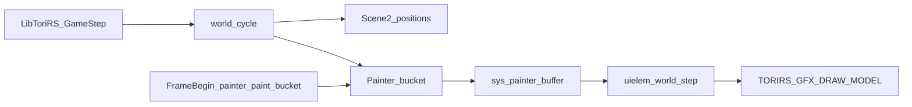

---

## 6. Game init, cycle, and frame

### 6.1 Init

[`LibToriRS_GameNew`](src/tori_rs_init.u.c) (summary):

- `revision_lc245_2_new()` + `revision_set_active`.
- `dash_init()`, `game->sys_dash = dash_new()`, `painter_buffer_new()`.
- Allocates `DashPosition`, `DashViewPort` (world + iface), `DashCamera`.
- **`uiscene_new(256)`**, **`scene2_new(20000, 4000)`**, **`uitree_new(64)`** ×2 (root + stack), **`uitree_inv_pool_new(32)`**, **`clientscript_vm_new()`**.
- `LibToriRS_RenderCommandBufferNew` for `uiscene_queued_commands`, minimap command buffer, etc.
- Pushes **`SCRIPT_INIT`** and **`SCRIPT_INIT_UI`** onto `script_queue` (processed by platform Lua runner).
- RSA, `packet_buffer`, ring buffer `netin`, revision-specific state.

### 6.2 Per-tick order (typical test harness)

Tests such as [`test/sdl2.cpp`](test/sdl2.cpp) use:

1. `LibToriRS_NetPump(game)`
2. `LibToriRS_GameNetProcess(game)`
3. `LibToriRS_GameStep(game, input, render_command_buffer)`

**`LibToriRS_GameNetProcess`** ([`tori_rs_cycle.u.c`](src/tori_rs_cycle.u.c)): `gamenet_process(game)` which, if [`revision_has_pending`](src/osrs/core/revision.c), pushes **`SCRIPT_PKT_DISPATCH`** to `script_queue`. Periodically `gamenet_send_no_timeout` in game state.

**`LibToriRS_GameStep`**: Quit handling, `LibToriRS_GameProcessInput`, `world_cycle`, `dash_animate_textures`, `game->cycle += cycles_elapsed`.

### 6.3 Frame API

- **`LibToriRS_FrameBegin(game, render_command_buffer)`**: Resets command indices, click/tile state, syncs camera from game fields, resets UITree traversal, interface hover, marks UITree dirty, optional viewport sync, `queue_static_load_commands` (Scene2 + UIScene events), painter bucket fill, `world_pickset_reset`, **`LibToriRS_RenderCommandBufferReset(render_command_buffer)`**.

- **`LibToriRS_FrameNextCommand(game, render_command_buffer, command, project_models)`**: Described in §4; sets global `s_frame_project_models` for RS model culling.

- **`LibToriRS_FrameEnd(game)`**: Builds `option_set` from pickset, **`frame_handle_interface_and_world_clicks`** (redstone tab selection, minimap click → `tile_clicked_*` + cross, world viewport click).

### 6.4 Lua script queue

[`Platform2_SDL2_RunLuaScripts`](src/platforms/platform_impl2_sdl2.cpp) (and Emscripten/Win32 variants): While `script_queue` non-empty, `LibToriRS_LuaScriptQueuePop` → `LuaCSidecar_RunScript` with optional **yield/resume** for async `CacheDat` loads (`on_lua_async_call`).

### Diagram: per-frame render pipeline

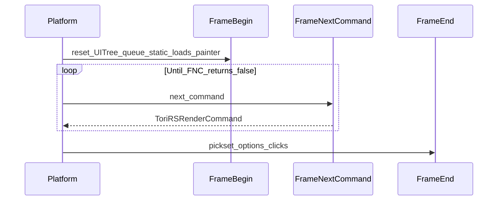

### Diagram: ScriptQueue and Lua sidecar

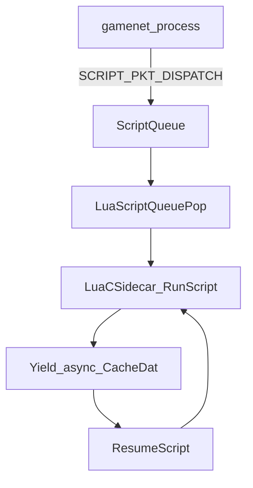

---

## 7. Renderers: Soft3D and WebGL1

### 7.1 Shared contract

Every backend follows:

```text
LibToriRS_FrameBegin(game, render_command_buffer);
while (LibToriRS_FrameNextCommand(game, render_command_buffer, &cmd, project_models)) { /* dispatch cmd.kind */ }
LibToriRS_FrameEnd(game);
```

### 7.2 Soft3D

**Files**: [`platform_impl2_sdl2_renderer_soft3d.cpp`](src/platforms/platform_impl2_sdl2_renderer_soft3d.cpp) → [`platform_impl2_sdl2_renderer_soft3d_shared.cpp`](src/platforms/platform_impl2_sdl2_renderer_soft3d_shared.cpp); Emscripten: [`platform_impl2_emscripten_native_renderer_soft3d.cpp`](src/platforms/platform_impl2_emscripten_native_renderer_soft3d.cpp).

**Characteristics**:

- **CPU raster**: `renderer->pixel_buffer` (ARGB `int*`), sub-rectangle for world via `dash_offset_x/y` and `view_port` clip.
- **`TORIRS_GFX_RES_TEX_LOAD`**: `dash3d_add_texture(sys_dash, id, texture)`.
- **`TORIRS_GFX_DRAW_MODEL`**: Optional `dashmodel_animate`, then `dash3d_raster_projected_model` into viewport pixels.
- **2D**: `TORIRS_GFX_DRAW_SPRITE`, `TORIRS_GFX_DRAW_FONT`, `TORIRS_GFX_STATE_CLEAR_RECT` with `iface_view_port` clipping; RS_LAYER can push/pop clip stack (`soft3d_iface_clip_stack_*` in shared file).
- **Mouse**: `GGame::soft3d_mouse_from_window` and present dst rect — when true, game maps window coords to buffer space (see `game.h`).

### 7.3 WebGL1

**File**: [`platform_impl2_sdl2_renderer_webgl1.cpp`](src/platforms/platform_impl2_sdl2_renderer_webgl1.cpp) (under `__EMSCRIPTEN__` include path in tree).

**Characteristics**:

- SDL GL context (GLES2-style shaders).
- **TRSPK** (`TRSPK_WebGL1_*`) for 3D model/texture caching — GPU-side path vs CPU `dash3d_raster_projected_model`.
- **UI composite**: Software `ui_pixel_buffer` (ARGB) converted to RGBA, uploaded to `ui2d_texture`, **fullscreen quad** with alpha blend (`webgl1_ui2d_composite`) over the 3D framebuffer.
- Same command loop; implementation branches on `cmd.kind` analogous to Soft3D but uses GL draw calls for 3D and the compositor pass for 2D.

### 7.4 Other backends

OpenGL3, D3D8/D3D11, Metal, GDI soft3d follow the same **FrameBegin / FrameNextCommand / FrameEnd** pattern with backend-specific dispatch.

### Diagram: Soft3D vs WebGL1

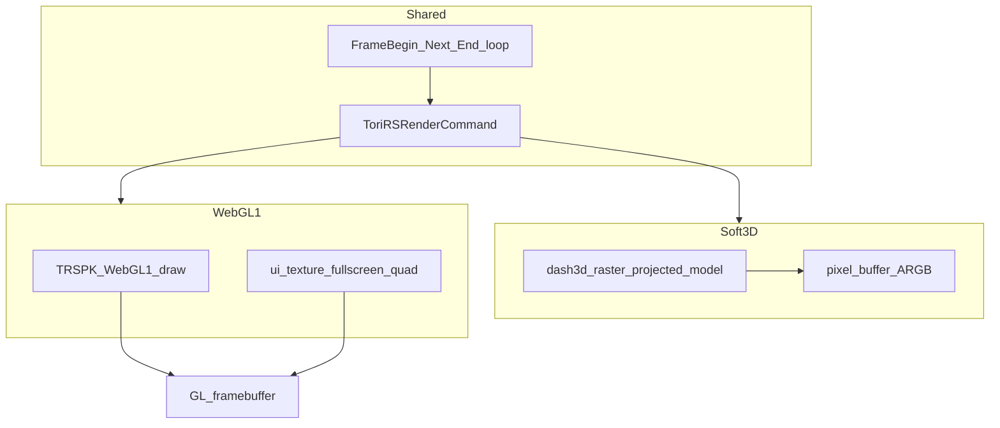

---

## 8. Packets and Lua

### 8.1 Inbound framing and ISAAC

[`packetbuffer_read`](src/osrs/core/packetbuffer.c):

- State machine: `PKTBUF_AWAITING_PACKET` → read opcode byte, **decrypt** with `isaac_next(packetbuffer->random)` (`packet_type = (raw - isaac) & 0xff`).
- Length from [`revision_packetin_size`](src/osrs/core/revision.c) (e.g. `packetin_size_lc245_2`); supports fixed, var-u8, var-u16 payloads.
- Allocates `packetbuffer->data`, accumulates payload; when complete, [`packetbuffer_ready`](src/osrs/core/packetbuffer.h) is true.

[`net_process_packets`](src/tori_rs_net.u.c): Calls [`gamenet_parse(game)`](src/osrs/gamenet_parse.c) which delegates to [`revision_serverprot_parse`](src/osrs/core/revision.c) with opcode + payload.

### 8.2 Parse and enqueue (LC245_2) — four-layer inbound pipeline

```
gamenet_parse → revision_serverprot_parse → serverprot_netrev245_2_parse_and_enqueue
             → serverprot_netrev245_2_parse (opcode switch) → serverprot_core_parse_xxx_v1
             → RevisionLC245_2::pending_head queue
```

[`serverprot_netrev245_2_parse_and_enqueue`](src/osrs/revs/lc245_2/serverprot_netrev245_2_parse.c): `serverprot_netrev245_2_parse` fills `struct RevPacket_LC245_2` (calling `serverprot_core_parse_xxx_v1` pure deserializers for each opcode), then `gameproto_rev245_2_enqueue` appends to **`RevisionLC245_2::pending_head`** linked list.

[`serverprot_core_parse_xxx_v1`](src/osrs/core/serverprot_core_parse.c): Pure byte→struct deserializers. **Zero GGame knowledge.** Stable across any revision sharing the same wire layout.

### 8.3 Game thread: Lua-driven drain

[`gamenet_process`](src/osrs/gamenet_process.c): If `revision_has_pending(&game->revision, game)`, push `struct ScriptArgs { .tag = SCRIPT_PKT_DISPATCH }`.

[`lua_cacherev245_2_load.lua`](src/osrs/scripts/rev245_2/lua_cacherev245_2_load.lua) loop:

```lua
local item, ptype = Game.Game.pop_next_packet()
```

[`LuaGame_pop_next_packet`](src/osrs/lua_sidecar/lua_game.c): **Pops head** off `pending_head`, returns userdata + opcode to Lua.

- Handlers in Lua may prefetch archives, then call C build helpers.
- Fallback: `Game.Game.exec_packet(item)` → [`LuaGame_exec_packet`](src/osrs/lua_sidecar/lua_game.c) → [`gamenet_rev245_2_exec_dispatch_v1`](src/osrs/revs/lc245_2/gamenet_rev245_2_exec.h), frees packet storage.

### 8.4 Bulk C API (not the live drain path)

[`revision_gamenet_exec_drain`](src/osrs/core/revision.c) → [`gameproto_rev245_2_drain_pending`](src/osrs/revs/lc245_2/revision_lc245_2.c): Walks the whole queue in C and runs exec for each. **The running client uses Lua `pop_next_packet` instead**; the bulk API remains for tooling or future wiring.

### 8.5 Outbound — four-layer outbound pipeline

```
gamenet_send_xxx → gamenet_rev245_2_send_xxx → gamenet_core_send_xxx_v1
                → clientprot_send_xxx_v1 (pure serializer) → LibToriRS_NetSend
```

[`gamenet_send_xxx`](src/osrs/gamenet_send.h): Intent layer; typed per-op entry points. Dispatches on `revision_active()->kind`.

[`gamenet_rev245_2_send_xxx`](src/osrs/revs/lc245_2/gamenet_rev245_2_send.c): Net-revision gateway; thin shims to `gamenet_core_send_xxx_v1`.

[`gamenet_core_send_xxx_v1`](src/osrs/core/gamenet_core_send.c): Data hydrator; gathers fields from `GGame`, builds `WireOut_Xxx_v1`, calls `clientprot_send_xxx_v1`.

[`clientprot_send_xxx_v1`](src/osrs/core/clientprot_send.c): Pure serializer. **Zero GGame.** Writes raw encrypted bytes to `RSBuffer` using `rsbuf_p1isaac`.

[`rsbuf_p1isaac`](src/osrs/rscache/rsbuf_isaac.c): Writes opcode as `(opcode + isaac_next(isaac_out)) & 0xff`.

[`LibToriRS_NetSend`](src/tori_rs_net.u.c): Enqueues bytes to the platform **game_to_platform** ring.

### 8.6 Other Lua entry scripts

[`script_convert_to_lua`](src/tori_rs_scripts.u.c): Maps queue tags to filenames; revision-dependent paths from `revision_lua_cacherev_load_path` / `revision_lua_init_ui_path` ([`revision.c`](src/osrs/core/revision.c)).

### Diagram: network ingress

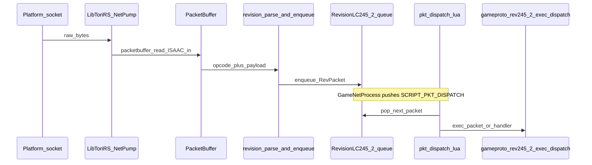

### Diagram: network egress


### Diagram: BuildCacheDat loader phases (simplified)

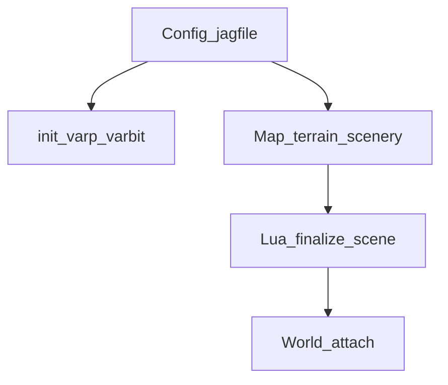

---

## 9. ClientScriptVM, varps, and varbits

### 9.1 Data structures

[`src/osrs/clientscript_vm.h`](src/osrs/clientscript_vm.h):

- `struct VarPType { enum VarClientCodeKind clientcode; }` — from `varp.dat` `clientcode` field.
- `struct VarBitType { int basevar; int startbit; int endbit; }` — bit range **half-open** `[startbit, endbit)` in `var[basevar]`.
- `struct ClientScriptVM`: `varp_types`, `varbit_types`, counts; **`var[]`** client values; **`var_serv[]`** server mirror; `readbit[]` masks; **`dirty_varps[]`** queue (`CLIENT_VM_DIRTY_VARP_QUEUE`); eval stack for bytecode.

### 9.2 Loading

[`buildcachedat_loader_init_varp_varbit`](src/osrs/buildcachedat_loader.c): Calls [`clientscript_vm_load_types`](src/osrs/clientscript_vm.c) when config jagfile is set — runs during `init_cache_dat.lua` to populate both **varp and varbit metadata** before scene finalize.

**Current `clientscript_vm_load_types` behavior**: Locates both `varp.dat` and `varbit.dat`, decodes them via [`cache_dat_config_varp_list_new_decode`](src/osrs/rscache/tables_dat/config_varp.h) and inline RSBuffer parsing. Allocates `varp_types`, `var`, `var_serv`, `varbit_types`, and copies `clientcode` per varp. The varbit decoder parses bytecode opcodes (code 1 = VarBitType entry, code 10 = debug name).

**Status**: Both varp and varbit types **are fully populated** and available to bytecode opcodes **5** (pushvar), **13** (testbit), and **14** (push_varbit).

### 9.3 Setting varp values

| Source | API | Effect |
|--------|-----|--------|
| Server VARP_SMALL / VARP_LARGE | [`gameproto_rev245_2_exec_varp_*`](src/osrs/revs/lc245_2/gameproto_rev245_2_exec.c) → `clientscript_vm_apply_varp_small/large` | `vm_apply_value`: writes `var_serv[id]`, updates `var[id]` if changed, **enqueues dirty** |
| Server VARP sync | `clientscript_vm_apply_varp_sync` | For each index where `var != var_serv`, copy `var_serv` → `var`, enqueue dirty |
| Optimistic UI | `clientscript_vm_set_var_optimistic` | Updates `var[]` only, enqueue dirty; **does not** set `var_serv` |
| Button scripts | [`interface_apply_button_click_varp_optimistic`](src/osrs/interface.c) | Inspects script words: opcode **5** (pushvar) toggle/set varp; **14** (push_varbit) toggle/set bits on base varp **if** `VarBitType` valid |

### 9.4 Reading varbits

[`clientscript_vm_get_varbit`](src/osrs/clientscript_vm.c):

```text
bit_count = endbit - startbit
return (var[basevar] >> startbit) & readbit[bit_count]
```

### 9.5 Bytecode evaluation

[`clientscript_vm_eval`](src/osrs/clientscript_vm.c): Opcodes include **1** `stat_level` (effective/boosted), **2** `stat_base_level` (from XP via `player_stats_xp_to_level`), **3** `stat_xp`, **4** `inv_count`, **5** `pushvar`, **6** `stat_xp_remaining`, **7** scaled var, **13** `testbit` on raw varp, **14** `push_varbit`, **20** constant, **15–17** arithmetic mode. Stat opcodes **1–3** read from `game->player_stat_*` via `vm->game_ref`.

[`clientscript_vm_active`](src/osrs/clientscript_vm.c): For each script, `eval` vs `script_operand[i]` with comparator `script_comparator[i]` (==, !=, &lt;=, &gt;= style encoding).

Legacy shims **`clientscript_vm_if_var`** / **`clientscript_vm_if_active`**: Pull bytecode from `CacheDatConfigComponent` script arrays.

### 9.6 Clientcode drain

[`clientscript_vm_drain_clientcodes`](src/osrs/clientscript_vm.c): For each dirty varp id, `switch (varp_types[id].clientcode)` writes:

- `VAR_CLIENTCODE_BRIGHTNESS` → `game->settings_brightness`
- Music/wave volume, one-mouse, bank arrange → `game->settings_*`
- Chat effects / split private → `game->chat->*` if non-NULL

Then clears `dirty_varp_count`.

**Wiring gap**: Header comment says this should run from `LibToriRS_FrameBegin`; **there is currently no call site** outside `clientscript_vm.c` in the tree. Client settings fields in `GGame` are prepared for this path; integration is **intended but not hooked**.

### Diagram: varp lifecycle

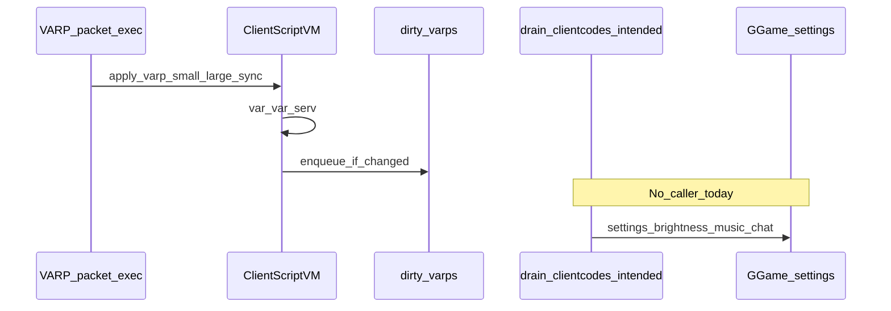

### Diagram: varbit slice

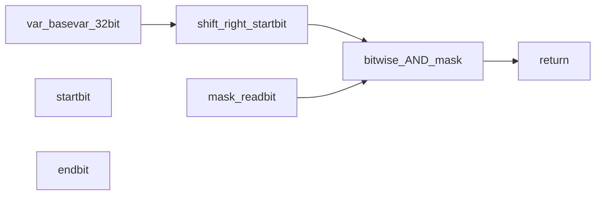

### Diagram: bytecode eval core

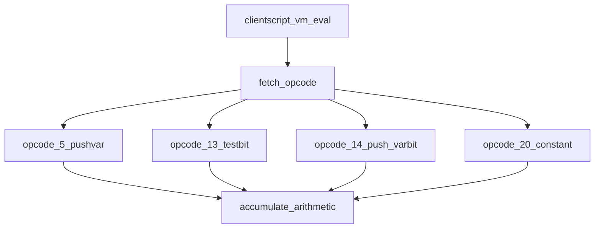

---

## 10. Diagram index

| # | Section | Topic |
|---|---------|--------|
| 1 | §1 | System context (platform → GGame → graphics) |
| 2 | §2 | Scene2 events → `TORIRS_GFX` |
| 3 | §4 | UITree interleaving primary vs `uiscene_queued_commands` |
| 4 | §5 | World tick and painter → world step |
| 5 | §6 | Per-frame sequence (FrameBegin/Next/End) |
| 6 | §6 | ScriptQueue → Lua sidecar yield/resume |
| 7 | §7 | Soft3D vs WebGL1 backends |
| 8 | §8 | Network ingress (ISAAC, parse, Lua) |
| 9 | §8 | Network egress (ISAAC out, send) |
| 10 | §8 | BuildCacheDat loader simplification |
| 11 | §9 | Varp lifecycle + drain gap |
| 12 | §9 | Varbit extraction |
| 13 | §9 | Bytecode eval opcodes |

---

## File reference cheat sheet

| Concern | Primary files |
|---------|----------------|
| Game state | `src/osrs/game.h` |
| Scene2 | `src/osrs/scene2.h`, `scene2.c` |
| UIScene | `src/osrs/revconfig/uiscene.h`, `uiscene.c` |
| UITree | `src/osrs/revconfig/uitree.h`, `uitree.c`, `uitree_load.c` |
| RS draw steps | `src/osrs/rs_component_gfx.c` |
| World | `src/osrs/world.h`, `world.c`, `world_cycle.u.c` |
| Frame | `src/tori_rs_frame.u.c` |
| Cycle / net hook | `src/tori_rs_cycle.u.c`, `gamenet_process.c` |
| Net I/O | `src/tori_rs_net.u.c`, `core/packetbuffer.c` |
| Revision | `src/osrs/core/revision.c`, `revs/lc245_2/*` |
| Client VM | `src/osrs/clientscript_vm.h`, `clientscript_vm.c` |
| Render commands | `src/tori_rs_render.h` |
| Soft3D | `src/platforms/platform_impl2_sdl2_renderer_soft3d_shared.cpp` |
| WebGL1 | `src/platforms/platform_impl2_sdl2_renderer_webgl1.cpp` |
| Lua dispatch | `src/osrs/scripts/rev245_2/lua_cacherev245_2_load.lua`, `lua_sidecar/lua_game.c` |

---

*Generated to match the repository architecture plan. Update this file when subsystems change.*
