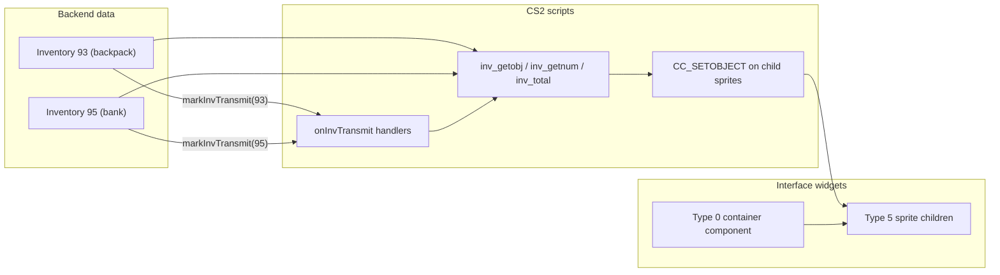

# Containers, Inventories, and CS2

In this codebase, **inventory** and **container** are related but not the same thing. CS2 sits in the middle and connects backend item storage to interface widgets.

## Inventory = backend item storage (by numeric ID)

An **inventory** is a slot array keyed by a global ID. The `Inventory` class (`src/rs/inventory/Inventory.ts`) holds `(slot → itemId, quantity)`.

Well-known IDs in the editor mock store (`containerStore.ts`):

| ID  | Name           |
| --- | -------------- |
| 93  | Backpack       |
| 94  | Equipment      |
| 95  | Bank           |
| 516 | Shop stock     |
| 620 | Collection log |

CS2 reads these with inventory opcodes in `ClientOps.ts`:

- `inv_getobj(invId, slot)` — item ID at slot
- `inv_getnum(invId, slot)` — quantity at slot
- `inv_total(invId, itemId)` — total count of item across slots
- `inv_size(invId)` — slot capacity

`Cs2Vm` resolves `getInventory(invId)` from `context.inventories`. In the interface editor, that map comes from `containerStore.inventories` (wired in `scriptRuntime.ts`).

So when a script does `inv_getobj(93, 5)`, it reads slot 5 of inventory 93.

## “Container” is overloaded — three meanings

### 1. Editor: `ContainerStore` = registry of mock inventories

Despite the name, `ContainerStore` is really an **inventory registry** for script preview. It holds multiple `Inventory` instances and notifies CS2 when one changes.

The **Containers & Inventories** tab edits slot data; changing a slot triggers `markInvTransmit(invId)` so scripts can react.

### 2. UI: type 0 “container” = layout parent widget

A **container widget** is a type **0** (layer) or **11** component that holds children or mounts another interface. This is structural UI, not item storage.

Bank constants illustrate this: `ITEMS_CONTAINER: 9` is a **component** inside interface 12, not inventory 95.

### 3. Game comments: “bank container” = inventory 95

Comments like “bank container updates” in `OsrsClient.ts` mean the **bank inventory data** (ID 95), not a widget.

## How CS2 connects inventory → interface

The flow is **not** a direct widget↔inventory binding in cache data. Scripts wire them at runtime.

### Step 1: Server/client fills inventory data

Example: bank snapshot → `bankInventory.setSlot(...)` → `markInvTransmit(95)`.

`markInvTransmit` (in `TransmitCycles.ts`) bumps `invCycle` and records which inventory ID changed in a circular buffer (`changedInvsBuffer`).

### Step 2: Widgets register `onInvTransmit` handlers

`CC_SETONINVTRANSMIT` / `IF_SETONINVTRANSMIT` attach a script plus optional **trigger inventory IDs** (`invTransmitTriggers`). Signatures ending in `Y` carry those IDs (`Cs2Vm.parseTriggerArgs`).

When `changedInvCount` increases and a changed ID matches a trigger, the handler runs (`scriptRuntime.ts` transmit loop).

Bank is a concrete example: after bank data updates, group 12’s `onInvTransmit` rebuilds the item list from inv 95.

### Step 3: Scripts read inv and update widget display

Typical pattern:

1. `inv_getobj(invId, slot)` / `inv_getnum(...)` — read backend data
2. `CC_SETOBJECT` / `IF_SETOBJECT` — set sprite/model on child components
3. Or init scripts like **`interface_inv_init` (script 149)** that take **both** a component and an inv ID

Shop side panel init (`ShopInterfaceHooks.ts`):

```typescript
initScript: {
    scriptId: SCRIPT_INTERFACE_INV_INIT, // 149
    args: [
        shopInvWidgetUid, // component $component0
        PLAYER_INV_ID,    // inv $inv1 (93)
        4,                // columns
        7,                // rows
        // ...
    ],
}
```

So: **component (UI container) + inv ID (data source)** are passed into the same script.

### Type 2 (inventory) widgets

Type 2 widgets have `itemIds[]` / `itemQuantities[]` for display state, CS1, and hit testing — but the GL renderer does **not** draw a slot grid from those arrays; scripts populate child sprites (`widgets-gl.ts`).

## How the interface editor models this

| Editor feature                          | What it does                                                                                |
| --------------------------------------- | ------------------------------------------------------------------------------------------- |
| **Containers tab**                      | Edits mock `Inventory` slot data (IDs 93, 95, etc.)                                         |
| **`previewInvId` on type 2**            | Copies inventory slots into `widget.itemIds` for canvas preview (editor-only; not real CS2) |
| **`invTransmitTriggers` in Properties** | Edits which inv IDs fire `onInvTransmit`                                                    |
| **Run scripts**                         | Runs `onLoad` / transmits so scripts can call `inv_getobj` and refresh widgets              |

`syncPreviewInventory` in `PropertiesPanel.tsx` copies `containerStore` slots into a type 2 widget’s `itemIds` / `itemQuantities` arrays for visual preview.

## Mental model



**Short answer:** An **inventory** is numbered slot storage CS2 reads with `inv_*` opcodes. A **container** in UI terms is usually a parent component (type 0) that holds item sprites; in editor/server wording it sometimes means the inventory data itself. CS2 bridges them by running scripts on inventory changes (`onInvTransmit`) that read `inv_getobj` and push results into widgets via `CC_SETOBJECT` and similar ops.

## Key files

| File                               | Role                                          |
| ---------------------------------- | --------------------------------------------- |
| `containerStore.ts`                | Mock inventory registry for editor preview    |
| `scriptRuntime.ts`                 | Wires inventories into Cs2Vm; transmit loop   |
| `PropertiesPanel.tsx`              | `previewInvId`, `invTransmitTriggers` editing |
| `ContainersInventoriesPanel.tsx`   | Slot editor UI                                |
| `src/rs/cs2/handlers/ClientOps.ts` | `inv_*` opcode handlers                       |
| `src/rs/cs2/Cs2Vm.ts`              | `onInvTransmit` trigger registration          |
| `src/client/TransmitCycles.ts`     | `markInvTransmit` cycle tracking              |
