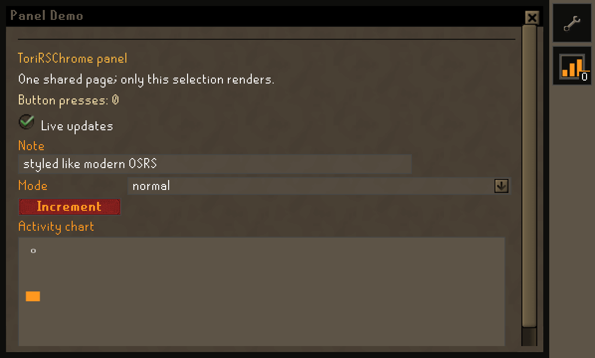
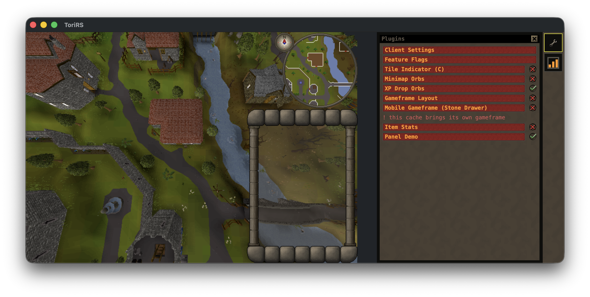
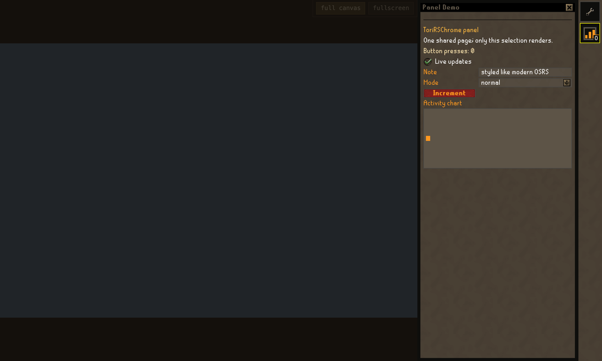
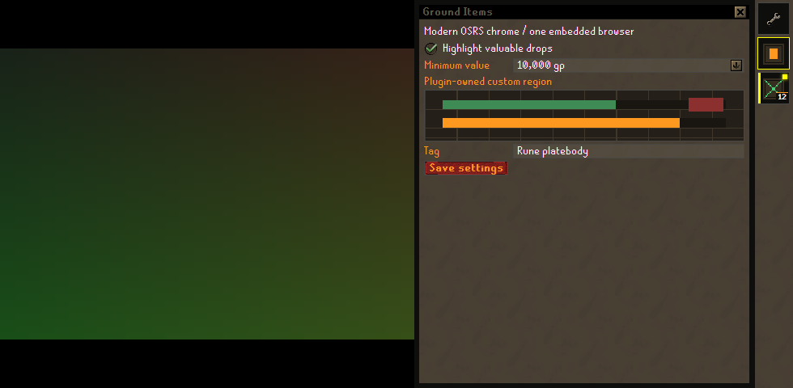

# Plugin chrome plan

## Decision

ToriRS has one application-owned plugin chrome browser for the entire client.
It is not one browser, tab, window, or document per plugin.

The browser contains two retained regions:

1. a narrow rail that remains visible while collapsed; and
2. one page slot that contains only the most recently selected plugin page.

Selecting an inactive rail icon expands the shared page slot. Selecting the
active icon again, pressing Close, Back, or Escape collapses it. Selecting a
different icon replaces the one page subtree in place. Nonselected plugins
have no mounted page DOM and receive no page input or draw callbacks.

The browser is embedded in the existing application window wherever the host
can do so, matching RuneLite's game-plus-sidebar behavior. It is created once,
survives selection and collapse, and is destroyed only with the application
window. The game and plugin page never overlap: wide layouts use a split;
compact layouts temporarily give the browser the content area and restore the
game on collapse.

The browser document is application code. Plugins provide a semantic retained
tree and an authored icon; they cannot provide HTML, CSS, JavaScript, URLs,
native views, browser settings, or navigation.

The retired framework-View, USER32/GDI, and SDL-raster prototype is preserved
in [`old/plugin_chrome_native/`](../old/plugin_chrome_native/README.md). It is
not a production build input.

## Non-negotiable invariants

- Exactly one browser instance and one rail exist per client.
- At most one plugin page is mounted and rendered.
- The rail remains usable when the page is collapsed.
- The active page is the most recently selected rail destination.
- A plugin never branches on Android, web, macOS, Windows, or browser engine.
- Plugin chrome occupies host layout space; it does not cover the game canvas.
- Plugins submit bounded semantic state. They never submit executable browser
  content.
- The model is authoritative. The browser is a projection that emits intents,
  not a second owner of plugin state.
- Quiet retained state does no tree rebuild, JSON transfer, or bitmap upload.
- Selection generation, page generation, and widget serial are checked again
  before an event can invoke plugin code.

## RuneLite precedent

RuneLite's useful precedent is its window behavior, not its dark Swing theme.
`ClientUI` owns one top-level frame containing the game and shared sidebar. A
plugin registers a `NavigationButton` with an icon and a `PluginPanel`.
Changing selection swaps the visible panel in that shared region; toggling the
sidebar revalidates the same frame. Its keep-game-size mode grows the frame by
the sidebar width when possible and otherwise gives the sidebar existing
client space.

ToriRS adopts those mechanics:

- one top-level application window;
- a persistent icon rail;
- one selected page;
- expand/collapse without creating another plugin window; and
- grow-or-fit layout that never paints the panel into the game framebuffer.

ToriRS deliberately uses the modern Old School/ToriRSChrome visual language
instead of RuneLite's Swing styling.

Primary RuneLite sources:

- [`ClientUI`](https://github.com/runelite/runelite/blob/master/runelite-client/src/main/java/net/runelite/client/ui/ClientUI.java)
- [`PluginPanel`](https://github.com/runelite/runelite/blob/master/runelite-client/src/main/java/net/runelite/client/ui/PluginPanel.java)
- [Representative `NavigationButton` registration](https://github.com/runelite/runelite/blob/master/runelite-client/src/main/java/net/runelite/client/plugins/kourendlibrary/KourendLibraryPlugin.java)

## Shell behavior

```text
collapsed

+-----------------------------------------------+------+
|                 game presentation             | rail |
+-----------------------------------------------+------+

expanded split

+----------------------------+------------------+------+
|        game presentation   | selected page    | rail |
|                            | (one plugin only)| icons|
+----------------------------+------------------+------+

expanded compact/exclusive

+-----------------------------------------------+------+
|          selected page (game hidden)          | rail |
+-----------------------------------------------+------+
```

The rail is the trailing/rightmost region, as in RuneLite. The expanded page
sits immediately to its left. A wide desktop window normally grows by the page
width so the game retains its previous presentation size. A maximized or
constrained window may instead reduce the game allocation. On a phone-sized
allocation the page becomes exclusive rather than squeezing or obscuring the
game.

The permanent Manage Plugins destination lives in this same rail and uses the
same sole page slot. It is not a second settings window.

Back/Escape order is:

1. dismiss an IME or page-local transient control;
2. collapse the selected page; then
3. return later Back/Escape input to the game.

## Architecture

```text
plugin API calls
      |
      v
PluginHost retained page model ---- application-owned rail registry
      |                                      |
      +------------ copied snapshot/delta ---+
                             |
                             v
                 protocol-1 browser executor
                             |
              UI-thread bounded message queue
                             |
                             v
        one local ToriRSPluginChrome reducer + retained DOM
                             |
                 copied, generation-fenced intents
                             |
                             v
                       PluginHost model
```

The platform-neutral pieces are:

- [`src/plugin/torirs_plugin_host.c`](../src/plugin/torirs_plugin_host.c): plugin
  registration, selection, lifecycle, icons, and page state;
- [`src/ui/uitree_debug_overlay.c`](../src/ui/uitree_debug_overlay.c): the
  authoritative retained ToriRSChrome widget model;
- [`src/ui/torirs_chrome_exec.h`](../src/ui/torirs_chrome_exec.h): copied POD
  commands and idempotent intents;
- [`src/ui/torirs_chrome_rail.c`](../src/ui/torirs_chrome_rail.c): one copied
  application rail snapshot; and
- [`src/plugin_chrome/HOST_BRIDGE.md`](../src/plugin_chrome/HOST_BRIDGE.md): the
  versioned browser protocol.

The application-owned bundle is [`src/plugin_chrome/`](../src/plugin_chrome/).
`modern.html` is used by current engines. `legacy-ie8.html` uses the same
retained reducer compiled to the older language/DOM baseline and a table plus
absolute-position layout. Both consume the same protocol and skin assets.

### Retained update contract

The native model keeps stable panel handles, widget handles, and widget
serials. Its executor shadow emits only differences:

- `page.snapshot` atomically replaces the sole selected page;
- `page.delta` mutates retained controls in place;
- `page.close` clears page controls but leaves the browser and rail alive;
- `rail.snapshot` replaces copied navigation metadata;
- `rail.icon` updates one revisioned icon;
- `theme` publishes local application-owned skin URLs; and
- `custom.bitmap` replaces one dirty custom-region bitmap.

The reducer mutates existing nodes for text, checked state, selection, focus,
labels, and options. It rebuilds the page only for a new page generation and
rebuilds one widget only when its serial changes. A settled frame is an O(1)
no-op at the native model and sends no browser message.

Browser output is similarly semantic:

- `rail.select` carries the displayed selection generation;
- `widget.intent` carries page generation and widget serial;
- `layout` reports neutral allocated size, scale, size class, visibility, and
  whether the game is concurrently visible; and
- `editor.focus` transfers keyboard/IME ownership without exposing a platform.

Every queue is bounded and nonblocking. Layout and newer bitmap state may be
coalesced. Ordered activations and selections may not be silently reordered.

## Plugin authoring surface

A plugin declares metadata and builds semantic rows. A typical Lua page is:

```lua
plugin.panel.register({
  title = "Loot Tracker",
  icon_asset = "loot.png",
  preferred_width = 320
})

function on_ui_build(ui)
  ui:label("summary", "Kills: 12")
  ui:checkbox("notify", "Notify on unique", true)
  ui:dropdown("mode", "Display", { "compact", "normal" }, 2)
  ui:button("reset", "Reset")
  ui:custom("chart", "Activity", 120)
end
```

The plugin receives semantic events addressed by its own string ID. It can
respond to neutral layout facts, but it never sees a `WebView`, DOM node,
`WKWebView`, `HWND`, or MSHTML interface.

Supported retained widget kinds are label, checkbox, text input, textarea,
separator, menu item, dropdown, model placeholder, button, tab strip, list
row, color picker, and bounded custom bitmap region.

### Authored rail icons

`icon_asset` is resolved inside that plugin's asset sandbox. The host accepts a
decoded PNG no larger than 64×64 pixels and 256 KiB encoded. It copies pixels,
keys them by host revision, and uses the baked wrench when loading fails.
Plugins cannot set a remote URL, path outside their asset root, SVG script, or
live image object.

The demo in [`script/plugins/_paneldemo.lua`](../script/plugins/_paneldemo.lua)
exercises an authored icon, retained controls, live updates, and a custom
region.

## ToriRSChrome visual contract

The DOM is not merely brown around browser-default controls. Its geometry and
art come from the same ToriRSChrome contract used by the client:
[`src/ui/torirs_chrome_metrics.h`](../src/ui/torirs_chrome_metrics.h) and
[`res/plugin_chrome/skin/`](../res/plugin_chrome/skin/).

At 1× the important authored values are:

| Element | Value |
|---|---:|
| Content padding | 6 px |
| Row height / gap | 18 px / 3 px |
| Label column | 104 px |
| Tick/cross checkbox | 17 px |
| Square checkbox | 18 px |
| Tab height | 20 px |
| Scrollbar and arrows | 16 px |
| Frame rail / corner | 6 px / 32 px |
| Field inset / text padding | 2 px / 4 px |
| Default custom region | 120 px |

Device pixel ratio scales this authored grid; platforms do not invent another
set of proportions. Compact touch mode may increase the hit area around a
control without stretching its baked art.

Required styling includes:

- tiled `PanelBody` and `DropdownBody` surfaces;
- the eight-piece OSRS frame rather than a generic rounded card;
- actual `CheckOn`/`CheckOff` or square check art, with native checkbox
  appearance removed on capable engines;
- three-piece `ButtonLeft`/`ButtonMid`/`ButtonRight` controls;
- baked dropdown and scrollbar arrows, track, and grip;
- the baked close control; and
- pixel-preserving authored plugin icons and custom-region images.

The browser typography is also derived from the cache bake rather than a
lookalike system font. [`res/plugin_chrome/font/`](../res/plugin_chrome/font/README.md)
contains Body/p12 and Menu/b12 at 12px with a 16px line box, plus the 10px
Small face used by badges. Each nonzero baked mask pixel becomes an
integer-aligned outline cell and every baked advance is preserved. WOFF with a
TTF fallback serves current engines; EOT Classic with a `file:///` root string
serves XP/IE8. Text therefore remains selectable, editable, searchable, and
accessible instead of becoming canvas or sprite text. The checked-in
[`tools/torirs_chrome_fonts.py`](../tools/torirs_chrome_fonts.py) generator and
font manifest make the conversion reproducible.

Fallback color is still complete if an optional sprite cannot load, but a
supported packaged build must ship the skin. System-default green checkboxes,
rounded Material controls, generic macOS selects, or a 32-pixel web-form row
are visual regressions.

## Platform hosts

| Host | One-browser implementation | Layout behavior | Bundle |
|---|---|---|---|
| Android | Framework `android.webkit.WebView` in `PluginChromeLayout` | 46dp rail; split when enough width exists; otherwise exclusive | Explicit Chrome-39-compatible legacy layout |
| Web | One persistent application-owned iframe shared by every plugin | Normal-flow split; exclusive under compact breakpoint | Modern reducer/assets |
| macOS | One `WKWebView` subview in SDL's Cocoa `NSWindow` | Window grows/contracts around game + page + rail | Modern bundle staged to a private local directory |
| Windows 10/11 | One WebView2 controller in a child region of the existing HWND | D3D9/GDI game rectangle excludes page + rail | Modern local bundle |
| Windows XP | One `IWebBrowser2`/MSHTML ActiveX control in that same child region | Same one-HWND page/rail allocation | IE-compatible legacy bundle |

Linux implementation and capture are intentionally deferred by the user's
“do not worry about Linux” direction. The intended host is one WebKitGTK child
using this same browser seam and protocol, not revival of the SDL raster
presenter.

### Android

[`PluginChromePresenter.java`](../android/src/main/java/com/torirs/client/PluginChromePresenter.java)
owns exactly one WebView for the Activity lifetime. It loads only
`file:///android_asset/plugin_chrome/legacy-ie8.html`. The physical validation
device is API 22 with Chrome 39, so Android cannot depend on CSS Grid, modern
JavaScript syntax, `Map`, pointer events, or current DOM conveniences.

The compatibility page therefore uses ES3/ES5-era output, explicit event
properties, fixed/table layout, and feature-tested canvas. It still renders the
same retained tree and ToriRSChrome assets. A typed `ToriRSAndroid` bridge
copies intents to JNI; all Java UI changes happen on the UI thread while the
native frame thread only exchanges bounded arrays.

Network loads, multiple windows, universal file access, external navigation,
mixed content, storage, and JavaScript-opened windows are disabled. The bundle
is copied into APK assets by `syncPluginChromeBundle`.

### Web

The web build has no native WebView API, so it uses one persistent
application-owned sandboxed iframe as the equivalent browser context. That
iframe is shared by every plugin and contains the canonical document/reducer.
Its mount participates in flex/layout flow beside the game canvas, so it cannot
cover the canvas. The wasm frame loop sends copied semantic batches and polls
copied intents; it never waits on layout or JavaScript.

Only one mount exists even if 32 plugins register icons. Switching selection
replaces the active page state inside it.

### macOS

[`platform_macos_webview.m`](../src/platform/platform_macos_webview.m) obtains
SDL's Cocoa `NSWindow` and hosts one `WKWebView` in a borderless child
`NSWindow` attached to it (`addChildWindow:ordered:`), aligned to the trailing
allocation. It is deliberately not a subview of SDL's content view: a
layer-backed WKWebView inside that view makes the whole window share one layer
tree and one CATransaction commit, and SDL's present becomes coupled to
WebKit's commits. A child window moves with its parent and reads as attached,
but the WindowServer composites it as its own surface, so the game's present
cadence stays its own. SDL continues to own the main window, its events and
the game renderer; the game viewport excludes the chrome allocation; no second
GL context is created. `TORIRS_SWAP_DEBUG=1` prints the present cadence over
300 presents on this lane, the same readout Android's EGL path prints.

The host uses a nonpersistent website data store, a local copied bundle,
navigation/UI delegates that refuse external and new-window requests, a
bounded script-message queue, and revisioned local PNGs for custom regions and
authored icons. The hidden SDL chrome texture is not allocated or composited
on this lane.

### Modern Windows

The raw Win32 host creates one child container inside its existing top-level
HWND. [`platform_win32_webview2.c`](../src/platform/platform_win32_webview2.c)
creates one WebView2 controller in that container and keeps it across page
collapse. D3D9 and the software presenter use the published game client size,
so neither draws under the browser.

Navigation, popups, permissions, downloads, context menus, devtools, and
external resources are rejected. The distribution stages the canonical bundle
and the architecture-matching `WebView2Loader.dll`; the evergreen WebView2
runtime remains a host prerequisite.

### Windows XP

Windows XP has no WebView2. [`platform_win32_mshtml.c`](../src/platform/platform_win32_mshtml.c)
hosts the OS `IWebBrowser2`/MSHTML ActiveX control in the same child allocation
and loads `legacy-ie8.html`.

The legacy document requests IE8 standards when IE8 is installed, while its
critical path remains safe for older XP Trident:

- no arrow functions, template literals, `const`, `let`, classes, modules,
  promises, `Map`, `querySelector`, or `addEventListener` dependency;
- an application-owned ES3 JSON codec instead of assuming native `JSON`;
- `attachEvent`/DOM-0 event wiring and table/absolute layout;
- no CSS Grid, Flexbox, variables, transforms, or `calc()` requirement;
- local image URLs for icons/custom regions because IE has no canvas/data-URL
  path suitable for this contract; and
- `AlphaImageLoader` treatment for transparent PNGs where old Trident needs
  it.

`IDocHostUIHandler` disables context menus and exposes only the copied
`window.external.postMessage` bridge. The host forwards ActiveX keyboard
accelerators so focus, caret movement, and IME editing remain usable.

## Performance rules

- Construct one browser only; never construct on plugin selection.
- Keep the rail and reducer resident across collapse.
- Use one atomic batch per native sync, not one JavaScript call per property.
- Do nothing on a clean retained generation.
- Keep DOM lookup O(1) by stable handle maps.
- Mutate controls rather than replacing focused fields.
- Rasterize and transfer custom regions only when dirty.
- Cache theme sprites and rail icons by revision.
- Bound command, intent, icon, script, and bitmap queues.
- Never make the game/render thread wait on a browser/UI thread.
- Pause page-visible plugin work when compact exclusive mode reports that the
  game is not visible.
- When exclusive mode takes the game's surface, the client stops drawing:
  `PlatformWindow_CanPresent` answers false without a surface and the frame
  loop skips `App_Render` and the present while the world and network keep
  ticking. Measured on the API 22 phone before this gate, the frame thread
  went on painting the hidden world at ~0.6 of a core for as long as a page
  was up (see `docs/android_architecture.md`, plugin chrome cost).

One browser has a higher fixed cost than the retired immediate/native
prototype, but that cost is paid once for all plugins. Retained deltas, no
network stack use, no per-plugin document, and no quiet-frame transfer keep the
steady-state cost small and predictable.

## Security and failure behavior

The trusted boundary is host bundle plus native bridge. A plugin can only
submit validated semantic data.

- All documents and images resolve from packaged/staged local roots.
- No plugin string becomes markup; labels use text nodes/`innerText`.
- CSP rejects network, frames, objects, workers, media, and form submission.
- Hosts independently reject navigation, new windows, downloads, permissions,
  context menus, and external schemes.
- Text, option counts, entry counts, image dimensions, pixel counts, and queue
  lengths have hard caps.
- Icon and custom pixels are copied before plugin memory can be reused.
- Old selection generations and recycled widget serials are dropped both at
  the browser boundary and again on the frame thread.
- A failed browser startup leaves the game functional and reports the missing
  host prerequisite. It must not revive an overlay that covers the game.

## Packaging

Every platform package contains the same canonical files and skin revision.
Hosts select the entry document explicitly; user-agent sniffing does not choose
the compatibility path.

- Android copies the bundle into APK assets.
- Web copies it beside the wasm host resources.
- macOS stages it from the application resources/executable-relative tree into
  a private local directory that can also hold revisioned bitmap files.
- Windows stages it beside/under the distribution and copies it to a private
  writable local directory for revisioned bitmaps.
- Modern Windows also stages `WebView2Loader.dll` for the target architecture.
- XP never receives or attempts to parse the modern entry document.

## Verification plan

Automated gates must cover:

1. retained model snapshots/deltas and O(1) clean sync;
2. one rail, selection replacement, collapse/reopen, and generation advance;
3. authored icon sandboxing, size caps, revisions, and fallback;
4. every widget kind and stable editor focus/caret;
5. custom dirty frames and stale generation/serial/out-of-bounds rejection;
6. modern and legacy reducer behavior parity;
7. an explicit legacy syntax/DOM/CSS compatibility gate;
8. bounded overflow behavior without partial transaction application;
9. Android Back/IME order and UI-thread handoff;
10. macOS resize/collapse with software and GL game presenters;
11. WebView2 and MSHTML navigation/security policy;
12. XP subsystem/import checks; and
13. real runtime screenshots, never mock/reference renders.

Primary commands include:

```sh
make -C src test-uitree test-plugin-host
make -C src test-chrome-browser-exec test-chrome-android-exec
make -C src test-web-channel
make -C src all
cd android && ./gradlew assembleDebug lintDebug
```

Windows adds `test-win32-platform`, XP import/subsystem inspection, and the real
browser capture target. A real Android run must be performed on the API-22
armeabi-v7a device, not only an emulator.

## Real runtime captures

These are captures from the named production host, not drawings or reference
mockups.

### Android 5.1 / API 22 / Chrome 39 WebView

The attached Motorola XT1060 runs the packaged compatibility page in the one
real Activity WebView. Android's SurfaceFlinger screenshot omits this old
hardware-composited layer, so the image was captured directly from that live
WebView through its device debugging endpoint.

[Open full Android capture](../res/plugin_chrome/screenshots/android-webview-expanded.png)



### macOS / WKWebView

The local client is running the real game plus the one embedded WKWebView in
its SDL/Cocoa window.

[Open full macOS capture](../res/plugin_chrome/screenshots/macos-wkwebview-expanded.png)



### Web / Chrome

This is the actual WebAssembly client page in Chrome with its single persistent
canonical-bundle iframe expanded. The game cache did not finish booting in the
headless capture profile, so its reserved game region is blank; the rail/page,
font loads, semantic model, authored icon, and custom bitmap are live runtime
output rather than a mock fixture.

[Open full web capture](../res/plugin_chrome/screenshots/web-chrome-expanded.png)



### Windows / WebView2

The authorized WireGuard Windows host runs the real attached WebView2 backend,
production protocol executor, converted cache fonts, authored icons, and custom
region. The capture target composes WebView2's `CapturePreview` with the actual
main-child allocation; it is not a design reference render.

[Open full Windows capture](../res/plugin_chrome/screenshots/windows-webview-expanded.png)



Linux is omitted by explicit request.

## Acceptance criteria

The work is complete when:

- one browser object serves every registered plugin on each in-scope host;
- the rail remains present and functional while collapsed;
- only the last-selected plugin page renders;
- switching, collapsing, reopening, focus, IME, and custom input preserve the
  generation/serial fences;
- plugin-authored icons display from sandboxed assets;
- the page uses exact ToriRSChrome metrics and baked controls rather than
  browser-default styling;
- Android, Web, macOS, modern Windows, and Windows XP use the same semantic
  protocol, with the explicit compatibility entry only where needed;
- all packages carry their required local bundle/runtime files;
- the automated gates pass; and
- real Android, web, macOS, and Windows screenshots are stored under
  `res/plugin_chrome/screenshots/` and linked above.
