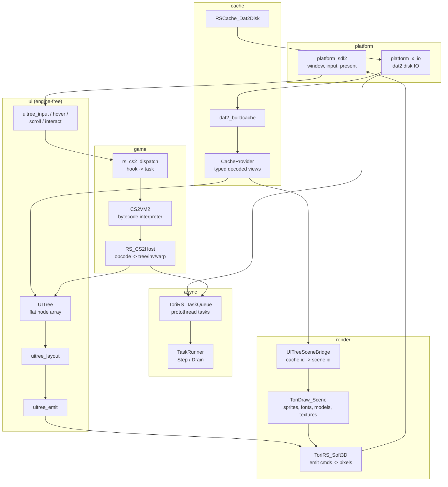
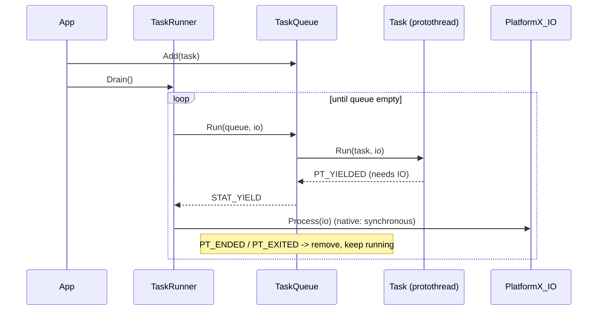
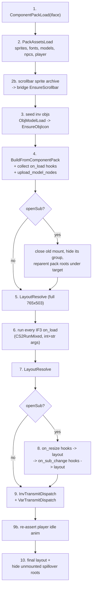
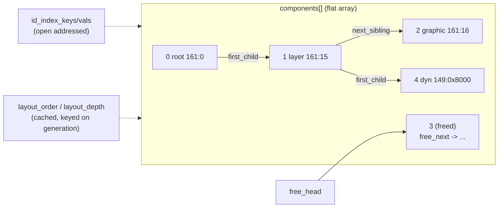
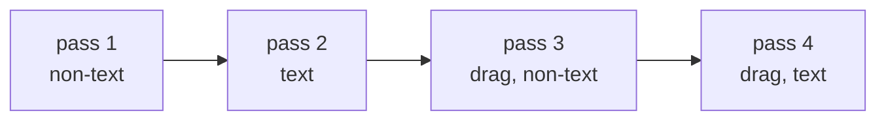
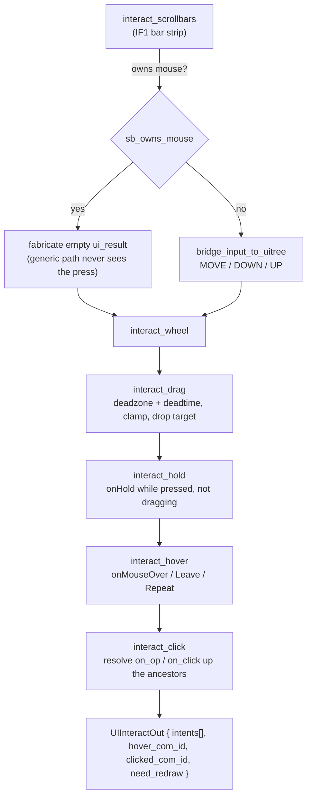
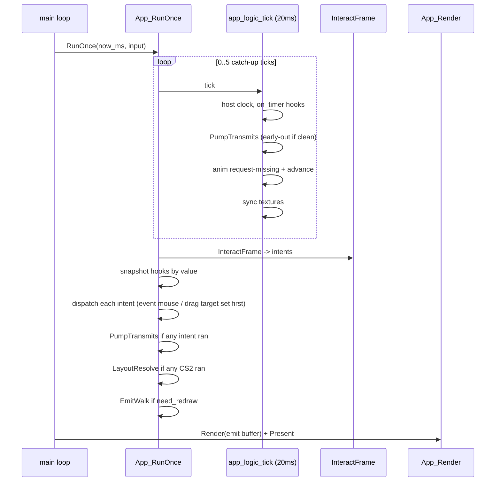

# UI Renderer — Architecture and Traps

How a complicated, interactive RS interface gets loaded, laid out, drawn, clicked,
and scripted — and the specific things that were wrong along the way.

This document covers the **live interface path**: `main.c` → `App` → `InterfaceOpen`
→ `UITree` → emit → Soft3D, with CS2 scripts driving mutation. For the RevConfig
chrome-bake path and the per-struct field reference, see [src/ui/README.md](src/ui/README.md).

**Contents**

1. [Module map](#1-module-map)
2. [Loading an interface](#2-loading-an-interface)
3. [The tree](#3-the-tree)
4. [Layout](#4-layout)
5. [Emit and render](#5-emit-and-render)
6. [Input and interaction](#6-input-and-interaction)
7. [Scripts](#7-scripts)
8. [The frame](#8-the-frame)
9. [Traps](#9-traps) ← the fixes
10. [Debug switches](#10-debug-switches)

---

## 1. Module map



The hard rule that shapes everything: **`src/ui/` knows nothing about the cache,
the renderer, or the VM.** Nodes store integers (`scene_id`, `font_id`,
`gamecache_model_id`); the [scene bridge](src/engine/uitree_scene_bridge.c) is the
only thing that maps a cache id to a scene id. That is why `UITree` can be unit
tested with golden emit dumps ([src/ui/test/](src/ui/test/)) and why the emit
buffer is a POD command list rather than draw calls.

### Async model

Everything that touches disk is a **protothread task**
([src/asyncio.h](src/asyncio.h)). A task is a `struct` with a `struct pt` and a
`Run(task, io)` function; `TASK_AWAITSELF_IF(CreateTask_X(...))` spawns a child
task and resumes at that line when it finishes.



Two consequences that bite:

- **Any local that must survive an await lives in the task struct** (`self->i`,
  `self->script_id`), never on the C stack.
- **Protothreads cannot nest a `switch`.** `Task_CS2Run` therefore *plans* the
  yield in a flat helper (`task_cs2_plan_yield`) and then runs a linear `if/else
  if` chain of awaits — see [task_cs2_run.c:784](src/game/task_cs2_run.c#L784).

---

## 2. Loading an interface

`App_Init` builds the world in five ordered phases
([app.c:109](src/app.c#L109)) — the order is a dependency chain, not style:

| Phase | Creates | Needs |
|---|---|---|
| 1 | `TaskRunner`, `Dat2Disk`, `PlatformX_IO` | — |
| 2 | build cache, `CacheProvider` | disk |
| 3 | `ToriDraw_Scene`, `UITreeSceneBridge` | scene + provider |
| 4 | `UITree`, `InvManager`, `VarPManager`, `RS_CS2Host` | tree + provider + invs |
| 5 | emit buffer, `UITreeHost`, `UIInteraction` | scene bridge (scrollbar sprites) |

Then `App_OpenRootInterface(app, id)` queues one `CreateTask_InterfaceOpen` and
drains. Any group can be the root — there is no hardcoded 161 chrome.

### `CreateTask_InterfaceOpen` — the ten steps

[src/engine/uitree_builder/task_interface_open.c](src/engine/uitree_builder/task_interface_open.c)



The pack itself decodes cache → POD → tree through an engine-free seam:

```
RSCache_Dat2Component            (raw, revision-specific decode)
  -> ToriRS_Component            (torirs_component_from_rscache.c)
  -> UIBuildComponent            (uitree_build.h — no engine headers)
  -> UITreeNodeSpec -> UITree_Push
```

`UITree_BuildFromSource` runs **two passes**: insert every node (initially as a
root), then `UITree_Reparent` by `parent_id`. That is what makes forward parent
references in packs work.

Scene binding happens through resolve callbacks passed into the build
(`open_resolve_sprite` / `open_resolve_font`), which call
`UITreeSceneBridge_EnsureSprite/EnsureFont`. Models are uploaded in a second sweep
(`upload_model_nodes`) because a model widget with `modelId < 0` and
`clientCode 327/328` means *composite the local player*, not *load model -1*.

### Runtime growth

The tree is not static after open. A CS2 script can reference a widget in a group
that was never loaded (interface 100's search button pokes chatbox `162:36`). The
host yields, `Task_CS2Run` loads **and bakes** that pack mid-script
(`task_cs2_bake_pack`, [task_cs2_run.c:196](src/game/task_cs2_run.c#L196)), mounts
its root under the referencing parent if it belongs to a different group,
re-resolves layout, uploads models — then re-enters the same opcode.

---

## 3. The tree

`UITree` is a flat, index-linked forest ([src/ui/uitree.h](src/ui/uitree.h)).



| Concern | Mechanism |
|---|---|
| Identity | `component_id` = packed `(group << 16) | child`. Dynamic (CC_CREATE) children get ids `>= 0x8000` in the low half |
| Topology | `parent` / `first_child` / `next_sibling` indices; roots chained from `root_index`, with `last_root_index` for O(1) append |
| Deletion | `freed` flag + `free_next` free-list; slots and uids are recycled |
| Lookup | `UITree_FindByComponentId` — hashed `id -> index` map, rebuilt on `id_generation` |
| Structure churn | `generation` bumps on any topology change (invalidates the layout order cache) |
| Layout staleness | `layout_stale` — lets CS2 getters JIT re-resolve mid-script |
| Sub-interfaces | `interface_parents[]` — mount table, `(container_uid, group_id, type)` |

Two generation counters exist on purpose: `generation` (topology) and
`id_generation` (id assignment/reclaim only). Reparenting a subtree must not
invalidate the id index — id lookups do not depend on tree shape.

---

## 4. Layout

`UITree_LayoutResolve` ([src/ui/uitree_layout.c](src/ui/uitree_layout.c)) is not a
DFS. It:

1. Computes each live node's depth (freed slots get `depth = -1` and are dropped).
   Each node's depth is its parent's plus one, so the pass takes a chain only as
   far as the first ancestor whose depth it already knows — every parent link is
   followed once, not once per descendant.
2. Builds a **parent-before-child** order with an O(n) counting sort by depth —
   order within a depth level is irrelevant, since a node only reads its parent's
   resolved box.
3. Writes absolute boxes into `position.abs_*` and sets `layout_resolved`.

The order and the `layout_changed` scratch are cached on the tree; the order is
recomputed only when `generation` changes, and the buffers are reused across calls
instead of being `calloc`'d every frame.

Step 3 is **incremental**. A node's box is a pure function of its own fields and
its parent's box, so the walk recomputes a node only when its own
`position.layout_resolved` is clear or its parent's box moved earlier in the same
pass (`layout_changed`, which depth order guarantees is written before any child
reads it). This matters because a single `CC_CREATE` bumps `generation` and so
reaches the resolve, but must not drag the other few thousand nodes with it — on
rev230 that is ~100 nodes recomputed per frame instead of ~8900.

The consequence for callers: **every write to a layout input must clear that
node's `position.layout_resolved`**, since the walk reads a set flag as "this box
is already correct". Use `UITree_LayoutInvalidateBoxes` (node-local change) or
`UITree_LayoutInvalidate` (clears the flag tree-wide, for a change like a scroll
extent that moves boxes the writer cannot enumerate). `UITree_EnsureLayoutFor`'s
JIT chain resolve is the awkward case — it leaves its nodes reading as resolved
while their descendants are still stale — so it publishes the change through
`layout_changed`, or raises `layout_force_full` when there is nowhere to record it
yet.

Positioning modes:

| Kind | Rule |
|---|---|
| `UIPOS_XY` + IF3 modes | `x_mode`/`y_mode`/`width_mode`/`height_mode` resolve against the parent box ([ui_if3_layout.h](src/ui/ui_if3_layout.h)); mode 4 is aspect-preserving |
| `UIPOS_RELATIVE` | `relative_flags` (left/top/right/bottom) + anchors, centred on unconstrained axes |
| Layer scroll | a child of an `RS_LAYER` with `scroll_width`/`scroll_height` lays out against **scroll content size**, not the visible box |

Canvas is always `UITREE_LAYOUT_ROOT_W × H` = **765 × 503**, even for `openSub`.

`UITree_EnsureLayout` is the lazy re-resolve used by CS2 geometry getters:
`if_setsize` immediately followed by `if_getwidth` must observe the new value.

---

## 5. Emit and render

`UITree_EmitWalk` produces a flat `UITreeEmitBuffer` of `UITreeEmitDesc` commands;
`ToriRS_Soft3D_RenderFrame` expands them into pixels. The walk is **four passes**:



Text on top of graphics; a picked-up dragged subtree on top of everything.

Per node, in order ([uitree_emit.c:556](src/ui/uitree_emit.c#L556)):

1. `behavior.hide` → return (whole subtree gone), unless the node is hover-gated
   and currently hovered (`UITree_ComponentVisibleById`).
2. If this node is a drag source, compute the screen-space drag delta and mark the
   subtree `in_drag`; picked-up drags (`drag_behavior != 1`) additionally defer to
   the drag pass, scrollbar-style drags (`behavior == 1`) draw in place.
3. Clamp scroll, accumulate child scroll offsets, intersect the clip rect (in
   **screen** space: after scroll offset and drag delta).
4. `UITree_EmitFill` → if the kind matches the current pass, subtract scroll
   offsets, add drag delta, apply ghost transparency, stamp the clip, append.
5. Walk children in sibling order — except `InterfaceParent` mounts, which do not
   inherit the parent's scroll offset.
6. For IF1 scrollable layers only, append `SCROLLBAR_V/H` **after** children so the
   chrome sits above content.

Gating summary:

| Mechanism | Effect |
|---|---|
| `behavior.hide` | skip node **and** subtree |
| `trans >= 255` | skip self draw, still walk children |
| `UITree_ComponentShouldEmit` (host) | tab selection, cross/minimenu visibility, asset presence |
| `hovered_component_id` | selects over/active colour, text and sprite variants |

Emit kinds map to draw paths: `SPRITE`, `TEXT`, `RECT`, `LINE`, `MODEL`,
`CC_OBJ`, `SCROLLBAR_V/H` (expanded to arrows + track + thumb +
bevels), `RS_INV` (expanded to per-slot sprites via host inv query), and
`WORLD`/`MINIMAP`/`COMPASS` placeholders.

---

## 6. Input and interaction

One entry point per frame: `UITree_InteractFrame`
([src/ui/uitree_interact.c](src/ui/uitree_interact.c)). It returns a list of
**intents** (component id + hook + event context) and a `need_redraw` flag. It
never runs a script itself — the app dispatches.



Three different hit tests exist because they answer three different questions:

| Function | Question | Notes |
|---|---|---|
| `UITree_HitTestInteractive` | what did the user *click*? | passthrough classification, `no_click_through` blocking, scroll + drag offsets, clip |
| `UITree_FindHoveredComponentIdForRegion` | what id is *hovered*? | IF1 `over_layer_id` / `over_color` redirect, plus IF3 nodes carrying hover hooks; prunes **any** `behavior.hide` (not only layers) |
| `UITree_FindDropTarget` | what is under a *dragged* widget? | visits `InterfaceParent` mounts after normal children |

All three must prune identically to emit (hidden subtrees, unselected sidebar
tabs) or you get invisible click targets and visible dead widgets. Hover used
to skip only hidden layers/sidebars; IF_SETHIDE on type=5 spell icons then left
`on_mouse_repeat` live, so jewellery-enchant submenu tooltips pierced through
to the main spellbook (later hidden sibling won last-match-wins).

**Passthrough** is the key classification
([uitree_input.c:45](src/ui/uitree_input.c#L45)): containers (layer, sidebar, chat,
world, inv grid/slot/text) and *decorative* RS nodes pass clicks through — but a
node carrying any of `on_click` / `on_op` / `on_hold` / `on_drag`, or that is
draggable, is always a real target regardless of type.

---

## 7. Scripts

CS2 bytecode runs in `CS2VM2` ([src/cs2vm2/](src/cs2vm2/)); everything that touches
game state goes through one host callback, `RS_CS2Host_Exec`
([src/game/rs_cs2_host.c](src/game/rs_cs2_host.c)).

```mermaid
sequenceDiagram
  participant T as Task_CS2Run
  participant VM as CS2VM2_Thread
  participant H as RS_CS2Host
  participant P as CacheProvider

  T->>VM: ThreadStart(script), set locals, active/dot id
  loop
    T->>VM: ThreadRun()
    VM->>H: host_exec(request)
    alt data present
      H-->>VM: EXECNO_OK (+ PushInt/PushStr)
    else data missing
      H->>H: pending = request; has_pending = true
      H-->>VM: EXECNO_YIELD
      VM->>VM: rollback stacks/frames/pc to checkpoint
      VM-->>T: THREAD_YIELDED
      T->>T: task_cs2_plan_yield(pending)
      T->>P: await CreateTask_XLoad(await_id)
      Note over T: re-enter ThreadRun — same opcode re-executes
    end
  end
```

**Yield semantics are the contract:** the interpreter rolls stack tops, frame
count and `pc` back to the checkpoint saved before the opcode, so the host must not
partially mutate VM state while yielding. `task_cs2_plan_yield` maps a request kind
to exactly one loadable id (script, enum, struct, param, obj, component pack,
model, npc, sprite, font) or to `YIELD_NONE`/`YIELD_ABORT`.

### Hook kinds and who fires them

| Hook | Fired by |
|---|---|
| `on_load` | `InterfaceOpen` step 6 |
| `on_resize`, `on_sub_change` | `InterfaceOpen` step 8 (sub-mounts only) |
| `on_click`, `on_op` | `interact_click` → intent → `RS_CS2_DispatchHook` |
| `on_hold` | `interact_hold`, once per tick while pressed |
| `on_mouse_over` / `_leave` | `interact_hover` on hover-id change |
| `on_mouse_repeat` | `interact_hover`, gated at 20 ms |
| `on_drag` / `on_drag_complete` | `interact_drag` |
| `on_scroll_wheel` | `interact_wheel` (IF3 path) |
| `on_timer` | `app_logic_tick`, every 20 ms tick |
| `on_var_transmit` / `on_inv_transmit` | `RS_CS2_PumpTransmits` |

Hook arguments are **positional and mixed-type**: `str_mask` bit *i* marks
signature position *i* as a string; strings fill `strv[]` in position order.
Ints fill int locals in order, strings fill string locals in order.

### Transmit gating

Transmit hooks re-run whole widget subtrees, so they are gated three ways
([task_cs2_run.c:1038](src/game/task_cs2_run.c#L1038)):

1. Component gone → mark seen, never fire.
2. Component (or an ancestor) hidden → skip **without** advancing the serial, so it
   fires exactly once when unhidden.
3. `last_seen_serial >= change_serial` → already up to date, run nothing.

Plus a coarse `widgets_loaded_dirty` flag so a quiet tick does not traverse at all.

---

## 8. The frame



Logic ticks at a fixed 20 ms with bounded catch-up (max 5) so a stall cannot cause
a tick avalanche. Rendering is decoupled: `App_RunOnce` returns 1 only when the
emit buffer was rebuilt.

Model animation is driven here too: `UITreeAnim_RequestMissing` queues sequence
loads for any `RS_MODEL` node with an `anim_seq_id`, and `UITreeAnim_Advance`
accumulates 50 Hz cycles against per-frame delays and applies the frame to the
scene model ([src/engine/uitree_anim.c](src/engine/uitree_anim.c)).

---

## 9. Traps

Everything below was an actual bug. Grouped by layer; each entry is
**symptom → cause → fix**.

### 9.1 Cache decode

**IF3 component layout is revision-specific — and the tell is wrong fonts.**
The type-5 (graphic) and type-6 (model) blocks differ between 643-era and OSRS-era
caches: 643 orders the flips H,V and carries a trailing colour int; OSRS orders them
V,H with no colour. Type 6: 643 has `aShort49` + `aBoolean411` and gates each size
override short on its own mode; OSRS has neither and carries **both** override
shorts whenever *either* size mode is dynamic. Decoding OSRS data with the 643
layout leaves the stream misaligned for every later block — the visible damage lands
on the type-4 text block (garbage `fontId`, wrong colours) and on hook script ids.
Fixed by threading a `RSCache_Dat2ComponentDecodeRev` through the decoder
([dat2_component.c](3rd/rscache/src/datatypes/dat2_component.c)), validated by a
padded exact-consumption scan across `cache`, `cache.jan2026` and `cache.kronos`
(all 100 % OSRS).
*Real data disproves the "obvious" rule: interface 272 file 4 has `wm=1, hm=0` and
still carries both override shorts.*

**Unknown sequence config opcodes desync the whole definition.**
rev226+ sequences use opcode 16 (vertical offset, one signed byte) and opcode 100
(per-frame blend table, count + `frame,interval` pairs). Skipping them as "unknown"
left the reader mid-record, so frame ids and delays decoded as noise. Both are now
parsed; 100 is parsed purely to stay aligned
([dat2_config_sequence.c](3rd/rscache/src/datatypes/dat2_config_sequence.c)).

**Animation frame file ids are not array indices.**
Frame archives number files 1-based and can be sparse, while the filelist stores
them densely. Indexing by id read the wrong frame. `seq_file_pos_for_id` maps id →
position via `archive->file_ids[]`
([task_dat2_sequence_load.c:47](src/engine/dat2/task_dat2_sequence_load.c#L47)).

**Hand-patched caches have idx records the reference table never learned about.**
`cache.kronos` carries archives past the table's max id, or in id gaps
(`index == -1`). The old code asserted, then indexed out of bounds.
`RSCache_Dat2DiskArchiveInitMetadata*` now returns `bool`, and the IO layer treats
a missing reference entry as "archive absent", not fatal
([dat2disk.c:677](3rd/rscache/src/dat2disk.c#L677),
[platform_x_io.c:318](src/platform/platform_x_io.c#L318)).

**`hmap` insert did not zero the new entry.**
Callers test value fields to decide whether to free (`if (entry->object) free(...)`),
so a fresh slot holding stack garbage caused frees of arbitrary pointers. Both
insert paths in `hmap_search` now `memset` the entry
([hmap.h:413](3rd/hmap/hmap.h#L413)). Latent, and it bit only after unrelated
allocation-pattern changes — the worst kind.

**Missing textures asserted, then rendered garbage.**
`ToriDraw_RasterModelFace` asserted `texture != NULL`. Textured faces store 0–127
*lightness* in `colors_a/b/c`, not HSL16, so falling back to gouraud draws
nonsense. The raster now bounds-checks the id and **skips the face**, matching the
reference; the app collects missing texture ids from live scene models each frame,
loads them asynchronously, publishes them, and marks permanent failures in
`bridge->texture_failed[]` so they are never re-requested
([toridraw_raster.u.c:142](3rd/toridraw/toridraw_raster.u.c#L142),
[uitree_scene_bridge.c](src/engine/uitree_scene_bridge.c), `app_sync_textures`).

### 9.2 Tree lifetime

**`CC_DELETEALL` leaked orphans; the array grew forever.**
Rebuild scripts (`CC_DELETEALL` then N × `CC_CREATE`) ran every transmit. Unlinking
without reclaiming left dead nodes that every id lookup, layout pass and uid
allocation kept paying for. Now `uitree_reclaim_subtree` recycles the slot onto a
free-list and clears the id, matching `unregisterWidgetTree`
([uitree.c](src/ui/uitree.c)). `TORIRS_STATS=1` prints
`components / free_head` every 250 ticks precisely to watch this stay flat.
`test_open_close_steady` pins the rebuild pattern.

**`IF_CLOSESUB` hides packs; closed panels used to keep paying.**
Unmount sets `hide` / `hide_unmounted` and leaves nodes in `components[]` so a
remount can reuse the bake (baking a second copy renders blank). That is
intentional. What was not: (1) `UITreeAnim_*` and wheel/opkey walks strode the
whole array every tick looking for ~800 model nodes among ~10k; fixed with
**live node sets** (`tree->models`, `tree->timer_hooks`, …) maintained at Push /
reclaim / predicate writers — no lazy full-array rebuild. (2) reactive
`runtime_hooks` (timer/transmit/…) survived close and kept firing —
`RS_CS2Host_ClearHooksForInterfaceGroup` clears those via the per-group live
set and frees the block when no click/op/drag remains (interaction hooks stay
on reused bakes such as the compass). (3) Open/close used to scan all ~10k
components four times for group membership; `UITree_GroupNodes` is O(group size).
Measure with `./tools/perf/run_perf.sh soak-ui` and `TORIRS_IFACE_STATS=1`;
`drift-ui` only remounts one pack and will not show residency growth.
See [PERF_HARNESS.md](PERF_HARNESS.md) § Multi-panel soak.

**Live node sets must be written only at the mutation seams.**
`struct UITreeNodeSet` is a dense slot list with an O(1) pos back-index. Every
set (`models`, `timer_hooks`, `key_hooks`, `wheel_hooks`, `opkeys`,
`client_code`, `resize_hooks`, `sub_change_hooks`, `scroll_layers`, and the
`group_map` buckets) is updated only from:

| Seam | What it maintains |
|---|---|
| `UITree_Push` / `uitree_live_register` | type-based sets, group membership, world/worldmap singletons |
| `uitree_reclaim_subtree` / `uitree_live_unregister` | remove from every set |
| `UITree_SetBehavior` | `client_code` |
| `UITree_ApplyRuntimeHook` / `UITree_SyncHookMembership` / `UITree_FreeHooksAt` | timer/key/wheel/resize/sub_change |
| `UITree_ApplyOpKey` | `opkeys` |
| `UITree_CcCopy` (after field copy) | hooks + opkeys resync |

A writer that mutates a predicate outside those seams (e.g. poking
`hooks->on_timer.script_id` directly) must call `UITree_SyncHookMembership`.
`test_live_node_sets` and `test_open_close_steady` pin the invariant.
Sets hold **slot indices**, so consumers never `FindByComponentId` per entry.

**`CC_CREATE` must reclaim *before* allocating a uid.**
Replace-in-slot semantics: the existing dynamic child with the same `sub_id` is
unlinked and reclaimed first, so both its slot and its uid are immediately reusable.
Allocating first meant every rebuild consumed a fresh uid until the 0x8000 space
wrapped ([uitree.c:1161](src/ui/uitree.c#L1161)).

**Hook pointers dangle across dispatch.**
`UIIntent.hook` points into `tree->components[]`. Dispatching intent 0 can run a
script that does `CC_CREATE` (reallocs the array) or `CC_DELETEALL` (reclaims and
reuses the slot), so intent 1's pointer is garbage. The app now **snapshots every
hook by value** before dispatching any of them
([app.c:392](src/app.c#L392)). The same reasoning applies to `on_timer`: component
*ids* are snapshotted first, then re-resolved to indices one at a time
([app.c:262](src/app.c#L262)).

**Transmit hooks outlive their components.**
A hook whose component was reclaimed must be marked seen, not skipped — a missing
component reads as "not hidden" by the next check and would otherwise fire forever
([task_cs2_run.c:1046](src/game/task_cs2_run.c#L1046)).

**Re-registering a transmit hook must not re-arm it.**
Transmit scripts commonly re-register themselves. Re-registration reuses the
existing slot and **preserves `last_seen_serial`**; zeroing it made every hook fire
again on every pump, forever
([rs_cs2_host.c:1395](src/game/rs_cs2_host.c#L1395)).

**The id index must not be invalidated by topology churn.**
Keying the hashed `id → index` map on `generation` meant every reparent during bake
threw the map away. It is keyed on `id_generation` (id assignment/reclaim only).
The map also has to reproduce the linear scan's tie-break exactly — *dynamic wins,
otherwise lowest index* — or `CC_*` ops start targeting the static twin of a
dynamic widget ([uitree.c:601](src/ui/uitree.c#L601)).

**`CC_CREATE` children must inherit `if3`.**
Soft3D stretches IF3 graphics to layout size and blits IF1 graphics natively. A
dynamic child created under an IF3 parent that defaulted to `if3 = 0` rendered at
sprite size instead of widget size ([uitree.c:1203](src/ui/uitree.c#L1203)).

### 9.3 Layout

**`openSub` must not shrink the canvas.**
Passing the host widget's size as the layout root collapsed the toplevel *and* the
mounted group to the top-left. Layout is always resolved at the full 765×503; the
host's size reaches children through the mount parent's `abs_w/h` after reparenting
([task_interface_open.c:262](src/engine/uitree_builder/task_interface_open.c#L262)).

**CS2 getters read geometry mid-script.**
Scripts do `if_setsize` then immediately `if_getheight` (the dropdown scrollbar
dragger sizes itself this way). Returning the stale `abs_*` gave zero-size
draggers. Mutators set `tree->layout_stale`; getters call `UITree_EnsureLayout`,
which re-resolves lazily ([uitree_layout.c:19](src/ui/uitree_layout.c#L19)).

**Freed slots poisoned the layout order.**
Reclaimed slots must be excluded from the depth/order arrays entirely
(`depth = -1`), or the counting sort walks dead parent links
([uitree_layout.c:144](src/ui/uitree_layout.c#L144)).

**Children of a scrolling layer lay out against content size.**
If a layer has `scroll_width`/`scroll_height`, its children resolve against those,
not the visible box — otherwise percentage-mode children of a scroll container
collapse to the viewport ([uitree_layout.c:213](src/ui/uitree_layout.c#L213)).

### 9.4 Emit and render

**Text has to be a separate pass.**
A single DFS draws later siblings over earlier text. Two passes (non-text, then
text) put all text above all graphics, matching the client.

**A drag needs *two more* passes.**
A picked-up widget must float above everything, including nodes emitted later in
the tree. Passes 3 and 4 re-walk the forest emitting **only** deferred drag
subtrees; non-deferred nodes descend without drawing so a deep drag source is still
reachable ([uitree_emit.c:602](src/ui/uitree_emit.c#L602)).

**The drag translation must carry to the whole subtree.**
A composite widget — a scrollbar thumb built from cap + middle sprites — moved only
its own drawn content, tearing apart mid-drag. The delta is now computed once at
the drag source against its **pre-drag screen position** (`abs - scroll_off`) and
propagated to every descendant, including the clip rect
([uitree_emit.c:587](src/ui/uitree_emit.c#L587)).

**Two drag behaviours, two render treatments.**
`drag_behavior == 1` (scrollbar-style) draws in place at full opacity;
anything else is a pickup — deferred to the top pass and ghosted (source uses its
own `drag_visual_trans`, children fall back to 128).

**IF3 layers must not get procedural scrollbars.**
Native scrollbar chrome is IF1-only. IF3 scrollbars are CS2-built child components
with their own sprites and drag handlers; drawing chrome over them double-renders
and steals the drag. Every scrollbar path gates on `!c->if3`
([uitree_scroll.c:199](src/ui/uitree_scroll.c#L199),
[uitree_emit.c:27](src/ui/uitree_emit.c#L27)).

**Scrollbar grip math is duplicated and must match exactly.**
The hit test computes grip position/size independently of the renderer. Any drift
means the visible thumb and the grabbable thumb are different rectangles. The hit
code carries an explicit "mirror `vertical_scrollbar_grip` in torirs_frame.c"
contract ([uitree_scroll.c:218](src/ui/uitree_scroll.c#L218)).

**Scrollbars emit after children.** Otherwise content draws over the chrome.

**`InterfaceParent` mounts do not inherit scroll offset.**
A sub-interface mounted into a scrolled layer would otherwise be double-offset
([uitree_emit.c:694](src/ui/uitree_emit.c#L694)).

### 9.5 Input

**Empty overlay layers stole every click.**
Layers are containers — they must not claim a hit themselves. But the inverse over-
corrected: scrollbar arrows are `RS_GRAPHIC` nodes with only an `on_hold` hook, and
classifying them as decorative made them unclickable. The rule is now: *any*
runtime hook (`on_click`/`on_op`/`on_hold`/`on_drag`) or draggability overrides the
type-based passthrough classification
([uitree_input.c:45](src/ui/uitree_input.c#L45)).

**`no_click_through` must discard hits from *under* it, not just from itself.**
A modal panel that is itself a passthrough container still has to eat clicks aimed
at whatever it covers. The recursive hit test propagates a `blocks` flag upward so
a blocking child discards its parent's own hit and all earlier siblings — and a
blocking root discards hits from roots beneath it
([uitree_input.c:101](src/ui/uitree_input.c#L101)).

**Drag pickup offset was measured against content space.**
`abs_*` is content-space; the widget is *drawn* at `abs - ancestor scroll`. Grabbing
a widget inside a scrolled layer made it jump by the scroll amount on the first
move. Pickup offset is now taken against the drawn position
([uitree_input.c:336](src/ui/uitree_input.c#L336)).

**A dragged widget's hitbox stayed behind.**
`drag_visual_x/y` moves the drawing but deliberately leaves `abs_*` untouched. The
hit test folds the drag delta into the scroll offset so the hitbox tracks the
pixels ([uitree_input.c:139](src/ui/uitree_input.c#L139)).

**Drag clamping is a screen-space, whole-widget problem.**
The render area may itself sit inside a scrolled layer, so the clamp rect is taken
in screen space; and the clamp is `target + size <= area + area_size`, not just
`target <= area` — which is why a full-width dragger correctly cannot wiggle
horizontally at all ([uitree_input.c:459](src/ui/uitree_input.c#L459)).

**A release that ends a drag is not a click.**
`IsClick` is false for a drag-terminating release, so the UP event never reached the
state machine: `drag_active` stayed set, `on_drag_complete` never fired, and the
widget froze at its stale drag visual while the CS2 script moved the rest of the
scrollbar. `bridge_input_to_uitree` now synthesises UP for `IsDragEnd` too
([uitree_interact.c:313](src/ui/uitree_interact.c#L313)).

**Drag ticks while the button is held, not only after input-level `IsDragging`.**
`interact_drag` used `IsMouseDown || IsDragging`. The press edge is one frame, and
`IsDragging` waits on the input layer's 5px deadzone — so UITree never ticked its
own (usually 0) deadzone/deadtime for scrollbar thumbs until that threshold, and
`on_drag` could stay silent while `drag_visual` eventually moved the middle alone.
It now uses `IsMouseHeld`, same as `interact_hold`
([uitree_interact.c](src/ui/uitree_interact.c)).

**Non-draggable `on_click` fires on press, not release.**
Jagex `loopLayer` / xrsps `widgetClickInput` run onclick on mousedown for widgets
that are not drag sources. Our input path used to defer every click to mouseup, so
a scrollbar track's `scrollbar_vertical_jump` → `cc_dragpickup` ran after the button
was already up: the pending pickup became a one-shot `on_drag`+complete that jerked
the list. Non-draggable nodes with `on_click`/`on_op` now set `result.clicked` on
DOWN; draggable nodes still defer until release if no drag started
([uitree_input.c](src/ui/uitree_input.c)).

**`cc_dragpickup` is staged on the tree and consumed the same frame.**
The host cannot touch `UIInputState`, so pickup parks on `tree->pending_drag_*`
(like `anti_drag`). After the post-intent `TaskRunner` drain, App_RunOnce calls
`UITree_InteractConsumePendingDragPickup` while the button is still held — matching
xrsps `setDragSource` inside the opcode — then dispatches the resulting `on_drag`
and drains again. Pickup refuses targets with no drag render area / clickmask depth
(`Client.dragTryPickup` when `getDragLayer` is null)
([rs_cs2_host.c](src/game/rs_cs2_host.c), [app.c](src/app.c),
[uitree_interact.c](src/ui/uitree_interact.c)).

**`on_drag` CS2 must apply before emit in the same frame.**
`RS_CS2_DispatchHook` only enqueues. The frame's TaskRunner pump ran *before*
`InteractFrame`, so `scrollbar_vertical_drag`'s `if_setscrollpos` and cap
`cc_setposition` landed next frame (or starved under a busy queue) while the
middle followed `drag_visual` immediately. After intent dispatch, `App_RunOnce`
drains the runner (bounded) before layout+emit
([app.c](src/app.c) — post-intent `TaskRunner_Step` loop).

**Scrollbar `event_mouse` is track-relative, not bar-relative.**
`~scrollbar_vertical` does `.cc_setdraggable(bar, 0)` — child 0 is the track
(inset 16px from the bar top). Script 35 places caps at `event_mousey + 16` and
maps that same value to scroll. If `event_mouse` is relative to the **bar**
instead of the track, thumb-at-top yields `event_mousey == 16`, caps land at 32
while `drag_visual` keeps the middle at 16 — a detached second rectangle once
`on_drag` runs same-frame. The CS2 host resolves `cc_setdraggable` eagerly to
the child's component id (reference WidgetOps / `method1418`);
`UITree_ResolveDragRenderArea` still accepts the lazy `parent + child_index`
form. A resolve miss must not wipe the widget parent to `-1` (absolute screen
`event_mousey` pins scroll to max).
([rs_cs2_host.c](src/game/rs_cs2_host.c) SETDRAGGABLE,
[uitree_interact.c](src/ui/uitree_interact.c) on_drag event mouse).

**IF1 scrollbars have no components, so they need an interception.**
They are emit-drawn chrome, invisible to the generic hit test. `interact_scrollbars`
runs *first*, and when it takes the press it forcibly clears
`drag_source_idx`/`drag_source_id`/`pressed` so the press can never also become an
object drag; while the bar owns the mouse, a fabricated empty `ui_result` keeps the
generic hover/click/drag path from ever seeing it
([uitree_interact.c:337](src/ui/uitree_interact.c#L337)).

**Wheel dispatch has an order and a sign.**
IF1 native scrolling runs first (innermost scrollable IF1 layer under the cursor, by
smallest area — the wheel must work over empty content, unlike a geometric leaf hit
test), then the innermost component with an `on_scroll_wheel` hook. Our wheel-up is
positive; the reference's `wheelStep` is +1 for wheel-**down**, so the sign is
inverted when building the script's event mouse Y
([uitree_interact.c:422](src/ui/uitree_interact.c#L422)).

**Script event coordinates are relative to the *drawn* position.**
Every hook that carries mouse context (`hover`, `hold`, `wheel`) passes
`mouse - (abs - scroll_off)`. For `on_drag` it is stranger still: the coordinate
space is the drag render area, folded back into content space by adding that area's
scroll — that is what makes a scrollbar dragger's script math come out right
([uitree_interact.c:524](src/ui/uitree_interact.c#L524)).

**Hover ids are not just "the node under the cursor".**
IF1 redirects through `over_layer_id` / `over_color`; IF3 has no such fields, so
nodes carrying `on_mouse_over`/`_leave`/`_repeat` must additionally report
themselves as hovered or their hooks never dispatch
([uitree_hover.c:110](src/ui/uitree_hover.c#L110)).

**Clicks resolve interactive-first, then up the ancestor chain.**
The geometric leaf is often a decorative overlay. `interact_click` prefers the
interactive hit, then walks ancestors looking for `on_op` before `on_click`
([uitree_interact.c:30](src/ui/uitree_interact.c#L30)).

### 9.6 Scripts and VM

**Wrong stack deltas surface as an underflow far from the cause.**
`g_cs2vm2_opcode_stack[]` is generated; three entries were wrong (3200 popped 1 int
instead of pushing 3; 3328 and 7253 pushed nothing instead of one int). The symptom
was a stack underflow a dozen opcodes later in an unrelated script. Two fixes: the
overrides in `MANUAL_STACK` in
[gen_opcode_stack.py](src/cs2vm2/gen_opcode_stack.py), and — more importantly — the
error path now dumps a **24-opcode window around the failing pc** with names and
operands, which is what makes these findable at all
([task_cs2_run.c:736](src/game/task_cs2_run.c#L736)).

**String hook args were silently dropped.**
`IF_SETONVARTRANSMIT` / `IF_SETONINVTRANSMIT` popped strings off the stack and threw
them away, so `"Resign"` / `"Offer draw"` rendered empty. Strings are now captured
positionally (`str_by_pos[i]` + `str_arg_mask`), plumbed through the host request,
the host hook, and the task, all using the same convention: **bit *i* of the mask
marks signature position *i* as a string; strings fill `str_args[]` in position
order** ([cs2vm2.c:3280](src/cs2vm2/cs2vm2.c#L3280), `RS_CS2_COPY_HOOK_STR_ARGS`).
The same convention flows from the cache decoder
(`torirs_copy_script_hook`) — and because `argv[0]` is the script id, **the mask is
shifted right by one** wherever the args array drops it.

**Positions past the string-pool cap must stay marked in the mask**, degrading to
`""`, or int/string local alignment shifts for every later argument.

**Item id −1 is a valid script input.**
`OC_PARAM` / `OC_NAME` / `OC_INT_PARAM` / `OC_UNPLACEHOLDER` on an empty inventory
slot were yielding to load objtype −1; the yield planner asserts on a loadable id,
so the whole script died. −1 now short-circuits to the param default / `"null"` /
passthrough ([rs_cs2_host.c:745](src/game/rs_cs2_host.c#L745)).

**`INV_GETOBJ` must push −1 for empty; `InvManager`'s sentinel is 0.**
Scripts test `< 0`, so every empty slot read as item 0
([rs_cs2_host.c:538](src/game/rs_cs2_host.c#L538)).

**Scripts set properties on groups that were never loaded.**
Interface 100's search button targets chatbox `162:36`. Asserting on the missing
node killed the script. Now: if the *group root* is missing, yield and sub-mount the
group; if the root exists but the child does not, it is a no-op — matching the
reference's tolerance for sets on absent widgets
([rs_cs2_host.c:1283](src/game/rs_cs2_host.c#L1283)).

**Unimplemented model kinds must no-op, not abort.**
`PLAYER_HEAD` / `PLAYER_SELF` / `PLAYER_CHATHEAD` have no appearance compositor yet.
Aborting the script also killed the `IF_SETTEXT` calls that draw equipment bonuses
further down. They log and continue
([task_cs2_run.c:388](src/game/task_cs2_run.c#L388)).

**The player preview animated only its head.**
An `onLoad` script sets a facial/head sequence on the local-player model widget. In
the reference, that widget is driven by the player's readyanim, not by whatever a
script set. `reassert_player_idle_anim` re-applies idle 808 **after** all onLoad /
transmit work ([task_interface_open.c:168](src/engine/uitree_builder/task_interface_open.c#L168)).
Ordering is the whole fix — asserting it before onLoad does nothing.

**Sequence availability needs three states, not two.**
`ToriDraw_SceneAnimationGet` returning NULL cannot distinguish "still loading" from
"does not exist" — the first should render rest pose and retry, the second should
never be requested again. The load task registers an **empty sentinel animation** on
failure: registered-but-empty means unavailable
([task_dat2_sequence_load.c:58](src/engine/dat2/task_dat2_sequence_load.c#L58),
[uitree_anim.c:87](src/engine/uitree_anim.c#L87)).

**Animation frame advance must terminate.**
A frame with a non-positive delay is clamped to 1, and the wrap uses `frame_step`
with a bounds re-check, or a malformed sequence spins forever
([uitree_anim.c:107](src/engine/uitree_anim.c#L107)).

**Hook strings must be copied at task creation.**
`CreateTask_CS2RunMixed` copies them immediately so the dispatch loop's locals need
not survive the protothread yield.

### 9.7 Ordering and lifecycle

These are not "bugs in a function" — they are sequencing rules that were wrong.

| Rule | Why |
|---|---|
| Layout runs **five** times during open (after bake, after onLoad, after onResize, after onSubChange, at the end) | each script batch reads and writes geometry |
| Transmit dispatch runs **after** onLoad, not during | hooks are registered *by* onLoad |
| `reassert_player_idle_anim` runs after transmits | any of them can set a model anim |
| `hide_unmounted_spillover` runs last | it must see the final mount table |
| Pump transmits immediately after click intents | a click that unhides a tab should populate it this frame, not next tick |
| `LayoutResolve` after any CS2 ran, before `EmitWalk` | scripts mutate geometry; emit reads `abs_*` |
| Scrollbar interception before the pointer bridge | otherwise the press becomes an object drag |

### 9.8 Performance

The UI was recomputing everything, every frame.

| Was | Now | Where |
|---|---|---|
| `FindByComponentId` linear over all components — called from every opcode | open-addressed `id → index` map, rebuilt on `id_generation` | [uitree.c:668](src/ui/uitree.c#L668) |
| Layout `calloc`/`free`d six arrays per call, recomputed depth per node per call | scratch buffers owned by the tree; depth/order cached and keyed on `generation`; O(n) counting sort instead of a comparison sort | [uitree_layout.c:99](src/ui/uitree_layout.c#L99) |
| Config group re-loaded and re-decompressed per id — **219× bzip2 for one interface** | whole group decodes on first touch; later ids hit the build cache and skip archive load entirely | [task_dat2_obj_load.c](src/engine/dat2/task_dat2_obj_load.c) and siblings |
| Transmit traversal every tick | `widgets_loaded_dirty` early-out + per-hook serial gate | [rs_cs2_dispatch.c:81](src/game/rs_cs2_dispatch.c#L81) |
| Tree grew without bound under rebuild scripts | free-list reclaim | [uitree.c:87](src/ui/uitree.c#L87) |
| Root append walked the whole sibling list | `last_root_index` tail pointer | [uitree.c:44](src/ui/uitree.c#L44) |
| Textures loaded one-at-a-time, retried forever on failure | batch collect → load → publish, with a permanent `texture_failed` set | [app.c:82](src/app.c#L82) |
| Every resolve recomputed every node's box, so one `cc_create` cost a whole-tree relayout | recompute only nodes whose own box was invalidated or whose parent's moved (§4) | [uitree_layout.c](src/ui/uitree_layout.c) |
| The emit drag pass descended the whole tree every frame to find deferred drag subtrees that usually did not exist | gated on `UITree_HasActiveDrag` | [uitree_emit.c](src/ui/uitree_emit.c) |
| `UITree_ChildMountType` linear-scanned the mount table once per child per emit sweep | `UITree_ContainerHasMounts` answers it once per node | [uitree.c](src/ui/uitree.c) |
| The CS1 pass scanned every component every 20 ms tick on a tree with no CS1 scripts | `UITree_HasCS1Scripts` short-circuits it | [task_cs1_run.c](src/game/task_cs1_run.c) |
| `runtime_hooks` inlined in every node (~11 KB per component) | lazily side-allocated; `UITree_Hooks` / `UITree_HooksMut` accessors | [uitree.h](src/ui/uitree.h) |
| Closed packs left `runtime_hooks` blocks allocated; anim/wheel/opkey strode full `component_count` every tick | free hooks on unmount; **live node sets** (slot lists, no rebuild) | [rs_cs2_host.c](src/game/rs_cs2_host.c), [uitree_anim.c](src/engine/uitree_anim.c), [uitree.c](src/ui/uitree.c) |
| Interface open/close scanned all components for group membership (×4) | `group_map` live sets; iteration proportional to group size | [task_interface_open.c](src/engine/uitree_builder/task_interface_open.c), [app.c](src/app.c) |
| `RS_ClientCode_Tick` / player-model poll / resize / IF1 wheel strode full array | `client_code`, `resize_hooks`, `scroll_layers`, world/worldmap singletons | [rs_clientcode.c](src/game/rs_clientcode.c), [uitree_interact.c](src/ui/uitree_interact.c) |

---

## 10. Debug switches

| Env var | Effect |
|---|---|
| `TORIRS_CS2_TRACE=1` | full CS2 opcode trace (`g_cs2_trace_mode = 2`) |
| `TORIRS_ANIM_DEBUG=1` | model/seq resolution at open, per-frame anim state every 25 ticks, seq load failures |
| `TORIRS_STATS=1` | component count / free-list head / hook counts every 250 ticks — watch for growth |
| `TORIRS_IFACE_STATS=1` | per-group open/close/bake ledger every 250 ticks — names the panel |
| `TORIRS_PERF=1` | stage timers + counters (see [PERF_HARNESS.md](PERF_HARNESS.md)); soak-ui / drift-ui |
| `TORIRS_TASK_LOG=1` | task completion and early-exit logging |
| `TORIRS_DUMP_TREE=1` | dump the baked tree for the opened group |
| `TORIRS_DUMP_HOOKS=1` | dump every runtime hook (component, kind, script id, argc) |
| `TORIRS_SIM_CLICK=0x...` | headless: dispatch that component's `on_click` (or `on_op`) right after open, then run 25 logic ticks |
| `UITREE_ID_INDEX_VERIFY` (compile-time) | assert the hashed id lookup against the linear scan on every call |
| `UITREE_NODE_SET_VERIFY` (compile-time) | `UITree_VerifyLiveSets` brute-force check of every live set |
| `UITREE_CLICK_DEBUG` (compile-time) | log transmit dispatch decisions |

Run: `./torirs <cache_dir> <interface_id> [--bmp]`.

---

## 11. Source map

| Path | Role |
|---|---|
| [src/main.c](src/main.c) | CLI, SDL loop, debug dumps |
| [src/app.c](src/app.c) | init phases, logic tick, frame, render |
| [src/ui/uitree.c](src/ui/uitree.c) | nodes, push/reparent/reclaim, id index, CC mutators |
| [src/ui/uitree_layout.c](src/ui/uitree_layout.c) | absolute layout, cached order |
| [src/ui/uitree_emit.c](src/ui/uitree_emit.c) | four-pass emit walk, clip, drag, scrollbar chrome |
| [src/ui/uitree_input.c](src/ui/uitree_input.c) | hit tests, press/click/drag state machine |
| [src/ui/uitree_hover.c](src/ui/uitree_hover.c) | hover id resolution and routing |
| [src/ui/uitree_scroll.c](src/ui/uitree_scroll.c) | scroll clamp/clip/offset, IF1 scrollbar hit |
| [src/ui/uitree_interact.c](src/ui/uitree_interact.c) | per-frame interaction → intents |
| [src/ui/uitree_host.c](src/ui/uitree_host.c) | host gating callbacks for emit/input |
| [src/engine/uitree_builder/task_interface_open.c](src/engine/uitree_builder/task_interface_open.c) | open/openSub pipeline |
| [src/engine/uitree_builder/task_pack_assets_load.c](src/engine/uitree_builder/task_pack_assets_load.c) | pack asset prefetch |
| [src/engine/uitree_scene_bridge.c](src/engine/uitree_scene_bridge.c) | cache id → scene id, obj icons, player model, textures |
| [src/engine/uitree_anim.c](src/engine/uitree_anim.c) | model widget sequence request + advance |
| [src/game/rs_cs2_host.c](src/game/rs_cs2_host.c) | every CS2 host opcode |
| [src/game/task_cs2_run.c](src/game/task_cs2_run.c) | VM driver, yield planner, transmit dispatch |
| [src/game/rs_cs2_dispatch.c](src/game/rs_cs2_dispatch.c) | hook → task, transmit pump |
| [src/cs2vm2/](src/cs2vm2/) | bytecode interpreter ([README](src/cs2vm2/README.md)) |
| [src/ui/test/](src/ui/test/) | walk, layout, emit-golden, hover, drag, scroll-hit tests |
