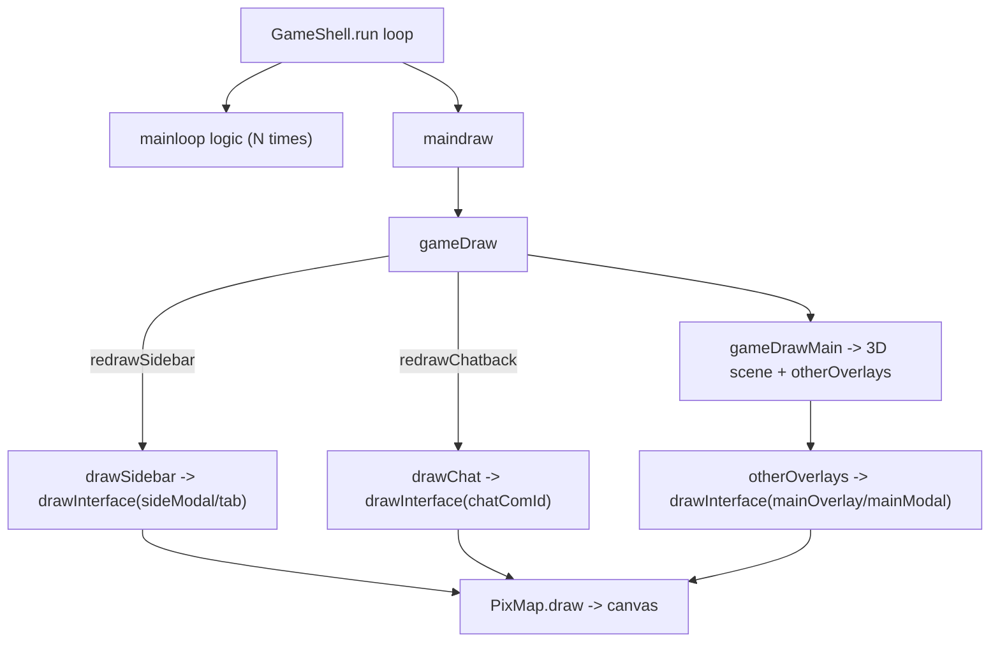

# How the OSRS UI is drawn & made interactive in `Client.ts`

The UI is the classic RuneScape "interface component" system. Everything in the
fixed-screen layout (tabs, inventory, chat dialogs, the character-design screen,
shops/banks, etc.) is built from one flat array of component definitions that the
client both renders and hit-tests every frame.

All line references are against:

- [`src/client/Client.ts`](../../Client-TS/src/client/Client.ts)
- [`src/config/IfType.ts`](../../Client-TS/src/config/IfType.ts)
- [`src/client/GameShell.ts`](../../Client-TS/src/client/GameShell.ts)
- [`src/graphics/PixMap.ts`](../../Client-TS/src/graphics/PixMap.ts)
- [`src/dash3d/Model.ts`](../../Client-TS/src/dash3d/Model.ts)

---

## 1. The data model: `IfType` components

Every UI element is an `IfType` (`src/config/IfType.ts`). They are decoded once at
load into a single flat array `IfType.list[]`, indexed by id (`IfType.init`, lines
102-347). Each component has a `type`:

```ts
export const enum ComponentType {
    TYPE_LAYER = 0,      // container with children (childX/childY offsets)
    TYPE_UNUSED = 1,
    TYPE_INV = 2,        // inventory/item grid
    TYPE_RECT = 3,       // filled/outlined rectangle
    TYPE_TEXT = 4,       // text (with %1..%5 substitution)
    TYPE_GRAPHIC = 5,    // sprite
    TYPE_MODEL = 6,      // a rotating 3D model
    TYPE_INV_TEXT = 7,   // item list rendered as text
}
```

The tree structure is encoded only on `TYPE_LAYER` components, which hold
`children[]`, `childX[]`, `childY[]` (lines 162-176). So the "UI tree" is a layer
pointing at child ids, each child looked up again in the global `IfType.list`.

Buttons are not a type; instead any component can carry a `buttonType` (lines
28-35: OK / TARGET / CLOSE / TOGGLE / SELECT / CONTINUE) plus a `clientCode` for
hardcoded client behavior.

Each component also stores **embedded scripts** (`scripts`, `scriptComparator`,
`scriptOperand`, lines 136-160). These are tiny bytecode programs the client runs
to read game state — this is how a component "knows" the current HP, which prayer
is on, etc.

---

## 2. Render cadence & screen regions

`GameShell.run()` drives a fixed-timestep loop: it runs game logic
(`mainloop` -> `Client.mainloop`) a variable number of times to catch up, then
calls `maindraw` once (lines 186-204). `maindraw` ends up in `Client.gameDraw()`
(line 4127).

Drawing is region-based and lazily redrawn. The fixed UI is divided into separate
`PixMap` off-screen buffers — `areaViewport`, `areaSidebar`, `areaChatback`,
`areaMapback`, etc. Each `PixMap` (`src/graphics/PixMap.ts`) owns an `Int32Array`;
`setPixels()` points the global `Pix2D` rasterizer at that buffer, and `draw(x,y)`
blits it to the real `<canvas>` (converting RGB to RGBA). All `Pix2D`/`Pix3D`
drawing primitives are global and write to "whichever buffer is currently active."

`gameDraw` only repaints a region when its dirty flag is set:

```ts
if (this.redrawSidebar) {
    this.drawSidebar();
    this.redrawSidebar = false;
}
```

`redrawSidebar` / `redrawChatback` are flipped on by every event that changes
those areas (hovering a component, a varp update, inventory changes, opening an
interface, animation ticks). That's why those two booleans appear ~100 times in
the file.



Which interface goes where is tracked by a handful of "slot" fields (lines
419-422):

- `mainModalId` / `mainOverlayId` — center viewport (drawn in `otherOverlays`,
  lines 5090-5098)
- `sideModalId` and `sideOverlayId[sideTab]` — the right tab panel
  (`drawSidebar`, lines 11336-11340)
- `chatComId` / `tutComId` — the chatbox dialog (`drawChat`, lines 11372-11375)

---

## 3. The core renderer: `drawInterface`

`drawInterface(com, x, y, scrollY)` (line 10131) is the recursive heart. Given a
layer, it:

1. Bails unless it's `TYPE_LAYER` with children, and respects `hide` (unless
   currently hovered) — line 10132.
2. Sets a clip rectangle to the layer's bounds via `Pix2D.setClipping` (line
   10141), saving/restoring the parent clip.
3. Iterates `children[]`, computing each child's absolute position as
   `parentXY + childX/Y[i] - scrollY + child.x/y` (lines 10149-10154).
4. If a child has a `clientCode`, it first runs `clientComponent(child)` to mutate
   it (dynamic text etc.) — line 10156.
5. Dispatches on `child.type`:
   - **LAYER (0):** clamps `scrollPos`, recurses, and draws a scrollbar if
     `scrollHeight > height` (lines 10160-10173).
   - **INV (2):** double loop over `width x height` slots, drawing each item
     sprite via `ObjType.getSprite`, stack counts, drag offset, and selection
     outline (lines 10174-10270).
   - **RECT (3):** `Pix2D.fillRect/drawRect`, with translucency support (lines
     10271-10303).
   - **TEXT (4):** resolves `%1..%5` placeholders by running scripts
     (`getIfVar`), splits on `\n`, draws centered or left with
     `PixFont.drawStringTag` (lines 10304-10414).
   - **GRAPHIC (5):** plots `graphic` or `graphic2` (lines 10415-10423).
   - **MODEL (6):** renders a rotating 3D model (see section 5).
   - **INV_TEXT (7):** item names as a text list (lines 10459-10491).

---

## 4. How components read state

Two mechanisms feed live game data into rendering.

**(a) The script interpreter `getIfVar(component, scriptId)`** (line 10625). Each
component's `scripts[scriptId]` is a `Uint16Array` of opcodes that this stack
machine evaluates into a single integer. Opcodes read from the client's state
arrays — e.g. `1` = effective skill level (`statEffectiveLevel`), `3` = skill XP,
`5` = `pushvar` (`this.var[id]`), `13`/`14` = test bit / read varbit, `8` = combat
level, plus arithmetic ops (subtract/divide/multiply). It returns the accumulator
on opcode `0` (lines 10640-10762).

**(b) `getIfActive(component)`** (line 10592) turns those values into a boolean
"active" state by comparing each script result against `scriptOperand[i]` using
`scriptComparator[i]` (1 = `==`, 2 = `<`, 3 = `>`, 4 = `!=`). A component is
"active" only if *all* comparisons pass. This is what toggles a prayer's glow,
swaps a button's color2/text2, or selects which model/animation to show. It is
consumed throughout `drawInterface`, e.g. RECT picks `colour2` vs `colour` based
on `getIfActive` (lines 10278-10290).

**(c) `clientComponent(com)`** (line 10921) handles `clientCode`-driven dynamic
content that scripts can't express — friends/ignore lists, the last-login message,
unread-message counts, the character-design preview, the report-abuse input
cursor, etc. It directly rewrites `com.text`, `com.colour`, `com.buttonType`, or
even the model.

The backing state itself comes from the server. `this.var[]` (varps) is updated by
`VARP_SMALL` / `VARP_LARGE` packets (lines 7193-7233), which also call
`clientVar()` (line 10835) for client-side side effects (brightness, music/sound
volume, chat split, etc.) and set `redrawSidebar`. Inventory grids are filled by
`UPDATE_INV_FULL/PARTIAL` (lines 6485-6560) writing into the component's
`linkObjType`/`linkObjNumber` arrays. Interface slots are assigned by
`IF_OPENMAIN`, `IF_OPENSIDE`, `IF_OPENCHAT`, `IF_OPENMAIN_SIDE`, `IF_CLOSE`,
`IF_SETTAB`, `IF_SETHIDE`, `IF_SETCOLOUR` (lines 6161-6335).

---

## 5. How models are drawn and rotated (TYPE_MODEL)

In `drawInterface` (lines 10424-10458):

1. The 3D rasterizer's projection origin is temporarily moved to the component's
   center: `Pix3D.originX = childX + width/2`, `originY = childY + height/2`.
2. A camera offset is derived from the component's authored pitch/zoom using the
   sine/cosine tables: `eyeY = sin[modelXAn]*modelZoom >> 16`,
   `eyeZ = cos[modelXAn]*modelZoom >> 16`.
3. `getIfActive` chooses `modelAnim` vs `modelAnim2`; the model (and the current
   animation frame, if any) is fetched via `IfType.getTempModel(...)`
   (`IfType.ts` line 363), which copies the base model and applies seq frames.
4. It calls `model.objRender(0, modelYAn, 0, modelXAn, 0, eyeY, eyeZ)`.

`Model.objRender` (`src/dash3d/Model.ts` line 1652) is where rotation actually
happens: it rotates every vertex by roll -> pitch -> yaw using the lookup tables,
then applies the eye pitch and perspective-projects to screen with
`Pix3D.originX/Y` (lines 1667-1708). So `modelYAn` is the model's spin and
`modelXAn` is its tilt; the "spinning character/item in interfaces" comes from this
per-vertex rotation each frame.

Animation advances separately in `animateInterface(id, delta)` (line 10786): it
walks the layer tree, and for any `TYPE_MODEL` child with a sequence it accumulates
`animCycle` and advances `animFrame` based on `SeqType` frame durations/loops,
returning whether anything changed (so the region can be flagged dirty).
`gameDraw` calls it for the side/chat interfaces (lines 4166, 4208) and
`otherOverlays` for the main ones (lines 5091, 5096). `ifAnimReset` (line 10768)
zeroes frames when an interface opens.

---

## 6. Interactivity: hover, right-click menu, and actions

There is no retained event model — interactivity is recomputed every logic tick by
hit-testing the same component tree.

**Hover:** `buildMinimenu()` (line 2759) checks which screen region the mouse is in
and calls `addComponentOptions` for the corresponding interface (main viewport at
`4,4`; sidebar at `553,205`; chatbox at `17,357`) — lines 2772-2809.
`addComponentOptions` (line 9859) mirrors `drawInterface`'s geometry to find the
component under the cursor. When the mouse is over a child that has an
`overLayerId` or a hover color, it records `lastOverComId` (lines 9873-9879);
`buildMinimenu` copies that into `overMainComId` / `overSideComId` /
`overChatComId` (lines 2780-2813). Those are exactly the fields `drawInterface`
checks to apply hover colors/text and to force-show hidden hover layers.

**Menu building:** `addComponentOptions` appends entries to the parallel arrays
`menuOption[]`, `menuAction[]`, `menuParamA/B/C[]`. For inventory slots it
generates Use/op/Drop/Examine entries with `MiniMenuAction.OP_HELD*` /
`INV_BUTTON*` (lines 9905-10021); for buttons it emits `IF_BUTTON`, `TGT_BUTTON`,
`CLOSE_BUTTON`, `TOGGLE_BUTTON`, `SELECT_BUTTON`, or `PAUSE_BUTTON` keyed by
`buttonType` and storing the component id in `menuParamC` (lines 10026-10069).
`buildMinimenu` then bubble-sorts entries so high-priority (`action > 1000`)
options land at the bottom (lines 2816-2845). A single left-click executes the top
non-cancel option; a right-click shows the full list (`openMenu`, line 8674).

**Action dispatch:** `doAction(optionId)` (line 8781) is the big switch that
consumes a menu entry:

- `IF_BUTTON` -> `clientButton(com)` for any client-side effect, then sends
  `ClientProt.IF_BUTTON` with the component id to the server (lines 9377-9389).
- `TOGGLE_BUTTON` / `SELECT_BUTTON` -> also optimistically mutate the bound varp
  locally (`this.var[varp] = ...`), call `clientVar`, and flag redraw, so the UI
  responds instantly without waiting for the server (lines 9391-9417).
- `PAUSE_BUTTON` -> `RESUME_PAUSEBUTTON`; `CLOSE_BUTTON` -> `closeModal()` (lines
  9419-9428).
- Inventory ops send the appropriate item-action packets with slot/obj/interface
  params.

**`clientButton(com)`** (line 11190) is the hardcoded client behavior for special
buttons: opening the add-friend/ignore name prompt, logout countdown, and the
entire character-designer (cycling body parts/colors, switching gender, accepting
the design and sending `IDK_SAVEDESIGN`) — lines 11211-11307. It returns whether
the server should still be notified.

**Scrollbars & drag:** `doScrollbar` (line 10522) hit-tests the up/down arrows and
grip during `addComponentOptions`, adjusting `com.scrollPos`; `drawScrollbar`
(line 10562) renders the track/grip. Item dragging uses `objDrag*` state, with
auto-scroll logic embedded in the INV branch of `drawInterface` (lines
10204-10249).

---

## 7. Summary of the data flow

- **Definition:** server cache -> `IfType.list[]` (flat array; layers reference
  children).
- **State in:** server packets (`VARP_*`, `UPDATE_INV_*`, `IF_OPEN*`/`IF_SET*`)
  -> `this.var[]`, component `linkObj*`, and the modal/overlay/tab slot ids.
- **Draw (per frame, per dirty region):** `gameDraw` -> region buffers ->
  `drawInterface` recursion -> per-type rasterization, with
  `getIfVar`/`getIfActive`/`clientComponent` injecting live state, and
  `objRender`/`animateInterface` handling model spin/animation.
- **Interact (per tick):** mouse position -> `buildMinimenu`/`addComponentOptions`
  re-hit-tests the same tree -> menu arrays -> `doAction` -> `clientButton`
  (local) + `ClientProt` packets (server), often optimistically updating
  `this.var[]` and flagging the region dirty.
