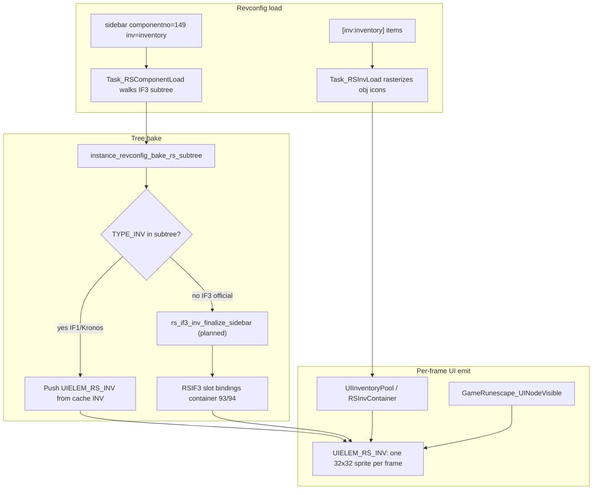

# CS2 VM (pragmatic client-side script engine)

`src2/vm/cs2vm.c` implements a small stack machine used when
`StaticUIBehavior.script_kind == CS2VM_SCRIPT_KIND_CS2`. Existing cache-driven
button scripts remain on CS1 (`csvm` / `ToriAuxLibVM`).

This is **not** a verified reproduction of Jagex's historical CS2 opcode table.
It is sized for local interaction/minimenu condition checks in this client.

## Host state

`struct CS2VM_State` supplies varp/varbit/varc/stat accessors and optional
optimistic varp writes (`set_varp_optimistic`).

## Script format

Scripts are `int` arrays terminated by opcode `0`. Operands follow inline after
multi-byte opcodes.

## Opcode table

| Opcode | Meaning |
|--------|---------|
| `0` | End script; return top-of-stack (or 0) |
| `1` | Push immediate (`script[pc++]`) |
| `2` | Push varp (`script[pc++]`) |
| `3` | Push varbit (`script[pc++]`) |
| `4` | Push varc (`script[pc++]`) |
| `10` | Add (pop b, pop a, push a+b) |
| `11` | Subtract |
| `12` | Multiply |
| `13` | Divide (0 if divisor is 0) |
| `20` | Equal |
| `21` | Not equal |
| `22` | Less than |
| `23` | Greater than |
| `30` | Branch if false (pop cond, jump to `script[pc++]` if zero) |
| `31` | Unconditional jump to `script[pc++]` |
| `40` | Set varp optimistic (pop value, `script[pc++]` = varp id) |
| `50` | Return (pop and return value) |

## Comparators (`cs2vm_compare`)

Used with script comparator/operand fields on `StaticUIBehavior`:

| Comparator | Test |
|------------|------|
| `0` | value > operand |
| `1` | value < operand |
| `2` | value == operand |
| `3` | value != operand |

## Wiring

- `GameRunescape` owns `struct CS2VM* cs2vm` (created in `GameRunescape_New`).
- `UITreeBehaviorHost.cs2vm` + `cs2vm_state` are set via `ui_input_adapter_init_behavior_host`.
- `uitree_behavior_is_active` evaluates CS2 scripts when `script_kind` is CS2.

## Inventory rendering (CS2 / IF3 model)

The CS2 VM does **not** execute per-slot draw logic. It evaluates
`StaticUIBehavior` scripts (varp/varbit) for component visibility and active
state. Inventory **drawing** is handled by the UITree emitter and inventory data
stores described below.

### IF3 vs legacy `TYPE_INV`

| Era | Interface widget | How items appear |
|-----|------------------|------------------|
| IF1 / Kronos cache | `TYPE_INV` (component type 2) | One grid component owns all slots; client iterates cols×rows and blits obj icons |
| IF3 / official CS2 | `TYPE_LAYER` slot hitboxes (36×36) | No INV child; server/container scripts own slot contents; client maps `component_id → container slot` and draws icons at layer positions |

**Legacy `TYPE_INV`:** the cache interface contains a single INV node with
`width`/`height` as cols/rows, `marginX/Y`, per-slot offsets (`invBackgroundX/Y`),
and `invSlotGraphic` backgrounds. Client.ts draws all slots in one
`drawInterface` pass (`Client-TS/src/client/Client.ts`).

**IF3 replacement:** interfaces like **149** (inventory tab) and **387**
(equipment) expose only `TYPE_LAYER` + `TYPE_GRAPHIC` chrome. Item state lives
in **inventory containers** (official ids: backpack **93**, worn **94** in
`src2/ui/rs_inv_container.h`). Slot layers are click targets; item icons are
drawn at layer bounds via `RSIF3SlotBinding` (`component_id → container_id +
slot`). Equipment iface 387 uses eleven slot layers (`0x0183000f`–`0x01830019`;
see `if_387.txt`) instead of a grid INV.

**Revconfig bridge:** `[component:sidebar_tab_3]` sets `componentno=149` and
`inv=inventory` in `rev_osrs_ui.ini`. Official iface 149 is an IF3 layer shell
with zero `TYPE_INV` children. When `Task_RSComponentLoad` walks the subtree
and finds no `TORIAUXLIBCORE_COMPONENT_INV`, `task_on_rc_log_sidebar_inv_load_failure`
fires today; the intended fix is `rs_if3_inv_finalize_sidebar` (declared in
`src2/ui/rs_if3_inv_sync.h`, not yet implemented).

### Data loading (item icons)

1. `[inv:inventory]` → `Task_InstanceOnRCInv` → `src2/toriauxlib/core/tasks/task_rs_inv_load.c`
2. For each obj id: resolve `inventory_model_id`, fetch model, call
   `dat*_buildcache_obj_icon_sprite`, register sprite in scene →
   `UIInventoryItem.scene_id` / `atlas_index`
3. Append to `UIInventoryPool` via `uitree_inv_pool_append`
4. IF3 path additionally seeds `RSInvContainer` id 93 via
   `rs_if3_inv_seed_backpack_from_pool` (`src2/ui/rs_inv_container.c`)

### UITree component (`UIELEM_RS_INV`)

When a cache INV **does** exist (IF1/Kronos),
`instance_revconfig_bake_rs_component` maps `TORIAUXLIBCORE_COMPONENT_INV` →
`UIELEM_RS_INV` with:

- `inv_index` — pool index from `inv=` name lookup
- `cols` / `rows` / `margin_x` / `margin_y`
- Per-slot offsets and background sprites (first 20 slots, `UI_INV_SLOT_OFFSET_MAX`)
- `always_dirty = 1` so the grid re-emits each frame

Pushed via `uitree_push_rs_inv` in `src/osrs/revconfig/uitree.c` or spec copy
in `src2/toriauxlib/core/tasks/instance_revconfig_context.c`.

### Frame emission (implemented today)

Cooperative multitasking render loop in `src2/games/runescape.c`:

1. `rs_phase_ui_begin` resets `game->frame.ui_inv_slot = 0`
2. Tree traversal skips nodes where `GameRunescape_UINodeVisible` is false
   (sidebar tab not selected, `behavior.hide` layers, etc.)
3. `UIELEM_RS_INV` case: for current `ui_inv_slot`:
   - Position: `bx + col * (margin_x + 32)`, same for rows, plus per-slot offset
   - Lookup `UIInventoryPool[inventories[inv_index]].items[slot]`
   - If `obj_id > 0` and `scene_id >= 0`: emit `TORIRSRC_SPRITE` 32×32 via
     `GameRunescape_EmitSpriteCommand`
   - Else if slot has `inv_slot_bg_scene_id[slot]`: emit background sprite
   - Increment `ui_inv_slot`; `rs_phase_ui_step` yields until all slots emitted,
     then advances tree node
4. `UIELEM_RS_INV_TEXT` variant: draws obj display name as font per slot

Equipment IF3 layers are **not** yet wired to container-driven icon emission in
`runescape.c` (no `RSIF3InvState` usage there yet).

### CS2 VM role (scope boundary)

| CS2 VM does | CS2 VM does not |
|-------------|-----------------|
| Evaluate `script_kind == CS2` behaviors via `uitree_behavior_is_active` / `ToriAuxLibVM_IsActive` | Draw item icons or iterate inventory slots |
| Gate parent panel visibility (`behavior.hide`, varp/varbit conditions) | Replace `TYPE_INV` grid math (that is revconfig + UITree) |
| Toggle active sprites/colors on graphic components | Handle server container update packets (`rs_if3_inv_dispatch_container` — planned) |

Wire point: `rs_ui_host_is_active` in `runescape.c` calls `ToriAuxLibVM_IsActive`
with `CS2VM_State` backed by varp/varbit getters.

### Implementation status

- **Working:** `UIELEM_RS_INV` grid emission, `UIInventoryPool` +
  `Task_RSInvLoad`, revconfig `inv=` wiring, slot hit-testing (see
  [UI Inventory System](ui_inventory_system.md))
- **Partial:** `RSInvContainer` / `RSIF3SlotBinding` data structures in
  `src2/ui/rs_inv_container.c`
- **Planned** (headers only in `src2/ui/rs_if3_inv_sync.h`):
  `rs_if3_inv_finalize_sidebar` (synthesize INV grid when IF3 subtree lacks
  TYPE_INV), `rs_if3_inv_setup_after_build`, `rs_if3_inv_dispatch_container`
  (runtime container sync), equipment worn-slot bindings for iface 387

## Related subsystems

- [UI Click System](ui_click_system.md) — mouse routing (separate from CS2 conditions)
- [UI Minimenu System](ui_minimenu_system.md) — right-click menus
- [UI Interaction State](ui_interaction_state.md) — resolved click targets
- [UI Inventory System](ui_inventory_system.md) — inventory slot click/swap; rendering pipeline documented above
