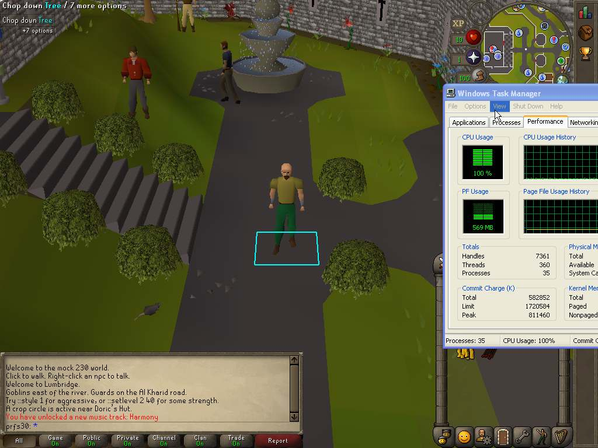

# D3D9, D3D9-zbuffer and soft3d on Windows XP, fullscreen, osrs239

Measured 2026-08-26 on the XP box (10.10.10.2) against a live rev-239 world
hosted on the Windows 11 machine (10.10.10.1). Fullscreen 1024x768, the client
standing in the Lumbridge castle courtyard.

**The headline:** at fullscreen, D3D9 costs **1.8-2.0x less CPU per frame than
soft3d** — 23.1 / 21.5 ms against 41.9 ms. The two D3D9 modes are **not
separable from each other** on this box. And the largest single item in either
D3D9 frame is not rendering at all: it is `UITree_LayoutResolve`, at 12-14%.



---

## 1. What was measured

| | |
|---|---|
| box | Windows XP, `x86 Family 15 Model 4 Stepping 1` (Pentium 4 Prescott), **one** cpu, 1024x768 desktop, Radeon X300 |
| client | `torirs.exe`, `PLATFORM=win32` `OPT=1`, sha256 `e9b5777c8954cd8f5f64348395a5a0e574c610f1bdf60470350eb63eabbe83eb` |
| source | `v3` @ `3d0390d46`, plus the one-file `TORIRS_WIN32_FULLSCREEN` patch in §2.1 |
| build | `.\build_winxp.ps1` (i686-w64-mingw32 from `lib\mingw32-win32-toolchain.zip`) |
| kernels | all four handrolled asm kernels present (`nm`-verified: texspan, gouraud\_tri, textri, fb\_clear32\_nt) |
| world | osrs239, live, over the 10.10.10.x crossover |
| manifest | `build/manifests/osrs239-xp-js5.ini` (cache `cache.osrs239.sparse` local on the box) |
| scene | Lumbridge castle courtyard, player idle, camera still |
| arms | `--soft3d`, `--d3d9`, `--d3d9-zbuffer` — **one binary, three flags** |

The three arms are the same executable. Nothing about the comparison depends on
two builds agreeing.

### Servers, all on the Windows 11 machine

| process | endpoint | what it serves |
|---|---|---|
| `torirsserver.exe 43596 --rev osrs239` | `127.0.0.1:43596` | the game world (wire osrs239, home 3222,3218) |
| `tcp_forward_43596.py` | `10.10.10.1:43596` -> `127.0.0.1:43596` | the box cannot reach loopback |
| `js5_server --cache cache.osrs239.sparse --revision 239` | `10.10.10.1:43595` | JS5 cache service |
| `io_server --rev osrs239 cache.osrs239.sparse --port 8099` | `0.0.0.0:8099` | the IO server (`GET /boot/`, `POST /io`, `/stats`) |

Three notes on that table, each of which cost a round to find out:

* **`torirsserver` binds `INADDR_LOOPBACK` only** and serves JS5 and the game on
  one port (it peeks the first byte: 15 is JS5, 14 is the game). The XP
  manifest names two ports on `10.10.10.1`, so the forwarder exists to make the
  loopback listener reachable, and JS5 was given its own `js5_server` so a cache
  fetch cannot land in the game connection's accept loop mid-measurement.
* **The IO server is standing by, not load-bearing, for this lane.**
  `io_server` is the *web* client's cache path — `POST /io` per read. The native
  win32 client opens the cache directory directly; `src/platform/platform_x_io.c`
  has no HTTP backend at all. It is running and the box can reach it (verified:
  `GET http://10.10.10.1:8099/stats` answers from XP), and `js5_server` is the
  native lane's equivalent, which is the one the manifest actually names.
* **The server ran on a stale script pack.** `make -C src torirsserver-scripts`
  fails on this tree at `check-stronghold-contract` (missing supplemental
  Stronghold maplinks — pre-existing, unrelated to rendering), so the server was
  started with `TORIRSSERVER_ALLOW_STALE_SCRIPTS=1` against the committed pack.
  Content freshness does not enter a renderer measurement; all three arms saw
  the identical world. Also `TORIRSSERVER_CACHE=cache.osrs239.sparse`, because
  `cache.osrs239/` is empty in this checkout.

All six timing logins succeeded (`login user='prof1x' session=ok`); no
`reply=5`, so no run silently measured a login screen.

---

## 2. Method, and why it is shaped this way

### 2.1 "Fullscreen" needed one line of platform code

`platform_win32gdi.c` created its window as `WS_OVERLAPPEDWINDOW` and had no
fullscreen path. Asking that style for a *client area* of 1024x768 on a 1024x768
desktop produces an outer window larger than the desktop: the caption sits at
y=0 and the bottom rows of the canvas fall off the screen. That is exactly the
wrong thing to hand this comparison — soft3d's `BitBlt` shrinks with the
*visible* area while D3D9's backbuffer does not, so the two lanes would have
stopped drawing the same frame.

`TORIRS_WIN32_FULLSCREEN=1` selects `WS_POPUP` at the desktop origin, which has
no non-client area, so the client area asked for is the client area obtained.
It decides the window's **style** only; the caller still owns the size and fills
the screen by passing the screen's own resolution. Off by default.

The canvas really follows the window — `UITREE_LAYOUT_ROOT_W/H` are variables,
not constants, and `--windowmode resizable` lets the canvas track. **Verified,
not assumed:** every run's `TORIRS_EXIT_BMP` is 1024x768, so no arm was
letterboxing a 765x503 canvas.

### 2.2 CPU time, not wall time, is the axis

`rpdxp.exe`, the remote-desktop server that hosts the box's control API, took
**25-35% of the box's one cpu** in every run — measured directly, per run, by
`GetProcessTimes` on its pid across the same window as the client's. It is not
constant across arms, and it is not even monotonic in frame rate:

| arm | rpdxp share of the cpu | client share |
|---|---|---|
| soft3d | 0.305, 0.312 | 0.692, 0.684 |
| d3d9 | 0.251, 0.259 | 0.748, 0.736 |
| d3d9-zbuffer | 0.353, 0.349 | 0.644, 0.649 |

So wall time charges the zbuffer arm for ~10 points of cpu that another process
took. **Wall time and cpu time disagree about which D3D9 mode is faster**, and
cpu time is the one that is about the renderer. Both are reported below;
conclusions are drawn from cpu.

`ms_per_frame_cpu = (1000 / fps_median) * (client cpu / wall)` over the measured
window.

### 2.3 The measurement contract

* 60 s steady-state window per timing run, opened 10 s *after* the client
  reaches the world — scene load-in is cold caches and model building, and
  charging that to the renderer is the misattribution this exercise exists to
  avoid.
* Arms in **palindrome order** (`soft3d d3d9 zb zb d3d9 soft3d`), 2 reps, so the
  box's drift over a job cannot be read as a difference between arms.
* `TORIRS_PERF*` **deleted** from the environment — unset, not `=0`. The bracket
  profiler is ~69% of this box's frame and a stray CSV var re-arms it.
* Stray `torirs*.exe` killed before every run, then a 12 s settle so the world
  releases the previous character.
* `--uncapped`, so the 50 fps pacer is not the thing being measured.
* Frame rate read from the client's own `TORIRS_FPS_REPORT=1` series (one
  `fprintf` per ~2 s — negligible), median over the window's ~31 samples.

### 2.4 The profiler

The **existing** EIP sampler: `3rd/toridraw/toridraw_eip_sample.c`, armed with
`TORIDRAW_EIP_SAMPLE=1`, resolved with `tools/bq/eipresolve.py`. A second thread
suspends the render thread ~300-350 times a second and reads EIP; there is no
instrumentation in the measured code, so it cannot misattribute one stage's cost
to another the way ablation does.

Profile runs are **frame-count bounded** (`TORIDRAW_EIP_SAMPLE_WARMUP=400`,
`TORIRS_MAX_FRAMES=1300`) so the client exits through its own quit path — that
is what writes the dump and the exit BMP. A hard kill writes neither, and a run
that produced no dump looks exactly like a run that produced an empty one. Each
profile therefore covers **exactly 900 in-world frames**.

**The sampler's own cost is ~1% here**, not the ~4 ms it cost the 765x503 bench
wedge, because these frames are 2-3x longer. Proof: sampled window duration
divided by its 900 frames, against the un-sampled timing runs.

| arm | sampled window | / 900 frames | un-sampled wall ms |
|---|---|---|---|
| soft3d | 54.877 s | 60.97 ms | 60.61 |
| d3d9 | 30.688 s | 34.10 ms | 31.45 / 31.35 |
| d3d9-zbuffer | 35.189 s | 39.10 ms | 33.33 / 34.01 |

Zero suspend failures in all three dumps; 78-88% of samples landed inside the
executable's own `.text`.

---

## 3. Frame cost

60 s window, 2 reps, palindrome. Raw: `timing.result.json`.

| arm | fps (median of ~31 windows) | wall ms/frame | **cpu ms/frame** | peak working set |
|---|---|---|---|---|
| `--soft3d` | 16.5, 16.3 | 60.61, 61.35 | **41.95, 41.96** | 104 MB |
| `--d3d9` | 31.8, 31.9 | 31.45, 31.35 | **23.51, 23.08** | 250 MB |
| `--d3d9-zbuffer` | 30.0, 29.4 | 33.33, 34.01 | **21.46, 22.07** | 253 MB |

Reproducibility is good: soft3d's two reps agree to 0.02%, d3d9's to 1.8%,
zbuffer's to 2.8%.

**Against soft3d, on cpu (best-of):**

* `--d3d9` — 23.08 ms, **1.82x cheaper**
* `--d3d9-zbuffer` — 21.46 ms, **1.95x cheaper**

**D3D9 painter vs D3D9 zbuffer — no result.** Zbuffer is 7.0% cheaper on cpu;
painter is 6.3% better on wall. This box is bimodal by ~7.5% and both figures
sit inside that, on top of the 10-point rpdxp difference between the arms in
§2.2. Say "indistinguishable", not "zbuffer wins". Separating them needs the
ABBA harness (`TORIDRAW_FRAME_AB=1`), which cancels the drift that makes
run-to-run comparison useless at this size.

**Memory is the price.** D3D9 costs 2.4x soft3d's working set (250 vs 104 MB),
in both modes. That is the known triple-storage — CPU copies plus
`D3DPOOL_MANAGED` runtime mirrors of the same vertex bytes. This `v3` branch
does not carry the `D3DPOOL_DEFAULT` + reset-re-upload fix.

---

## 4. What the frame is made of

900 in-world frames per arm. Shares are of render-thread samples; the ms column
scales each share onto that arm's own measured cpu ms/frame from §3. Full
tables: `eip-soft3d.txt`, `eip-d3d9-painter.txt`, `eip-d3d9-zbuffer.txt`.

### 4.1 soft3d — 41.95 ms/frame

| share | ms | symbol |
|---|---|---|
| 13.10% | 5.50 | `toridraw_gouraud_tri_opaque_s4_asm` |
| 10.45% | 4.38 | **`UITree_LayoutResolve`** |
| 8.95% | 3.76 | *ntdll.dll* |
| 8.46% | 3.55 | `toridraw_textri_opaque_lerp8_v3_asm` |
| 6.12% | 2.57 | `ToriDraw_ComputeProjectedFaceOrderSmall` |
| 5.63% | 2.36 | `draw_texture_scanline_transparent_blend_..._lerp8_v3_ordered` |
| 4.73% | 1.99 | `ToriDraw2D_BlitArgbTiledAlpha` |
| 3.44% | 1.44 | `ToriRS_Soft3D_RenderFrame` |
| 3.02% | 1.27 | *msvcrt.dll* |
| 2.45% | 1.03 | `painter_paint_bucket` |
| 2.36% | 0.99 | `ToriDraw_Project` |
| 2.31% | 0.97 | `ToriDraw_RasterPainter` |
| 2.16% | 0.91 | `app_world_pick_finish` |

Software raster kernels total **11.41 ms** (gouraud 5.50 + textri 3.55 +
transparent texture scanline 2.36), 27% of the frame.

### 4.2 `--d3d9` (painter) — 23.08 ms/frame

| share | ms | symbol |
|---|---|---|
| 14.44% | 3.33 | *ntdll.dll* |
| 11.67% | 2.69 | **`UITree_LayoutResolve`** |
| 10.19% | 2.35 | `ToriDraw_ComputeProjectedFaceOrderSmall` |
| 5.99% | 1.38 | *msvcrt.dll* |
| 4.34% | 1.00 | `painter_paint_bucket` |
| 3.66% | 0.84 | `d3d9_ui_draw_sprite` |
| 3.63% | 0.84 | `app_world_pick_finish` |
| 2.93% | 0.68 | `d3d9_bake_pose_vertices` |
| 2.84% | 0.66 | `ToriRS_FrameNextCommand` |
| 2.58% | 0.60 | `trspk_toridraw_bake_face` |
| 2.53% | 0.58 | `app_plugin_highlights_rebuild_pools` |
| 2.44% | 0.56 | `trspk_toridraw_face_colors` |
| 2.26% | 0.52 | `d3d9_draw_retained` |
| 1.51% | 0.35 | `d3d9_draw_model` |
| 1.22% | 0.28 | *d3d9.dll* |

Not one software raster kernel appears. The whole 11.41 ms of §4.1 is gone.

### 4.3 `--d3d9-zbuffer` — 21.46 ms/frame

| share | ms | symbol |
|---|---|---|
| 13.93% | 2.99 | **`UITree_LayoutResolve`** |
| 10.45% | 2.24 | *ntdll.dll* |
| 8.60% | 1.85 | `d3d9_draw_model` |
| 8.23% | 1.77 | *msvcrt.dll* |
| 3.81% | 0.82 | `d3d9_ui_draw_sprite` |
| 3.77% | 0.81 | `app_world_pick_finish` |
| 3.47% | 0.74 | `d3d9_bake_pose_vertices` |
| 3.22% | 0.69 | `trspk_toridraw_face_colors` |
| 3.19% | 0.69 | `trspk_toridraw_bake_face` |
| 2.96% | 0.64 | `app_plugin_highlights_rebuild_pools` |
| 2.69% | 0.58 | `ToriRS_FrameNextCommand` |
| 1.48% | 0.32 | `d3d9_draw_retained` |
| 1.10% | 0.24 | *d3d9.dll* |
| **0.86%** | **0.18** | `ToriDraw_ComputeProjectedFaceOrderSmall` |

---

## 5. Findings

**1. D3D9 buys 18-20 ms by deleting the software rasterizer, and gives some
back in setup.** soft3d spends 11.41 ms in raster kernels and another 3.44 ms in
`Soft3D_RenderFrame` (1.44) / `RasterPainter` (0.97) / `painter_paint_bucket` (1.03); the D3D9 arms
spend none of it. What replaces it is per-model vertex baking
(`d3d9_bake_pose_vertices` + `trspk_toridraw_bake_face` +
`trspk_toridraw_face_colors`, 1.84-2.12 ms) and the driver.

**2. `UITree_LayoutResolve` is the biggest single item in both D3D9 frames.**
2.69 ms (11.67%) in painter mode, 2.99 ms (13.93%) in zbuffer mode — larger than
any renderer function in either. It is 4.38 ms in soft3d too, where the raster
kernels merely hide it. This is UI layout, it is pure CPU, both lanes pay it,
and it scales with the fullscreen canvas. **It is the largest available lever on
the D3D9 lanes and nobody has looked at it.**

**3. The zbuffer path does exactly what its header claims — and then hands most
of it back.** The CPU back-to-front face sort collapses from 2.35 ms to 0.18 ms
(−2.17 ms), which is the whole point of only sorting genuinely blended faces.
But `d3d9_draw_model` rises 0.35 -> 1.85 ms (+1.50 ms) paying for the per-face
material classification and the deferred blended queue. Net ≈ −0.67 ms, which is
the ~1.6 ms measured difference within this box's noise. **The sort is not where
the remaining money is; the classification loop is.**

**4. The driver's cost is in the kernel, not in `d3d9.dll`.** `d3d9.dll`'s own
code is 0.24-0.28 ms — nothing. But ntdll is 2.24-3.33 ms (10-14%) in the D3D9
arms. That is the kernel transition per DP2 buffer flush, consistent with the
XPDM DP2 behaviour already established for this box (and *not* software vertex
processing — the X300 reports `D3DDEVCAPS_HWTRANSFORMANDLIGHT`). It is also why
draw-call clustering pays here: the cost is per submission, not per triangle.

**5. `msvcrt` doubles-to-triples in the D3D9 arms** — 1.27 ms in soft3d,
1.38 ms painter, 1.77 ms zbuffer (8.23%!). That is `memcpy`/heap on the vertex
staging path, and 1.77 ms of `memcpy` per frame is a bigger number than most
kernel wins anyone has chased on this box.

**6. Three costs are common-mode and none of them is rendering.**
`app_world_pick_finish` 0.81-0.91 ms, `app_plugin_highlights_rebuild_pools`
0.58-0.64 ms, `ToriRS_FrameNextCommand` 0.58-0.71 ms — in every arm. Together
~2 ms, ~9% of a D3D9 frame.

### Ranked, for the D3D9 lanes

| target | ms | note |
|---|---|---|
| `UITree_LayoutResolve` | 2.7-3.0 | full relayout every frame at 1024x768; incremental/cached layout |
| ntdll (DP2 flush) | 2.2-3.3 | fewer submissions; the per-(binding,page) clustering work |
| `msvcrt` memcpy/heap | 1.4-1.8 | vertex staging traffic |
| `d3d9_draw_model` (zb only) | 1.85 | per-face material classification, re-derived per pose |
| `app_world_pick_finish` | 0.81 | cursor-gated pick already exists as an arm (`hunt-w10`) |
| `app_plugin_highlights_rebuild_pools` | 0.58-0.64 | rebuilt per frame |

---

## 6. Caveats

* **The two D3D9 modes are not separated by this data.** §3.
* **One scene, one camera, still.** Lumbridge courtyard, player idle. A moving
  camera changes the occlusion/sort/overdraw mix; a still one scores every
  cross-frame cache at its best possible value. These numbers describe *this*
  scene fullscreen, and the ranking of soft3d vs D3D9 (1.8-2.0x) is far too
  large to be an artifact of it, but the tail ordering could move.
* **`rpdxp` is on the box and cannot be turned off** — it is the control API. It
  is charged explicitly (§2.2) rather than assumed away, and cpu time is immune
  to it, but the box was never idle.
* A **Windows Task Manager** window was open on the desktop for the whole
  session (visible in the screenshot), overlapping the client. It is cheap and
  equal across arms, but it is not nothing.
* The exit BMPs are rendered through `App_Render`, i.e. the *software* path, so
  they prove the canvas size and that the client was in the world — they do not
  prove what D3D9 put on screen. That is what the screenshot at the top is for:
  it is a live capture of the `--d3d9-zbuffer` arm.
* Stale server script pack (§1).

---

## 7. Reproducing

Everything here is in `docs/d3d9/`.

**On the Windows 11 machine**, from the repo root:

```sh
TORIRSSERVER_ALLOW_STALE_SCRIPTS=1 TORIRSSERVER_CACHE=cache.osrs239.sparse \
    ./src/build_win64_opt/torirsserver.exe 43596 --rev osrs239 &
python docs/d3d9/tcp_forward_43596.py &                       # 10.10.10.1:43596
./src/build_win64_opt/js5_server --cache cache.osrs239.sparse \
    --revision 239 --bind 10.10.10.1 --port 43595 &
./src/build/io_server.exe --rev osrs239 cache.osrs239.sparse \
    --port 8099 --boot-root . --root build-web &
```

Wait for `torirsserver: listening on 127.0.0.1:43596, wire osrs239`.

**Build and deploy the client:**

```sh
powershell -NoProfile -ExecutionPolicy Bypass -File ./build_winxp.ps1
# dist/win32/torirs.exe -> C:\dev\oldschool-clientc\torirs-d3d9prof.exe on the box
python -c "import box; box.put('dist/win32/torirs.exe',
    r'C:\dev\oldschool-clientc\torirs-d3d9prof.exe')"
```

**Run:**

```sh
python docs/d3d9/mkjob.py timing timing2 job.json 60   # 6 runs, ~11 min
python docs/d3d9/mkjob.py eip    eip2    job.json 400 900
python docs/d3d9/drive.py submit job.json
python docs/d3d9/drive.py fetch  timing2 out/
python docs/d3d9/summarize.py out/timing2.result.json
python tools/bq/eipresolve.py out/E1-d3d9.eip.txt dist/win32/torirs.exe \
    --top 40 --ms 23.08
```

`box.py` is the box HTTP API; `xp_profile_runner.py.tmpl` is the box-side
runner (**Windows XP, Python 3.2** — no f-strings, no `subprocess.run`, no
`os.replace`, and a detached child must be handed an explicit env carrying
`PYTHONIOENCODING` or Python 3.2's console-encoding probe kills it silently).

Do not run this while the `tools/bq` drainer is draining: two timed runs on one
box produce plausible garbage, not obvious garbage.
