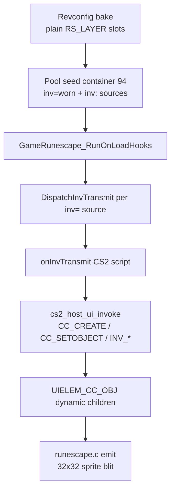

# Equipment tab (IF3 interface 387) — CS2-driven rendering

This document explains how the **Worn Equipment** sidebar (tab 4, cache interface **387**)
renders item icons via **CS2 clientscripts**, and how that replaced the earlier hardcoded
C path.

Related docs:

- [CS2 VM](cs2vm.md) — host opcodes (`cc_create`, `inv_getobj`, …)
- [UI Inventory System](ui_inventory_system.md) — click/hit-test/minimenu
- [UI Click System](ui_click_system.md) — input routing
- Offline reference: [`tools/interface161_test`](../tools/interface161_test/) with `fixtures/equipment_387.json`
- Interface dump: [`if_387.txt`](../if_387.txt) at repo root

---

## Symptom (historical)

Opening the **Worn Equipment** sidebar tab showed panel chrome but **no item icons** in
equipment slots. Toolbar graphics with `layer = -1` were also missing from the baked tree.

---

## Root cause (historical)

Interface 387 is an IF3 **shell**: `TYPE_LAYER` slot hitboxes plus `TYPE_GRAPHIC` chrome
(`inv_children=0`). Icons are **not** embedded in the cache as a `TYPE_INV` grid.

The old client faked icons by:

1. Baking eleven inventory-slot leaf nodes from a hardcoded file-index table in C.
2. Injecting a synthetic backpack `UIELEM_RS_INV` for tab 149 in C.
3. Reading container 94 only at **emit** time when slot data happened to be seeded.

CS2 `onInvTransmit` scripts (`cc_deleteall` + `cc_create` + `cc_setobject` + `inv_getobj`)
were never executed, so behaviour diverged from real OSRS.

---

## Current architecture (CS2-driven)



### Revconfig / inventory bind

- Any component with `inv=<name>` registers a generic inv source (no tab 3/149 or tab 4/387 special cases).
- `instance_revconfig_inv_setup_after_build`:
  1. `instance_revconfig_inv_seed_sources_from_pool`
  2. `uitree_layout_resolve`
  3. `GameRunescape_RunOnLoadHooks`
  4. **`GameRunescape_DispatchInvTransmit` for each registered source** (simulated server transmit at load)
  5. `uitree_mark_all_dirty`

### CS2 host opcodes

Scripts on interface 387 (and backpack 149) expect:

| Opcode | Host effect |
|--------|-------------|
| `inv_getobj` / `inv_getnum` / `inv_size` | Read container 94 / 93 via `UIInvDataService` |
| `cc_create` | `uitree_cc_create` → dynamic `UIELEM_CC_OBJ` child |
| `cc_deleteall` | `uitree_cc_delete_all` on active parent |
| `cc_setobject` / `if_setobject*` | `uitree_apply_object` + icon resolve from pool |

Emit path: `UIELEM_CC_OBJ` in `runescape.c` draws the resolved `scene_id` / `atlas_index`
when `obj_id > 0`.

### What was removed

- Hardcoded equipment-slot leaf bake in `instance_revconfig_context.c`
- Synthetic `uitree_push_backpack_grid` for tab 149 in `instance_revconfig_inv_bind.c`
- Per-tab hardcoded `DispatchInvTransmit` — replaced by generic per-source dispatch after load

### Toolbar graphics (`layer = -1`)

Orphan `TYPE_GRAPHIC` widgets (files 02, 04, 06, 08) are still attached during DAT2 walk
when `layer == -1` so chrome bakes as `UIELEM_RS_GRAPHIC` independently of CS2 obj icons.

---

## Containers

| CS2 `inv_*` id | Revconfig name | Role |
|----------------|----------------|------|
| 93 | `inventory` | Backpack tab (interface 149) |
| 94 | `worn` | Equipment tab (interface 387) |

Test pool entries `[inv:inventory]` / `[inv:worn]` seed these containers; CS2 scripts read
them through host callbacks.

---

## Debugging

**In-game:** equipment tab after load should show icons once pool + simulated transmit run.

**Offline:**

```bash
make -C tools/interface161_test
./tools/interface161_test/interface161_test cache.kronos --iface 387 --sprites \
  --fixture tools/interface161_test/fixtures/equipment_387.json \
  --panel build/equipment_387_cs2.bmp
```

This builds a UITree, seeds container 94 from the fixture, runs `onInvTransmit` CS2 scripts,
and blits resulting `UIELEM_CC_OBJ` nodes.

**Unit tests:**

- `make -C test/cs2_runtime` — synthetic `if_find` + `inv_getobj` + `cc_create` + `cc_setobject`
- `make -C test/instance_revconfig_load` — pipeline expects CS2 obj icons under equipment tab when cache INI present

---

## The equipment-stats figure (84:4, clientCode 328)

"View equipment stats" (387:1) opens interface **84**, whose only MODEL widget is
the character standing in the middle of it:

```
[04] id=0x00540004 (84<<16|4)  type=model(6)  x=186 y=205 w=136 h=168
     clientCode=328  modelType=1  modelId=-1
```

`modelId = -1` means the cache supplies nothing; `clientCode 328` names **the
local player**. That is a different content code from the character-design
preview (`327`), and it wants different treatment.

### Reference

xrsps [`src/ui/gl/widgets-gl.ts`](../../xrsps-typescript/src/ui/gl/widgets-gl.ts)
handles both codes in one block, and it is the source for the angles:

```ts
if (ct === 327 || ct === 328) {
    const cycleCntr = osrsClient?.transmitCycles?.cycleCntr ?? 0;
    const angleX = 150;
    const angleY = ((Math.sin(cycleCntr / 40.0) * 256.0) | 0) & 2047;
    const angleZ = 0;
    ...
    w.modelType = 5;
    w.modelId = ct === 327 ? 0 : 1;   // 0 = playerAppearance, 1 = localPlayer
}
```

and further down, for 328 only, the *animation*:

```ts
if (sequenceId === undefined && ((w.contentType ?? 0) | 0) === 328) {
    const ms = ac.getMovementSequenceState(sid);      // the LOCAL player's
    if (ms && (ms.seqId | 0) >= 0) {
        sequenceId = ms.seqId | 0;
        liveMovementFrame = ms.frame | 0;             // frame, not just seq
    }
}
```

So the two differ on both axes:

| | 327 design preview | 328 local player |
|---|---|---|
| appearance | the design being edited (kits only) | the real `PLAYER_INFO` appearance, **worn objs included** |
| animation | posed once at `readyanim` frame 0 | the player's live **movement** track, seq *and* frame |
| rebuilt on | each design edit | each appearance change |
| angles | `xAn 150`, `yAn = sin(cycle/40)*256`, `zAn 0` | identical |

### What was wrong

Both codes ran through the same branch in `uitree_builder_bake.c` /
`task_interface_open.c` (`cache_id < 0 && client_code == 327|328` →
`UITreeSceneBridge_EnsurePlayerModel`), so the equipment screen drew the
**default male avatar** — bald, olive top, green legs, first selectable kit per
body part — frozen at frame 0, no matter who was logged in or what they had on.

The angles were wrong for a second, independent reason. `RS_ClientCode_Tick`
already implements that exact `xAn 150` / `sin(cycle/40)*256` swing, but only
for `RS_CC_DESIGN_PREVIEW` (327), and the whole pass is gated to
`APP_UI_LOGIC_CS1`. Rev 230 is `logic=cs2`, so 328 kept the cache's
`angles=(0,0,0)`: viewed dead-on, and perfectly still.

### What it does now

The bake sites stay as they are — at bake time there is no player, so a default
avatar is the only thing available and it is the right pre-login placeholder.
The live bind happens afterwards:

- `UITreeSceneBridge_BuildLocalPlayerModel(bridge, slots, colours, gender)`
  composites through **`PlayerModel_BuildFromAppearance`** — the same function
  the world entity's own model is built from, so the figure on the widget and
  the figure in the viewport cannot disagree — and registers it at
  `UITREE_SCENE_LOCAL_PLAYER_MODEL_ID`, freeing the composite it replaces.
  Deliberately a *separate* scene id from `UITREE_SCENE_PLAYER_MODEL_ID`, so a
  rebuild never clobbers the design preview's.
- `app_player_model_poll` ([app.c](../src/app.c)) runs **from `app_logic_tick`**,
  not from the redraw path: the oscillation has to advance on a tick nothing
  else dirtied, and marking the node dirty is what asks for the redraw. It
  re-merges only when the appearance actually moved (slots / colours / gender
  compare), and no-ops entirely when there is no local player — which is what
  leaves the offline dat1 design screen untouched.

### Why it does not flicker on equip

An appearance change rebuilds the composite, and `PlayerModel_BuildFromAppearance`
hands back a model in its **rest pose**. A widget running its own frame clock
(`anim_hold = 0`) restarts that clock from 0 on the new model, so every equip
showed one un-posed frame — the flicker.

Instead the widget is `anim_hold = 1` with `anim_frame` written from
`lp->animation.secondary.frame` every tick, exactly as xrsps passes
`liveMovementFrame`. `UITreeAnim_Advance` still poses held nodes (it only skips
the *frame walk*), and it is the very next statement in `app_logic_tick`, so the
rebuilt model is posed at the entity's current frame in the same tick, before
anything draws it. `TORIRS_ANIM_DEBUG` prints one `player_model: rebuilt` line
per appearance change — one per equip, never a burst.

### Verified

```
src/build/mock230 43596 &
SDL_VIDEODRIVER=dummy TORIRS_ANIM_DEBUG=1 TORIRS_MAX_FRAMES=1900 \
  TORIRS_SIM_CLICK_AT="200,634,186;400,534,433;700,601,186;1000,533,230;1200,573,230" \
  TORIRS_EXIT_BMP=build/eq.bmp src/torirs --manifest manifest_osrs230.ini --user testc --pass test
```

(equipment tab → "View equipment stats" → inventory tab → wield two items, with
the screen open the whole time.) The figure picks up each item as it is worn and
the bonus rows follow; the trace shows exactly one rebuild per equip. A
`TORIRS_BMP_SERIES` strip over the same window shows the figure swinging through
its ±45°, and the offline dat1 design screen
(`TORIRS_SIM_OPENMAIN=3559 --manifest manifest_rs254.ini --offline`) renders
byte-identically to before the change.

---

## CS1 vs CS2 scope

CS1 scripts (`cs1vm`) still gate visibility via varp/varbit on baked nodes. **Drawing** worn
icons is entirely CS2 + container data in the IF3 path described above.
