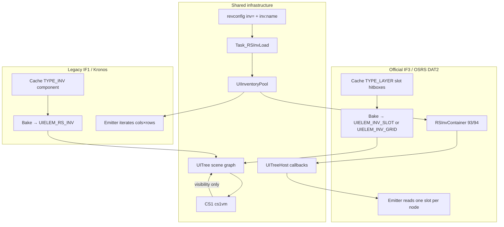
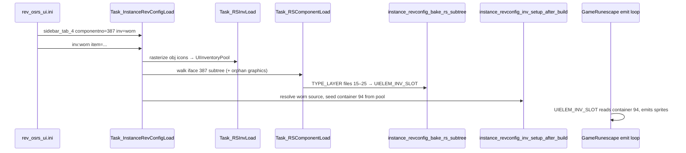

# Equipment tab (IF3 interface 387) — what was wrong and how the systems interact

This document explains the equipment-tab rendering bug, the fix, and how the
**legacy IF1 inventory path** and the **official IF3 container path** coexist in
this client.

Related docs:

- [CS2 VM](cs2vm.md) — script VM scope (visibility, not drawing)
- [UI Inventory System](ui_inventory_system.md) — click/hit-test/minimenu
- [UI Click System](ui_click_system.md) — input routing
- Interface dump: [`if_387.txt`](../if_387.txt) at repo root

---

## Symptom

Opening the **Worn Equipment** sidebar tab (tab 4, cache interface **387**)
showed the panel chrome (tiled background sprites) but **no item icons** in the
eleven equipment slots, and four bottom toolbar button graphics (stats, price
checker, items kept on death, follower) were also missing.

---

## What was wrong

The bug was **not** missing CS1/CS2 script execution. Script VMs only gate
component visibility and active-state (varp/varbit conditions). They do **not**
draw inventory icons.

The real problems were:

### 1. Empty worn inventory container (primary)

Official OSRS IF3 interfaces do not embed a `TYPE_INV` grid. Interface 387 is a
shell of `TYPE_LAYER` slot hitboxes plus `TYPE_GRAPHIC` chrome (`if_387.txt` has
`inv_children=0`).

Item icons must come from **inventory container 94** ("worn"), read at render
time by `UIELEM_INV_SLOT` nodes in the UITree.

Before the fix:

| Step | Backpack tab (149) | Equipment tab (387) |
|------|-------------------|---------------------|
| Revconfig `inv=` | `inv=inventory` | *(missing)* |
| Revconfig `[inv:name]` | `[inv:inventory]` with test items | *(missing)* |
| Sidebar finalize | Injects synthetic `UIELEM_INV_GRID` | Log-only stub |
| Container seeding | Pool → container 93 | Never ran for container 94 |

Bake time **did** create eleven `UIELEM_INV_SLOT` nodes bound to source `"worn"`,
and `runescape.c` **did** emit sprites when slot data had `obj_id > 0` and
`scene_id >= 0`. But container 94 stayed empty (`scene_id = -1`), so every slot
render returned false and drew nothing.

### 2. Orphan toolbar graphics (secondary)

Four `TYPE_GRAPHIC` widgets in interface 387 (archive files 02, 04, 06, 08) have
`layer = -1` in the cache. The DAT2 component walk only descended through
`child.layer == parent.id`, so those graphics were never visited and never baked
into the UITree.

---

## Two inventory eras in one client



| Aspect | Legacy (`TYPE_INV`) | IF3 (interfaces 149, 387) |
|--------|---------------------|---------------------------|
| Cache widget | Single grid component | Per-slot `TYPE_LAYER` (36×36) |
| UITree node | `UIELEM_RS_INV` or `UIELEM_INV_GRID` | `UIELEM_INV_SLOT` (equipment) or injected `UIELEM_INV_GRID` (backpack) |
| Slot layout | cols/rows/margins on INV node | Absolute bounds from IF3 layout math |
| Item state | `UIInventoryPool` index | Named source → `RSInvContainer` (id 93 or 94) |
| Typical revconfig | Kronos dat1 sidebar with embedded INV | `inv=inventory` / `inv=worn` + `[inv:name]` sections |

Both paths converge in `GameRunescape`’s per-frame UI emit loop. The emitter
looks up obj id and pre-rasterized icon `scene_id`, then issues a 32×32 sprite
command.

---

## How UITree, CS1, and CS2 interact

**UITree** is the retained UI scene graph: flat `StaticUIComponent` nodes with
parent/child links, absolute layout, draw payloads, menu options, and embedded
`StaticUIBehavior` scripts.

| Layer | Responsibility |
|-------|----------------|
| **UITree bake** (`instance_revconfig_context.c`) | Cache components → node types; equipment slot layers → `UIELEM_INV_SLOT` |
| **CS1 (`cs1vm`)** | Evaluate `StaticUIBehavior` CS1-kind scripts for active/visible state via `uitree_behavior_is_active` |
| **UITreeHost** (`runescape.c`) | Bridges game state: tab selection, inv slot getters, VM state |
| **Frame emitter** (`runescape.c`) | Walks visible nodes; draws sprites/fonts; **does not call VMs for item icons** |

Wiring path for behaviors:

```
StaticUIComponent.behavior
  → uitree_behavior_is_active (ui_behavior.c)
  → cs1vm_eval
  → ToriAuxLibVM_IsActive (rs_ui_host_is_active)
```

Wiring path for equipment icons:

```
UIELEM_INV_SLOT
  → game->ui_host.get_inv_source_slot
  → ui_inv_data_service_get_slot
  → RSInvContainer slot[obj_id, scene_id, atlas_index]
  → GameRunescape_EmitSpriteCommand (if obj_id > 0 && scene_id >= 0)
```

These paths are independent. A fully working behavior VM with empty container
data still produces blank slots.

---

## End-to-end data flow (equipment tab)



### Load phase

1. **`[inv:worn]`** in `rev_osrs_ui.ini` — lists obj ids for test worn items.
2. **`Task_RSInvLoad`** — resolves inventory models, rasterizes 32×32 icons,
   registers scene ids in **`UIInventoryPool`** under name `"worn"`.
3. **`Task_RSComponentLoad`** — walks interface 387 from root layer `[00]`,
   prefetches sprites, syncs components to core. Orphan `layer=-1` graphics are
   attached to the root in a post-walk pass.
4. **`instance_revconfig_bake_rs_subtree`** — maps cache widgets to UITree nodes.
   Equipment slot layers (files 15–25, ids `0x0183000f`–`0x01830019`) become
   **`UIELEM_INV_SLOT`** with `inv_source_id` = worn source and `slot` = 0..10.

### Slot index mapping (interface 387)

| Slot | OSRS slot | Archive file | Component id |
|------|-----------|--------------|--------------|
| 0 | Head | 15 | `0x0183000f` |
| 1 | Cape | 16 | `0x01830010` |
| 2 | Amulet | 17 | `0x01830011` |
| 3 | Weapon | 18 | `0x01830012` |
| 4 | Body | 19 | `0x01830013` |
| 5 | Shield | 20 | `0x01830014` |
| 6 | Legs | 21 | `0x01830015` |
| 7 | Hands | 22 | `0x01830016` |
| 8 | Feet | 23 | `0x01830017` |
| 9 | Ring | 24 | `0x01830018` |
| 10 | Ammo | 25 | `0x01830019` |

Mapping lives in `instance_revconfig_inv_bind.c` (`k_equipment_387_slot_files`).

### Finalize phase

After the layout tree is built, **`instance_revconfig_inv_setup_after_build`**:

1. Calls **`instance_revconfig_inv_finalize_sidebar`** for each sidebar tab.
   - Tab 3 / iface 149: injects synthetic **`UIELEM_INV_GRID`** (4×7) when no
     cache `TYPE_INV` exists.
   - Tab 4 / iface 387: registers `"worn"` source (container 94, 11 slots).
2. Calls **`instance_revconfig_inv_seed_sources_from_pool`** — copies pool entries
   into `RSInvContainer` by matching source name (`"worn"` ↔ `[inv:worn]`).
3. Re-runs layout and marks the tree dirty.

### Render phase

For each visible `UIELEM_INV_SLOT`, the emitter centers a 32×32 icon in the
36×36 layer bounds when container data is present.

---

## Comparison: backpack tab vs equipment tab

Both are IF3 shells in official OSRS (no `TYPE_INV` children), but this client
handles them differently at finalize time:

| | Backpack (tab 3, iface 149) | Equipment (tab 4, iface 387) |
|--|----------------------------|------------------------------|
| Revconfig | `inv=inventory` | `inv=worn` |
| Pool section | `[inv:inventory]` | `[inv:worn]` |
| Container id | 93 | 94 |
| UITree strategy | Synthetic **`UIELEM_INV_GRID`** (one node, 28 slots) | Per-cache-layer **`UIELEM_INV_SLOT`** (11 nodes) |
| Slot positions | Grid math (cols, rows, margins) | IF3 layer absolute bounds from bake |

The backpack path is closer to the legacy grid model (one component owns all
slots). The equipment path is the native IF3 model (one UITree node per slot
layer).

---

## The fix (summary)

Changes made to close the gaps above:

1. **`rev_osrs_ui.ini`**
   - `inv=worn` on `[component:sidebar_tab_4]`
   - New `[inv:worn]` section with eleven test `item=` lines

2. **`instance_revconfig_inv_bind.c`**
   - Equipment finalize registers the worn source instead of logging only

3. **`task_rs_component_load.c`**
   - DAT2 walk captures `layer=-1` orphan graphics under the interface root

4. **Tests** (`test/instance_revconfig_load/main.c`)
   - Assert eleven `UIELEM_INV_SLOT` nodes, seeded worn container, and toolbar
     graphics present in the equipment subtree

---

## Key source files

| File | Role |
|------|------|
| `src/osrs/revconfig/configs/rev_245_2/rev_osrs_ui.ini` | Sidebar + `[inv:*]` definitions |
| `src2/toriauxlib/core/tasks/task_rs_component_load.c` | IF subtree walk, sprite prefetch |
| `src2/toriauxlib/core/tasks/instance_revconfig_context.c` | Cache → UITree bake; equipment layers → `UIELEM_INV_SLOT` |
| `src2/toriauxlib/core/tasks/instance_revconfig_inv_bind.c` | Sidebar finalize, slot mapping, pool seeding |
| `src2/toriauxlib/core/tasks/task_rs_inv_load.c` | Obj icon rasterization into pool |
| `src2/ui/ui_inv_data_service.c` | Named sources, container 93/94 store |
| `src2/ui/rs_inv_container.c` | Container slot read/write |
| `src2/ui/ui_behavior.c` | CS1/CS2 behavior evaluation |
| `src2/games/runescape.c` | `UIELEM_INV_SLOT` / `UIELEM_INV_GRID` emission, host wiring |
| `src2/vm/cs1vm.c`, `src2/vm/cs2vm.c` | CS1 visibility VM and CS2 dat2 clientscript VM |

---

## What is still planned

Not required for static test rendering, but needed for a live client:

- **Runtime container sync** — server packets updating container 93/94 without
  revconfig seed data (`rs_if3_inv_dispatch_container`, documented in
  [cs2vm.md](cs2vm.md) as planned)
- **Live worn items from login/update blocks** — replace or augment
  `[inv:worn]` test seeding

---

## Debugging checklist

If equipment slots are blank again:

1. Confirm `[inv:worn]` exists and `Task_RSInvLoad` logged no icon failures.
2. Check stderr for `instance_revconfig_inv_finalize_sidebar` and that
   `ui_inv_data_service` has a `"worn"` source with `obj_id > 0`, `scene_id >= 0`
   in slot 0.
3. Dump the baked tree — expect eleven `UIELEM_INV_SLOT` descendants under
   `sidebar_tab_4`.
4. Verify tab 4 is selected (`uitree_host` visibility gating).
5. Do **not** chase CS2 scripts for missing icons — verify container data first.

If toolbar buttons are missing:

1. Check whether their cache widgets have `layer=-1` (see `if_387.txt`).
2. Confirm `Task_RSComponentLoad` orphan pass included files 02, 04, 06, 08.
