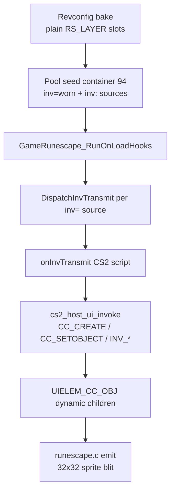

# Equipment tab (IF3 interface 387) — CS2-driven rendering

This document explains how the **Worn Equipment** sidebar (tab 4, cache interface **387**)
renders item icons via **CS2 clientscripts**, and how that replaced the earlier hardcoded
C path.

Related docs:

- [CS2 VM](cs2vm.md) — host opcodes (`cc_create`, `inv_getobj`, …)
- [UI Inventory System](ui_inventory_system.md) — click/hit-test/minimenu
- [UI Click System](ui_click_system.md) — input routing
- Offline reference: [`tools/interface161_test`](../tools/interface161_test/) with `fixtures/equipment_387.json`
- Interface dump: [`if_387.txt`](../if_387.txt) at repo root

---

## Symptom (historical)

Opening the **Worn Equipment** sidebar tab showed panel chrome but **no item icons** in
equipment slots. Toolbar graphics with `layer = -1` were also missing from the baked tree.

---

## Root cause (historical)

Interface 387 is an IF3 **shell**: `TYPE_LAYER` slot hitboxes plus `TYPE_GRAPHIC` chrome
(`inv_children=0`). Icons are **not** embedded in the cache as a `TYPE_INV` grid.

The old client faked icons by:

1. Baking eleven `UIELEM_INV_SLOT` nodes from a hardcoded file-index table in C.
2. Injecting a synthetic backpack `UIELEM_INV_GRID` for tab 149 in C.
3. Reading container 94 only at **emit** time when slot data happened to be seeded.

CS2 `onInvTransmit` scripts (`cc_deleteall` + `cc_create` + `cc_setobject` + `inv_getobj`)
were never executed, so behaviour diverged from real OSRS.

---

## Current architecture (CS2-driven)



### Revconfig / inventory bind

- Any component with `inv=<name>` registers a generic inv source (no tab 3/149 or tab 4/387 special cases).
- `instance_revconfig_inv_setup_after_build`:
  1. `instance_revconfig_inv_seed_sources_from_pool`
  2. `uitree_layout_resolve`
  3. `GameRunescape_RunOnLoadHooks`
  4. **`GameRunescape_DispatchInvTransmit` for each registered source** (simulated server transmit at load)
  5. `uitree_mark_all_dirty`

### CS2 host opcodes

Scripts on interface 387 (and backpack 149) expect:

| Opcode | Host effect |
|--------|-------------|
| `inv_getobj` / `inv_getnum` / `inv_size` | Read container 94 / 93 via `UIInvDataService` |
| `cc_create` | `uitree_cc_create` → dynamic `UIELEM_CC_OBJ` child |
| `cc_deleteall` | `uitree_cc_delete_all` on active parent |
| `cc_setobject` / `if_setobject*` | `uitree_apply_object` + icon resolve from pool |

Emit path: `UIELEM_CC_OBJ` in `runescape.c` draws the resolved `scene_id` / `atlas_index`
when `obj_id > 0`.

### What was removed

- `k_equipment_387_slot_files` and equipment-slot → `UIELEM_INV_SLOT` bake in `instance_revconfig_context.c`
- Synthetic `uitree_push_backpack_grid` for tab 149 in `instance_revconfig_inv_bind.c`
- Per-tab hardcoded `DispatchInvTransmit` — replaced by generic per-source dispatch after load

### Toolbar graphics (`layer = -1`)

Orphan `TYPE_GRAPHIC` widgets (files 02, 04, 06, 08) are still attached during DAT2 walk
when `layer == -1` so chrome bakes as `UIELEM_RS_GRAPHIC` independently of CS2 obj icons.

---

## Containers

| CS2 `inv_*` id | Revconfig name | Role |
|----------------|----------------|------|
| 93 | `inventory` | Backpack tab (interface 149) |
| 94 | `worn` | Equipment tab (interface 387) |

Test pool entries `[inv:inventory]` / `[inv:worn]` seed these containers; CS2 scripts read
them through host callbacks.

---

## Debugging

**In-game:** equipment tab after load should show icons once pool + simulated transmit run.

**Offline:**

```bash
make -C tools/interface161_test
./tools/interface161_test/interface161_test cache.kronos --iface 387 --sprites \
  --fixture tools/interface161_test/fixtures/equipment_387.json \
  --panel build/equipment_387_cs2.bmp
```

This builds a UITree, seeds container 94 from the fixture, runs `onInvTransmit` CS2 scripts,
and blits resulting `UIELEM_CC_OBJ` nodes.

**Unit tests:**

- `make -C test/cs2_runtime` — synthetic `if_find` + `inv_getobj` + `cc_create` + `cc_setobject`
- `make -C test/instance_revconfig_load` — pipeline expects CS2 obj icons under equipment tab when cache INI present

---

## CS1 vs CS2 scope

CS1 scripts (`cs1vm`) still gate visibility via varp/varbit on baked nodes. **Drawing** worn
icons is entirely CS2 + container data in the IF3 path described above.
