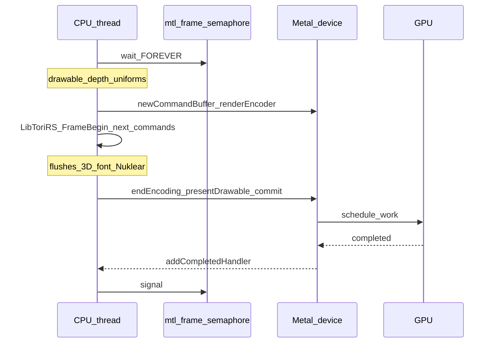
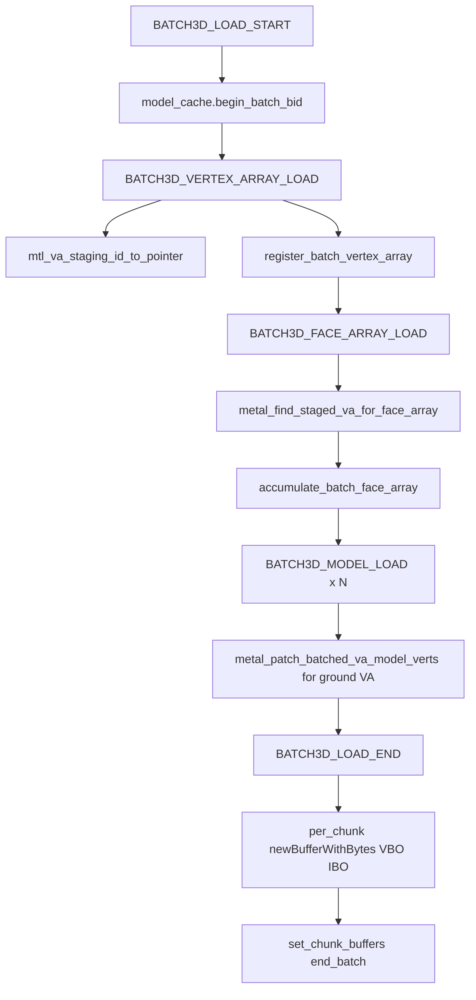
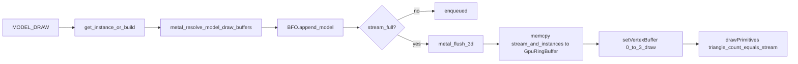
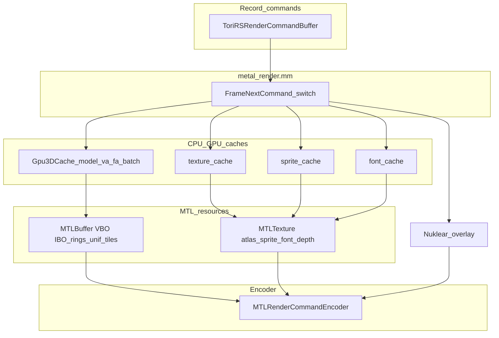

# Metal renderer: commands, buffering, and GPU transfer

This document describes how the macOS Metal backend handles each [`ToriRSRenderCommand`](../src/tori_rs_render.h), how CPU-side data is accumulated and copied, and how it reaches the GPU. Primary implementation: [`PlatformImpl2_SDL2_Renderer_Metal_Render`](../src/platforms/metal/metal_render.mm).

---

## 1. Executive summary

The game and scene layer record a sequence of `ToriRSRenderCommand` values into a [`ToriRSRenderCommandBuffer`](../src/tori_rs_render.h). Each frame, the Metal entry point acquires a drawable, builds one `MTLRenderPassDescriptor` (color + depth), creates a single [`MTLCommandBuffer`](../src/platforms/metal/metal_render.mm) and [`MTLRenderCommandEncoder`](../src/platforms/metal/metal_render.mm), then drains the command buffer in order. World 3D draws use a **draw stream** plus **per-instance transforms** (see [`BufferedFaceOrder`](../src/platforms/common/buffered_face_order.h) and [`Shaders.metal`](../src/Shaders.metal)) written into per-frame ring buffers. 2D paths (sprites, bitmap fonts) use separate pipeline states and shared `MTLBuffer` scratch for quads or batched font vertices. After commands, the Nuklear UI is drawn in the **same** encoder with a full-frame viewport. Finally the buffer is presented and committed; a frame semaphore synchronizes CPU ring-buffer reuse with GPU completion.

---

## 2. Frame lifecycle and GPU synchronization

### 2.1 Order of operations

1. **Wait for prior GPU work** — [`dispatch_semaphore_wait`](../src/platforms/metal/metal_render.mm) on `mtl_frame_semaphore` with `DISPATCH_TIME_FOREVER`. This prevents the CPU from resetting **in-flight** ring buffer write state (see below) while the GPU may still read those buffers for the previous frame (“Bug B” comment in [`metal_render.mm`](../src/platforms/metal/metal_render.mm)).

2. **Drawable and depth** — Resolve `CAMetalLayer`, [`sync_drawable_size`](../src/platforms/metal/metal_render.mm), set `drawableSize`, call `nextDrawable`. If there is no layer or drawable, the semaphore is **signaled** and the function returns early (no encoding).

3. **Depth texture** — If size changed, release the old depth `MTLTexture` and allocate a new `MTLPixelFormatDepth32Float` render target with `MTLStorageModePrivate` ([`metal_render.mm`](../src/platforms/metal/metal_render.mm)).

4. **Viewport and uniforms** — Compute logical viewport and GL-style pixel viewport ([`compute_logical_viewport_rect`](../src/platforms/metal/metal_internal.h), [`compute_gl_world_viewport_rect`](../src/platforms/metal/metal_internal.h)). Fill [`MetalUniforms`](../src/platforms/metal/metal_internal.h): view matrix from camera pitch/yaw, projection from FOV and logical size, then [`metal_remap_projection_opengl_to_metal_z`](../src/platforms/metal/metal_internal.h), `uClock` from `SDL_GetTicks64()`. **Copy** into the shared uniform `MTLBuffer` via `memcpy(unifBuf.contents, &uniforms, sizeof(uniforms))`.

5. **Encoder** — Create `MTLCommandBuffer`, `MTLRenderCommandEncoder` with color clear (opaque black) and depth clear to `1.0`. Set `MTLCullModeNone`. Build [`MTLViewport`](../src/platforms/metal/metal_render.mm) with **Y origin flipped** for the 3D world pass: `metal_origin_y = height - gl_vp.y - gl_vp.height` (Metal’s viewport origin is top-left; the GL-style rect is bottom-up).

6. **Frame / RS integration** — [`LibToriRS_FrameBegin`](../src/tori_rs_frame.u.c), then per-frame **inflight slot** `slot = mtl_encode_slot % kMetalInflightFrames` ([`kMetalInflightFrames = 3`](../src/platforms/metal/metal.h)): reset `mtl_run_uniform_ring_write_offset[slot]`, and call `mtl_draw_stream_ring.begin_slot(slot)` and `mtl_instance_xform_ring.begin_slot(slot)` on the [`GpuRingBuffer`](../src/platforms/metal/metal.h) members.

7. **Command loop** — [`LibToriRS_FrameNextCommand`](../src/tori_rs_frame.u.c) with `&cmd` until false; dispatch via `switch (cmd.kind)` (see §3).

8. **Guaranteed flushes** — After the loop: [`metal_flush_3d`](../src/platforms/metal/metal_render_context.mm) and [`metal_flush_2d`](../src/platforms/metal/metal_render_context.mm) so any remaining 3D or 2D (sprite + font) geometry is encoded.

9. **Nuklear** — Full-frame viewport, [`render_nuklear_overlay`](../src/platforms/metal/metal_internal.h), then [`LibToriRS_FrameEnd`](../src/tori_rs_frame.u.c).

10. **Submit** — `endEncoding`, `presentDrawable:`, [`addCompletedHandler`](../src/platforms/metal/metal_render.mm) that `dispatch_semaphore_signal`s the same `mtl_frame_semaphore`, then `commit`. Increment `mtl_encode_slot`.

### 2.2 Sequence diagram



---

## 3. Per-command reference

Enum: [`ToriRSRenderCommandKind`](../src/tori_rs_render.h). Dispatch: [`metal_render.mm`](../src/platforms/metal/metal_render.mm) (switch on `cmd.kind`).

| Kind | Metal handler or behavior | Effect (summary) | Payload |
|------|---------------------------|------------------|---------|
| `TORIRS_GFX_NONE` | `default` → `break` | No operation | — |
| `TORIRS_GFX_FONT_LOAD` | [`metal_frame_event_font_load`](../src/platforms/metal/metal_atlas_font.mm) | Register font atlas: batched pack or standalone `MTLTexture` | `_font_load` |
| `TORIRS_GFX_MODEL_LOAD` | [`metal_frame_event_model_load`](../src/platforms/metal/metal_model_events.mm) | Load into [`Gpu3DCache`](../src/platforms/gpu_3d_cache.h) if not present | `_model_load` |
| `TORIRS_GFX_MODEL_UNLOAD` | [`metal_frame_event_model_unload`](../src/platforms/metal/metal_model_events.mm) | Release non-batched GPU buffers; evict cache | `_model_load` (id key) |
| `TORIRS_GFX_TEXTURE_LOAD` | [`metal_frame_event_texture_load`](../src/platforms/metal/metal_atlas_world.mm) | Copy texels into world RGBA atlas; set tile metadata buffer | `_texture_load` |
| `TORIRS_GFX_SPRITE_LOAD` | [`metal_frame_event_sprite_load`](../src/platforms/metal/metal_atlas_sprite.mm) | Standalone texture or add to open sprite batch | `_sprite_load` |
| `TORIRS_GFX_SPRITE_UNLOAD` | [`metal_frame_event_sprite_unload`](../src/platforms/metal/metal_atlas_sprite.mm) | Evict sprite entry; `CFRelease` if standalone | `_sprite_load` |
| `TORIRS_GFX_MODEL_DRAW` | [`metal_frame_event_model_draw`](../src/platforms/metal/metal_draw_model.mm) | Append to [`BufferedFaceOrder`](../src/platforms/common/buffered_face_order.h); may flush | `_model_draw` |
| `TORIRS_GFX_SPRITE_DRAW` | [`metal_frame_event_sprite_draw`](../src/platforms/metal/metal_atlas_sprite.mm) | Append quad to [`BufferedSprite2D`](../src/platforms/common/buffered_sprite_2d.h); records order in [`Buffered2DOrder`](../src/platforms/common/buffered_2d_order.h) (no per-draw flush). Flushed at `END_2D` / `CLEAR_RECT` via [`metal_flush_2d`](../src/platforms/metal/metal_render_context.mm) in recorded sprite/font order | `_sprite_draw` |
| `TORIRS_GFX_FONT_DRAW` | [`metal_frame_event_font_draw`](../src/platforms/metal/metal_atlas_font.mm) | Append glyphs to [`BufferedFont2D`](../src/platforms/common/buffered_font_2d.h); each draw ends with `close_open_segment` so order is recorded in [`Buffered2DOrder`](../src/platforms/common/buffered_2d_order.h). Flushed at `END_2D` / `CLEAR_RECT` | `_font_draw` |
| `TORIRS_GFX_CLEAR_RECT` | [`metal_frame_event_clear_rect`](../src/platforms/metal/metal_render_context.mm) | [`metal_flush_2d`](../src/platforms/metal/metal_render_context.mm) first, then scissored **depth** draw (`torirsClearRectDepthVert` / `mtl_clear_rect_depth_pipeline`, depth write, color write mask none), then scissored **color** quad (`torirsClearRectFrag` / `mtl_clear_rect_pipeline`); verts use `mtl_clear_quad_buf` slots (not `spriteQuadBuf`) | `_clear_rect` |
| `TORIRS_GFX_BEGIN_3D` | inline | `bfo3d.begin_pass()`; set pass state | — |
| `TORIRS_GFX_END_3D` | [`metal_flush_3d`](../src/platforms/metal/metal_render_context.mm) + `bfo3d.begin_pass()` | Flush accumulated 3D; reset BFO for next segment | — |
| `TORIRS_GFX_BEGIN_2D` | inline | Clears [`BufferedSprite2D`](../src/platforms/common/buffered_sprite_2d.h), [`BufferedFont2D`](../src/platforms/common/buffered_font_2d.h), and [`Buffered2DOrder`](../src/platforms/common/buffered_2d_order.h); resets interleave split flags | — |
| `TORIRS_GFX_END_2D` | [`metal_flush_2d`](../src/platforms/metal/metal_render_context.mm) | Uploads batched verts then replays [`Buffered2DOrder`](../src/platforms/common/buffered_2d_order.h): each op is one sprite group (UI pipe, atlas/scissor) or one font group (font pipe), preserving command-stream order | — |
| `TORIRS_GFX_BATCH3D_LOAD_START` | [`metal_frame_event_batch_model_load_start`](../src/platforms/metal/metal_batch3d.mm) | [`Gpu3DCache::begin_batch`](../src/platforms/gpu_3d_cache.h) | `_batch` |
| `TORIRS_GFX_BATCH3D_LOAD_END` | [`metal_frame_event_batch_model_load_end`](../src/platforms/metal/metal_batch3d.mm) | `newBufferWithBytes` per chunk; `end_batch` or `unload_batch` | `_batch` |
| `TORIRS_GFX_BATCH3D_CLEAR` | [`metal_frame_event_batch_model_clear`](../src/platforms/metal/metal_batch3d.mm) | `CFRelease` chunk VBO/IBO; `unload_batch` | `_batch` |
| `TORIRS_GFX_BATCH3D_MODEL_LOAD` | [`metal_frame_event_model_batched_load`](../src/platforms/metal/metal_batch3d.mm) | [`metal_dispatch_model_load`](../src/platforms/metal/metal_model_geometry.mm) + optional VA patch | `_model_load` |
| `TORIRS_GFX_BATCH3D_VERTEX_ARRAY_LOAD` | [`metal_frame_event_batch_vertex_array_load`](../src/platforms/metal/metal_va_fa_events.mm) | Staging + cache registration | `_vertex_array_load` |
| `TORIRS_GFX_BATCH3D_FACE_ARRAY_LOAD` | [`metal_frame_event_batch_face_array_load`](../src/platforms/metal/metal_va_fa_events.mm) | Expand FA to triangles into batch | `_face_array_load` |
| `TORIRS_GFX_MODEL_ANIMATION_LOAD` | [`metal_frame_event_model_animation_load`](../src/platforms/metal/metal_model_events.mm) | Build/register animation frame | `_animation_load` |
| `TORIRS_GFX_BATCH3D_MODEL_ANIMATION_LOAD` | (same function) | Same as animation load (payload differs by producer) | `_animation_load` |
| `TORIRS_GFX_BATCH_SPRITE_LOAD_START` | [`metal_frame_event_batch_sprite_load_start`](../src/platforms/metal/metal_atlas_font.mm) | `sprite_cache.begin_batch` (2048×2048) | `_batch` |
| `TORIRS_GFX_BATCH_SPRITE_LOAD_END` | [`metal_frame_event_batch_sprite_load_end`](../src/platforms/metal/metal_atlas_font.mm) | Pack atlas, upload `MTLTexture`, `set_batch_atlas_handle` | `_batch` |
| `TORIRS_GFX_BATCH_FONT_LOAD_START` | [`metal_frame_event_batch_font_load_start`](../src/platforms/metal/metal_atlas_font.mm) | `font_cache.begin_batch` (1024×1024) | `_batch` |
| `TORIRS_GFX_BATCH_FONT_LOAD_END` | [`metal_frame_event_batch_font_load_end`](../src/platforms/metal/metal_atlas_font.mm) | Pack atlas, upload, set batch atlas | `_batch` |
| `TORIRS_GFX_BATCH_TEXTURE_LOAD_START` | [`metal_frame_event_batch_texture_load_start`](../src/platforms/metal/metal_atlas_world.mm) | `texture_cache.begin_batch` | `_batch` |
| `TORIRS_GFX_BATCH_TEXTURE_LOAD_END` | [`metal_frame_event_batch_texture_load_end`](../src/platforms/metal/metal_atlas_world.mm) | `texture_cache.end_batch` | `_batch` |

**Pass and flush rules**

- `END_3D` flushes 3D (`metal_flush_3d`) and starts a new empty BFO pass. `END_2D` flushes **2D** (`metal_flush_2d`: replays [`Buffered2DOrder`](../src/platforms/common/buffered_2d_order.h) so sprite and font groups encode in command order).
- After the entire command stream, the renderer **always** calls `metal_flush_3d` then `metal_flush_2d` again ([`metal_render.mm`](../src/platforms/metal/metal_render.mm)) so trailing 3D is encoded before any remaining batched 2D (HUD on top).
- `TORIRS_GFX_CLEAR_RECT` matches OpenGL-style behavior: flush pending 2D, then in the clamped scissor clear **depth** (to `1.0`, same as the main pass `depthAttachment.clearDepth`) via a depth-writing draw, then clear **color** to transparent with the clear-rect pipeline. Clear geometry is uploaded to `mtl_clear_quad_buf` (per-frame slot ring) so it does not alias batched sprite vertex data.

---

## 4. 3D: loading geometry and transferring to the GPU

### 4.1 `Gpu3DCache` (CPU metadata + batch staging)

[`Gpu3DCache`](../src/platforms/gpu_3d_cache.h) stores:

- **Dense tables** for `scene2_gpu_id` (vertex arrays, face arrays) and `model_id` (up to [`kGpuIdTableSize = 65536`](../src/platforms/gpu_3d_cache.h)).
- **Per-model** [`ModelBufferRange`](../src/platforms/gpu_3d_cache.h): byte offset into a VBO (or into a batch chunk), index range, face metadata, links to batched VA/FA ids when applicable.
- **Batches**: up to [`kMaxBatches = 64`](../src/platforms/gpu_3d_cache.h) open/closed groups. Each batch has one or more [`BatchChunk`](../src/platforms/gpu_3d_cache.h) entries holding [`BatchLoadBuffer<uint8_t> pending_verts`](../src/platforms/common/batch_load_buffer.h) and [`BatchLoadBuffer<uint32_t> pending_indices`](../src/platforms/common/batch_load_buffer.h). **Chunk rollover** happens in [`roll_chunk_if_needed`](../src/platforms/gpu_3d_cache.h) when vert or index count would exceed per-chunk caps.

**Transfer at batch end:** [`metal_frame_event_batch_model_load_end`](../src/platforms/metal/metal_batch3d.mm) iterates chunks with non-zero pending bytes/indices, builds:

```objc
[ctx->device newBufferWithBytes:pv length:vb options:MTLResourceStorageModeShared]
```

for vertices and the same for the index `uint32_t` array, then [`set_chunk_buffers`](../src/platforms/gpu_3d_cache.h) and clears the CPU staging with [`clear_shrink`](../src/platforms/common/batch_load_buffer.h). Buffers use **shared** storage so CPU can fill without a blit (typical for integrated or small uploads).

### 4.2 Model-type dispatch: `metal_dispatch_model_load`

[`metal_dispatch_model_load`](../src/platforms/metal/metal_model_geometry.mm) branches on `dashmodel__type`:

| Dash type | Function | GPU mesh upload? |
|-----------|----------|------------------|
| `DASHMODEL_TYPE_GROUND_VA` | [`metal_load_va_model`](../src/platforms/metal/metal_model_geometry.mm) | **No** `newBufferWithBytes` for the landmesh here; registers **references** from existing FA/VA data already merged into a batch (or non-batch [`register_va_model`](../src/platforms/gpu_3d_cache.h)) |
| `DASHMODEL_TYPE_GROUND` / `DASHMODEL_TYPE_FULL` | [`metal_load_owning_model`](../src/platforms/metal/metal_model_geometry.mm) | **Yes** (non-batch): calls [`build_model_instance`](../src/platforms/metal/metal_model_geometry.mm); **batch**: [`accumulate_batch_model`](../src/platforms/gpu_3d_cache.h) with baked `MetalVertex` CPU arrays |

**Standalone `build_model_instance`** bakes every face to three [`MetalVertex`](../src/platforms/metal/metal_internal.h) records, then creates VBO+IBO with `newBufferWithBytes` and [`register_instance`](../src/platforms/gpu_3d_cache.h).

**Non-batch `MODEL_LOAD`** ([`metal_frame_event_model_load`](../src/platforms/metal/metal_model_events.mm)): only calls `metal_dispatch_model_load` if `!get_instance(mid, 0, 0)`; for ground-VA, requires `vertex_array` and `face_array` or returns early; for other models, checks color/vertex/index pointers and positive face count.

### 4.3 Batch world rebuild: VA / FA / models



- **Vertex array load** ([`metal_frame_event_batch_vertex_array_load`](../src/platforms/metal/metal_va_fa_events.mm)): requires `current_model_batch_id != 0`. Stores `va` in `mtl_va_staging[va_id]` and registers a **logical** [`VertexArrayEntry`](../src/platforms/gpu_3d_cache.h) with a null handle (`register_batch_vertex_array`).

- **Face array load** ([`metal_frame_event_batch_face_array_load`](../src/platforms/metal/metal_va_fa_events.mm)): finds a staged [`DashVertexArray`](../src/platforms/metal/metal_va_fa_events.mm) whose `vertex_count` is **just large enough** to cover all FA index references (minimize vertex count among candidates). If **none** matches, logs `[metal] BATCH3D_FACE_ARRAY_LOAD: no matching staged vertex array` and returns. Otherwise expands each face with [`fill_face_corner_vertices_from_fa`](../src/platforms/metal/metal_model_geometry.mm) and [`accumulate_batch_face_array`](../src/platforms/gpu_3d_cache.h).

- **Batched model load** ([`metal_frame_event_model_batched_load`](../src/platforms/metal/metal_batch3d.mm)): `metal_dispatch_model_load(..., true, bid)`; for [`dashmodel__is_ground_va`](../src/platforms/metal/metal_batch3d.mm), calls [`metal_patch_batched_va_model_verts`](../src/platforms/metal/metal_va_fa_events.mm) to align P/M/N ref rows and **rewrite** the pending vert slice in the batch chunk for that model’s face range.

- **Batch end** special cases: missing batch, `nchunks <= 0`, or `!any` pending data → [`unload_batch`](../src/platforms/gpu_3d_cache.h) and clear `current_model_batch_id`.

### 4.4 `BATCH3D_CLEAR` and `MODEL_UNLOAD`

- [`metal_frame_event_batch_model_clear`](../src/platforms/metal/metal_batch3d.mm) releases each chunk’s VBO/IBO with `CFRelease` and calls `unload_batch`.

- [`metal_frame_event_model_unload`](../src/platforms/metal/metal_model_events.mm): for **non-batched** models only, iterates animation frames and `CFRelease` owned VBO/IBO handles, then `unload_model`.

### 4.5 Animation load

[`metal_frame_event_model_animation_load`](../src/platforms/metal/metal_model_events.mm) calls [`build_model_instance`](../src/platforms/metal/metal_model_geometry.mm) for `(model_gpu_id, anim_id, frame_index)` if that cache slot is empty.

---

## 5. 3D: `MODEL_DRAW` and `metal_flush_3d`

### 5.1 Resolve GPU buffers

[`metal_frame_event_model_draw`](../src/platforms/metal/metal_draw_model.mm) validates model pointers and face/vertex data, decodes `model_key` to `anim_id` and `frame_index` ([`torirs_model_cache_key_decode`](../src/tori_rs_render.h)). It obtains [`ModelBufferRange`](../src/platforms/gpu_3d_cache.h) via `get_instance` or [`build_model_instance`](../src/platforms/metal/metal_model_geometry.mm). **Fallback:** if build fails and anim/frame was non-zero, it retries `(0,0)`; if that still fails, returns.

[`metal_resolve_model_draw_buffers`](../src/platforms/metal/metal_draw_model.mm) sets [`MetalDrawBuffersResolved`](../src/platforms/metal/metal_internal.h):

- If `range->fa_gpu_id >= 0` and the FA is **batched**, the VBO handle comes from `get_batch_vbo_for_chunk(batch_id, chunk)`.
- Else if the FA is standalone, `vbuf` from the FA entry.
- Else for batched non-FA model without owning `range->buffer`, use `get_batch_vbo_for_model`.
- Otherwise use `range->buffer` (standalone baked VBO).

Y-axis rotation uses [`Gpu3DAngleEncoding`](../src/platforms/gpu_3d_cache.h) on the model entry; [`metal_prebake_model_yaw_cos_sin`](../src/platforms/metal/metal_internal.h) supplies `cos_yaw` / `sin_yaw` for the instance struct.

### 5.2 `BufferedFaceOrder` and ring upload

[`append_model`](../src/platforms/common/buffered_face_order.h) runs `dash3d_prepare_projected_face_order` / `dash3d_projected_face_order` (CPU culling and sort), builds one [`InstanceXform`](../src/platforms/common/buffered_face_order.h) per model, and appends one [`DrawStreamEntry`](../src/platforms/common/buffered_face_order.h) per **corner** (3 per visible triangle) with `vertex_index` and `instance_id`. Slices group consecutive draws that share the same VBO and batch chunk. **If instances reach [`kMaxInstancesPerPass` (4096)](../src/platforms/common/buffered_face_order.h)**, `append_model` returns false; the driver loop **flushes** 3D, `begin_pass`, and retries ([`metal_draw_model.mm`](../src/platforms/metal/metal_draw_model.mm)).

### 5.3 `metal_flush_3d` encoding

[`metal_flush_3d`](../src/platforms/metal/metal_render_context.mm) calls `finalize_slices`, `memcpy` of `DrawStreamEntry` and `InstanceXform` streams into the current slot of `mtl_draw_stream_ring` and `mtl_instance_xform_ring`, then for each non-empty [`PassFlushSlice`](../src/platforms/common/buffered_face_order.h):

- `setVertexBuffer:vbo` at **index 0** (baked `MetalVertex` data),
- `setVertexBuffer:unifBuf` at **index 1**,
- `setVertexBuffer:instBuf` with instance ring offset at **index 2**,
- `setVertexBuffer:streamBuf` with slice offset at **index 3**,
- `setFragmentBuffer:unifBuf` at **index 1**,
- [`drawPrimitives:MTLPrimitiveTypeTriangle vertexStart:0 vertexCount:slice.entry_count`](../src/platforms/metal/metal_render_context.mm)

**Critical detail:** The vertex count passed to `drawPrimitives` is the number of **stream entries** (3 per output triangle), not the number of mesh vertices. The vertex shader uses `vertex_id` to index the draw stream, which then indexes the static VBO ([`Shaders.metal`](../src/Shaders.metal)).



### 5.4 Pipeline and bindings for 3D

[`metal_ensure_pipe`](../src/platforms/metal/metal_render_context.mm) when switching to [`kMTLPipe3D`](../src/platforms/metal/metal_internal.h): may flush previous 3D BFO; sets `metalVp`, main pipeline, depth state, cull mode; binds [`worldAtlasTex`](../src/platforms/metal/metal_atlas_world.mm) at texture 0, [`worldAtlasTilesBuf`](../src/platforms/metal/metal_atlas_world.mm) at **fragment** buffer 4, sampler 0. This matches the fragment side of [`Shaders.metal`](../src/Shaders.metal) (`atlas` + `tiles`). Switching between UI and font pipes does **not** flush 2D batches mid-stream (that happens at `END_2D` / `CLEAR_RECT` via [`metal_flush_2d`](../src/platforms/metal/metal_render_context.mm)).

---

## 6. World textures (`TEXTURE_LOAD` and batch bookends)

[`metal_frame_event_texture_load`](../src/platforms/metal/metal_atlas_world.mm) ensures [`metal_world_atlas_init`](../src/platforms/metal/metal_atlas_world.mm) (shared RGBA8 texture + `MetalAtlasTile` UBO, [`MetalAtlasTile`](../src/platforms/metal/metal_atlas_world.mm) stride via buffer). Pixels are expanded from game format to RGBA in CPU scratch, then `replaceRegion` into the next **shelf** slot ([`metal_world_atlas_alloc_rect`](../src/platforms/metal/metal_atlas_world.mm)). Tile metadata: UV rect, animation from [`metal_texture_animation_signed`](../src/platforms/metal/metal_internal.h), opacity flag. **Special cases:** `tex_id` not in `0..255` or null texture → return; **atlas full** → stderr, skip; `texture_cache.register_texture` links logical id to atlas.

[`metal_frame_event_batch_texture_load_start/end`](../src/platforms/metal/metal_atlas_world.mm) only call `texture_cache.begin_batch` / `end_batch` (no direct Metal resource work in that file; batching is in the cache layer).

---

## 7. Sprites and fonts (2D)

**Indexing:** 2D sprite and font flushes encode **non-indexed** triangle lists (six vertices per quad). [`metal_flush_2d`](../src/platforms/metal/metal_render_context.mm) calls `drawPrimitives` with `vertexCount` equal to the number of **vertices** in the group, not the number of primitives. There is no separate IBO/EBO for UI sprites or fonts; backends that want indexed quads would need an explicit layout change.

**Shared CPU helpers** (also used by the D3D11 SDL renderer for the same conventions): [`torirs_gpu_clipspace.h`](../src/platforms/common/torirs_gpu_clipspace.h) (logical pixel → clip NDC), [`torirs_sprite_argb_rgba.c`](../src/platforms/common/torirs_sprite_argb_rgba.c) (ARGB packed → RGBA8 for uploads), [`torirs_font_glyph_quad.c`](../src/platforms/common/torirs_font_glyph_quad.c) (font glyph quad in clip space), [`torirs_sprite_draw_cpu.h`](../src/platforms/common/torirs_sprite_draw_cpu.h) (inverse-rot fragment constants; Dash `g_cos`/`g_sin`–based rotated dst corners for CPU-rotation paths).

### 7.1 Sprites

**Load** ([`metal_frame_event_sprite_load`](../src/platforms/metal/metal_atlas_sprite.mm)): If a sprite with the same cache key already exists, release old standalone texture. If an open **sprite** batch is active matching `current_sprite_batch_id`, pixels go to `sprite_cache.add_to_batch`. Otherwise a dedicated `MTLTexture` is created (`MTLPixelFormatRGBA8Unorm`, `MTLStorageModeShared`, `replaceRegion`).

**Unload** — `CFRelease` standalone texture handle, `unload_sprite`.

**Draw** — [`metal_sprite_draw_impl`](../src/platforms/metal/metal_atlas_sprite.mm) requires `uiPipeState`. **src bounding box** must lie inside the sprite; otherwise stderr and return. **Rotated** path: axis-aligned clip-space quad with logical-pixel varyings; fragment shader applies inverse rotation using constants from [`torirs_sprite_inverse_rot_params_from_cmd`](../src/platforms/common/torirs_sprite_draw_cpu.cpp) (D3D11 instead rotates corners on the CPU using [`torirs_sprite_rotated_dst_corners_logical_px`](../src/platforms/common/torirs_sprite_draw_cpu.cpp) so both use the same Dash cosine/sine tables). No per-sprite scissor on rotated draws. Six clip-space+UV vertices are appended to [`BufferedSprite2D`](../src/platforms/common/buffered_sprite_2d.h); at `END_2D` / `CLEAR_RECT`, [`metal_flush_2d`](../src/platforms/metal/metal_render_context.mm) uploads to `spriteQuadBuf` and draws each sprite group when replaying [`Buffered2DOrder`](../src/platforms/common/buffered_2d_order.h) (chunked if over VBO size).

### 7.2 Fonts

**Load** — Standalone: create `MTLTexture` from `atlas->rgba_pixels` if not cached. **Batch:** [`font_cache.add_to_batch`](../src/platforms/metal/metal_atlas_font.mm) while `current_font_batch_id` matches an open font batch.

**End sprite/font batches** — [`metal_frame_event_batch_sprite_load_end`](../src/platforms/metal/metal_atlas_font.mm) / [`metal_frame_event_batch_font_load_end`](../src/platforms/metal/metal_atlas_font.mm): `finalize_batch`, then upload a packed atlas. Sprite end converts packed ARGB batch pixels to RGBA8 via [`torirs_copy_sprite_argb_pixels_to_rgba8`](../src/platforms/common/torirs_sprite_argb_rgba.c) into scratch, then `replaceRegion`; font end uses **`atlas->pixels` directly** in `replaceRegion` (different from standalone font load which copies from `rgba_pixels`).

**Draw** — [`metal_frame_event_font_draw`](../src/platforms/metal/metal_atlas_font.mm): expands color tags, builds 6-vertex (two-triangle) quads into [`BufferedFont2D`](../src/platforms/common/buffered_font_2d.h) (8 floats per vertex). `BufferedFont2D::set_font` starts a new draw group when the font/atlas changes; pipeline state is set per group during [`metal_flush_2d`](../src/platforms/metal/metal_render_context.mm).

`END_2D` and the final frame flush call [`metal_flush_2d`](../src/platforms/metal/metal_render_context.mm) to submit remaining sprite and font geometry in [`Buffered2DOrder`](../src/platforms/common/buffered_2d_order.h) order.

---

## 8. Vertex baking and fragment special cases

- **Standard models** — [`fill_model_face_vertices_model_local`](../src/platforms/metal/metal_model_geometry.mm) fills [`MetalVertex`](../src/platforms/metal/metal_internal.h) with `uv_mode = kMetalVertexUvMode_Standard`, [`uv_pnm_compute`](../src/graphics/uv_pnm.h) for textured faces; ground VA can use a different P/M/N corner policy for P/M/N.
- **Skip / invisible** — Face info `2`, hidden HSL, bad indices, or failed fill: [`metal_vertex_fill_invisible`](../src/platforms/metal/metal_model_geometry.mm) (zero with alpha 0, `tex_id` `0xFFFF`).
- **VA/FA world mesh** — [`fill_face_corner_vertices_from_fa`](../src/platforms/metal/metal_model_geometry.mm) sets `uv_mode = kMetalVertexUvMode_VaFractTile` for Fract U/V in the fragment shader.
- **Fragment** ([`Shaders.metal`](../src/Shaders.metal)) — `tex_id >= 256` → return vertex color only (untextured). Otherwise sample atlas using `uv_mode` 0 (clamp U, fract+inset V, scroll) vs 1 (tile U and V with fract, scroll). Opaque/alpha from tile and texture sample.

---

## 9. Reserved: run uniform ring

[`MetalRenderCtx::runRingBuf`](../src/platforms/metal/metal_internal.h) is filled with [`mtl_run_uniform_ring[slot]`](../src/platforms/metal/metal_render.mm) and [`mtl_run_uniform_ring_write_offset`](../src/platforms/metal/metal_render.mm) is reset each frame. [`metal_init.mm`](../src/platforms/metal/metal_init.mm) allocates `kMetalRunUniformStride * 8192` per slot. **No** [`setVertexBuffer` / `setFragmentBuffer`](../src/platforms/metal/metal_render_context.mm) in the 3D flush path uses this buffer today, and [`Shaders.metal`](../src/Shaders.metal) does not bind it. Treat as **reserved** for per-draw or per-triangle “run” uniforms (see [`MetalRunUniform`](../src/platforms/metal/metal_internal.h)).

---

## 10. Architecture diagram



---

## 11. File index (quick reference)

| Topic | File |
|------|------|
| Command kinds and union payloads | [src/tori_rs_render.h](../src/tori_rs_render.h) |
| Main frame, switch, Nuklear, present | [src/platforms/metal/metal_render.mm](../src/platforms/metal/metal_render.mm) |
| 3D flush, pipe, font flush | [src/platforms/metal/metal_render_context.mm](../src/platforms/metal/metal_render_context.mm) |
| Model draw, buffer resolve | [src/platforms/metal/metal_draw_model.mm](../src/platforms/metal/metal_draw_model.mm) |
| Bake, dispatch load, `build_model_instance` | [src/platforms/metal/metal_model_geometry.mm](../src/platforms/metal/metal_model_geometry.mm) |
| Batch load end/clear, bathed model | [src/platforms/metal/metal_batch3d.mm](../src/platforms/metal/metal_batch3d.mm) |
| VA/FA batch events, VA patch | [src/platforms/metal/metal_va_fa_events.mm](../src/platforms/metal/metal_va_fa_events.mm) |
| Model/animation load/unload | [src/platforms/metal/metal_model_events.mm](../src/platforms/metal/metal_model_events.mm) |
| World atlas, texture load, batch | [src/platforms/metal/metal_atlas_world.mm](../src/platforms/metal/metal_atlas_world.mm) |
| Sprites | [src/platforms/metal/metal_atlas_sprite.mm](../src/platforms/metal/metal_atlas_sprite.mm) |
| Fonts, sprite/font batch | [src/platforms/metal/metal_atlas_font.mm](../src/platforms/metal/metal_atlas_font.mm) |
| GPU cache template | [src/platforms/gpu_3d_cache.h](../src/platforms/gpu_3d_cache.h) |
| BFO, draw stream | [src/platforms/common/buffered_face_order.h](../src/platforms/common/buffered_face_order.h) |
| Logical pixel → clip NDC | [src/platforms/common/torirs_gpu_clipspace.h](../src/platforms/common/torirs_gpu_clipspace.h) |
| Sprite ARGB → RGBA8 upload | [src/platforms/common/torirs_sprite_argb_rgba.c](../src/platforms/common/torirs_sprite_argb_rgba.c) |
| Font glyph quad (clip space) | [src/platforms/common/torirs_font_glyph_quad.c](../src/platforms/common/torirs_font_glyph_quad.c) |
| Sprite inverse-rot params / CPU rotated corners | [src/platforms/common/torirs_sprite_draw_cpu.cpp](../src/platforms/common/torirs_sprite_draw_cpu.cpp) |
| Vertex / uniform layouts, helpers | [src/platforms/metal/metal_internal.h](../src/platforms/metal/metal_internal.h) |
| Shaders | [src/Shaders.metal](../src/Shaders.metal) |

---

*Generated to match the Metal implementation in the 3draster tree; if behavior drifts, compare against the files above first.*
