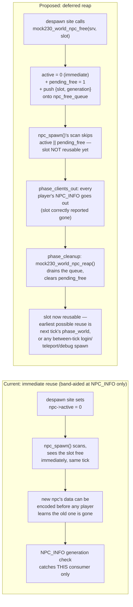
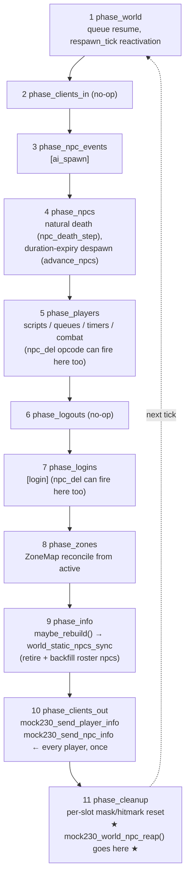

# mock230 npc slot reap — deferred index recycling

Status: **plan, not yet implemented.** This document is the design for a follow-up
fix; the code described in "Proposed design" below does not exist yet. What
*is* already in the tree is the band-aid described in "Current state".

## Background

`npc_spawn()` (`src/net/mock/mock230_world.c:2424`) hands out `srv->npcs[]`
slots by scanning for the first `!active` entry. Nothing stops it from
reusing a slot **inside the same tick** it was freed — before
`mock230_send_npc_info()` (`src/net/mock/mock230_encode.c`) has told any
observing player the old occupant is gone. When that happens, a client who
already had the old npc tracked receives an ordinary "still tracked, walked/
unchanged" update built from the *new* npc's data — including that npc's own
mask flags, so a same-tick hit on the new npc renders as a hitsplat on the
client's stale entity. Reported symptom: "when NPCs spawn in or out, the
client mis-assigns damage to the newly spawned npc."

`npc_spawn()` already carries a comment naming this exact hazard class (it's
why `mock230_zone_npc_refile` is called before a slot is reused — but that
only fixes the ZoneMap's copy of the problem, not NPC_INFO's).

### What the real client does about it

Checked directly against the deobfuscated revision-239 client
(`~/Documents/git_repos/Deobfuscator/src_osrs239_rl1_12_33`, `Statics.java`,
`method13029`/`method9992`/`method10144`): the NPC_INFO decoder has **no
identity check at all**. The "already tracked" loop recovers which npc a
list position means purely by re-reading its own local backing array from
last cycle and looking that index up in a hash table keyed by the raw slot
number — nothing on the wire, and nothing on the NPC object itself
(`class86`'s field chain has no generation/serial field anywhere), can tell
the client "the entity now at this slot changed." The client's only
protection is structural, on the *server* side of a correct implementation:
a freed slot must never become visible as "still tracked, continuing" before
every observer has been told it's gone. The real client mirrors this on its
own side only in the sense that *removal itself* is deferred: it marks a
removed npc (`field1244 = true`) and unlinks it in a final sweep
(`client.field956[]`, drained at the end of `method13029`) that runs *after*
the same packet's "entering view" phase — i.e. even the client doesn't act
on a removal until the whole packet has been read.

## Current state (already in the tree)

A band-aid landed in `mock230_encode.c`: `player->tracked_generation[]`
tags each `player->tracked[]` entry with `npc->generation` as of the tick it
was written. The "already tracked" loop in both NPC_INFO encoders (v5 and
classic) folds `npc->generation == player->tracked_generation[i]` into its
`in_range` test, so a slot that changed occupant reads as "gone" (remove
sent, slotmap name released) instead of a silent continuation.

This works, but it's reactive and scoped to one consumer (NPC_INFO). It
doesn't stop the underlying event — a slot *does* still get reused
same-tick — it only stops NPC_INFO specifically from being fooled by it.
Anything else that reads `srv->npcs[slot]` across the same window (combat
targeting, `npc_find`, huntall, the ZoneMap) has to defend itself the same
way, piecemeal. Some of that already exists too (`combat_target_npc_gen`,
`mock230_zone_npc_refile`) — the codebase has been patching this hazard
class site by site rather than closing it once.

## Proposed design: defer slot reuse, not just detect it

Mirror the real client's own discipline, on the server: a despawned npc's
**identity flag (`active`) still clears immediately** — same-tick game logic
(`npc_find`, `huntall`, `npc_hastarget`, …) must keep seeing it as gone the
instant it dies, that part is already correct and does not change. What
changes is the npc's **eligibility to be handed to `npc_spawn()`'s free-slot
scan**: that's deferred until a dedicated reap step runs, once per tick,
*after* `mock230_send_npc_info` has already gone out to every player.

This is the "reader emits commands, a consumer applies them later" split
already used for NPC_INFO decode itself (`pkt_npc_info_reader_read` →
`PktNpcInfoOp[]` → `task_exec_entity_info.c`) and for the real client's own
`field956` removal queue: a despawn site doesn't free a slot directly, it
**emits a free command** onto a small queue; a single **reap** call later
in the tick drains that queue and only then makes the slots available.



### Tick placement

`mock230_world_tick()` (`mock230_world.c:10317`) already runs these phases,
in order, once per tick:



Every real despawn site (below) fires in phases 1–7, strictly before phase
10's NPC_INFO. `phase_cleanup` (11) already walks the npc roster once per
tick for unrelated per-tick field resets (masks, hitmark counts, `tele`,
`anim_id`) — the reap call is a natural, cheap addition there, and it runs
after *every* player's NPC_INFO for this tick (phase 10 is a single loop
over all players; there's no per-player reentry into phase 11).

One path spawns from *inside* phase 10 itself:
`world_static_npcs_sync` can run from `phase_clients_out`'s per-player
instance-regeneration check (`mock230_world.c:10084`), which happens before
*that* player's own NPC_INFO but potentially after earlier players' in the
same loop. Since the reap only happens once, at the very end (phase 11),
this is still safe — `npc_spawn()` can't see a not-yet-reaped slot as free
from here either. The cost: `world_static_npcs_sync`'s current "retire this
tick's outgoing roster npcs, then immediately backfill from the same freed
slots in the same pass" optimization (`mock230_world.c:8511`, comment:
*"Retire first, so the slots the outgoing npcs held are available to the
incoming ones in the same pass"*) stops working as literally described: the
freed slots won't be reapable until the *next* tick's `phase_cleanup`
already ran (i.e. immediately, since reap is once per tick and this call
usually happens well before phase 11) — worst case, one rebuild pass later.
Given the roster pool (`MOCK230_NPC_MAX` = 4096) is far larger than any
realized roster window, this is a one-pass lag, not a capacity problem — but
the comment at `mock230_world.c:8511` will be stale and needs updating to
describe the new behavior.

`mock230_combat_respawn_tick()` (`mock230_combat.c`, ~line 1919) is *not* a
slot-reuse path — it reactivates a specific npc's own slot in place
(bumping `generation`), checked once per tick from `phase_world` (1). Since
real content never respawns with 0 delay (only selftest scaffolding calls
it directly to fabricate that), a death's own tick will have already run
its own `phase_cleanup` reap before any later tick's `phase_world` could
touch that slot again — no special-casing needed, this ordering is safe by
construction.

## Data structures

```c
/* mock230.h, near struct Mock230Npc */
struct Mock230Npc
{
    ...
    /** Set the instant this npc is despawned (mock230_world_npc_free);
     *  cleared by mock230_world_npc_reap() once every player's NPC_INFO
     *  for this tick has already reported it gone. npc_spawn()'s free-slot
     *  scan must treat this exactly like `active` — a slot cannot be
     *  handed to a new npc while a client might still resolve it as the
     *  old one. See docs/mock230_npc_slot_reap.md. */
    uint8_t pending_free;
    ...
};

/* One queued "this slot's occupant is gone" command — the emitted half of
 * the reader/consumer split, mirroring PktNpcInfoOp and the real client's
 * own field956 removal queue. */
struct Mock230NpcFreeCmd
{
    int slot;
    uint16_t generation; /* npc->generation at the moment this was queued */
};

/* struct Mock230Server */
struct Mock230NpcFreeCmd npc_free_queue[MOCK230_NPC_MAX]; /* worst case: every
                                                             * active npc dies
                                                             * in one tick */
int npc_free_queue_count;
```

Sizing the queue at `MOCK230_NPC_MAX` makes overflow structurally
impossible (at most one command per currently-active npc can ever be
queued between reaps), so there's no silent-drop case to handle.

## New functions (`mock230_world.c`)

```c
/* The despawn choke point. Every real despawn site calls this instead of
 * writing `npc->active = 0` directly. */
void mock230_world_npc_free(struct Mock230Server* srv, int slot);

/* Called once per tick, from phase_cleanup, after every player's
 * NPC_INFO has already been sent this tick. Drains npc_free_queue,
 * clearing pending_free on each — this is the only place a slot becomes
 * eligible for npc_spawn()'s scan again. */
void mock230_world_npc_reap(struct Mock230Server* srv);
```

`npc_spawn()`'s free-slot scan (`mock230_world.c:2457`) changes from:

```c
if( npc->active )
    continue;
```

to:

```c
if( npc->active || npc->pending_free )
    continue;
```

## Despawn call sites to convert

All five real (non-selftest) despawn sites, found by tracing every
`->active = 0` write on a `struct Mock230Npc*`:

| # | Site | Trigger | Phase |
|---|---|---|---|
| 1 | `mock230_world.c:3427` (`advance_npcs`) | `npc_add`'s optional duration timer expires | 4 |
| 2 | `mock230_combat.c:1596` (`npc_death_step`, `MOCK230_DEATH_REAP` stage) | Natural combat death, after the corpse's death-animation ticks out | 4 |
| 3 | `mock230_scripts.c:5321` (`SS_OP_NPC_DEL`) | The generic content `npc_del` opcode — the only despawn path content has; `MAP_INSTANCE_FREE` deliberately does not delete npcs itself | 1, 3, 4, 5, or 7 |
| 4 | `mock230_world.c:8082` (`mock230_world_remove_player`) | Last player in a map instance logs out; that instance's npcs are force-cleared | outside the tick (host teardown) |
| 5 | `mock230_world.c:8515` (`world_static_npcs_sync`) | World-roster window resync as the scene origin re-centres | 9 (safe), 10 (the one in-tick spawn path, discussed above), or outside the tick (`mock230_world_login`, `mock230_world_teleport`) |

Each becomes a one-line swap: `npc->active = 0;` → `mock230_world_npc_free(srv, slot);`.

(Every other `active = 0` hit in `mock230_world.c` is either an unrelated
struct — player/queue/timer/ground-obj entries that happen to share the
field name — or lives inside `mock230_world_selftest()`, ≥ line 11452,
where tests poke `srv->npcs[i].active` directly to fabricate fixture state
rather than exercising a real despawn path. Those don't need to change.)

## What this makes redundant (on purpose, kept anyway)

Once reuse is genuinely deferred, `player->tracked_generation[]`'s check in
`mock230_send_npc_info` can no longer actually fire — a slot can't change
identity within a tick anymore, full stop. Recommend **keeping it anyway**
as defense in depth: it's cheap, already tested, and matches the codebase's
existing habit of layering independent generation guards
(`combat_target_npc_gen` is the same idea applied to combat targeting).
Same for `mock230_zone_npc_refile`'s call inside `npc_spawn` — still fires
defensively, now essentially never needed, still worth keeping.

## Open items / things to verify while implementing

- `npc_death_step` (`mock230_combat.c`) needs a path to `srv` to call
  `mock230_world_npc_free` — confirm its call chain already threads that
  through, or add it.
- Update the stale "same pass" comment at `mock230_world.c:8511` once
  `world_static_npcs_sync`'s backfill becomes one-pass-lagged.
- Update `npc_spawn()`'s existing hazard-class comment
  (`mock230_world.c:2467`) to point at this mechanism as the actual fix
  rather than describing the ZoneMap refile as the only mitigation.
- Selftests to add: (a) despawn + same-tick respawn attempt at the same
  slot leaves the new npc waiting a tick rather than sharing the old
  npc's tracked identity; (b) `npc_free_queue_count` drains to 0 and
  `pending_free` clears after one `mock230_world_tick()`; (c) full
  regression run of `--selftest` against the pre-existing 10-failure
  baseline (see conversation history / prior commit) to confirm no new
  failures.

## Status

**Implemented.** `pending_free`, `struct Mock230NpcFreeCmd`, the
`npc_free_queue`/`npc_free_queue_count` pair, `mock230_world_npc_free`, and
`mock230_world_npc_reap` all exist as described above; `npc_spawn`'s
free-slot scan checks `pending_free`; `mock230_world_npc_reap` is called
from `phase_cleanup`; all five real despawn sites route through
`mock230_world_npc_free`. `mock230-dev` builds clean and `--selftest` shows
the same pre-existing 10 failures as before this change (a stale/missing
script-pack artifact unrelated to npc lifecycle), no new ones.

Not yet done, from "Open items": no dedicated selftest was added exercising
same-tick despawn+respawn-attempt directly (the existing full-suite
regression run is the only current evidence of correctness beyond manual
reasoning about the tick-phase ordering above).

The `player->tracked_generation[]` band-aid in `mock230_encode.c` (see
"Current state") was kept, per "What this makes redundant" above — it can
no longer actually fire now that reuse is deferred, but costs nothing and
matches the codebase's habit of layered generation guards.
