# Painter Traversal Algorithms: `painter_paint_world3d` vs `painter_paint_bucket`

Both functions emit an ordered stream of draw commands (`PaintersElementCommand`) covering
every visible terrain tile and world element in a square region around the camera. The
renderer consumes that stream front-to-back, relying on back-to-front ordering to produce
correct painter's-algorithm compositing.

`painter_paint_world3d` (`src/osrs/painters_world3d.u.c`) is the reference implementation.
`painter_paint_bucket` (`src/osrs/painters_bucket.u.c`) is a performance-oriented alternative
that uses a distance-bucket priority queue instead of a doubly-linked active list. The bucket
version is selected in `src2/games/runescape.c` (`rs_phase_models`) and
`src/tori_rs_frame.u.c`.

---

## Shared Concepts

### Draw region

Both functions clamp a square of radius 25 tiles around `(camera_sx, camera_sz)`:

```
min_draw_x = max(0,            camera_sx - 25)
max_draw_x = min(painter->width,  camera_sx + 25)
min_draw_z = max(0,            camera_sz - 25)
max_draw_z = min(painter->height, camera_sz + 25)
```

Only tiles inside this rectangle are considered. The draw window is never larger than 51×51.

### Tile step states (`TilePaintStep` in `src/osrs/painters_i.h`)

Every tile carries a `step` field that records how far through its draw sequence it has
progressed:

| Value | Meaning |
|---|---|
| `PAINT_STEP_READY` | Visible, not yet processed. |
| `PAINT_STEP_GROUND` | Ground pass done; waiting for scenery/scenery-blocked tiles to complete. |
| `PAINT_STEP_DONE` | Fully drawn, including near walls. |

Tiles excluded by bridge flag, draw-mask, or cullmap start at `PAINT_STEP_DONE` and are
never emitted.

### Span flags

Multi-tile scenery (e.g. a 3×2 table) imposes ordering: the terrain under each footprint
tile must be drawn before the scenery itself. Each `PaintersTile::spans` bitmask records
which of that tile's four horizontal neighbours are needed before the tile may emit its
ground pass. `SPAN_FLAG_WEST/EAST/NORTH/SOUTH` each correspond to a direction whose
neighbour must already be in `PAINT_STEP_GROUND` or later before this tile may proceed —
unless the tile has an active span flag in that direction (meaning it is the "outer" tile of
the object and the span exception applies).

### Cullmap

`painter_cullmap_tile_visible` rejects tiles outside the view frustum given the current
camera pitch/yaw. Cullmap-rejected tiles are set to `PAINT_STEP_DONE` but must still
propagate the traversal wave inward so that visible tiles behind them are not stranded.

### Command kinds

- `PNTR_CMD_TERRAIN` — draw the terrain mesh at `(x, z, level)`.
- `PNTR_CMD_ELEMENT` — draw a world entity (scenery, wall, wall decor, ground decor, ground
  object). Encoded as an entity index.

### Two-pass wall drawing

Each tile draws some walls during the **ground pass** (far walls, facing away from camera)
and the remainder during the **near-wall pass** (near walls, facing toward camera). Far walls
are computed from `far_wall_flags(camera_sx, camera_sz, tile_sx, tile_sz)`. Near walls
accumulate into `tile_paint->near_wall_flags`.

### Bridge underpass

When a bridge tile is detected (`tile->bridge_tile != -1`), the original ground-floor tile
(pushed to grid level 3 by the LinkBelow mechanism) is drawn first, then the bridge surface
tile on top. This maintains the ground→scenery→surface ordering across bridges.

---

## Algorithm 1: `painter_paint_world3d` (reference)

### Data structures

`PainterW3dCtx` holds:

- `paints[]` — one `W3dPaint` per tile, with three boolean flags:
  - `draw_front` — ground pass not yet emitted for this tile.
  - `draw_back` — near-wall pass not yet emitted.
  - `draw_primaries` — scenery attached to this tile not yet emitted.
- A doubly-linked circular list with sentinel (the "active list"), storing tiles whose
  `draw_back` is still set. Tiles are pushed to the tail and popped from the head.

The perimeter seed state is held in a `PainterSeedGen` local on the stack (shared
implementation in `src/osrs/painters.c`, used by both painters).
- `tiles_remaining` — count of tiles with `draw_back` still set.

### Per-frame setup

1. Clear the `tile_paints` region, reset all `W3dPaint` flags inside the draw rect.
2. Classify every tile: if visible and not excluded, set `draw_front = draw_back = 1` and
   `draw_primaries = 1` if the tile has scenery; otherwise mark `PAINT_STEP_DONE`.
3. Count `tiles_remaining` from all tiles with `draw_back = 1`.
4. Initialise a `PainterSeedGen` covering the perimeter at every distance from the camera,
   in two phases. The generator is lazy — candidates are yielded on demand, not materialised.

### Perimeter seed generator

The `PainterSeedGen` is the key to the algorithm's completeness. It enumerates pairs of
tiles symmetrically around the camera eye at every Manhattan distance out to `radius`, for
every level, in two phases:

- **Phase 1** — full adjacency checks apply (the normal case).
- **Phase 2** — adjacency checks are skipped, forcing any still-unstarted tile to proceed
  unconditionally. This breaks deadlocks caused by circular span dependencies.

The generator is advanced only when the active list drains while `tiles_remaining > 0`,
restarting the traversal wave from a fresh perimeter point.

### Main loop

```
for (;;):
  if active_list is empty:
    if tiles_remaining == 0: break
    seed the next READY tile from seeds[], set check_adjacent = (phase == 1)
    if no seed found: break

  tile = pop from active list
  if !tile->draw_back: continue          // already completed by a previous wave
                                         // (excluded/culled tiles never enter the active list)

  // Ground pass
  if tile->draw_front:
    if check_adjacent:
      block if below-level tile still has draw_back
      block if neighbour (toward camera) has draw_back AND (it still has draw_front OR tile has no span in that direction)
    else:
      check_adjacent = 1   // re-enable for subsequent tiles

    draw_front = 0
    emit bridge underpass (if present)
    emit terrain command
    emit far walls, ground decor, ground object, far wall decor
    push span neighbours that still have draw_back (only for directions where tile has a span flag)

  // Scenery primaries pass
  if tile->draw_primaries:
    draw_primaries = 0
    for each scenery on this tile not yet drawn:
      check all footprint tiles; if any still has draw_front → scenery is blocked, set draw_primaries=1
    emit unblocked scenery (sorted farthest-first by distance to camera)
    for each emitted scenery: push all footprint tiles (except this one) that still have draw_back
    if draw_primaries is still 1: continue (re-loop)

  // Near-wall / completion pass
  if any neighbour still has draw_back: continue  // wait for all four sides
  draw_back = 0
  tiles_remaining--
  emit near wall decor, near walls
  mark tile PAINT_STEP_DONE
  push inward neighbours (up, east, west, north, south) that still have draw_back
```

### Why it is correct

The seed list guarantees liveness: even if a cascading wave stalls because a group of tiles
is mutually blocked waiting on each other, the next seed picks an entry point outside that
group. Phase-2 seeds bypass the adjacency check entirely as a last resort, ensuring no tile
is permanently stranded.

---

## Algorithm 2: `painter_paint_bucket` (alternative)

### Data structures

`PainterBucketCtx` holds:

- `dist[]` — Manhattan distance from the camera to every tile (filled during per-frame setup).
- `bucket_heads[BUCKET_DIST_RANGE]` — array of singly-linked lists, one per distance value
  (range `[0, 2*127]`). Supports O(1) push and amortised O(1) pop-farthest.
- `in_heap[]` — prevents duplicate insertions.
- `bucket_max` — highest occupied distance bucket, used by `bucket_pop` to scan downward.
- `n_in_queue` — live count of tiles in the queue (O(1) empty test).

The perimeter seed state is held in a `PainterSeedGen` local on the stack (see below).

### Per-frame setup

A single O(R²·L) loop handles all five initialisation tasks in one pass:
- zero `tile_paints` fields (`step`, `queue_count`, `near_wall_flags`),
- zero `in_heap`,
- compute Manhattan distance into `dist[]`,
- classify each tile (`PAINT_STEP_READY` or `PAINT_STEP_DONE`),
- accumulate `tiles_remaining`.

The perimeter seed generator is initialised lazily on the first queue drain.

### Main loop

```
for (;;):
  if bucket queue is empty:
    if tiles_remaining == 0: break
    advance seed_idx until a READY seed is found; push it, set check_adjacent = (phase == 1)
    if no seed found: break

  tile = bucket_pop()          // farthest distance first, LIFO within a bucket
  in_heap[tile] = 0

  if DONE: continue            // safety check (excluded/culled already DONE from setup)

  // READY → GROUND pass
  if READY:
    if check_adjacent:
      wait if below-level tile is not DONE
      wait if a neighbour toward camera is not DONE AND (it is still READY OR tile has no span in that direction)
    else:
      check_adjacent = 1

    compute far_walls, record near_wall_flags
    emit bridge underpass (if present)
    emit terrain command
    emit far walls, ground decor, ground object, far wall decor

    step = PAINT_STEP_GROUND
    push inward span neighbours (only directions where tile has a span flag)

  // Scenery pass
  for each scenery on this tile not yet drawn:
    if all footprint tiles are >= PAINT_STEP_GROUND:
      draw scenery, push all footprint tiles

  if some scenery was newly emitted: continue

  // Wait for all scenery on this tile to complete
  if any scenery on this tile is not drawn: continue

  // Near-wall pass + completion
  emit near wall decor, near walls
  step = PAINT_STEP_DONE
  tiles_remaining--
  push inward neighbours (up, north, west, south, east) that are not DONE
```

### Performance characteristics

The bucket queue processes tiles strictly farthest-to-nearest. Because Manhattan distances
are bounded by `2*(grid_side - 1)` with `grid_side <= 128`, the bucket array has only 257
entries and both push and pop are O(1). The LIFO-within-bucket property produces the same
relative ordering as the reference's linked list when tiles share a distance.

---

## The Bug: Large Swathes Not Drawn

### Symptom

In degenerate cases the bucket painter failed to emit terrain tiles and elements that
`painter_paint_world3d` always emitted. Visually this appeared as large dark regions of the
map — whole strips or quadrants — being silently dropped.

A deterministic reproducer was found at fuzzer seed 135 (grid 16×16, 2 levels, nocull,
camera at `(3,0)`): 123 out of 511 terrain tiles were missing, plus 4 elements.

### Root cause

The original bucket implementation had **no perimeter re-seeding**. The traversal wave was
driven entirely by each tile pushing its inward neighbours once it reached `PAINT_STEP_DONE`:

```c
// original: after DONE
push_inward(north)
push_inward(west)
push_inward(south)
push_inward(east)
push_inward(up_level)
```

This cascade works when every tile eventually completes and triggers its neighbours. It fails
when a tile is popped from the bucket but cannot proceed because a dependency is unmet, then
does a bare `continue`:

```c
// original blocking pattern — tile is GONE from queue with nothing re-adding it
if (below_level_tile->step != PAINT_STEP_DONE)
    continue;          // <-- tile silently dropped; no re-push, no re-seed
```

When the tile is popped its `in_heap` flag is cleared. If the dependency is later satisfied
by some other tile completing, there is no mechanism to put the waiting tile back into the
queue. The queue drains, `tiles_remaining` is still positive, but there are no more tiles to
process — so the loop exits, leaving those tiles permanently undrawn.

The specific conditions that triggered the bug:

1. **Cullmap barriers** — a strip of tiles culled by the view frustum was set to
   `PAINT_STEP_DONE` in the pre-pass. Culled tiles did push their inward neighbours for the
   cascade, but when a culled tile bordered a region of tiles that all had mutual span
   dependencies, a gap in the cascade could form.
2. **Level-ordering** — on a multi-level map, a tile at level 1 waits for the tile directly
   below it (level 0) to be `DONE`. If the level-0 tile was stranded (itself waiting and
   never re-pushed), the level-1 tile was also stranded.
3. **Span deadlocks** — in the original code the span adjacency check used a tighter
   condition (`step != DONE` with no span override), so a ring of tiles waiting on each
   other could collectively stall with none able to start.

### Why world3d does not suffer this

`painter_paint_world3d` has an explicit perimeter seed list and a `tiles_remaining` counter.
Whenever the active list is empty but `tiles_remaining > 0`, the algorithm advances to the
next seed. Phase-1 seeds apply adjacency checks; phase-2 seeds bypass them entirely. This
ensures that every cluster of unstarted tiles can be entered from outside, breaking any
deadlock.

The following diagram contrasts the two approaches:

```mermaid
flowchart TD
    subgraph w3d [world3d: cascade + perimeter re-seed]
        W_seed["Seed list\n(perimeter, phase 1+2)"] --> W_active["Active list"]
        W_active --> W_pop["Pop tile"]
        W_pop --> W_proc["Process tile\n(ground → scenery → near-wall)"]
        W_proc --> W_push["Push inward neighbours"]
        W_push --> W_active
        W_active -- "empty & tiles_remaining > 0" --> W_seed
    end

    subgraph bucket_old [original bucket: cascade only]
        B_all["Push ALL ready tiles"] --> B_pop["bucket_pop\n(farthest first)"]
        B_pop --> B_proc["Process tile"]
        B_proc -- "dependency unmet" --> B_drop["bare continue\n(tile gone, nothing re-pushes it)"]
        B_proc -- "success" --> B_push["Push inward neighbours"]
        B_push --> B_pop
        B_pop -- "queue empty" --> B_exit["exit (tiles_remaining may be > 0)"]
    end

    subgraph bucket_new [fixed bucket: cascade + perimeter re-seed]
        N_all["Push ALL ready tiles"] --> N_pop["bucket_pop\n(farthest first)"]
        N_pop --> N_proc["Process tile"]
        N_proc -- "dependency unmet" --> N_continue["continue\n(tile re-enters if neighbour pushes it)"]
        N_proc -- "success" --> N_push["Push inward neighbours"]
        N_push --> N_pop
        N_pop -- "queue empty & tiles_remaining > 0" --> N_seed["Next perimeter seed\n(phase 1 then 2)"]
        N_seed --> N_pop
        N_pop -- "queue empty & tiles_remaining == 0" --> N_exit["exit (all drawn)"]
    end
```



---

## The Fix

Three changes were made to `src/osrs/painters_bucket.u.c`:

### 1. Perimeter re-seeding

Added a `PainterSeedGen` incremental generator that enumerates perimeter candidate tiles in
the same order as the original `w3d_build_seeds` nested loop, using coordinate-based
de-duplication instead of a bitset. The per-frame loop now:

```c
if (bucket_queue_empty(w)) {
    if (tiles_remaining == 0) break;
    // call seed_gen_next() until a READY tile is found; push it
    // set check_adjacent = (phase == 1)
    if (!seeded) break;
}
```

This matches world3d's guarantee: any stranded group of tiles will be entered from a fresh
perimeter point.

### 2. Aligned adjacency gating with world3d

The ground-pass adjacency check was tightened to match world3d's `draw_front` condition
exactly. A neighbour blocks the current tile only if it is `not DONE` **and** either it is
still `READY` (not yet started) or the current tile has no span exception in that direction:

```c
// fixed: matches world3d's (awp->draw_back && (awp->draw_front || span==0))
if (neighbour->step != PAINT_STEP_DONE &&
    (neighbour->step == PAINT_STEP_READY || (tile->spans & SPAN_FLAG_X) == 0))
    continue;
```

The original condition was weaker and could allow tiles in `PAINT_STEP_GROUND` to
unnecessarily block their neighbours, widening the window for cascade gaps.

### 3. Immediate span-neighbour wakeups after ground pass

After emitting the ground pass the fixed code immediately pushes span-direction neighbours
into the queue:

```c
// after tile_paint->step = PAINT_STEP_GROUND
if (spans & SPAN_FLAG_EAST  && tile_inward_east_inbounds(...))  push(east);
if (spans & SPAN_FLAG_NORTH && tile_inward_north_inbounds(...)) push(north);
if (spans & SPAN_FLAG_WEST  && tile_inward_west_inbounds(...))  push(west);
if (spans & SPAN_FLAG_SOUTH && tile_inward_south_inbounds(...)) push(south);
```

This matches world3d's post-ground-emit span push, ensuring span-dependent neighbours enter
the queue while the current tile's `PAINT_STEP_GROUND` state is already recorded.

### 4. `tiles_remaining` bookkeeping

The original code had no `tiles_remaining` counter. The fix increments it for every
`PAINT_STEP_READY` tile during setup and decrements it on every transition to
`PAINT_STEP_DONE`, including early-exit paths (bridge/draw-mask exclusion, cullmap cull).
This counter drives the re-seed decision.

### Correctness invariant

The check is a **superset**: every terrain tile and every element drawn by `painter_paint_world3d`
must also be drawn by `painter_paint_bucket`. The bucket version is allowed to draw
additional items or in a different order. This is intentional: the two algorithms make
different decisions about ordering within a distance band, and the bucket variant prioritises
simplicity and throughput over exact order parity.

---

## Differential Fuzzer

`scripts/painter/c/fuzz_real.c` (built with `make fuzz_real` in `scripts/painter/c/`)
compiles the actual `src/osrs/painters.c` and `src/graphics/shared_tables.c` against a
thin harness that:

1. For each seed, generates a random scene via the public painter API: scenery, walls, wall
   decor, ground decor, ground objects, bridges, draw levels, level mask, camera angles.
2. Runs both `painter_paint_world3d` and `painter_paint_bucket` on the same painter
   instance.
3. Decodes both command buffers into drawn-set structs (terrain keyed by `(x, z, level)`,
   elements keyed by entity id).
4. Checks the superset invariant; reports any items drawn by world3d but missing from
   bucket.
5. On failure, attempts to shrink the seed to a minimal configuration and prints a
   deterministic repro.

Both `painters_cullmap_new_nocull()` and runtime-baked `painters_cullmap_build(...)` are
exercised.

### Running

```bash
cd scripts/painter/c
make fuzz_real

# Run 2000 seeds starting at seed 1
./fuzz_real 1 2000

# Shrink a specific failing seed
./fuzz_real 135 1 shrink

# Same-seed performance benchmark (200 seeds, 200 iterations each)
./fuzz_real 1 200 bench 200

# Larger benchmark for a cleaner signal (500 seeds x 500 iters)
./fuzz_real 1 500 bench 500
```

After the fix, 7000+ seeds pass the superset invariant. The original reproducer (seed 135,
123 missing terrain tiles) now passes.

### Performance results

The `bench` subcommand runs both painters on byte-identical scenes (same `fill_config` /
`build_scene` per seed) and reports per-seed `ns/iter` and an aggregate ratio.

**Before performance optimizations** (200 seeds x 200 iters):
```
world3d: 25948 ns/iter  |  bucket: 26993 ns/iter  |  ratio: 1.040  |  slower: 134/200 seeds
```

**Round 1 — three targeted fixes to `painters_bucket.u.c`** (see earlier commits):

1. Removed the O(tiles) bulk initial push; seeds drive the cascade lazily.
2. Deferred seed-list building to the first queue drain (`seeds_built` flag), avoiding the
   O(R²·L) `memset` on frames where the cascade covers everything.
3. Replaced the linear `bucket_queue_empty` scan with an O(1) `n_in_queue` live-count.

**After round-1 optimizations** (500 seeds x 500 iters):
```
world3d: 35913 ns/iter  |  bucket: 35959 ns/iter  |  ratio: 1.001  |  slower: 184/500 seeds
```

**Round 2 — traversal-efficiency refactor (Phases 1–3)**:

Applied to both painters simultaneously:

1. **Incremental seed generator** (`PainterSeedGen` in `src/osrs/painters.c`) — replaces the
   materialized `seeds[]` array and the per-`(dx,dz)` `seed_seen` `memset` with a stateful
   generator that yields the next candidate on demand. Eliminates `O(2·L·(R+1)²)` full-buffer
   `memset` calls per paint call and drops the `seeds[]`/`seed_seen` heap allocations from
   both context structs.

2. **Dead in-loop re-checks removed** — the `tile_excluded_by_bridge_or_draw_mask` and
   `painter_cullmap_tile_visible` checks inside the main loop were provably dead: the up-front
   classification already sets excluded/culled tiles to `PAINT_STEP_DONE`/`draw_back=0`, and
   the `if (DONE) continue` / `if (!draw_back) continue` short-circuits fire first. Removed
   both blocks plus the associated culled-tile neighbour-push branch.

3. **Single-pass bucket init** — merged the five separate O(R²·L) initialisation passes
   (clear tile_paints, zero in_heap, fill distances, classify tiles, count tiles_remaining)
   into one combined tile_iter loop, dropping the SIMD `bucket_fill_distances` call and the
   `painter_clear_tile_paints_region` call for bucket. Bucket init is now 2 O(R²·L) passes
   (one combined loop + `bucket_reset`) vs world3d's 3 passes.

**After round-2 optimizations** (500 seeds x 500 iters):
```
world3d: 23524 ns/iter  |  bucket: 23064 ns/iter  |  ratio: 0.980  |  slower: 126/500 seeds
```

Both painters are ~35% faster than after round 1. Bucket is now 2% *faster* than world3d on
average (126/500 seeds slower), across grid sizes 11–51, levels 1–4, nocull and runtime-baked
cullmap modes.

**Round 3 — aliasing / layout / emit / production cullmap** (2026-08-03):

Applied to `painter_paint_bucket` (+ Soft3D clear / present sibling fixes):

1. **Hoisted painter/ctx fields** into locals across setup + main loop so stores through
   `tile_paints` no longer force per-iteration reloads of `width`/`tiles`/`cullmap`/etc.
2. **Merged per-tile hot state** into an 8-byte `TilePaint` (`queue_next` + `in_queue` live
   with `step`/`near_wall_flags`); deleted the parallel `bucket_next` / `in_heap` / `dist`
   arrays. Distance is derived at push from coordinates already in hand.
3. **Command emit cursor** — reserve once from `2*element_count + 2*tiles_in_box`, write
   through a local `PaintersElementCommand*`; `g_trap_command` compiled out under `NDEBUG`.
4. **Contiguous row setup** — replaced `TileIter` call-per-tile; cullmap `all_visible`
   hoisted; live cull uses `pcull_bit_get` directly.
5. **Single scenery walk** with incremental footprint indices; skip DONE on footprint push.
6. Soft3D BG clear uses `memset_pattern4` (Apple) / word stores; `SDL_RenderClear` skipped
   when letterbox covers the window.
7. Production installs a real frustum cullmap via `app_ensure_painter_cullmap` (rebake on
   viewport resize); `TORIRS_PAINTER_NOCULL=1` keeps the old stub for A/B.

**After round-3** (500 seeds x 100 iters, re-measured on this machine — mixed nocull/baked
as the fuzzer chooses per seed):
```
world3d: 12170.7 ns/iter  |  bucket: 9193.5 ns/iter  |  ratio: 0.755  |  slower: 0/500 seeds
```

Differential `fuzz_real 1 200` passes (bucket ⊇ world3d). `make test-world` and
`make test-world-builder` green. New `TORIRS_PERF` counters:
`painter_pops`, `painter_gate_rejects`, `painter_pushes`, `painter_push_dedup`,
`painter_drain_events`, `painter_commands`, `painter_tiles_remaining_set`.
