# The bucket painter's seam rule, by example

`painter_paint_bucket` (`src/painters/painters_bucket.u.c`) orders the world
back-to-front with the reference's tile-adjacency gates, plus one rule of its
own — the **seam exception** — that lets a tile's *ground* go down early in one
precise situation the reference gets wrong. This page draws the rule out, case
by case. Code: `bucket_gate_blocks`, `bucket_neighbour_holds_only_nearer_scenery`,
`bucket_far_neighbours_pending`, `bucket_emit_tile_features`, and the
`seam_relaxed` / `seam_scan` fields of `TilePaint`.

Measured outcome (2026-08-19): with this rule the bucket painter is
pixel-identical to `painter_paint_world3d` in 64 ToB views and 16 QBD views
([painter_sweeps/](painter_sweeps/README.md)), and it still orders the one
topology the reference gate loses (two abutting large locs on the eye's
column). Unit tests: `make -C src test-painters-terrain-levels`. Diagrams are
generated by a small PIL script (grid = tiles, x east, z north/up, the number
in each cell is its Manhattan ring from the eye **E**; **T** is the tile being
popped; green arrow = gate relaxes, red = gate holds, blue = span exception).

## Vocabulary

- **ring** of a tile = `|x - Ex| + |z - Ez|`. The bucket drains farthest ring
  first: ring 9 pops before ring 8.
- **far neighbour** = the neighbour one step *away* from the eye on each axis.
  On the eye's own column (`x == Ex`) *both* W and E count (the reference's
  `x <= Ex` and `x >= Ex` are both true); same on the eye's row.
- A tile goes `READY → GROUND → DONE`. Terrain is emitted when it passes the
  ground gate; its locs are released once every footprint tile is at least
  GROUND; near walls are emitted at DONE.
- A multi-tile loc is **released at the last footprint tile to get ground**,
  always the one nearest the eye — so a loc enters the draw stream at its
  *nearest corner's* ring, however far its far corner reaches.

## The reference gate

A tile may not paint its ground until each far neighbour is **DONE**, with one
escape: if the two tiles **share a loc** (this tile's `spans` bit points at the
neighbour), the neighbour's GROUND is enough.

### Example 1 — ordinary wait

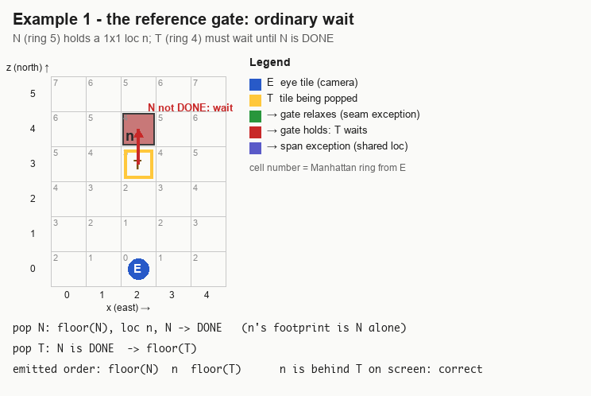

If T pops while N is still GROUND (loc `n` pending), T `continue`s — dropped
from the queue — and is re-queued when N completes, because a tile's completion
pushes its inward neighbours.

### Example 2 — the span exception (shared loc)

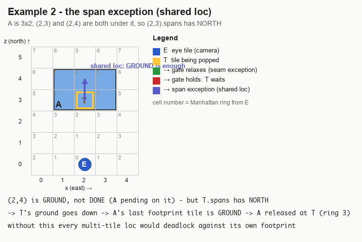

Without this escape every multi-tile loc would deadlock against its own
footprint: the loc waits for (2,3)'s ground, (2,3) waits for (2,4) to be DONE,
(2,4) cannot be DONE until the loc is drawn.

## The seam exception (why it exists)

The span exception is keyed on *this* tile's spans, so it cannot fire when the
neighbour is held by a loc that does **not** cover this tile.

### Example 3 — two abutting large locs on the eye's column (the QBD seam)

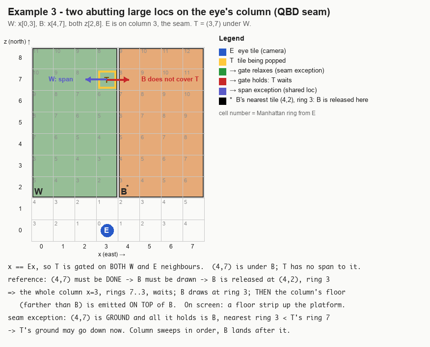

`painter_paint_world3d` has exactly this defect (it runs the plain reference
gate); this is the one topology where the bucket painter deliberately differs.
Pinned by `test_seam_between_two_large_locs_keeps_the_sweep`:

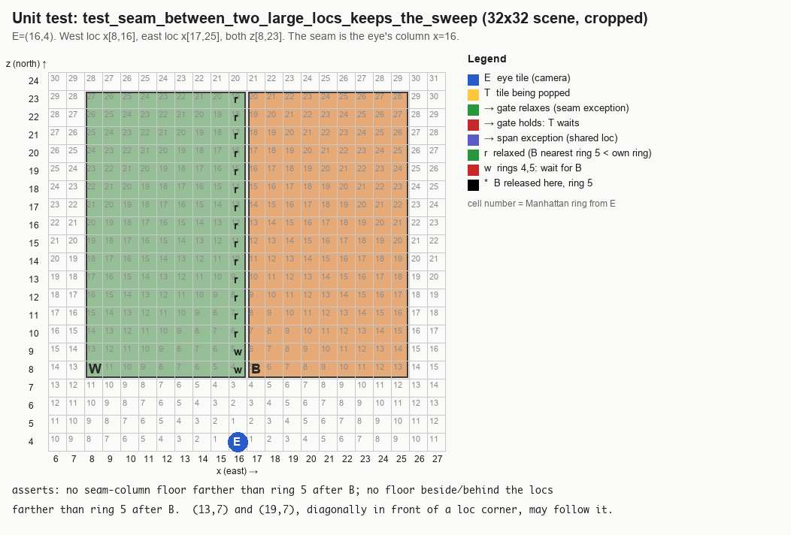

That was the whole rule until 2026-08-19. On its own it is wrong, and the next
examples are why it now has two more conditions.

## Condition 1 — only the LATERAL gate may relax

A large loc straddles rings in depth as well as sideways. "Its nearest corner is
nearer than T" does not mean "it is in front of T".

### Example 4 — loc directly BEHIND the tile (the Xarpus ledge)

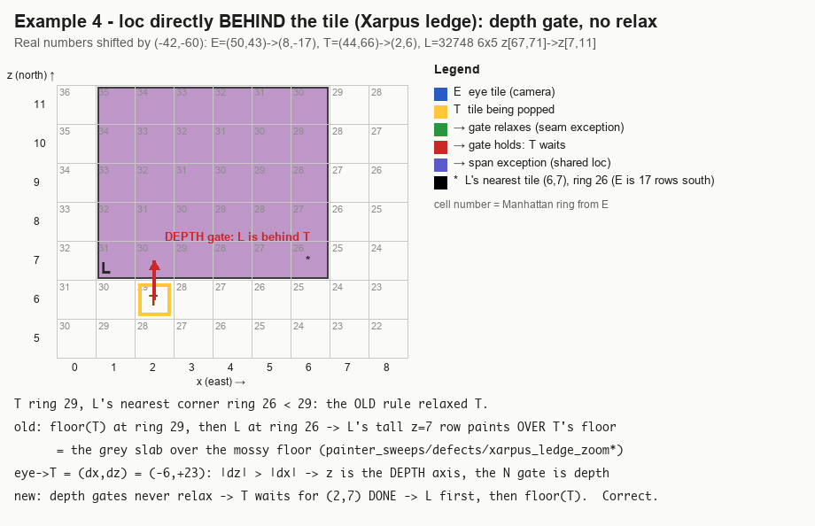

What it looked like — world3d (top) vs the old any-axis rule (bottom), the
6x5 ledge's far row painted over the mossy floor in front of it:

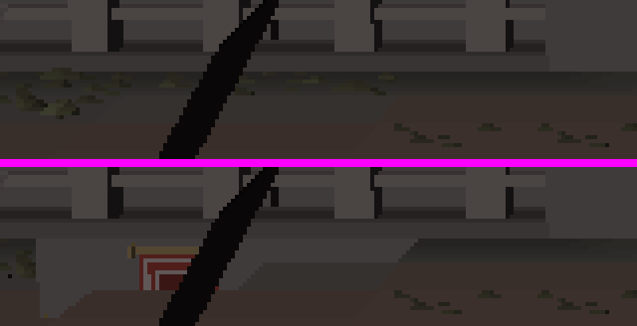

The Maiden stair landing (`32804`, 4x1 at z=52, behind the 1x1 steps at
z=53..55) is the same shape — world3d left, old rule right:

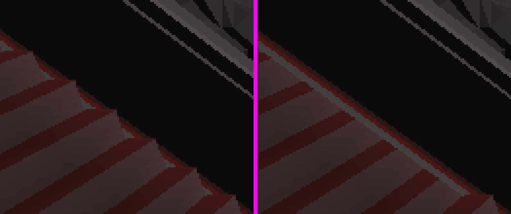

**The rule:** for a tile at `(dx, dz)` from the eye, the axis with the larger
`|delta|` is the depth axis; the gate across the *other* axis is lateral and is
the only one that may relax. `|dx| == |dz|` is treated as depth on both.

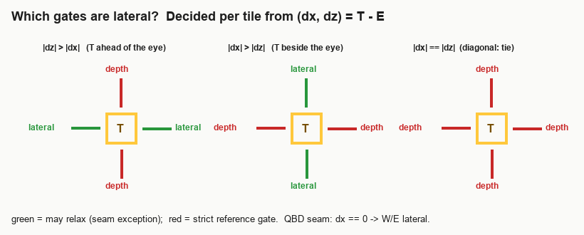

### Example 5 — the QBD seam is a lateral gate, so it still relaxes

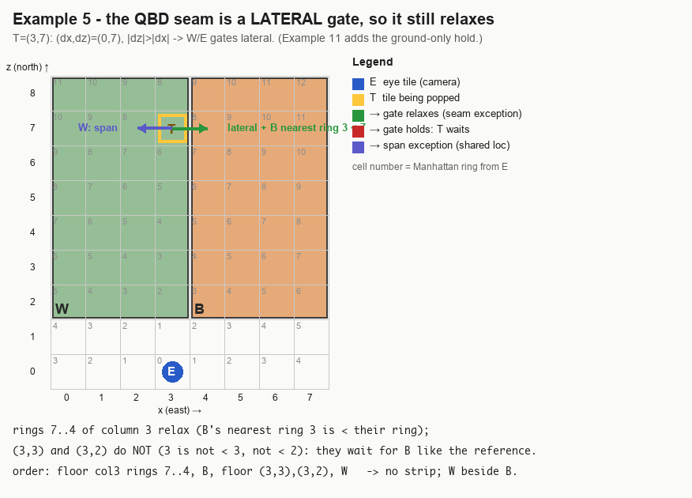

### Example 6 — camera yawed 90°: "lateral" follows `(dx, dz)`, not the x axis

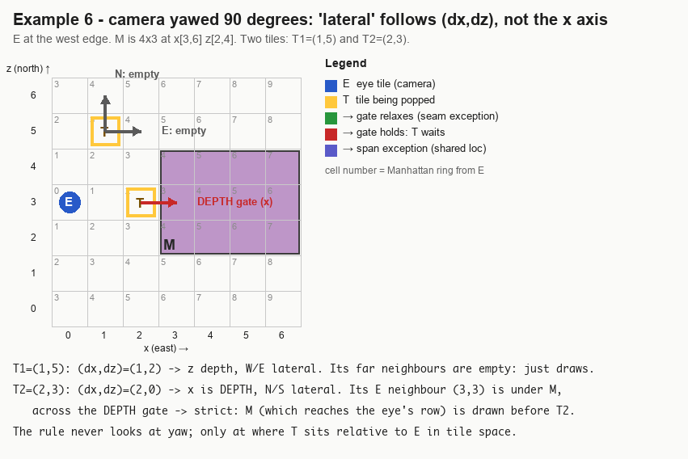

The rule never looks at yaw; it only looks at where T sits relative to E in
tile space, so a yawed camera gets the same treatment as a square one.

### Example 7 — lateral neighbour carries a wall: no relaxation

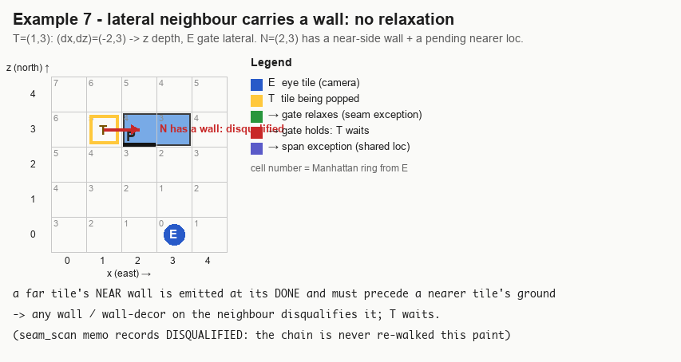

### Example 8 — the pending loc does not reach nearer than T: ordinary wait

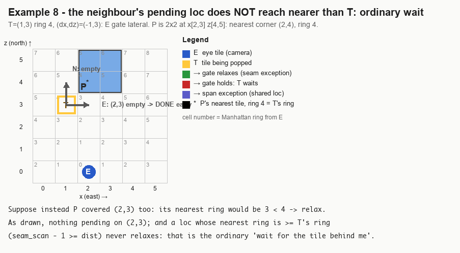

### Example 9 — neighbour has no ground yet

If the lateral neighbour is still READY (its own gate has not passed) there is
nothing to relax against: its ground must go down before T's regardless. T waits
and is re-queued by the neighbour's ground pass (span/footprint pushes) or its
completion.

## Condition 2 — a relaxed tile gets only its GROUND

Relaxing the gate lets T's *terrain* go down — which is what a waiting loc's
footprint check needs. It must not let T's own walls, decor or scenery go down
too: those stand *on* T, and a tall loc on the lateral neighbour whose far part
abuts T is still behind them.

### Example 10 — barrier beside a ledge (Xarpus (49,51))

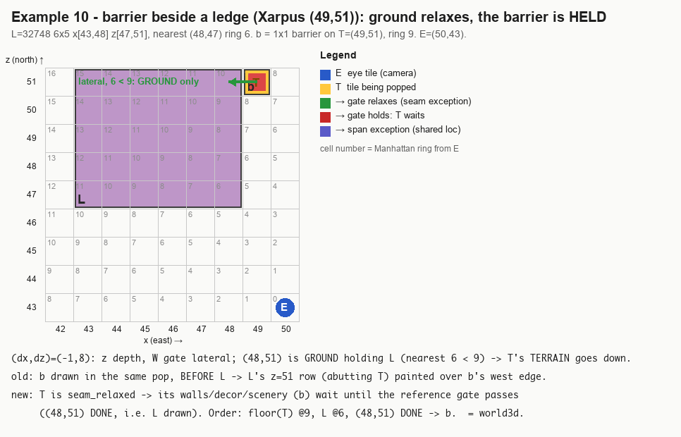

What the lateral-only rule *without* the hold drew — the ledge's abutting row
over the barrier's west end (left pair) and east end (right pair), world3d then
bucket in each pair:

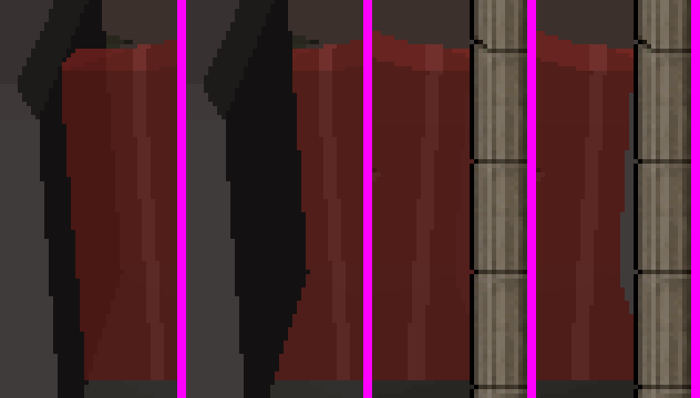

So a relaxed tile is flagged `seam_relaxed` and:

- its **3D features** (bridge underpass wall/scenery, far walls, ground decor,
  ground objects, wall decor — `bucket_emit_tile_features`) are **not** emitted
  in the ground pass;
- its **scenery pass** and **completion** are skipped until the plain reference
  gate passes (`bucket_far_neighbours_pending`: every far neighbour DONE or
  span-shared-with-ground);
- when that gate finally passes, the deferred features are emitted first, then
  scenery, then near walls / DONE — the order world3d's front pass produces.

Who re-queues T? The neighbour's completion pushes its inward neighbours (T is
one), and any loc drawn on T's footprint pushes T. T re-pops at its own ring,
the READY block is skipped (it is GROUND), the re-check runs, and it proceeds.

### Example 11 — the QBD seam with the hold

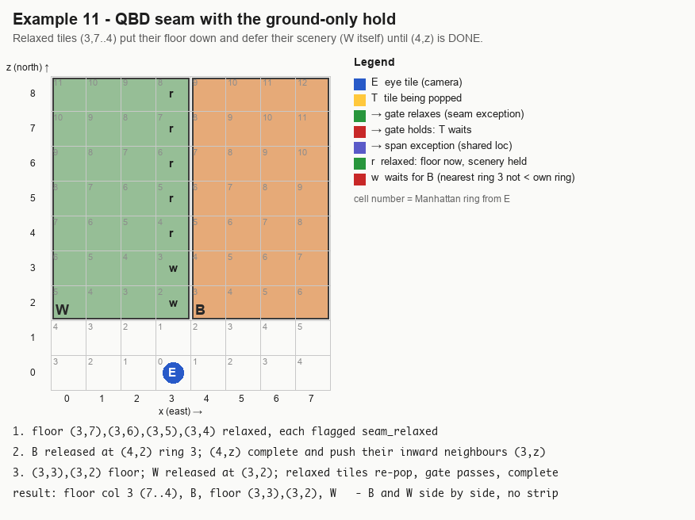

## Why both conditions are needed

The flat-scene unit test for Example 4 (`test_loc_behind_a_tile_in_depth_is_emitted_first`):

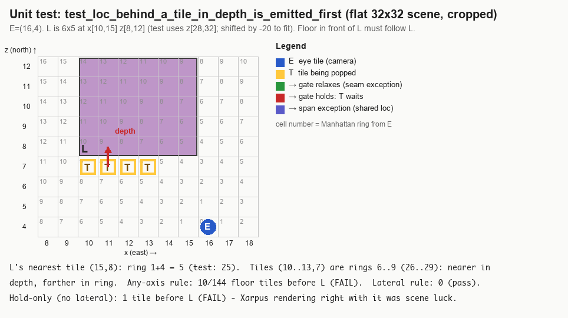

| variant | QBD seam test | loc-behind test | live |
|---|---|---|---|
| any axis, no hold (original) | pass | **fail** — 10/144 floor tiles before the ledge | Xarpus 2041 px, Maiden 586 px vs world3d |
| lateral only, no hold | pass | pass | Xarpus barrier edge, 757 px (Example 10) |
| any axis + hold | pass | **fail** by 1 tile | Xarpus 0 px — scene luck, the test is the truth |
| lateral + hold (current) | pass | pass | 0 px in every view tried |

## The whole rule

```
ground gate for T, per far neighbour N in direction d:
    if N is DONE                                       -> pass
    if N is GROUND and T.spans has d                   -> pass   (span exception)
    if d is LATERAL for T                              (W/E when |dz|>|dx|, N/S when |dx|>|dz|,
                                                        neither on a tie)
       and N is GROUND (not READY)
       and N has no wall / wall decor
       and N has pending scenery
       and max nearest-corner ring of that scenery  <  ring(T)      (memoized: seam_scan)
                                                       -> pass, mark T seam_relaxed
    else                                               -> T waits (re-queued by N's completion)

ground pass for T:
    emit terrain (+ bridge underpass terrain)
    if not seam_relaxed: emit 3D features (far walls, decor, objects, underpass wall/scenery)
    step = GROUND; push span neighbours
    if seam_relaxed: stop here (next pop)

scenery / completion for T:
    if seam_relaxed:
        if any far neighbour fails the REFERENCE gate  -> wait
        clear seam_relaxed; emit the deferred 3D features
    scenery, raised items, near walls, DONE as before
```

## Cost

The lateral test is two compares on values the pop already has. The neighbour's
pending scan is memoized per paint in `TilePaint.seam_scan` (sound as an upper
bound: elements only leave the pending set as they draw, so a stale value can
only delay a relaxation, never grant one wrongly). A relaxed tile costs one
extra pop. `bucket_emit_tile_features` is forced inline — outlined it cost the
paint stage ~5%. Measured (see `painter_bucket_vs_world3d.md`): fuzz bench
ratio bucket/world3d 0.77–0.85 (old any-axis rule 0.75–0.82); live ToB Xarpus
paint p50 ≈ 221 µs vs world3d ≈ 260 µs (old rule ≈ 211 µs).

## Regenerating the diagrams

The diagrams are produced by a ~300-line PIL script (kept in this folder as
`painter_seam_rule/gen_seam_diagrams.py`); edit the example definitions at the
bottom and rerun `python3 docs/painter_seam_rule/gen_seam_diagrams.py`.
