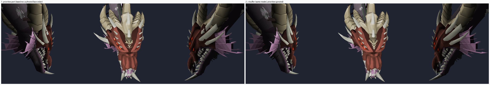
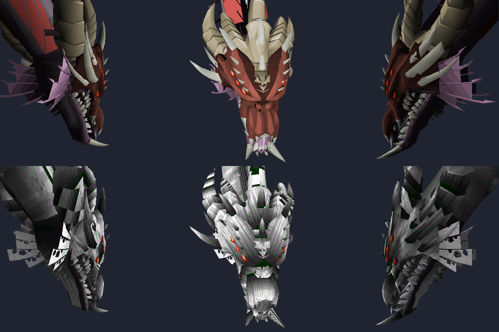

# Two ways to draw the same dragon



| | what it is | changed vs baseline |
|---|---|---:|
| **1. priorities** | BASELINE. Face render priorities re-authored for a painter's-algorithm renderer ([`../rs2012_qbd_priorities/`](../rs2012_qbd_priorities/)). Ordinary depth sort. | — |
| **2. z-buffer** | The SAME model with its priorities **thrown away**, opting into `TORIDRAW_MODEL_FLAG_ZBUFFER` so it resolves itself per pixel. | 6.0% |

```sh
tools/qbd_port_compare.sh                 # every form
FORMS=default tools/qbd_port_compare.sh
```

All three forms:

| form | z-buffer vs baseline |
|---|---:|
| default (head) | 6.0% |
| worm | 1.3% |
| soul | 0.0% |

## What the z-buffer panel says

This is the number worth having. Panel 2 takes the model whose priorities were
laboriously re-authored, **discards that authoring**, and lets the depth test
resolve the model against itself. It lands within **6.0%** of the authored
result, and [the diff mask](images/default_diff.png) shows the residual sitting
on seams and interpenetrating detail — spines through the crest, teeth through
the jaw — rather than spread over the model.

Ignoring the priorities is deliberate: honouring them would leave the depth path
with nothing to do, because priorities override the depth sort.

`soul` is the negative control — its faces never occlude each other, so the
depth test correctly changes nothing rather than changing something.

## Why the client's dragon is white and black

The lane model is **not** untextured — 6,533 of its 6,863 faces carry a texture,
and 225 of the lane's 256 imported materials are **greyscale**: their RGB is a
detail pattern, not a colour. Drawn through the stock opaque kernel, which
treats the texture as the surface, a greyscale mask *is* a white and black
surface.



Top: the lane model with its textures stripped, so only its face colours draw —
the dragon is correct. Bottom: the same model with the lane's textures, which is
what the client packs. Same geometry, same face colours, same camera.

To render `rs2012_model_70260.ob3` untextured yourself:

```sh
src/build_win64_opt/rs2012_model_view.exe --model <path>.ob3 --out shot.bmp
src/build_win64_opt/rs2012_model_view.exe --model <path>.ob3 --textures --stats
```

Note the second command: `--stats` reports the model *after* the viewer's
default texture strip, so without `--textures` it prints `textured 0` for a
model that is almost entirely textured. That misreading cost a full round of
wrong conclusions here — do not repeat it.

## The materials route was removed

A third panel used to sit in this sheet: the same geometry ported to a non-stock
OB_TORI container so each face could name one of three imported-material span
kernels (per-texel alpha, modulate by face colour, opaque detail map). That
whole route — the kernels, the container, the porter, the dat2 texture extension
byte, the bake flags that emitted it, and the client's runtime selection — has
been deleted.

The kernels passed their own unit test. What was never finished was the wiring
around them:

- **Fixed before removal:** the per-face kernel was applied only inside the
  texture-cache *miss* branch, so a face hitting the cache inherited whatever
  kernel the previous face using that texture had resolved to.
- **Never fixed:** faces with `color_c == TORIDRAWHSL16_FLAT` jump to the
  `textured_flat` path, which had no dispatch to the material kernels at all —
  over 1,000 faces per frame on this model, every one requesting the detail
  kernel and silently getting the stock one. The three kernels interpolate the
  shade across a span and have no flat twin, so giving them one was real work,
  not a wiring fix.

The greyscale-mask problem that route existed to solve is still open. It is a
question about the imported materials themselves — see
[`../rs2012_materials_backport/`](../rs2012_materials_backport/) and
`RS2012_BACKPORT.md` §2 — not about the raster. `git log` has the removed code
if it is ever wanted back.
