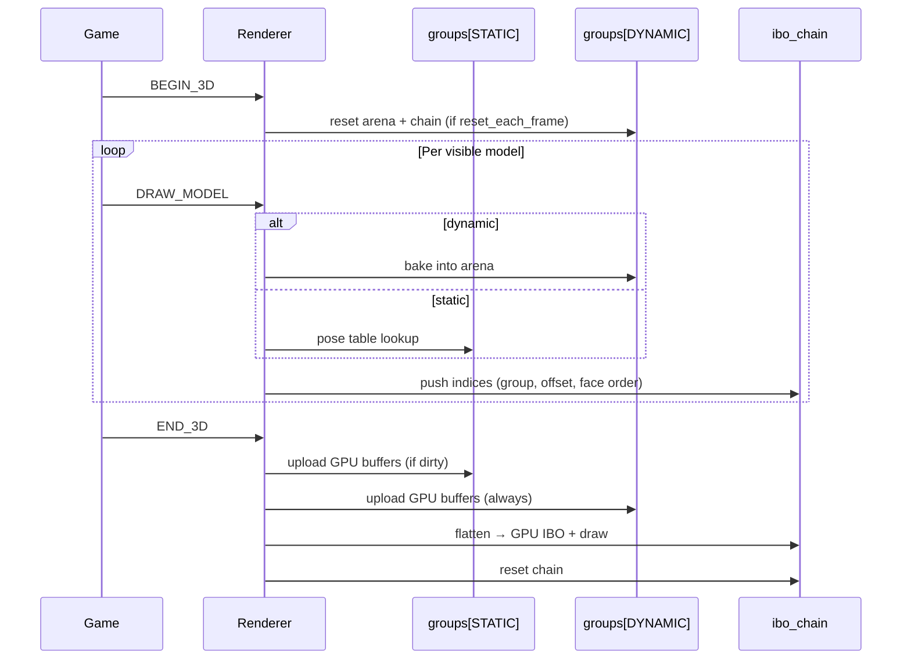

# Renderer architecture

This document describes how each platform renderer turns LibToriRS render commands into pixels, what GPU/CPU resources it uses, and how geometry is buffered across frames.

All renderers consume the same per-frame **render command stream** (`TORIRSRC_*` commands from `libtorirs_render.h`). The game builds painter's-order face lists in ToriDraw; renderers submit triangles in that order. **Depth testing is disabled** in every GPU renderer (`glDepthFunc(GL_ALWAYS)` / `D3DRS_ZENABLE FALSE`), so correct occlusion depends entirely on submission order.

---

## Where each renderer is used

| Renderer | Source file | Typical target |
|----------|-------------|----------------|
| **Soft3D** | `src2/platforms/platform_sdl2/platform_sdl2_renderer_soft3d.c` | `sdl2 --soft3d`, `browser --soft3d`, `test/runescape_world_sim` |
| **WebGL1** | `src2/platforms/platform_sdl2/platform_sdl2_renderer_webgl1.c` | `browser` (Emscripten, default) |
| **OpenGL3** | `src2/platforms/platform_sdl2/platform_sdl2_renderer_opengl3.c` | `sdl2` on macOS / Linux (default) |
| **D3D9** | `src2/platforms/platform_sdl2/platform_sdl2_renderer_d3d9.c` | `sdl2` on Windows (MinGW) |

`platform_sdl2_renderer_opengl3_old.c` is a legacy copy and is not linked by current builds.

Shared platform-kit helpers live under `src2/platformkit/core/` (`trspk_vbo`, `trspk_modelarena`, `trspk_ibo`, `trspk_drawrangeex`, `trspk_pose`, `trspk_atlas`, …).

---

## Shared concepts (GPU renderers)

### Static vs dynamic model groups

GPU renderers keep two parallel **model groups** indexed by an opaque `group` id:

| Index | Name | Lifetime | Typical content |
|-------|------|----------|-----------------|
| `0` | `TRSPK_VBO_GROUP_STATIC` | Persists across frames | Terrain, props, pre-baked animation frames |
| `1` | `TRSPK_VBO_GROUP_DYNAMIC` | Reset every `BEGIN_3D` | Per-frame baked entities (players, projectiles, …) |

Each group is a self-contained bundle (CPU VBO, GPU VBO(s), model arena, and optionally a per-triangle config table). Static and dynamic geometry **interleave in painter's order** through one shared index stream; only the bound vertex source changes per draw.

### Model arena + pose table

**Bake** (at load or draw time) transforms a `ToriDraw_Model` into interleaved GPU vertices:

1. `trspk_modelarena_load` reserves a slot and vertex range.
2. The renderer writes `TRSPK_Vertex*` records (position, colour, UV, texture metadata).
3. For **static** models, the slot is registered in `TRSPK_PoseTable` via `trspk_pose_table_set` so later `DRAW_MODEL` commands only need `(element_id, anim_index, pose_id)` lookups.
4. For **dynamic** models, the freshly baked slot is used immediately; nothing is stored in the pose table.

Bake entry points: `ANIM_LOAD`, `MODEL_LOAD`, `BATCH3D_*` → static group; `DRAW_MODEL` with `dynamic=true` → dynamic group.

### Per-frame IBO chain

During a 3D pass, each `DRAW_MODEL` pushes triangles into a single **`TRSPK_IBOChain`** in face-order:

```
trspk_ibochain_push16/32(chain, group, offset, indices, 3)
```

- **`group`** — which model group's VBO to bind when drawing this node.
- **`offset`** — base vertex index semantics differ per renderer (see below).

Nodes with the same `(group, offset)` are coalesced. The chain is reset at the end of `END_3D`.

### Draw ranges (OpenGL3 + D3D9 only)

At `END_3D`, `trspk_drawrangeex_build16/32` flattens the IBO chain into one GPU index buffer and builds a **`TRSPK_DrawRangeList`**. Adjacent triangles sharing the same texture configuration are merged into ranges. Each range carries:

- GPU index span (`start` / `end`)
- `group` — static or dynamic VBO
- `base_offset` — page / vertex base for indexed draws
- `config_idx` — encoded texture state (atlas vs animated texture id)
- `min_vertex` / `max_vertex` — vertex cache hints

WebGL1 does **not** use draw ranges; it records draw calls per IBO node instead (see below).

---

## Frame lifecycle (GPU renderers)



### Command handling summary

| Command | All GPU | Notes |
|---------|---------|-------|
| `TEX_LOAD` | Atlas upload (+ standalone anim textures on D3D9) | 128×128 tiles in 2048×2048 atlas |
| `ANIM_LOAD` / `MODEL_LOAD` / `BATCH3D_*` | Bake → static group, update pose table | |
| `BATCH3D_CLEAR` | Clear static group + pose table | |
| `BEGIN_3D` | Set viewport, matrices, GL/D3D state; reset dynamic group | |
| `DRAW_MODEL` | Pose lookup or dynamic bake; push IBO indices | |
| `END_3D` | Upload, build IBO, draw, reset IBO chain | |
| `SPRITE_*` | 2D blit path (varies by renderer) | Soft3D + D3D9 have sprite support |

---

## Soft3D

**No GPU.** The reference / debug rasteriser.

### What it uses

- `SDL_Renderer` + `SDL_Texture` for presentation
- A CPU `int*` ARGB pixel buffer (`width × height`)
- ToriDraw's software rasteriser: `ToriDraw_RenderModel3Raster`, `ToriDraw2D_BlitSprite`

### Buffering

There is no vertex or index buffering. Each `DRAW_MODEL` re-rasterises the current ToriDraw scene directly into the pixel buffer. The buffer is cleared at the start of every frame (`memset` to zero). Sprites are held as `ToriDraw_Sprite**` arrays keyed by `element_id`.

### When to use

Correctness testing, headless simulation (`runescape_world_sim`), and `--soft3d` fallback when WebGL is unavailable.

---

## WebGL1 (GLES 2.0)

**Browser default.** OpenGL ES 2.0 / WebGL1 via SDL + Emscripten.

### What it uses

| Resource | Purpose |
|----------|---------|
| `groups[2]` × `WebGL1ModelGroup` | Static/dynamic vertex storage |
| `TRSPK_VBOChain16` per group | CPU vertex pages (≤65535 verts each) |
| `GLuint*` `page_buffers` per group | One GL array buffer per chain page |
| `TRSPK_IBOChain` (u16) | Per-frame ordered index stream (shared) |
| `GLuint ebo` | Single GPU index buffer per frame |
| `TRSPK_PoseTable` | Static model `(element_id, pose) → (page, local_base)` |
| `TRSPK_Atlas` + `atlas_texture` | 2048² texture atlas |
| GLSL program `program3d` | Vertex colour + atlas sampling; `tex_id` / `uv_mode` per vertex |

### Vertex format

`TRSPK_VertexWebGL1`: `position[4]`, `color[4]`, `texcoord[2]`, `tex_id`, `uv_mode`.

### Why multiple VBO pages

WebGL1 cannot bind an index buffer with a vertex offset. Indices are always relative to vertex 0 of the bound array buffer. The renderer therefore splits vertex data into **pages** (`TRSPK_VBOChain16`); each page gets its own `page_buffers[i]`. The IBO node's `offset` field is the **page index**; indices are local within that page.

The pose table stores `(page << 16) | local_base`.

### Buffering strategy

| Group | CPU | GPU upload |
|-------|-----|------------|
| Static | `TRSPK_VBOChain16` pages grow on load; arena slots persist | `glBufferSubData` per page when `trspk_vbo_is_dirty`; capacity grown with `glBufferData` only when vertex count exceeds `page_buffer_caps[i]` |
| Dynamic | Arena + chain **reset** at `BEGIN_3D` (`trspk_vbochain16_reset` + `trspk_modelarena_clear`) | Uploaded every `END_3D` |

### END_3D draw path

1. Upload all dirty pages in both groups.
2. Walk the IBO chain; for each node, `memcpy` indices into `ibo_staging` and append a `WebGL1DrawRecord { group, page, draw_offset, count }`.
3. Upload the combined index buffer to `ebo`.
4. For each draw record: bind `groups[rec.group].page_buffers[rec.page]`, `glDrawElements` with byte offset into the shared EBO.

Texture state is entirely in vertex attributes; there is no per-range texture rebinding.

---

## OpenGL3 (core profile)

**SDL2 default on macOS and Linux.**

### What it uses

| Resource | Purpose |
|----------|---------|
| `groups[2]` × `GL3ModelGroup` | Static/dynamic bundles |
| `TRSPK_VBO` (cpu) + `GLuint vbo_gpu` per group | Single growing vertex buffer per group |
| `GLuint vao` per group | Vertex attrib layout bound to that group's `vbo_gpu` |
| `struct TRSPK_Triangles` per group | Per-triangle texture config for draw-range batching |
| `TRSPK_IBOChain` (u32) | Per-frame index stream |
| `GLuint ebo` | GPU index buffer |
| `TRSPK_DrawRangeList` | Merged draw batches |
| `GLuint ubo` | `modelViewMatrix`, `projectionMatrix`, `uClock` |
| `TRSPK_Atlas` + `atlas_texture` | Shared atlas |

### Vertex format

`TRSPK_VertexOpenGl3`: same fields as WebGL1 (`position`, `color`, `texcoord`, `tex_id`, `uv_mode`).

### Index offset

OpenGL3 uses **32-bit indices** with a single monolithic VBO per group. IBO nodes use `offset = 0`; indices are absolute vertex indices into that group's buffer.

### Buffering strategy

| Group | CPU | GPU upload |
|-------|-----|------------|
| Static | `TRSPK_ModelArena` on one `TRSPK_VBO`; persists | `glBufferSubData` when dirty; `glBufferData` grow when `vertex_count > gpu_capacity` |
| Dynamic | Arena cleared at `BEGIN_3D` (resets write cursor) | Uploaded every frame |

### END_3D draw path

1. `gl3_upload_group` for both groups.
2. `trspk_drawrangeex_build32` → flat `ibo_staging` + draw ranges (selects `triangles_by_group[node->group]` per IBO node).
3. `glBufferSubData` into `ebo`.
4. For each draw range: bind `groups[range->group].vao` when the group changes, `glDrawElements` with index offset.

Draw ranges are built for future texture batching; the current GL3 shader samples the atlas using per-vertex `tex_id` / `uv_mode`, so ranges primarily batch index spans and group switches.

---

## D3D9 (fixed-function)

**SDL2 default on Windows** (`HOST_OS=Windows` in `src2/programs/sdl2/Makefile`).

### What it uses

| Resource | Purpose |
|----------|---------|
| `groups[2]` × `D3D9ModelGroup` | Static/dynamic vertex bundles |
| `IDirect3DVertexBuffer9` per group | GPU vertex buffer |
| `IDirect3DIndexBuffer9` `ibo` | Shared 16-bit GPU index buffer |
| `IDirect3DVertexDeclaration9` | FVF-compatible layout |
| `struct TRSPK_Triangles` per group | Texture config per triangle |
| `TRSPK_DrawRangeList` | Batched draws with texture rebinding |
| `IDirect3DTexture9` atlas + `tex_buffers[256]` | Atlas for static textures; standalone textures for animated tex-ids |
| `TRSPK_PoseTable` | Static pose → `vertex_base` |

### Vertex format

`TRSPK_VertexD3D9`: `position[3]`, packed ARGB `color`, `texcoord[2]`, `texdata[2]` (`tex_id`, `uv_mode`). FVF: `D3DFVF_XYZ | D3DFVF_DIFFUSE | D3DFVF_TEX2`.

### Index offset / pages

D3D9 supports `BaseVertexIndex` in `DrawIndexedPrimitive`. Indices pushed to the IBO chain are **page-local** (16-bit). The node's `offset` is `page_base` (`vertex_base & ~65535`). `DRAW_MODEL` computes:

```
page_base = vertex_base & ~65535
local_base = vertex_base - page_base
index = local_base + face * 3
```

### Buffering strategy

| Group | CPU | GPU upload |
|-------|-----|------------|
| Static | Single `TRSPK_VBO` + arena | `Lock` without discard when dirty; recreate VB only when capacity grows |
| Dynamic | Arena cleared at `BEGIN_3D` | `Lock(D3DLOCK_DISCARD)` every frame into reused VB |

### END_3D draw path

1. `d3d9_upload_group` for both groups.
2. `Lock(D3DLOCK_DISCARD)` on `ibo`; `trspk_drawrangeex_build16` fills indices and builds draw ranges.
3. For each range:
   - `SetStreamSource` when `range->group` changes.
   - Rebind atlas or animated texture when `range->config_idx` changes; scroll matrix updated for animated textures on the same config.
   - `DrawIndexedPrimitive(TriangleList, BaseVertexIndex=page_base, MinIndex, NumVertices, StartIndex, PrimCount)`.

D3D9 is the only renderer that actively **rebinds textures per draw range** using the `TRSPK_Triangles` tables baked at model load time.

---

## Texture handling (comparison)

| | Soft3D | WebGL1 | OpenGL3 | D3D9 |
|---|:---:|:---:|:---:|:---:|
| Atlas (2048², 128² tiles) | N/A | Yes | Yes | Yes |
| Animated textures | Software | Vertex `uv_mode` scroll in shader | Vertex `uv_mode` in shader | Standalone `IDirect3DTexture9` + texture-stage matrix |
| Per-face texture id | Rasteriser | Vertex attribute | Vertex attribute | `TRSPK_Triangles` → draw-range `config_idx` |

---

## Memory / leak notes

The dynamic group's **per-frame reset** (`reset_each_frame = true`) is what keeps WebGL1's `TRSPK_VBOChain16` page count bounded across frames. Without splitting static and dynamic into separate groups, dynamic models appended to a single growing chain caused unbounded CPU/GPU allocation in the browser.

Static geometry persists until `BATCH3D_CLEAR`, `MODEL_UNLOAD`, or explicit arena unload.

---

## Key source files

```
src2/platforms/platform_sdl2/
  platform_sdl2_renderer_soft3d.c    # CPU rasteriser
  platform_sdl2_renderer_webgl1.c    # Emscripten / WebGL1
  platform_sdl2_renderer_opengl3.c   # Desktop GL 3.2+
  platform_sdl2_renderer_d3d9.c       # Windows D3D9

src2/platformkit/core/
  trspk_vbo.c / trspk_vbochain16.c   # CPU vertex storage
  trspk_modelarena.c                 # Slot allocator + bake targets
  trspk_ibo.c                        # Per-frame index chain (group-tagged nodes)
  trspk_drawrangeex.c                # Flatten IBO + build draw ranges
  trspk_pose.c                       # Static model pose lookup
  trspk_atlas.c                      # Texture atlas grid
```
