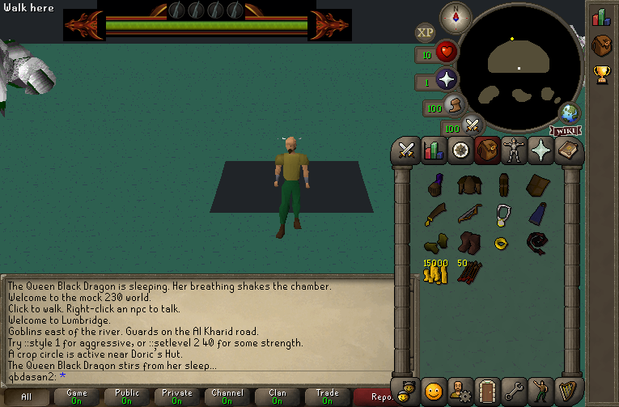
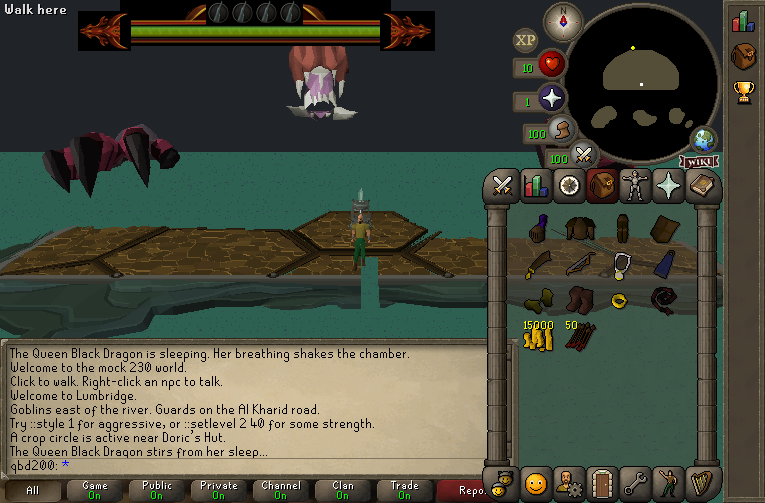
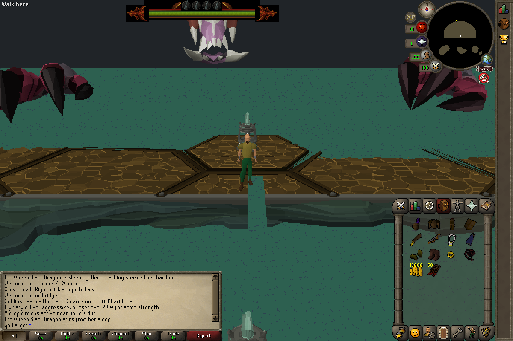
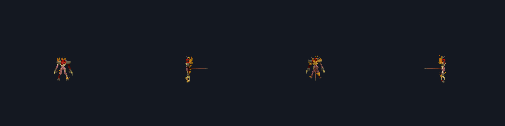

# RS2012 QBD arena and model repair log

This directory records the visual and runtime validation of the 2012 Queen
Black Dragon and Tormented Demon cache port. It is intentionally a running log:
each material change is paired with a client capture and the command used to
produce it.

## 2026-08-10 — broken baseline

The composed `osrs239` manifest starts the QBD encounter through the
QA-only `rs2012qbdmanifest` cheat, but the first client frame is visibly wrong:

- the arena floor is a flat teal colour;
- the central platform contains a black rectangular void;
- a large white malformed mesh appears at the west edge;
- the OpenGL client subsequently exits with signal 11 while the encounter is
  waking, while the software renderer survives long enough to capture a frame;
- the same imported-material path is shared by the Tormented Demon model, so
  both encounters require visual validation rather than binary-only checks.


The software-renderer reproduction reported missing destination underlays 244,
245, and 246. The map importer had allocated RS2012 underlay configs at
500–511, but a terrain tile carries the underlay identity in one byte. Values
such as 501 were therefore truncated to 245 before lookup. This is a concrete
map-encoding defect, not missing source terrain.

The model audit found that QBD and Tormented Demon vertex/face geometry matches
the source 727 records, but nearly every face uses a procedurally baked 727
material. Passing binary model round-trip tests therefore did not prove that
the models render correctly in the OSRS239 client. Material and in-client
screenshots remain the acceptance criterion.

## 2026-08-10 — wire and renderer crash repaired

The high-ID NPC transformation now installs sleeping QBD type 25003 and models
110000/110001 at the expected five-tile footprint. The malformed west-edge
mesh did not move when the NPC type changed, proving it was the left-claw
location rather than the Queen.

The working macOS ASan flavor then found the immediate crash: a full ToriDraw
scene allocated projection and face-order buffers for 4,096 vertices/faces,
while the merged sleeping QBD contains 6,223 vertices and 9,012 faces. Priority
4 alone contains 6,484 faces, also exceeding the hidden 2,000-face priority
stride. Full-scene capacities and stride-aware indexing are now explicit, with
a pre-projection capacity guard. The composed encounter ran for 900 client
frames under the dylib-backed sanitizer and exited normally.

This capture is intentionally not called “fixed”: the NPC/wire crash is gone,
but the left claw is still white, the platform is black, and the default camera
does not frame QBD. It records the boundary between protocol/allocator repair
and the remaining material/camera work.



The first material diagnosis was incomplete. The bridge forced 727 procedural
shader inputs into OSRS diffuse sprites; material 285, for example, is pale
normal/noise data, which explains the white malformed claw. However, the first
material-table byte is not an `isSd` or “HD-only” bit. The supplied 727 client
decodes it as `isGroundMesh = readUnsignedByte() == 0`. Treating every such
material as globally hidden removed most QBD textures, and clearing only the
texture ID left the OB3 face encoded as textured. That combination produced the
mouth-only intermediate capture below.

A second defect was in the server's revision-239 NPC encoder, not in the chosen
25000–25009 allocation. The per-client NPC index is 16 bits, but an
initial add contains only a 14-bit type field. For a high definition such as
25000, the add's update flag must be set and that same `NPC_INFO` packet must
carry update-mask bit `0x1`: its replacement type is the transformed unsigned
16-bit `p2Alt3` / `UShortLEAdd` value. The 16-bit replacement path—not a
16-bit add type—is what makes 25000–25009 valid; 14 bits is not a global NPC
definition ceiling. The encoder already decoded that replacement block but did
not force it for a newly added high-ID NPC. The first attempted repair moved
the definitions under 16384; review against the 239 deob showed that was
unnecessary and it has been reverted. The permanent repair retains 25000–25009
and emits the same-packet type replacement, with a wire decoder regression for
QBD type 25003.

The intermediate capture below is still useful evidence: it removed the false
human NPC, but the unchanged white west-edge mesh proved that mesh belongs to
the imported left-claw location rather than QBD. The lower-ID allocation shown
in this image was only a diagnostic and is no longer the implementation.


## 2026-08-10 — failed ground-material experiment

The first fallback cleared the material ID but not the OB3 texture-coordinate
and face-info state. It made the platform and west claw less obviously corrupt,
but QBD still rendered primarily as a mouth. This image is retained as failed
evidence and must not be used as visual acceptance.



## 2026-08-10 — QBD head and both foreclaws restored

The corrected OB3 conversion treats `!valid` by its actual 727 meaning,
`isGroundMesh`. Because OSRS239 has no equivalent procedural-material plus
model-render-flag contract, the compatibility fallback clears the texture ID,
texture coordinate, and textured face-info state as one operation while
preserving the face's original HSL colour for ordinary lighting. All baked
materials remain in the lane for inspection and a future renderer.

The isolated sleeping-QBD render now resolves 6,223 vertices and 9,012 faces,
animates every vertex, and shows the complete head, horns, jaw, and neck. The
live 1200×800 capture below proves the scene composition as well: NPC type
25003 supplies the centered head/neck, while location 70822/model 69885 and
location 70818/model 69887 supply the left and right foreclaws. Both claws,
the head, and the phase-one platforms render at the same time. This is a
render-presence and geometry acceptance image, not a claim that the flat HSL
fallback reproduces the 727 procedural shader pixel-for-pixel.



The capture was produced headlessly with the macOS ASan-compatible client and
the scanline software rasterizer (the separate legacy branching-raster item-icon
palette fault is outside this encounter):

```sh
env SDL_VIDEODRIVER=dummy \
  TORIDRAW_RASTER_SCANLINE=1 \
  TORIRS_MAX_FRAMES=850 \
  TORIRS_EXIT_BMP=/tmp/qbd_full_scene.bmp \
  TORIRS_SIM_WINDOW='500,1200x800' \
  TORIRS_SIM_WHEEL='650,500,350,-4,1' \
  ASAN_OPTIONS='detect_leaks=0:halt_on_error=1:abort_on_error=1' \
  ./src/torirs --manifest manifest_osrs239_rs2012.ini \
  --user qbdvisual --pass test --soft3d
sips -s format png /tmp/qbd_full_scene.bmp \
  --out docs/rs2012_qbd_arena/images/06_qbd_head_and_both_claws.png
```

The saved PNG has SHA-256
`1dbeaa558e3c52c8bad17b94ea2cb2029384dde8fb42951dc539bde70952a9a2`.

The Tormented Demon check uses source NPC 8349/sequence 10921 and destination
NPC 25006/sequence 22017. Both resolve to 984 vertices, 1,974 faces, a
32-frame classic animation on source framemap 2401/destination 9002, and the
same SD-lit four-yaw bitmap. The source and destination BMP files compare
byte-for-byte equal; their converted PNG SHA-256 is
`7b4cc81719a6a9370d748f7929ff749e8030b1d66b25913fce524f7417d2e569`.
This separates cache-port fidelity from encounter-camera problems: the demon
model and animation are not being numerically altered by the 727→239 bridge.



The live TD manifest also entered the authentic 40_89 instance and announced
all six demons, but a level-1 QA account died before the final frame was
captured. That is recorded as a manifest usability issue rather than hidden by
changing the demons' production damage or granting quest/combat progress.

## 2026-08-10 — QBD HUD sprites lost their transparency to the 232+ alpha rule

The Queen Black Dragon HUD (`rs2012_qbd_hud`) drew every one of its sprites
inside a solid black rectangle: the healthbar's wing frame, its end pieces and
the four artefact icons were each boxed in by their own bounding rect.

A dat2 sprite states transparency two ways — palette **index 0**, and a
per-pixel alpha plane behind `FLAG_ALPHA`. The ported RS2012 assets use the
plane, and put their clear pixels at palette index 1 (`0x000001`, the "black but
not transparent" slot) with alpha 0. That is correct for their own era.

OldSchool 232+ does not read it that way. `RSCACHE_SPRITELOAD_FLAG_OPAQUE_INDEX`
(`3rd/rscache/src/datatypes/dat2_sprites.c`) forces every pixel whose palette
index is non-zero to alpha `0xFF` *after* the plane is decoded, and
`manifest_osrs239_rs2012.ini` is `game=oldschool, revision=239`, so the flag is
on. Every clear pixel came back opaque `0x000001`.

**The era rule is right and stays.** Native osrs239 content is built for it: 33
packs depend on it (23,379 clear-but-indexed pixels — `wild_ditch_sign_button_2`,
`side_stone_highlights_*`, `myq5_tomb_buttons_*` would develop holes without it),
and native UI content carries essentially no partial alpha at all — only four
packs, one of which is the `hd_water_normal` normal map and the rest 3–8 stray
pixels. It is the ported assets that cannot express themselves under it.

A 239 cache has no way to say "honour my alpha plane", so the port is re-baked
down to what the era can state, by
[`scripts/normalize_ported_sprite_alpha.py`](../../scripts/normalize_ported_sprite_alpha.py):

    alpha <  128  ->  BGRA all-zero  => palette index 0, transparent
    alpha >= 128  ->  rgb, alpha 255 => opaque

Writing an exactly-zero BGRA is the part that matters: `sprite_read` in
`cp_decode.c` only skips its nearest-palette match when alpha *and* rgb are both
zero, so a clear pixel that kept a colour is matched straight back to a non-zero
index. Once every pixel is either (index 0, alpha 0) or (index != 0, alpha 255)
the encoder finds the alphas derivable, drops `FLAG_ALPHA` altogether, and the
sprites render the same under either era — confirmed by reading them back out of
the built cache with the client's own decode path, where all ten HUD sprites now
report `FLAG_ALPHA=0` and sprite 13030 recovers 2,014 transparent pixels.

This rewrote 26 packs (13,626 pixels to clear, 3,788 to opaque); only the BMP
pixel bytes change, `pack.meta` and every header are untouched. The
`rs2012_material_*` packs in the same directory are 3D texture sources for the
procedural bake, not the 2D blitter, and are deliberately out of scope.

It is lossy by construction — the soft edges become 1-bit, which is all the era
can hold — and **it must be re-run after any re-port of the RS2012 assets**:

```sh
python3 scripts/normalize_ported_sprite_alpha.py          # rewrite
python3 scripts/normalize_ported_sprite_alpha.py --check   # CI gate, non-zero if stale
```

### Reproduction

```sh
make -C src mock230-cache-rs2012
./run-live.sh manifest_osrs239_rs2012.ini qbdrepro test --opengl3
./run-live.sh manifest_osrs239_rs2012_td.ini tdrepro test --opengl3
```

The QBD manifest invokes `::rs2012qbdmanifest`; this is deliberately separate
from the production portal and `::qbd` gates and bypasses only the 60
Summoning requirement. The TD manifest invokes `::rs2012tdbypass`; production
`::rs2012td` remains gated by While Guthix Sleeps. Neither QA command changes
skills or quest state.

## 2026-08-11 — a from-scratch `mock230-cache-rs2012` rebuild corrupts QBD's awake render

Unrelated to the material/HUD work above: getting the `rs2012_qbd_session.rs2`
wake-timing constant (see `docs/rs2012_qbd_wakeup/`) to actually take effect
required rebuilding `mock230-scripts`, which in turn required a from-scratch
`mock230-cache-rs2012` (delete + full repack of `cache.osrs239.rs2012`) to
resolve an unrelated compile blocker. That repack's own `cachepack verify`
step failed real fidelity checks on the first attempt — before any change in
this session — flagging sprite payloads that changed length and `script 0`
failing to decode with `trailer=modern`.

Separately and more visibly: after the repack, QBD's post-`npc_changetype`
idle pose (`rs2012_seq_16715` on `rs2012_qbd_default`) renders as a white,
jagged mess from the same camera angle that previously showed a clean
red-eyed dragon head — reproducible across multiple fresh runs, and present
even with a narrowly-scoped fix to the compile blocker (so it is not that
fix's own doing). A capture taken earlier in the investigation, against the
cache as it stood before this session touched it, shows the correct pose at
the same point in the encounter — the regression tracks with *rebuilding the
cache*, not with any source edit made this session, and most likely shares a
root cause with the two `cachepack verify` failures above.

**Not investigated further.** `cache.osrs239.rs2012` is gitignored, so
nothing in git is broken by this — it only affects a fresh local rebuild. Next
step for whoever picks this up: reproduce the `cachepack verify` failures in
isolation (`--assets=sprites,scripts`) against a clean checkout, and check
whether the RS2012 model/sprite re-port needs the same kind of one-time
re-bake `scripts/normalize_ported_sprite_alpha.py` did for the HUD (§ above,
"sprite alpha lost transparency") — a lossy, must-rerun-after-report step is
exactly the shape of bug that a stale-but-working cache would mask and a
from-scratch rebuild would expose.

### Repair checklist

- [x] Capture the broken arena baseline.
- [x] Identify the underlay-ID truncation.
- [x] Verify source/destination QBD and TD geometry records structurally.
- [x] Preserve high NPC IDs through the revision-239 transformation update.
- [x] Reallocate and regenerate all RS2012 terrain underlays within the byte
  domain.
- [x] Restore the macOS ASan dylib/static-SDL build path; plain sanitizer flags
  alone hang during dyld/allocator initialisation on macOS 26.
- [x] Isolate the common renderer crash under a dylib-backed macOS ASan build.
- [x] Identify and repair the QBD projection/face-order buffer overflow.
- [x] Correct the material flag interpretation from “HD-only” to
  `isGroundMesh`.
- [x] Clear texture, UV, and textured-face state together for the OSRS239 OB3
  ground-material fallback.
- [x] Validate the complete QBD head and both claw location models in one live
  destination-client frame.
- [x] Capture corrected QBD arena and QBD/TD model images.
- [x] Re-bake the ported RS2012 sprite alpha into index-0 transparency so the
  HUD stops painting a black box behind every sprite.
- [ ] Reproduce 727 procedural shading pixel-for-pixel; the current HSL
  fallback intentionally prioritises complete visible geometry.
- [ ] Make the TD visual manifest survive long enough to inspect all six demons
  without weakening the production encounter or mutating account progress.
- [x] Run the composed-cache, map, UI, combat, mock-server, NPC-wire, and
  dylib-backed client-launch regressions after the visual fix.
