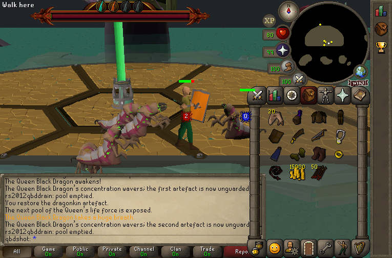
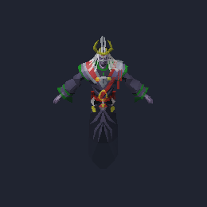
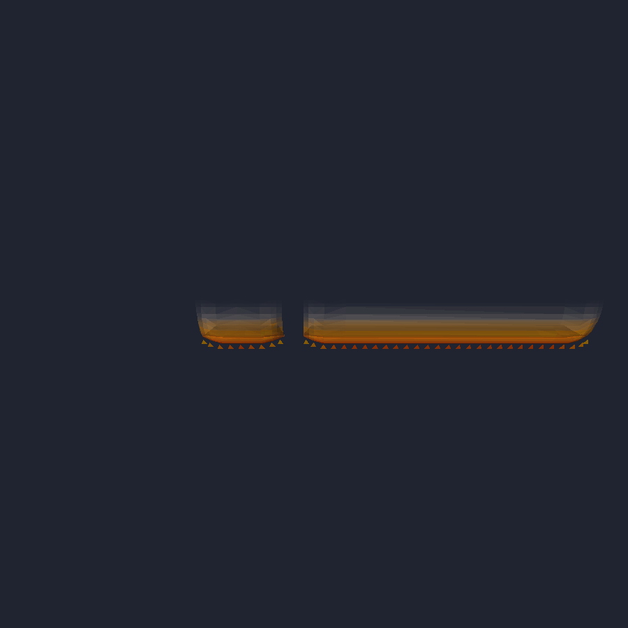

# QBD encounter — headless capture log

How to drive the encounter unattended and what the current captures show.

## Harness

The encounter is driven entirely through content debug procedures, so a
headless run exercises the real scripts rather than a stubbed path:

| Command | Effect |
|---|---|
| `::rs2012qbdmanifest` | QA entry (skips only the 60 Summoning gate) |
| `::rs2012qbddrain` | empties the current pool through the ordinary incoming-damage path, opening the intermission exactly as a real drain does |
| `::rs2012qbdrestore` | activates the current artefact from anywhere (resolves the active loc first, as a click would) |
| `::rs2012qbdheal` | tops HP/prayer, refreshes antifire, and parks the account at (33,28) so the north-facing camera frames the platform |
| `::rs2012qbdwall <phase>` | wire fixture: allocates the arena, parks outside the damage rows, casts one wall attack |
| `::rs2012qbdwallend` | releases the wall fixture's instance |

Run (BMP film strip every 20 frames from frame 400, cheats rotating one per
180 frames ≈ 3.6 s):

```sh
SDL_VIDEODRIVER=dummy MOCK230_SAVES=<scratch-saves> TORIRS_NO_CACHE_BAKE=1 \
TORIRS_NET_CHEAT='rs2012qbdmanifest;rs2012qbdheal;…;rs2012qbddrain;rs2012qbdrestore;…' \
TORIRS_NET_CHEAT_EVERY=180 TORIRS_NET_CHEAT_ROTATE=1 \
TORIRS_BMP_SERIES=<dir>,400,20,240 TORIRS_MAX_FRAMES=5600 \
./run-live.sh manifest_osrs239_rs2012.ini qbdshot test
```

`MOCK230_SAVES` must point at a scratch directory — headless runs write the
save back, so a shared one carries state (and deaths) between runs.
`TORIRS_NO_CACHE_BAKE=1` avoids the from-scratch `cache.osrs239.rs2012`
repack that `RS2012_QBD_TD.md` records as corrupting QBD's awake render.

## What the captures show



Phase-2 intermission: grotworms hatched from lobbed projectiles, each turned
to face the player and closing between magic casts (before the facing fix
they attacked whatever direction they spawned in). The player is on the
platform's south edge; the artefact pillar and the drained pool bar are
visible.



Source model 70761 → destination 110004 rendered standalone: the soul is a
fully opaque, textured model, so an absent soul in a scene is a placement or
spawn problem, never an invisible mesh.



Wall model 69880 → 110099, side elevation. The baked safe gap is the break
in the flame band; each pattern carries its hole at a different model-local
offset, which is why each wall type needs its own spawn anchor (§6.1).

## Verified this pass

- Wall rows reach the client as real spot-animations
  (`spawn_spotanim: id=10019 model=110101 seq=22043`), one row per tick, 60
  rows per three-wave cast — asserted on the wire by the mock230 selftest
  stanza and observed in the client log.
- Worms hatch, face, and approach.
- Drain → intermission → restore → next phase runs end to end through the
  production procs.

## Known gaps

- **Coord-targeted projectiles do not draw in this client.** The wall's
  retail delivery (one `MAP_PROJANIM` glide) reaches the client and spawns a
  world projectile with the right model and duration, but nothing appears —
  the same defect that leaves Inferno glyph projectiles invisible. The wall
  therefore ships on per-row `MAP_ANIM` spawns (§6.4). Fixing the projectile
  draw path is the follow-up that would let the wall become a single glide.

- **Tortured souls are never drawn.** Confirmed live: the souls spawn, speak
  their lament lines overhead, and appear as minimap dots, but no model is
  rasterised. `::rs2012qbdsoul` is an isolation probe — one soul, two tiles
  east, in an otherwise empty arena — and reproduces it every time.

  Ruled out, each by direct test rather than inspection:

  | Suspect | Evidence it is not the cause |
  |---|---|
  | Invisible/missing mesh | lane `rs2012_model_70761.ob3` renders opaque standalone |
  | Broken rig/animation | same model posed by a frame of its own seq 16883 renders correctly |
  | NPC type not resolving | `entity_sync: npc type replacement=25004 … model=installed` |
  | Model failed to build | same line reports `installed`, i.e. a non-NULL model |
  | Painter never registers it | `npc-draw: emit element=60 grid=56,48 aot=1 size=1`, every cycle |
  | One-entity-per-tile dedup | the same instrumentation shows `emit`, not `deduped` |
  | Z-buffer draw path | A/B with `TORIRS_ZBUFFER_NPCS=` — still invisible |
  | `alwaysontop` draw tier | A/B forcing it off client-side — still invisible |

  | Face render state | fixed, and ruled out — see below |

  The bake was leaving the record self-contradictory. `rs2012_material_bake`
  kept a texture id on every face whose material was renderable, but only
  wrote `face_infos` when that array already existed. The soul has no
  `face_infos` array and a single PMN entry for 1,931 faces, so it came out
  of the bake carrying texture 420 on faces the format reads as all-gouraud:
  the raster drew them untextured while `lighting_clamp_textured_vertex_colors`
  still clamped their vertex colours to a texture's 0..127 lightness ramp.
  The bake now refuses to keep a texture a model cannot express and sends
  those faces down the erase path instead, which is what the source client's
  SD fallback does. The soul's record is consistent again — 1,931 gouraud
  faces, `face_textures` all -1, colours intact at HSL 36..50372 — and 22,710
  faces across the lane changed with it.

  It did not make the soul appear. A/B capture, `::rs2012qbdsoul` against an
  identical run with the spawn removed: the two viewports differ by 2,564
  pixels, all inside x 0..131 / y 0..119, which is the Queen's idle animation
  landing on a different frame. Not one pixel differs near the player. The
  soul is emitted by the painter and rasterises nothing — the same signature
  as the coord-targeted projectiles above, and now the strongest reason to
  think the two share a cause in the draw path rather than in the data.

  What remains untested is the only link never exercised: the model as it
  exists **in the composed cache** (archive 110004 of `cache.osrs239.rs2012`)
  rather than as the lane `.ob3`. Every check above that "proved the model"
  used the lane file via `rs2012_model_view --model <file>`; the client loads
  the cache archive. A degenerate cache copy — zero faces, or collapsed by
  the OB3/material fallback — would present exactly this signature: builds
  non-NULL, registers, draws nothing. Next step is to extract archive 110004
  from the composed cache and diff it against the lane file, i.e. audit the
  backporter's model bake for this id.

- The QA account (99 stats, anti-dragon shield, heal every ~3.6 s) still
  dies in phase 3 once souls, worms and triple walls overlap. That is the
  encounter working, not a harness fault.
