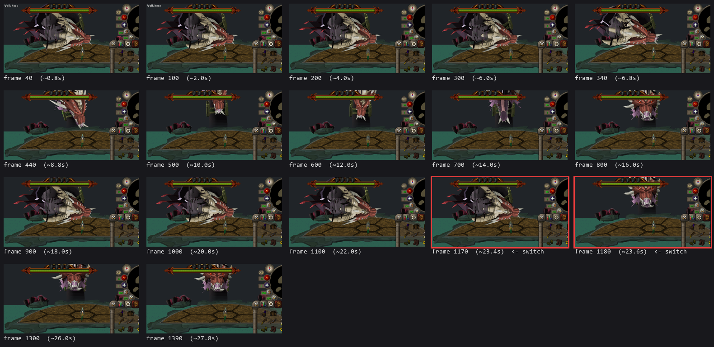

# QBD wake-up: a timelapse of the live client

This is a straight timelapse of the Queen Black Dragon encounter start, captured
frame-by-frame from the actual running client (not the isolated model viewer),
from her sleeping idle through the wake animation (`rs2012_seq_16714`) to the
`npc_changetype` switch into the fightable `rs2012_qbd_default` type.



The two red-bordered frames bracket the switch: **frame 1170** is still the wake
animation, **frame 1180** is the first frame after `npc_changetype` fires and
`rs2012_seq_16715` (active idle) takes over. 10 frames = 200 ms is the precision
of this pass; see [Reproducing it](#reproducing-it) to narrow it further.

## What the timelapse actually shows

- **0–6.8s (frames 40–340):** sleeping idle (`rs2012_seq_16716`). Stable,
  correctly rendered, laid-down pose. `"The Queen Black Dragon is sleeping..."`.
- **~7s: `"...stirs from her sleep..."`** — `npc_anim(rs2012_seq_16714, 0)` fires
  and the wake animation starts.
- **8.8–14s (frames 440–700): the wake animation is visually broken.** This is
  the part that matters. Frame 700 in particular renders almost nothing where
  the dragon should be — a sliver of geometry at the top edge of frame and
  otherwise empty water/platform. This is not a camera-framing issue: every
  frame in this set uses the identical camera position and zoom (applied once,
  before the encounter starts, and never touched again). The geometry itself is
  going somewhere the camera can't see, consistent with a pose-decode defect in
  this specific sequence (see [Investigation status](#investigation-status)).
- **16–22s (frames 800–1170): the pose recovers** to something close to the
  original sleeping silhouette, still playing `rs2012_seq_16714` — the message
  log has not printed `"awakens!"` yet at frame 1170.
- **~23.5s (between frames 1170 and 1180): the switch.** `"The Queen Black
  Dragon awakens!"` prints, `npc_changetype(rs2012_qbd_default, ...)` fires, and
  the model locks into the aggressive open-mouth idle pose. From here on
  (frames 1180–1390 and beyond) the pose is stable — no more flicker — because
  `rs2012_seq_16715` decodes and renders correctly (confirmed separately: it's
  the wake sequence specifically that's broken, not the model or the idle/sleep
  sequences).

The practical read: **the tick timing of the switch (`^rs2012_qbd_wake_anim_ticks
= 28`) is not the problem.** It fires at the right moment relative to the
animation. The problem is that the ~15 seconds in the middle of the wake
animation render broken, so a player watching the encounter start sees the
dragon mostly disappear and flicker for the bulk of the wait, which is what
reads as "waiting too long" — independent of whether the switch itself is
tick-exact.

## Investigation status

This corroborates and sharpens the finding from the prior investigation in this
thread: `rs2012_model_view.c`'s own header comment already flags that posing
this lane's sequences through the profile-based framemap decode does not
produce "a usable pose." The live-client capture here shows that failure is not
uniform across the wake animation's 108 frames — some keyframes render fine
(the sleeping-like silhouette around frames 800–1170), others collapse almost
entirely (frame 700) — which points at specific keyframes hitting a decode
defect rather than the whole sequence or framemap being wrong. `rs2012_seq_16715`
(idle) and `rs2012_seq_16716` (sleeping) do not exhibit this at all in this
capture.

Not yet root-caused to a specific line. The next concrete step is a debug dump
comparing decoded per-bone type/value output for a broken wake keyframe (e.g.
the frame around 700) against a working idle keyframe, both sourced from the
same framemap group (22000) — see the `dat2_frame.c` / `dat2_framemap.c` /
`cp_import.c:write_frame_archive` path referenced earlier in this thread.

## Reproducing it

Built and captured with the standard headless client:

```sh
export PATH="$PWD/toolchain/mingw64/bin:$PATH"
mingw32-make -C src EMBED_SERVER=1 CC=gcc win64
cp src/torirs_win64.exe dist/win64/torirs.exe

SDL_VIDEODRIVER=dummy TORIRS_MAX_FRAMES=1400 \
TORIRS_SIM_WHEEL='30,383,250,-15,1' \
TORIRS_BMP_SERIES="$PWD/build/qbd_wakeup_full,40,10,136" \
  ./src/torirs_win64.exe --manifest manifest_osrs239_rs2012.ini \
  --user qbdfull --pass test --soft3d
```

`manifest_osrs239_rs2012.ini` carries `[net:boot] cheat=rs2012qbdmanifest`, which
starts the encounter automatically on login — no manual navigation needed.
`TORIRS_SIM_WHEEL='30,383,250,-15,1'` zooms the camera out once, early, so the
whole platform (and whatever the dragon is doing) stays in frame for the entire
capture. `TORIRS_BMP_SERIES=dir,start,step,count` (see `src/main.c`, "a film
strip of a live sequence") is what makes this reliable: **a single
`TORIRS_EXIT_BMP` cannot catch this**, because the wake animation's start time
jitters by a few hundred frames run-to-run with login/asset-load latency — three
separate single-shot runs in this thread landed the "awakens" message anywhere
from frame ~880 to frame ~1450. The film-strip approach sidesteps that by
capturing everything in one continuous run and finding the transition after the
fact, rather than guessing a frame count up front.

The montage was assembled with a short Pillow script cropping each capture to
the arena/dragon region, thumbnailing, and labeling by frame number — nothing
that needs preserving as a tool, just documented here for repeatability.
