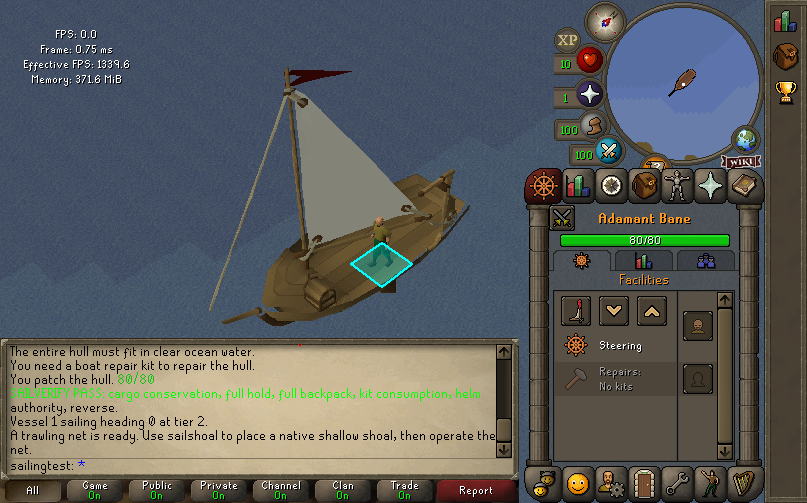
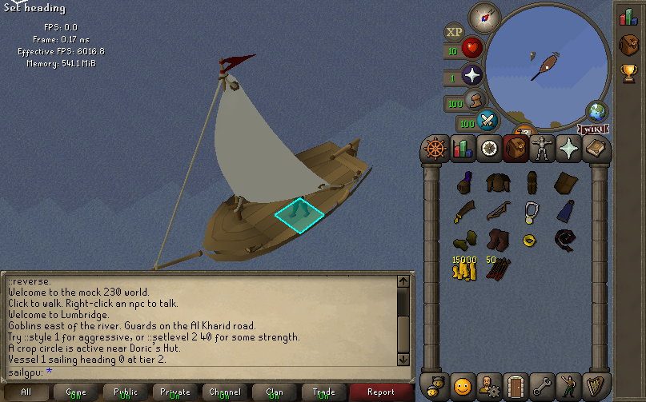
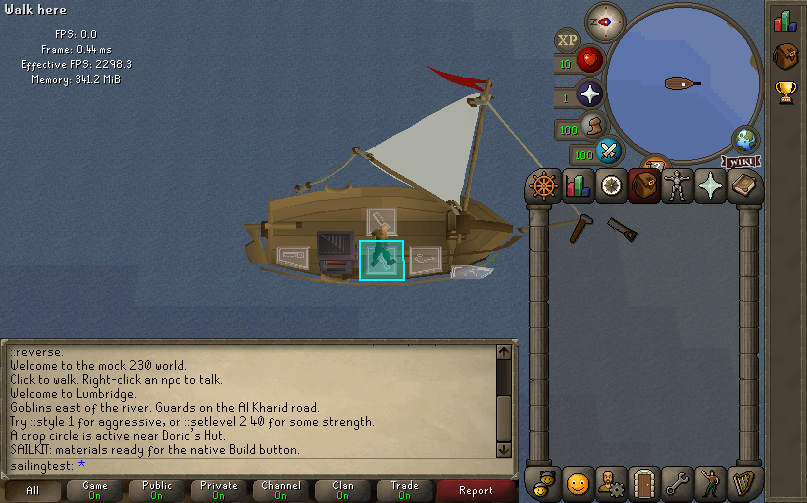
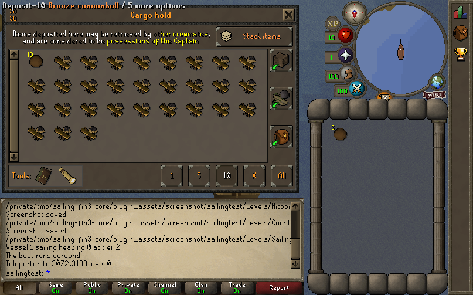
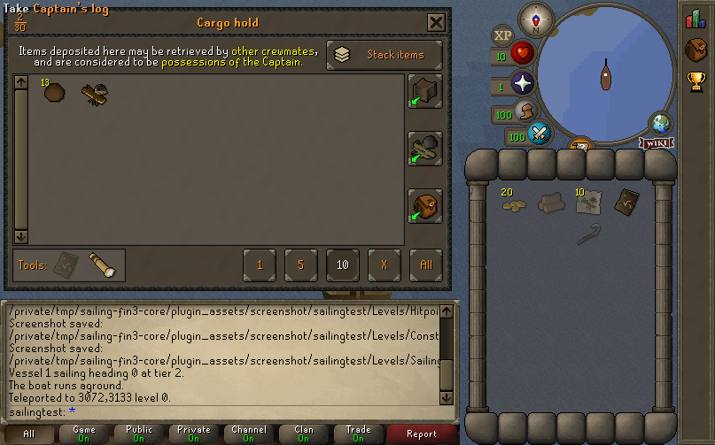
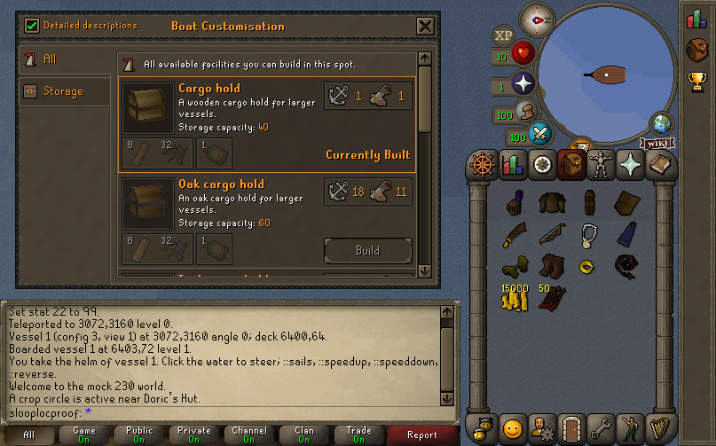

# Sailing validation

The acceptance tools run the actual revision-239 client, renderer, embedded
server, cache maps, and content scripts. The default fixture boards a wooden
skiff on natural ocean at **3072, 3160**. There is no stamped water arena.

## Status — 2026-09-07

**The sailing plan is finished.** The completion audit
([`plan-audit.md`](plan-audit.md)) stands at **47 Verified, 4 Open**; the
completion record is [`../SAILING_HANDOFF.md`](../SAILING_HANDOFF.md).

The final shared binaries were rebuilt at **09:35 on 2026-09-07** from the
current tree, which discharged the rebuild the 09:30 audit was owed and closed
**LIFE-1** and **SRV-1**:

| Artifact | SHA256 |
|---|---|
| `src/torirs` (embedded client and server) | `5e34b81f9d2a45eae7306e8ddf93de5c590a0b3cd475d726a7745eb0deffd03b` |
| `src/build_opt/torirsserver` | `6a0e7f0441c25f1249bc8342a5103744a4dbd991d721b67eaea1846db7d910d4` |
| `OSRS-Content/.../server/scripts/build/script.dat`, 30,076 scripts | `902a6b8d242bba01990b3955100e301c2a0edb6b1f18fc6ca83fd703a880df59` (**unchanged**) |

Hashes: `/tmp/sailing-fin3/hashes.txt`. The server hash matches the intermediate
09:34 build byte for byte because the last batch of edits added only `assert()`
calls, which `OPT=1` compiles out.

The two pairs before it — `4854e303` / `214b43d7` (08:08) and `c7e62cce` /
`a53899eb` (2026-09-06 21:38), both against the same pack — are named wherever
their evidence is still cited, with the difference stated. `plan-audit.md`
lists, file by file, which pair each result came from. Where a file's prose and
its JSON disagree about a hash, **the JSON is current**.

| | |
|---|---|
| Server, sailing-only suite | **563 checks, 0 failures** on the rebuilt server `6a0e7f04` (`/tmp/sailing-fin3/sailing-selftest.log`) |
| Server, full suite | **250,071 checks, 0 failures** — measured on `214b43d7`, **not** re-run on `6a0e7f04` |
| Unit gates | **12 of 12 exit 0** on the final pair (`/tmp/sailing-fin3/status.txt`), `test-world` among them |
| Acceptance tools | **9 of 9** `ok: true` on the final pair, results JSON regenerated in place |
| Social | **12 of 12**, re-run on the final pair by real mouse input |
| Cargo privacy | **3 of 3** choices by real mouse input — measured on `c7e62cce`, not repeated; the unit gate `test-cs2-sailing-settings` covering the same bridge is green on the final pair |
| Zero-boat render cost | **neutral** — identical pixels and work counts, median render Δ +0.32 % (measured on `4854e303`) |
| Warm harness | `state` 2.80 ms p95 2.87; `capture` 42.30 ms p95 42.98 (measured on `4854e303`) |

**Performance was not re-measured on the final pair, and no number here is
claimed to have been.** The final pair differs from `4854e303` by two
behavioural fixes (LIFE-1's reconnect guard, SRV-1's field initialiser), a set
of asserts and test controls, and one render-path change: the sailing
paint-order pass no longer `malloc`s per frame, using grown-once scratch buffers
instead. That change removes work rather than adding it, so the numbers above
stay relevant as measured.

The four Open rows, each named in full in the audit: **C0.3** (the five wire
refusals are implemented and source-reviewed but untested), **GPU-1/2/3** (three
`gl3-zbuffer` findings, all pre-existing or observational), **HARN-1**
(`::vesselspawnat` ignores the 16-heading berth clearance) and **EMB-1** (the
`test-torirsserver-embed` decode break, outside the sailing lane).

Four review items were **deliberately left** and are recorded with their
reasons in the audit: M-3 (duplicated shore constants), M-6 (the embed
private-mode assertion, blocked by EMB-1), L-3 (the pre-existing `!vm` guard
pattern) and L-7 (`ContentSymbol` zero fallbacks, the house pattern).

Two directories hold retired evidence and close nothing: **`gpu/historical/`**
(nine captures from client `54a09b3f`, kept because one of them is the prior art
that makes GPU-2 pre-existing) and the historical result files listed in the
audit's provenance section. `collision-maps.json`, `collision-maps.png` and
`crew-validation.json` were deleted as unreferenced stale artifacts; read
`collision-ocean-map.json` / `collision-shore-map.json` and `crew-actions.json`
instead.

## Fast visual loop

Build once, then keep the client loaded:

```sh
make -C src -j8 EMBED_SERVER=1 torirs
make -C src sscompile
src/build_opt/sscompile --src OSRS-Content/osrs239-content/server/scripts \
  --out OSRS-Content/osrs239-content/server/scripts/build \
  --content-root OSRS-Content/osrs239-content
python3 tools/sailing_harness.py --session /tmp/sailing start --headless
python3 tools/sailing_harness.py --session /tmp/sailing save ocean
python3 tools/sailing_harness.py --session /tmp/sailing cheat 'vesselsail 0 2'
python3 tools/sailing_harness.py --session /tmp/sailing step 30
python3 tools/sailing_harness.py --session /tmp/sailing capture /tmp/sailing.png
python3 tools/sailing_harness.py --session /tmp/sailing restore ocean
```

Warm measurements on the **08:08 pair** (`4854e303…` / `214b43d7…` / pack
`902a6b8d…`), taken 2026-09-07 08:53 with no other worker running; 20 samples
per operation. They were **not** re-taken on the 09:35 final pair, whose only
render-path difference removes two per-frame allocations from the sailing
paint-order pass:

| Operation | Median | p95 | vs 2026-09-06 baseline |
|---|---:|---:|---|
| State query | 2.80 ms | 2.87 ms | −1.3% |
| Pause | 2.83 ms | 5.31 ms | −3.9% |
| Save checkpoint | 2.78 ms | 2.85 ms | −4.0% |
| Restore checkpoint | 7.80 ms | 7.87 ms | −21.6% |
| Advance one server tick / 30 client cycles | 15.42 ms | 17.32 ms | −11.3% |
| Actual software-renderer PNG capture | 42.30 ms | 42.98 ms | −11.4% |

No operation regressed; capture's tail improved most (max 81.18 → 43.07 ms).
[`harness-performance.json`](harness-performance.json) also keeps a **second,
unfavourable set** taken minutes earlier, while a foreign `-j8` LTO link from
another worktree happened to be running — it is retained rather than discarded,
and it is the one the medians above should not be read from. Note that PID 65513
(another session's canoe client, ~45% of one core) is present in both sets and
in the 2026-09-06 baseline; it is a constant, not a variable.

See also the [harness design and checkpoint scope](../sailing_harness.md). Cold
loading is measured separately and is **not** part of the 100 ms warm-command
target: two fresh-session-directory cold starts on the idle machine took
**2.48 s and 2.47 s** (first launch of a run, with a cold page cache, 2.70 s).
Commands neither rebuild nor restart the warm client. Session metadata records
the binary and loaded script pack hashes, including whether a stale-pack
override was used during concurrent development.

### Zero-boat render cost — [results](render-final-results.json), [images](render/)

The complete 12-scene manifest suite, 3 repeats, alternating variant order, run
through [`tools/sailing_render_acceptance.py`](../../tools/sailing_render_acceptance.py).
Both executables link the same frozen application objects; only the control's
temporary `painters_bucket.u.c` replaces the two
`if( scenery_is_world_entity(element) )` branches with `if( 0 )`, so the delta
is the cost of *evaluating* that predicate in a boat-free scene, not of drawing
a vessel. The hand-checked diff between the two temporary sources is exactly
those two lines, and `painters.c` is byte-identical between halves.

- **Pixels and work are identical, 12/12 scenes.** All six runs of every scene
  share one image SHA256 and one counters dict — re-derived here from the
  per-run rows, not taken on the tool's own assertion. Every one of the 24
  scene images in [`render/`](render/) was opened and described in the results
  file; none is a blank frame that could pass parity trivially.
- **Cost is neutral within measurement error.** Median render p50 delta across
  the twelve scenes is **+0.32%**, mean **+1.09%**, and the mean is pulled up
  entirely by two scenes that did not reproduce on repetition. Median *paint*
  delta is **−1.97%**, which is itself a sign the residual is run-to-run
  variation rather than a real cost.
- **Both unfavourable scenes were re-measured alone and are preserved with
  their follow-ups.** `grand-exchange-orbit` +8.23% at 3 repeats → **+0.18%**
  at 5 repeats (the suite value was one 2.088 ms outlier window).
  `falador-ground` +4.53% at 3 repeats → **+1.99%** at 5 repeats (median
  difference 0.069 ms, exact two-sided p = 0.119 — *not* neutral, so a second
  independent 5-repeat run was taken) → **+0.32%**, p = 1.0. Not reproducible,
  so treated as noise; the largest honest upper bound that scene supports is
  about 0.07 ms on a 3.47 ms render stage.

**Plainly: the zero-boat path is neutral.** With no vessel in the scene the
world-entity descent changes no pixel, no work count, and no measurable time.

One caveat on provenance, recorded in full in the results file: the frozen pair
could **not** be built from the shared objdir. `build_opt_es/torirs_server_world.o`
had been deleted by `objverify` because another session saved
`src/torirsserver/torirs_server_world.c` at 08:37:39 — after root's 08:08 shared
build — and `make` in the shared objdir was refused by this session's permission
layer. The pair was therefore linked against a **private** full build of the
current sources (`src/build_perf_opt_es`, 436 objects, 08:54). Nothing under
`src/build*`, `src/torirs` or `src/build_opt/torirsserver` was written, and both
shared hashes were re-verified unchanged afterwards.
The [final core run](final-core-results.json) used the current compiled pack
without an override: collision acceptance took 1.03 seconds and the deck
animation/restore acceptance took 0.57 seconds.

## Reproducible checks

```sh
python3 tools/sailing_collision_acceptance.py --session /tmp/sailing
python3 tools/sailing_cargo_acceptance.py --session /tmp/sailing
python3 tools/sailing_deck_acceptance.py --session /tmp/sailing
python3 tools/sailing_facility_acceptance.py --start
python3 tools/sailing_crew_acceptance.py --start
```

The collision check surveys separate boat/player maps, sails toward the real
shore, checks the complete hull stops, rejects a land spawn, and restores a
checkpoint partway through client interpolation. The focused C test also
checks rotation sweeps, thin obstacles, native hull offsets, and scene rebuilds.

The cargo check clicks the native interface: dismiss its warning, withdraw all
13 bronze cannonballs, deposit exactly 10, and verify that the backpack and
captain's inventory conserve the total while server time stays paused. It also
checks the native storage whitelist, rejection of forged deposit buttons for
coins/noted kits, and shared tool storage/retrieval without consuming hold space.

The deck check verifies that a real sailcloth model exists, native sail
sequences alter its rendered vertices, animation advances exactly once per
client cycle, and restoration recovers the saved frame and mesh hash. It also
installs a net and verifies restoration removes its actual scene model.
The same deck regression passes with `--renderer gl3-zbuffer`; the GPU renders
the composed boat/deck geometry and captures the presented framebuffer.

The activity check uses genuine wreck/shoal/NPC entities and real gust timing.
Fixtures supply inputs; the production activity handlers must earn the wind,
salvage, fish, experience and cannon damage. Assertions compare inventory
deltas, stop/cancel behaviour, and visible client NPCs. Captures require human
visual inspection in addition to the executable assertions.

The crew check uses the real recruitment interface and assignment controls,
then verifies autonomous salvage, trawling, repairs, cannon fire and natural
sail trimming, including resource/experience deltas and cancellation. The
captain can walk on deck and issue bearings while qualified crew navigate.

Focused native tests pass for boat collision, compass projection, GPU deck
traversal, NPC movement, packet encoding, cargo inventory isolation, native
array operations, typed interface triggers and the CS2 settlement contract.
The host request tests cover all 653 declared request kinds.

## Visual evidence













The deck, cargo, raft/sloop model previews and shipyard build/restore captures
above were opened and visually inspected. Individual JSON reports retain the
commands and measured state used to produce the captures.
Additional inspected evidence includes [crew work](crew-actions.json),
[cannon panel mouse controls](cannon-panel-results.json),
[special ammunition effects](ammunition-effects-results.json), and
[safe script reload](reload-results.json).
Native Build also [awards Construction XP](native-build-xp-results.json) only
for successful self-builds; failed, repeated and paid builds award none.
The [Captain's Log hint view](captains-log-hint.png) and
[native spyglass](spyglass.png) were also opened and visually inspected.

## Final-pair acceptance `5e34b81f` — 2026-09-07 09:36

Root rebuilt both binaries at 09:35 from the current tree, after the LIFE-1 and
SRV-1 fixes and the 09:40 review edits, and re-ran every acceptance tool on the
new pair. **The section below, and its hash table, belong to the previous
(08:08) pair.**

| Artifact | SHA256 |
|---|---|
| `src/torirs` (embedded client and server) | `5e34b81f9d2a45eae7306e8ddf93de5c590a0b3cd475d726a7745eb0deffd03b` |
| `src/build_opt/torirsserver` | `6a0e7f0441c25f1249bc8342a5103744a4dbd991d721b67eaea1846db7d910d4` |
| `OSRS-Content/.../server/scripts/build/script.dat`, 30,076 scripts | `902a6b8d242bba01990b3955100e301c2a0edb6b1f18fc6ca83fd703a880df59` |

Hashes verified on disk before the first run: `/tmp/sailing-fin3/hashes.txt`.
Build logs `/tmp/sailing-fin3/{server,client}-build.log`, both `exit=0`.

| Tool | Session | Results JSON | Result |
|---|---|---|---|
| collision | `/tmp/sailing-fin3-core` | `collision-results.json` | `ok: true` |
| cargo | `/tmp/sailing-fin3-core` | `cargo/results.json` | `ok: true`, 10 checks |
| deck | `/tmp/sailing-fin3-core` | `deck-results.json` | `ok: true` |
| facility | `/tmp/sailing-fin3-facility` | `activity-results.json` | `ok: true`, 9 captures |
| crew | `/tmp/sailing-fin3-crew` | `crew-actions.json` | `ok: true`, 6 captures |
| extractor | `/tmp/sailing-fin3-extractor` | `extractor-grace-results.json` | `ok: true`, 5 checks |
| client | `/tmp/sailing-fin3-client-overlap` | `client/client-results.json` | `ok: true`, 9 captures |
| multiplayer | `/tmp/sailing-fin3-multiplayer` | `multiplayer/results.json` | `ok: true` |
| social | `/tmp/sailing-fin3-social-ocean`, `-berth` | `social/results.json` | `ok: true`, 12/12 |

Per-tool logs: `/tmp/sailing-fin3/accept/<tool>.log`. Every one of those results
JSON files now carries `5e34b81f…` and `902a6b8d…`. The image descriptions
elsewhere in this file were written against the previous pair's captures; two of
the regenerated frames were opened and re-checked against their prose and match
— `collision-stopped.png` (skiff stopped against the shore, chat *The boat runs
aground.*, hull 78/80, Facilities panel reading *Steering*) and
`social/editnav-armed-on-guest.png` (the *Edit-navigator → Deckhand (level-1)*
hover with the guest outlined on deck).

Unit gates and the sailing suite on the same pair: **twelve targets, all exit
0**, run serially in `src/build_opt_es` — `test-sailing-paint-order`,
`test-painters-world-entity`, `test-frame-flat`, `test-world`,
`test-minimenu-world`, `test-cs2-sailing-settings`, `test-sailing-collision`,
`test-mock239-playerinfo`, `test-wev-rebuild`, `test-wev`, `test-rsprot-bridge`,
`test-social` (`/tmp/sailing-fin3/status.txt`, one `<target>.log` each) — and
the sailing-only server suite at **563 checks, 0 failures**
(`/tmp/sailing-fin3/sailing-selftest.log`, `.tsv`). See
[`unit-gates.md`](unit-gates.md) and [`server/README.md`](server/README.md).

**The full server suite was not re-run on `6a0e7f04`.** It was 250,071/0 on
`214b43d7` earlier the same day, and the only server-side source differences
since are SRV-1's one-line initialiser, a cached `getenv`, and asserts that
`OPT=1` compiles out. That is a carry-forward, stated so it is not mistaken for
a fresh measurement.

**LIFE-1 is closed on this pair.** Five consecutive aboard `raw logout` cycles
in session `/tmp/sailing-fin3-life` produced five
`torirsserver: reconnect user='fin3life' session=ok` lines, **zero**
`login: rejected` and **zero** `connection lost`
(`/tmp/sailing-fin3-life/client.log`). `lifecycle-reconnect-fixed.png` was
re-taken on this pair.

**One thing this section does not claim.** The first acceptance pass in this
session failed five tools; `/tmp/sailing-fin3/accept/status.txt` still records
that. It was a shell-scripting mistake — `zsh` did not word-split a variable —
not a product failure. The real results are `status2.txt` and the per-tool logs
named above.

## Re-stamp on the 08:08 pair 4854e303 — 2026-09-07 (superseded by the section above)

Root rebuilt the shared binaries at 08:08 from the final sources. **Everything
in the 2026-09-06 section below was produced by the previous pair
(`c7e62cce` / `a53899eb`) and its hash tables are stale.** Worker `restamp`
re-ran all eight automated acceptance tools, both server suites and ten unit
gates on the new pair. The image descriptions below were re-checked against the
new captures and, apart from the two `collision-*` bullets amended in place and
marked `restamp`, they still describe what the frames show.

| Artifact | SHA256 |
|---|---|
| `src/torirs` (embedded client and server) | `4854e3036abf814d07ce97649845d30206bac647b49adce560e3e9b28fa927a4` |
| `src/build_opt/torirsserver` | `214b43d7a30dd47b67b47693e1b9820d299c2154eeb2193aeb2c4ec0b7082186` |
| `OSRS-Content/.../server/scripts/build/script.dat`, 30,076 scripts | `902a6b8d242bba01990b3955100e301c2a0edb6b1f18fc6ca83fd703a880df59` |

All three were verified on disk before the first run. Every session below
recorded the client and pack hashes itself, with `allow_stale_scripts: false`.

| Tool | Session | Account | Results JSON | Result |
|---|---|---|---|---|
| collision | `/tmp/sailing-fin-core` | `sailingtest` | `collision-results.json` | `ok: true` |
| cargo | `/tmp/sailing-fin-core` | `sailingtest` | `cargo/results.json` | `ok: true`, 10 checks |
| deck | `/tmp/sailing-fin-core` | `sailingtest` | `deck-results.json` | `ok: true` |
| facility | `/tmp/sailing-fin-facility` | `sailacts` | `activity-results.json` | `ok: true`, 9 captures |
| crew | `/tmp/sailing-fin-crew` | `crewcheck` | `crew-actions.json` | `ok: true`, 6 captures |
| extractor | `/tmp/sailing-fin-extractor` | `sailingtest` | `extractor-grace-results.json` | `ok: true`, 5 checks |
| client | `/tmp/sailing-fin-client-overlap` | `sailingtest` | `client/client-results.json` | `ok: true`, 9 captures |
| multiplayer | `/tmp/sailing-fin-multiplayer` | `peerproof` | `multiplayer/results.json` | `ok: true` |

All eight sessions were stopped. Every one of those JSON files now carries
`4854e303…` and `902a6b8d…`. Server suites and unit gates:
`server/README.md` (**563/0** sailing-only and **250,071/0** full, both on the
shared server — the previous full-suite failure is gone) and `unit-gates.md`
(**10 of 10 PASS** on that pair; twelve targets, all exit 0, on the 09:35 final pair — `test-world` among them in both).

### Three things this section deliberately does not claim

1. **`crew-validation.json` was stale and is now deleted.** The crew
   acceptance writes `crew-actions.json`; `crew-validation.json` was an
   unrelated 2026-09-06 11:12 artifact that no tool in this phase rewrote, and
   it was removed at 09:45 along with `collision-maps.png`. Read
   `crew-actions.json` for the crew provenance.
2. **`client/README.md` and `multiplayer/README.md` printed the old
   `c7e62cce` / `a53899eb` tables** in their own provenance blocks at the time
   this section was written. Both now carry the 09:35 final pair with the
   preceding pairs labelled as such.
3. **No performance claim.** Other workers were driving clients on this machine
   throughout, so every `elapsed_ms` in this phase is scheduling noise, not a
   measurement.

### Two acceptance tools were repaired, then re-run to prove the repair

Both edits are behaviour-preserving and confined to the tools.

- `tools/sailing_collision_acceptance.py` was the **only** acceptance tool that
  recorded no provenance at all — `collision-results.json` named neither binary
  nor pack, so it could not be told apart from a run on any other build. It now
  reads `session.metadata()` and writes a `provenance` block
  (`binary_sha256`, `script_sha256`, `script_pack`, `allow_stale_scripts`),
  the same four keys the cargo tool already used. Re-run afterwards:
  `ok: true`, and the file now carries `4854e303…` / `902a6b8d…`.
- `tools/sailing_cargo_acceptance.py` stated all 26 of its conditions with bare
  `assert`. `python3 -O` deletes those statements outright, so the tool would
  have printed `ok: true, checks: 10` while checking nothing — the worst
  possible failure for an acceptance tool. Every one is now a `require()` that
  raises `HarnessError`, keeping the same condition and the same context in the
  message. Its `--output` default was also anchored to `ROOT` instead of the
  relative `docs/sailing_validation/cargo`, which silently wrote into whatever
  directory the tool happened to be invoked from.

  Both halves were proved with named negative controls:
  `python3 -O -c "assert False, ..."` prints its follow-on statement, i.e. the
  old shape really is compiled out, while `require(False, ...)` under the same
  `-O` raises `HarnessError: deliberate negative control`. The tool itself was
  then re-run under `python3 -O` (`ok: true`, 10 checks) and once more from
  `/tmp`, where it still wrote to
  `/Users/.../3draster/docs/sailing_validation/cargo` and left no `/tmp/docs`
  behind.

## Acceptance on the 2026-09-06 21:38 pair `c7e62cce` (superseded twice)

The six core acceptance tools were rerun end to end on what were then the final
shared binaries and the final shared script pack. Every tool reported
`ok: true`. **Two rebuilds have happened since** — `4854e303` at 08:08 and the
final `5e34b81f` at 09:35 on 2026-09-07 — and all of these tools were re-run on
both. This section and its hash table are historical.

| Artifact | SHA256 |
|---|---|
| `src/torirs` (embedded client and server) | `c7e62cce180aaeb6bc4cd044818b0209ca99edb478f5280c3ebd10d6b79b1d8d` |
| `src/build_opt/torirsserver` | `a53899eb8ce5d086e36df3653aaccfd2ee93c05f8e767ece05ecc40a94b9c3db` |
| `OSRS-Content/.../server/scripts/build/script.dat`, 30,076 scripts | `902a6b8d242bba01990b3955100e301c2a0edb6b1f18fc6ca83fd703a880df59` |

Each session recorded those same client and pack hashes with no stale-pack
override, and every results JSON in this section repeats them:

| Session | Account | Tools |
|---|---|---|
| `/tmp/sailing-final` | `sailingtest` | collision, cargo, deck |
| `/tmp/sailing-final-facility` | `sailacts` | facility activities |
| `/tmp/sailing-final-crew` | `crewcheck` | crew |
| `/tmp/sailing-final-extractor` | `sailingtest` | extractor shore grace |

All four fixtures are headless `soft3d`, wooden skiff, natural ocean at
**3072, 3160**. Other native clients were running on the same machine during
this run, so the `elapsed_ms` values in these reports are **not** performance
evidence; harness timing is measured separately on an idle machine.

### Collision — [results](collision-results.json)

Every image below was opened and inspected.

- `collision-before.png` — skiff alone in open dark-blue water, no shore
  anywhere in the frame or on the minimap; sail furled to a narrow strip along
  the mast, red masthead pennant, captain highlighted on the helm tile.
  **Amended 2026-09-07 (`restamp`).** This bullet used to end "Facilities panel
  reads *Steering*, hull 80/80". On the final binaries the right sidebar is the
  ordinary **combat tab** in every collision frame, because the cargo run's
  `close` ran before collision on the same warm session, so no Facilities panel
  and no hull bar is on screen. Hull 80/80 is still established, by
  `collision-results.json` (`before.hp 80 / hp_max 80`) and by the chat line
  *You patch the hull 80/80*. The water, hull and helm highlight are unchanged.
- `collision-underway.png` — same hull with the sail raised and drawn wide,
  moved south far enough that the northern coastline has entered the top of the
  frame and the top of the minimap; chat reads *Vessel 1 sailing heading 0 at
  tier 2*.
- `collision-mid-motion-restored.png` — after a checkpoint restore taken
  halfway through client interpolation: hull, raised sail, coastline and
  minimap are the same paused frame as `collision-underway.png`, not a snap
  back to the ocean start.
- `collision-stopped.png` — the hull is parked in water with the green rocky
  southern shore filling the top half of the frame; the bow sits at the
  waterline and no part of the hull overlaps land; chat reads *The boat runs
  aground*. **Amended twice.** On the 08:08 (`4854e303`) capture the 78/80 was
  real but **not visible in the frame**, because the cargo run's `close` had
  run before collision on the same warm session, leaving the ordinary combat
  tab in the sidebar. **On the 09:36 re-capture (final pair `5e34b81f`)
  collision ran first, so the frame does show the Facilities panel reading
  *Steering* and the hull bar at 78/80** — this worker opened the current file
  and confirms it. The numbers are in `collision-results.json` either way
  (`stopped.hp 78`, `hp_max 80`, `state 0`, `fine_z 401600`).
- `collision-restored.png` — back to the `collision-before.png` framing exactly:
  open water, furled sail, hull 80/80, captain on the helm tile.
- `collision-land-rejected.png` — **negative control.** After a deliberate land
  spawn at 3072,3133 the player stands on grass among trees and cliff, there is
  **no hull anywhere in the frame**, and the sidebar has fallen back to the
  ordinary combat tab, i.e. no vessel was created on land.

### Cargo — [results](cargo/results.json)

- `cargo/native-cargo-roundtrip.png` — the native Cargo hold (943/944) open with
  its captain-possession notice, Stack items toggle and 1/5/10/X/All quantity
  row; the hold reads 30/30 used, the withdrawn-then-redeposited bronze
  cannonball stack shows **10** in the first slot, the backpack behind it shows
  the remaining **3**, and the hovered option is the native
  *Deposit-10 Bronze cannonball / 5 more options*.
- `cargo/native-cargo-whitelist.png` — after *Deposit inventory* the hold holds
  only **2/30**: the 13 bronze cannonballs and the single unnoted repair kit.
  The refused items are all still in the backpack — 20 coins, the log, the
  stack of 10 **noted** repair kits and the quest-locked tool — and the shared
  charting tools sit in the separate **Tools** row, which consumes no hold
  capacity; the hovered option is *Take Captain's log*.

The whitelist policy rows therefore still hold after the cargo ACL changes:
bronze cannonballs (31906) deposit and withdraw normally, coins (995), logs
(1511), noted kits (31965) and the quest-locked tool (31807) are refused both
by the highlight bitmask (`varp 5205 == 56`, client equal to server) and by
forged `IF_BUTTON` op-6 deposits on ineligible slots, and the shared charting
tool (31986) is recoverable through the native Tools button.

### Deck models and animation — [results](deck-results.json)

- `deck-baseline.png` — side view of the skiff; sailcloth furled to a narrow
  grey triangle hanging along the mast and boom, hull planking and thwarts
  visible, captain on the deck tile.
- `deck-sailing.png` — the same hull with the cloth raised into a full curved
  sail; chat carries the green `SAILVERIFY PASS: cargo conservation, full hold,
  full backpack, kit consumption, helm authority, reverse` line and the two
  *That item cannot be stored in a cargo hold* refusals from the cargo run.
- `deck-sailing-next.png` — one client cycle later; the cloth's curvature and
  foot have visibly changed and the world marker in the water has slid,
  i.e. the skeletal sail animation advanced with the hull still moving.
- `deck-sailing-looped.png` — after a complete 90-frame cycle the cloth is
  still a full raised sail (no terminated or collapsed mesh), and the boat has
  travelled far enough south that land appears on the minimap.
- `deck-restored.png` — checkpoint restore returns the furled baseline cloth,
  identical in shape and position to `deck-baseline.png`.
- `deck-net-installed.png` — a real trawling-net mesh now hangs from the port
  rail amidships; chat reads *A trawling net is ready*.
- `deck-net-restored.png` — the net model is gone from the rail and the deck is
  the baseline hull again; no facility model was left behind.

### Facility activities — [results](activity-results.json)

- `activity-baseline.png` — high three-quarter view of the skiff alone on open
  ocean, sail furled, Facilities panel showing *Steering* and *Repairs: No kits*.
- `activity-wind-gust.png` — the boat under way on a turned heading with the
  gale-catcher device visible on the after deck and two wind rows in the
  Facilities panel; chat reads *A gust fills the sails. Trim them for a burst
  of speed!*
- `activity-wind-released.png` — hull on a further heading with the sail drawn;
  chat adds *You trim the sails and catch the gust*, and the catcher model is
  still installed on deck.
- `activity-hook-deployed.png` — a genuine small shipwreck floats immediately
  off the bow-quarter; the salvage hook row has appeared in the Facilities
  panel and chat reads *You deploy the hook into the shipwreck*.
- `activity-hook-stopped.png` — same wreck and hull, chat adds *You raise the
  salvaging hook*; nothing else on the deck changed.
- `activity-net-shoal.png` — the trawling net hangs over the starboard side and
  a pale shoal-ripple NPC ring is drawn in the water beside the hull; the
  Facilities net row gained its depth up/down arrows.
- `activity-net-collected.png` — the ripple ring has drifted and the net is
  still deployed; chat reads *You collect 11 fish from the nets*.
- `activity-cannon-firing.png` — a bull shark swims alongside with a green/red
  health bar and a red **8** hitsplat, the shark also shows as a yellow minimap
  dot, and the Facilities cannon row shows the stop control with **11** rounds
  left of the 12 loaded.
- `activity-cannon-stopped.png` — the shark is gone and a *Bones (0 gp)* ground
  item label floats where it died; the cannon row's magazine now reads **0**
  after the unload.

### Crew — [results](crew-actions.json)

- `crew-salvaging.png` — the recruited crewmate stands amidships at the hook
  derrick while the captain's tile stays on the helm; chat records
  *Jobless Jim joins your recruits* and the ready wreck.
- `crew-trawling.png` — the crewmate works the net mounted at the starboard
  midship with the shoal ripples visible under the hull.
- `crew-repairing.png` — hull back at 80/80 with *Repairs: No kits* in the
  panel (the kits were consumed) and the crewmate amidships; chat records the
  fixture's 10 hull damage and 2 repair kits.
- `crew-cannon.png` — the cannon model sits on the after deck with the crewmate
  beside it, the shark visible below the hull, minimap dot present, and the
  Facilities magazine reading **11** after the crew's first shot.
- `crew-trimming.png` — the boat is under a raised sail on a new heading with
  the crewmate at the stern helm and the captain forward; chat shows the gust
  line, i.e. crew navigation trimmed without the captain.
- `crew-helm-walking.png` — the Facilities panel now reads *Not steering* and
  chat reads *You step away from the helm*: the captain's tile has moved
  forward on the deck while the crewmate keeps the boat turning.

### Extractor shore grace — [results](extractor-grace-results.json)

- `extractor-grace-active.png` — the crystal extractor model is installed
  amidships and the tile the mouse activated is outlined in white; chat reads
  *You activate the crystal extractor. It will produce a wind mote in one
  minute*.
- `extractor-grace-ashore.png` — the captain stands on the real grass of the
  coast with the beached hull, mast and extractor at the right edge, and the
  sidebar has fallen back to the combat tab; chat reads *You walk down the
  gangplank*. This is the state in which charging continues for 17 ticks.
- `extractor-grace-returned.png` — the captain is aboard again (sailing panel
  and hull 80/80 restored) with the hull moored against the shore and the
  extractor still installed; chat shows the alternating gangplank
  down/up sequence used for the quick-reboarding checks.

## Research and implementation boundaries

The repository's [Sailing research](../SAILING.md),
[collision design](../sailing_collision.md), and the revision-239 cache provide
the native interfaces, model/animation IDs, hull dimensions, facilities,
requirements, capacities and crew stats. Research also used Jagex's
[launch preparation article](https://secure.runescape.com/m=news/prepare-for-sailing---launching-november-19th?oldschool=1),
[launch article](https://secure.runescape.com/m=news/sailing-is-out-today?oldschool=1),
[preparation video](https://www.youtube.com/watch?v=17G2iSghB4I), and
[launch video](https://www.youtube.com/watch?v=CFtwftwNWRI).
Video storyboards were inspected for the boat facilities, interfaces and
shipyard presentation.

Checkpoint restoration covers the owned sailing fixture, inventories, stats,
facilities, timers and visual phases. It rejects active encounters and does
not rewind depleted wrecks or damaged root-world NPCs. Activity fixtures tag
their own temporary NPCs so repeat tests can clean up those entities safely.
Retail rare-drop tables and every sea encounter are separate world content;
the facility reward choices and supported producers are documented in
[activities.md](activities.md).
