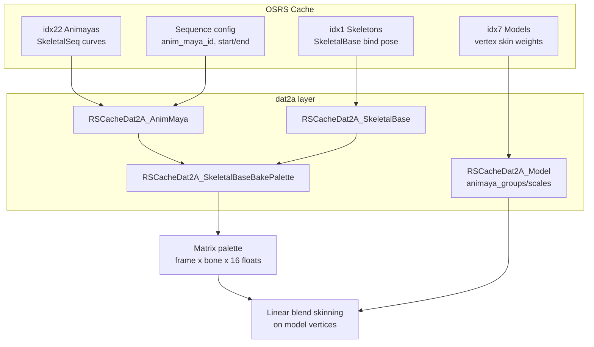
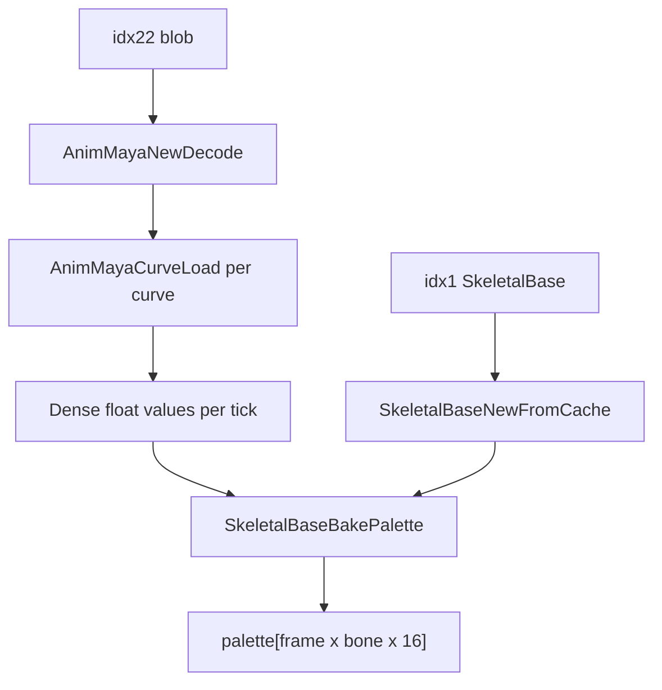

# Animaya Animation System in dat2a

This document explains how the **dat2a C layer** implements OSRS skeletal animation ("Animaya"). It complements the TypeScript reference files in this directory (`SkeletalSeq.ts`, `Curve.ts`, `SkeletalBase.ts`, etc.) by describing what the C code actually loads, decodes, and produces.

For the older keyframe animation system (idx20–21 frame maps), see [docs/seq/](../seq/).

## Overview

Animaya is OSRS's modern skeletal animation system. It replaces the classic frame-map animation used by older models and is used by most modern NPCs and other skeletal meshes.

In dat2a, "Animaya" refers to **three cooperating pieces of cache data**, not a single file:

| Concept | Cache index | C type | Role |
|---------|-------------|--------|------|
| Animation clips | idx22 (`RSCacheDat2Disk_Table_Animayas`) | `RSCacheDat2A_AnimMaya` | Time-varying bone transforms stored as animation curves |
| Bind pose | idx1 (`RSCacheDat2Disk_Table_Skeletons`) | `RSCacheDat2A_SkeletalBase` | Bone hierarchy, rest-pose local matrices, and decomposed defaults |
| Per-vertex skin weights | idx7 models (`hasAnimayaGroups` flag) | `RSCacheDat2A_Model.animaya_*` | Which bones influence each vertex and with what weight |

A skinned character needs all three:

- **idx22** says what each bone does over time.
- **idx1** says where bones sit in the rest pose and how they are parented.
- **idx7** says which bones move which vertices.

Sequence configs (idx12) wire an entity's standing/walk animations to an `anim_maya_id` plus an optional playback range.

### Architecture



**Mental model:**

- **Animaya (idx22)** = what bones do over time.
- **Model animaya skin (idx7)** = which bones move which vertices.
- **SkeletalBase (idx1)** = rest pose and hierarchy.
- **BakePalette** = bridge from curves + bind pose to per-frame skinning matrices.
- **Vertex skinning** = weighted sum of bone-transformed positions.

## Source Files

| C implementation | Header | TypeScript reference |
|------------------|--------|----------------------|
| [dat2a_animaya.c](../../src/osrs/rscache/dat2a/dat2a_animaya.c) | [dat2a_animaya.h](../../src/osrs/rscache/dat2a/dat2a_animaya.h) | `SkeletalSeq.ts`, `Curve.ts`, `CurveInterp.ts` |
| [dat2a_skeletalbase.c](../../src/osrs/rscache/dat2a/dat2a_skeletalbase.c) | [dat2a_skeletalbase.h](../../src/osrs/rscache/dat2a/dat2a_skeletalbase.h) | `SkeletalBase.ts`, `SkeletalBone.ts` |
| [dat2a_model.c](../../src/osrs/rscache/dat2a/dat2a_model.c) (skin parse) | [dat2a_model.h](../../src/osrs/rscache/dat2a/dat2a_model.h) | — |
| [dat2a_config_sequence.c](../../src/osrs/rscache/dat2a/dat2a_config_sequence.c) | [dat2a_config_sequence.h](../../src/osrs/rscache/dat2a/dat2a_config_sequence.h) | — |

The C code is a port of the TypeScript reference in this directory. The headers cross-link to the corresponding TS files.

## Cache Lookup

Animaya clips and sequence configs use a **composite 32-bit id**:

```
archive_id = anim_maya_id >> 16
file_id    = anim_maya_id & 0xFFFF
```

| Resource | Table enum | Loader |
|----------|-----------|--------|
| Animation clip | `RSCacheDat2Disk_Table_Animayas` (idx22) | `RSCacheDat2A_AnimMayaNewFromCache()` |
| Bind pose | `RSCacheDat2Disk_Table_Skeletons` (idx1) | `RSCacheDat2A_SkeletalBaseNewFromCache(maya->base_id)` |
| Skinned model | `RSCacheDat2Disk_Table_Models` (idx7) | `RSCacheDat2A_ModelNewFromCache()` |

`RSCacheDat2A_AnimMayaNewFromCache()` loads the idx22 archive, finds the file matching `file_id`, and passes the raw bytes to `RSCacheDat2A_AnimMayaNewDecode()`.

## Data Structures

### `RSCacheDat2A_AnimMaya`

Top-level decoded skeletal animation clip (maps to `SkeletalSeq` in `SkeletalSeq.ts`):

| Field | Meaning |
|-------|---------|
| `id` | Composite cache id |
| `version` | Format version byte |
| `base_id` | Reference to idx1 skeletal bind pose |
| `pose_id` | Which bind-pose pose index to use as defaults |
| `bone_curve_count` | `max_bone_index + 1` discovered during decode |
| `bone_curves[]` | Per-bone array of up to 9 curves |

### `RSCacheDat2A_BoneCurves`

Nine optional curve slots per bone. A NULL slot means "use bind-pose default for this channel":

| Slot | Channel |
|------|---------|
| 0–2 | Rotation X, Y, Z (radians, euler) |
| 3–5 | Translation X, Y, Z |
| 6–8 | Scale X, Y, Z |

### `RSCacheDat2A_Curve`

A single animated channel. **Before** `RSCacheDat2A_AnimMayaCurveLoad()`: raw `CurvePoint[]`. **After** load: dense `float values[]` indexed by `(tick - start_tick)`, with raw points freed.

### `RSCacheDat2A_SkeletalBase`

Bind-pose skeleton from the tail of an idx1 SeqBase file:

- `bone_count`, `pose_count`
- Per bone: `parent_id`, `local_matrices[pose]`, lazily computed `model_matrices`, `inverted_model_matrices`
- Decomposed defaults: `rotations`, `translations`, `scalings` (extracted from local matrices)

### Model skin data (`RSCacheDat2A_Model`)

Set only when the model was decoded with `hasAnimayaGroups == 1`:

```c
int      animaya_vertex_count;
uint8_t* animaya_group_counts; /* [animaya_vertex_count] — influences per vertex */
uint8_t** animaya_groups;      /* [vertex][j] — bone index */
uint8_t** animaya_scales;      /* [vertex][j] — weight 0–255 */
```

Weights are normalized to `weight / 255.0f` at skinning time. Skin data is preserved through `ModelNewCopy`, `ModelNewMerge`, and freed in `ModelFree`.

## Binary Formats

### idx22 — SkeletalSeq / AnimMaya blob

Decoded by `RSCacheDat2A_AnimMayaNewDecode()`:

```
u8   version
u16  base_id          → idx1 SkeletalBase
u16  (skipped)
u16  (skipped)
u8   pose_id          → bind-pose pose index
u16  curve_count

repeat curve_count times:
  u8   transform_type   (only type 1 BONE is kept)
  smart2 bone_index
  u8   curve_type       → slot via CURVE_INDICES[17]
  Curve:
    u16  point_count
    u8   type
    u8   start_interp    (0–4)
    u8   end_interp      (0–4)
    u8   bool_flag
    point_count × CurvePoint:
      int16 x            (tick/frame)
      float y            (value)
      float field2..5    (Bezier/tangent control data)
```

`curve_type` maps to a bone-curve slot via `CURVE_INDICES` from `CurveType.ts`:

```typescript
const CURVE_INDICES = [-1, 0, 1, 2, 3, 4, 5, 6, 7, 8, 0, 1, 2, 3, 4, 5, 0];
```

Only curves with `transform_type == 1` (BONE) are stored. All other transform types (ALPHA opacity, actor curves, etc.) are decoded and immediately discarded.

Bone count is not in the stream. The decoder discovers `max_bone_index` as curves are read and sets `bone_curve_count = max_bone_index + 1`.

### idx1 — SkeletalBase tail

Appended to the end of an idx1 SeqBase file if bytes remain after the standard header. Layout (from `dat2a_skeletalbase.h`):

```
u8  count              (standard SeqBase header — skipped)
count × u8  type
count × u8  transformActor   (rev >= 481)
count × u16 mask             (rev >= 530)
count × u8  labelLen
all labels packed

-- if bytes remain:
u16 bone_count
if bone_count > 0:
  u8 pose_count
  bone_count × SkeletalBone:
    s16 parent_id  (-1 = root)
    pose_count × (16 f32 localMatrix + 3 f32 unused)
```

After loading, each bone has local matrices decomposed into euler rotation, translation, and scale defaults per pose. Model-space matrices are computed lazily by walking the parent chain.

### idx7 — Model vertex skin weights

Parsed in both model decode paths in `dat2a_model.c` when the header flag `hasAnimayaGroups` is 1:

```
per vertex i:
  u8  group_count
  repeat group_count:
    u8  bone_index
    u8  weight        (0–255)
```

Vertices with `group_count == 0` are not skinned and pass through unchanged at animation time.

## Loading Pipeline



### Step 1: Load and decode idx22

```
RSCacheDat2A_AnimMayaNewFromCache(cache, anim_maya_id)
  → load idx22 archive
  → find file by file_id
  → RSCacheDat2A_AnimMayaNewDecode()
```

The decoder reads the header, iterates `curve_count` curves, and stores BONE curves in `bone_curves[bone_index].curves[slot]`.

### Step 2: Sample curves to per-tick values

Immediately after decode, `RSCacheDat2A_AnimMayaCurveLoad()` is called for every stored curve. This is a port of `Curve.ts` + `CurveInterp.ts`:

- Bezier and polynomial interpolation between keyframe control points
- Extrapolation modes 0–4 at curve start and end
- Produces `values[t - start_tick]` for every integer tick in `[start_tick, end_tick]`
- Frees raw `CurvePoint` arrays after sampling

**Design choice:** interpolation happens at **load time**, not per-frame at runtime. The TypeScript reference evaluates curves on demand via `Curve.getValue(frame)`. The C port pre-bakes all ticks so higher layers only index into a flat float array.

### Step 3: Load bind pose

```
RSCacheDat2A_SkeletalBaseNewFromCache(cache, maya->base_id)
```

Extracts per-bone euler/translation/scale defaults for `maya->pose_id`.

### Step 4: Bake skinning palette

```
RSCacheDat2A_SkeletalBaseBakePalette(maya, base, &frame_count, &bone_count)
```

See the next section for the matrix math.

## Matrix Baking (`RSCacheDat2A_SkeletalBaseBakePalette`)

This is the main integration point between animation curves and vertex skinning. It produces a flat array of column-major 4×4 skinning matrices for every frame and bone.

### Frame count

```
frame_count = max(end_tick) + 1   across all curves
            = 1                     if no curves found
```

Animation frame `f` maps to curve tick `t = f`.

### Per-frame algorithm

For each frame `f` (tick `t`):

1. **Build local anim matrix per bone** (`build_anim_matrix`):
   - Start from bind-pose rotation, translation, and scale at `pose_id`
   - Override each channel with the curve value at tick `t` if a curve exists for that slot
   - Compose: `rot(Z) * rot(X) * rot(Y) * scale * translate` (matches `SkeletalSeq.ts`)

2. **Compute model-space anim matrices** (recursive parent walk):
   ```
   animModelMatrix[root]   = animMatrix[root]
   animModelMatrix[child]  = animModelMatrix[parent] * animMatrix[child]
   ```

3. **Compute final skinning matrix per bone**:
   ```
   finalMatrix = animModelMatrix * invertedModelMatrix(pose_id)
   ```
   The inverted model matrix is the standard bind-pose inverse used in linear blend skinning.

### Output layout

```
palette[(frame * bone_count + bone) * 16 .. +15]
```

Column-major 4×4 float matrices. This layout is consumed directly by `ToriDraw_SkeletalAnim` and `ToriDraw_ModelAnimateSkeletal` in the runtime layer.

## Vertex Skinning

Linear blend skinning (LBS) is applied identically in [scripts/skeletal_dump.c](../../scripts/skeletal_dump.c) and [toridraw_model.c](../../src2/toridraw/toridraw_model.c):

1. Take the original vertex position from bind pose.
2. Flip Y and Z sign (RS model space is Y-down; skeletal matrices are Y-up).
3. For each influence `j` on vertex `vi`:
   ```
   bone = animaya_groups[vi][j]
   w    = animaya_scales[vi][j] / 255.0
   result += w * (M_bone * position)    // column-major mat4 multiply
   ```
4. Flip Y and Z back to RS model space.
5. Vertices with `group_count == 0` pass through unchanged.

At runtime, `ToriDraw_ModelAnimateSkeletal()` indexes the palette for the current frame:

```c
const float* frame_matrices =
    &skeletal->matrices[frame_index * skeletal->bone_count * 16];
```

## Sequence Config Integration

Sequence configs in idx12 link entity animations to Animaya clips. Relevant opcodes in `dat2a_config_sequence.c`:

| Opcode | Fields | Purpose |
|--------|--------|---------|
| 14 | `anim_maya_id` (u32) | Links sequence to idx22 clip |
| 16 | `anim_maya_start`, `anim_maya_end` (u16) | Playback tick range |
| 17 | `anim_maya_masks[256]` | Per-bone mask flags (decoded but **not yet used** in C) |

A sequence is skeletal when `anim_maya_id >= 0` and `frame_count == 0` (no classic frame-id list). Classic sequences use `frame_ids` / `frame_lengths` from idx20–21 instead.

Playback length at runtime: `anim_maya_end - anim_maya_start` when set, otherwise the full palette `frame_count`.

### Higher-layer wiring (brief)

Above dat2a, the skeletal pipeline is:

1. Sequence config provides `anim_maya_id` → `dat2_anim_cache_sequence_skeletal()` preloads clips
2. `ToriAuxLibC_SubmitSkeletalFromDat2()` loads AnimMaya + SkeletalBase, calls `BakePalette`, registers the result
3. `ToriAuxLibTD_ElementSetSequenceId()` attaches the skeletal anim to a scene element
4. `ToriDraw_ModelAnimateSkeletal()` deforms vertices each frame before rasterization

dat2a itself stops at the baked matrix palette. Runtime playback and rendering are out of scope for this document.

## Key APIs

### dat2a_animaya

| Function | Role |
|----------|------|
| `RSCacheDat2A_AnimMayaNewFromCache` | Load + decode one idx22 animation |
| `RSCacheDat2A_AnimMayaNewDecode` | Decode raw bytes (testing/tools) |
| `RSCacheDat2A_AnimMayaCurveLoad` | Sample curve points → per-tick floats |
| `RSCacheDat2A_AnimMayaCurveGetValue` | Lookup sampled value at tick `t` |
| `RSCacheDat2A_AnimMayaFree` | Free animation and all curves |

### dat2a_skeletalbase

| Function | Role |
|----------|------|
| `RSCacheDat2A_SkeletalBaseNewFromCache` | Load bind pose from idx1 |
| `RSCacheDat2A_SkeletalBoneGetModelMatrix` | Lazy parent-chain model matrix |
| `RSCacheDat2A_SkeletalBoneGetInvertedModelMatrix` | Inverse bind matrix for skinning |
| `RSCacheDat2A_SkeletalBaseBakePalette` | Bake all frames into skinning matrices |
| `RSCacheDat2A_SkeletalBaseFree` | Free skeleton |

### dat2a_model

Skin fields are populated during `RSCacheDat2A_ModelNewDecode()`, preserved through `ModelNewCopy` and `ModelNewMerge`, and freed in `ModelFree`. No separate animaya loader exists on the model side — skin data is part of the model binary.

## Debugging with `skeletal_dump.c`

[scripts/skeletal_dump.c](../../scripts/skeletal_dump.c) is an end-to-end oracle that exercises the full dat2a skeletal pipeline for a given NPC:

```
./skeletal_dump <cache_dir> <npc_id> <output.json>
```

Pipeline:

1. Load NPC config → model ids and `standing_animation` sequence id
2. Load sequence → read `anim_maya_id`, `anim_maya_start`, `anim_maya_end`
3. Load and merge all NPC model pieces, concatenating `animaya_groups` / `animaya_scales`
4. If `anim_maya_id >= 0`:
   - `RSCacheDat2A_AnimMayaNewFromCache`
   - `RSCacheDat2A_SkeletalBaseNewFromCache(maya->base_id)`
   - `RSCacheDat2A_SkeletalBaseBakePalette` → `boneFinalMatrices` in JSON
5. For each merged vertex: output bind pose (`pre`), skinned position (`post`), and `group` / `scale` arrays

**Note:** the dump uses **frame 0 only** of the palette (`palette[bone * 16]`) when skinning vertices. This is useful as a snapshot oracle for comparison, not full animation playback.

## C Port Limitations

Deliberate simplifications relative to the TypeScript reference in this directory:

| Area | C behavior |
|------|-----------|
| Transform types | Only BONE curves (type 1) are kept. ALPHA opacity and other transform types are decoded then discarded. |
| `anim_maya_masks` | Parsed from sequence config opcode 17 but not applied anywhere in C. |
| `min_value` / `max_value` | Set to 0 on curves (mirrors a known Jagex/TS quirk). |
| Curve evaluation | All curves pre-sampled at load via `AnimMayaCurveLoad`. No runtime `getValue()` path. |
| Actor curves | Non-bone curves tied to SeqBase actors are not stored or evaluated. |

For the full client behavior including alpha transforms and runtime curve evaluation, refer to `SkeletalSeq.ts` and `Curve.ts` in this directory.

## Related Documentation

| Document | Contents |
|----------|----------|
| `SkeletalSeq.ts` | Reference loader and per-frame matrix update |
| `Curve.ts` / `CurveInterp.ts` | Curve format and interpolation |
| `SkeletalBase.ts` / `SkeletalBone.ts` | Bind pose and bone hierarchy |
| `CurveType.ts` | Curve type → slot mapping (`CURVE_INDICES`) |
| [docs/seq/](../seq/) | Classic frame-map animation (idx20–21) |
