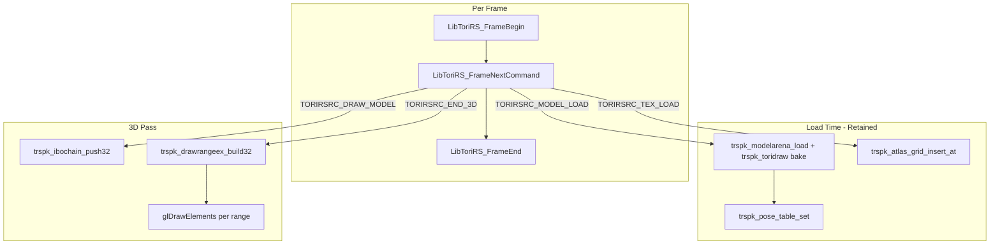

# TRSPK Retained-Mode Renderer Guide

This guide explains how to build a **retained-mode GPU renderer** using TRSPK (ToriRS Platform Kit), with the OpenGL3 SDL2 backend as the canonical reference implementation.

For per-backend buffering details, see [renderers.md](renderers.md).

---

## What TRSPK Is

**TRSPK** (ToriRS Platform Kit) is a modular C graphics toolkit for building concrete ToriRS platform renderers. It is a **toolkit, not a framework**:

- No central command dispatcher or virtual backend interface
- No tagged backend union or hash table for model lookups
- Platform code owns a `switch` on `TORIRSRC_*` render commands and calls TRSPK helpers directly

There are two TRSPK trees in this repo:

| Tree | Role |
|------|------|
| [`src2/platformkit/`](../src2/platformkit/) | **Current** — used by `src2` SDL2/browser renderers |
| [`src/platforms/ToriRSPlatformKit/`](../src/platforms/ToriRSPlatformKit/) | **Legacy** — older batch16/32, dynamic pass, slotmaps, native Metal backend |

This guide focuses on **`src2/platformkit`**.

---

## Retained Mode vs Immediate Mode

### Retained mode (GPU renderers)

Geometry, textures, sprites, and fonts are **baked into persistent CPU/GPU buffers** at load time and reused across frames. Each frame:

1. The game streams `TORIRSRC_*` commands one at a time
2. Static draws look up pre-baked vertex ranges via a pose table
3. Dynamic entities are re-baked into a transient arena each frame
4. Draw order is recorded in an IBO chain and flushed at `END_3D`

Reference: [`platform_sdl2_renderer_opengl3.c`](../src2/platforms/platform_sdl2/platform_sdl2_renderer_opengl3.c)

### Immediate mode (Soft3D)

Each `DRAW_MODEL` re-rasterises the ToriDraw scene directly into a CPU pixel buffer. No VBO retention.

Reference: [`platform_sdl2_renderer_soft3d.c`](../src2/platforms/platform_sdl2/platform_sdl2_renderer_soft3d.c)

Use Soft3D for correctness testing, headless simulation, and `--soft3d` fallback.

---

## Architecture Overview



### Command contract

All renderers consume the same command stream defined in [`libtorirs_render.h`](../src2/render/libtorirs_render.h):

```c
enum LibToriRS_RenderCommandKind {
    TORIRSRC_BEGIN_3D, TORIRSRC_END_3D,
    TORIRSRC_BEGIN_2D, TORIRSRC_END_2D,
    TORIRSRC_TEX_LOAD, TORIRSRC_MODEL_LOAD, TORIRSRC_ANIM_LOAD,
    TORIRSRC_DRAW_MODEL, TORIRSRC_SPRITE, TORIRSRC_FONT,
    TORIRSRC_BATCH3D_BEGIN, TORIRSRC_BATCH3D_MODEL_ADD, ...
};
```

The game yields commands via:

```c
LibToriRS_FrameBegin(instance);
while (LibToriRS_FrameNextCommand(instance, &command))
    handle_render_command(renderer, instance, &command);
LibToriRS_FrameEnd(instance);
```

### Static vs dynamic model groups

GPU renderers keep two parallel **model groups**:

| Index | Name | Lifetime | Typical content |
|-------|------|----------|-----------------|
| `0` | `TRSPK_VBO_GROUP_STATIC` | Persists across frames | Terrain, props, pre-baked animation frames |
| `1` | `TRSPK_VBO_GROUP_DYNAMIC` | Reset every `BEGIN_3D` | Per-frame baked entities (players, projectiles) |

Each group is a self-contained bundle: CPU VBO, GPU VBO(s), model arena, and optionally a per-triangle config table. Static and dynamic geometry **interleave in painter's order** through one shared index stream; only the bound vertex source changes per draw.

### Pose table

For **static** models, bake registers a slot in `TRSPK_PoseTable`:

```
(element_id, anim_index, pose_id) → vertex_base
```

Later `DRAW_MODEL` commands only need the lookup key — no re-bake.

### IBO chain

During a 3D pass, each `DRAW_MODEL` pushes triangles into a `TRSPK_IBOChain` in face order:

```c
trspk_ibochain_push32(chain, group, offset, indices, 3);
```

- **`group`** — which model group's VBO to bind
- **`offset`** — base vertex semantics differ per backend (see portability section)

Nodes with the same `(group, offset)` are coalesced. The chain resets at the end of `END_3D`.

### Depth testing

**Disabled everywhere.** Correct occlusion depends entirely on submission order (`glDepthFunc(GL_ALWAYS)` / `D3DRS_ZENABLE FALSE`).

---

## Building a Retained Renderer: OpenGL3 Template

Use [`platform_sdl2_renderer_opengl3.c`](../src2/platforms/platform_sdl2/platform_sdl2_renderer_opengl3.c) as the reference. The public API is in [`platform_sdl2_renderer_opengl3.h`](../src2/platforms/platform_sdl2/platform_sdl2_renderer_opengl3.h).

### Renderer struct (what to own)

```c
struct LibToriPlatformSDL2_RendererGL3 {
    TRSPK_Atlas atlas;              // 3D world texture atlas (CPU)
    GLuint atlas_texture;           // GPU atlas upload

    struct GL3ModelGroup groups[TRSPK_VBO_GROUP_COUNT];
    // Each group: TRSPK_VBO, TRSPK_ModelArena, TRSPK_Triangles,
    //             GLuint vbo_gpu, vao, gpu_capacity

    TRSPK_PoseTable poses;          // Static model lookup
    TRSPK_IBOChain* ibo_chain;      // Per-frame ordered indices
    TRSPK_IBO* ibo_staging;         // Flattened GPU index buffer (CPU)
    TRSPK_DrawRangeList* draw_ranges;

    // 2D pass
    TRSPK_Atlas sprite_atlas;
    GLuint sprite_atlas_texture;
    struct GL3FontSlot font_slots[TRSPK_GL3_FONT_CAP];
    struct GL3Batch2DState batch2d;
    GLuint program2d;
};
```

### Command handler skeleton

`handle_render_command` (~line 2719) dispatches each `TORIRSRC_*` kind:

| Command | Handler | Action |
|---------|---------|--------|
| `TEX_LOAD` | `gl3_ev_tex_load` | Insert 128×128 tile into 2048² atlas; upload GPU texture |
| `MODEL_LOAD` / `ANIM_LOAD` / `BATCH3D_*` | bake handlers | `trspk_modelarena_load` → write vertices → `trspk_pose_table_set` |
| `BATCH3D_CLEAR` | `gl3_ev_batch3d_clear` | Clear static group + pose table |
| `BEGIN_3D` | `gl3_ev_begin_3d` | Viewport, UBO matrices, reset dynamic group |
| `DRAW_MODEL` | `gl3_ev_model_draw` | Pose lookup or dynamic bake → `trspk_ibochain_push32` |
| `END_3D` | `gl3_ev_end_3d` | Upload VBOs, `trspk_drawrangeex_build32`, `glDrawElements` |
| `BEGIN_2D` | `gl3_ev_begin_2d` | Ortho projection, sync fonts, disable depth |
| `SPRITE` / `FONT` / `FILL_RECT` | 2D handlers | Batched textured quads |
| `END_2D` | `gl3_ev_end_2d` | Flush 2D batch |

### Static bake path

Triggered by `MODEL_LOAD`, `ANIM_LOAD`, or `BATCH3D_*`:

1. `trspk_modelarena_load(arena, element_id, anim_index, pose_id, vertex_count)` reserves a slot
2. [`trspk_toridraw.c`](../src2/platforms/trspk_toridraw.c) writes backend-specific vertices from the ToriDraw model
3. `trspk_pose_table_set(poses, element_id, anim_index, pose_id, vertex_base)` registers the slot
4. Mark the static VBO dirty for GPU upload

### Dynamic draw path

Triggered by `DRAW_MODEL` with `dynamic=true`:

1. Bake the model into `groups[TRSPK_VBO_GROUP_DYNAMIC]` (arena reset at `BEGIN_3D`)
2. Push face indices into the IBO chain tagged with the dynamic group
3. No pose table entry — the slot is used immediately

### END_3D draw path

1. `gl3_upload_group` — `glBufferSubData` on dirty static/dynamic VBOs
2. `trspk_drawrangeex_build32(draw_ranges, triangles_by_group, ibo_chain, staging)` — flatten IBO chain into one index buffer + merged draw ranges
3. Upload flat indices to `ebo`
3. For each `TRSPK_DrawRange`: bind the group's VAO when the group changes, `glDrawElements`
4. `trspk_ibochain_reset`

### 2D pass

Separate ortho pass after the 3D world:

- **Sprites**: bin-packed into `sprite_atlas`; `TORIRSRC_SPRITE` → textured
- **Fonts**: `gl3_bake_font_atlas` packs `glyph_alpha[]` into a vertical `GL_R8` atlas at load; `TORIRSRC_FONT` → per-glyph textured quads via `ToriDraw_FontVisitGlyphsStyled`
- **Batching**: `gl3_draw_textured_quad` accumulates into `batch2d`; `gl3_flush_2d_batch` issues `glDrawArrays` at `END_2D`

---

## Shader Guide

### 3D world pass — vertex contract

All GL backends share the same **semantic fields** baked into vertices. OpenGL3 layout ([`opengl3_vertex.h`](../src2/platformkit/opengl3/opengl3_vertex.h)):

```c
struct TRSPK_VertexOpenGl3 {
    float position[4];   // xyz + padding
    float color[4];        // vertex colour (HSL16 baked to RGBA)
    float texcoord[2];     // local 0..1 UV within tile
    float tex_id;          // atlas slot (>=256 = cutout alpha test)
    float uv_mode;         // encoded scroll speed for animated textures
};
```

WebGL1 uses the same fields in `TRSPK_VertexWebGL1`. D3D9 packs colour as ARGB and stores `tex_id`/`uv_mode` in `texdata[2]` ([`d3d9_vertex.h`](../src2/platformkit/d3d9/d3d9_vertex.h)).

#### Vertex shader

Source: [`src2/platformkit/opengl3/shaders/vertex.glsl`](../src2/platformkit/opengl3/shaders/vertex.glsl)

```glsl
#version 150 core

layout(std140) uniform TRSPK_UboWorld {
    mat4 u_modelViewMatrix;
    mat4 u_projectionMatrix;
    vec4 u_clock_pad;
} ubo;

in vec4 a_position;
in vec4 a_color;
in vec2 a_texcoord;
in float a_tex_id;
in float a_uv_mode;

void main() {
    gl_Position = ubo.u_projectionMatrix * ubo.u_modelViewMatrix * vec4(a_position.xyz, 1.0);
    // Pass colour, texcoord, tex_id, uv_mode to fragment stage
}
```

WebGL1 equivalent uses `attribute`/`varying`, a `uniform mat4` for matrices, and `uniform float u_clock` instead of a UBO.

#### Fragment shader — atlas sampling

Source: [`src2/platformkit/opengl3/shaders/fragment.glsl`](../src2/platformkit/opengl3/shaders/fragment.glsl)

The fragment logic is **intentionally shared** between WebGL1 and OpenGL3:

1. **Decode `tex_id`**: values `>= 256` mean cutout (alpha test); lower 8 bits are the atlas tile index
2. **Decode `uv_mode`**: encoded U/V scroll magnitude for animated textures
3. **Atlas layout**: 2048×2048 atlas, 16×16 grid of 128×128 tiles
4. **Apply clock scroll**: `local.x += clk * anim_u; local.y -= clk * anim_v`
5. **Sample and tint**: `mix(vertex_color, texColor * vertex_color, 1.0)`
6. **Cutout discard**: `if (cutout && texColor.a < 0.5) discard`

Key differences between GL backends:

| Aspect | WebGL1 | OpenGL3 |
|--------|--------|---------|
| GLSL version | `#version 100` (GLES) | `#version 150 core` |
| Uniforms | Individual `uniform` vars | `layout(std140) uniform` UBO |
| Sampling | `texture2D`, `gl_FragColor` | `texture`, `frag_color` |
| Precision | `precision mediump float` | default |

#### Shader maintenance

Edit the `.glsl` sources under `src2/platformkit/{opengl3,webgl1}/shaders/`, then regenerate embedded headers:

```bash
python3 src2/platformkit/opengl3/opengl3_makeshaderc.py
python3 src2/platformkit/webgl1/webgl1_makeshaderc.py
```

The Makefile does **not** track header dependencies — touch the renderer `.c` file or run a clean rebuild after shader changes.

### 2D pass — separate shader

Source: [`opengl3_2d_shaders.h`](../src2/platformkit/opengl3/opengl3_2d_shaders.h)

Two modes via `u_text_mode`:

**Sprites / fill rects** (`u_text_mode == 0`):

```glsl
fragColor = tex * v_color;
```

Uses RGBA textures (`GL_RGBA8`).

**Font glyphs** (`u_text_mode == 1`):

```glsl
fragColor = vec4(v_color.rgb, step(0.001, tex.r) * v_color.a);
```

Important details:

- Font atlas is uploaded as **`GL_R8`** (alpha in the R channel only)
- RS fonts store glyph pixels as **0/1**, not 0–255. Sampling returns `tex.r = 1/255` for an "on" pixel
- `step(0.001, tex.r)` treats any non-zero atlas value as fully opaque, matching Soft3D's `if (a == 0) continue`
- Do **not** use `max(tex.a, tex.r)` — `GL_R8` sampling always yields `tex.a == 1.0`
- Do **not** use `tex.r` directly as alpha — values of 1 become `1/255 ≈ 0.004`, which hits the discard threshold

#### Font atlas bake

`gl3_bake_font_atlas()` (~line 967 in the OpenGL3 renderer):

1. Pack all 94 glyphs into a single-column vertical atlas
2. Copy `font->glyph_alpha[i]` into a CPU buffer
3. Upload via `glTexImage2D(..., GL_R8, ..., GL_RED, GL_UNSIGNED_BYTE, alpha)`
4. Store per-glyph UVs in `slot->glyph_uv[i*4 + 0..3]`

---

## Backend Portability

### Comparison matrix

| Concern | OpenGL3 (reference) | WebGL1 | D3D9 | Apple GL (macOS) | Metal (legacy `src/`) |
|---------|---------------------|--------|------|------------------|----------------------|
| **Used by src2?** | Yes (macOS/Linux default) | Yes (browser) | Yes (Windows) | Yes (GL3 on Metal-backed driver) | No |
| **Pipeline** | GLSL 150 core + VAO/UBO | GLES 2.0 / WebGL1 | Fixed-function FVF | GL 3.2 core forward-compat | MSL |
| **Index type** | u32, absolute | u16, page-relative | u16, `BaseVertexIndex` paging | u32 | u32 |
| **VBO layout** | Single monolithic VBO per group | Multiple page VBOs | Single VBO, 65536-vert pages | Same as GL3 | Draw stream + instancing |
| **END_3D draw** | Draw ranges + VAO bind | Per-IBO-node draw records | Draw ranges + texture rebind per range | Same as GL3 | GPU ring buffer + semaphore |
| **Texture animation** | Vertex `uv_mode` + shader scroll | Same (`u_clock` uniform) | Standalone textures + stage matrix | Same as GL3 | Shader or CPU-baked scroll |
| **2D text** | `GL_R8` atlas + `step()` mask | Limited | Texture stages | Same as GL3 | N/A in src2 |
| **Depth** | Off | Off | Off | Off | Off |

Reference implementations:

| Backend | File |
|---------|------|
| OpenGL3 | [`platform_sdl2_renderer_opengl3.c`](../src2/platforms/platform_sdl2/platform_sdl2_renderer_opengl3.c) |
| WebGL1 | [`platform_sdl2_renderer_webgl1.c`](../src2/platforms/platform_sdl2/platform_sdl2_renderer_webgl1.c) |
| D3D9 | [`platform_sdl2_renderer_d3d9.c`](../src2/platforms/platform_sdl2/platform_sdl2_renderer_d3d9.c) |
| Soft3D | [`platform_sdl2_renderer_soft3d.c`](../src2/platforms/platform_sdl2/platform_sdl2_renderer_soft3d.c) |

### WebGL1 considerations

WebGL1 is the browser default (Emscripten). Key constraints:

1. **No base vertex / index offset** — `glDrawElements` indices are always relative to vertex 0 of the bound VBO
2. **16-bit indices only**
3. **No UBOs** — use individual uniforms
4. **Emscripten** requires GLES2 context and `-sMIN_WEBGL_VERSION=1 -sMAX_WEBGL_VERSION=1 -sFULL_ES2=1`

Workarounds:

- Split vertices into **pages** via `TRSPK_VBOChain16` (≤65535 verts per page); one GL buffer per page
- IBO node `offset` = **page index** (not vertex base)
- Pose table stores `(page << 16) | local_base` via `TRSPK_WEBGL1_ENCODE_PAGE_LOCAL` macros
- **No draw-range batching** — record a `WebGL1DrawRecord` per IBO node; many `glDrawElements` calls at `END_3D`
- Texture state entirely in vertex attributes; no per-range texture rebinding

See also: [WEBGL1_PLATFORM_IMPLEMENTATION.md](WEBGL1_PLATFORM_IMPLEMENTATION.md)

### D3D9 considerations

D3D9 is the Windows SDL2 default. Key differences:

1. **Fixed-function pipeline** — no HLSL shaders; uses `D3DFVF_XYZ | D3DFVF_DIFFUSE | D3DFVF_TEX2`
2. **`BaseVertexIndex`** in `DrawIndexedPrimitive` enables vertex paging without splitting VBOs
3. **Texture rebind per draw range** — `TRSPK_Triangles` config table drives which texture to bind; the only backend that actively rebinds textures per range
4. **Animated textures** as standalone `IDirect3DTexture9[256]`, not atlas scroll
5. **16-bit indices** with page-local semantics: `page_base = vertex_base & ~65535`

Vertex layout:

```c
struct TRSPK_VertexD3D9 {
    float position[3];
    uint32_t color;      // ARGB packed
    float texcoord[2];
    float texdata[2];    // [0] = tex_id, [1] = uv_mode
};
```

Porting animated texture logic from GL to D3D9 is non-trivial because scroll happens in fixed-function texture stages, not a fragment shader.

### Apple GL (macOS OpenGL3)

macOS desktop uses OpenGL3 through Apple's GL driver (Metal-backed internally). There is **no native Metal renderer in src2**.

Considerations:

1. **GL 3.2 core** + `SDL_GL_CONTEXT_FORWARD_COMPATIBLE_FLAG` on `__APPLE__`
2. **Explicit proc loading** via [`opengl3_sdlgl.c`](../src2/platformkit/opengl3/opengl3_sdlgl.c) — no legacy GL entry points
3. **Sized internal formats required** for Core Profile uploads:

   ```c
   /* GL_RGBA8 (sized internal format) is required on Core Profile / Metal-backed GL. */
   glTexImage2D(..., GL_RGBA8, ..., GL_RGBA, GL_UNSIGNED_BYTE, pixels);
   ```

   Same applies to font atlases (`GL_R8`).
4. **ASAN on macOS** — default-off; use `make asan` for AddressSanitizer builds (requires `asan_dyld_shim.dylib` for dyld ordering)

### Metal (legacy `src/` only)

Native Metal lives in the legacy stack, not src2:

- [`src/Shaders.metal`](../src/Shaders.metal) — MSL shaders
- [`src/platforms/platform_impl2_sdl2_renderer_metal.mm`](../src/platforms/platform_impl2_sdl2_renderer_metal.mm)
- [`src/platforms/ToriRSPlatformKit/src/backends/metal/`](../src/platforms/ToriRSPlatformKit/src/backends/metal/)

Metal-specific concerns (see [metal_renderer.md](metal_renderer.md)):

- **Viewport Y flip** — Metal top-left vs GL bottom-left origin
- **Z-range remapping** — `metal_remap_projection_opengl_to_metal_z`
- **Frame semaphore** — CPU ring buffers not reset until GPU completes prior frame
- **Draw stream + per-instance transforms** vs GL's single model-view matrix

If porting src2 TRSPK to native Metal, treat the OpenGL3 renderer as the semantic reference and adapt draw-range flattening to Metal's instancing model.

---

## TRSPK Core Modules

All modules live in [`src2/platformkit/core/`](../src2/platformkit/core/):

| Module | Header | Purpose |
|--------|--------|---------|
| `trspk_vbo` | `trspk_vbo.h` | Growable CPU interleaved vertex buffer with format tagging |
| `trspk_vbochain16` | `trspk_vbochain16.h` | 16-bit vertex paging for WebGL1/D3D9 |
| `trspk_modelarena` | `trspk_modelarena.h` | Slot allocator for baked model geometry |
| `trspk_pose` | `trspk_pose.h` | Static pose lookup: `(element_id, anim, pose) → vertex_base` |
| `trspk_ibo` | `trspk_ibo.h` | Per-frame ordered index chain, coalesced by `(group, offset)` |
| `trspk_drawrangeex` | `trspk_drawrangeex.h` | Flatten IBO chain → GPU index buffer + merged draw ranges |
| `trspk_drawrangelist` | `trspk_drawrangelist.h` | Storage for draw range records |
| `trspk_atlas` | `trspk_atlas.h` | CPU texture atlas (grid insert or bin-pack) |
| `trspk_triangles` | `trspk_triangles.h` | Per-triangle texture config (D3D9 draw ranges; GL3 has tables but shader uses vertex attrs) |

Backend-specific vertex layouts:

| Backend | Header |
|---------|--------|
| OpenGL3 | [`opengl3/opengl3_vertex.h`](../src2/platformkit/opengl3/opengl3_vertex.h) |
| WebGL1 | [`webgl1/webgl1_vertex.h`](../src2/platformkit/webgl1/webgl1_vertex.h) |
| D3D9 | [`d3d9/d3d9_vertex.h`](../src2/platformkit/d3d9/d3d9_vertex.h) |

Bake bridge (ToriDraw → TRSPK vertices): [`src2/platforms/trspk_toridraw.c`](../src2/platforms/trspk_toridraw.c)

---

## Checklist for a New Backend

1. **Define a vertex struct** matching the semantic fields: position, color, texcoord, tex_id, uv_mode
2. **Implement `handle_render_command`** switch covering all `TORIRSRC_*` kinds your target needs
3. **Static bake**: `trspk_modelarena_load` + `trspk_toridraw_*` writes + `trspk_pose_table_set`
4. **Dynamic draw**: bake per `DRAW_MODEL` with `dynamic=true`; push to IBO chain with dynamic group tag
5. **`BEGIN_3D`**: set viewport/projection; reset dynamic group arena and IBO chain
6. **`END_3D`**: upload dirty VBOs; flatten IBO (choose paging strategy for your API); issue draws
7. **Port 3D atlas sampling** — GLSL fragment shader, or fixed-function texture stages (D3D9), or MSL (Metal)
8. **2D pass**: sprite atlas (bin-pack), font atlas bake, quad batching with separate 2D shader/state
9. **Disable depth testing** — rely on painter's order from the IBO chain
10. **Test against Soft3D** for visual correctness (`sdl2 --soft3d` or `browser --soft3d`)

### Index paging decision tree

```
Can your API bind indices with a vertex offset (base vertex)?
├── No  (WebGL1)
│   └── Split VBO into pages (TRSPK_VBOChain16); IBO offset = page index
├── Yes, 16-bit (D3D9)
│   └── Single VBO; IBO offset = page_base (vertex_base & ~65535)
└── Yes, 32-bit (OpenGL3)
    └── Single monolithic VBO; IBO offset = 0; absolute indices
```

---

## Related Documentation

| Document | Contents |
|----------|----------|
| [renderers.md](renderers.md) | Per-backend buffering, END_3D paths, vertex formats |
| [WEBGL1_PLATFORM_IMPLEMENTATION.md](WEBGL1_PLATFORM_IMPLEMENTATION.md) | WebGL1 paging and draw records |
| [metal_renderer.md](metal_renderer.md) | Legacy native Metal renderer |
| [src/platforms/ToriRSPlatformKit/README.md](../src/platforms/ToriRSPlatformKit/README.md) | Legacy toolkit (batch16/32, dynamic pass, slotmaps) |

Shader sources:

- 3D: `src2/platformkit/opengl3/shaders/`, `src2/platformkit/webgl1/shaders/`
- 2D: `src2/platformkit/opengl3/opengl3_2d_shaders.h`
