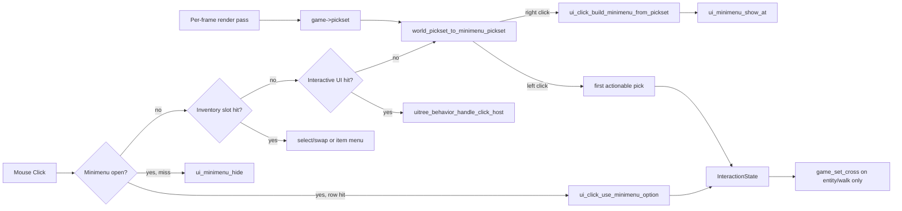

# UI Click System

`src2/ui/ui_click.c` routes left and right mouse clicks through the retained UI
tree and into the minimenu / cross / interaction-state pipeline.

## Entry points

`GameRunescape_ProcessInput` calls:

- `ui_click_handle_left(game, input, click_x, click_y)`
- `ui_click_handle_right(game, input, click_x, click_y)`

## Hit-test order

Click routing uses `uitree_hit_test_interactive`, which skips pass-through layout
nodes (`UIELEM_BUILTIN_WORLD`, `UIELEM_RS_LAYER`, `UIELEM_BUILTIN_SIDEBAR`,
`UIELEM_BUILTIN_CHAT`, inactive cross/minimenu). Raw `uitree_hit_test` is used
only for diagnostics.

### Left click

1. If minimenu is open: select hovered row or dismiss (click consumed).
2. Inventory slot: select/swap (no cross).
3. Interactive UI hit: `uitree_behavior_handle_click_host` (tabs, buttons; no cross).
4. World viewport: convert `game->pickset` to `MinimenuPickSet`, take the first
   actionable pick (NPC/scenery before terrain), set `InteractionState` and cross.

### Right click

1. Inventory slot: build pickset from slot, show item menu (no Walk here).
2. Interactive UI hit (compass, minimap, etc.): ignored.
3. World viewport: convert `game->pickset` to `MinimenuPickSet`, build full menu
   (all picks + Walk here + Cancel), always shows at least Walk here / Cancel.

`mouse_in_viewport` uses `UIELEM_BUILTIN_WORLD` clip bounds (not the full 765×503
frame), matching Client.ts viewport region checks.

## Key functions

| Function | Role |
|----------|------|
| `uitree_hit_test_interactive` | Hit-test skipping layout/pass-through nodes |
| `uitree_inv_hit_test_slot` | 32x32 slot hit-test inside `UIELEM_RS_INV` |
| `ui_click_build_minimenu_from_pickset` | Turns `MinimenuPickSet` into `UIMinimenuState` options |
| `ui_click_use_minimenu_option` | Applies selected row to `game->interaction` and cross |
| `game_try_inv_click` | Inventory select/swap (left) or pickset fill (right) |

## Cross modes

`game_set_cross` sets `cross_x/y`, `cross_mode`, and resets `cross_cycle`:

- `RUNESCAPE_CROSS_MODE_WALK` — walk-here (frames 0–3 of cross sprite)
- `RUNESCAPE_CROSS_MODE_INTERACT` — interact (frames 4–7)
- Cross is shown only for world entity actions and walk-here, not generic UI clicks
- Cross auto-hides after 400 cycle units (20 per frame), matching Client.ts

## Related subsystems

- [UI Minimenu System](ui_minimenu_system.md) — option list, layout, rendering
- [UI Interaction State](ui_interaction_state.md) — resolved click target
- [UI Inventory System](ui_inventory_system.md) — slot hit-test and item menus
- [CS2 VM](cs2vm.md) — optional UI visibility conditions (not click routing)
