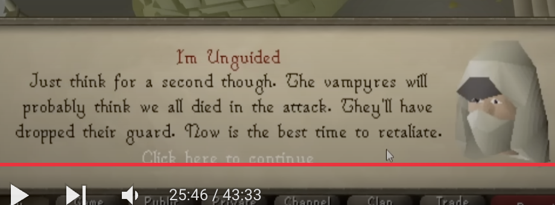
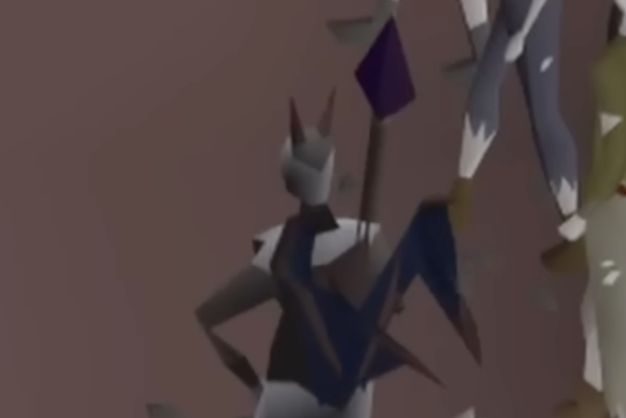
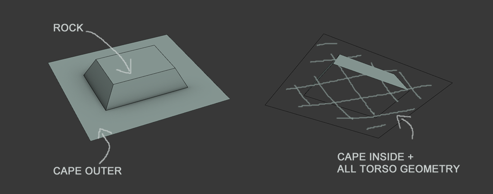

## Building

```
cmake -B build -DCMAKE_BUILD_TYPE=Debug

# For compiler invocations
make VERBOSE=1
```

### Rendering Notes

```
Win_ said:
Thoughts?

QFC: 16-17-216-61384753

“When we’re rendering our 3D scene, historically we have sorted all of our world entities (such as players, walls, particle effects etc) into view depth order. We then render them in this order, from furthest away to closest, giving the view you would expect, where nearer things appear over far things. Whilst this has the advantage of being quite fast, it’s also somewhat inflexible, and leads to various graphical glitches that you’re probably familiar with if you play in the ‘Safe mode’ or ‘Software’ graphics modes, whereby things appear to draw on top of - or through - each other when they shouldn’t (player capes are an excellent example of this). With this update, we’ve moved to using an industry-standard technique called ‘Z-buffering’, which allows us to be a lot more flexible with our 3D rendering in the future. As an example, it allows us to have player kit or animations which extend outside of the square on which your character is standing. It also allows for more complex models and a number of other improvements which we’ve been wanting to do for a while.”

~ Mod Chris E

The 'method' he is talking about is called Painter's algorithm...it is not the fastest way as far as I see it.
The reason?:
Your drawing more than you need to, and most of it won't be seen by the user (to solve this you would apply culling)
```

### Rendering Notes

Talking about z-buffering.

https://youtu.be/oKmHSSLFSbw?t=1810

They assign a "render order" (aka Priority).

### Rendering Notes - Decompiled Painters Algorithm

The decompiled renderer uses the "painters algorithm", and 12 layers.

Higher layers always appear on top of lower layers.

1. Sort model faces by depth. Note: The "depth" of a face is calculated as the average "z". (z0 + z1 + z2) / 3.
2. Partition the sorted faces into their respective layers. Since we are partitioning a sorted array, the resulting arrays are also sorted by layer.
3. For each layer, Render each face back to front

### Rendering Notes - Z Buffering with layers

I found that you can also render with z-buffering instead of sorting by depth.

1. Partition models in layer order.
2. For each layer, reset the z-buffer
3. then render each face.

### Rendering Notes

Interesting render

/Users/matthewevers/Documents/git_repos/runelite/runelite-client/src/main/resources/net/runelite/client/plugins/gpu/priority_render.cl

### Rendering Notes - Priority 10 and 11

These seem to be relevant when merging models. For example, model id 44 is a wizards hat and the brim is layer 10. Some I suspect that is something that relies on some dynamic behavior...

```
    case 10:
      if (distance > avg1) {
        return 0;
      } else if (distance > avg2) {
        return 5;
      } else if (distance > avg3) {
        return 9;
      } else {
        return 16;
      }
    case 11:
      if (distance > avg1 && _min10 > avg1) {
        return 1;
      } else if (distance > avg2 && (_min10 > avg1 || _min10 > avg2)) {
        return 6;
      } else if (distance > avg3 && (_min10 > avg1 || _min10 > avg2 || _min10 > avg3)) {
        return 10;
      } else {
        return 17;
      }
```

### Rendering Notes - OSRS

OSRS does appear to still use the painters algorithm.




### Rendering Notes - OSRS - Jagex (Mod Ry)

https://www.reddit.com/r/2007scape/comments/68di8r/infernal_cape_design_model_animation/

The biggest issue with this is that we can't use geometry that has an 'upwards' or top facing normal on capes because of how we sort polygon render order.

We don't have a z-buffer so render order is done with values of 1 - 9 that are individually assigned to polygons with the higher number always being rendered above those that are smaller.

Some typical values are:

Cape Outside: 7

Cape Inside: 2

Head: 8

Torso: 5

Legs: 3

The cape is higher than the torso because when viewed from behind we want the cape to be shown and not the torso. The back-face of polygons is culled so the cape becomes 'see through' when viewed from the front and doesn't cause order issues allowing the torso to be shown properly. The inside of the cape is the outside cape, duplicated and flipped with a lower value than the torso and legs so that it's correctly rendered behind them.

When we start to introduce polygons to the cape that stick out from the cape's regular plane we run into a problem where the 'top facing' polygons can be seen through the player because they have the highest render order. They can't be lower because otherwise the torso and/or legs will show where the rock is supposed to be when viewed from behind.



This effect can already be seen on capes that try to minimise this problem and have perfectly flat backs.


