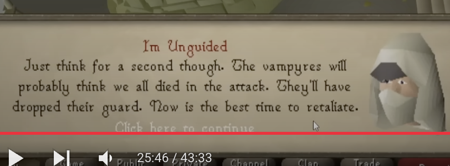
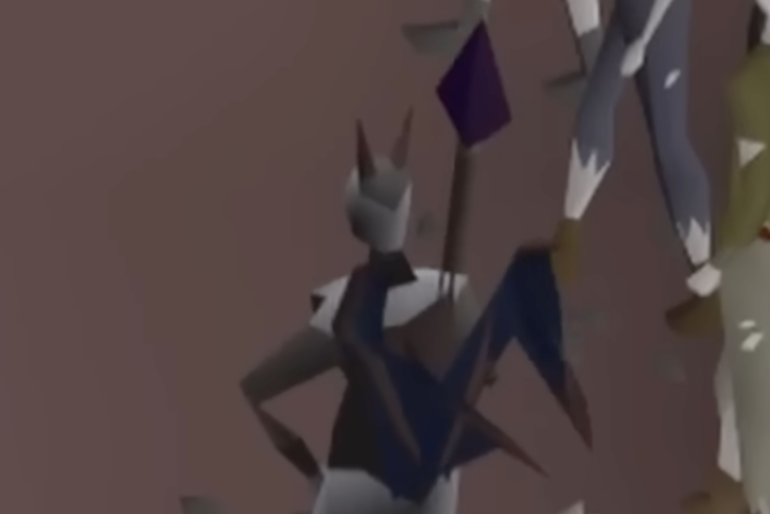
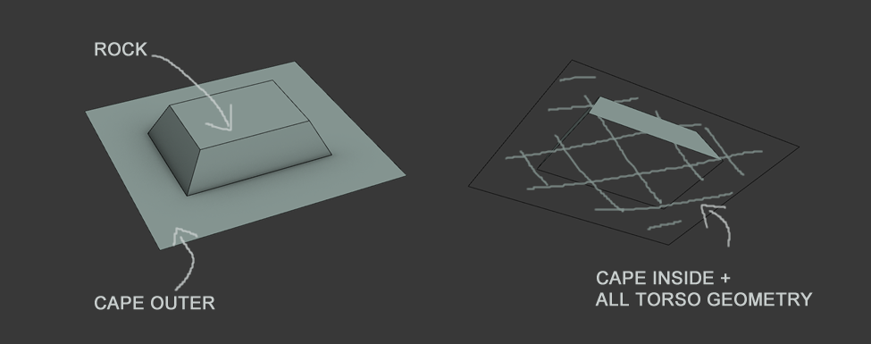
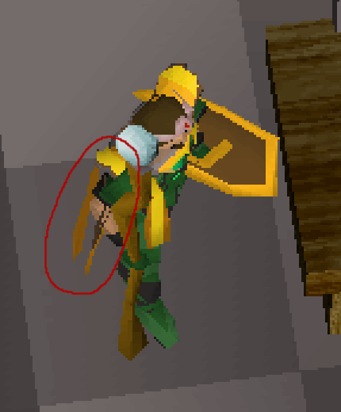
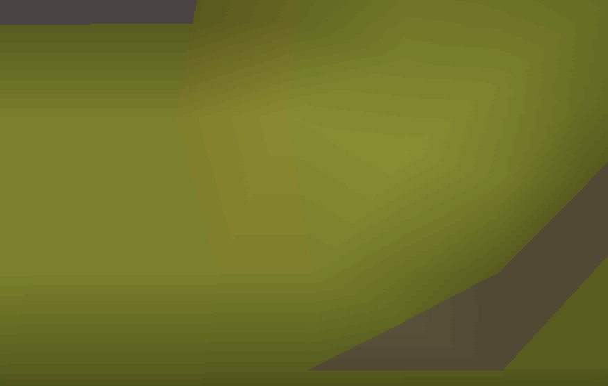
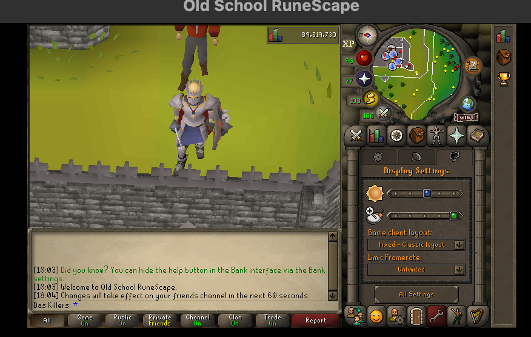
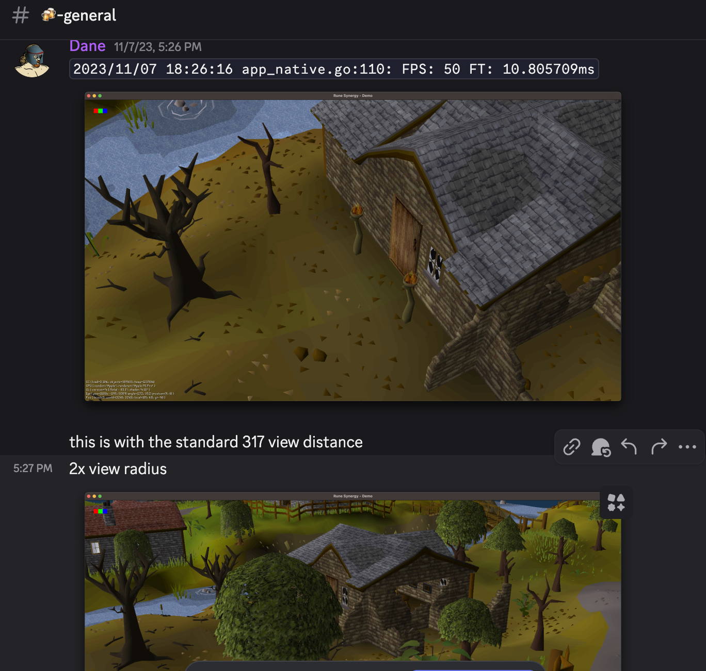
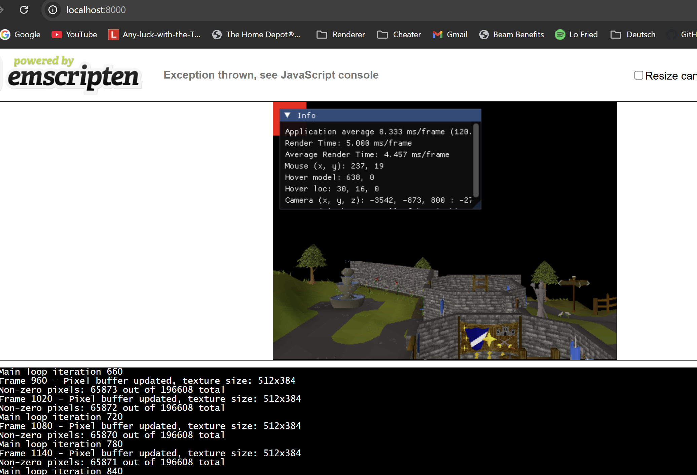
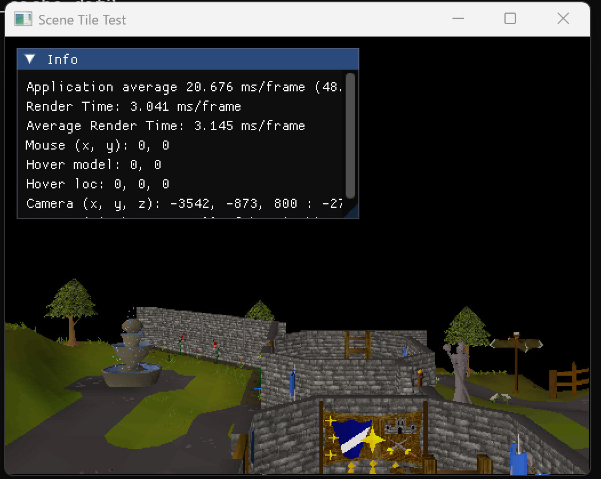

# ToriRS

Rewrite of the osrs renderer.

## Building

> **[BUILD_AND_RUN.md](BUILD_AND_RUN.md)** is the full cross-platform build and
> run guide — every platform, the servers, the content pipeline, RuneLite, and
> every tool in this repository, with commands. The summary below is the short
> version.

The current client is built by [`src/makefile`](src/makefile). The root CMake
project and the `v0`/`v1` trees are historical snapshots, not alternate build
lanes.

```sh
make -C src all          # native debug -> src/torirs
make -C src release      # native -O3  -> src/torirs
make -C src web          # optimized browser module -> build-web/
make -C src web-debug    # debug browser module
make -C src io-server    # cache/boot server used by the browser build
```

On Windows, use `./build_windows.ps1 -Opt` for the modern x86_64 artifact or
`./build_winxp.ps1 -Opt` for the XP-compatible i686 artifact. Omitting `-Opt`
intentionally builds the corresponding debug lane. Both compiler toolchains
are pinned in this repository; see [Repository Windows toolchains](tools/toolchain/README.md).
Platform selection, prerequisites, renderer flags, compatibility constraints,
and known defects are centralized in
[Platform quirks and contracts](docs/platform_quirks.md). Detailed active guides
cover the [web build](docs/web_build.md), the
[performance harness](docs/PERF_HARNESS.md), and the repository's
[Windows toolchains](tools/toolchain/README.md).

Subsystem guides cover the [incremental JS5 client cache](docs/JS5_INCREMENTAL_CACHE.md),
the [dedicated JS5 server](docs/JS5_SERVER.md), the
[developer overlay and root UI layout](docs/debug_overlay.md), and
[per-model depth testing](docs/toridraw_model_zbuffer.md) for models whose parts
interpenetrate and cannot be resolved by face order alone.

### Content pipeline

The client boots from a cache built from `OSRS-Content/osrs239-content/`:

| Step | Command | Output |
|---|---|---|
| ServerScript pack | `make -C src torirsserver-scripts` | `server/scripts/build/script.dat` |
| Server bands | `make -C src torirsserver-servpack` | `server/pack/` (no cache opened) |
| Cache bake | `make -C src torirsserver-cache` | `cache.osrs239.baked` |
| Table check | `make -C src torirsserver-cache-check` | asserts all 23 tables |

The bake takes `--base` when a pristine cache is present, so records the tree
does not change keep the bytes they had. **Without a base it creates the cache**,
and what lands is exactly what the tree states. Aim it elsewhere with:

```
make -C src torirsserver-cache TORIRSSERVER_CACHE_DIR=$PWD/cache.osrs239_packed
make -C src torirsserver-cache TORIRSSERVER_CACHE_BASE=/path/to/cache.osrs239
```

`torirsserver-cache-check` lists any missing `main_file_cache.idxN` by number. A
table with no idx file is a table the client cannot read, and `idx255`—the
reference-table index—is what makes every other table reachable at all.

### Booting a packed cache

[`manifest_osrs239_packed.ini`](manifest_osrs239_packed.ini) is
`manifest_osrs239.ini` with `dir=cache.osrs239_packed`, so the client boots the
cache built from content rather than the pristine dump:

```sh
src/torirs --manifest manifest_osrs239_packed.ini --offline
```

On Windows, build either repository-owned lane with the wrapper described
above, then run its staged artifact:

```powershell
.\dist\win64\torirs.exe --manifest .\manifest_osrs239_packed.ini
.\dist\win32\torirs.exe --manifest .\manifest_osrs239_packed.ini
```

Two things a from-scratch cache needs that a `--base` bake inherits for free,
both of which the packer now provides:

- **`idx255` reference tables.** An archive is only reachable through one.
- **Archive name identifiers.** The client hashes a sprite name (djb2) and
  scans `archives[i].identifier`. Without those identifiers the client can boot
  with every archive present but no compass, map scene, hitmarks, or other
  name-addressed assets.

Headless verification proves the cache is bootable rather than merely
complete:

```
TORIRS_MAX_FRAMES=150 TORIRS_EXIT_BMP=frame.bmp TORIRS_WORLD_MAP=50,50 \
    src/torirs --manifest manifest_osrs239_packed.ini --offline
```

## Engine notes

The remaining material is an engineering notebook, not a platform build or
compatibility contract. Platform guidance belongs in the registry linked above.

### TODO

1. Contour Ground
2. Minimap
3. Fast Shaded Texture (Textures are masked and shifted for shade).

- The textures are tile [0-4095, 4096-etc.]. Then each of the pixels are masked 0xf8f8ff (lower 3 bits)
- The texture rasterizer selects a tile by `curU += (shadeShiftFP16 >> 3) & 0xc0000`.
- 0xC = 0b1100,
- Since the shadeShift is upshifted by 16, this is effectively `(shadeShift >> 16) / 8 * 4096` (for tiles tiled by 4096)
- Then the color is shifted by the remaining shade shift 0xf8f8ff mask guarantees the colors don't bleed into eachother.

4. RGB Gouraud vs HSL Gouraud
5. Projection no ortho.

- Need to create SIMD versions for each too.

6. Forcedraw loop in painters

Software rester

### Scene Building Plan - Software 3D

Cache Terrain -> World -> Scene

Scene is used by the renderer.

Loading the world.

1. Load static scene
   1. Load the models (and "Loc" metadata) for each tile
      1. Load models
      2. apply static transforms
      3. [if present] load animations
   2. Load scene ground; this requires shademap from step 1
   3. Shift bridge tiles down
   4. Calculate Normals
   5. Join Sharelight normals
   6. Apply lighting
2. Update game
   1. Clear previous entities
   2. Create entity elements for each entity (load new animations etc etc.)
      1. Load models
      2. apply static transforms
      3. [if present] load animations
      4. calculate normals, note: This is done per model rather than in a loop over all models.
      5. apply lighting
3. Prior to draw
   1. Add entity elements
   2. update animations on entities and on scene.
   3. update other things
4. During draw
   1. Painters algorithm
   2. Apply frustrum culling
   3. Compute draw commands
   4. For each face, check mouse intersection.

- Load the base model used for each model used.
- Load textures
- Copy models, then for each, apply
  - Animations
  - Rotations
  - etc.
- Painters algo

### Scene Rendering - Painter's Algo

Painters algorithm

- 1.  Draw Bridge Underlay (the water, not the surface)
- 2.  Draw Bridge Wall (the arches holding the bridge up)
- 3.  Draw bridge locs
- 4.  Draw tile underlay
- 5.  Draw far wall
- 6.  Draw far wall decor (i.e. facing the camera)
- 7.  Draw ground decor
- 8.  Draw ground items on ground
- 9.  Draw locs
- 10. Draw ground items on table
- 11. Draw near decor (i.e. facing away from the camera on the near wall)
- 12. Draw the near wall.

TODO: Compute near wall/far wall near decor/far decor

```
Picture a grid laid out with the eye at the center. (ignore direction)
+----------------------+
|                      |
|                      |
|                      |
|                      |
|         <=>  eye     |
|                      |
|                      |
|                      |
+----------------------+

We can draw the tiles from farthest to closes by coming diagonally inward from the corners.
It is easy to see that the corners are the farthest from the eye, so start there.

  x := drawn tile

  +----------------------+                  +----------------------+
  | x x              x x |                  | x x x          x x x |
  | x                  x |                  | x x              x x |
  |                      |                  | x                  x |
  |                      |                  |                      |
  |         <=>  eye     |       ==>        |         <=>  eye     |
  |                      |                  | x                  x |
  | x                  x |                  | x x              x x |
  | x x              x x |                  | x x x          x x x |
  +----------------------+                  +----------------------+


In pseudo-code, start from the northeast, northwest, southwest and southeast corners


  ne_tile = (X, Y)
  nw_tile = (0, Y)
  sw_tile = (0, 0)
  se_tile = (X, 0)

  tile_queue = (ne_tile, nw_tile, sw_tile, se_tile)

  while tile_queue not empty:
    tile = tile_queue.pop()

    draw_tile(tile)

    // If the tile is north east of the eye, queue south tile and west tile.
    // (towards the eye.)
    if tile is ne of eye:
      south_tile = (tile.x, tile.y - 1)
      west_tile = (tile.x - 1, tile.y)

    if tile is nw of eye:
      south_tile = (tile.x, tile.y - 1)
      east_tile = (tile.x + 1, tile.y)

    if tile is sw of eye:
      north_tile = (tile.x, tile.y + 1)
      east_tile = (tile.x + 1, tile.y)

    if tile is se of eye:
      north_tile = (tile.x, tile.y + 1)
      west_tile = (tile.x - 1, tile.y)

Now notice that there may be some overlap. e.g. in the northwest corner a tile
at (1, Y) south and (0, Y - 1) east will both queue the tile at (1, Y - 1).

Simply ignore this for now because this will come up later.

In this algorithm tiles farther away must be drawn completely before
closer tiles can start to draw. What this means in the northwest corner for
example, is if the north tile or west tile is still not drawn completely,
then we can't draw this tile. In pseudocode

  if tile is nw of eye:
    north_tile = (tile.x, tile.y + 1)
    west_tile = (tile.x - 1, tile.y)

    if north_tile is not drawn:
      skip

    if west_tile is not drawn:
      skip

This check will be important when scenery "locs" that span multiple tiles
come into play.

Consider a grid with locs L, M, N

  x := drawn tile
  L, M, N := Loc on tile

  <- West          East ->
  +----------------------+
  |     M M M            |
  |     L        N N     |
  |                      |
  |                      |
  |         <=>  eye     |
  |                      |
  |                      |
  |                      |
  +----------------------+

Let's focus our attention on the two locs

  <- West          East ->
  +----------------------+
  | x x M M M        x x |
  | x   L        N N   x |

If we're snaking diaganally inward, then this is the draw order

  ^1/2/3 := A tile that should be drawn, if simply snaking inward.

  <- West            East ->
  +------------------------+
  | x x ^1 M M    x  x x x |
  | x x ^2        N ^3 x x |
  | x x                x x |

  ^1 can't be drawn because the loc on that tile will be drawn, then the two
     underlays to the east would draw above the loc. Not what we want.
  ^2 can't be drawn because ^1 isn't drawn. The loc, L, on ^2 would draw behind
     M if M doesn't draw until all tiles under M are drawn. Not what we want.
  ^3 can't be fully drawn because the loc would be drawn below the tile to the west.
     This is the same case as ^1

So there are two cases that give us trouble.

1. Multi-tile locs can't be drawn until all the underlays under that loc are
   drawn, ^1, and ^3
2. Tiles cannot be drawn until tiles farther away are completely drawn.

What this means; have to break the drawing of tiles into multiple steps.

1. Draw the underlay
2. Draw the locs

Emphasizing, no drawing can start until farther tiles are completely drawn, but
we need to continue to draw underlays so that locs can be drawn.

So we amend our conditions.

Drawing of the underlay can start if both the farther tiles are either:

1. Completely drawn
2. Waiting on this underlay

In psuedo code (and only for northwest of eye):

  if tile is nw of eye:
    north_tile = (tile.x, tile.y + 1)
    west_tile = (tile.x - 1, tile.y)

    north_drawn_or_waiting = false
    if north_tile is done
        or north_tile is waiting on underlay:
      north_drawn_or_waiting = true

    west_drawn_or_waiting = false
    if west_tile is done
        or west_tile is waiting on underlay:
      west_drawn_or_waiting true

    if north_drawn_or_waiting
        and west_drawn_or_waiting:
      // Continue drawing tile
    else:
      skip

    draw_underlay(tile)
    tile.step = "draw_locs"

    if north_drawn and west_drawn:
      // Continue drawing tile
    else
      skip

    draw_locs(tile)
    tile.step = "done"

Now, running the algorithm to completion

  <- West            East ->
  +------------------------+
  | x x xM xM xM  x  x x x |
  | x x oL  o  o xN xN x x |
  | x x  o  o  o  o  o x x |
  | x x  o  o  o  o  o x x |
  | x x  x  x<=> eye x x x |
  | x x x x x x x x  x x x |
  | x x x x x x x x  x x x |
  | x x x x x x x x  x x x |
  +------------------------+

The tiles between the eye and the loc are no longer drawn because they we
blocked until M and N were drawn since M and N weren't ready when they were
queued to be drawn. Those tiles weren't ever checked again.

This can be fixed by check the adjacent tiles to each loc once a loc is drawn.
Queue up each of the tiles adjacent to the loc and the algorithm will continue.

  ! := A tile to check after M or N is drawn.

  <- West            East ->
  +------------------------+
  | x x  M M M    x  x x x |
  | x x           N  N x x |
  | x x                x x |

  <- West            East ->
  +------------------------+
  | x x  M M M !  x  x x x |
  | x x  ! ! ! !  N  N x x |
  | x x           !  ! x x |

  <- West            East ->
  +------------------------+
  | x x  M M M x  x  x x x |
  | x x  L        N  N x x |
  | x x              x x x |

  <- West            East ->
  +------------------------+
  | x x  M M M x  x  x x x |
  | x x  L x   x  N  N x x |
  | x x  x        x  x x x |

  <- West            East ->
  +------------------------+
  | x x  M M M x  x  x x x |
  | x x  L x x x  N  N x x |
  | x x  x x x x  x  x x x |
```

### Rendering Notes

```
Win_ said:
Thoughts?

QFC: 16-17-216-61384753

"When we're rendering our 3D scene, historically we have sorted all of our world entities (such as players, walls, particle effects etc) into view depth order. We then render them in this order, from furthest away to closest, giving the view you would expect, where nearer things appear over far things. Whilst this has the advantage of being quite fast, it's also somewhat inflexible, and leads to various graphical glitches that you're probably familiar with if you play in the 'Safe mode' or 'Software' graphics modes, whereby things appear to draw on top of - or through - each other when they shouldn't (player capes are an excellent example of this). With this update, we've moved to using an industry-standard technique called 'Z-buffering', which allows us to be a lot more flexible with our 3D rendering in the future. As an example, it allows us to have player kit or animations which extend outside of the square on which your character is standing. It also allows for more complex models and a number of other improvements which we've been wanting to do for a while."

~ Mod Chris E

The 'method' he is talking about is called Painter's algorithm...it is not the fastest way as far as I see it.
The reason?:
Your drawing more than you need to, and most of it won't be seen by the user (to solve this you would apply culling)
```

### Rendering Notes

Talking about z-buffering.

https://youtu.be/oKmHSSLFSbw?t=1810

They assign a "render order" (aka Priority).

### Rendering Notes - Decompiled Painters Algorithm

The decompiled renderer uses the "painters algorithm", and 12 layers.

Higher layers always appear on top of lower layers.

1. Sort model faces by depth. Note: The "depth" of a face is calculated as the average "z". (z0 + z1 + z2) / 3.
2. Partition the sorted faces into their respective layers. Since we are partitioning a sorted array, the resulting arrays are also sorted by layer.
3. For each layer, Render each face back to front

### Rendering Notes - Z Buffering with layers

I found that you can also render with z-buffering instead of sorting by depth.

1. Partition models in layer order.
2. For each layer, reset the z-buffer
3. then render each face.

### Rendering Notes

Interesting render

/Users/matthewevers/Documents/git_repos/runelite/runelite-client/src/main/resources/net/runelite/client/plugins/gpu/priority_render.cl

### Rendering Notes - Priority 10 and 11

These seem to be relevant when merging models. For example, model id 44 is a wizards hat and the brim is layer 10. Some I suspect that is something that relies on some dynamic behavior...

```
    case 10:
      if (distance > avg1) {
        return 0;
      } else if (distance > avg2) {
        return 5;
      } else if (distance > avg3) {
        return 9;
      } else {
        return 16;
      }
    case 11:
      if (distance > avg1 && _min10 > avg1) {
        return 1;
      } else if (distance > avg2 && (_min10 > avg1 || _min10 > avg2)) {
        return 6;
      } else if (distance > avg3 && (_min10 > avg1 || _min10 > avg2 || _min10 > avg3)) {
        return 10;
      } else {
        return 17;
      }
```

### Rendering Notes - OSRS

OSRS does appear to still use the painters algorithm.




### Rendering Notes - OSRS - Jagex (Mod Ry)

https://www.reddit.com/r/2007scape/comments/68di8r/infernal_cape_design_model_animation/

The biggest issue with this is that we can't use geometry that has an 'upwards' or top facing normal on capes because of how we sort polygon render order.

We don't have a z-buffer so render order is done with values of 1 - 9 that are individually assigned to polygons with the higher number always being rendered above those that are smaller.

Some typical values are:

Cape Outside: 7

Cape Inside: 2

Head: 8

Torso: 5

Legs: 3

The cape is higher than the torso because when viewed from behind we want the cape to be shown and not the torso. The back-face of polygons is culled so the cape becomes 'see through' when viewed from the front and doesn't cause order issues allowing the torso to be shown properly. The inside of the cape is the outside cape, duplicated and flipped with a lower value than the torso and legs so that it's correctly rendered behind them.

When we start to introduce polygons to the cape that stick out from the cape's regular plane we run into a problem where the 'top facing' polygons can be seen through the player because they have the highest render order. They can't be lower because otherwise the torso and/or legs will show where the rock is supposed to be when viewed from behind.



This effect can already be seen on capes that try to minimise this problem and have perfectly flat backs.



### Rendering Notes - OSRS - Bitset

The renderer also takes a "key" or "bitset", the bitset contains information about what the model is from the games perspective which is later used to see if things are clicked on.

It appears

Calculated

```c
   int entityType = bitset >> 29 & 0x3;

   entity_types
   0 := Player
   1 := NPC
   2 := Loc
   3 := Object Stack


    //  if (entityType == 0) {
    //   PlayerEntity *player = c->players[typeId];

    // if (entityType == 1) {
    //     NpcEntity *npc = c->npcs[typeId];

    // if (entityType == 2 && world3d_get_info(c->scene, c->currentLevel, x, z, bitset) >= 0) {
    // LocType *loc = loctype_get(typeId);

    // (entityType == 3) {
    //         LinkList *objs = c->level_obj_stacks[c->currentLevel][x][z];
```

Player_Mask = 0x0000_0000
NPC_Mask = 0x2000_0000
Loc_Mask = 0x4000_0000
Obj_Mask = 0x6000_0000 (1610612736 in dec)

### Rendering Notes

Model 135 has textures.

### Rendering Notes

The colors in face_colors_a, etc are stored as HSL. 16 bit?
g_palette is a HSL->RGB table.

### Cache information

https://www.osrsbox.com/osrs-cache/

### CRC Table

/Users/matthewevers/Documents/git_repos/openrs2-nonfree/client/src/main/java/BufferedFile.java

```
	static {
		for (@Pc(4) int i = 0; i < 256; i++) {
			@Pc(12) long crc = i;
			for (@Pc(14) int j = 0; j < 8; j++) {
				if ((crc & 0x1L) == 1L) {
					crc = crc >>> 1 ^ 0xC96C5795D7870F42L;
				} else {
					crc >>>= 1;
				}
			}
			CRC64_TABLE[i] = crc;
		}
	}
```

### Mouse Hit Detection OSRS

The OSRS client (based on the de-ob) does hit testing for GL and Software Models the same way. There are two methods of hit-testing they use. AABB hit box testing and Model Testing. Model testing checks each triangle.

For GL Models, it is done out of line with rendering, and each model gets the screen coords of its triangles.

### Walk-here clicking — from pixel to packet

"Walk here" is the shortest interaction in the game and it crosses nearly every
subsystem: raster, painter, pick, minimenu, wire, server routefinder. It is
worth writing out in full, because when it breaks the symptom is always the
same — *nothing happens* — and the cause can be at any of eight stages.

#### The chain

| # | Stage | Owner |
|---|---|---|
| 1 | Painter emits a terrain command per (tile, mesh level) | [painters_bucket.u.c](src/painters/painters_bucket.u.c) `bucket_emit_terrain` |
| 2 | Frame resolves the command to a scene element and stamps `pick_terrain` + the tile coords | [torirs_frame.c](src/render/torirs_frame.c) `try_emit_world_draw_model` |
| 3 | Renderer projects the mesh and hit-tests the cursor against it | [soft3d](src/platform/platform_sdl2_renderer_soft3d.c) / [gl3](src/platform/platform_sdl2_renderer_gl3.c) / [d3d9](src/platform/platform_win32_renderer_d3d9_core.c) → [toridraw_render.u.c](3rd/toridraw/toridraw_render.u.c) |
| 4 | Raw hits are classified into the pickset + hover tile | [torirs_pick.c](src/render/torirs_pick.c) `ToriRS_PickHitsClassify` |
| 5 | Minimenu turns the pickset into rows; the terrain row becomes `Walk here` | [rs_minimenu_world.c](src/game/rs_minimenu_world.c) `RS_Minimenu_AddWorldRows` |
| 6 | The default row runs → `MOVE_GAMECLICK` | [app.c](src/app.c) `app_try_move` |
| 7 | Server routes, queues waypoints, sends `SET_MAP_FLAG` | [torirs_server_world.c](src/torirsserver/torirs_server_world.c) `handle_move` → `ToriRSServer_WorldWalkTo` |
| 8 | BFS + the unreachable fallback | [collision_map.c](src/engine/world_builder/collision_map.c) `collision_map_route_tiles` |

Stages 1–6 are the client deciding **which tile you clicked**. Stages 7–8 are
the server deciding **where you end up**. Under a modern OSRS era the client
does no routing at all: it sends five bytes and the server answers.

#### Stage 1–3: what makes a tile clickable

A tile is clickable only if it has a **mesh**. `world_build_scene_terrain`
([world_terrain.u.c](src/engine/world_builder/world_terrain.u.c)) builds one
only when the map record states an underlay **or** an overlay:

```c
if( underlay_id != -1 || overlay_id != -1 )
    terrain_shape_map_set_tile(...);   /* -> shape_tile->active */
```

A tile stating neither has no `SceneTilePaint` in the reference either, so it
draws nothing and cannot be walked to. That is a real map authoring state, not
a bug — the void beyond a map square's edge, and the floorless ground under the
Inferno's outer rock scenery, are both this.

`world_builder.c` then prunes `PaintersTile::terrain_levels` down to the levels
that actually produced an element, so the painter never emits a command for a
tile with no geometry.

Once emitted, the renderer projects the mesh and asks whether the cursor is
over one of its triangles. **This is the step with the subtle rule**, and it is
the one that broke:

> The reference does **not** pick ground tiles through `Model.draw`. Tiles are
> picked inside `World3D.drawTileUnderlay` / `drawTileOverlay`, and the order
> there is load-bearing:
>
> ```ts
> if (takingInput && pointInsideTriangle(...)) { clickTileX = x; clickTileZ = z; }
> if (colour !== 12345678) { fillGouraudTriangle(...); }
> ```
>
> The click test runs **first**. `12345678` is the "draw nothing" sentinel — a
> flotype whose colour is `0xFF00FF` — and it gates only the *fill*. An
> invisible tile is still a walk target.

A loc model obeys the opposite rule: `faceColourC == -2` (`TORIDRAWHSL16_HIDDEN`
here) means the face neither draws nor picks, which is what lets a fully
merged-away loc fall through to whatever is behind it.

So there are two hit tests, deliberately asymmetric:

| Mesh | Entry point | Hidden faces |
|---|---|---|
| loc / npc / player / obj | `ToriDraw_ProjectedModelMouseHitTest` | skipped |
| ground tile (`pick_terrain`) | `ToriDraw_ProjectedTileMouseHitTest` | **tested** |

Both share one face walk and differ in a single flag; everything else — the
screen-aabb reject, the near-clipped-vertex skip, the 5px cursor slop, picking
backfaces — is identical. Pinned by `make -C src test-pick`
([pick_face_test.c](src/render/test/pick_face_test.c)).

There is a third path, `pick_aabb` — the reference's `useAABBMouseCheck`, a
screen-box test it sets on npcs, players and ground objs. **This tree
deliberately leaves it off** ([app.c](src/app.c) `el->pick_aabb = false`): a
screen box around a large model is enormously bigger than the model, and
TzKal-Zuk's swallows most of the arena, so clicking the floor near him hit
*him*. Entities pick per-face like locs instead; the aabb survives only as the
cheap reject in front of the face walk, so the triangle scan runs only on
models the cursor is actually over.

#### Stage 4–5: hits become a walk target

`ToriRS_PickHitsClassify` splits the raw hits:

- **Terrain hits** set the hover tile and enter the pickset as `WORLD_PICK_TERRAIN`.
  Ground *above* the player is refused (`hit->tile_level > player_level`) — that
  is the roof-level floor of a building you are standing outside. The test is
  `<=`, not `==`, on purpose: a bridge deck and every VIS_BELOW tile draw at a
  *lower* level than the player standing on them, so equality would make the
  ground under your own feet unclickable.
- **Entity hits** are resolved to npc / player / scenery / obj stack. A
  non-`interactive` loc is dropped here, which is why walls, gravel and floor
  decor never produce a menu row (`TORIRS_LOC_DEBUG` lifts that gate).

Hits arrive in painter order, back to front, so the **last** terrain hit is the
nearest one — that is the tile `RS_Minimenu_AddWorldRows` attaches to the
`Walk here` row, and the one the yellow cross and the hover readout use.
`World_PickSetAdd` dedupes by element id, and terrain element ids are per
(tile, level) via `World_TerrainElementAt`, so stacked tiles stay distinct.

If no terrain was hit, the row is still added but with
`UI_MINIMENU_PICK_NONE` — the menu shows "Walk here" and clicking it does
nothing. `TORIRS_NET_DEBUG=1` prints `minimenu: unhandled pick kind 0` for
exactly this case. **A visible "Walk here" is not evidence that the click has a
tile.**

`Walk here` is also suppressed entirely while a use/spell selection is armed,
matching the reference's `useMode == 0 && targetMode == 0` gate.

#### Stage 6: the packet

`app_try_move` (reference `Client.tryMove`) is shared by the ground click
(type 0) and the minimap click (type 1) and branches on the era:

- **`SERVER_AUTHORITATIVE` (osrs / server_routed)** — no client routing. The
  body is the destination alone: `MOVE_GAMECLICK` is 5 bytes (absolute x,
  absolute z, key-combination byte), opcode 86 at rev 230 and 114 at rev 239.
  The client does **not** paint a map flag; `SET_MAP_FLAG` comes back from the
  server, and painting a local guess only fights the clear packet.
- **`CLIENT_BFS` (lostcity)** — the client runs the BFS itself with the era's
  unreachable fallback and sends waypoints, then latches the flag from the
  routed destination.

The minimap variant carries the classic start + signed `(dx,dz)` pairs plus a
14-byte anti-cheat trailer, which the server subtracts before counting
waypoints.

The local player is deliberately **not** moved here. Movement comes from the
`PLAYER_INFO` echo, exactly like the reference; the old local-prediction jump
fought the echo and made the player stutter.

#### Stage 7–8: the server, and "walk to nearest"

`handle_move` rejects a click more than a scene away, ends any pending
interaction (walking off *is* a new interaction — it stops you swinging at
what you were fighting, retires a queued op, and closes an open dialogue), then
calls `ToriRSServer_WorldWalkTo`, which BFS-routes and subsamples the path into at
most 25 dest-first **corner** waypoints. `SET_MAP_FLAG` is sent only if a route
was found.

The BFS ([`collision_map_route_tiles`](src/engine/world_builder/collision_map.c))
floods a 128-tile window centred on the mover, expanding W E S N SW SE NW NE.
If it never reaches the destination the flood is complete rather than wasted,
and `collision_nearest_fallback` runs over it — **this is "walk to nearest"**:

| Model | Box | Ranking | Reference |
|---|---|---|---|
| `box10_rect` | 21×21 (±10) | least squared distance to the target rect, ties → shorter flood | official rev-239 `Statics.method5592`; rsmod / LostCity `findClosestApproachPoint` |
| `ring3` | 3×3 (±1) | first tile with the lowest step count | Client-TS `tryMove`, the `tryNearest` block |
| `none` | — | — | Client-TS passes `tryNearest = false` for every interaction click |

Both models cap candidates at flood distance `< 100`, and both mean *no
movement at all* when the box is empty. The era table picks one as
`ground_click_nearest_model` — `box10_rect` for `osrs` / `server_routed`,
`ring3` for `lostcity`. Under `osrs` the **server's** copy is the one that
decides, because the client never routes; set both ends anyway so they cannot
disagree when the era changes. Overrides:
`[features:boot] ground_click_nearest=` and `TORIRS_GROUND_CLICK_NEAREST` on
the client, `TORIRSSERVER_GROUND_CLICK_NEAREST` on the server (which prints the
resolved value in its boot line).

This is the whole of "click across a river and walk up to the bank instead of
doing nothing". Full pathing detail, including the op/interaction click's
separate settings: [docs/OSRS_PATHING_LOS.md](docs/OSRS_PATHING_LOS.md).

#### Worked example: the Inferno lava

The bug that produced this section. Clicking the Inferno's lava did nothing —
no cross, no step — and the obvious suspect (the server's `moveNear`) was
innocent; the click never became a packet.

The arena's lava moat is a band of tiles that state **no underlay and an
overlay whose flotype colour is `0xFF00FF`**:

```
tile=43,58 L0  underlay=0 overlay=152 settings=0x01
  overlay 151: texture=-1 rgb=ff00ff
```

So: blocked (`settings & 1`), and drawn as a hole. The mesh is built, emitted
and projected — but every face carries the hidden marker, the generic model
pick skipped them all, and the chain died at stage 3:

```
world_pick: mouse=120,140 count=0 hover_tile=-1,-1,-1
minimenu: unhandled pick kind 0
```

Routing the terrain commands through `ToriDraw_ProjectedTileMouseHitTest`
restores the reference's ordering, and the same click now walks you to the
arena edge:

```
world_pick: mouse=120,140 count=3 hover_tile=50,55,0
minimenu: walk-click scene=50,55 abs=6426,111
torirsserver: route from=6431,104 to=6426,111 steps=6 nearest=1 arrive=6426,110
```

`nearest=1` is the `box10_rect` fallback firing.

Note what did **not** change: the lava further out has no floor record at all
(`underlay=0 overlay=0`), and what you see there is rock and lava *locs* over
floorless tiles. Those stay unclickable, in this client and in the reference,
because there is no triangle to test. "Looks like ground" and "is ground" are
different questions, and only the second one walks.

#### Debugging it

Work down the chain — each variable answers exactly one stage.

| Variable | Answers |
|---|---|
| `TORIRS_TILEDATA=x,z` | does this tile state any floor of its own? (raw underlay/overlay/settings, every level) |
| `TORIRS_TILETABLE=x0,x1,z0,z1` (+ `TORIRS_TILETABLE_AT=<paint>`) | flags / element id / `terrain_levels` / emit order, joined per tile — mis-flagged vs mis-ordered vs no mesh |
| `TORIRS_WORLD_PICK_DEBUG=1` | what the pickset and hover tile came out as |
| `TORIRS_PICK_DEBUG=1\|all` | what the raster says is under the pointer |
| `TORIRS_LOC_DEBUG=1` | lifts the non-interactive gate, so inactive locs show in the pickset |
| `TORIRS_NET_DEBUG=1` | `minimenu: walk-click`, `trymove:`, and the packet |
| `TORIRSSERVER_VERBOSE=1` | `torirsserver: route ... nearest=N arrive=x,z` |

The whole thing reproduces headlessly, no human at the mouse:

```sh
TORIRS_MAX_FRAMES=600 TORIRS_EXIT_BMP=out.bmp TORIRS_NET_CHEAT=zuk \
TORIRS_SIM_CLICK_AT="560,120,140" TORIRS_WORLD_PICK_DEBUG=1 \
TORIRS_NET_DEBUG=1 TORIRSSERVER_VERBOSE=1 \
    src/torirs --manifest manifest_osrs239.ini --user testc --pass test
```

(`dist\win64\torirs.exe` on Windows; add `--soft3d` to exercise the software
renderer's pick path instead of D3D9 — they are separate call sites, so verify
both.)

Take the screenshot first to find the pixel, then click it.
`TORIRS_SIM_CLICK_AT` is `"frame,x,y[,right][;frame,x,y...]"` — but consecutive
clicks move the player and shift the camera, so use one click per run whenever
the coordinate matters.

### Interface Layer Clipping — per-surface, not compounded

A UI container that clips its children (`RS_LAYER`, sidebar, chat, inv) restricts them to **its own bounds ∩ the enclosing draw _surface_** — it is **not** intersected with intermediate ancestor layers. This matches the reference `drawInterface`, whose `Pix2D.setClipping` **overwrites** the clip and clamps only to the physical surface PixMap (chatback `479×96`, sidebar `190×261`), so a wide inner widget nested in a narrower ancestor still draws to the surface edge.

**This is deliberately different from the earlier torirs behavior**, which _compounded_ — it intersected every layer's box with the cumulative ancestor clip, cutting overflowing widgets (the visible symptom was a chat-dialogue chathead clipped even though the chatback is 479 wide). The rule is behaviour-preserving for the normal case (a child within its parent, `own ∩ surface == own ∩ parent`) and a layer's own box still bounds its children, so scroll viewports are unchanged; only genuine overflow now renders to the surface edge.

The rule lives in **one** helper, `UITree_LayerChildClip` (`src/ui/uitree_scroll.c`), shared by all four tree walks — emit/render (`uitree_emit.c`), hit-test + menu-collect (`uitree_input.c`), hover (`uitree_hover.c`), and drag drop-target (`uitree.c`) — so drawn pixels, click areas, and hover areas agree by construction (implemented once, no drift). Full detail: [`src/ui/README.md` → Interface layer clipping](src/ui/README.md) and [docs/CLIENT_TS_PARITY.md §18](docs/CLIENT_TS_PARITY.md).

### Sequence from RuneLite

Seq: 2650

"SequenceDefinition(id=2650, debugName=lordmagmus_ready, frameIDs=[827326465, 827326466, 827326467, 827326468, 827326469, 827326470, 827326471, 827326472, 827326473, 827326474, 827326475, 827326476, 827326477, 827326478, 827326479, 827326480], chatFrameIds=null, frameLengths=[6, 5, 5, 5, 5, 5, 5, 5, 5, 5, 5, 5, 5, 5, 5, 5], frameStep=-1, interleaveLeave=null, stretches=false, forcedPriority=5, leftHandItem=-1, rightHandItem=-1, maxLoops=99, precedenceAnimating=-1, priority=-1, replyMode=2, animMayaID=-1, frameSounds={}, animMayaStart=0, animMayaEnd=0, animMayaMasks=null)"

private void method3825(@OriginalArg(0) AnimBase base, @OriginalArg(1) AnimFrame arg1, @OriginalArg(2) AnimFrame arg2, @OriginalArg(3) int arg3, @OriginalArg(4) int arg4, @OriginalArg(5) boolean[] arg5, @OriginalArg(6) boolean arg6, @OriginalArg(7) boolean arg7, @OriginalArg(8) int parts, @OriginalArg(9) int[] arg9) {
if (arg2 == null || arg3 == 0) {
for (@Pc(5) int i = 0; i < arg1.transforms; i++) {
@Pc(14) short index = arg1.indices[i];
if (arg5 == null || arg5[index] == arg6 || base.types[index] == 0) {
@Pc(32) short prevOriginIndex = arg1.prevOriginIndices[i];
if (prevOriginIndex != -1) {
@Pc(42) int parts2 = parts & base.parts[prevOriginIndex];
if (parts2 == 65535) {
this.transform(0, base.bones[prevOriginIndex], 0, 0, 0, arg7);
} else {
this.transform(0, base.bones[prevOriginIndex], 0, 0, 0, arg7, parts2, arg9);
}
}
@Pc(77) int parts2 = parts & base.parts[index];
if (parts2 == 65535) {
this.transform(base.types[index], base.bones[index], arg1.x[i], arg1.y[i], arg1.z[i], arg7);
} else {
this.transform(base.types[index], base.bones[index], arg1.x[i], arg1.y[i], arg1.z[i], arg7, parts2, arg9);
}
}`
}
return;
}

### Animations - Frame File Indexing (1-based)

Sequences (animations) reference their per-frame data with a packed `frameID = (archiveId << 16) | fileId`. The `archiveId` (high 16 bits) selects a group in the `ANIMATIONS` cache table; the `fileId` (low 16 bits) selects one frame file within that group.

Gotcha: the frame **file IDs in an animation archive are 1-based** (they run `1..N`, not `0..N-1`), and can in general be sparse. The decoded `RSCache_FileList` (`3rd/rscache/src/filelist.c`) stores files **densely by position** at `files[0..file_count-1]`. The mapping from a file's actual ID to its position lives in `RSCache_Dat2DiskArchive.file_ids[]` (`file_ids[pos]` == that position's real ID, set in `dat2disk.c` from the JS5 index children).

Therefore you must **not** index the filelist with the raw `fileId` — `files[fileId]` is off by one (and `files[N]` runs past the end for the last, `N`-th frame). Resolve the ID to a position first, e.g. find `pos` where `archive->file_ids[pos] == fileId`, then use `files[pos]`. See `seq_file_pos_for_id()` in `src/engine/dat2/task_dat2_sequence_load.c`.

Symptom of getting this wrong: the animation is shifted by one frame and the final frame fails to load (`NULL`), so it renders as the rest/base pose — i.e. the model animates and then shows ~1 frame of "unanimated" every loop. Config-table groups (sequences, objs, npcs, …) are usually 0-based/dense so a positional `files[id]` happens to work for them, which is why this only bites animation frames.

Frame timing: each frame is shown for `frameLengths[frame]` client cycles at 50hz (20ms/cycle); looping uses the sequence `frameStep` (loop-back offset, default -1). See `drive_widget_animations()` in `src/main.c` and `ToriDraw_AnimationFromRSCache()`.

## Profiling

The current counters, CSV format, work-versus-pacing boundary, and reproducible
benchmarks are documented in [the performance harness](docs/PERF_HARNESS.md).

### Profiling without sudo (macOS `sample`)

`profile.d` needs root. When you cannot get it, `sample` needs no privileges for
your own processes and FlameGraph ships a collapser for its format.
`./profile-mac.sh` does the whole loop — build if needed, start the rev230 mock
if the port is idle, boot the client headless, sample it, render the SVG, and
print the main-thread breakdown:

```
./profile-mac.sh                              # manifest_osrs230.ini, 25s sample
./profile-mac.sh manifest_rs254.ini 40        # another manifest, 40s
TORIRS_PROFILE_WINDOWED=1 ./profile-mac.sh    # real window instead of SDL dummy
TORIRS_PROFILE_ATTACH=$(pgrep -f src/torirs) ./profile-mac.sh   # client already running
OUT=before ./profile-mac.sh                   # names the outputs before.svg/.folded
```

It finds FlameGraph under `~/Documents/git_repos/FlameGraph`,
`~/git_repos/FlameGraph`, `../FlameGraph` or `$FLAMEGRAPH_DIR`. By hand it is:

```
./run-live.sh manifest_osrs230.ini &          # or a headless run, see below
sample $(pgrep -f 'src/torirs') 20 1 -f out.sample
awk -f ~/git_repos/FlameGraph/stackcollapse-sample.awk out.sample > out.folded
~/git_repos/FlameGraph/flamegraph.pl out.folded > flamegraph.svg
```

For a repeatable measurement, drive a fixed number of frames headless and read
`user` CPU time (the 50 fps cap sleeps out the slack, so wall clock hides
regressions until frames blow past 20 ms):

```
time SDL_VIDEODRIVER=dummy TORIRS_MAX_FRAMES=1000 \
    src/torirs --manifest manifest_osrs230.ini --user asdf --pass a
```

Note the main thread is only half the samples — the other ~50% is AppKit's event
thread parked in `mach_msg2_trap`. Filter to the main thread
(`grep DispatchQueue_1`) before reading percentages.

## UITree performance — what pegged the CPU on rev230

> **2026-08-03 update:** for live frame-budget work see
> [`docs/PERF_HARNESS.md`](docs/PERF_HARNESS.md). On `manifest_osrs230_embed.ini`
> with `-O0` + `TORIDRAW_OPT=1`, idle/ui frame p95 is ~8 ms (50 fps gate is
> 20 ms). Soft3D remains the dominant stage; the numbers below are the
> historical UITree-only story.

`./run-live.sh manifest_osrs230.ini` used to sit at 100% CPU: 33 s of CPU per
1000 frames (~33 ms/frame) against a 20 ms budget, in the default `-O0` build.
Almost none of it was the renderer. Three things compounded, all of them widget
bookkeeping:

**1. The id → index map was rebuilt per widget created.**
`UITree_FindByComponentId` is backed by an open-addressed map keyed on
`id_generation`, and _any_ id assignment bumps that generation. `cc_create`
allocates a dynamic uid by probing the map (`UITree_AllocateDynamicComponentId`),
so the sequence was: create widget → generation bumps → next create's probe finds
the map stale → full O(component*count) rebuild. Creating \_n* widgets cost
O(n²) hash inserts; `uitree_id_index_put` + `UITree_RebuildIdIndex` +
`uitree_id_hash` alone were **46% of main-thread time**.

Now `UITree_Push` folds the new id into the map incrementally and keeps
`id_index_gen` in step, so only a reclaim (which cannot be undone in an
open-addressed table without rescanning for a replacement winner) leaves the map
stale for the next lookup to rebuild. Because a recycled free-list slot can hand
a later push a _lower_ index than the entry already stored for that id, the
tie-break in `uitree_id_index_put` is now stated over the two candidates
(dynamic beats non-dynamic; within a class the lower index wins) instead of
relying on ascending insertion order. `ui/test/uitree_test_id_index.c` pins the
map to the linear scan it replaced, including that case; building `uitree.c` with
`-DUITREE_ID_INDEX_VERIFY` asserts the same equivalence on every lookup at
runtime.

**2. Appending a child walked the sibling list.**
`link_under_parent` walked `first_child` to the tail on every append, so filling
a container one `cc_create` at a time was quadratic in the child count.
`UITreeComponent.last_child_hint` short-circuits the walk. Like
`UITree::last_root_index` it is a _hint_, never trusted blindly: it is used only
when it still looks like a live last child of that parent, so any mutation may
leave it stale without breaking anything.

**3. Every var-transmit hook re-ran every tick.**
`RS_CS2_PumpTransmits` dispatched with `var_id = -1`, i.e. "re-run every
registered hook", whenever any varp/varc changed. The rev230 gameframe writes a
clock varc (384) every single tick, and none of the six live hooks listed it as a
trigger — so all six scripts (and their `cc_deleteall` + `cc_create` widget
rebuilds) ran 50 times a second for nothing. The host now records _which_ ids
changed (`RS_CS2Host::var_changed_ids`, TS `changedVarps` parity) and a hook only
re-runs when the change touches one of its triggers. Unhide
(`widgets_loaded_dirty`) still dispatches everything, since a widget that was
hidden through any number of changes must repaint, and a hook with no trigger
list still matches any change. Varbit triggers resolve through their base varp,
because that is the id a varbit write notifies with.

**4. Texture discovery swept the whole scene every tick.**
`app_sync_textures` called `UITreeSceneBridge_CollectMissingTextures`, which
walked every live scene element and every face of its model just to notice
texture ids that were not resident yet — a whole world's geometry, per tick, ~8%
of frame time. Whatever builds a model already knows which textures it needs, and
`ToriDraw_ModelFromToriRS` is the one funnel every scene model passes through
(widget models, obj icons, chatheads, entity builds, world scenery), so that is
where the ids are recorded now. `app_sync_textures` drains them with
`ToriDraw_ModelTextureWantsTake` (a 256-flag set, so repeats collapse) and costs
nothing on a tick that built no geometry. `CollectMissingTextures` is still there
for one-shot audits of a built scene; nothing calls it per frame.

Measured, `-O0`, 1000 frames headless against `src/build/torirsserver`:

| build                              | CPU for 1000 frames | ms/frame | CPU% at the 50 fps cap |
| ---------------------------------- | ------------------- | -------- | ---------------------- |
| before                             | 33.0 s              | 33.0     | 97% (pegged)           |
| + id-index/tail-hint (1 & 2)       | 15.8 s              | 15.8     | 72%                    |
| + var-transmit filter (3)          | 13.9 s              | 13.9     | 62%                    |
| + texture wants at model build (4) | 12.9 s              | 12.9     | 57%                    |

The post-network widget tree dump (`TORIRS_DUMP_TREE_EXIT=1`, 1774 lines of
kinds, resolved boxes and hidden flags) is byte-identical before and after, and
the rendered frame matches to 43 pixels out of 384,795 (animation phase, not
geometry). In the `-O0` profile now, everything `UITree_*`/`uitree_*` adds up to
**3%** of main-thread samples (`UITree_LayoutResolve` is the largest), texture
sync and the var-transmit scripts are 0.0%, `app_logic_tick` as a whole is 0.3%,
and **84% is inside `ToriDraw`** — the software renderer, which is where it
belongs. `flamegraph_osrs230_before.svg` and `flamegraph_osrs230_after.svg` in
the repo root are those two profiles. Re-measure with `./tools/perf/run_perf.sh`
/ `./profile-mac.sh manifest_osrs230_embed.ini` before citing these percentages —
they are from an older tree; live numbers live in `docs/PERF_HARNESS.md`.

### The rebuild burst — node size and the by-sub-id scan

Steady-state frames barely touch the tree now, but a container rebuild
(`cc_deleteall` then a run of `cc_create`, which is how a transmit script
repopulates a bank/spellbook/list) still went through two structural problems.
`make -C src bench-uitree` measures exactly that path — override the shape with
`BENCH_ROWS` / `BENCH_ITERS` / `BENCH_STATIC_CHILDREN`.

**5. A widget node was 29,576 bytes.** `menu_options.submenus.ops[10][32][64]`
alone was 20,480 of it — 20 KB of submenu labels inline in _every_ node, for a
feature a handful of components use, memset on every push and every reclaim and
strided over by every linear walk of `components[]`. It is now a lazily allocated
block reached through `UITree_MenuSubmenu*` (NULL until a `CC/IF_SETOPSUBMENU`
lands), owned per component: `uitree_menu_options_copy` deep-copies it for
`CC_COPY`, and `uitree_component_free_owned` releases it. The node is **9,112
bytes**. (`runtime_hooks` is the remaining 7,424 — 16 hook slots × 464 bytes of
inline args — and could go the same way; it has 79 use sites, so it was left
alone.)

**6. Finding a child by sub-id walked the sibling list.** `cc_create` calls
`UITree_FindChildBySubid` once per row to implement replace-in-slot, and during a
rebuild every one of those calls is a _miss_ over an ever-longer list — quadratic
in row count. Each node now carries `child_key_max`, the highest sub-id key among
its children (`UITREE_CHILD_KEY_NONE` when none, `UITREE_CHILD_KEY_UNKNOWN` when
a mutation invalidated it), so a lookup above the ceiling answers "no such child"
without walking. The ceiling is only ever too high, never too low: a stale-high
value costs a scan, it cannot hide a child. Removing a child only invalidates it
if that child _was_ the ceiling, which keeps replace-in-slot rebuilds O(1) per
row too; `CC_DELETEALL` drops it once for the whole batch, and the next lookup
recomputes it in one walk. Wide sub_ids (> 0xFFFF) skip the fast path, since the
scan compares non-dynamic children masked to 16 bits.

`make -C src bench-uitree BENCH_ITERS=40`, per rebuild:

| rows | before (29 KB node + scan) | after (9 KB node + ceiling) |
| ---- | -------------------------- | --------------------------- |
| 400  | 0.68 ms (1.7 µs/row)       | **0.14 ms** (0.3 µs/row)    |
| 1600 | 7.38 ms (4.6 µs/row)       | **0.47 ms** (0.3 µs/row)    |
| 3200 | 38.15 ms (11.9 µs/row)     | **1.01 ms** (0.3 µs/row)    |

Per-row cost is now flat instead of growing with the list, and the array behind a
3200-row container is 35.6 MB instead of 115.5 MB. Steady-state rev230 barely
moves (13.1 s → 12.8 s per 1000 frames) — as expected, since the tree is 3% of a
frame there; this is about the bursts, and about a 766-node gameframe holding
7 MB instead of 22 MB. `ui/test/uitree_test_id_index.c` checks both the id index
and every by-sub-id case against the sibling scan they replace (both fast paths
fail the tests if their bounds are loosened).

Still on the table:

- `runtime_hooks` (7,424 of the remaining 9,112 bytes per node), as above.

## Profiling - Inline

```
# Dump symbols from binary (macOS)
dsymutil -s <binary_path> > symbols.txt

dsymutil -s ./build/main_client > symbols.txt
```

## Map Cache

Map Tiles are stored in sequence.

```typescript
  for (let level = 0; level < Scene.MAX_LEVELS; level++) {
      for (let x = 0; x < Scene.MAP_SQUARE_SIZE; x++) {
          for (let y = 0; y < Scene.MAP_SQUARE_SIZE; y++) {
```

They are decoded in order.

Map viewer parallelizes the properties (Data Oriented style)

Ex.

```typescript
  scene.tileOverlays[level][x][y] = readTerrainValue(
          buffer,
          this.newTerrainFormat,
      );
      scene.tileShapes[level][x][y] = (v - 2) / 4;
      scene.tileRotations[level][x][y] = (v - 2 + rotOffset) & 3;
  } else if (v <= 81) {
      scene.tileRenderFlags[level][x][y] = v - 49;
  } else {
      scene.tileUnderlays[level][x][y] = v - 81;
```

In `src/rs/scene/SceneBuilder.ts`.`addTileModels`, the MapTiles are decoded to Map Models.
With vertices and colors and what not.

### Software Renderer RGB.

https://rune-server.org/threads/basis-for-a-software-based-3d-renderer.535618/page-2#post5034974

### Underlay Rendering


and 

This was based on some bad code from rs-map-viewer. The official deob only uses the "basecolor" or the "SW" color as it's named here, and then that basecolor is lit from 4 directions.

The RS Map Viewer uses RGB blending.

```typescript
 underlay = &underlays[underlay_index];
underlay_hsl_sw = blended_underlays[COLOR_COORD(x, y)];
underlay_hsl_se = blended_underlays[COLOR_COORD(x + 1, y)];
underlay_hsl_ne = blended_underlays[COLOR_COORD(x + 1, y + 1)];
underlay_hsl_nw = blended_underlays[COLOR_COORD(x, y + 1)];

/**
  * This is confusing.
  *
  * When this is false, the underlays are rendered correctly.
  * When this is true, they are not.
  *
  * I checked the underlay rendering with the actual osrs client,
  * and the underlays render correct when SMOOTH_UNDERLAYS is false.
  *
  * See
  * 
  * and 
  *
  */
if( underlay_hsl_se == -1 || !SMOOTH_UNDERLAYS )
    underlay_hsl_se = underlay_hsl_sw;
if( underlay_hsl_ne == -1 || !SMOOTH_UNDERLAYS )
    underlay_hsl_ne = underlay_hsl_sw;
if( underlay_hsl_nw == -1 || !SMOOTH_UNDERLAYS )
    underlay_hsl_nw = underlay_hsl_sw;
```

### Lumbridge table

{
id: 596,
cacheInfo: {
name: "osrs-231_2025-07-02",
game: "oldschool",
environment: "live",
revision: 231,
timestamp: "2025-07-02T10:45:05.871289Z",
size: 141253676,
},
cacheType: "dat2",
lowDetail: false,
models: [
[
1276,
],
],
types: undefined,
name: "Table",
desc: undefined,
recolorFrom: undefined,
recolorTo: undefined,
retextureFrom: undefined,
retextureTo: undefined,
sizeX: 4,
sizeY: 1,
clipType: 2,
blocksProjectile: false,
isInteractive: 1,
contouredGround: -1,
contourGroundType: 0,
contourGroundParam: -1,
mergeNormals: false,
modelClipped: false,
seqId: -1,
decorDisplacement: 16,
ambient: 0,
contrast: 0,
actions: [

],
mapFunctionId: -1,
mapSceneId: -1,
flipMapSceneSprite: false,
isRotated: false,
clipped: true,
modelSizeX: 128,
modelSizeHeight: 128,
modelSizeY: 128,
offsetX: 0,
offsetHeight: 0,
offsetY: 0,
obstructsGround: false,
isHollow: false,
supportItems: 1,
transforms: undefined,
transformVarbit: -1,
transformVarp: -1,
ambientSoundId: -1,
ambientSoundDistance: 0,
ambientSoundChangeTicksMin: 0,
ambientSoundChangeTicksMax: 0,
ambientSoundRetain: 0,
ambientSoundIds: undefined,
seqRandomStart: true,
randomSeqIds: undefined,
randomSeqDelays: undefined,
params: undefined,
}

### Loc 16438

new Int8Array([19, 0, 79, 0, -6, 1, -12, 20, 0, 5, 8, -120, 8, -119, 8, 25, 8, 26, 8, 27, 78, 8, -120, 20, 0, 1, 1, 4, 81, 22, 0])

### Valgrind

On linux

```
valgrind --leak-check=full src/torirs --manifest manifest_osrs230.ini --offline

# Callgrind must be built without ASan
valgrind --tool=callgrind src/torirs --manifest manifest_osrs230.ini --offline > log.txt 2>&1
callgrind_annotate $(ls callgrind.out.* | sort -V | tail -n 1) | less
kcachegrind $(ls callgrind.out.* | sort -V | tail -n 1) | less

valgrind --tool=massif --threshold=0.1 --massif-out-file=massif.out \
  src/torirs --manifest manifest_osrs230.ini --offline
ms_print massif.out > log_mem.txt
massif-visualizer massif.out
```

## White triangles on textured

These are PNM faces and should not be drawn. Generally denoted by faceColorC = -2

Desk at op->x =29 z = 3
1148

## Flat Texture Shade VS Blend

```
if (this.faceColorC[face] == -1) {
  // Flat shade
  Pix3D.textureTriangle(vertexScreenY[a], vertexScreenY[b], vertexScreenY[c], vertexScreenX[a], vertexScreenX[b], vertexScreenX[c], this.faceColorA[face], this.faceColorA[face], this.faceColorA[face], vertexViewSpaceX[var6], vertexViewSpaceX[var7], vertexViewSpaceX[var8], vertexViewSpaceY[var6], vertexViewSpaceY[var7], vertexViewSpaceY[var8], vertexViewSpaceZ[var6], vertexViewSpaceZ[var7], vertexViewSpaceZ[var8], this.faceTextures[face]);
} else {
  // Blend shade
  Pix3D.textureTriangle(vertexScreenY[a], vertexScreenY[b], vertexScreenY[c], vertexScreenX[a], vertexScreenX[b], vertexScreenX[c], this.faceColorA[face], this.faceColorB[face], this.faceColorC[face], vertexViewSpaceX[var6], vertexViewSpaceX[var7], vertexViewSpaceX[var8], vertexViewSpaceY[var6], vertexViewSpaceY[var7], vertexViewSpaceY[var8], vertexViewSpaceZ[var6], vertexViewSpaceZ[var7], vertexViewSpaceZ[var8], this.faceTextures[face]);
}
```

[flat_shade](./res/texture_flat_shade_hslc-1.png)
[blend_shade](./res/texture_blend_shade.png)

## Texture Tiling

Runescape tiles textures automatically.

The left image is the texture renderer exactly from the deob.
The middle image is my texture renderer with tiling.
The right image is my texture redner with overflow highlights.

[tiling_proof](./res/measurement_texture_tiling.png)

## RS2 (643) — HD-only textures and the 4x model scale

Two bugs made whole 643 map squares render as a blanket of giant, glaring
white gravel chunks — "most locs render as the same model". Both had the same
shape, which is what makes them worth a section: **every decoder validated
byte-exactly while the render was spectacularly wrong**, because the reference
client applies rules at _use_ time that no decoder can see. Fixed by walking
each pipeline stage against rs-map-viewer until the divergence appeared; both
rules live in the reference's loaders, not its decoders.

### Was: every texture drew. Is: only SD-valid materials draw.

643 does not have "textures" in the OSRS sense — it has _materials_ (table 26),
and each material carries a `valid` byte. That byte is rs-map-viewer's
`TextureLoader.isSd`, and in cache.643 only **284 of 1164** materials have it
set. The other 880 are HD-only: they exist for the HD client's shader pipeline,
and the SD renderer **must not draw them**:

- `ModelData.light()` nulls the face texture of any face whose material is not
  SD. The face then lights from its **face colour** — which the loc's recolour
  list has usually already darkened. 643's pebble/rubble ground decor is the
  canonical case: an HD gravel material over a dark recoloured base. Draw the
  texture anyway and the recolour is ignored — bright HD gravel everywhere.
- `SceneBuilder` applies the same gate to terrain: an overlay naming a non-SD
  texture falls back to the overlay's own HSL colour (the smooth brown desert
  paths are this).

We used to bake and draw all 1164. "All textures bake" was even celebrated as
the milestone — but baking is not drawing, and the SD client's whole look
depends on _refusing_ most of them. The port is `CacheProvider_TextureIsSd`
(a provider vtable slot; unset means always-true, which is the reference's
`SpriteTextureLoader.isSd`, so OSRS and dat1 are untouched by construction)
applied exactly where the reference applies it: after every recolour/retexture
and before lighting (`ToriDraw_ModelDropNonSdTextures`) on scenery, player,
NPC, and spotanim model builds, plus the terrain overlay site.

Two corollaries fell out:

- **Texture ids outgrew a byte.** 234 of the 284 SD materials have ids above
  255, and the texture pipeline was 256-slot end to end (scene map, wants
  registry, raster guard, failed-set, a `(uint8_t)` truncation in the overlay
  map). Faces naming them were silently invisible — the raster skips faces
  whose texture is absent. Now `TORIDRAW_TEXTURE_ID_CAPACITY` (2048)
  throughout.
- The visible signature of a missing _drop_-rule is **uniformity**: hundreds of
  distinct loc configs converging on one look, because the same undropped
  ingredient (a shared HD base texture) dominates all of them.

### Was: Steel titan invisible on soft3d (partial on GL3). Is: NPC builds drop HD materials before lighting.

The SD gate above was wired for scenery and player kits first. NPC and spotanim
builds (`app_world_build_model` / `app_world_build_spotanim_model`) skipped it:
they kept HD texture ids on faces, lit those faces as textured (storing 0–127
lightness in `face_colors_a/b/c` instead of HSL16), and then the software
raster skipped every face whose material was not in the texture map — which
HD-only materials never are.

Steel titan (NPC 7343 / 7344, model **30469**) is the motivating case: all
1000 faces name materials **238 / 288 / 241**, and every one of those has
`valid=0` (HD-only). Soft3d therefore drew nothing. GL3 still submitted the
geometry (so animation looked alive) but missing/wrong materials left holes.
Alpha decode was a red herring here — every face alpha is 0 (opaque); the
model never had a transparency problem.

The fix is the same gate scenery already had: `ToriDraw_ModelDropNonSdTextures`
before lighting on the NPC/spotanim paths, so those faces light from their
face colour like `ModelData.light()`'s isSd rule. Alongside that, three
render conventions were aligned with rs-map-viewer (they were wrong for any
model, not just the titan):

- Lighting treats cache alphas as signed (`(int8_t)`): raw 255 → hide, 254 →
  black/hidden type (the old `alpha == -1/-2` checks were dead on `uint8_t`
  storage).
- Face render type is the unmasked byte; values other than 0/1/2/3 hide the
  face (we used to `& 0x3` and draw geometry the reference culls).
- GL3 applies face alpha only to untextured faces; textured faces stay opaque
  at the face level (`SceneBuffer.getModelFaces`), and display alpha 0/1 is
  culled on both paths.

### Was: models 4x too large. Is: version-13+ vertices shift down.

`ModelData.decodeV1` ends with a line the port never had:

```ts
if (this.version >= 13) {
  this.scaleDown(2); // vertices >>= 2
}
```

Version-13+ models store their vertices at **4x precision**, and the reference
shifts them down after decode. Our model decode round-trips all 65,014 records
byte-exactly, which is precisely why this hid: byte-exactness proves the
_encoder inverts the decoder_, not that the interpretation is right. A
single-tile gravel scatter spanning three tiles was the tell.

`version` is per model, not per cache, and cache.643 is a mix — census via
`test_rs2_sweep <root> modelvers`:

| version             | models | scaleDown applies |
| ------------------- | ------ | ----------------- |
| 1 (no version byte) | 38,840 | no                |
| 14                  | 1,955  | yes               |
| 15                  | 24,219 | yes               |

**26,174 of 65,014 (40.3%)** need the shift and the other 60% must be left
alone, so this cannot be a blanket "643 models are 4x" rule — the header flag
has to be read per model. No OldSchool model reaches this code path at all
(they decode through the version2/version3 branches), which is why the shift is
structurally unreachable outside RS2.

Settled by decoding model 1139 through rs-map-viewer's own loader headlessly
(`npx tsx`, its `caches/rs2-643_2011-04-13` is the same cache) and comparing
vertex-for-vertex: ours `(164, -34, -172)`, theirs `(41, -9, -43)` — exactly
`>> 2`, arithmetic on negatives.

The shift is deliberately **not** in the rscache decoder: it drops two bits,
and byte-exact round-trip is that library's validation bar. The decoder records
`RSCache_Model.format_version`; the engine's ToriRS adaptor applies the shift.
Byte-fidelity and reference geometry live on opposite sides of the adaptor,
each checked by its own harness. One trap inside the fix:
`RSCache_ModelNewCopy`/`NewMerge` must carry `format_version`, because the
dat2 model task adapts a _copy_ — drop the field and everything silently
un-scales again.

Full write-ups: `3rd/rscache/EXCEPTIONS.md` B12 (scale) and B18 "The SD gate"
(materials); `manifest_rs643.ini` carries the status and the debug tooling
(`test_rs2_sweep <root> loc|model|spawns|materials`).

## Server

```
python3 -m http.server -d public 8080
```

### Axis of rendering

zbuf
alpha
textured opaque
textured transparent (i.e. == 0 is masked out)
flat
gouraud
lerp8

### Model Loading

Model_copy_x from client3 exists to create copies of the data that is later
transformed in later steps. In this code, each model owns it's own copies always (for now)
so we do not have to worry. "sharelight" is an optimization to indicate that we need a copy
for this particular model.

1. Load from cache ("base")
2. Copy from cache and transform ("transformed base")
3. Copy from tranformed, animate and light.

The deob uses a "flyweight" type of structure.

### OSRS Textures

Textures are clamped on the U coordinate and tiled on the V coordinate.
See tree textures are "sideways" with transparency on the right.

This is why the deob rastering code only clamps U.

[tiled_texture](./res/sprite_455.bmp)

### Debug Information Tracking

Highlight model
Loc data

- model list
- everything else

### Flexible software render

Paint Command
metadata_key
model

For each model face.
Need osrs weird data?

### Varbits and VarPs

Some locs are actually specified by varbits and varps.
For example, the bank booth at the top of lumbridge castle,
the loc second from the right is specified via a transform.

### Some cache ids

#### Sprites

Mouse Click Yellow: 299 0-3
Mouse Click Red: 299 4-7

## Face Alphas

It appears that if a model has an animation, but no face alphas, then face alphas are all assumed to be "0" (opaque), this is so the animation can add transparency.

### Performance

Dane's client also gets about 10ms per scene draw.
https://discord.com/channels/788652898904309761/1069689552052166657/1171591528402133093



### Historical platform benchmarks

The CMake/MSVC/SDL Windows recipes that used to precede these captures targeted
the retired renderer stack and have been removed. Current Windows builds use
the raw-Win32 backend through distinct modern x86_64 and XP-compatible i686
lanes documented in
[Platform quirks and contracts](docs/platform_quirks.md#windows-raw-win32-d3d9-and-soft3dgdi).

#### Performance

Windows s4 performance (sorting triangle points before rendering) is slower with msvc. Faster with GCC. GCC is about the same on Linux.

MSVC


GCC with MingGW


Thinkpad 14

Wasm


Native Mingw Static


Also noticing that the deob is faster for big screens.
Update: No that's not true, it just doesn't work on big screens.

# World and model coords

+y is down
+z is away from camera (into)
+x is to the right.

# Software Renderer integer limits

Previously I used to see a lot of crazy rendering artifacts where triangles are drawn all over. This is due to integer overflow.

The projection formula is

```
(x << 9) / z
```

Since the gouraud raster and texture raster shift x values up by 16, for a signed int, that means

```
((x << 9) / z) < (1 << 15)
```

For models that are very close to the screen plane and far off along the plane, this will result in overflow.

There are several parameters:

```
z_min_clip_bits := e.g. if clip if z < 16, then z_min_clip_bits 4 (i.e. the number of bits it takes to represent the clip)
xy_unit_scale_bits := (this is 9) aka 512
xy_max_bits

raster_unit_bits := 16
```

Since we are using signed 32 bit integers, to avoid overflow

```
xy_max_bits - z_min_clip_bits + xy_unit_scale_bits + raster_unit_bits < 31
```

In the code example, z is 50, so z_min_clip_bits = 5

```
# Note it must be LESS THAN 31, not equal to.
# -((1<<15) - 1) << 16
# -2147418112
# ((1<<15) - 1) << 16
# 2147418112
# Overflow here.
# ((1<<15)) << 16
# -2147483648

xy_max_bits - 5 + 9 + 16 < 31
xy_max_bits < 11

xy_max <= ((1 << 11) - 1)
```

So the max x input to projection is +-2047.
So triangles with values outside that range need to be clipped, or overflow will result.

### OSRS Vertex Order Winding

OSRS Vertexes are wound counterclockwise.

Can be seen by looking at the "near_clip" logic.

```
/**
 * This requires vertices to be wound counterclockwise.
 */
static inline void
raster_osrs_single_gouraud_near_clip(
    int* pixel_buffer,
```

## Android APKs

Windows

Download adb

```
adb install -r path/to/your/app.apk

# Replace downgrade
adb install -r -d path/to/your/app.apk
```

## Supported ISAs

Arm NEON
AVX2
SSE2

## CPU Mark Result

The Moto X is comparable to the Pentium 4.

Motorola Moto X

Integer Math: 1,419 MOps/Sec
Floating Point Math: 625 MOps/Sec
Single Thread: 851 MOps/Sec

Pentium 4 (From Website)

Integer Math: 1,346 MOps/Sec
Floating Point Math: 696 MOps/Sec
Single Thread: 528 MOps/Sec

# Char Sign - this was causing colors to be washed out because ambient light could not be negative.

What’s going on?

The ARM EABI (Application Binary Interface) does not fix the signedness of plain char.

Each compiler (GCC, Clang) can choose its own default, and sometimes distributions set it differently for consistency.

Historically:

Debian ARM hard-float (armhf) GCC → defaults to unsigned char.

Debian ARM64 (aarch64) → usually signed char, but some Android-style toolchains and certain GCC builds make it unsigned.

Raspbian (based on Debian armhf) → uses unsigned char as the default.
So your observation matches that: on Raspberry Pi OS, plain char is unsigned.

To summarize (more precise version)

Linux x86 / x86_64 (GCC/Clang): signed

macOS Intel & Apple Silicon: signed

Android ARMv7 / ARMv8 (NDK/Clang): unsigned

Raspbian / Raspberry Pi OS (Debian armhf GCC): unsigned

Other ARM Linux distros (Ubuntu arm64, Arch ARM, etc.): can be signed or unsigned depending on GCC defaults

## Cache Loading

At Startup:

1. Check if the cache exists.
2. If so, do nothing.
3. Otherwise, create the cache files

- Dat2
- idx2...

Loading an archive

## For each target

1. Platform Harness (E.g. android or main.mm)
2. Platform Init (Select Platform Layer Abstraction)
3. Platform Asset (Socket connection etc.)
4. Platform Render (Paired with Platform Layer Abstraction)

# Level Tile Flags

Some locs and tiles are drawn on the tile below. e.g. Fire on the standing torch, or the light in the lumbridge church. Also many tiles along the banks of rivers.

Level tile flags seem to indicate when a loc or something should be drawn on a different level.
LevelTileFlags are stored in the terrain. For example the standing torch's flame is on level 1, but the terrain indicates it is on level 0.

from Dane's

<!--
} else if (type <= 81) {
                    levelTileFlags[level][x][z] = (byte) (type - 49); -->

Then

```
    public int getDrawLevel(int level, int stx, int stz) {
        if ((levelTileFlags[level][stx][stz] & 0x8) != 0) {
            return 0;
        }
        if ((level > 0) && ((levelTileFlags[1][stx][stz] & 0x2) != 0)) {
            return level - 1;
        }
        return level;
    }
```

# Managing State

Need to maintain loaded assets.

Will need to load assets randomly.
Dash owns the dash assets.

struct BuildCacheDat
{
struct RSCacheShared_FileListDat\* config_jagfile;

struct DashMap* models_hmap;
struct DashMap* textures_hmap;
};

## Inferno

Region
x = (region >> 8)
y = (region 0xFF)

Inferno region

Region ID: 9043
(regionX = 35, regionY = 83)
x zone = 280
z zone = 664

Waterfall Region
/_ OSRS rebuild-normal zone coords (zonex, zonez). _/
#define RUNESCAPE_ZONE_CENTER_X 313
#define RUNESCAPE_ZONE_CENTER_Z 437

Instances -> Load region chunk, server has instance area for you.

## Shade Blending

Old revs use
0-127 / 32 := {0, 1, 2, 3}
Then
(texel & 0xF8F8FF) >> 0-3
F8 masks the lower 3 bits of the color.

```typescript
const rgb: number = (texels[i] = palette[texture.pixels[i]] & 0xf8f8ff);
if (rgb === 0) {
  this.textureTranslucent[id] = true;
}
texels[i + 4096] = (rgb - (rgb >>> 3)) & 0xf8f8ff;
texels[i + 8192] = (rgb - (rgb >>> 2)) & 0xf8f8ff;
texels[i + 12288] = (rgb - (rgb >>> 2) - (rgb >>> 3)) & 0xf8f8ff;
```

## Rendering Commands

I want

```
void LibToriRS_FrameStart
bool LibToriRS_FrameNextCommand(struct Game*, out_command)
void LibToriRS_FrameEnd
```

Commands

```
RASTER_MODEL
RENDER_MODEL (projection and RASTER)
BLIT_SPRITE
DRAW_LINE
DRAW_RECT
DRAW_POLYLINE_START
DRAW_POLYLINE_POINT
DRAW_POLYLINE_FILL
DRAW_POLYLINE_END
DRAW_TEXT_SET_COLOR
DRAW_TEXT_SET_FONT
DRAW_TEXT
SET_BUFFER (For drawing somewhere else and later blitting to main buffer.)
BLIT_BUFFER ()
```

## Positions

NPC Positions are sent relative to the local player. (routeTile[0])
The local player position is sent in the first Player Info packet.

## Mingw

pacman -S mingw-w64-x86_64-gdb

## Runescape Character Encoding

Use Windows CP1252 for characters and fonts.

## UI Inventory Component Type

The 20 slot check is for special "INV" components that do special things
and are limited to that special logic for 20 slots. Consider the equipment screen.

The 20 slots can have special offsets and "null" graphics. Higher than that,
they cannot.

## UITree

How UITree is built (including RevConfig), laid out, walked, and rendered — see
[src/ui/README.md](src/ui/README.md).

## Revision Config

Organization

```
config/
  out/
    rev225/
      layouts.ini
      elements.ini
      sprites.ini
    rev254/
      layouts.ini
      elements.ini
      sprites.ini
  elements/
    # These are templates that get compiled
    compass.ini
    redstone.ini
  layouts/
    legacy-wide.txt
    legacy.txt
  revisions
    254.ini
  targets.txt
```

```
# compass.ini

# Loading of the sprite based on revs.
[compass:sprite]
rev=225-245.2
load=jagfile://MEDIA/compass.dat

[compass:sprite]
rev=254
load=jagfile://MEDIA/compass.dat

[compass]
rev=225-245.2
sprite=compass
x=1
y=3

[compass]
rev=254
sprite=compass
l=54
t=10

[compass_resizeable]
rev=254
sprite=compass
l=54
t=10


```

```
# legacy-wide.txt

compass
invback
backleft1
backleft2
backright1
backright2
backtop1
backvmid1
backvmid2
backvmid3
backhmid2
mapback
backhmid1
tab_redstone_top
sideicon0
sideicon1
sideicon2
sideicon3
sideicon4
sideicon5
sideicon6
backbase2
tab_redstone_bottom
sideicon7
sideicon8
sideicon9
sideicon10
sideicon11
sideicon12
chatback
```

```
# manifests

[revision]
rev=225
layouts=fixed,resizeable_classic,resizeable_modern
cache=osrs://1/matthew/...
cache=rs://225/
```

```
/layouts
  fixed.ini
  resizeable_classic.ini
  resizeable_modern.ini
```

```
# fixed.ini

[layout]
rev=225
e=compass
s=compass
x=
y=
a=camera_yaw
=
e=backmid
x=
y=
=

```

```
# targets.txt
225
245
245.2
254
```

// Sprites (rev->load)
[compass]
rev=225
load=jagfile://MEDIA/compass.dat

[compass]
rev=245
load=jagfile://MEDIA/compass.dat

// Facets of an element
// element(rev)
name
behavior
sprites

// Facets of a layout
layout(rev)
element
position

layouts
-> sprites - specified by rev-specific loads
-> behaviors - rev?

```
cache.ini


Side Icons hmid
516, 160
496, 466
```

## Painter

```
painter bench (avg over 30 frames): paint=1.670 ms paint4=2.052 ms
painter bench (avg over 30 frames): paint=1.656 ms paint4=2.047 ms
painter bench (avg over 30 frames): paint=1.655 ms paint4=2.054 ms
painter bench (avg over 30 frames): paint=1.654 ms paint4=2.050 ms
painter bench (avg over 30 frames): paint=1.651 ms paint4=2.040 ms
painter bench (avg over 30 frames): paint=1.666 ms paint4=2.038 ms
painter bench (avg over 30 frames): paint=1.671 ms paint4=2.071 ms

painter bench (avg over 30 frames): paint_w3d=1.987 ms paint_bucket=1.548 ms
painter bench (avg over 30 frames): paint_w3d=1.987 ms paint_bucket=1.568 ms
painter bench (avg over 30 frames): paint_w3d=1.981 ms paint_bucket=1.554 ms
painter bench (avg over 30 frames): paint_w3d=1.982 ms paint_bucket=1.569 ms
painter bench (avg over 30 frames): paint_w3d=1.964 ms paint_bucket=1.548 ms
painter bench (avg over 30 frames): paint_w3d=1.968 ms paint_bucket=1.555 ms
painter bench (avg over 30 frames): paint_w3d=1.975 ms paint_bucket=1.551 ms
painter bench (avg over 30 frames): paint_w3d=1.950 ms paint_bucket=1.528 ms
painter bench (avg over 30 frames): paint_w3d=1.972 ms paint_bucket=1.556 ms
painter bench (avg over 30 frames): paint_w3d=1.971 ms paint_bucket=1.556 ms
painter bench (avg over 30 frames): paint_w3d=1.967 ms paint_bucket=1.550 ms
```

## Air Strike 245

659=strike_travel
[windstrike_travel]
model=model_3081_spotanim
anim=strike_travel
hasalpha=yes
ambient=30
contrast=30
recol1s=15360
recol1d=24319
recol2s=24609
recol2d=32767
recol3s=31649
recol3d=31

## Rendering Features Needed

1. Textures U clamp
2. Textures V tiling
3. Texture UV animation (rotating uv coords)
4. Rotated Sprites
5. Clipping Rect Per Sprite
6. Rotated Sprites
7. Fonts and Text

## Empty Models??

Not a loading bug: cache254 contains three model files (IDs 596, 2214, 2215) that are exactly an 18-byte ob2 header with 0 vertices / 0 faces. They are intentionally empty and referenced by real loc configs (gnome glider map icons, shape 22; invisible walls on locs 83-85/2639, shapes 0 and 9). The original client tolerates 0-vertex models and just draws nothing. A crash on one is an engine invariant failure, not a loading failure.

## Bellemorde

have model Bellemorde Head 9424 from the RSCache, what animations work with it?

Model 9424 is the chathead for Bellemorde, the slightly mangy cat from the Ratcatchers quest.

Because it's a chathead model stored in the Dat1/Dat2 cache formats, it doesn't have unique, hardcoded animations tied directly to the mesh. Instead, the engine passes a global dialogue animation ID to the chatbox widget, which then applies that animation to the model's vertex groups.

If you are plugging this into a custom rendering pipeline or parsing the cache, any of the standard global chathead animations (which generally run from 554 to 611) will work with it.

Here are the core IDs you'll want to map for testing the dialogue loops:

Animation ID Expression / Action
554 Neutral / Listening (Idle loop)
567 Sad / Distressed
568 Questioning / Slightly agitated
570 Happy talking
571 Standard default talking
572 Angry / Shouting
573 Sad talking
574 Laughing
Since Bellemorde is a feline model, some of the more exaggerated humanoid expressions (like extreme shouting) might deform the jaw or ears slightly depending on how the original vertex weights were painted, but the standard neutral and talking loops (554 and 571) will run perfectly smoothly on the mesh.

./sdl2 --runescape --dat2 /Users/matthewevers/Documents/git_repos/3draster/cache

## LostCity Memory Stats

On Tutorial Island after idling for a long time.
=== Client Memory Stats ===
client.js:20626 [client] camShake: 80 B
client.js:20626 [client] chatArrays: 2.1 KB
client.js:20626 [client] collisionMaps: 169.0 KB
client.js:20626 [client] designArrays: 48 B
client.js:20626 [client] drawArea: 0 B
client.js:20626 [client] entityArrays: 83.9 KB
client.js:20626 [client] flameBuffers: 1.0 KB
client.js:20626 [client] groundh: 172.3 KB
client.js:20626 [client] mapBuildGroundData: 300.1 KB
client.js:20626 [client] mapBuildIndex: 36 B
client.js:20626 [client] mapBuildLocationData: 19.7 KB
client.js:20626 [client] mapl: 42.3 KB
client.js:20626 [client] menuArrays: 15.6 KB
client.js:20626 [client] messageArrays: 800 B
client.js:20626 [client] packets: 14.6 KB
client.js:20626 [client] playerAppearancePackets: 49 B
client.js:20626 [client] routeFinding: 115.8 KB
client.js:20626 [client] textureBuffer: 16.0 KB
client.js:20626 [client] tileLastOccupiedCycle: 42.3 KB
client.js:20626 [client] uiScanlines: 4.1 KB
client.js:20626 [client] waveArrays: 600 B
client.js:20626 [graphics] pix2dPixels: 668.0 KB
client.js:20626 [graphics] pix3dActiveTexels: 2.50 MB
client.js:20626 [graphics] pix3dAverageTextureRgb: 200 B
client.js:20626 [graphics] pix3dTables: 283.5 KB
client.js:20626 [graphics] pix3dTexelPool: 2.50 MB
client.js:20626 [graphics] pix3dTexPal: 2.7 KB
client.js:20626 [graphics] pix3dTextures: 730.7 KB
client.js:20626 [world] mergeIndices: 78.1 KB
client.js:20626 [world] occlusionCycle: 172.3 KB
client.js:20626 [models] ifTypeModelCache: 18.3 KB
client.js:20626 [models] ifTypeSpriteCache: 0 B
client.js:20626 [models] locTypeMc1: 22.6 KB
client.js:20626 [models] locTypeMc2: 149.7 KB
client.js:20626 [models] modelMeta: 3.76 MB
client.js:20626 [models] modelStaticBuffers: 3.17 MB
client.js:20626 [models] npcTypeModelCache: 73.4 KB
client.js:20626 [models] objTypeModelCache: 0 B
client.js:20626 [models] objTypeSpriteCache: 0 B
client.js:20626 [models] playerModelCache: 18.3 KB
client.js:20626 [models] spotAnimModelCache: 0 B
client.js:20626 [io] onDemand: 64.0 KB
client.js:20626 [io] packetCache: 0 B
client.js:20626 [sound] tone: 1.09 MB
client.js:20626 [sound] waveBytes: 430.7 KB
client.js:20626 [browser] jsHeapTotal: 67.38 MB
client.js:20626 [browser] jsHeapUsed: 64.58 MB
client.js:20632 TOTAL (tracked buffers): 16.65 MB
client.js:20636 [browser] JS heap used: 64.58 MB / 67.38 MB

### Low Memory

=== Client Memory Stats ===
client.js:20626 [client] camShake: 80 B
client.js:20626 [client] chatArrays: 2.1 KB
client.js:20626 [client] collisionMaps: 169.0 KB
client.js:20626 [client] designArrays: 48 B
client.js:20626 [client] drawArea: 0 B
client.js:20626 [client] entityArrays: 83.9 KB
client.js:20626 [client] flameBuffers: 1.0 KB
client.js:20626 [client] groundh: 172.3 KB
client.js:20626 [client] mapBuildGroundData: 300.1 KB
client.js:20626 [client] mapBuildIndex: 36 B
client.js:20626 [client] mapBuildLocationData: 19.7 KB
client.js:20626 [client] mapl: 42.3 KB
client.js:20626 [client] menuArrays: 15.6 KB
client.js:20626 [client] messageArrays: 800 B
client.js:20626 [client] packets: 14.6 KB
client.js:20626 [client] playerAppearancePackets: 49 B
client.js:20626 [client] routeFinding: 115.8 KB
client.js:20626 [client] textureBuffer: 16.0 KB
client.js:20626 [client] tileLastOccupiedCycle: 42.3 KB
client.js:20626 [client] uiScanlines: 4.1 KB
client.js:20626 [client] waveArrays: 600 B
client.js:20626 [graphics] pix2dPixels: 668.0 KB
client.js:20626 [graphics] pix3dActiveTexels: 576.0 KB
client.js:20626 [graphics] pix3dAverageTextureRgb: 200 B
client.js:20626 [graphics] pix3dTables: 283.5 KB
client.js:20626 [graphics] pix3dTexelPool: 704.0 KB
client.js:20626 [graphics] pix3dTexPal: 2.7 KB
client.js:20626 [graphics] pix3dTextures: 202.7 KB
client.js:20626 [world] mergeIndices: 78.1 KB
client.js:20626 [world] occlusionCycle: 172.3 KB
client.js:20626 [models] ifTypeModelCache: 18.3 KB
client.js:20626 [models] ifTypeSpriteCache: 0 B
client.js:20626 [models] locTypeMc1: 22.6 KB
client.js:20626 [models] locTypeMc2: 137.9 KB
client.js:20626 [models] modelMeta: 573.2 KB
client.js:20626 [models] modelStaticBuffers: 3.17 MB
client.js:20626 [models] npcTypeModelCache: 44.6 KB
client.js:20626 [models] objTypeModelCache: 0 B
client.js:20626 [models] objTypeSpriteCache: 0 B
client.js:20626 [models] playerModelCache: 18.3 KB
client.js:20626 [models] spotAnimModelCache: 0 B
client.js:20626 [io] onDemand: 64.0 KB
client.js:20626 [io] packetCache: 0 B
client.js:20626 [sound] tone: 0 B
client.js:20626 [sound] waveBytes: 430.7 KB
client.js:20626 [browser] jsHeapTotal: 56.44 MB
client.js:20626 [browser] jsHeapUsed: 51.63 MB
client.js:20632 TOTAL (tracked buffers): 8.05 MB
client.js:20636 [browser] JS heap used: 51.63 MB / 56.44 MB

# UI Plan

[ini parser]
=> [revconfig buffer: revconfig ui/revconfig cache]
=> [ui tree],[anything else]

The revconfig loader outputs more than just a UI tree.

The RevConfig loading actually can apply to ALL parts of the LibToriRS_Instance.

Remove all the RevConfig, and ui loading tasks.

Remove revconfig_ui_build and revconfig_ui_expand. They are FAR to complicated.

Unify the revconfig loading into a single Task_InstanceRevConfigLoad.

At the top level of the instance, it should load all the specified config files into a single item buffer.

Then it should loop on the item buffer to handle each item. The switch case should be single function branches.

Implement TASK_AWAIT macro.

For example, there should be Task_InstanceOnRCCacheSprite
Task_InstanceOnRCUIComponent
Task_InstanceOnRCUILayout
Task_InstanceOnRCInv

Likewise, in the Task_InstanceOnRCUIComponent
there should be a clear switch and handler for each type of component. Each component should load into a buffer. That buffer will later be used to build the UITree.
For RS Components specifically.

Create a Task_RSComponentLoad, that task uses callbacks when the component is loaded, and the callbacks are called for each component if there are multiple (e.g. RSLayer), Task_InstanceOnRCUIComponent gives that task callbacks that will build the UITree. Task_RSComponentLoad should also accept a cache type as an argument.

Task_RSComponentLoad switches on the Cache type (Dat1 or Dat2).

For both Dat1 and Dat2, there should not be a recursive load. Inside that task, it should be a Work Loop with an explicit stack.

When an RSComponent is seen, and it needs to load assets, it should queue that asset in the work loop, the task queues the IO needed to load it, then the task yields. On return it decodes, then returns to the work loop.

Likewise, for Task_InstanceOnRCInv
there should be a Task_RSInvLoad that is structured similarly to Task_RSComponentLoad

For Task_InstanceOnRCCacheSprite, it should load the sprite information into a named lookup.

## Kronos Interfaces

```
On player connect, tab interfaces are set in DisplayHandler.sendDisplay(), which runs the first time the client sends its display-mode packet (opcode 72) — before player.start() and login listeners.


DisplayHandler.java
Lines 25-28
        if(!player.hasDisplay()) {
            player.setDisplayMode(displayMode);
            sendDisplay(player);
            player.start();
Sidebar tab interfaces (gameframe 165)
Each row is: tab → interface ID (constant name).

Tab	Interface ID	Constant
Combat
593
COMBAT_OPTIONS
Stats
320
SKILLS
Quest
720
NOTICEBOARD (custom, not vanilla quest journal)
Inventory
149
INVENTORY
Equipment
387
EQUIPMENT
Prayer
541
PRAYER
Spellbook
218
MAGIC_BOOK
Clan Chat
7
CLAN_CHAT
Account Management
720
NOTICEBOARD (custom)
Friends / Ignore
429 or 432
FRIENDS_LIST or IGNORE_LIST
Logout
182
LOGOUT
Options
261
OPTIONS
Emotes
216
EMOTE
Music
239
MUSIC_PLAYER
The mapping comes from sendInterface(interfaceId, 165, childId, 1) calls in sendDisplay():


DisplayHandler.java
Lines 53-68
        ps.sendInterface(320, 165, 9, 1);
        ps.sendInterface(Interface.NOTICEBOARD, 165, 10, 1);
        ps.sendInterface(399, 629, 2, 1);
        ps.sendInterface(149, 165, 11, 1);
        ps.sendInterface(387, 165, 12, 1);
        ps.sendInterface(541, 165, 13, 1);
        ps.sendInterface(218, 165, 14, 1);
        ps.sendInterface(Config.FRIENDS_AND_IGNORE_TOGGLE.get(player) == 0 ? Interface.FRIENDS_LIST : Interface.IGNORE_LIST, 165, 17, 1);
        ps.sendInterface(Interface.NOTICEBOARD, 165, 16, 1);
        ps.sendInterface(182, 165, 18, 1);
        ps.sendInterface(261, 165, 19, 1);
        ps.sendInterface(216, 165, 20, 1);
        ps.sendInterface(239, 165, 21, 1);
        ps.sendInterface(7, 165, 15, 1);
        ps.sendInterface(COMBAT_OPTIONS, 165, 8, 1);
Conditional / extra UI on connect
Element	Interface	Condition
Chat bar
162 (CHAT_BAR)
Always
Private chat
163 (PRIVATE_CHAT)
Always
Minimap orbs
160 (ORBS)
DATA_ORBS == 0 (default 0 → shown)
XP counter
122 (EXPERIENCE_COUNTER)
XP_COUNTER_SHOWN == 1 (default 0 → hidden)
Quest list shell
399 (QUEST) on parent 629
Always loaded, but Quest tab shows NOTICEBOARD
Friends tab: FRIENDS_AND_IGNORE_TOGGLE == 0 → Friends (429); == 1 → Ignore (432). Default is 0 → Friends.

Game frame after tabs load
After attaching interfaces to frame 165, the server switches to the player’s layout:

Fixed: 548
Resizable with side panels: 164 (SIDE_PANELS == 1)
Resizable without side panels: 161
Sub-interfaces are moved via enum maps 1129–1132.

```

## interfacex — static component parenting

`tools/deprecated/interfacex` builds a `UITreeX` from the static component definitions in the cache before running onLoad / var-transmit CS2 scripts. Each component has a `layer` field (decoded as a packed parent id: `layer += component_id & 0xFFFF0000` in `dat2a_component.c`) that names which other component should be its parent in the tree.

### What was going wrong

The original builder linked each node to its parent **in the same pass** as node creation, walking components in file/index order. For each component, `UITreeXBuilder_SetActiveParentByUserId` searched only the nodes created **so far**. If a component's parent had a **higher file index** (a forward reference — the parent component had not been emplaced yet), the lookup failed.

The bug was what happened next: on failure, `SetActiveParentByUserId` returned without changing `parent_idx`, so `LinkPushSibling` attached the new node under whatever parent was left over from the **previous** component. That stale value cascaded down the file order.

On interface 161 (resizable game frame, if3), this produced visibly wrong nesting:

- Components 57 and 58 (top tab bar background and layer) should be children of component 97 (`0x00a10061`). Their parent is a forward reference, so they were incorrectly attached under component 42 (`0x00a1002a`, the bottom tab bar layer).
- Component 73 (`0x00a10049`, the tab content shell) should also be a child of 97, sibling to 58. Instead it ended up nested under 58.

The parent ids from the cache were correct; only the **order-dependent** linking was wrong. Symptoms included tab graphics sitting under the wrong layer (wrong clip/position in the layout tree) and elements that should be visible appearing hidden or missing in the render.

### Why the fix works

Static tree construction is now **two-pass**, with parenting intent kept on the builder:

1. **Create** — each `Push*WithParentUserId` emplaces a node (kind, `user_id`, geometry). If `parent_user_id != -1`, it records `{ child_idx, parent_user_id }` on the builder's **pending-parent list** instead of linking immediately.
2. **Resolve** — after all nodes exist, `UITreeXBuilder_ResolvePendingParents` walks the pending list in enqueue order and appends each child under its resolved parent via `UITreeX_FindByUserId`. If the parent is not found, the child stays a root (stderr warning).

All non-root links are deferred, not only forward references. That preserves sibling z-order: children of the same parent are linked in file/index order once every node exists. Eagerly linking when the parent is already present would attach later siblings before earlier forward-ref siblings are resolved.

`SetActiveParentByUserId` was also hardened: if a parent id is not found, it now resets `parent_idx = -1` instead of silently keeping a stale value. That path is still used by dynamic `CC_CREATE` operations at runtime; the static build uses the pending-parent list instead.

Implementation: `UITreeXBuilder_EnqueueParent` / `UITreeXBuilder_ResolvePendingParents` in `tools/deprecated/interfacex/main.c`, called after the `process_component` loop and before script execution.

## interfacex — layer clipping

OSRS clips **every** positive-size layer/container to its own bounds before drawing children — not only scrollable layers. Child widgets can be sized wider or taller than their parent (e.g. a divider line that spans the outer frame width inside a narrower tab row). The client does not shorten those widgets; it clips them at the parent edge.

### How interfacex implements it

`UITreeX_RenderNode` in `tools/deprecated/interfacex/main.c` keeps a recursive clip rect in `g_render_clip_*` (canvas space, half-open `[x0,y0)..[x1,y1)`). Before rendering a layer's children, if the layer has `abs_w > 0` and `abs_h > 0`, the clip is intersected with the layer viewport (`abs_x/y` .. `abs_x+abs_w`, `abs_y+abs_h`). Primitives (`ToriDraw2D_FillRect`, `ToriDraw2D_DrawLine`, text, sprites) already drop pixels outside that clip.

Scroll is separate: scroll offsets shift child positions during layout; clipping still uses the layer's visible bounds.

### Example: bank divider overshoot

On interface 12 (bank), line component `[12]` (`0x000c000c`) is intentionally **`488x0`** under parent layer `[11]` at **`478x40`**:

- Line draw end: `277 + 488 = 765`
- Parent right edge: `276 + 478 = 754`

Without layer clipping the line extends ~11px past the vertical border. With clipping it stops at the parent edge, matching the official client.

### Parity references

- Production: `UITree_ComponentClipsChildren` in `src/ui/uitree_scroll.c` is the shared container-clip predicate. The emit walk (`emit_walk_node` in `src/ui/uitree_emit.c`) intersects the child clip for every positive-size container; the hit/hover/drop walks (`src/ui/uitree_input.c`, `src/ui/uitree_hover.c`, `drop_target_pick_in_subtree` in `src/ui/uitree.c`) apply the same predicate via `UITree_ScrollIntersectClip` at screen coords so hitboxes match drawn pixels.
- TypeScript reference: container child clip in `xrsps-typescript/src/ui/gl/widgets-gl.ts` ("ALL type 0/11 containers clip their children, not just scrollable ones").

## Nonzero `clientCode` values in the dat2 cache

Scanned all **917** interface archives in `cache/` with `tools/dump_interface/dump_interface`. **22** distinct nonzero `clientCode` values appear on **54** widgets.

`clientCode` is decoded from each component record (see
[`dat2_component.h`](3rd/rscache/src/datatypes/dat2_component.h)). In
interfacex it is stored on the root [`UITreeXNode`](tools/deprecated/interfacex/main.c) as
`client_code`.

Many codes from [`Client-TS/src/client/ClientCode.ts`](Client-TS/src/client/ClientCode.ts) (friends list slots 1–203, ignores 401–503, friends2 701–900, player design 300–327, etc.) are assigned **at runtime** by the client to dynamic list rows — they do not appear as baked `clientCode` fields in the cache dump. Only values actually stored on widgets are listed below.

### Gameframe content slots (1336–1401)

These mount special client content into layer/graphic placeholders on the gameframe chrome (161 resizable box, 164 resizable bottom, 548 fixed, 601, etc.). Interfacex defines the main ones in [`tools/deprecated/interfacex/main.c`](tools/deprecated/interfacex/main.c):

| clientCode | Name                      | Widget type | Count | Interfaces                 |
| ---------- | ------------------------- | ----------- | ----- | -------------------------- |
| 1336       | CONTENT_CHAT              | layer       | 4     | 161, 164, 548, 601         |
| 1337       | CONTENT_WORLD (viewport)  | layer       | 6     | 16, 80, 161, 164, 548, 601 |
| 1338       | CONTENT_MINIMAP           | graphic     | 4     | 161, 164, 548, 601         |
| 1339       | CONTENT_COMPASS           | graphic     | 5     | 161, 164, 548, 601, 898    |
| 1354       | CONTENT_XP_DROPS          | layer       | 5     | 80, 161, 164, 548, 601     |
| 1400       | CONTENT_WORLDMAP          | layer       | 1     | 595                        |
| 1401       | CONTENT_WORLDMAP_OVERVIEW | layer       | 1     | 595                        |

**1337 viewport** — world render mount inside gameframe chrome:

| Interface              | Component | Packed ID    | Size    |
| ---------------------- | --------- | ------------ | ------- |
| 16                     | file 1    | `0x00100001` | 765×503 |
| 80                     | file 2    | `0x00500002` | 765×503 |
| 161 (resizable box)    | file 91   | `0x00a1005b` | 800×600 |
| 164 (resizable bottom) | file 88   | `0x00a40058` | 800×600 |
| 548 (fixed)            | file 25   | `0x02240019` | 512×334 |
| 601                    | file 1    | `0x02590001` | 765×503 |

**1336 chat** (120×100 layer on gameframes):

| Interface | Component | Packed ID    |
| --------- | --------- | ------------ |
| 161       | file 19   | `0x00a10013` |
| 164       | file 19   | `0x00a40013` |
| 548       | file 44   | `0x0224002c` |
| 601       | file 30   | `0x0259001e` |

**1338 minimap** (graphic, ~145–152²):

| Interface | Component | Packed ID    | Size    |
| --------- | --------- | ------------ | ------- |
| 161       | file 30   | `0x00a1001e` | 152×152 |
| 164       | file 30   | `0x00a4001e` | 152×152 |
| 548       | file 21   | `0x02240015` | 145×151 |
| 601       | file 34   | `0x02590022` | 152×152 |

**1339 compass** (graphic, ~32–35²):

| Interface | Component | Packed ID    | Size  |
| --------- | --------- | ------------ | ----- |
| 161       | file 29   | `0x00a1001d` | 35×35 |
| 164       | file 29   | `0x00a4001d` | 35×35 |
| 548       | file 20   | `0x02240014` | 32×33 |
| 601       | file 33   | `0x02590021` | 35×35 |
| 898       | file 44   | `0x0382002c` | 35×35 |

**1354 XP drops** (layer; iface 80 is 1×1 hidden):

| Interface | Component | Packed ID    | Size    | Hidden |
| --------- | --------- | ------------ | ------- | ------ |
| 80        | file 24   | `0x00500018` | 1×1     | yes    |
| 161       | file 74   | `0x00a1004a` | 190×261 | no     |
| 164       | file 71   | `0x00a40047` | 190×261 | no     |
| 548       | file 78   | `0x0224004e` | 190×261 | no     |
| 601       | file 114  | `0x02590072` | 190×261 | no     |

**1400 / 1401 on interface 595** (world map sub-interface, opened from minimap via `openSubInterface(..., WORLD_MAP_GROUP_ID, 1, ...)`):

| clientCode | Component | Packed ID    | Size    | Role                                                                                                             |
| ---------- | --------- | ------------ | ------- | ---------------------------------------------------------------------------------------------------------------- |
| 1400       | file 8    | `0x02530008` | 573×403 | Main interactive world map — pannable/zoomable, draws map tiles, labels, icons                                   |
| 1401       | file 12   | `0x0253000c` | 146×146 | Overview pane — area background, map element icons, red viewport rectangle showing where the main map is looking |

`WidgetManager.ts` only names 1400 as `WORLDMAP` in its `ContentType` enum; 1401 is handled separately in `widgets-gl.ts`. Both are type-0 layers whose layout comes from normal widget geometry (and ancestor `onResize` scripts). Neither draws like a normal layer (no children/sprites) — the renderer intercepts `contentType === 1400` or `1401` and draws via `worldMapState`. Both block camera zoom (`utils.ts` treats them as visible map surfaces).

### Known `ClientCode.ts` values present in cache

| clientCode | Name        | Widget type | Count | Interfaces |
| ---------- | ----------- | ----------- | ----- | ---------- |
| 205        | CC_LOGOUT   | text        | 2     | 182, 374   |
| 206        | CC_BANKMODE | text        | 1     | 182        |

| Interface | clientCode | Component | Packed ID    | Size   | Button |
| --------- | ---------- | --------- | ------------ | ------ | ------ |
| 182       | 205        | file 12   | `0x00b6000c` | 144×36 | 0      |
| 374       | 205        | file 5    | `0x01760005` | 110×25 | 1      |
| 182       | 206        | file 7    | `0x00b60007` | 144×36 | 0      |

### Other cache-specific codes

| clientCode | OSRS                                | This client   | Count | Type  | Interfaces            |
| ---------- | ----------------------------------- | ------------- | ----- | ----- | --------------------- |
| 70         | Thin layer host (scrollbar/divider) | Generic layer | 1     | layer | 774                   |
| 328        | Local player 3D preview             | Implemented   | 5     | model | 12, 84, 516, 529, 679 |
| 999        | —                                   | —             | 1     | model | 277                   |
| 6488       | —                                   | —             | 1     | text  | 746                   |
| 6556       | —                                   | —             | 1     | layer | 84                    |
| 6828       | —                                   | —             | 1     | layer | 601                   |
| 6985       | —                                   | —             | 5     | text  | 368                   |
| 7209       | —                                   | —             | 1     | rect  | 863                   |
| 7961       | —                                   | —             | 2     | text  | 333                   |
| 8261       | —                                   | —             | 1     | text  | 184                   |
| 8366       | —                                   | —             | 3     | layer | 913, 914, 915         |
| 9307       | —                                   | —             | 1     | layer | 819                   |
| 9586       | —                                   | —             | 2     | layer | 12, 84                |

**328 — local player 3D preview** — marks `TYPE_MODEL` widgets where the client renders the local player's equipped appearance as a rotating 3D model (bank equipment tab, worn-equipment side panel, and similar UIs). The official client intercepts `clientCode === 328` and draws from live player state rather than baking a static `modelId`. In cache these widgets are often `modelType=1 modelId=-1`; runtime CS2 (`CC_SETPLAYERMODEL_SELF` / `IF_SETPLAYERHEAD_SELF`) and equipment changes keep the preview in sync.

| Interface | Component | Packed ID    | Size    | UI                                |
| --------- | --------- | ------------ | ------- | --------------------------------- |
| 12        | file 80   | `0x000c0050` | 136×168 | Bank (equipment tab player model) |
| 84        | file 4    | `0x00540004` | 136×168 | Worn equipment side panel         |
| 516       | file 22   | `0x02040016` | 136×102 | —                                 |
| 529       | file 20   | `0x02110014` | 136×168 | —                                 |
| 679       | file 73   | `0x02a70049` | 136×192 | —                                 |

Interfacex maps `modelType` 5 to `INTERFACEX_MODEL_KIND_PLAYER_SELF` and handles `IF_SETPLAYERMODEL` opcodes; `client_code` 328 identifies these slots in the UITree for the same preview path.

**70 — thin layer host** — on interface 774, file 81 (`16×96`). OSRS uses `clientCode` 70 for scrollbar/divider chrome layers; this client treats it as a generic layer (no special renderer).

### Inspect / render

```bash
tools/dump_interface/dump_interface cache --iface 161
tools/deprecated/interfacex/interfacex --no-bmp 601
```

To rescan: list interface archive ids with `dump_interface_index`, then grep `dump_interface` output for `clientCode=` (layer fields in the dump include a packed-id suffix after the hex id, so parse with field-specific regex rather than a single full-line pattern).

## IO Loading Loop

Interfacex uses the shared `LibToriCoreTaskRunner` protothread scheduler (same as `Task_InstanceRevConfigLoad`). There is no separate work-queue state machine — cooperative tasks yield on IO and resume via `TASK_AWAIT`.

**Pump IO** = `InterfaceX_HostIO_DrainTasks` (native CLI) or `InterfaceX_HostIO_Pump` once per frame (emscripten). The runner services `live_head` (LIFO); child tasks awaited from a parent run to completion before the parent resumes.

### A + B — `Task_InterfaceXOpen` (primed with interface id or pack)

1. `TASK_AWAIT` interface archive IO (`InterfaceX_TaskInterfaceLoad`) if not in buildcache
2. `InterfaceX_HostIO_InterfaceGroupSubmit` + `InterfaceX_ProcessInterfacePack` (CPU: decode components into UITreeX)
3. `TASK_AWAIT` tree asset IO (sprites/fonts/obj icons per pending node)
4. `TASK_AWAIT` script prefetch (`Task_ClientScriptLoad` for onLoad / var / inv hooks)
5. Resolve `scene_id` on nodes
6. For each queued onLoad (and root-only var/inv transmit hooks): `TASK_AWAIT Task_InterfaceXRunScript`
7. `TASK_AWAIT` batch model load flush

`main` queues one root open task and drains the runner to idle before layout/render.

### C — `Task_InterfaceXRunScript` (primed with run script)

1. `CS2VMX_RunScript` until done, error, or `CS2VM_EXECNO_YIELD`
2. On yield: dispatch pending `CS2VM_HostRequest` to an awaitable child task (script/config/sprite/font/model load, or `Task_InterfaceXLoadGroup` for CC_CREATE/FIND group loads)
3. `TASK_AWAIT` child, then retry the rolled-back opcode

Mid-script group loads integrate the pack only (no onLoad hooks), matching prior `IntegrateInterfaceGroup` behavior.

### Nested opens / IF_OPENSUB (next step)

A sub-open that must run onLoad to completion before returning is a child `Task_InterfaceXOpen` awaited from `Task_InterfaceXRunScript` — the runner LIFO stack provides interrupt/batch semantics without a separate batch type.

## Async Tasks

### Core Types

- Model
- ObjectConfig
- NPCConfig
- LocConfig
- Sequence
- Font
- SpriteFrame
- Component
- ComponentPack
- AnimFrame
- SkeletalAnim

// toriauxlib2/cache
Task_AsyncCache_ModelLoad(on_load: (void* user, struct ToriAuxLibCache_Model* model))
// toriauxlib2/cache/dat1
-> Task_AsyncCacheDat1_ModelLoad
{
// tori
TAPIDat1_FetchModel
PT_YIELD
TAPIDAT1_DecodeModel
}
// toriauxlib2/cache/dat2
-> Task_AsyncCacheDat2_ModelLoad

(looks up the object config then loads the appropriate model)
Task_AsyncCache_ObjectModelLoad(on_load: (void* user, struct ToriAuxLibCache_Model* model))
-> Task_AsyncCacheDat1_ObjectModelLoad
-> Task_AsyncCacheDat2_ObjectModelLoad

Task_InterfaceX_Main()

## Running against a LostCity server

Build with `make -C src all` (target binary: `src/torirs`), or `make -C src release`
for an optimized `-O3` build (objects in `src/build_opt/`; both flavors link the same
`src/torirs`, and switching flavors relinks automatically). The client caps at 50 fps
by default; pass `--uncapped` to free-run (profiling/benchmarks). With a LostCity_Server
(Engine-TS rev 254) running locally — game port 43594, web/CRC on port 80 — run from
the repo root:

```bash
cd /path/to/3draster

# Fetch the server's 9 archive CRCs (server must be up; the value only changes
# when the server repacks its cache, so it can be reused across runs):
export TORIRS_JAG_CRC=$(curl -s http://localhost/crc | \
  python3 -c "import sys,struct; d=sys.stdin.buffer.read(); print(','.join(str(x) for x in struct.unpack('>%di'%(len(d)//4), d)))")

src/torirs cache254.lostcity --connect localhost --user myname --pass mypass
```

`--rev lc254` is the default when `--connect` is given; port 43594 and the RSA key
are built-in defaults that match the stock server. Or use the wrapper, which does
the CRC fetch for you:

```bash
./run-live.sh [host] [user] [pass]        # defaults: localhost debugcc test
```

Notes:

- If login bounces immediately after a previous session ended, wait ~8 seconds —
  the server still holds the old session (login reply 5 = already logged in).
- `TORIRS_NET_DEBUG=1` traces the login handshake and every packet on stderr.
- `TORIRS_NET_CHEAT="tele 0,50,50,21,21"` sends `::` commands once after login
  (';'-separated). Fresh accounts start on Tutorial Island; the courtyard tele
  gives a good open view.
- Use `cache254.lostcity` (a copy of the live server's own
  `engine/data/pack/main_file_cache.*`) for live play — the older `cache254`
  snapshot is stale vs the server (missing e.g. the quest journal interfaces).
- Headless smoke run (no window, screenshot at the end):

```bash
SDL_VIDEODRIVER=dummy TORIRS_MAX_FRAMES=2000 \
TORIRS_EXIT_BMP=/tmp/frame.bmp \
src/torirs cache254.lostcity --connect localhost --user myname --pass mypass
```

- `TORIRS_SIM_CLICK_AT="frame,x,y[,right][;frame,x,y]"` injects mouse clicks at
  given main-loop frames for headless interaction testing.
- `TORIRS_LOC_DEBUG=1` puts a loc's placement provenance in its minimenu rows
  and mouseover line — where the map stream put it (`sq`/`ch`/`map`), what
  scene slot that resolved to (`sc`/`abs`), and where the geometry actually
  landed (`f`/`t`, which must agree with `sc`). `map` != `abs` is a scene
  mapping bug; `t` != `sc` is a placement bug. A second row gives the model's
  own post-transform extent: `ctr` is its centre (0,0 = centred on the element
  origin; off-centre geometry draws off-tile however right the slot is) and
  `tiles` the absolute tile span it visually covers — the number to hold
  against another renderer, since it bypasses our slot math. It also lifts the LocType.active
  pick gate, so inactive scenery (bushes, walls, roofs) can be hovered at all,
  and adds the hovered tile plus the local player's tile to the "Walk here"
  row. Pairs with `TORIRS_SCENERY_DEBUG=1`, which counts what each square's
  build dropped and now also prints, per loc, the config that shaped its
  geometry (`size`/`seq`/`mirror`/`offset`/`resize`/`contour`/`shape`/`rot`)
  beside the model's bounding box — an implausible box and the config that
  produced it are only useful together. `seq != -1` means the angle is NOT
  baked into the vertices: it is applied as a draw-time yaw instead, which is
  a different transform order from the reference (see below).
- `TORIRS_EMIT_LOC=<loc_id>` traces every draw command emitted for that loc at
  the point the renderer receives it: element world position, camera, the
  camera-relative delta handed to the projection kernel, the anchor tile that
  world position implies, and the slot the build assigned. `tile` != `slot`
  means the build placed it wrong; both agreeing on a loc that visibly draws
  elsewhere means the geometry (extent on the second line) or the projection
  is responsible. One line per element, reprinted only when a position
  actually changes (e.g. across a scene rebuild).
- `TORIRS_LOC_CFG=<loc_id>` dumps one loc's decoded config: footprint, anim,
  transform (multiloc) table, and the shape -> model groups the build selects
  from. Reach for it when a loc looks like it is in the wrong place: a
  misaligned shape/model table hands back a _different object_ at the correct
  position, and a multiloc's transform target can disagree with the base about
  the footprint (see the multiloc note under scenery placement below) — neither
  is visible from the placement arithmetic.
- `TORIRS_PICK_DEBUG=1` prints what the raster says is drawn under the pointer
  (`all` instead of `1` disables the change-dedupe). `TORIRS_PICK_SWEEP=
"x0,y0,x1,y1[,step]"` moves the pointer over a grid, rendering once per point
  — the world analogue of `TORIRS_HOVER_PROBE`. Together they answer "is this
  loc drawn over its own tile", which nothing else can: every other diagnostic
  reports what the _build_ decided, and a loc placed right but drawn wrong is
  indistinguishable from one placed wrong until you compare a loc's pick region
  against the terrain picks at the same pixels. Expect a loc's pick centroid to
  sit ~7px above its tile's and ~2px west — that is height parallax, not a
  placement error.
- `TORIRS_MODEL_FMT_DEBUG=1` prints each model's decoded `format_version`. Only
  `decode_ob3` sets it, and only `>= 13` triggers the 4x vertex scale-down in
  `torirs_model_from_rscache`; every model in an OldSchool cache decodes as 0
  (the two OSRS decoders never set the field), so that scale-down never fires
  on that lineage. Check here before blaming model size for a placement bug.

# Slop to cleanup

1. Minimenu actions appeared in the RevConfig?

## Parity

You are in the process implementing a C runescape client that can support several generations of runescape.

In this folder Client-TS is the old generation.
In /Users/matthewevers/Documents/git_repos/xrsps-typescript
is a modern generation.

Update the MULTI_GENERATIONAL_PARITY.md document to reflect knowledge you learn while implementing this.

Multi-Gen proto

You are in the process implementing a C runescape client that can support several generations of runescape.

In this folder Client-TS is the old generation.
In XRSP /Users/matthewevers/Documents/git_repos/xrsps-typescript
is a modern generation.

You are in the process implementing a C runescape client that can support several generations of runescape.

In this folder Client-TS is the old generation.
In XRSP /Users/matthewevers/Documents/git_repos/xrsps-typescript
is a modern generation.

Here is what I want you to do:

1. Identify the interfaces we can provide for the core game that can be used to implement both generations. For example, we have factored the Cache and the Network into interfaces and modules. For, example, there are also "ClientCode" values that are likely different; likewise for the login protocol.
2. Plan how to connect to the xrsps server; identify what differences are and ensure that out "abstraction" layers need to provide in order for the core game to work with both.
   Noe: V1 was already able to render a world with nps, players, and projectiles for both generations. So take inspriation from that.

Some major differences I am aware of already is that the UI is MUCH less hard-coded, so there is less of a reliance on "RevConfig".

Update the MULTI_GENERATIONAL_PARITY.md document to reflect knowledge you learn while implementing this.

### CS2

You should finish implement these CS2 opcodes in src/main.

When implementing a new opcode:

1. Ensure the opcode python generator is updated
2. If HOST interaction is needed, add that support; always at least stub the host if the opcode is not purely a VM only opcode.
3. Add the opcode to the dispatch in the cs2vm2

Now, implement these opcode.

#### DB\_\* client database opcodes (7500..7510) — IMPLEMENTED

The client-database family (`DB_FIND`/`DB_FINDALL`/`DB_FINDNEXT`/`DB_GETFIELD`/
`DB_GETFIELDCOUNT`/`DB_GETROW`/`DB_GETROWTABLE` and the `_WITH_COUNT`/`_FILTER`
variants) is implemented end to end:

- **Cache decode** (`3rd/rscache/src/datatypes/dat2_config_db.c`): DBROW (config
  kind 38), DBTABLE (kind 39), and the DBTABLEINDEX (cache table 21). Types and
  tuple counts are `readUnsignedShortSmart`; ints are 4-byte BE; strings are
  null-terminated; ScriptVarType 36 is the string base type. DBROW `tableId` and
  every index count/rowId are `readVarInt2` (LEB128). Validated byte-exact
  against the osrs230/239/jan2026 caches (0 parse failures over ~30k rows).
- **Load pipeline**: `CreateTask_Dat2DbRowLoad` + `CreateTask_Dat2DbTableIndexLoad`
  (dat2 vtable), a new `RSCache_IO_Dat2DbTableIndex*` IO pair, and the
  `dbrow_cache` / `dbindex_cache` on the CacheProvider.
- **Host** (`exec_db` in `game/rs_cs2_host.c`): owns the find-iterator
  (matched row ids + cursor). `DB_FIND` reads the table's inverted index
  (table 21, file `column+1`); `DB_FINDALL` reads the master file 0;
  `DB_GETFIELD`/`DB_GETROWTABLE` read the DBROW's inline values.
- **Test**: `make -C src test-db` (drives the real async pipeline against
  osrs230 and checks decoded values, e.g. quest row 0 = "Animal Magnetism").

CAVEAT (unverifiable from public sources, flagged in `exec_db`): the dbcolumn
bit-packing `table=c>>12, column=(c>>4)&0xFF, tuple=c&0xF` and the FIND
stack order (dbcolumn on top, value below) are the widely-referenced OSRS
convention but were not confirmed against a rev-230 deob — recheck these first
if a real DB script misbehaves. No script in this repo exercises the DB opcodes
yet, so they are covered only by `test-db`, not by live parity.

### OSRS 230 Cache

161 is the root; nothing mounts the tabs, they have to
be set by the server.

The server has to send IF_OPENSUB.

tabIndex "161 child" group tab
0 76 593 Combat
1 77 320 Skills
2 78 629 Quest / side_journal
3 79 149 Inventory
4 80 387 Equipment
5 81 541 Prayer
6 82 218 Magic
7 83 7 Clan chat
8 84 109 Account Management
9 85 429 Social / friends
10 86 182 Logout
11 87 116 Settings
12 88 216 Emotes
13 89 239 Music

### Steel Titan

Steel Titan is at 7343/7344; the OSRS NPC codec doesn't match 643. I'll add an RS2 NPC codec (void's layout) and re-decode.

### Cache Porting Plans

1. NPC -> Automatically port animations and models
2. Likewise for objects
3. Models directly.

### Zuk Arena Gotchas

Why the arena decoded green
A map tile doesn't store a floor's config id — it stores id + 1, with 0 meaning "no floor here". Both the OSRS client and LostCity's do the - 1 on lookup (FloType.list[id - 1]); rscache's decoder keeps the raw stored value, so the exporter had to subtract it and didn't. Every tile came out carrying its neighbour's colour — one record off, uniformly, with every id still valid, which is why it read as a colour problem rather than a decode failure. The Inferno's ids sit in a run where the record above each is an ordinary outdoor floor, so a lava bowl rendered grass green (underlay 1 instead of 0). The lava moat was the tell you spotted as an "empty ring": its real overlay is 0xF6CF0E, but the record one above carries the client's 0xFF00FF "no colour of my own" sentinel, which resolved to that record's dull 0x544D37 secondary. One subtraction in lc_export_map fixed it — the square now exports dark reds, near-blacks and lava yellow.

### Zuk Healers

They turn.

When facing directly back; 3-x-3 column
When out of range, they turn towards the player.
Becomes 1-x-5

### Server Vars

var2855 := Client Layout/ fixed, etc


### QBD

Hands on level 1
Near clipping busted
Wrong painter algorithm