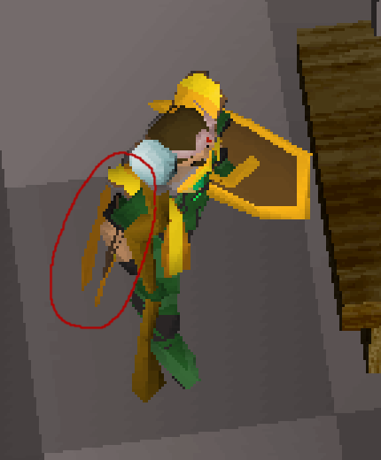

# RuneScratch

Rewrite of the osrs renderer.

## Building

```
cmake -B build -DCMAKE_BUILD_TYPE=Debug
cmake -B build -DCMAKE_BUILD_TYPE=Release
cmake .. -DCMAKE_BUILD_TYPE=Release
cmake -B build -DCMAKE_BUILD_TYPE=RelWithDebInfo

# For compiler invocations
make VERBOSE=1
```

### Building - Emscripten

```
emcmake cmake -B build.em -DCMAKE_BUILD_TYPE=Debug

cd build.em

emmake make
```

### Building - Linux

For linux, install bzip

```
sudo apt-get update && sudo apt-get install -y libbz2-dev
```

### Setup

Required dependencies

- SDL2
- CMake

#### Mac

Install SDL2.

```
brew install sdl2
```

### TODOS

1. Fix the need to `long long` in the texture renderer.
2. lighting for models - mergedgrounddecor
3. Consolodate sprite pixel loading.
4. Consolodate pixel blending
5. Consolodate face modes. (the whole colorc == -2 thing)
6. Animated textures
7. Scene manager (manage lifetimes of models etc, )
8. Varbits and VarP transforms. e.g. Lumbridge castle bank not showing.

Software rester

### Scene Building Plan - Software 3D

Cache Terrain -> World -> Scene

Scene is used by the renderer.

Loading the world.

1. Load static scene
   1. Load the models (and "Loc" metadata) for each tile
      1. Load models
      2. apply static transforms
      3. [if present] load animations
   2. Load scene ground; this requires shademap from step 1
   3. Shift bridge tiles down
   4. Calculate Normals
   5. Join Sharelight normals
   6. Apply lighting
2. Update game
   1. Clear previous entities
   2. Create entity elements for each entity (load new animations etc etc.)
      1. Load models
      2. apply static transforms
      3. [if present] load animations
      4. calculate normals, note: This is done per model rather than in a loop over all models.
      5. apply lighting
3. Prior to draw
   1. Add entity elements
   2. update animations on entities and on scene.
   3. update other things
4. During draw
   1. Painters algorithm
   2. Apply frustrum culling
   3. Compute draw commands
   4. For each face, check mouse intersection.

- Load the base model used for each model used.
- Load textures
- Copy models, then for each, apply
  - Animations
  - Rotations
  - etc.
- Painters algo

### Scene Rendering - Painter's Algo

Painters algorithm

- 1.  Draw Bridge Underlay (the water, not the surface)
- 2.  Draw Bridge Wall (the arches holding the bridge up)
- 3.  Draw bridge locs
- 4.  Draw tile underlay
- 5.  Draw far wall
- 6.  Draw far wall decor (i.e. facing the camera)
- 7.  Draw ground decor
- 8.  Draw ground items on ground
- 9.  Draw locs
- 10. Draw ground items on table
- 11. Draw near decor (i.e. facing away from the camera on the near wall)
- 12. Draw the near wall.

TODO: Compute near wall/far wall near decor/far decor

```
Picture a grid laid out with the eye at the center. (ignore direction)
+----------------------+
|                      |
|                      |
|                      |
|                      |
|         <=>  eye     |
|                      |
|                      |
|                      |
+----------------------+

We can draw the tiles from farthest to closes by coming diagonally inward from the corners.
It is easy to see that the corners are the farthest from the eye, so start there.

  x := drawn tile

  +----------------------+                  +----------------------+
  | x x              x x |                  | x x x          x x x |
  | x                  x |                  | x x              x x |
  |                      |                  | x                  x |
  |                      |                  |                      |
  |         <=>  eye     |       ==>        |         <=>  eye     |
  |                      |                  | x                  x |
  | x                  x |                  | x x              x x |
  | x x              x x |                  | x x x          x x x |
  +----------------------+                  +----------------------+


In pseudo-code, start from the northeast, northwest, southwest and southeast corners


  ne_tile = (X, Y)
  nw_tile = (0, Y)
  sw_tile = (0, 0)
  se_tile = (X, 0)

  tile_queue = (ne_tile, nw_tile, sw_tile, se_tile)

  while tile_queue not empty:
    tile = tile_queue.pop()

    draw_tile(tile)

    // If the tile is north east of the eye, queue south tile and west tile.
    // (towards the eye.)
    if tile is ne of eye:
      south_tile = (tile.x, tile.y - 1)
      west_tile = (tile.x - 1, tile.y)

    if tile is nw of eye:
      south_tile = (tile.x, tile.y - 1)
      east_tile = (tile.x + 1, tile.y)

    if tile is sw of eye:
      north_tile = (tile.x, tile.y + 1)
      east_tile = (tile.x + 1, tile.y)

    if tile is se of eye:
      north_tile = (tile.x, tile.y + 1)
      west_tile = (tile.x - 1, tile.y)

Now notice that there may be some overlap. e.g. in the northwest corner a tile
at (1, Y) south and (0, Y - 1) east will both queue the tile at (1, Y - 1).

Simply ignore this for now because this will come up later.

In this algorithm tiles farther away must be drawn completely before
closer tiles can start to draw. What this means in the northwest corner for
example, is if the north tile or west tile is still not drawn completely,
then we can't draw this tile. In pseudocode

  if tile is nw of eye:
    north_tile = (tile.x, tile.y + 1)
    west_tile = (tile.x - 1, tile.y)

    if north_tile is not drawn:
      skip

    if west_tile is not drawn:
      skip

This check will be important when scenery "locs" that span multiple tiles
come into play.

Consider a grid with locs L, M, N

  x := drawn tile
  L, M, N := Loc on tile

  <- West          East ->
  +----------------------+
  |     M M M            |
  |     L        N N     |
  |                      |
  |                      |
  |         <=>  eye     |
  |                      |
  |                      |
  |                      |
  +----------------------+

Let's focus our attention on the two locs

  <- West          East ->
  +----------------------+
  | x x M M M        x x |
  | x   L        N N   x |

If we're snaking diaganally inward, then this is the draw order

  ^1/2/3 := A tile that should be drawn, if simply snaking inward.

  <- West            East ->
  +------------------------+
  | x x ^1 M M    x  x x x |
  | x x ^2        N ^3 x x |
  | x x                x x |

  ^1 can't be drawn because the loc on that tile will be drawn, then the two
     underlays to the east would draw above the loc. Not what we want.
  ^2 can't be drawn because ^1 isn't drawn. The loc, L, on ^2 would draw behind
     M if M doesn't draw until all tiles under M are drawn. Not what we want.
  ^3 can't be fully drawn because the loc would be drawn below the tile to the west.
     This is the same case as ^1

So there are two cases that give us trouble.

1. Multi-tile locs can't be drawn until all the underlays under that loc are
   drawn, ^1, and ^3
2. Tiles cannot be drawn until tiles farther away are completely drawn.

What this means; have to break the drawing of tiles into multiple steps.

1. Draw the underlay
2. Draw the locs

Emphasizing, no drawing can start until farther tiles are completely drawn, but
we need to continue to draw underlays so that locs can be drawn.

So we amend our conditions.

Drawing of the underlay can start if both the farther tiles are either:

1. Completely drawn
2. Waiting on this underlay

In psuedo code (and only for northwest of eye):

  if tile is nw of eye:
    north_tile = (tile.x, tile.y + 1)
    west_tile = (tile.x - 1, tile.y)

    north_drawn_or_waiting = false
    if north_tile is done
        or north_tile is waiting on underlay:
      north_drawn_or_waiting = true

    west_drawn_or_waiting = false
    if west_tile is done
        or west_tile is waiting on underlay:
      west_drawn_or_waiting true

    if north_drawn_or_waiting
        and west_drawn_or_waiting:
      // Continue drawing tile
    else:
      skip

    draw_underlay(tile)
    tile.step = "draw_locs"

    if north_drawn and west_drawn:
      // Continue drawing tile
    else
      skip

    draw_locs(tile)
    tile.step = "done"

Now, running the algorithm to completion

  <- West            East ->
  +------------------------+
  | x x xM xM xM  x  x x x |
  | x x oL  o  o xN xN x x |
  | x x  o  o  o  o  o x x |
  | x x  o  o  o  o  o x x |
  | x x  x  x<=> eye x x x |
  | x x x x x x x x  x x x |
  | x x x x x x x x  x x x |
  | x x x x x x x x  x x x |
  +------------------------+

The tiles between the eye and the loc are no longer drawn because they we
blocked until M and N were drawn since M and N weren't ready when they were
queued to be drawn. Those tiles weren't ever checked again.

This can be fixed by check the adjacent tiles to each loc once a loc is drawn.
Queue up each of the tiles adjacent to the loc and the algorithm will continue.

  ! := A tile to check after M or N is drawn.

  <- West            East ->
  +------------------------+
  | x x  M M M    x  x x x |
  | x x           N  N x x |
  | x x                x x |

  <- West            East ->
  +------------------------+
  | x x  M M M !  x  x x x |
  | x x  ! ! ! !  N  N x x |
  | x x           !  ! x x |

  <- West            East ->
  +------------------------+
  | x x  M M M x  x  x x x |
  | x x  L        N  N x x |
  | x x              x x x |

  <- West            East ->
  +------------------------+
  | x x  M M M x  x  x x x |
  | x x  L x   x  N  N x x |
  | x x  x        x  x x x |

  <- West            East ->
  +------------------------+
  | x x  M M M x  x  x x x |
  | x x  L x x x  N  N x x |
  | x x  x x x x  x  x x x |
```

### Rendering Notes

```
Win_ said:
Thoughts?

QFC: 16-17-216-61384753

"When we're rendering our 3D scene, historically we have sorted all of our world entities (such as players, walls, particle effects etc) into view depth order. We then render them in this order, from furthest away to closest, giving the view you would expect, where nearer things appear over far things. Whilst this has the advantage of being quite fast, it's also somewhat inflexible, and leads to various graphical glitches that you're probably familiar with if you play in the 'Safe mode' or 'Software' graphics modes, whereby things appear to draw on top of - or through - each other when they shouldn't (player capes are an excellent example of this). With this update, we've moved to using an industry-standard technique called 'Z-buffering', which allows us to be a lot more flexible with our 3D rendering in the future. As an example, it allows us to have player kit or animations which extend outside of the square on which your character is standing. It also allows for more complex models and a number of other improvements which we've been wanting to do for a while."

~ Mod Chris E

The 'method' he is talking about is called Painter's algorithm...it is not the fastest way as far as I see it.
The reason?:
Your drawing more than you need to, and most of it won't be seen by the user (to solve this you would apply culling)
```

### Rendering Notes

Talking about z-buffering.

https://youtu.be/oKmHSSLFSbw?t=1810

They assign a "render order" (aka Priority).

### Rendering Notes - Decompiled Painters Algorithm

The decompiled renderer uses the "painters algorithm", and 12 layers.

Higher layers always appear on top of lower layers.

1. Sort model faces by depth. Note: The "depth" of a face is calculated as the average "z". (z0 + z1 + z2) / 3.
2. Partition the sorted faces into their respective layers. Since we are partitioning a sorted array, the resulting arrays are also sorted by layer.
3. For each layer, Render each face back to front

### Rendering Notes - Z Buffering with layers

I found that you can also render with z-buffering instead of sorting by depth.

1. Partition models in layer order.
2. For each layer, reset the z-buffer
3. then render each face.

### Rendering Notes

Interesting render

/Users/matthewevers/Documents/git_repos/runelite/runelite-client/src/main/resources/net/runelite/client/plugins/gpu/priority_render.cl

### Rendering Notes - Priority 10 and 11

These seem to be relevant when merging models. For example, model id 44 is a wizards hat and the brim is layer 10. Some I suspect that is something that relies on some dynamic behavior...

```
    case 10:
      if (distance > avg1) {
        return 0;
      } else if (distance > avg2) {
        return 5;
      } else if (distance > avg3) {
        return 9;
      } else {
        return 16;
      }
    case 11:
      if (distance > avg1 && _min10 > avg1) {
        return 1;
      } else if (distance > avg2 && (_min10 > avg1 || _min10 > avg2)) {
        return 6;
      } else if (distance > avg3 && (_min10 > avg1 || _min10 > avg2 || _min10 > avg3)) {
        return 10;
      } else {
        return 17;
      }
```

### Rendering Notes - OSRS

OSRS does appear to still use the painters algorithm.


### Rendering Notes - OSRS - Jagex (Mod Ry)

https://www.reddit.com/r/2007scape/comments/68di8r/infernal_cape_design_model_animation/

The biggest issue with this is that we can't use geometry that has an 'upwards' or top facing normal on capes because of how we sort polygon render order.

We don't have a z-buffer so render order is done with values of 1 - 9 that are individually assigned to polygons with the higher number always being rendered above those that are smaller.

Some typical values are:

Cape Outside: 7

Cape Inside: 2

Head: 8

Torso: 5

Legs: 3

The cape is higher than the torso because when viewed from behind we want the cape to be shown and not the torso. The back-face of polygons is culled so the cape becomes 'see through' when viewed from the front and doesn't cause order issues allowing the torso to be shown properly. The inside of the cape is the outside cape, duplicated and flipped with a lower value than the torso and legs so that it's correctly rendered behind them.

When we start to introduce polygons to the cape that stick out from the cape's regular plane we run into a problem where the 'top facing' polygons can be seen through the player because they have the highest render order. They can't be lower because otherwise the torso and/or legs will show where the rock is supposed to be when viewed from behind.


This effect can already be seen on capes that try to minimise this problem and have perfectly flat backs.



### Rendering Notes - OSRS - Bitset

The renderer also takes a "key" or "bitset", the bitset contains information about what the model is from the games perspective which is later used to see if things are clicked on.

It appears

Calculated

```c
   int entityType = bitset >> 29 & 0x3;

   entity_types
   0 := Player
   1 := NPC
   2 := Loc
   3 := Object Stack


    //  if (entityType == 0) {
    //   PlayerEntity *player = c->players[typeId];

    // if (entityType == 1) {
    //     NpcEntity *npc = c->npcs[typeId];

    // if (entityType == 2 && world3d_get_info(c->scene, c->currentLevel, x, z, bitset) >= 0) {
    // LocType *loc = loctype_get(typeId);

    // (entityType == 3) {
    //         LinkList *objs = c->level_obj_stacks[c->currentLevel][x][z];
```

Player_Mask = 0x0000_0000
NPC_Mask = 0x2000_0000
Loc_Mask = 0x4000_0000
Obj_Mask = 0x6000_0000 (1610612736 in dec)

### Rendering Notes

Model 135 has textures.

### Rendering Notes

The colors in face_colors_a, etc are stored as HSL. 16 bit?
g_palette is a HSL->RGB table.

### Cache information

https://www.osrsbox.com/osrs-cache/

### CRC Table

/Users/matthewevers/Documents/git_repos/openrs2-nonfree/client/src/main/java/BufferedFile.java

```
	static {
		for (@Pc(4) int i = 0; i < 256; i++) {
			@Pc(12) long crc = i;
			for (@Pc(14) int j = 0; j < 8; j++) {
				if ((crc & 0x1L) == 1L) {
					crc = crc >>> 1 ^ 0xC96C5795D7870F42L;
				} else {
					crc >>>= 1;
				}
			}
			CRC64_TABLE[i] = crc;
		}
	}
```

### Mouse Hit Detection OSRS

The OSRS client (based on the de-ob) does hit testing for GL and Software Models the same way. There are two methods of hit-testing they use. AABB hit box testing and Model Testing. Model testing checks each triangle.

For GL Models, it is done out of line with rendering, and each model gets the screen coords of its triangles.

### Sequence from RuneLite

Seq: 2650

"SequenceDefinition(id=2650, debugName=lordmagmus_ready, frameIDs=[827326465, 827326466, 827326467, 827326468, 827326469, 827326470, 827326471, 827326472, 827326473, 827326474, 827326475, 827326476, 827326477, 827326478, 827326479, 827326480], chatFrameIds=null, frameLengths=[6, 5, 5, 5, 5, 5, 5, 5, 5, 5, 5, 5, 5, 5, 5, 5], frameStep=-1, interleaveLeave=null, stretches=false, forcedPriority=5, leftHandItem=-1, rightHandItem=-1, maxLoops=99, precedenceAnimating=-1, priority=-1, replyMode=2, animMayaID=-1, frameSounds={}, animMayaStart=0, animMayaEnd=0, animMayaMasks=null)"

private void method3825(@OriginalArg(0) AnimBase base, @OriginalArg(1) AnimFrame arg1, @OriginalArg(2) AnimFrame arg2, @OriginalArg(3) int arg3, @OriginalArg(4) int arg4, @OriginalArg(5) boolean[] arg5, @OriginalArg(6) boolean arg6, @OriginalArg(7) boolean arg7, @OriginalArg(8) int parts, @OriginalArg(9) int[] arg9) {
if (arg2 == null || arg3 == 0) {
for (@Pc(5) int i = 0; i < arg1.transforms; i++) {
@Pc(14) short index = arg1.indices[i];
if (arg5 == null || arg5[index] == arg6 || base.types[index] == 0) {
@Pc(32) short prevOriginIndex = arg1.prevOriginIndices[i];
if (prevOriginIndex != -1) {
@Pc(42) int parts2 = parts & base.parts[prevOriginIndex];
if (parts2 == 65535) {
this.transform(0, base.bones[prevOriginIndex], 0, 0, 0, arg7);
} else {
this.transform(0, base.bones[prevOriginIndex], 0, 0, 0, arg7, parts2, arg9);
}
}
@Pc(77) int parts2 = parts & base.parts[index];
if (parts2 == 65535) {
this.transform(base.types[index], base.bones[index], arg1.x[i], arg1.y[i], arg1.z[i], arg7);
} else {
this.transform(base.types[index], base.bones[index], arg1.x[i], arg1.y[i], arg1.z[i], arg7, parts2, arg9);
}
}
}
return;
}

## Profiling

```
sudo ../profile.d -c ./scene_tile_test > out.stacks

sudo ../profile.d -c ./main_client > out.stacks
```

Then using flamegraph

Which you can get from here:
https://github.com/brendangregg/FlameGraph

```
# /Users/matthewevers/Documents/git_repos/FlameGraph

./stackcollapse.pl /Users/matthewevers/Documents/git_repos/3draster/build/out.stacks > out.folded
./flamegraph.pl out.folded > flamegraph.svg
open flamegraph.svg
```

## Profiling - Inline

```
# Dump symbols from binary (macOS)
dsymutil -s <binary_path> > symbols.txt

dsymutil -s ./build/main_client > symbols.txt
```

## Map Cache

Map Tiles are stored in sequence.

```
        for (let level = 0; level < Scene.MAX_LEVELS; level++) {
            for (let x = 0; x < Scene.MAP_SQUARE_SIZE; x++) {
                for (let y = 0; y < Scene.MAP_SQUARE_SIZE; y++) {
```

They are decoded in order.

Map viewer parallelizes the properties (Data Oriented style)

Ex.

```
       scene.tileOverlays[level][x][y] = readTerrainValue(
                        buffer,
                        this.newTerrainFormat,
                    );
                    scene.tileShapes[level][x][y] = (v - 2) / 4;
                    scene.tileRotations[level][x][y] = (v - 2 + rotOffset) & 3;
                } else if (v <= 81) {
                    scene.tileRenderFlags[level][x][y] = v - 49;
                } else {
                    scene.tileUnderlays[level][x][y] = v - 81;
```

In `src/rs/scene/SceneBuilder.ts`.`addTileModels`, the MapTiles are decoded to Map Models.
With vertices and colors and what not.

### Software Renderer RGB.

https://rune-server.org/threads/basis-for-a-software-based-3d-renderer.535618/page-2#post5034974

### Underlay Rendering


and 

This was based on some bad code from rs-map-viewer. The official deob only uses the "basecolor" or the "SW" color as it's named here, and then that basecolor is lit from 4 directions.

The RS Map Viewer uses RGB blending.

```
 underlay = &underlays[underlay_index];
                    underlay_hsl_sw = blended_underlays[COLOR_COORD(x, y)];
                    underlay_hsl_se = blended_underlays[COLOR_COORD(x + 1, y)];
                    underlay_hsl_ne = blended_underlays[COLOR_COORD(x + 1, y + 1)];
                    underlay_hsl_nw = blended_underlays[COLOR_COORD(x, y + 1)];

                    /**
                     * This is confusing.
                     *
                     * When this is false, the underlays are rendered correctly.
                     * When this is true, they are not.
                     *
                     * I checked the underlay rendering with the actual osrs client,
                     * and the underlays render correct when SMOOTH_UNDERLAYS is false.
                     *
                     * See
                     * 
                     * and 
                     *
                     */
                    if( underlay_hsl_se == -1 || !SMOOTH_UNDERLAYS )
                        underlay_hsl_se = underlay_hsl_sw;
                    if( underlay_hsl_ne == -1 || !SMOOTH_UNDERLAYS )
                        underlay_hsl_ne = underlay_hsl_sw;
                    if( underlay_hsl_nw == -1 || !SMOOTH_UNDERLAYS )
                        underlay_hsl_nw = underlay_hsl_sw;
```

### Lumbridge table

{
id: 596,
cacheInfo: {
name: "osrs-231_2025-07-02",
game: "oldschool",
environment: "live",
revision: 231,
timestamp: "2025-07-02T10:45:05.871289Z",
size: 141253676,
},
cacheType: "dat2",
lowDetail: false,
models: [
[
1276,
],
],
types: undefined,
name: "Table",
desc: undefined,
recolorFrom: undefined,
recolorTo: undefined,
retextureFrom: undefined,
retextureTo: undefined,
sizeX: 4,
sizeY: 1,
clipType: 2,
blocksProjectile: false,
isInteractive: 1,
contouredGround: -1,
contourGroundType: 0,
contourGroundParam: -1,
mergeNormals: false,
modelClipped: false,
seqId: -1,
decorDisplacement: 16,
ambient: 0,
contrast: 0,
actions: [

],
mapFunctionId: -1,
mapSceneId: -1,
flipMapSceneSprite: false,
isRotated: false,
clipped: true,
modelSizeX: 128,
modelSizeHeight: 128,
modelSizeY: 128,
offsetX: 0,
offsetHeight: 0,
offsetY: 0,
obstructsGround: false,
isHollow: false,
supportItems: 1,
transforms: undefined,
transformVarbit: -1,
transformVarp: -1,
ambientSoundId: -1,
ambientSoundDistance: 0,
ambientSoundChangeTicksMin: 0,
ambientSoundChangeTicksMax: 0,
ambientSoundRetain: 0,
ambientSoundIds: undefined,
seqRandomStart: true,
randomSeqIds: undefined,
randomSeqDelays: undefined,
params: undefined,
}

### Loc 16438

new Int8Array([19, 0, 79, 0, -6, 1, -12, 20, 0, 5, 8, -120, 8, -119, 8, 25, 8, 26, 8, 27, 78, 8, -120, 20, 0, 1, 1, 4, 81, 22, 0])

### Valgrind

On linux

```
valgrind --leak-check=full ./scene_tile_test

valgrind --leak-check=full ./scene_tile_test > log.txt 2>&1

# Callgrind must be built without ASan
valgrind --tool=callgrind  ./model_viewer > log.txt 2>&1
valgrind --tool=callgrind  ./scene_tile_test > log.txt 2>&1
callgrind_annotate $(ls callgrind.out.* | sort -V | tail -n 1) | less
kcachegrind $(ls callgrind.out.* | sort -V | tail -n 1) | less
```

## White triangles on textured

These are PNM faces and should not be drawn. Generally denoted by faceColorC = -2

Desk at op->x =29 z = 3
1148

## Flat Texture Shade VS Blend

```
if (this.faceColorC[face] == -1) {
  // Flat shade
  Pix3D.textureTriangle(vertexScreenY[a], vertexScreenY[b], vertexScreenY[c], vertexScreenX[a], vertexScreenX[b], vertexScreenX[c], this.faceColorA[face], this.faceColorA[face], this.faceColorA[face], vertexViewSpaceX[var6], vertexViewSpaceX[var7], vertexViewSpaceX[var8], vertexViewSpaceY[var6], vertexViewSpaceY[var7], vertexViewSpaceY[var8], vertexViewSpaceZ[var6], vertexViewSpaceZ[var7], vertexViewSpaceZ[var8], this.faceTextures[face]);
} else {
  // Blend shade
  Pix3D.textureTriangle(vertexScreenY[a], vertexScreenY[b], vertexScreenY[c], vertexScreenX[a], vertexScreenX[b], vertexScreenX[c], this.faceColorA[face], this.faceColorB[face], this.faceColorC[face], vertexViewSpaceX[var6], vertexViewSpaceX[var7], vertexViewSpaceX[var8], vertexViewSpaceY[var6], vertexViewSpaceY[var7], vertexViewSpaceY[var8], vertexViewSpaceZ[var6], vertexViewSpaceZ[var7], vertexViewSpaceZ[var8], this.faceTextures[face]);
}
```

[flat_shade](./res/texture_flat_shade_hslc-1.png)
[blend_shade](./res/texture_blend_shade.png)

## Texture Tiling

Runescape tiles textures automatically.

The left image is the texture renderer exactly from the deob.
The middle image is my texture renderer with tiling.
The right image is my texture redner with overflow highlights.

[tiling_proof](./res/measurement_texture_tiling.png)

## Server

```
python3 -m http.server -d public 8080
```

### Axis of rendering

zbuf
alpha
textured opaque
textured transparent (i.e. == 0 is masked out)
flat
gouraud
lerp8

### Model Loading

Model_copy_x from client3 exists to create copies of the data that is later
transformed in later steps. In this code, each model owns it's own copies always (for now)
so we do not have to worry. "sharelight" is an optimization to indicate that we need a copy
for this particular model.

1. Load from cache ("base")
2. Copy from cache and transform ("transformed base")
3. Copy from tranformed, animate and light.

The deob uses a "flyweight" type of structure.

### OSRS Textures

Textures are clamped on the U coordinate and tiled on the V coordinate.
See tree textures are "sideways" with transparency on the right.

This is why the deob rastering code only clamps U.

[tiled_texture](./res/sprite_455.bmp)

### Debug Information Tracking

Highlight model
Loc data

- model list
- everything else

### Flexible software render

Paint Command
metadata_key
model

For each model face.
Need osrs weird data?

### Varbits and VarPs

Some locs are actually specified by varbits and varps.
For example, the bank booth at the top of lumbridge castle,
the loc second from the right is specified via a transform.

### Some cache ids

#### Sprites

Mouse Click Yellow: 299 0-3
Mouse Click Red: 299 4-7

## Face Alphas

It appears that if a model has an animation, but no face alphas, then face alphas are all assumed to be "0" (opaque), this is so the animation can add transparency.

### Performance

Dane's client also gets about 10ms per scene draw.
https://discord.com/channels/788652898904309761/1069689552052166657/1171591528402133093


### Windows

In order for ninja to work, you need to set up your visual studio vars for powershell. See the microsoft powershell profile in scripts.

.\vcpkg.exe install sdl2:x64-windows bzip2:x64-windows zlib:x64-windows freetype:x64-windows

cmake -B build -DCMAKE_BUILD_TYPE=Release -DCMAKE_PREFIX_PATH=vcpkg/installed/x64-windows

& "C:\Program Files\Microsoft Visual Studio\2022\Community\VC\Auxiliary\Build\vcvars64.bat"; cmake -B build-ninja -G Ninja -DCMAKE_BUILD_TYPE=Release -DCMAKE_PREFIX_PATH=vcpkg/installed/x64-windows

& "C:\Program Files\Microsoft Visual Studio\2022\Community\VC\Auxiliary\Build\vcvars64.bat"; cmake -B build -DCMAKE_BUILD_TYPE=Release -DCMAKE_PREFIX_PATH=vcpkg/installed/x64-windows

cmd /c '"C:\Program Files\Microsoft Visual Studio\2022\Community\VC\Auxiliary\Build\vcvars64.bat" && cmake -B build-ninja -G Ninja -DCMAKE_BUILD_TYPE=Release -DCMAKE_PREFIX_PATH=vcpkg/insw lled/x64-windows'

cmake -B build-ninja -G Ninja -DCMAKE_BUILD_TYPE=Release
cmake -B build-pgi -G Ninja -DCMAKE_BUILD_TYPE=Release -DCMAKE_PREFIX_PATH=vcpkg/installed/x64-windows

cmake -B build-ninja2 -G Ninja -DCMAKE_BUILD_TYPE=Release -DCMAKE_PREFIX_PATH=vcpkg/installed/x64-windows

cmd /c '"C:\Program Files\Microsoft Visual Studio\2022\Community\VC\Auxiliary\Build\vcvars64.bat" && ninja -C build-ninja'

Your Visual Studio 2017 installation is probably missing the C packages (they are not automatically included with the Desktop development with C++ workload).

To install it, start the Visual Studio Installer, go to Individual components, and check Windows Universal C Runtime:

#### Building with MSVC

Configure your powershell terminal with vcvars.

```
# Visual Studio 2022 Community Environment Setup
# This automatically sets up the Visual Studio environment variables
# so you don't need to run vcvars64.bat before ninja commands

$vcvarsPath = "C:\Program Files\Microsoft Visual Studio\2022\Community\VC\Auxiliary\Build\vcvars64.bat"

if (Test-Path $vcvarsPath) {
    # Call the batch file and capture its environment variables
    cmd /c "`"$vcvarsPath`" && set" | ForEach-Object {
        if ($_ -match "^([^=]+)=(.*)$") {
            $name = $matches[1]
            $value = $matches[2]
            [Environment]::SetEnvironmentVariable($name, $value, "Process")
        }
    }

    Write-Host "Visual Studio 2022 Community environment loaded successfully!" -ForegroundColor Green
} else {
    Write-Host "Warning: Visual Studio 2022 Community not found at expected path: $vcvarsPath" -ForegroundColor Yellow
    Write-Host "Please update the path in your PowerShell profile if Visual Studio is installed elsewhere." -ForegroundColor Yellow
}
```

You must also set up vcpkg for SDL2.

```
cmake -B build-ninja -G Ninja -DCMAKE_BUILD_TYPE=Release -DCMAKE_PREFIX_PATH=vcpkg/installed/x64-windows
```

TODO: How to set up vcpkg and SDL2.

Then using cmake.

```
cmake -B build-pgi -G Ninja -DCMAKE_BUILD_TYPE=Release -DCMAKE_PREFIX_PATH=vcpkg/installed/x64-windows
```

#### Building with GCC and MinGW

MinGW (Minimalist GNU for Windows) provides a GCC compiler toolchain for Windows. It often provides better performance than MSVC for this project.

Note, when building with MinGW, you must also include `libwinpthread-1.dll` in addition to `SDL2.dll`

Also set up and a .bashrc script so you can type `make` instead of `mingw32-make`.

**Prerequisites:**

- Install MinGW-w64 (recommended: MSYS2 or standalone installer)
  `winget install --id MSYS2.MSYS2`

  ```
  C:\msys64\msys2_shell.cmd -defterm -here -no-start -mingw64 -c "pacman -Syu --noconfirm"

  C:\msys64\msys2_shell.cmd -defterm -here -no-start -mingw64 -c "pacman -S --noconfirm mingw-w64-x86_64-gcc mingw-w64-x86_64-cmake mingw-w64-x86_64-make mingw-w64-x86_64-SDL2 mingw-w64-x86_64-freetype mingw-w64-x86_64-bzip2 mingw-w64-x86_64-zlib"

  cmake -B build-mingw -DCMAKE_BUILD_TYPE=Release -G 'MinGW Makefiles'

  mingw32-make -j4
  ```

**Terminal Configuration**

```
   "MSYS2 Terminal": {
            "path": "C:\\msys64\\msys2_shell.cmd",
            "args": ["-defterm", "-here", "-no-start", "-mingw64"],
            "icon": "terminal-bash",
            "env": {
                "CHERE_INVOKING": "1",
                "MSYSTEM": "MINGW64",
                "HOME": "${workspaceFolder}/scripts"
            }
        },
```

**Installation Options:**

1. **MSYS2 (Recommended):**

   ```bash
   # Download and install MSYS2 from https://www.msys2.org/
   # Then install MinGW-w64 toolchain:
   pacman -S mingw-w64-x86_64-gcc mingw-w64-x86_64-cmake mingw-w64-x86_64-make
   ```

   Or using winget

   ```
   winget install --id MSYS2.MSYS2
   ```

2. **MSYS2 Terminal (Alternative):**

   - Install MSYS2 from https://www.msys2.org/
   - Use the MSYS2 terminal (not MinGW64 terminal) for a Unix-like environment
   - Install packages with: `pacman -S gcc cmake make`
   - Note: This uses the MSYS2 environment, not native Windows MinGW

3. **Standalone MinGW-w64:**
   - Download from https://www.mingw-w64.org/downloads/
   - Add `bin` directory to your PATH

**Dependencies:**

For MinGW builds, it's recommended to use MSYS2 packages rather than vcpkg:

```bash
# Using MSYS2 MinGW64 packages (recommended for native Windows MinGW)
pacman -S mingw-w64-x86_64-SDL2 mingw-w64-x86_64-bzip2 mingw-w64-x86_64-zlib mingw-w64-x86_64-freetype mingw-w64-x86_64-opengl

# Using MSYS2 terminal packages (Unix-like environment)
pacman -S SDL2 freetype2 mesa
```

**Building:**

```bash
# Configure with MinGW (using MSYS2 packages)
cmake -B build-mingw -G "MinGW Makefiles" -DCMAKE_BUILD_TYPE=Release

# Build (recommended - works regardless of make availability)
cmake --build build-mingw

# Alternative: Using mingw32-make (MinGW's make)
cd build-mingw
mingw32-make -j$(nproc)
```

**Static Linking (Optional):**

```bash
# Using MSYS2 static packages (recommended)
pacman -S mingw-w64-x86_64-SDL2-static mingw-w64-x86_64-bzip2-static mingw-w64-x86_64-zlib-static mingw-w64-x86_64-freetype-static

# Configure for static linking
cmake -B build-mingw-static -G "MinGW Makefiles" -DCMAKE_BUILD_TYPE=Release
cmake --build build-mingw-static
```

#### Performance

Windows s4 performance (sorting triangle points before rendering) is slower with msvc. Faster with GCC. GCC is about the same on Linux.

MSVC


GCC with MingGW


Thinkpad 14

Wasm


Native Mingw Static


### Building For Emscripten

Install emscripten with it's sdk

```
git clone https://github.com/emscripten-core/emsdk.git

# Windows
.\emsdk\emsdk.bat install latest
.\emsdk\emsdk.bat activate latest

.\emsdk\emsdk_env.ps1

# Test if found
.\emsdk\upstream\emscripten\emcc.bat --version

# Create build files
emcmake cmake -B build.em -DCMAKE_BUILD_TYPE=Release

# Unix Like
.\emsdk\emsdk install latest
.\emsdk\emsdk activate latest

.\emsdk\upstream\emscripten\emcc --version
emcmake cmake -B build.em -DCMAKE_BUILD_TYPE=Release
```

Then building=

```
cd build.em

emmake ninja

# or on unixlike

emmake make

# Then copy the build files.
# Windows
powershell -ExecutionPolicy Bypass -File scripts/copy_browser_files.ps1
```

Then copy the output to public/build

`python3 -m http.server -b 0.0.0.0 -d public/build 8000 `

`http://localhost:8000/main.html`

# World and model coords

+y is down
+z is away from camera (into)
+x is to the right.

# WebGL

My Moto X (Gen 1) has blacklisted chromium webgl2 drivers.
See here.
https://issues.chromium.org/issues/40114751

# Software Renderer integer limits

Previously I used to see a lot of crazy rendering artifacts where triangles are drawn all over. This is due to integer overflow.

The projection formula is

```
(x << 9) / z
```

Since the gouraud raster and texture raster shift x values up by 16, for a signed int, that means

```
((x << 9) / z) < (1 << 15)
```

For models that are very close to the screen plane and far off along the plane, this will result in overflow.

There are several parameters:

```
z_min_clip_bits := e.g. if clip if z < 16, then z_min_clip_bits 4 (i.e. the number of bits it takes to represent the clip)
xy_unit_scale_bits := (this is 9) aka 512
xy_max_bits

raster_unit_bits := 16
```

Since we are using signed 32 bit integers, to avoid overflow

```
xy_max_bits - z_min_clip_bits + xy_unit_scale_bits + raster_unit_bits < 31
```

In the code example, z is 50, so z_min_clip_bits = 5

```
# Note it must be LESS THAN 31, not equal to.
# -((1<<15) - 1) << 16
# -2147418112
# ((1<<15) - 1) << 16
# 2147418112
# Overflow here.
# ((1<<15)) << 16
# -2147483648

xy_max_bits - 5 + 9 + 16 < 31
xy_max_bits < 11

xy_max <= ((1 << 11) - 1)
```

So the max x input to projection is +-2047.
So triangles with values outside that range need to be clipped, or overflow will result.

### OSRS Vertex Order Winding

OSRS Vertexes are wound counterclockwise.

Can be seen by looking at the "near_clip" logic.

```
/**
 * This requires vertices to be wound counterclockwise.
 */
static inline void
raster_osrs_single_gouraud_near_clip(
    int* pixel_buffer,
```
