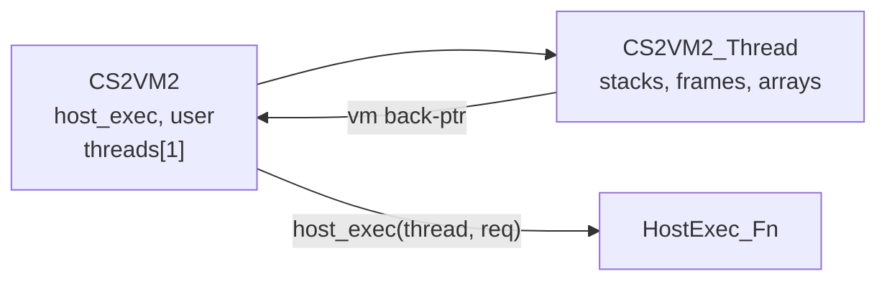

# CS2VM2 — ClientScript 2 bytecode interpreter

CS2VM2 is a yield-capable Jagex CS2 bytecode interpreter aligned with
[RuneStar/cs2](https://github.com/RuneStar/cs2). Opcode IDs and operand layout match
`Opcodes.kt` / `Script.kt` from that project (generated into `cs2_opcode.h`).

**Lineage:** `tools/interfacex` → `v1/vm/cs2vmx` → `src/cs2vm2`

The production C client's scheduler and atomic frame-publication contract are
documented in [CS2 execution and frame settlement](../../docs/CS2_EXECUTION.md).

The interpreter executes VM opcodes (arithmetic, control flow, stack ops) directly.
Anything that touches game state — inventory, vars, UI widgets, models, async loads —
is delegated to a single host callback (`CS2VM2_HostExec_Fn`).

## Folder layout

| File | Role |
|------|------|
| `cs2vm2.h` / `cs2vm2.c` | Public API and interpreter (~6.5k lines) |
| `cs2vm2_host.h` | `CS2VM_HostRequest` union and `CS2VM2_HostExec_Fn` |
| `cs2vm2_script.h` / `.c` | Decoded clientscript container (`CS2VM2_Script`) |
| `cs2vm2_trigger_args.h` / `.c` | Parse SETON* hook stack layout (`CS2VM2_TriggerArgsParse`) |
| `cs2vm2_strpool.h` / `.c` | Per-thread string pool backing every VM string (`CS2VM2_StrPool`) |
| `cs2_opcode.h` | Generated opcode constants |
| `cs2_opcode_meta.c` / `.h` | Operand kind and VM-vs-host dispatch metadata |
| `cs2vm2_opcode_stack.gen.h` | Per-opcode int/str stack push/pop deltas |
| `gen_opcode_stack.py` | Regenerates `cs2vm2_opcode_stack.gen.h` |

Script **decode** (cache → `CS2VM2_Script`) lives outside this folder — see
`dat2a_clientscript` in the repo. This folder owns runtime execution once a script
is decoded.

## Architecture

CS2VM2 splits shared host state from per-execution thread state:



### `CS2VM2` (VM shell)

| Field | Purpose |
|-------|---------|
| `host_exec` | Single callback for all world/UI ops |
| `user` | Opaque host userdata (`CS2VM_USER(thread)` reads this) |
| `threads[1]` | The execution context. One per block — see below |
| `thread_count` | Set to `CS2VM2_MAX_THREADS` by `CS2VM2_Init` |

`CS2VM2_MAX_THREADS` is 1, and concurrency is one script per *block* rather
than per slot: `CS2VM2_ThreadMain` and `CS2VM2_Run` both hand out `threads[0]`,
and a script that nests — awaits a load while another starts — acquires its own
VM from the free list in `cs2vm2.c`. This was 4, which cost every script 4x the
per-thread setup and teardown (`CS2VM2_Init` and `CS2VM2_Free` walk
`thread_count`, and the pool parks torn-down blocks) over three slots no code
could address. See the comment on the constant before raising it.

### `CS2VM2_Thread` (execution context)

Each thread is a self-contained interpreter state (formerly all of `CS2VMX`):

| Field | Purpose |
|-------|---------|
| `vm` | Back-pointer to parent `CS2VM2` (for host callback) |
| `ints_stack` / `strs_stack` | Dual operand stacks (`CS2VM_STACK_MAX` = 1024) |
| `frames` / `frame_sp` / `frames_live` | Call stack, grown on demand up to `CS2VM_MAX_FRAMES`; slots are pointers into a shared frame free list, and `frames_live` is the high-water mark |
| `active_component_id` / `dot_component_id` | IF/CC target resolution |
| `arrays` | Script-defined int arrays (`CS2VM2_MAX_ARRAYS`) |
| `str_pool` | Storage for every string the thread allocates (see below) |
| `children_iter_*` | Iterator state for CC/IF children-find opcodes |
| `canvas_w` / `canvas_h` | Host-provided canvas size for viewport ops |
| `yield_halt_*` | Tracks cooperative yields per opcode site |
| `last_error_*` | Diagnostics when `RunScript` returns `ERROR` |

### `CS2VM2_Frame` (call frame)

| Field | Purpose |
|-------|---------|
| `script` | Decoded bytecode being executed |
| `pc` | Program counter into `script->opcodes` |
| `int_locals` / `str_locals` | Per-frame locals (`CS2VM_MAX_LOCALS` = 1024) |
| `return_pc` / `return_frame` | Caller resume point after `RETURN` |
| `return_ints` / `return_int_count` | Int values returned to caller |

### `CS2VM2_Script` (decoded bytecode)

Populated by the external decoder. Holds `opcodes`, `int_operands`,
`string_operands`, switch tables, and argument/local counts. Use
`CS2VM2_ScriptInit` / `CS2VM2_ScriptFree` for lifecycle.

## How execution works

### Dual stacks

CS2 uses separate int and string operand stacks. The interpreter pops arguments
before each opcode and pushes results after. Stack effects for every opcode are
precomputed in `g_cs2vm2_opcode_stack[]` (from `gen_opcode_stack.py`).

### String storage — the thread's pool

Strings on the string stack, in a frame's `str_locals`, and in the host requests
built from them all live in the thread's `str_pool` (`cs2vm2_strpool.h`). Nothing
individually owns them:

- allocate with `CS2VM2_StrDup` / `CS2VM2_StrFmt` / `CS2VM2_StrDupLen` /
  `CS2VM2_StrAlloc` / `CS2VM2_StrEmpty` — never `strdup` or `malloc`;
- **never `free`** a string that came off the string stack or out of a frame
  local, and a popped string may be pushed straight back;
- the whole pool is released when a script starts (`CS2VM2_ResetRuntime`, which
  `CS2VM2_ThreadStart` calls) and when the VM is torn down (`CS2VM2_Free`) — so
  reset only *between* scripts, never mid-run;
- a host **borrows** a request's strings for the duration of the call. To keep
  one past the script, copy it (`UITree_ApplyText`, `VarCManager_SetString` and
  the SETON hook `str_args` buffers all do).

Because the pool brackets a script's whole run, a string also survives the
yield-and-replay of the opcode that produced it (see `CS2VM2_Op_OC_Find`).

`TORIRS_CS2_STRPOOL_DEBUG=1` prints each finished script's string count and byte
total.

### Opcode dispatch loop

`CS2VM2_RunScript` runs a fetch-decode-execute loop on the current thread:

1. Read `opcode`, `operand`, and optional `str_operand` from the top frame's script at `pc`.
2. Save a **yield checkpoint** (stack tops, frame count, component IDs, frame snapshots).
3. Dispatch to `CS2VM2_RunOp` — VM opcodes execute inline; host opcodes call `thread->vm->host_exec(thread, &request)`.
4. On `OK`: advance and continue (up to `CS2VM_MAX_CYCLES` = 1,000,000).
5. On `YIELD`: restore the checkpoint (rollback stack/frames/pc) and return to the host.
6. On `ERROR`: record `last_error_opcode` / `last_error_pc` / `last_error_script_id` and return.
7. On `DONE` / empty frame stack: script finished.

### Exec result codes

| Value | Name | Meaning |
|-------|------|---------|
| `0` | `CS2VM_EXECNO_OK` | Opcode succeeded; loop continues |
| `1` | `CS2VM_EXECNO_DONE` | Script finished (frame stack empty or pc past end) |
| `-2` | `CS2VM_EXECNO_YIELD` | Host must do async work, then re-enter `RunScript` |
| `-1` | `CS2VM_EXECNO_ERROR` | Fatal error; inspect `last_error_*` on the thread |

### Yield and checkpoint semantics

When a host opcode needs async work (load script, sprite, font, model, config, etc.),
the host returns `CS2VM_EXECNO_YIELD`. The interpreter **rolls back** stack tops,
frame count, and `pc` to the checkpoint saved before that opcode ran.

**Critical rule:** while handling a yield, the host must **not** partially mutate
VM stacks or frames. After external work completes, call `CS2VM2_RunScript` again —
the same opcode re-executes from scratch.

The `yield_halt_*` fields detect double-yields at the same opcode site (error).

#### Rolling back mutations to persistent VM fields

The checkpoint is deliberately **pointer-only** — it restores stack tops, `frame_sp`,
`pc`, and the component IDs, and copies nothing. That keeps the per-opcode cost near
zero, which matters because it runs on *every* opcode.

That is sufficient for the stacks (rolling the top back logically discards the
values), but not for fields that live outside them — an array cell, for instance.
An opcode that writes such a field and *then* yields would leave the write applied,
and re-executing the opcode on resume would apply it a second time.

Opcodes that mutate persistent VM fields therefore **opt in** to rollback by routing
the write through a tracked mutator rather than assigning directly:

```c
/* instead of: vm->arrays[slot].values[index] = value; */
CS2VM2_ArrayStore(vm, slot, index, value);
```

`CS2VM2_ArrayStore` records `(slot, index, old_value)` in `thread->undo_log` before
writing. `undo_log_len` is reset at each opcode boundary, so the log only ever holds
the in-flight opcode's mutations; on yield the restore walks it backwards and undoes
them. Opcodes that touch no persistent field append nothing and pay nothing.

Add new tracked mutators the same way when an opcode gains a persistent side effect
— do not widen the checkpoint into a bulk snapshot.

### Active vs dot component

IF and CC opcodes resolve widget targets through two component IDs on the thread:

- **Active** (`active_component_id`) — the hook source widget (onClick, onLoad, etc.).
- **Dot** (`dot_component_id`) — the `.` target in dotted component references.

`CS2VM2_SetActiveAndDotComponentId` sets both (typical for hook dispatch).
`CS2VM2_DotOrActiveComponentId(thread, operand)` picks one: operand `1` → dot,
otherwise active. `CS2VM2_SetTargetComponentId` updates one side.

### Script argument sentinels

Hook scripts receive special int argument values instead of real coordinates:

| Constant | Replaces |
|----------|----------|
| `CS2VM_SCRIPT_ARG_MOUSE_X` / `_MOUSE_Y` | Mouse position |
| `CS2VM_SCRIPT_ARG_WIDGET_ID` | Source widget |
| `CS2VM_SCRIPT_ARG_OP_INDEX` / `_OP_SUBINDEX` | Minimenu op |
| `CS2VM_SCRIPT_ARG_KEY_TYPED` / `_KEY_PRESSED` | Keyboard input |
| `CS2VM_SCRIPT_ARG_DRAG_TARGET_ID` / `_CHILD_INDEX` | Drag target |

The host fills these when pushing hook arguments before `PushCallScript`.

### GOSUB / RETURN

- `GOSUB_WITH_PARAMS` yields `CS2VM_HOST_REQUEST_GOSUB_WITH_PARAMS`; the host looks up the
  callee script and calls `CS2VM2_PushCallScript`.
- `RETURN` pops the frame and leaves return ints on the shared stack for the caller.

### SETON* trigger parsing

`CS2VM2_TriggerArgsParse(thread, &out)` pops the OSRS trigger-hook stack layout
(signature string, optional `Y` trigger list, typed argv, script id). Use this when
implementing `CC_SETONCLICK`, `IF_SETONVARTRANSMIT`, etc.

## Running a script

```c
struct CS2VM2 vm;
CS2VM2_Init(&vm);
CS2VM2_BindHost(&vm, my_host, MyHostExec);

struct CS2VM2_Thread* t = &vm.threads[0];
CS2VM2_ResetRuntime(t);
CS2VM2_PushCallScript(t, script);
CS2VM2_SetActiveAndDotComponentId(t, component_id);
/* optional: CS2VM2_SetIntCurrentFrameLocal(t, local, value) */

for (;;) {
    int rc = CS2VM2_RunScript(t);
    if (rc == CS2VM_EXECNO_DONE || rc == CS2VM_EXECNO_OK)
        break;
    if (rc == CS2VM_EXECNO_YIELD) {
        /* finish async host work, then continue */
        continue;
    }
    /* ERROR — inspect t->last_error_opcode, last_error_pc, last_error_script_id */
    break;
}

CS2VM2_Free(&vm);
```

`CS2VM2_Run(&vm)` is a convenience wrapper that calls `CS2VM2_RunScript` on
`threads[0]` once (no yield loop).

Compile with `-I<repo>/src/cs2vm2` and link `cs2vm2.c`, `cs2vm2_script.c`,
`cs2vm2_trigger_args.c`, and `cs2_opcode_meta.c`.

## What the host must implement

### Callback signature

```c
typedef int (*CS2VM2_HostExec_Fn)(
    struct CS2VM2_Thread* thread,
    struct CS2VM_HostRequest* request);
```

Register via `CS2VM2_BindHost(&vm, user, MyHostExec)`.

### Host responsibilities

1. **Dispatch on `request->kind`** — switch over `CS2VM_HostRequestKind` and read
   the matching payload from `request->u`.
2. **Return an exec code** — `CS2VM_EXECNO_OK`, `CS2VM_EXECNO_YIELD`, or
   `CS2VM_EXECNO_ERROR`.
3. **Push results for getters** — use `CS2VM2_PushInt` / `CS2VM2_PushStr` on success.
4. **Handle `GOSUB_WITH_PARAMS`** — look up `request->u.push_script.script_id`, decode if
   needed, call `CS2VM2_PushCallScript`.
5. **Respect yield semantics** — on `YIELD`, do not touch VM stacks/frames; re-enter
   `RunScript` after async work.
6. **Provide canvas size** — set `thread->canvas_w` / `thread->canvas_h` before
   scripts that call `GETCANVASSIZE` or viewport opcodes.
7. **Access host state** — `CS2VM_USER(thread)` casts `thread->vm->user` to your
   host struct.

### Request kinds

All request kinds are declared through `cs2vm2_host_request_kinds.def` in numeric
CS2 opcode order. Every hosted opcode has its own identically named request kind
and the same numeric value. Payload layouts can be shared, but request kinds are
never folded into generic categories; for example `CC_SETTEXT` and `IF_SETTEXT`
remain distinct throughout dispatch and yielding.

| Category | Examples | Host does |
|----------|----------|-----------|
| **Script control** | `GOSUB_WITH_PARAMS` | Push callee via `CS2VM2_PushCallScript` |
| **Inventory** | `INV_SIZE`, `INV_GETOBJ`, `INV_GETNUM`, `INV_TOTAL` | Read container slots, push results |
| **Vars** | `PUSH_VAR`, `PUSH_VARBIT`, `PUSH/POP_VARC_*` | Read/write game vars, push values |
| **Enum** | `ENUM`, `ENUM_STRING`, `ENUM_GETOUTPUTCOUNT` | Config enum table access |
| **CC (child component)** | `CC_CREATE`, `CC_SETPOSITION`, `CC_SETTEXT`, `CC_SETOBJECT`, `CC_GET*`, `CC_SETON*` | Create/update/query dynamic child widgets |
| **IF (interface)** | `IF_SETPOSITION`, `IF_SETTEXT`, `IF_SETON*`, `IF_GET*`, `IF_FIND` | Update/query interface layers |
| **Tree navigation** | `CC_FINDROOT`, `CC_CHILDREN_FIND_COUNT`, `IF_CHILDREN_FIND` | Walk component hierarchies |
| **Object config** | `OC_PARAM`, `OC_NAME`, `OC_COST`, `OC_STACKABLE` | Item/object definition lookups |
| **Misc** | `CLIENTCLOCK`, `STRUCT_PARAM`, `PARAHEIGHT`, `PARAWIDTH` | Clock, struct params, text layout |

Reference implementations (still on the CS2VMX API) live in `v1/games/`:

- `GameRunescape_CS2HostExec` — `v1/games/runescape_cs2_host.c`
- `GameInterfaceEditor_CS2HostExec` — `v1/games/game_interface_editor_cs2_host.c`

### Debugging

Set `g_cs2_trace_mode` (0 = off, 1 = targeted, 2 = all) and optionally
`CS2VM2_SetTraceExtra("...")` to annotate trace output to stderr.

In the client, `TORIRS_CS2_TRACE=1` dumps every executed opcode (script, pc, stack
depths, top-of-stack, `result=yield`), and `TORIRS_CS2_DUMP_SCRIPT=<id>` prints one
script's disassembly plus its `int_args` / `str_args` / `local_ints` counts.

## Bug postmortem: transposed `POP_ARRAY_INT` operands

**Symptom.** Roughly a fifth of the spell icons were missing from the rev-230 magic
tab (interface 218): 53 of 65 standard spells drawn, in a grid with scattered holes.
The absent spells were not hidden or un-decoded — they were never *positioned*, so
they stacked invisibly at the layout origin.

**Root cause.** `$array($index) = $value` compiles to `push index; push value;
POP_ARRAY_INT`, so at the opcode the **value is on top of the stack and the index sits
beneath it**. `CS2VM2_Op_PopArrayInt` popped them the other way round, writing
`array[value] = index`.

**Why it hid for so long.** A transposition is invisible whenever index == value.
Almost every CS2 array fill is exactly that shape — the spellbook builds its list with
`$visible_indices($visible_count) = $i` where the two counters advance together — so
the array came out looking perfectly correct (a clean `[0..64]` identity), and simple
array round-trip tests pass either way.

It only surfaces on an **asymmetric** write. `~magic_spellbook_sort` (script 2621) is a
recursive quicksort doing in-place swaps, where index and value are deliberately
different. Each swap wrote to the wrong cells, so the "sorted" result was not a
permutation: 65 entries collapsed to 51 distinct values with 14 duplicates. The layout
loop then positioned the same spell repeatedly and never visited the 14 lost indices.

**Diagnosis path.** Log every array read/write (slot, index, value, script, pc) and
replay them offline. The array reads the layout loop saw matched the writes exactly,
which ruled out the read path and any cross-VM interference, and pointed at the writes.
Comparing one concrete write against the decompiled source made it unambiguous: with
`$int1=0, $int2=64` the pivot is `$index4=32`, so `$intarray0($index4) = $intarray0($int2)`
must write `arr[32]=64` — the VM emitted `arr[64]=32`.

**Worth noting:** the yield machinery was the wrong suspect and cost the most time. The
sort does yield mid-way (on `oc_param` loading `spell_levelreq`), which looks damning.
Snapshotting and restoring *all* candidate state across the yield — frame locals, the
whole array, the int-stack values — changed nothing, which is what finally exonerated
it. `CS2VM2_ArrayStore` and the undo log came out of that investigation and are kept:
they close a real (if latent) replay hole, but they were not this bug.

**Lesson.** For any stack opcode taking two same-typed operands, verify the pop order
against real bytecode rather than intuition — a transposition is silent on symmetric
data and can lurk indefinitely.

## Opcode table regeneration

After updating `cs2_opcode.h` or `cs2_opcode_meta.c`:

```bash
python3 src/cs2vm2/gen_opcode_stack.py
```

Reads `cs2_opcode.h` and `cs2_opcode_meta.c` from this directory, writes
`cs2vm2_opcode_stack.gen.h`.

Opcode constants themselves are regenerated by:

```bash
python3 tools/cs2_gen_opcodes/gen_opcodes.py
```

(copy output into this folder or point the generator at `src/cs2vm2`).

## Relation to v1/vm

Production consumers (game hosts, tests, tools) still compile against `v1/vm`
(`cs2vmx.c`, `CS2VMX_*` API). This folder is the threaded rename/port:

| v1/vm (CS2VMX) | src/cs2vm2 (CS2VM2) |
|----------------|---------------------|
| `struct CS2VMX` (monolithic) | `CS2VM2` + `CS2VM2_Thread` |
| `CS2VMX_HostExec_Fn(vm, req)` | `CS2VM2_HostExec_Fn(thread, req)` |
| `CS2VMX_RunScript(&vm)` | `CS2VM2_RunScript(&vm.threads[0])` |

Not yet wired into Makefiles. Migrate hosts by adapting the callback signature
and threading model when ready.
