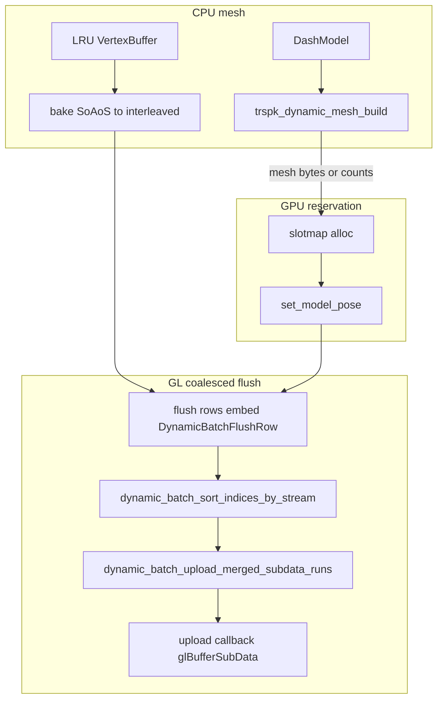

# ToriRSPlatformKit (TRSPK)

TRSPK is a modular C graphics toolkit for building concrete ToriRS platform renderers. It is a toolkit, not a framework: there is no central command dispatcher, no virtual interface, no tagged backend union, and no hash table for model lookups. Platform code owns its `TORIRS_GFX_*` switch statement and calls the specific backend/tools it needs.

## Folder Structure

```text
platforms/ToriRSPlatformKit/
├── README.md
├── include/ToriRSPlatformKit/
│   ├── trspk_types.h
│   ├── trspk_math.h
│   └── trspk_vertex_soaos_config.h
└── src/
    ├── trspk_math.c
    ├── tools/
    │   ├── trspk_resource_cache.h / .c
    │   ├── trspk_batch16.h / .c
    │   ├── trspk_batch32.h / .c
    │   ├── trspk_vertex_format.h / .c
    │   ├── trspk_vertex_buffer.h / .c
    │   ├── trspk_vertex_buffer_lifecycle.c
    │   ├── trspk_vertex_buffer_simd.u.c
    │   ├── trspk_vertex_buffer_simd.*.u.c   (NEON / AVX / SSE41 / SSE2 / scalar includes)
    │   ├── trspk_dash.h / .c
    │   ├── trspk_dynamic_pass.h / .c
    │   ├── trspk_dynamic_slotmap16.h / .c
    │   ├── trspk_dynamic_slotmap32.h / .c
    │   ├── trspk_dynamic_batch_upload.h / .c
    │   ├── trspk_lru_model_cache.h / .c
    │   └── trspk_facebuffer.h / .c
    └── backends/
        ├── metal/
        │   ├── trspk_metal.h
        │   ├── metal_core.m
        │   ├── metal_3d_cache.m
        │   ├── metal_dynamic_cache.m
        │   ├── metal_draw.m
        │   ├── metal_events.m
        │   ├── metal_shaders.m
        │   └── metal_vertex.h
        ├── webgl1/
        │   ├── trspk_webgl1.h
        │   ├── webgl1_core.c
        │   ├── webgl1_3d_cache.c
        │   ├── webgl1_dynamic_cache.c
        │   ├── webgl1_draw.c
        │   ├── webgl1_events.c
        │   ├── webgl1_shaders.c
        │   └── webgl1_vertex.h
        └── opengl3/
            ├── trspk_opengl3.h
            ├── opengl3_core.c
            ├── opengl3_3d_cache.c
            ├── opengl3_dynamic_cache.c
            ├── opengl3_draw.c
            ├── opengl3_events.c
            ├── opengl3_shaders.c
            ├── opengl3_gl.c / opengl3_gl.h
            └── opengl3_internal.h, opengl3_nk_gl_aliases.h
```

## Common toolkit (`include/` + `src/tools/` + `src/trspk_math.c`)

These modules are shared across backends (and sometimes platform glue). Each row is **what it does** and **where it is used**.

| Module | Purpose | Primary consumers |
|--------|---------|-------------------|
| `trspk_types.h` | Fixed IDs, `TRSPK_Vertex`, `TRSPK_ModelPose`, batch resources, atlas, bakes, vertex format enum | All tools and backends |
| `trspk_math.h` + `trspk_math.c` | Header: matrices, camera, HSL16, bake helpers, PNM UV, inline utilities. C file: linkage helpers (`trspk_dash_yaw_to_radians`, UV/animation packing, logical viewport → GL viewport), Dash HSL static asserts | Events, dash-related paths, GL viewport setup |
| `trspk_vertex_soaos_config.h` | Chooses SIMD lane count / block layout for AoSoS vertices (NEON, AVX2, SSE, or scalar) | `metal_vertex.h`, `webgl1_vertex.h`, `trspk_vertex_buffer_simd.u.c` |
| `trspk_vertex_format.*` | Vertex stride and conversion from canonical `TRSPK_Vertex` into a backend’s interleaved layout | `trspk_batch16` / `trspk_batch32`, vertex buffer lifecycle, dynamic caches |
| `trspk_vertex_buffer.*` + `trspk_vertex_buffer_lifecycle.c` + SIMD TUs | `TRSPK_VertexBuffer`: heap meshes, batch views, in-place bake, SoAoS → interleaved bake for GPU; allocation/free/duplicate; SIMD-backed bakes | Batches, `*_dynamic_cache.*`, LRU cache, `trspk_dynamic_pass` |
| `trspk_resource_cache.*` | CPU atlas, model poses, per-batch GPU handles; instance-draw pose lookup; optional pointer to a CPU mesh LRU | All backend cores, static and dynamic cache, event handlers |
| `trspk_lru_model_cache.*` | LRU of cooked `TRSPK_VertexBuffer` entries (model id × segment × frame) | Dynamic mesh uploads; model/animation/draw command handling when resolving Dash geometry |
| `trspk_batch16.*` | 16-bit index staging with automatic 65k vertex chunking | WebGL1 static path; 16-bit dynamic mesh build via `trspk_dynamic_pass` |
| `trspk_batch32.*` | 32-bit index staging, single continuous vertex/index stream | Metal and OpenGL3 static paths; 32-bit dynamic mesh and dash batch helpers |
| `trspk_dash.*` | Bridge from Dash/game types to TRSPK: fill `TRSPK_ModelArrays`, UV mode, RGBA128 texture scratch, add models to batch16/32, prepare sorted draw indices | `metal_events.m`, `webgl1_events.c`, `opengl3_events.c`; `trspk_dynamic_pass.c` |
| `trspk_dynamic_pass.*` | `trspk_dynamic_mesh_build` / `clear`: build a transient mesh from `DashModel` + bake + resource cache | Declared from `trspk_metal.h`, `trspk_webgl1.h`, `trspk_opengl3.h`; used by each `*_dynamic_cache.*` |
| `trspk_dynamic_slotmap16.*` / `trspk_dynamic_slotmap32.*` | Sub-allocate ranges inside dynamic VBO/EBO rings (16-bit map for WebGL1 limits; 32-bit for Metal and OpenGL3) | `webgl1_dynamic_cache.c`, `metal_dynamic_cache.m`, `opengl3_dynamic_cache.c` |
| `trspk_dynamic_batch_upload.*` | Sort GPU flush rows by stream, merge adjacent `glBufferSubData`-style uploads, optional merge scratch | WebGL1 and OpenGL3 dynamic flush paths (not Metal’s upload style) |
| `trspk_facebuffer.*` | Fixed-size on-stack index scratch (`TRSPK_FaceBuffer16` / `TRSPK_FaceBuffer32`) for sorted model indices | Platform renderers embed a facebuffer and pass its pointer into backend event helpers |

Model expansion from raw Dash-style arrays into GPU vertices is handled by **`trspk_vertex_buffer`** (writes and bakes), **`trspk_batch16` / `trspk_batch32`** (staging plus `trspk_vertex_format_convert`), and **`trspk_dash`** (fills `TRSPK_ModelArrays` from `DashModel` and calls the batch helpers). Older standalone `trspk_cache_model_loader16/32` modules are not present in this tree.

## Dynamic geometry: `trspk_dynamic_pass`, slotmaps, and `trspk_dynamic_batch_upload`

Moving meshes (NPCs, projectiles, and similar) reuse three concepts that sit at different stages of the pipeline. They are **related but not layered inside one another**: the backend composes them in order.

### `trspk_dynamic_pass` — CPU-only mesh construction

`trspk_dynamic_mesh_build` (and `trspk_dynamic_mesh_clear`) live in `trspk_dynamic_pass.*`. They **do not talk to OpenGL or Metal** and **do not use a slotmap**.

Implementation outline:

1. Create a **temporary** `TRSPK_Batch16` or `TRSPK_Batch32` for the requested `TRSPK_VertexFormat` (`WEBGL1` → batch16; `METAL` / `TRSPK` → batch32).
2. Call `trspk_dash_batch_add_model16` or `trspk_dash_batch_add_model32` so the same Dash expansion path used for static batches runs once for this model.
3. Read back the staged vertex and index bytes and **heap-copy** them into a `TRSPK_DynamicMesh` (`vertices`, `indices`, counts, `chunk_index` for WebGL1 when a single chunk is produced).

So **`trspk_dynamic_pass` is a convenience for “given a `DashModel`, produce one cooked interleaved mesh in CPU memory”**. Typical call sites are `trspk_webgl1_dynamic_store_mesh`, `trspk_*_dynamic_store_dynamic_mesh` helpers in `*_dynamic_cache.*`, and equivalent Metal/OpenGL3 paths that need mesh bytes before reservation or upload.

### `trspk_dynamic_slotmap16` / `trspk_dynamic_slotmap32` — where bytes live in the dynamic rings

Dynamic draw data is stored in **large per-usage ring buffers** (separate NPC vs projectile streams; WebGL1 also shards by **65k-safe chunk index**). A **slotmap** is a bump-allocator / free-list over the **vertex** and **index** byte ranges inside those rings:

- **`trspk_dynamic_slotmap16_alloc`** (WebGL1): given vertex and index counts, returns a `TRSPK_DynamicSlotHandle`, which **chunk** of the pre-sized chunk buffers to use, and **vertex/index offsets** within that chunk (counts are constrained so `uint16_t` indices remain valid).
- **`trspk_dynamic_slotmap32_alloc`** (Metal, OpenGL3): same idea on **one** pair of dynamic VBO/EBO buffers per usage class, returning **byte offsets** suitable for `uint32_t` indices.

After a successful alloc, the backend writes a **`TRSPK_ModelPose`** into the resource cache: GPU buffer identifiers (chunk VBO/EBO names on GL, or Metal buffer handles), `vbo_offset` / `ebo_offset`, `chunk_index`, `usage_class`, and `dynamic = true`. A parallel **handle table** keyed by `(model_id, pose_index)` stores the slotmap handle so **`trspk_dynamic_slotmap*_free`** can run when the mesh is replaced or unloaded.

**Relationship to `trspk_dynamic_pass`:** the slotmap answers “**where** should this mesh’s bytes go in GPU backing storage?”. `trspk_dynamic_mesh_build` answers “**what** are those bytes?”. A common sequence is: build mesh with `trspk_dynamic_mesh_build` → `alloc` from the slotmap → upload into the reserved range → record pose. **Deferred** paths instead call `alloc` and record the pose **first**, enqueue a deferred bake (LRU keys + offsets), and only materialize vertex bytes later at flush time (see below)—`trspk_dynamic_pass` is not used on that enqueue path, but the slotmap still reserves the destination range up front.

### `trspk_dynamic_batch_upload` — coalescing many GL `bufferSubData` calls

When many dynamic meshes update in one frame (especially the **deferred** path), each pending upload is described by a small **`TRSPK_DynamicBatchFlushRow`**: byte range (`vbo_beg_bytes`, `vbo_len_bytes`, same for EBO) plus **CPU source pointers** for that slice. Backend code embeds that struct inside a larger per-row struct (for example WebGL1’s flush row also carries usage class, chunk id, and a baked vertex buffer).

`trspk_dynamic_batch_upload` then:

1. **`trspk_dynamic_batch_sort_indices_by_stream`** — sorts row indices so flush rows are ordered by starting byte offset on either the **VBO** stream (`TRSPK_DYNAMIC_BATCH_STREAM_VBO`) or the **EBO** stream (`TRSPK_DYNAMIC_BATCH_STREAM_EBO`). That puts overlapping or adjacent ranges next to each other.
2. **`trspk_dynamic_batch_upload_merged_subdata_runs`** — walks the sorted list, **merges** runs whose byte ranges touch or overlap, and issues one **upload callback** per merged run. For a single row the callback receives that row’s CPU pointer; for merged runs it **`memcpy`s into a reusable merge scratch** (`TRSPK_DynamicBatchScratch.merge`) so the driver still sees one contiguous `glBufferSubData` per coalesced range.

The callback is backend-supplied (for example WebGL1 binds the chunk VBO or EBO and calls `glBufferSubData`). **Metal does not use this module for dynamic uploads**; Metal’s dynamic cache writes into `MTLBuffer` storage through the Objective-C API instead of sorting GL subdata rows.

### End-to-end picture



**Immediate upload** (example: `trspk_webgl1_dynamic_store_mesh`): `trspk_dynamic_mesh_build` → slotmap `alloc` → pose installed → **`trspk_webgl1_dynamic_upload_interleaved`** writes that mesh directly. No `trspk_dynamic_batch_upload` involvement.

**Deferred upload** (example: `trspk_webgl1_dynamic_enqueue_draw_mesh_deferred`): slotmap `alloc` and pose are done **before** vertex bytes exist; a queue entry remembers LRU keys, bake transform, and reserved offsets. At **`trspk_webgl1_pass_flush_pending_dynamic_gpu_uploads`**, the backend resolves the LRU mesh, bakes to interleaved WebGL1 vertices, fills `TRSPK_DynamicBatchFlushRow`s, then uses **`trspk_dynamic_batch_sort_indices_by_stream`** + **`trspk_dynamic_batch_upload_merged_subdata_runs`** per usage class, per chunk, and per stream so many small updates collapse into fewer `glBufferSubData` calls. OpenGL3’s dynamic cache follows the same batch-upload pattern on its GL buffers.

## File Purposes

`trspk_types.h` defines shared data types: fixed IDs, `TRSPK_Vertex`, `TRSPK_ModelPose`, `TRSPK_BatchResource`, atlas tiles, bake transforms, batch entries, and vertex format tags.

`trspk_math.h` and `trspk_math.c` provide math used while loading and drawing: matrix helpers, camera matrices, HSL16 color conversion, bake transform application, 64-to-128 RGBA upscaling, PNM UV projection, plus C-linkage helpers shared with Dash and GL viewport math.

`trspk_resource_cache.*` is the CPU metadata store. It uses fixed arrays indexed by model ID, texture ID, and batch ID. It tracks model poses, animation offsets, scene batch resources, bake transforms, atlas pixels, and atlas tile metadata. `trspk_resource_cache_create(capacity, vertex_format)` takes an optional CPU mesh LRU size (`0` disables LRU) and the vertex layout stored in that LRU.

`trspk_batch16.*` is a 16-bit batcher for WebGL1. It automatically creates chunks so each chunk stays within 65535 vertices.

`trspk_batch32.*` is a 32-bit continuous batcher for Metal and OpenGL3. It appends model geometry into one vertex/index stream (subject to backend upload policy).

**Metal:** `metal_core.m` owns device, command queue, frame semaphore, ring buffers, drawable acquisition, and frame begin/end. `metal_3d_cache.m` uploads atlas and merged static batch geometry, then records poses. `metal_dynamic_cache.m` manages dynamic slotmaps, LRU-backed meshes, and GPU ring uploads for moving geometry. `metal_draw.m` accumulates sorted indices and submits draws. `metal_events.m` dispatches ToriRS commands using `trspk_dash` and the resource cache.

**WebGL1:** `webgl1_core.c` owns context/program setup, atlas initialization, dynamic buffers, and frame begin/end. `webgl1_3d_cache.c` uploads atlas and chunked static batch geometry. `webgl1_dynamic_cache.c` mirrors dynamic slotmaps, LRU, and batched `bufferSubData` flushes via `trspk_dynamic_batch_upload`. `webgl1_draw.c` submits `glDrawElements` per active chunk. `webgl1_events.c` wires Dash commands into batches and draws.

**OpenGL3:** `opengl3_core.c` initializes with the current GL context, programs, and ring-buffered uniforms. `opengl3_3d_cache.c` uploads static batch32 data and world VAO state. `opengl3_dynamic_cache.c` uses 32-bit slotmaps and the same dynamic batch upload helpers as WebGL1 for efficient subdata. `opengl3_draw.c` records subdraws; `opengl3_events.c` integrates `trspk_dash` like the other desktop-oriented backend.

## How To Use

Initialize exactly one backend:

```c
TRSPK_MetalRenderer* metal = TRSPK_Metal_Init(ca_metal_layer, width, height);
TRSPK_WebGL1Renderer* webgl = TRSPK_WebGL1_Init("#canvas", width, height);
TRSPK_OpenGL3Renderer* gl3 = TRSPK_OpenGL3_InitWithCurrentContext(width, height);
```

Caches are created inside each `*_Init*` using a non-zero LRU capacity (for example `512`) and a backend-appropriate vertex format for LRU entries.

Write your own command switch. TRSPK intentionally does not define command types:

```c
TRSPK_Metal_FrameBegin(renderer);
TRSPK_ResourceCache* cache = TRSPK_Metal_GetCache(renderer);

while (LibToriRS_FrameNextCommand(game, commands, &cmd, true)) {
    switch (cmd.kind) {
    case TORIRS_GFX_BATCH3D_BEGIN:
        trspk_batch32_begin(TRSPK_Metal_GetBatchStaging(renderer));
        trspk_resource_cache_batch_begin(cache, cmd._batch3d_begin.batch_id);
        break;
    case TORIRS_GFX_BATCH3D_MODEL_ADD:
        trspk_batch32_add_model_textured(TRSPK_Metal_GetBatchStaging(renderer),
            model_id, TRSPK_GPU_ANIM_NONE_IDX, 0, vertex_count,
            vx, vy, vz, face_count, fa, fb, fc, ca, cb, cc,
            textures, textured_faces, tfa, tfb, tfc, alphas, infos,
            TRSPK_UV_MODE_TEXTURED_FACE_ARRAY, cache, bake);
        break;
    case TORIRS_GFX_BATCH3D_END:
        trspk_metal_cache_batch_submit(renderer, cmd._batch3d_end.batch_id, usage_hint);
        break;
    case TORIRS_GFX_DRAW_MODEL: {
        const TRSPK_ModelPose* pose = trspk_resource_cache_get_pose_for_draw(
            cache, cmd._model_draw.model_id, cmd._model_draw.use_animation,
            cmd._model_draw.anim_index, cmd._model_draw.frame_index);
        if (pose) {
            trspk_metal_draw_add_model(renderer, pose, sorted_indices, index_count);
        }
        break;
    }
    case TORIRS_GFX_STATE_END_3D:
        trspk_metal_draw_submit_3d(renderer, &view, &projection);
        break;
    }
}

TRSPK_Metal_FrameEnd(renderer);
```

## Loading vs Rendering

During loading (`BATCH3D_BEGIN` through `BATCH3D_END`), raw models and animation frames are baked into VBO/EBO data. Metal and OpenGL3 use `TRSPK_Batch32`, creating a single merged vertex/index stream for static scenery. WebGL1 uses `TRSPK_Batch16`, creating one VBO/EBO pair for each 65k-safe chunk. Each uploaded model or animation frame records a `TRSPK_ModelPose` in the resource cache.

Dynamic NPCs and projectiles use per-backend **slotmaps** and often the **LRU model cache** to reuse cooked CPU meshes before writing into dynamic GPU rings; WebGL1 and OpenGL3 may coalesce `bufferSubData` ranges with `trspk_dynamic_batch_upload`.

During rendering (`DRAW_MODEL` between `BEGIN_3D` and `END_3D`), platform code looks up a pose with:

```c
trspk_resource_cache_get_pose_for_draw(cache, model_id, use_anim, anim_index, frame_index);
```

Instance-style draws can use `trspk_resource_cache_get_pose_for_instance_draw` when layout and pose storage model IDs differ.

Metal then appends all visible scenery indices to a single dynamic `uint32_t` pool and submits one `drawIndexedPrimitives`. WebGL1 appends visible indices to the pool for `pose->chunk_index` and submits one `glDrawElements` per chunk with draws. OpenGL3 records subdraws (static VAOs plus dynamic ranges) and flushes according to its draw path.

## Texture Atlas

Textures are packed into a 2048x2048 atlas made from 128x128 tiles. Texture ID `N` maps directly to atlas cell `N`, so vertices only need to carry `tex_id`. `trspk_resource_cache_load_texture_128` copies RGBA pixels into the CPU atlas and updates `TRSPK_AtlasTile`.

Metal uploads the CPU atlas to one `MTLTexture` and stores the 256 `TRSPK_AtlasTile` records in an `MTLBuffer`.

WebGL1 and OpenGL3 upload the CPU atlas to one `GL_TEXTURE_2D` (tile metadata follows each backend’s shader strategy).

## Why WebGL1 Uses Tile Uniforms

WebGL1/GLES2 cannot read arbitrary shader storage buffers and does not have texture arrays in the baseline profile. Metal can bind a tile metadata buffer and read `tiles[tex_id]`; WebGL1 cannot.

The WebGL1 backend therefore packs tile metadata into two uniform arrays:

```glsl
uniform vec4 u_tileA[256]; // u0, v0, du, dv
uniform vec4 u_tileB[256]; // anim_u, anim_v, opaque, pad
```

The fragment shader uses `int(v_tex_id)` to select the tile. The backend tracks `tiles_dirty` and only calls `glUniform4fv` after texture metadata changes.

OpenGL3 uses a UBO-oriented world shader path instead of large uniform arrays; see `trspk_opengl3.h` and `opengl3_shaders.c`.

## Metal Uniform Ring Buffer

Metal uses a uniform ring buffer so the CPU does not overwrite uniform bytes that the GPU may still be reading. The ring has `TRSPK_METAL_INFLIGHT_FRAMES` frame slots. Each frame slot contains `TRSPK_METAL_MAX_3D_PASSES_PER_FRAME` pass slots, because a frame can contain multiple `BEGIN_3D`/`END_3D` pairs.

The uniform offset is:

```c
offset = frame_slot * (max_passes * aligned_uniform_size)
       + pass_subslot * aligned_uniform_size;
```

The dynamic index buffer uses a similar per-pass upload offset. WebGL1 uses immediate `glUniform*` calls instead, so it does not need a uniform ring buffer. OpenGL3 uses its own ring (`TRSPK_OPENGL3_INFLIGHT_FRAMES`, `TRSPK_OPENGL3_MAX_3D_PASSES_PER_FRAME`).

## Constraints

- Model lookup is array-based: `models[model_id]`
- Texture lookup is array-based: `atlas_tiles[texture_id]`
- Batch lookup is array-based: `batches[batch_id]`
- Max models: 32768
- Max textures: 256
- Max batches: 10
- WebGL1 chunk limit: 65535 vertices
- Atlas size: 2048x2048
- Tile size: 128x128

## Animation

The resource cache tracks bind, primary animation, and secondary animation segments:

- `TRSPK_GPU_ANIM_NONE_IDX`
- `TRSPK_GPU_ANIM_PRIMARY_IDX`
- `TRSPK_GPU_ANIM_SECONDARY_IDX`

Use `trspk_resource_cache_allocate_pose_slot` while loading animation frames, and `trspk_resource_cache_get_pose_for_draw` when a draw command arrives.
