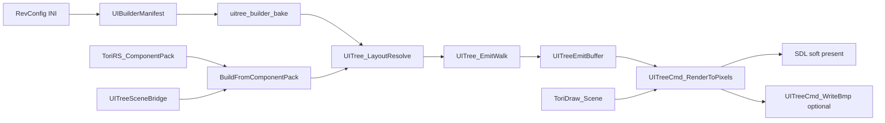
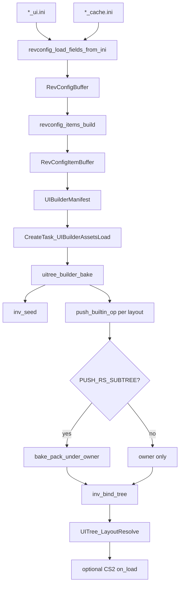

# UITree

> For the end-to-end live pipeline (load → layout → emit → input → CS2 scripts),
> the per-frame ordering rules, and the catalogue of bugs that were fixed along
> the way, see [docs/UI_RENDERER_ARCHITECTURE.md](../../docs/UI_RENDERER_ARCHITECTURE.md).
> This file is the module reference for `src/ui/` and the RevConfig bake path.

UITree is a flat array of linked nodes representing RS interface widgets and
client chrome (compass, minimap, sidebar slots, etc.). Nodes store integers only
(`scene_id`, `font_id`, `model_id`); pixel assets live in `ToriDraw_Scene`.

End-to-end pipeline:



Two construction entry points share the same layout → emit → render path:

| Path | Entry | Scope |
|------|-------|-------|
| Interface open | `CreateTask_InterfaceOpen` | One cache interface pack (current `main.c` demo) |
| RevConfig bake | `CreateTask_UITreeBuild` | Full chrome shell + mounted RS packs from INI |

---

## Build

### Shared conversion core

Cache widgets convert through an engine-free POD layer:

```
ToriRS_Component
  → UITree_FillBuildFromToriRS → UIBuildComponent
  → UITree_PushBuildComponent → UITreeNodeSpec → UITree_Push → UITreeComponent
```

`UITree_BuildFromSource` does **two passes**: insert every node (often as a
temporary root), then `UITree_Reparent` by `parent_id`. That handles forward
parent references in packs.

**Identity.** `UITreeComponent.component_id` is the RS packed id. Interface-level
ids `≤ 0xFFFF` pack as `(iface << 16)`; already-packed ids pass through
(`uibuilder_pack_component_id`). Child widgets use the low 16 bits.

**Type map.** `TORIRS_COMPONENT_*` → `UIBUILD_*` → `UIELEM_RS_*` /
`UIELEM_INV_GRID` (e.g. LAYER → `UIELEM_RS_LAYER`, GRAPHIC → `UIELEM_RS_GRAPHIC`).

### Interface open

`CreateTask_InterfaceOpen` (`engine/uitree_builder/task_interface_open.c`):

1. Load `ToriRS_ComponentPack` for the interface id
2. Load pack sprites/fonts/models (`CreateTask_PackAssetsLoad`)
3. Seed inv objs → obj icons via `UITreeSceneBridge_EnsureObjIcon`
4. `UITree_BuildFromComponentPack` (resolve callbacks upload into the scene bridge)
5. Upload model nodes (`EnsureModel`)
6. `UITree_LayoutResolve` → CS2 `on_load` / inv+var transmit → re-layout
7. Hide sibling roots belonging to other interface groups

Scene binding uses `UITreeSceneBridge`: cache graphic/font/model/obj-icon ids →
`ToriDraw_Scene` element ids stored on tree nodes.

### Runtime mutations

CS2 can load nested packs into the same tree and reparent pack roots under mount
parents. `UITree_CcCreate` allocates dynamic children with new ids.

---

## RevConfig

RevConfig is a declarative INI format for a revision’s client chrome shell:
named widgets, sprite/font cache bindings, inventory seeds, and layout
placements. Interface-open opens one IF pack; RevConfig builds the static frame
around (and under) those packs.

### INI split

| File | Sections |
|------|----------|
| `*_ui.ini` | `[component:]`, `[layout:]`, `[inv:]` |
| `*_cache.ini` | `[sprite:]`, `[font:]` archive bindings (dat2 `archive_id=`, or dat1 jagfile `filename=`/`format=`/`font_name=`) |

Examples: `v0/osrs/revconfig/configs/rev_245_2/rev_osrs_ui.ini`,
`rev_osrs_ui_cache.ini`, `v1/revs/configs/ui_min.ini`.

Parser lives under `src/revconfig/`. The modern bake path is
`src/engine/uitree_builder/`. (Legacy: `v0/osrs/revconfig/uitree_load.c` applied
INI fields directly into an older UITree without `UIBuilderManifest`.)

### Parse → manifest → bake

`CreateTask_UITreeBuild` (`task_uitree_build.c`):



**Item → manifest**

| RevConfig item | Manifest output |
|----------------|-----------------|
| `RCITEM_CACHE_SPRITE` / `FONT` | sprite / font req |
| `RCITEM_INV` | inv seed (`item=` strings) |
| `RCITEM_UICOMPONENT` needing RS | component pack req |
| `RCITEM_UILAYOUT` | one `UIBuilderTreeOp` per entry (`c=` → component; empty `c=` skipped) |

**Assets** (`CreateTask_UIBuilderAssetsLoad`): register sprites/fonts by name,
load archives, load unique inv obj ids, load each requested component pack.

**Bake** (`uitree_builder_bake`):

1. `uitree_builder_inv_seed` — apply `[inv:]` seeds into `InvManager`
2. For each layout op (parent-name order): push the owner node; if RS subtree,
   expand the cache pack under that owner (`bake_pack_under_owner`) and collect
   IF3 `on_load` hooks
3. `uitree_builder_inv_bind_tree` — bind sidebar / inv_grid nodes to named invs
4. Layout resolve; optional CS2 if `builder->host` is set

### Chrome builtins vs RS subtrees

| | Builtin | RS subtree |
|--|---------|------------|
| Op kind | `UIBUILDER_OP_PUSH_BUILTIN` | `UIBUILDER_OP_PUSH_RS_SUBTREE` |
| When | compass, minimap, world, sprite, redstone_tab, tab_icon, … | `componentno >= 0` and type is sidebar / chat / `rs_*` |
| Bake | Single `UITree_Push` from INI fields | Owner push **plus** full `ToriRS_ComponentPack` children |

RevConfig sprite ids come from the builder’s name registry (cache/archive ids;
dat1 names get synthetic provider ids assigned at load). Setting the optional
`UITreeBuilder.bridge` makes bake remap sprite ids to scene ids (EnsureSprite)
and upload fonts, so the baked tree renders directly — see
`test-uitree-builder-dat1`. With no bridge, nodes keep raw provider ids
(interface-open always uses the scene bridge).

### Example INI

```ini
[sprite:compass]
table=sprites
archive_id=169
atlas_index=0

[component:compass]
type=compass
sprite=compass
w=34
h=34
anchor_x=16
anchor_y=16

[component:sidebar_tab_3]
type=sidebar
tabno=3
componentno=149
inv=inventory

[inv:inventory]
item=1333

[layout:fixed]
n=fixed_shell
c=fixed_shell
x=0
y=0
=
n=compass_widget
p=fixed_shell
c=compass
x=546
y=6
w=29
h=29
=
n=sidebar_inventory
p=fixed_shell
c=sidebar_tab_3
x=547
y=205
w=190
h=261
```

(`=` separates layout entries inside one `[layout:group]` section.)

### Vs interface open

| | `CreateTask_UITreeBuild` | `CreateTask_InterfaceOpen` |
|--|--------------------------|----------------------------|
| Input | UI (+ cache) INI paths | Single `interface_id` |
| Scope | Chrome shell + mounted packs | One pack as the tree |
| Assets | Manifest-driven | Pack assets + scene bridge |
| Inv seed | `[inv:]` INI | Existing worn/backpack containers |
| CS2 | Optional (`host` may be NULL) | Required host; on_load + inv + var transmit |

---

## Layout

`UITree_LayoutResolve` (`uitree_layout.c`) is not a DFS walk. It:

1. Computes each node’s depth
2. Sorts **parent before child**
3. Writes absolute bounds into `position.abs_*` and sets `layout_resolved`

Default canvas: **765×503** (`UITREE_LAYOUT_ROOT_W/H`).

Rules of note:

- **XY / IF3 modes** — size and position from parent via `ui_if3_layout` helpers
  (`x_mode` / `y_mode` / `width_mode` / `height_mode`)
- **Relative** — `relative_flags` (left/top/right/bottom) + anchors
- **Layer scroll** — if `scroll_width` / `scroll_height` > 0, children lay out
  against scroll content size, not the visible box

`UITree_LayoutGetBounds` returns `abs_*` when resolved, else raw
`x/y/width/height`. Called after bake and again after CS2 onloads.

---

## Walk and emit

### Tree topology

Nodes live in `UITree.components[]`, linked by indices:

- `parent`, `first_child`, `next_sibling`
- Forest of roots via `tree->root_index` + sibling chain
- Walk stack depth capped at `UITREE_WALK_STACK_MAX` (64)

### Generic walk

`UITree_WalkAdvance` — iterative preorder used by hover, input, and scroll
hit-testing. Passing `current_visible=false` **prunes** the subtree (hidden
nodes, inactive sidebars).

### Emit walk

`UITree_EmitWalk` (`uitree_emit.c`) produces a command buffer:

1. Two full DFS passes over the forest: **non-text**, then **text** (text on top)
2. Per node: skip if `behavior.hide` (self **and** children); for clip layers
   (`RS_LAYER`, sidebar, chat, inv_grid) intersect clip with node bounds before
   descending; `UITree_EmitFill` → append `UITreeEmitDesc` when drawable
3. Children walked in sibling order

Visibility / gating:

| Mechanism | Role |
|-----------|------|
| `behavior.hide` | Emit skips entire subtree |
| `UITree_ComponentShouldEmit` | Host-dependent (tabs, cross, minimenu, …) |
| `trans >= 255` | Skip self draw; children still walked |

Dirty flags (`is_dirty` / `always_dirty` / `UITree_NodeNeedsEmit`) exist for
incremental emit, but the current `EmitWalk` emits all drawable nodes.

**IF1 scrollbars.** For `UIELEM_RS_LAYER` with `!if3` and
`scroll_height > height` (or width), emit appends `UITREE_EMIT_SCROLLBAR_V/H`
after children so chrome sits above content. Bar is 16px at the right (or
bottom) edge. `scroll_off_x/y` on child cmds are the accumulated ancestor
scroll offsets; on scrollbar cmds they hold the layer's `scroll_x/y` for thumb
placement. `scroll_content` is the layer `scroll_height` / `scroll_width`.
Arrow sprites come from `UITREE_HOST_GET_SCROLLBAR_SCENE` (cache archive
`"scrollbar"` frames 0/1); missing arrows fall back to solid fills.

Colors (ARGB): track `0xFF23201B`, thumb `0xFF4D4233`, highlight `0xFF766654`,
shadow `0xFF332D25`.

Containers that emit nothing themselves (unless IF1-scrollable layer):
sidebar, chat, chat button, redstone tab, tab icons, cross, minimenu,
inv_grid, inv_text. IF3 scroll layers do not get procedural chrome (CS2 sprite
trees handle those).

---

## Render

`UITreeCmd_RenderToPixels` (`engine/uitree_cmd_render.c`) drives Soft3D via
`ToriRS_Frame`, which expands each emit cmd into render commands.
`UITreeCmd_WriteBmp` wraps that for offline dumps. `main.c` presents live via SDL.

| Emit kind | Draw path |
|-----------|-----------|
| `SPRITE` | Scene sprite; outline/shadow/alpha/flip/rotate; IF3 stretch vs IF1 native; optional tile |
| `TEXT` | Scene font + `ToriDraw2D_DrawStringBox` |
| `RECT` | Fill or outline |
| `LINE` | `ToriDraw2D_DrawLine` |
| `MODEL` | Scene model + widget extents (zoom/angles/ortho) |
| `INV_SLOT` / `CC_OBJ` | Sprite blit when `scene_id > 0` |
| `SCROLLBAR_V` / `SCROLLBAR_H` | Expanded to arrows + track + thumb + bevel fills |
| `WORLD` / `MINIMAP` / `COMPASS` | Filled by `EmitFill`; Soft3D stubs ignore 2D placeholders |

`main.c` demo path: open interface → live SDL present (`UITree_EmitWalk` →
Soft3D frame → `PlatformSDL2_Present`); optional `--bmp`.

---

## Significant structs

### Core tree (`uitree.h`)

**`UITree`** — owner of the node array.

| Field | Purpose |
|-------|---------|
| `components` / `component_count` / `component_capacity` | Flat node storage |
| `root_index` | Head of the root sibling list (`-1` if empty) |
| `generation` | Bumped on structural changes |
| `next_dynamic_uid` | Allocator for CS2 dynamic children |

**`UITreeComponent`** — one node.

| Field | Purpose |
|-------|---------|
| `type` | `UITreeComponentType` (builtin or `UIELEM_RS_*`) |
| `parent` / `first_child` / `next_sibling` | Index links (`-1` = none) |
| `component_id` | RS packed id |
| `dynamic` / `dynamic_child_index` | CS2-created child metadata |
| `position` | Layout input + resolved `abs_*` |
| `behavior` | Hide, scripts, button/client codes, colors |
| `runtime_hooks` | CS2 event hooks (click, transmit, …) |
| `scroll_x` / `scroll_y` | Layer scroll offsets |
| `u` | Type-specific payload (sprite, text, graphic, model, inv_grid, …) |
| `is_dirty` / `always_dirty` | Emit eligibility (incremental path) |

**`UITreeElemPosition`** — geometry: `UIPOS_XY` or `UIPOS_RELATIVE`, IF3 modes,
aspect, and resolved `abs_x/y/w/h` + `layout_resolved`.

**`UITreeBehavior`** — `hide`, script arrays/comparators, `button_type`,
`client_code`, click mask, over/active colors.

**`UITreeRuntimeHooks`** — slots for on_click, on_hold, mouse, drag, scroll,
key, op, timer, and var/inv/misc transmit scripts.

**`UITreeNodeSpec`** — input POD to `UITree_Push` (mirrors component shape).

**`UITreeComponentType`** — builtins (`COMPASS`, `MINIMAP`, `SIDEBAR`, `CHAT`,
`WORLD`, `SPRITE`, …) and RS (`RS_TEXT`, `RS_GRAPHIC`, `RS_MODEL`, `RS_LAYER`,
`RS_RECT`, `RS_LINE`, `INV_GRID`, `INV_SLOT`, `CC_OBJ`, …).

### Build (`uitree_build.h`, `torirs_types.h`)

**`UIBuildComponent`** — flat cache-component view (geometry, graphic/font/model/inv
fields, hide/button/client_code). No engine headers.

**`UITreeBuildSource`** — `count` + callbacks: `get_component`, `get_parent_id`,
`resolve_sprite`, `resolve_font`.

**`ToriRS_Component`** — decoded IF1/IF3 widget from cache (`id`, `type`,
`parent_id`, layout modes, graphics, model, inv, scripts, hooks).

**`ToriRS_ComponentPack`** — `{ components, component_count }` for one interface
group.

### RevConfig / chrome bake

**`RevConfigBuffer` / `RevConfigItemBuffer`** (`revconfig.h`) — flat INI fields →
typed items (`RCITEM_*`).

**`UIBuilderManifest`** — collected bake plan: `sprites[]`, `fonts[]`,
`components[]`, `invs[]`, `ops[]`.

**`UIBuilderTreeOp`** — one layout placement: name, parent_name, type, geometry,
sprite/font/inv refs, menu/chat config; `kind` is `PUSH_BUILTIN` or
`PUSH_RS_SUBTREE`; `componentno` is the pack id for RS mounts.

**`UITreeBuilder`** — live bake context: provider, tree, invs, optional CS2 host,
INI paths, registered sprite/font name tables, collected `onloads[]`.

### Assets / scene (`uitree_scene_bridge.h`)

**`UITreeSceneBridge`** — uploads cache assets into `ToriDraw_Scene` and maps
cache ids → scene ids (`sprite_map`, `model_map`, `obj_icon_map`). Used by
interface-open / pack bake, not the RevConfig registry path.

### Emit / render (`uitree_emit.h`, `uitree_host.h`)

**`UITreeEmitKind`** — `SPRITE`, `TEXT`, `RECT`, `LINE`, `MODEL`, `INV_SLOT`,
`CC_OBJ`, scrollbars, `WORLD` / `MINIMAP` / `COMPASS`.

**`UITreeEmitDesc`** — one draw command: kind, node/component ids, bounds, clip,
`scene_id` / font / text / model fields, sprite blit params. Comment in header:
“Game resolves scene_ids.”

**`UITreeEmitBuffer`** — growable array of `UITreeEmitDesc`.

**`UITreeEmitClip`** — scissor rect `{x,y,w,h}` for children / draw.

**`UITreeHost`** — callback interface for tab selection, cross/minimenu
visibility, inv slot queries, and scene asset presence checks used during emit
and input.

---

## Key source map

| Path | Role |
|------|------|
| `src/ui/uitree.h` / `.c` | Tree, nodes, push/reparent, walk advance, CS2 mutators |
| `src/ui/uitree_build.h` / `.c` | `UIBuildComponent`, `BuildFromSource` |
| `src/ui/uitree_layout.h` / `.c` | Absolute layout resolve |
| `src/ui/uitree_emit.h` / `.c` | EmitFill + two-pass DFS emit walk |
| `src/ui/uitree_host.h` / `.c` | Host gating for emit / visibility |
| `src/engine/uitree_from_component.c` | `ToriRS` pack → UITree |
| `src/engine/uitree_scene_bridge.c` | Cache → scene id upload |
| `src/engine/uitree_cmd_render.c` | Emit buffer → BMP |
| `src/engine/uitree_builder/task_interface_open.c` | Open one interface pack |
| `src/engine/uitree_builder/task_uitree_build.c` | RevConfig chrome pipeline |
| `src/engine/uitree_builder/uitree_builder_manifest.c` | INI items → manifest |
| `src/engine/uitree_builder/uitree_builder_bake.c` | Manifest → tree |
| `src/engine/uitree_builder/uitree_builder_inv.c` | Inv seed / bind |
| `src/revconfig/` | INI parse → `RevConfigItemBuffer` |
| `src/engine/torirs_types.h` | `ToriRS_Component` / pack |
| `src/ui/test/` | Walk, layout, emit, dirty tests |
