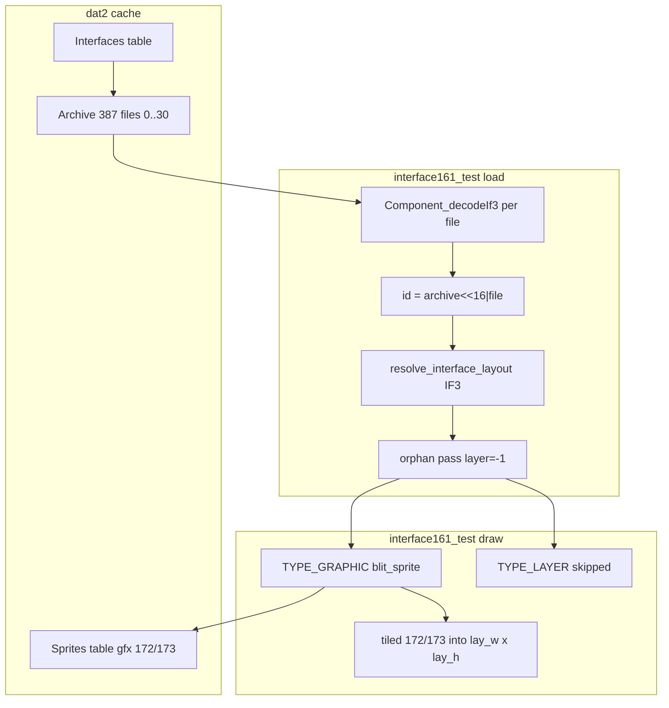

# `interface161_test`

Offline tool that loads a **dat2 interface archive** from an OSRS cache, decodes every widget as IF1/IF3 `Component`, resolves IF3 layout, and writes a **BMP screenshot** of what it can draw.

Use it to debug interface layout and rendering without running the full game client. It is the reference path for comparing against SDL2 / revconfig UI (for example Equipment panel archive **387**).

## What it does

1. Opens a cache directory (`main_file_cache.dat2` + index files).
2. Loads archive `N` from `RSCacheDat2Disk_Table_Interfaces` (`--iface`, default **161**).
3. Decodes each file in the archive with `Component_decodeIf1` / `Component_decodeIf3`.
4. Computes widget positions with the same IF3 layout helpers as production (`ui_if3_layout.h`).
5. Optionally blits drawable widgets to a fixed-size canvas and saves a 24-bit BMP.

**CS2 path** (runs for every render, not only with `--fixture`):

- Builds a `UITree` from decoded components.
- Seeds worn container **94** with 11 empty slots (interface **387**) so `onLoad` scripts can iterate `INV_SIZE`.
- Dispatches `**onLoad`** hooks on all components, then `**onInvTransmit**` where present.
- Re-runs `uitree_layout_resolve` after scripts mutate the tree.
- Draws dynamic `UIELEM_RS_GRAPHIC` chrome (gray button frames, slot backgrounds) and `UIELEM_CC_OBJ` item icons when `--fixture` is set.

**Drawn widget types:**


| Type | Meaning               | Notes                                                   |
| ---- | --------------------- | ------------------------------------------------------- |
| 2    | Inventory / INV slots | Empty-slot sprites from `invSlotGraphicId[]`            |
| 3    | Rectangle             | Fill or outline from `color`                            |
| 5    | Graphic               | Sprite from dat2 sprites table; supports tiling         |
| 4    | Text                  | Font raster via ToriDraw (`textFont`, color, shadow)    |
| 6    | Model                 | Rasterized when `modelType == 1` (inventory icon path)  |
| 9    | Line                  | Horizontal or vertical line from `color` / `lineWidth`  |
| 0    | Layer / container     | No static chrome; CS2 `onLoad` may add graphic children |
| CS2  | `UIELEM_RS_GRAPHIC`   | Dynamic chrome from `onLoad` (sprites 913/914, 170, …)  |
| CS2  | `UIELEM_CC_OBJ`       | 32×32 obj icons from CS2 / `--fixture`                  |


Static draw covers types **2–5**, **4**, **6** (modelType 1), and **9**. CS2 overlays add dynamic graphics, text, lines, and obj icons.

## Build

Standalone Makefile (not part of the root CMake graph):

```bash
make -C tools/interface161_test
# binary: tools/interface161_test/interface161_test
```

Optional sanitizer builds (slow on large CS2 script chains; prefer normal `make` for iteration):

```bash
make -C tools/interface161_test ASAN=1
```

## Usage

```
interface161_test <cache_directory> [--iface N] [--sprites]
                  [--fixture path.json] [--panel] [--root-w W] [--root-h H]
                  [--mount childFileIndex:ifaceId] ... [out.bmp]
```


| Flag                       | Description                                                                            |
| -------------------------- | -------------------------------------------------------------------------------------- |
| `<cache_directory>`        | Path to a dat2 cache (e.g. `cache.kronos`, `cache`)                                    |
| `--iface N`                | Interface archive id (default `161`)                                                   |
| `--sprites`                | Enable sprite blitting (required for visible INV/graphics output)                      |
| `--fixture path.json`      | Seed container 94/93, run CS2 `onInvTransmit` / runtime `SETONINVTRANSMIT`, then place any missing slot icons from the fixture |
| `--panel`                  | Use sidebar panel root size **190×261** instead of full viewport                       |
| `--root-w W`, `--root-h H` | IF3 virtual parent size (default **765×503**)                                          |
| `--mount fi:iface`         | Embed another interface archive at a child file index                                  |
| `--verbose-layout`         | Print per-widget layout to stderr (`file`, type, `lay_x/y/w/h`, graphic, tiled, layer) |
| `[out.bmp]`                | Output path (default `interface161_out.bmp`)                                           |


Decode-only (no BMP): omit `--sprites` and the output path. The tool still prints decode status per file.

## Architecture: cache → render

### Terminology

- **Interface id** = **dat2 archive id** in `RSCacheDat2Disk_Table_Interfaces` (e.g. **387**, **165**).
- **Packed widget id** = `(archive << 16) | file_index` — see `dump_interface` output (`0x01830009` = archive 387, file 9).
- `**layer` field** = parent's packed id. `**layer = -1`** = orphan (not reached by the in-archive tree walk; positioned in a second pass).

### Load path (`main.c`)

1. Open cache → `RSCacheDat2Disk_ArchiveNewLoad(Interfaces, N)`.
2. Decode each file with `Component_decodeIf1` / `Component_decodeIf3`; assign packed id on decode.
3. `**resolve_interface_layout**`: walk `layer` parent links from file **0** (root layer), apply `ui_if3_dat2_component_parent_relative_layout` per IF3 size/position modes.
4. **Orphan pass** (production parity): after the tree walk, components with `layer < 0` (except root) are laid out relative to the resolved root size — same second pass as `rs_component_walk_dat2` in `task_rs_component_load.c`.

### Render path


| Type | Name    | Drawn? | Notes                                                        |
| ---- | ------- | ------ | ------------------------------------------------------------ |
| 5    | GRAPHIC | yes    | Sprite from sprites table; `tiled` repeats into layout `w×h` |
| 4    | TEXT    | yes    | Font raster via ToriDraw                                     |
| 6    | MODEL   | yes*   | Rasterized when `modelType == 1`                             |
| 9    | LINE    | yes    | Horizontal or vertical line                                  |
| 3    | RECT    | yes    | Fill or outline                                              |
| 2    | INV     | yes    | Per-slot sprites from `invSlotGraphicId[]`                   |
| 0    | LAYER   | no     | Container / hitbox only (no chrome)                          |


`--mount child:archive` re-loads a sub-archive at the mount rect via the same `render_interface_archive()` helper (layout + orphan pass + draw). On gameframe **165**, children **8–21** resolve to sidebar rect **547,205** (190×261).

### In-archive parents vs runtime gameframe mounts

- **In-archive**: `layer` points to another widget in the **same** archive (e.g. equipment files 9–25 parent to file 0 in archive **387**).
- **Cross-archive**: gameframe **165** child **12** mounts archive **387** at runtime (`IF_SETTAB` / `osrs_kronos_ui.ini` `componentno`); this relationship is **not** stored in archive 387's component data.

### Equipment panel (archive 387): static vs CS2 chrome

Interface **387** mixes **static IF3 widgets** with **CS2 `onLoad` children**. Reference viewers ([qodat](https://github.com/Qodat/qodat), [Valkyr-Cache-Suite](https://github.com/ReverendDread/Valkyr-Cache-Suite)) decode IF3 layout correctly but **do not execute CS2** — they will not show the gray button frames or per-slot backgrounds.


| Visual element                   | Archive source                               | Mechanism                                                    |
| -------------------------------- | -------------------------------------------- | ------------------------------------------------------------ |
| Cross bars (sprites 172/173)     | files **09–14**, static `TYPE_GRAPHIC` tiled | Static draw + `--sprites`                                    |
| Toolbar button icons             | files **02/04/06/08**, orphans (`layer=-1`)  | Static draw + `--sprites`                                    |
| **Gray button frames** (913/914) | files **01/03/05/07** empty `TYPE_LAYER`     | CS2 `onLoad` **92 → 486 → 98**                               |
| **Slot gray box** (sprite 170)   | file **15** `TYPE_LAYER` hitbox              | CS2 `onLoad` **3281 → 3282** (only file 15 in current cache) |
| Item icons                       | —                                            | CS2 `cc_setobject` via runtime `SETONINVTRANSMIT` hooks, or `--fixture` fallback |


Draw order: static widgets → CS2 dynamic graphics → orphan toolbar icons redrawn on top → CS2 obj icons (fixture).


| Files           | Type                        | Role                                                        |
| --------------- | --------------------------- | ----------------------------------------------------------- |
| **09–14**       | GRAPHIC tiled 172/173       | Stone border / cross bars                                   |
| **01,03,05,07** | LAYER                       | Empty; CS2 adds gray button frame sprites                   |
| **02,04,06,08** | GRAPHIC orphan (`layer=-1`) | Toolbar button icons                                        |
| **15–25**       | LAYER                       | Hitboxes; file **15** gets CS2 slot background (sprite 170) |


`--sprites` is **required** for any visible chrome. Without it, only decode/layout status is printed.

### What this tool does NOT render

- Revconfig sprites (`invback`, `mapback`, tab stones) — those live in INI, not interface archives.
- Per-slot CS2 chrome on files **16–25** (only file **15** has `onLoad` 3281 in the current cache).
- Gameframe chrome beyond what archive **165** itself contains (mostly 1×1 mount layers).
- Full CS2 parity (all `CC_SET`* opcodes, varp-driven toolbar state).




## Which archive is the gameframe?

In dat2, an “interface id” is an **archive id** in the interfaces table. Packed widget ids are `(archive << 16) | file_index` (see `dump_interface --parents`).


| Archive             | Role                                          | Root size           | What you see with `--sprites`                                                    |
| ------------------- | --------------------------------------------- | ------------------- | -------------------------------------------------------------------------------- |
| **165**             | Fixed-mode **gameframe** (logical mount tree) | 765×503             | Mostly layers + one rect; sidebar slots are 1×1 mount points (children **8–21**) |
| **161**             | Resizable-mode **shell** (chrome graphics)    | 800×600             | Tab row + frame sprites baked into the archive                                   |
| **387**, **149**, … | Sidebar **tab panels**                        | 190×261 (`--panel`) | Equipment, inventory, etc.                                                       |


The full in-game fixed HUD (invback, mapback, tab stones, world viewport) is assembled from **revconfig sprites + archive 165 + tab archives**. This tool renders **cache archives only**; it does not load `osrs_kronos_ui.ini` chrome.

### Fixed gameframe + one sidebar tab (equipment)

Archive **165** is the gameframe root. Mount the equipment panel (**387**) on child **12** (tab 4 per `osrs_kronos_ui.ini`).

**Slot chrome** (no item icons):

```bash
./tools/interface161_test/interface161_test cache --iface 165 --sprites \
  --mount 12:387 \
  build/gameframe_165_equipment.bmp
```

With sample worn items (`--fixture` is for item icons, not slot frames):

```bash
./tools/interface161_test/interface161_test cache --iface 165 --sprites \
  --mount 12:387 \
  --fixture tools/interface161_test/fixtures/equipment_387.json \
  build/gameframe_165_equipment.bmp
```

Sidebar mount slots on archive 165 are 1×1 logical layers; the tool places mounts at the fixed-shell sidebar rect **547,205** (190×261) for children 8–21.

**Tab → archive → gameframe child** (fixed mode, screen 165):


| Tab         | Panel archive | Mount child |
| ----------- | ------------- | ----------- |
| 0 Combat    | 593           | 8           |
| 1 Stats     | 320           | 9           |
| 2 Quest     | 720           | 10          |
| 3 Inventory | 149           | 11          |
| 4 Equipment | 387           | 12          |
| 5 Prayer    | 541           | 13          |
| 6 Magic     | 218           | 14          |
| 7 Clan      | 7             | 15          |
| 8 Account   | 720           | 16          |
| 9 Friends   | 429           | 17          |
| 10 Logout   | 182           | 18          |
| 11 Options  | 261           | 19          |
| 12 Emotes   | 216           | 20          |
| 13 Music    | 239           | 21          |


Example — inventory tab on the gameframe:

```bash
./tools/interface161_test/interface161_test cache --iface 165 --sprites \
  --mount 11:149 \
  build/gameframe_165_inventory.bmp
```

### Resizable shell only (archive 161)

For the resizable frame graphics (no tab panel mounted):

```bash
./tools/interface161_test/interface161_test cache --iface 161 --sprites \
  --root-w 800 --root-h 600 \
  build/gameframe_161.bmp
```

### Sidebar panel only (no gameframe)

**Slot chrome only** — equipment gray box frames (archive **387**, panel size). No item icons:

```bash
./tools/interface161_test/interface161_test cache --iface 387 --sprites \
  --panel build/interface_387_panel.bmp
```

To add worn item icons on top of slots, add `--fixture` (CS2 path; does not draw slot frames):

```bash
./tools/interface161_test/interface161_test cache --iface 387 --sprites \
  --panel \
  --fixture tools/interface161_test/fixtures/equipment_387.json \
  build/interface_387_panel.bmp
```

## Equipment panel example (interface 387 + fixture)

Interface **387** is the Kronos/OSRS **Equipment** sidebar panel (`componentno=387` in `osrs_kronos_ui.ini` / `osrs_static_ui.ini`).

The bundled fixture seeds container **94** (worn) with sample items at equipment slot file indices **15**, **18**, **19**, **21**, **23**. The CS2 `onInvTransmit` script reads `inv_getobj` / `inv_size` and calls `cc_create` + `cc_setobject` to place icons (same path as the live client after `GameRunescape_DispatchInvTransmit`).

From the repo root (requires `cache.kronos/` or your own dat2 cache):

```bash
make -C tools/interface161_test

./tools/interface161_test/interface161_test cache --iface 387 --sprites \
  --fixture tools/interface161_test/fixtures/equipment_387.json \
  build/interface_387.bmp
```

Sidebar panel size (matches in-game panel chrome):

```bash
./tools/interface161_test/interface161_test cache --iface 387 --sprites \
  --fixture tools/interface161_test/fixtures/equipment_387.json \
  --panel build/interface_387_panel.bmp
```

## Fixtures

Fixture files are minimal JSON. Keys under `"slots"` are **archive file indices** (strings); each value has an `"obj"` id used to seed the worn/backpack container (and rasterize icons when `--sprites` is set).

Example (`fixtures/equipment_387.json`):

```json
{
  "slots": {
    "15": { "obj": 1153 },
    "18": { "obj": 1333 },
    "19": { "obj": 1115 },
    "21": { "obj": 1189 },
    "23": { "obj": 1067 }
  }
}
```

Copy and edit this file to test other slot layouts or obj ids.

## Batch export (interfaces 1–500)

`run_interfaces_1_500.mjs` loops archive ids and writes one BMP per interface:

```bash
node tools/interface161_test/run_interfaces_1_500.mjs /path/to/cache --sprites \
  --out-dir build/interface_exports
```

Options: `--binary PATH` to point at a non-default executable.

## Related tools

- `[dump_interface](../dump_interface/)` — human-readable text/JSON dump of widget fields (no rendering).
- `[dump_interface_layout](../dump_interface_layout/)` — layout-only listing (can be slow on large caches).

## Files


| File                              | Role                                       |
| --------------------------------- | ------------------------------------------ |
| `main.c`                          | CLI, decode, layout, draw, BMP export      |
| `cs2_runner.c` / `cs2_runner.h`   | CS2 VM + onLoad/onInvTransmit hook runner  |
| `enum_lookup.c` / `enum_lookup.h` | Cache-backed `ENUM` opcode for CS2 scripts |
| `fixture.c` / `fixture.h`         | JSON fixture loader and obj icon cache     |
| `stubs.c`                         | Linker stubs for ToriAuxLib VM / CS2 host  |
| `fixtures/equipment_387.json`     | Sample worn items for interface 387        |
| `run_interfaces_1_500.mjs`        | Batch BMP export script                    |
| `Makefile`                        | Standalone build                           |


